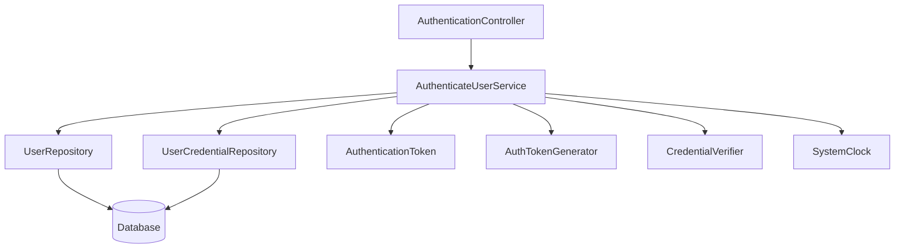
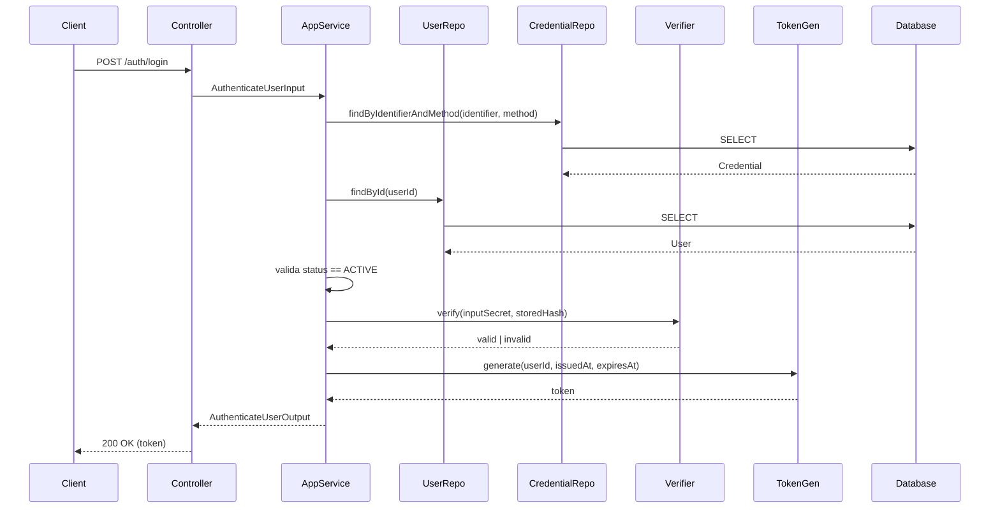
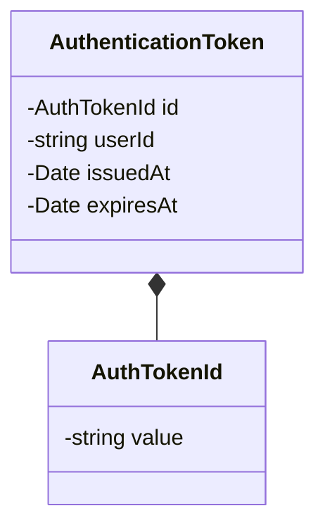
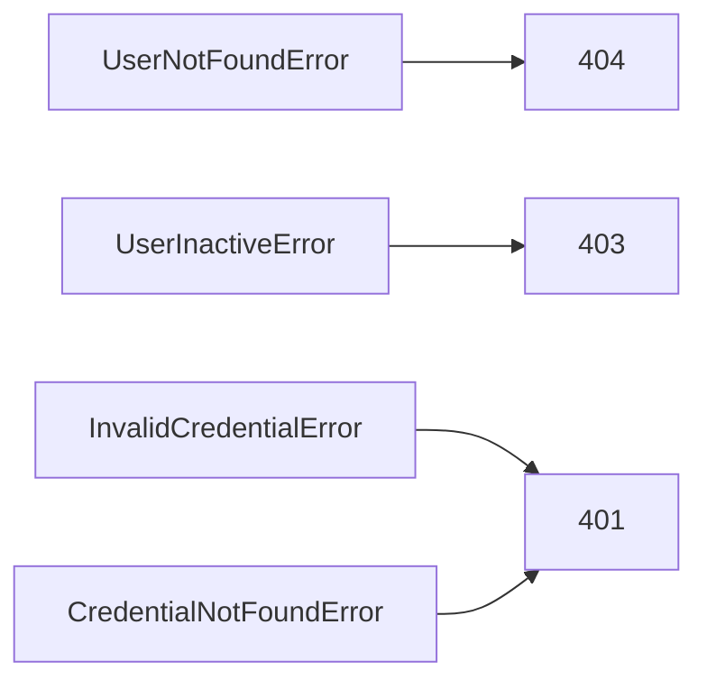

# Authenticate User

**Created**: 2025-12-29

**Spec**: `./spec.md`

**Project**: `../project.md`

---

## Overview

A capability **Authenticate User** autentica uma identidade **ativa** a partir de credenciais previamente registradas e, em caso de sucesso, **emite um token de autenticação**.

Ela **não interpreta autorização**, **não carrega permissões**, **não decide comportamento de negócio** e **não mantém estado de sessão** além do token emitido.

O fluxo segue **Presentation → Application → Domain → Infrastructure**, com decisões criptográficas e de token **isoladas na Infrastructure**.

---

## Component Map

### Domain Layer

| Tipo | Nome | Responsabilidade |
| --- | --- | --- |
| Entity | `AuthenticationToken` | Representa um token emitido |
| Value Object | `AuthTokenId` | Identificador do token |
| Value Object | `TokenExpiration` | Expiração do token |
| Repository Interface | `UserRepository` | Consulta de identidade |
| Repository Interface | `UserCredentialRepository` | Consulta de credenciais |

📌 O Domain **não valida segredo** e **não conhece algoritmo criptográfico**.

---

### Application Layer

| Tipo | Nome | Responsabilidade |
| --- | --- | --- |
| App Service | `AuthenticateUserService` | Orquestra a autenticação |
| Input DTO | `AuthenticateUserInput` | Dados fornecidos pelo usuário |
| Output DTO | `AuthenticateUserOutput` | Token emitido |

---

### Infrastructure Layer

| Tipo | Nome | Responsabilidade |
| --- | --- | --- |
| Credential Verifier | `CredentialVerifier` | Valida segredo (hash compare) |
| Token Generator | `AuthTokenGenerator` | Gera token assinado |
| Clock Adapter | `SystemClock` | Fonte de tempo |
| Repository Impl | `PrismaUserCredentialRepository` | Persistência |
| Repository Impl | `PrismaUserRepository` | Persistência |

📌 JWT, libs crypto e formato do token **vivem aqui**.

---

### Presentation Layer

| Tipo | Nome | Responsabilidade |
| --- | --- | --- |
| Controller | `AuthenticationController` | Endpoint de login |

---

## Dependency Graph

---

## Data Flow

### Fluxo: Autenticar Usuário

---

## Entity Structure

### AuthenticationToken

📌 O token **não carrega permissões, roles ou grants**.

---

## Repository Operations

| Operação | Descrição | Usada por |
| --- | --- | --- |
| `findByIdentifierAndMethod(identifier, method)` | Localiza credencial | AuthenticateUserService |
| `findById(userId)` | Localiza identidade | AuthenticateUserService |

---

## API Endpoints

| Método | Path | Operação | Sucesso | Erros |
| --- | --- | --- | --- | --- |
| POST | `/auth/login` | Autenticar | 200 | 401, 403, 404 |

---

## Error Handling

| Erro | Quando | Code |
| --- | --- | --- |
| UserNotFoundError | Identidade inexistente | `USER_NOT_FOUND` |
| UserInactiveError | Usuário INACTIVE | `USER_INACTIVE` |
| InvalidCredentialError | Segredo inválido | `INVALID_CREDENTIAL` |
| CredentialNotFoundError | Credencial inexistente | `CREDENTIAL_NOT_FOUND` |

📌 Todos os erros **negam autenticação** e **não retornam token**.

---

## Alignment Notes (Spec-Driven)

- Autenticação **exige usuário ACTIVE**
- Credenciais inválidas **sempre negam**
- Token **não implica autorização**
- Nenhuma permissão é resolvida aqui
- Nenhum estado de sessão é criado

---

## Implementation Notes

- Verificação de segredo **isolada na Infrastructure**
- Token é **opaco para módulos consumidores**
- Clock injetado para testes determinísticos
- Nenhum cache de autenticação
- Nenhum acoplamento com Permissions Provider
- `identifier` normalizado (trim + lowercase) antes da busca
- `identifier` validado como email ou username antes da busca
