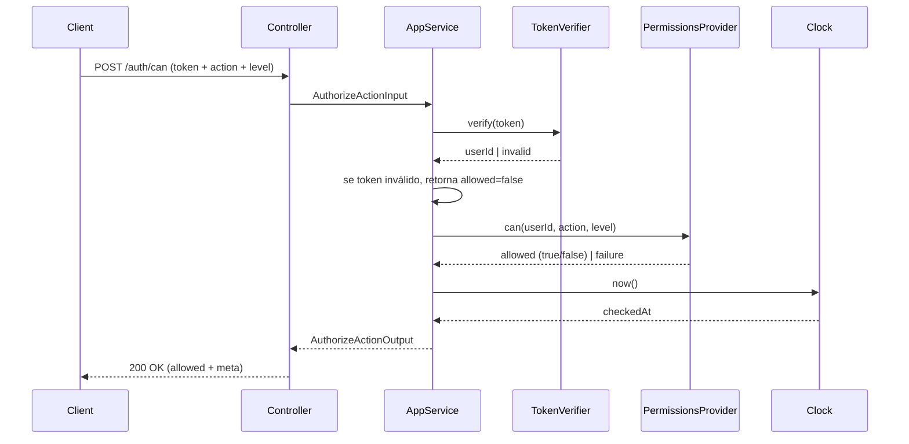
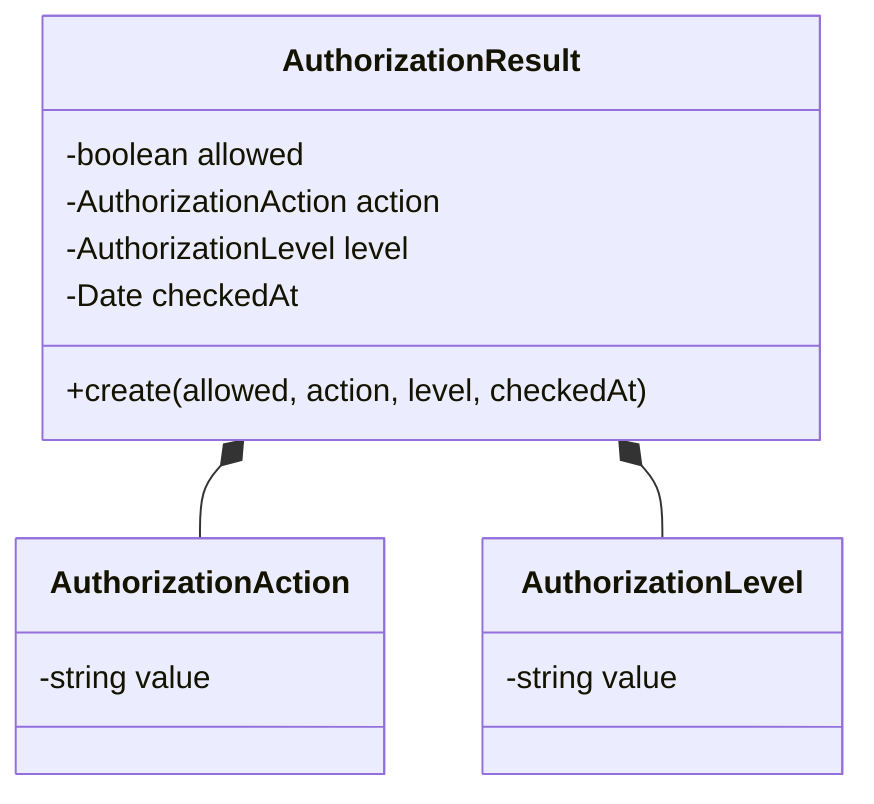
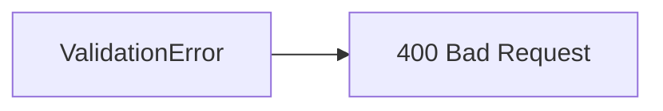

# Authorize Action (can)

**Created**: 2025-12-29

**Spec**: `./spec.md`

**Project**: `../project.md`

---

## Overview

A capability **Authorize Action (can)** orquestra a verificação de autorização **estrutural** para uma identidade autenticada, recebendo `action` e `level` e **delegando** a decisão a um **Permissions Provider** externo.

Ela **não interpreta semântica de domínio**, **não expõe grants/roles**, **não decide comportamento de negócio**, e **não materializa estado** (sem cache, sem “lembrar” decisões).

Quando não há identidade autenticada válida ou o provedor falha, o resultado deve ser **negado**.

---

## Component Map

### Domain Layer

| Tipo | Nome | Responsabilidade |
| --- | --- | --- |
| Entity | `AuthorizationResult` | Representa o resultado da verificação (allowed + metadados) |
| Value Object | `AuthorizationAction` | Normaliza/valida formato da action (estrutural) |
| Value Object | `AuthorizationLevel` | Normaliza/valida formato do level (estrutural) |
| Port (Interface) | `PermissionsProvider` | Contrato para decisão externa (permitir/negar) |

> Observação: o Domain não conhece autenticação, token, HTTP ou qualquer detalhe do provedor.
> 

---

### Application Layer

| Tipo | Nome | Responsabilidade |
| --- | --- | --- |
| App Service | `AuthorizeActionService` | Orquestra validação, contexto de identidade e delegação ao provider |
| Input DTO | `AuthorizeActionInput` | `action`, `level` e contexto de identidade (derivado do token) |
| Output DTO | `AuthorizeActionOutput` | `allowed`, `action`, `level`, `checkedAt` |

---

### Infrastructure Layer

| Tipo | Nome | Responsabilidade |
| --- | --- | --- |
| Adapter | `HttpPermissionsProvider` (ou equivalente) | Implementa o `PermissionsProvider` chamando o sistema externo |
| Token Verifier | `AuthTokenVerifier` | Verifica/decodifica token e extrai `userId` (opaco para o domínio) |
| Clock Adapter | `SystemClock` | Fornece `checkedAt` |

---

### Presentation Layer

| Tipo | Nome | Responsabilidade |
| --- | --- | --- |
| Controller | `AuthorizationController` | Endpoint HTTP para `can` (adaptador fino) |

---

## Dependency Graph

```mermaid
graph TD
    subgraph Presentation
        CTRL[AuthorizationController]
    end

    subgraph Application
        SVC[AuthorizeActionService]
        DTO_IN[AuthorizeActionInput]
        DTO_OUT[AuthorizeActionOutput]
    end

    subgraph Domain
        RES[AuthorizationResult]
        ACT[AuthorizationAction]
        LVL[AuthorizationLevel]
        PP[PermissionsProvider (Port)]
    end

    subgraph Infrastructure
        TP[AuthTokenVerifier]
        PP_IMPL[HttpPermissionsProvider]
        CLOCK[SystemClock]
    end

    CTRL --> SVC
    CTRL --> DTO_IN
    SVC --> TP
    SVC --> PP
    SVC --> RES
    RES --> ACT
    RES --> LVL
    PP_IMPL -.->|implements| PP
    SVC --> CLOCK

```

---

## Data Flow

### Fluxo: Verificar autorização estrutural (`can`)



**Transformações de dados**

| Etapa | De | Para |
| --- | --- | --- |
| HTTP → Application | JSON + token | Input DTO (userId derivado no app service) |
| Application → Provider | userId + action + level | Request do provider |
| Application → HTTP | AuthorizationResult | Output DTO |

---

## Entity Structure

### AuthorizationResult



📌 `AuthorizationAction` deve seguir o padrao `namespace.verbo` em lowercase; `AuthorizationLevel` deve ser um de: `view`, `create`, `update`, `delete`, `admin`.

---

## Repository Operations

Nenhuma.

Esta capability **não persiste** e **não cacheia** resultado.

---

## Database Model

Nenhum.

Não há tabela para `can`, por definição (stateless).

---

## API Endpoints

| Método | Path | Operação | Sucesso | Erros |
| --- | --- | --- | --- | --- |
| POST | `/auth/can` | Verificar autorização estrutural | 200 | 400 |

Notas:

- `400`: `action`/`level` em formato inválido (validação estrutural)

---

## Error Handling



| Erro | Quando | HTTP | Code |
| --- | --- | --- | --- |
| `ValidationError` | `action/level` inválidos | 400 | `VALIDATION_ERROR` |

Importante: token inválido ou falha de provider **não vira “allowed=true”**. O comportamento seguro é **negar** (allowed=false).

---

## Technical Decisions

### TD-01: Provider como Port (interface) no domínio

**Contexto**: Auth não define permissões, apenas delega.

**Decisão**: `PermissionsProvider` é um **port** (contrato) e o adapter fica na Infrastructure.

**Justificativa**: mantém desacoplamento e permite trocar HTTP/gRPC/mensageria sem afetar Domain/Application.

---

### TD-02: Token verificado fora do domínio

**Contexto**: Domain não deve conhecer autenticação e formatos de token.

**Decisão**: `AuthTokenVerifier` fica na Infrastructure e só retorna `userId` para o Application.

**Justificativa**: preserva pureza do domínio e evita vazamento de tecnologia.

---

## Implementation Notes

- **Stateless**: não armazenar resultado; nenhuma tabela; nenhum cache.
- **Sem semântica**: `action` e `level` são tratados estruturalmente (formato/normalização), não “significado”.
- **Sem permissões**: resposta contém apenas `allowed` e metadados.
- **Integração**: o adapter do provider deve ser implementado como infraestrutura, com mapeamento claro de falhas.
- **Fail-closed**: falha de token ou provider deve resultar em `allowed=false`.
