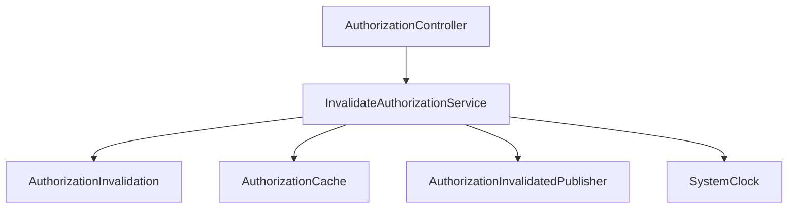
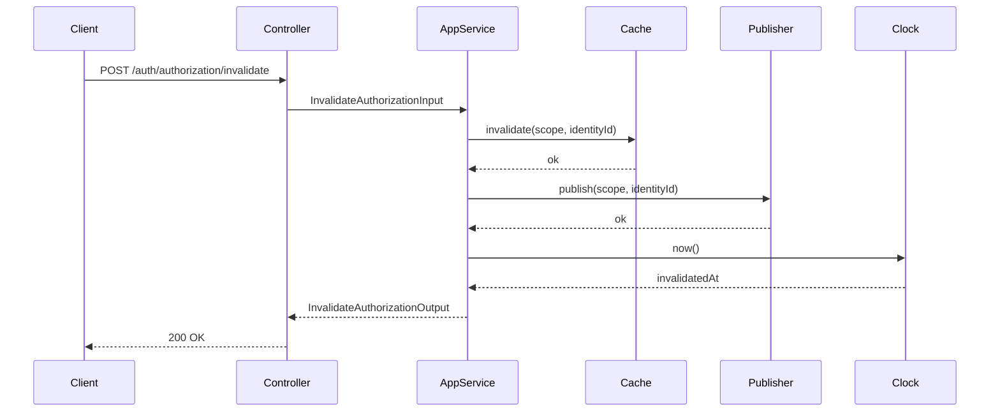

# Invalidate Authorization

**Created**: 2025-12-29

**Spec**: `./spec.md`

**Project**: `../project.md`

---

## Overview

A capability **Invalidate Authorization** força a **invalidação de decisões de autorização previamente avaliadas**, garantindo que **verificações futuras (`can`) sejam reavaliadas** contra a fonte de permissões.

Ela **não entende permissões**, **não conhece regras de negócio**, **não interpreta semântica de domínio**, **não concede nem revoga acesso**.

Seu único papel é **propagar invalidações conforme o escopo solicitado**.

---

## Princípio Fundamental

> O Auth não conhece o significado das permissões.
>
> Ele apenas aplica **escopos de invalidação** (`IDENTITY` ou `GLOBAL`) e os propaga.


---

## Component Map

### Domain Layer

| Tipo | Nome | Responsabilidade |
| --- | --- | --- |
| Entity | `AuthorizationInvalidation` | Representa uma invalidação solicitada |
| Value Object | `InvalidationScope` | Escopo da invalidação (`IDENTITY`, `GLOBAL`) |
| Value Object | `IdentityId` | Identidade alvo (quando aplicável) |

---

### Application Layer

| Tipo | Nome | Responsabilidade |
| --- | --- | --- |
| App Service | `InvalidateAuthorizationService` | Orquestra invalidação opaca |
| Input DTO | `InvalidateAuthorizationInput` | Escopo e identidade a invalidar |
| Output DTO | `InvalidateAuthorizationOutput` | Confirmação da operação |

---

### Infrastructure Layer

| Tipo | Nome | Responsabilidade |
| --- | --- | --- |
| Cache Adapter | `AuthorizationCache` | Invalida decisões cacheadas |
| Event Publisher | `AuthorizationInvalidatedPublisher` | Publica evento de invalidação |
| Clock Adapter | `SystemClock` | Timestamp técnico |

📌 Implementações concretas (Redis, RabbitMQ, etc.) vivem **exclusivamente aqui**.

---

### Presentation Layer

| Tipo | Nome | Responsabilidade |
| --- | --- | --- |
| Controller | `AuthorizationController` | Endpoint HTTP administrativo |

---

## Dependency Graph



---

## Data Flow

### Fluxo: Invalidar Autorizações (Opaco)



---

## DTOs

### InvalidateAuthorizationInput

```tsx
{
scope:"IDENTITY" | "GLOBAL",
identityId?:string,
reason?:string
}

```

📌 `identityId` é obrigatório quando `scope = "IDENTITY"` e segue o formato de `User.id`.

---

### InvalidateAuthorizationOutput

```tsx
{
invalidatedAt:Date,
scope:"IDENTITY" | "GLOBAL",
identityId?:string
}

```

---

## Cache Contract

### AuthorizationCache (Port)

```tsx
interfaceAuthorizationCache {
invalidate(scope:"IDENTITY" | "GLOBAL", identityId?:string):Promise<void>
}

```

📌 Implementações possíveis:

- Redis (prefix eviction)
- In-memory
- No-op (quando não há cache)

---

## Event Publishing

### Evento: AuthorizationInvalidated

```tsx
{
scope:"IDENTITY" | "GLOBAL",
identityId?:string,
occurredAt:Date
}

```

📌 Consumidores interpretam o significado do escopo — **não o Auth**.

---

## API Endpoints

| Método | Path | Operação | Sucesso | Erros |
| --- | --- | --- | --- | --- |
| POST | `/auth/authorization/invalidate` | Invalidar autorizações | 200 | 400 |

---

## Error Handling


| Erro | Quando | Code |
| --- | --- | --- |
| ValidationError | Payload inválido | `VALIDATION_ERROR` |

📌 Falhas técnicas de cache ou publish:

- Devem ser logadas
- Podem retornar erro técnico conforme política do sistema
- **Nunca alteram identidade ou permissões**

---

## Alignment Notes (Spec-Driven)

- Auth **não entende o significado das permissões**
- Auth **não classifica escopos além de IDENTITY/GLOBAL**
- Auth **não conhece domínio externo**
- Invalidação é **puramente técnica**
- Capacidade totalmente alinhada ao spec

---

## Implementation Notes

- Stateless
- Sem persistência
- Sem cache obrigatório
- Alta coesão, baixo acoplamento
- Ideal para sistemas distribuídos
