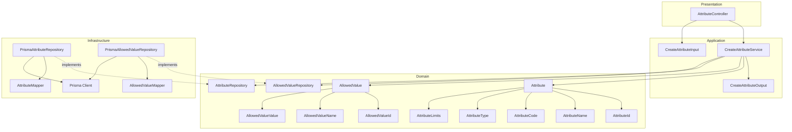
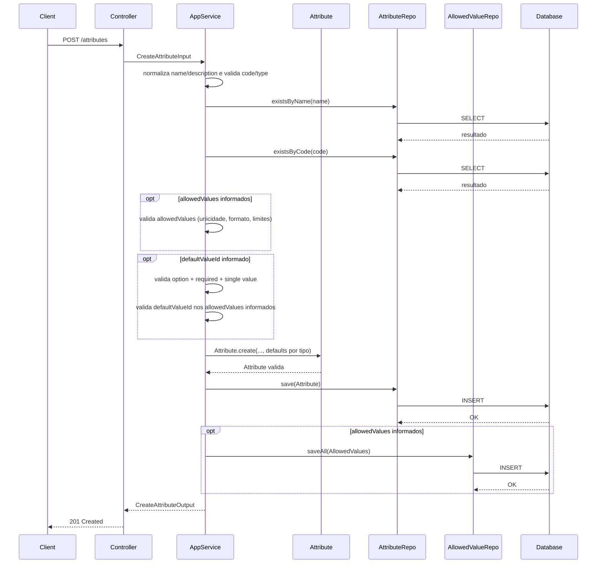
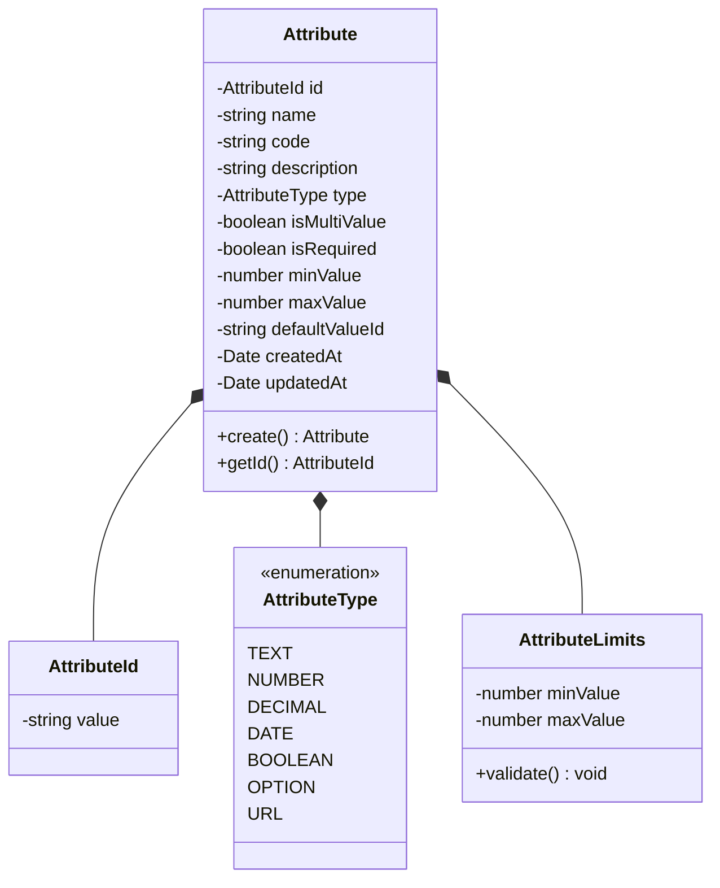
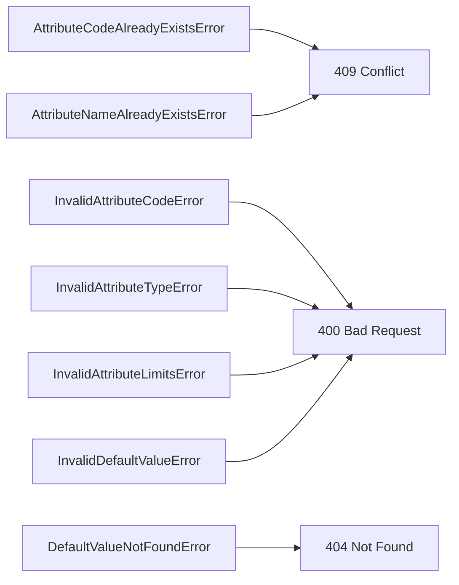

# Design: Create Attribute

**Created**: 2026-01-08  
**Spec**: [./spec.md](./spec.md)  
**Project**: [../../../project.md](../../../project.md)

---

## Overview

A capability Create Attribute cria atributos globais com regras basicas de preenchimento e limites por tipo.
A orquestracao ocorre no Application Service, que valida unicidade de name/code, formato do code e consistencia de limites, aplicando defaults por tipo quando necessario.
O atributo e persistido na base do contexto de atributos e fica disponivel para vinculos futuros com verticais e categorias.
Opcionalmente, para atributos do tipo option, o request pode incluir allowedValues iniciais; quando informados, o defaultValueId deve referenciar um desses valores.

---

## Component Map

### Domain Layer

| Tipo | Nome | Responsabilidade |
|------|------|------------------|
| Entity | `Attribute` | Representa um atributo global reutilizavel |
| Value Object | `AttributeId` | Identificador unico do atributo |
| Value Object | `AttributeName` | Nome validado e normalizado |
| Value Object | `AttributeCode` | Codigo UPPERCASE com `_` |
| Value Object | `AttributeType` | Tipo do atributo (text, number, decimal, date, boolean, option, url) |
| Value Object | `AttributeLimits` | Encapsula min/max e valida consistencia |
| Entity | `AllowedValue` | Valor permitido inicial do atributo option |
| Value Object | `AllowedValueId` | Identificador unico do valor permitido |
| Value Object | `AllowedValueName` | Nome validado e normalizado |
| Value Object | `AllowedValueValue` | Value em Pascal Case validado |
| Repository Interface | `AttributeRepository` | Persistencia e consultas de atributo |
| Repository Interface | `AllowedValueRepository` | Persistencia e consulta de valores permitidos |

### Application Layer

| Tipo | Nome | Responsabilidade |
|------|------|------------------|
| App Service | `CreateAttributeService` | Orquestra a criacao do atributo |
| Input DTO | `CreateAttributeInput` | Dados de entrada para criacao |
| Output DTO | `CreateAttributeOutput` | Dados retornados apos criacao |

### Infrastructure Layer

| Tipo | Nome | Responsabilidade |
|------|------|------------------|
| Repository Impl | `PrismaAttributeRepository` | Implementa `AttributeRepository` |
| Repository Impl | `PrismaAllowedValueRepository` | Implementa `AllowedValueRepository` |
| Mapper | `AttributeMapper` | Converte Domain <-> Prisma |
| Mapper | `AllowedValueMapper` | Converte AllowedValue <-> Prisma |

### Presentation Layer

| Tipo | Nome | Responsabilidade |
|------|------|------------------|
| Controller | `AttributeController` | Exposicao HTTP do caso de uso |

---

## Dependency Graph



---

## Data Flow

### Fluxo: Criar Attribute



**Transformacoes de dados:**

| Etapa | De | Para |
|-------|----|----- |
| Controller -> AppService | JSON body | CreateAttributeInput |
| AppService -> Domain | DTO | Attribute |
| Repository -> DB | Attribute | Prisma Model |

---

## Entity Structure

### Attribute



**Propriedades:**

| Propriedade | Tipo | Mutavel? | Regras |
|-------------|------|----------|--------|
| `id` | AttributeId | Nao | Gerado internamente |
| `name` | string | Nao | Obrigatorio, unico global |
| `code` | string | Nao | Obrigatorio, unico, UPPERCASE com `_` |
| `description` | string | Nao | Obrigatorio |
| `type` | AttributeType | Nao | Valores: text, number, decimal, date, boolean, option, url |
| `isMultiValue` | boolean | Nao | Obrigatorio |
| `isRequired` | boolean | Nao | Obrigatorio |
| `minValue` | number | Nao | Defaults por tipo quando ausente |
| `maxValue` | number | Nao | Defaults por tipo quando ausente |
| `defaultValueId` | string | Nao | Opcional, apenas option + required + single value |
| `createdAt` | Date | Nao | Automatico |
| `updatedAt` | Date | Sim | Atualizado em mudancas futuras |

**Comportamentos:**

| Metodo | Regras |
|--------|--------|
| `create` | Valida code, type, limites e aplica defaults por tipo |

---

## Repository Operations

| Operacao | Descricao | Usada por |
|----------|-----------|-----------|
| `AttributeRepository.save(attribute)` | Persiste atributo | CreateAttributeService |
| `AttributeRepository.existsByName(name)` | Verifica duplicidade de nome | CreateAttributeService |
| `AttributeRepository.existsByCode(code)` | Verifica duplicidade de codigo | CreateAttributeService |
| `AllowedValueRepository.saveAll(values)` | Persiste allowed values iniciais | CreateAttributeService |

---

## Database Model

```mermaid
erDiagram
    ATTRIBUTES {
        varchar(36) id PK
        varchar(120) name UK
        varchar(60) code UK
        varchar(255) description
        varchar(20) type
        boolean is_multi_value
        boolean is_required
        decimal(18,4) min_value
        decimal(18,4) max_value
        varchar(36) default_value_id FK
        timestamp created_at
        timestamp updated_at
    }

    ATTRIBUTE_ALLOWED_VALUES {
        varchar(36) id PK
        varchar(36) attribute_id FK
        varchar(120) name
        varchar(120) value
        varchar(120) name_normalized
        varchar(120) value_normalized
        varchar(255) description
        timestamp created_at
        timestamp updated_at
    }

    ATTRIBUTES ||--o{ ATTRIBUTE_ALLOWED_VALUES : has
```

### Tabela: `attributes`

| Coluna | Tipo | Constraints |
|--------|------|-------------|
| `id` | VARCHAR(36) | PK |
| `name` | VARCHAR(120) | NOT NULL, UNIQUE |
| `code` | VARCHAR(60) | NOT NULL, UNIQUE |
| `description` | VARCHAR(255) | NOT NULL |
| `type` | VARCHAR(20) | NOT NULL |
| `is_multi_value` | BOOLEAN | NOT NULL |
| `is_required` | BOOLEAN | NOT NULL |
| `min_value` | DECIMAL(18,4) | NOT NULL |
| `max_value` | DECIMAL(18,4) | NOT NULL |
| `default_value_id` | VARCHAR(36) | NULL, FK(attribute_allowed_values.id) |
| `created_at` | TIMESTAMP | NOT NULL, DEFAULT now() |
| `updated_at` | TIMESTAMP | NULL |

---

## API Endpoints

| Metodo | Path | Operacao | Sucesso | Erros |
|--------|------|----------|---------|-------|
| POST | `/attributes` | Criar atributo | 201 | 400, 404, 409 |

---

## Error Handling



| Erro de Dominio | Quando Ocorre | HTTP Status | Codigo |
|-----------------|---------------|-------------|--------|
| `AttributeCodeAlreadyExistsError` | Code ja cadastrado | 409 | `ATTRIBUTE_CODE_ALREADY_EXISTS` |
| `AttributeNameAlreadyExistsError` | Name ja cadastrado | 409 | `ATTRIBUTE_NAME_ALREADY_EXISTS` |
| `InvalidAttributeCodeError` | Formato de code invalido | 400 | `INVALID_ATTRIBUTE_CODE` |
| `InvalidAttributeTypeError` | Type invalido | 400 | `INVALID_ATTRIBUTE_TYPE` |
| `InvalidAttributeLimitsError` | minValue > maxValue | 400 | `INVALID_ATTRIBUTE_LIMITS` |
| `InvalidDefaultValueError` | defaultValueId usado fora das regras | 400 | `INVALID_DEFAULT_VALUE` |
| `DefaultValueNotFoundError` | defaultValueId fora dos allowedValues informados | 404 | `DEFAULT_VALUE_NOT_FOUND` |

Notas:
- Quando `allowedValues` forem informados, reutilizar os codigos e erros da capability Create Allowed Value.

---

## Technical Decisions

### Decisao 1: Defaults por tipo aplicados na criacao

**Contexto**: minValue e maxValue sao opcionais e variam por tipo.

**Decisao**: `Attribute.create` aplica defaults por tipo quando valores nao sao informados.

**Justificativa**: Centraliza regras no dominio e garante consistencia entre validacoes futuras.

---

### Decisao 2: Persistir min/max como decimal unico

**Contexto**: Limites podem representar tamanho (text/option) ou faixa numerica (number/decimal).

**Decisao**: Persistir `min_value` e `max_value` como `DECIMAL(18,4)` e interpretar o tipo no dominio.

**Justificativa**: Simplifica schema e permite limites inteiros e decimais com uma unica representacao.

---

### Decisao 3: Validar defaultValueId contra valores permitidos

**Contexto**: defaultValueId e valido apenas para option + required + single value.

**Decisao**: O Application Service valida as regras e verifica a existencia do valor permitido.

**Justificativa**: Evita configuracao inconsistente e garante referencia valida.

---

### Decisao 4: defaultValueId exige allowedValues no create

**Contexto**: defaultValueId deve referenciar um valor permitido, mas esses valores podem nao existir no momento da criacao.

**Decisao**: Permitir informar `allowedValues` opcionais na criacao do atributo; quando `defaultValueId` for informado, ele deve pertencer a esse conjunto e ambos sao persistidos no mesmo fluxo.

**Justificativa**: Viabiliza defaultValueId na criacao sem quebrar a regra de referencia.

---

## Implementation Notes

- Garantir indices unicos para `attributes.name` e `attributes.code`.
- Normalizar `name` e `description` com trim antes de validar unicidade.
- Aplicar defaults de `minValue`/`maxValue` por tipo conforme o spec.
- Rejeitar `defaultValueId` quando o atributo nao for option, nao for required ou for multivalor.
- Aceitar `defaultValueId` apenas quando `allowedValues` forem informados no request.
- Quando `allowedValues` forem informados, aplicar as mesmas validacoes do Create Allowed Value (trim, Pascal Case, limites, unicidade case-insensitive) e persistir `name_normalized`/`value_normalized`.
- Validacao de valores para tipos `url` e `date` ocorre na capability de cadastro/validacao de valores do produto, fora do escopo deste create.

---
