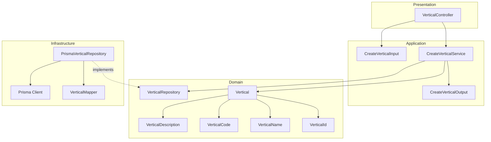
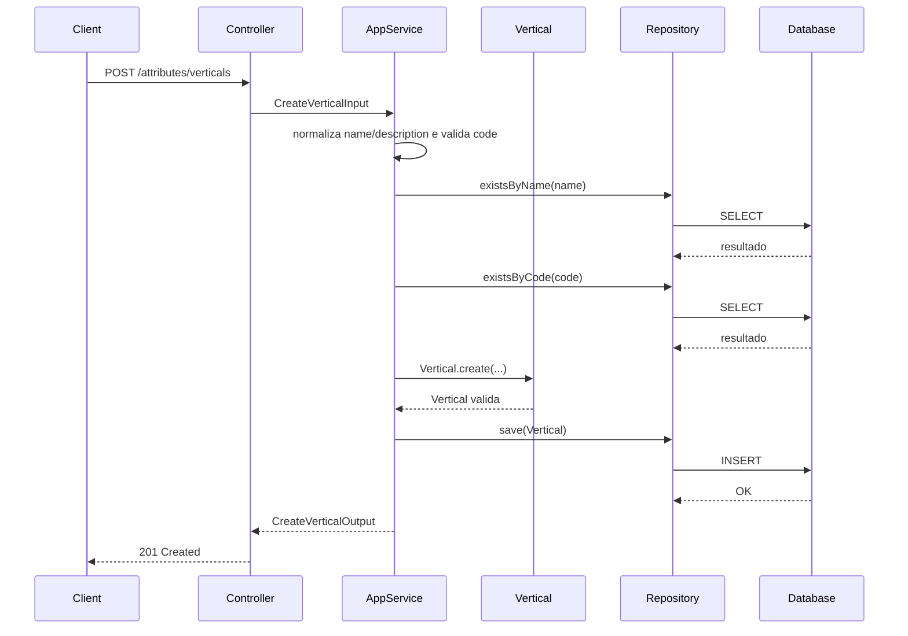
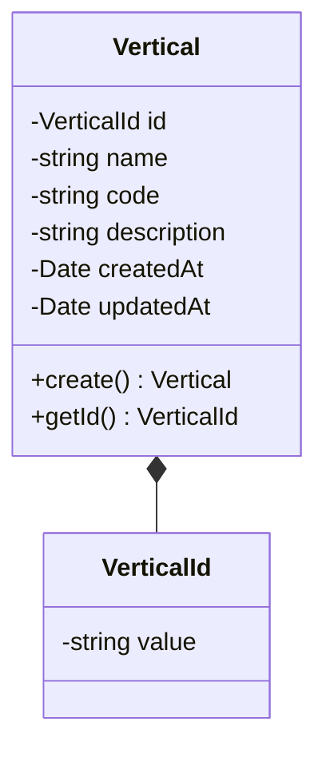
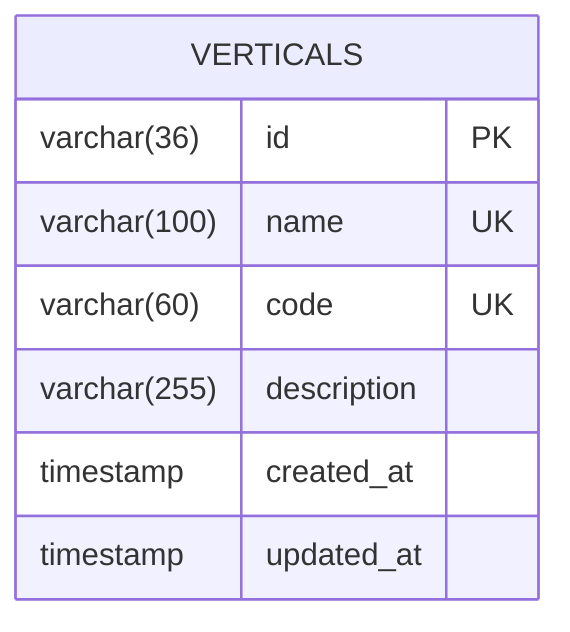
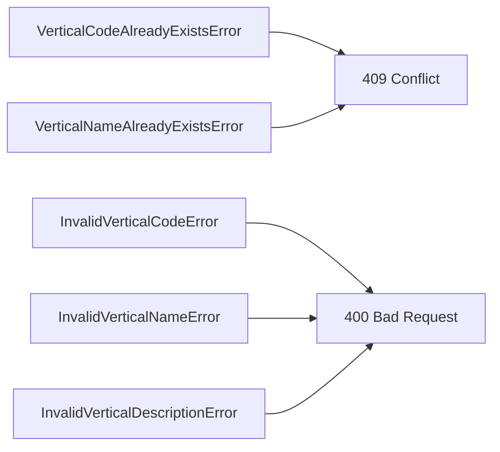

# Design: Create Vertical

**Created**: 2026-01-08  
**Spec**: [./spec.md](./spec.md)  
**Project**: [../../../project.md](../../../project.md)

---

## Overview

A capability Create Vertical cria uma vertical global com nome, codigo e descricao.
A orquestracao valida formato do codigo, normaliza textos e garante unicidade de name/code.
A vertical e persistida sem categorias ou atributos vinculados, servindo como base de organizacao do catalogo.

---

## Component Map

### Domain Layer

| Tipo | Nome | Responsabilidade |
|------|------|------------------|
| Entity | `Vertical` | Representa uma vertical global |
| Value Object | `VerticalId` | Identificador unico da vertical |
| Value Object | `VerticalName` | Nome validado e normalizado |
| Value Object | `VerticalCode` | Codigo UPPERCASE com `_` |
| Value Object | `VerticalDescription` | Descricao validada e normalizada |
| Repository Interface | `VerticalRepository` | Persistencia e consultas de vertical |

### Application Layer

| Tipo | Nome | Responsabilidade |
|------|------|------------------|
| App Service | `CreateVerticalService` | Orquestra a criacao da vertical |
| Input DTO | `CreateVerticalInput` | Dados de entrada para criacao |
| Output DTO | `CreateVerticalOutput` | Dados retornados apos criacao |

### Infrastructure Layer

| Tipo | Nome | Responsabilidade |
|------|------|------------------|
| Repository Impl | `PrismaVerticalRepository` | Implementa `VerticalRepository` |
| Mapper | `VerticalMapper` | Converte Domain <-> Prisma |

### Presentation Layer

| Tipo | Nome | Responsabilidade |
|------|------|------------------|
| Controller | `VerticalController` | Exposicao HTTP do caso de uso |

---

## Dependency Graph

---

## Data Flow

### Fluxo: Criar Vertical

**Transformacoes de dados:**

| Etapa | De | Para |
|-------|----|----- |
| Controller -> AppService | JSON body | CreateVerticalInput |
| AppService -> Domain | DTO | Vertical |
| Repository -> DB | Vertical | Prisma Model |

---

## Entity Structure

### Vertical

**Propriedades:**

| Propriedade | Tipo | Mutavel? | Regras |
|-------------|------|----------|--------|
| `id` | VerticalId | Nao | Gerado internamente |
| `name` | string | Nao | Obrigatorio, unico, 3-100 caracteres, trim |
| `code` | string | Nao | Obrigatorio, unico, UPPERCASE com `_` |
| `description` | string | Nao | Obrigatorio, 3-255 caracteres, trim |
| `createdAt` | Date | Nao | Automatico |
| `updatedAt` | Date | Sim | Atualizado em mudancas futuras |

**Comportamentos:**

| Metodo | Regras |
|--------|--------|
| `create` | Valida nome, descricao e formato do code |

---

## Repository Operations

| Operacao | Descricao | Usada por |
|----------|-----------|-----------|
| `VerticalRepository.save(vertical)` | Persiste vertical | CreateVerticalService |
| `VerticalRepository.existsByName(name)` | Verifica duplicidade de nome | CreateVerticalService |
| `VerticalRepository.existsByCode(code)` | Verifica duplicidade de codigo | CreateVerticalService |

---

## Database Model

### Tabela: `verticals`

| Coluna | Tipo | Constraints |
|--------|------|-------------|
| `id` | VARCHAR(36) | PK |
| `name` | VARCHAR(100) | NOT NULL, UNIQUE |
| `code` | VARCHAR(60) | NOT NULL, UNIQUE |
| `description` | VARCHAR(255) | NOT NULL |
| `created_at` | TIMESTAMP | NOT NULL, DEFAULT now() |
| `updated_at` | TIMESTAMP | NULL |

---

## API Endpoints

| Metodo | Path | Operacao | Sucesso | Erros |
|--------|------|----------|---------|-------|
| POST | `/attributes/verticals` | Criar vertical | 201 | 400, 409 |

---

## Error Handling

| Erro de Dominio | Quando Ocorre | HTTP Status | Codigo |
|-----------------|---------------|-------------|--------|
| `VerticalCodeAlreadyExistsError` | Code ja cadastrado | 409 | `VERTICAL_CODE_ALREADY_EXISTS` |
| `VerticalNameAlreadyExistsError` | Name ja cadastrado | 409 | `VERTICAL_NAME_ALREADY_EXISTS` |
| `InvalidVerticalCodeError` | Formato de code invalido | 400 | `INVALID_VERTICAL_CODE` |
| `InvalidVerticalNameError` | Nome vazio ou fora do tamanho | 400 | `INVALID_VERTICAL_NAME` |
| `InvalidVerticalDescriptionError` | Descricao vazia ou fora do tamanho | 400 | `INVALID_VERTICAL_DESCRIPTION` |

---

## Technical Decisions

### Decisao 1: Validacao de nome/descricao com trim no dominio

**Contexto**: A spec exige trim e rejeicao de valores vazios.

**Decisao**: `VerticalName` e `VerticalDescription` aplicam trim e validam tamanho minimo/maximo.

**Justificativa**: Evita duplicidade logica e garante regras consistentes.

---

### Decisao 2: Unicidade garantida na aplicacao e no banco

**Contexto**: Name e code devem ser unicos globalmente.

**Decisao**: O Application Service valida duplicidade e o banco possui indices unicos.

**Justificativa**: Previne conflitos concorrentes e garante integridade.

---

## Implementation Notes

- Normalizar `name` e `description` com trim antes da validacao.
- Validar `code` com regex de UPPERCASE e `_`.
- Criar indices unicos em `verticals.name` e `verticals.code`.

---
