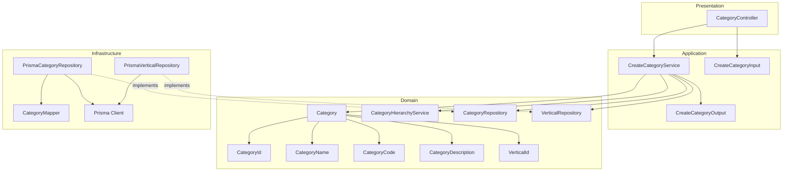
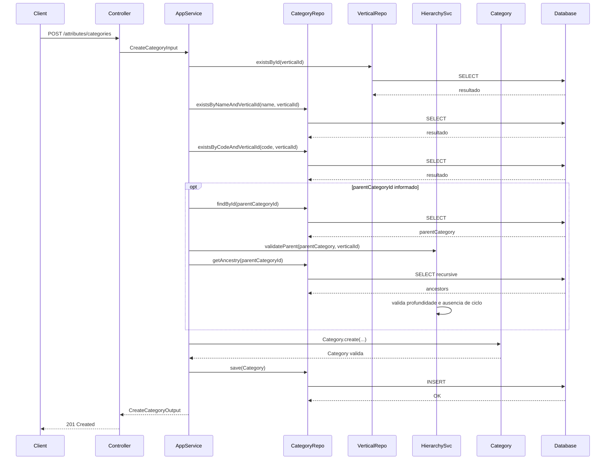
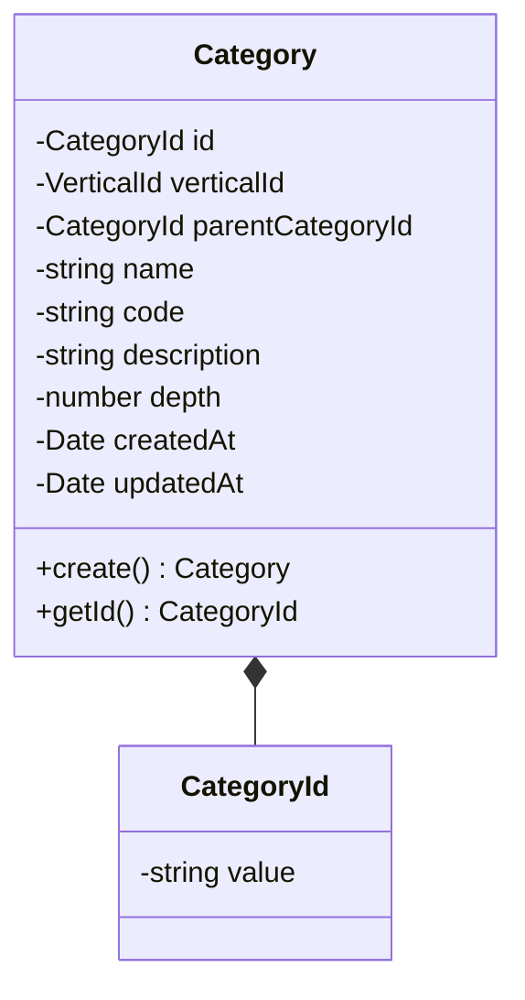
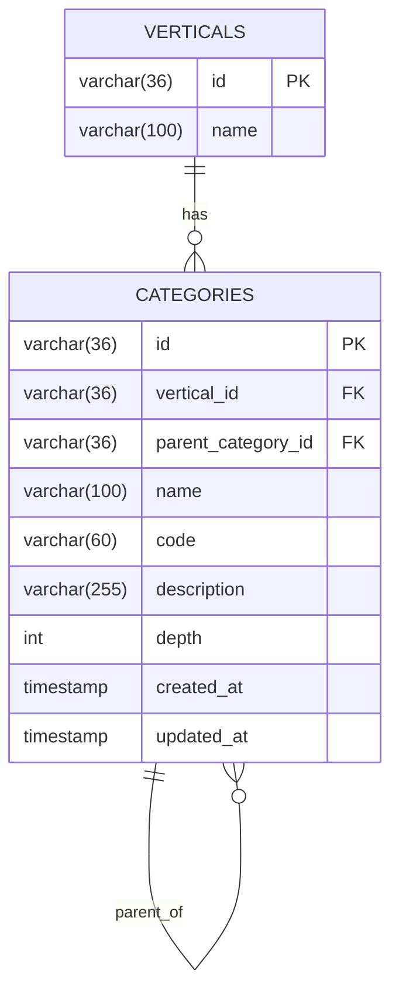
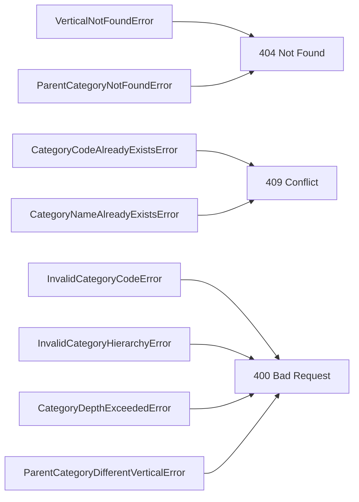

# Design: Create Category

**Created**: 2026-01-08  
**Spec**: [./spec.md](./spec.md)  
**Project**: [../../../project.md](../../../project.md)

---

## Overview

A capability Create Category cria categorias vinculadas a uma vertical, com suporte a hierarquia de ate 3 niveis.
O Application Service valida a existencia da vertical, unicidade de name/code por vertical e regras da hierarquia (mesma vertical, profundidade e ausencia de ciclos).
A categoria e persistida com referencia opcional ao parentCategoryId para compor a arvore de navegacao.

---

## Component Map

### Domain Layer

| Tipo | Nome | Responsabilidade |
|------|------|------------------|
| Entity | `Category` | Representa uma categoria dentro de uma vertical |
| Value Object | `CategoryId` | Identificador unico da categoria |
| Value Object | `CategoryName` | Nome validado e normalizado |
| Value Object | `CategoryCode` | Codigo UPPERCASE com `_` |
| Value Object | `CategoryDescription` | Descricao validada |
| Value Object | `VerticalId` | Identificador da vertical |
| Domain Service | `CategoryHierarchyService` | Valida profundidade e ciclos |
| Repository Interface | `CategoryRepository` | Persistencia e consultas de categoria |
| Repository Interface | `VerticalRepository` | Consulta existencia de vertical |

### Application Layer

| Tipo | Nome | Responsabilidade |
|------|------|------------------|
| App Service | `CreateCategoryService` | Orquestra a criacao da categoria |
| Input DTO | `CreateCategoryInput` | Dados de entrada para criacao |
| Output DTO | `CreateCategoryOutput` | Dados retornados apos criacao |

### Infrastructure Layer

| Tipo | Nome | Responsabilidade |
|------|------|------------------|
| Repository Impl | `PrismaCategoryRepository` | Implementa `CategoryRepository` |
| Repository Impl | `PrismaVerticalRepository` | Implementa `VerticalRepository` |
| Mapper | `CategoryMapper` | Converte Domain <-> Prisma |

### Presentation Layer

| Tipo | Nome | Responsabilidade |
|------|------|------------------|
| Controller | `CategoryController` | Exposicao HTTP do caso de uso |

---

## Dependency Graph

---

## Data Flow

### Fluxo: Criar Category

**Transformacoes de dados:**

| Etapa | De | Para |
|-------|----|----- |
| Controller -> AppService | JSON body | CreateCategoryInput |
| AppService -> Domain | DTO | Category |
| Repository -> DB | Category | Prisma Model |

---

## Entity Structure

### Category

**Propriedades:**

| Propriedade | Tipo | Mutavel? | Regras |
|-------------|------|----------|--------|
| `id` | CategoryId | Nao | Gerado internamente |
| `verticalId` | VerticalId | Nao | Obrigatorio |
| `parentCategoryId` | CategoryId | Nao | Opcional, mesma vertical |
| `name` | string | Nao | Obrigatorio, unico por vertical |
| `code` | string | Nao | Obrigatorio, unico por vertical, UPPERCASE com `_` |
| `description` | string | Nao | Obrigatorio |
| `depth` | number | Nao | Calculado com base na hierarquia |
| `createdAt` | Date | Nao | Automatico |
| `updatedAt` | Date | Sim | Atualizado em mudancas futuras |

**Comportamentos:**

| Metodo | Regras |
|--------|--------|
| `create` | Valida code e aplica depth calculado |

---

## Repository Operations

| Operacao | Descricao | Usada por |
|----------|-----------|-----------|
| `VerticalRepository.existsById(id)` | Verifica existencia de vertical | CreateCategoryService |
| `CategoryRepository.existsByNameAndVerticalId(name, verticalId)` | Verifica duplicidade de nome | CreateCategoryService |
| `CategoryRepository.existsByCodeAndVerticalId(code, verticalId)` | Verifica duplicidade de codigo | CreateCategoryService |
| `CategoryRepository.findById(id)` | Busca categoria pai | CreateCategoryService |
| `CategoryRepository.getAncestry(id)` | Retorna cadeia de ancestrais | CreateCategoryService |
| `CategoryRepository.save(category)` | Persiste categoria | CreateCategoryService |

---

## Database Model

### Tabela: `categories`

| Coluna | Tipo | Constraints |
|--------|------|-------------|
| `id` | VARCHAR(36) | PK |
| `vertical_id` | VARCHAR(36) | NOT NULL, FK(verticals.id) |
| `parent_category_id` | VARCHAR(36) | NULL, FK(categories.id) |
| `name` | VARCHAR(100) | NOT NULL |
| `code` | VARCHAR(60) | NOT NULL |
| `description` | VARCHAR(255) | NOT NULL |
| `depth` | INT | NOT NULL |
| `created_at` | TIMESTAMP | NOT NULL, DEFAULT now() |
| `updated_at` | TIMESTAMP | NULL |

---

## API Endpoints

| Metodo | Path | Operacao | Sucesso | Erros |
|--------|------|----------|---------|-------|
| POST | `/attributes/categories` | Criar categoria | 201 | 400, 404, 409 |

---

## Error Handling

| Erro de Dominio | Quando Ocorre | HTTP Status | Codigo |
|-----------------|---------------|-------------|--------|
| `VerticalNotFoundError` | verticalId inexistente | 404 | `VERTICAL_NOT_FOUND` |
| `ParentCategoryNotFoundError` | parentCategoryId inexistente | 404 | `PARENT_CATEGORY_NOT_FOUND` |
| `CategoryCodeAlreadyExistsError` | Code ja cadastrado na vertical | 409 | `CATEGORY_CODE_ALREADY_EXISTS` |
| `CategoryNameAlreadyExistsError` | Name ja cadastrado na vertical | 409 | `CATEGORY_NAME_ALREADY_EXISTS` |
| `InvalidCategoryCodeError` | Formato de code invalido | 400 | `INVALID_CATEGORY_CODE` |
| `ParentCategoryDifferentVerticalError` | Categoria pai de outra vertical | 400 | `PARENT_CATEGORY_WRONG_VERTICAL` |
| `CategoryDepthExceededError` | Limite de profundidade excedido | 400 | `CATEGORY_DEPTH_EXCEEDED` |
| `InvalidCategoryHierarchyError` | Ciclo detectado na hierarquia | 400 | `CATEGORY_HIERARCHY_CYCLE` |

---

## Technical Decisions

### Decisao 1: Persistir depth para validacao rapida

**Contexto**: A hierarquia permite ate 3 niveis e exige validacao de profundidade.

**Decisao**: Persistir `depth` na tabela `categories` e calcular no momento da criacao.

**Justificativa**: Simplifica consultas e evita calculo recursivo frequente.

---

### Decisao 2: Validar hierarquia via ancestry

**Contexto**: O sistema deve impedir ciclos e validar pai na mesma vertical.

**Decisao**: O `CategoryHierarchyService` carrega a cadeia de ancestrais e valida vertical/ausencia de ciclos.

**Justificativa**: Centraliza regras de hierarquia e reduz logica no controller.

---

## Implementation Notes

- Validar `code` com regex de UPPERCASE e `_`.
- Garantir indices unicos em `categories.vertical_id + name` e `categories.vertical_id + code`.
- `depth` = 1 para categoria raiz; filhos incrementam baseado no pai.
- Rejeitar `parentCategoryId` quando a categoria pai pertence a outra vertical.

---
