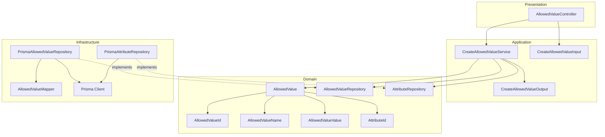
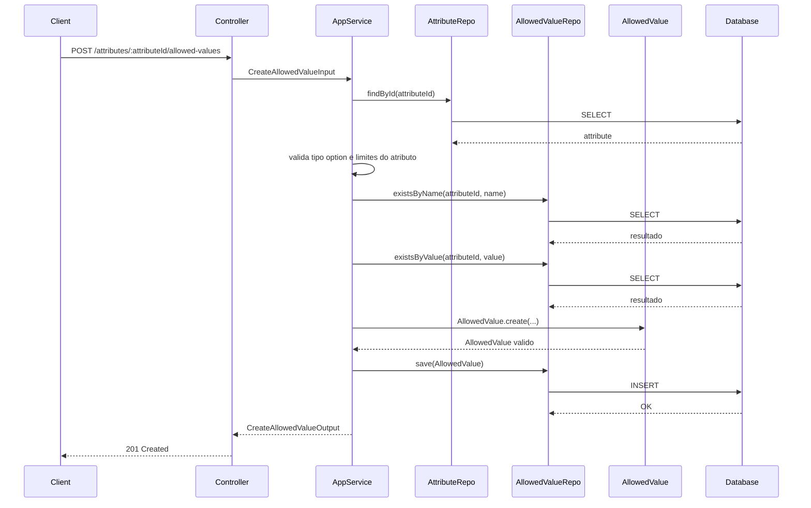
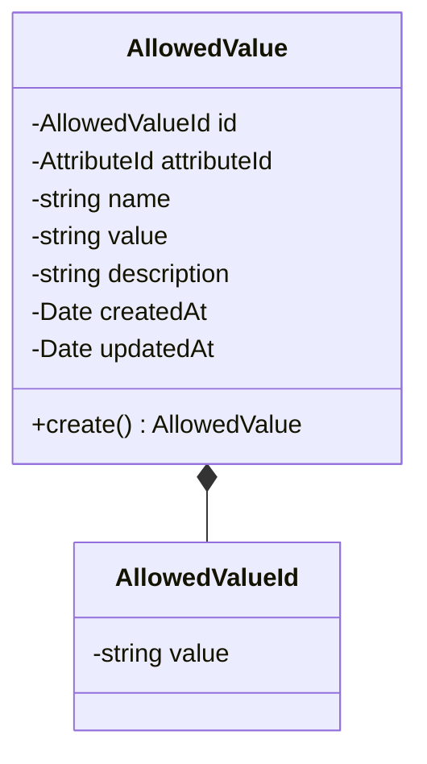
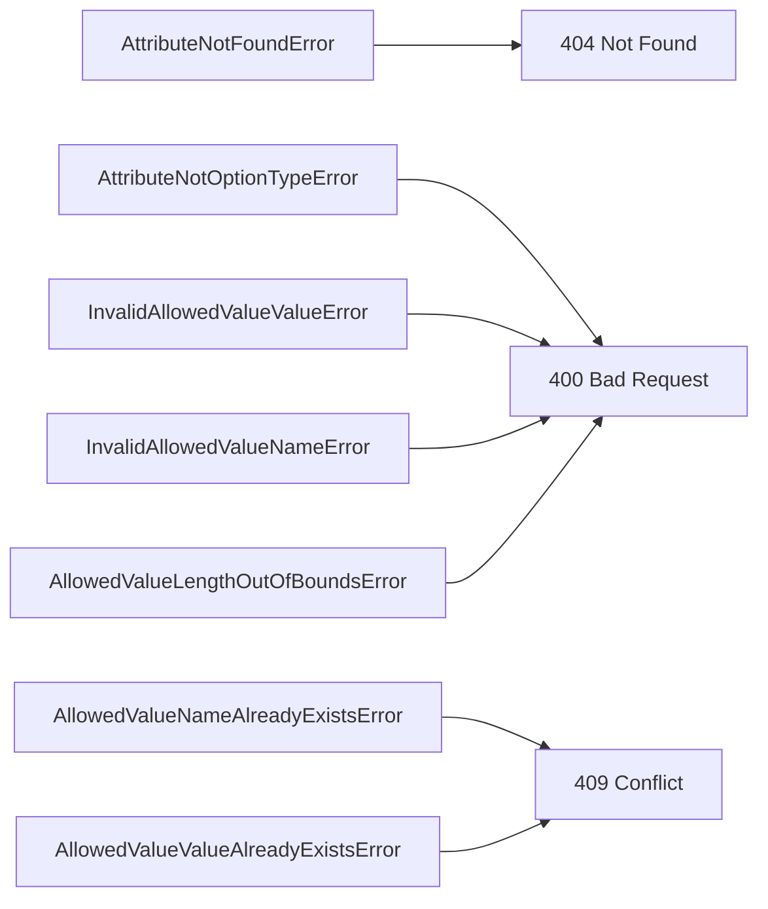

# Design: Create Allowed Value

**Created**: 2026-01-08  
**Spec**: [./spec.md](./spec.md)  
**Project**: [../../../project.md](../../../project.md)

---

## Overview

A capability Create Allowed Value cadastra valores permitidos para atributos do tipo option.
O Application Service valida a existencia do atributo, o tipo option, formato Pascal Case do value e unicidade case-insensitive de name/value.
O valor permitido e persistido e passa a compor as opcoes globais do atributo.

---

## Component Map

### Domain Layer

| Tipo | Nome | Responsabilidade |
|------|------|------------------|
| Entity | `AllowedValue` | Representa um valor permitido de atributo option |
| Value Object | `AllowedValueId` | Identificador unico do valor permitido |
| Value Object | `AllowedValueName` | Nome validado e normalizado |
| Value Object | `AllowedValueValue` | Value em Pascal Case validado |
| Value Object | `AttributeId` | Identificador do atributo |
| Repository Interface | `AllowedValueRepository` | Persistencia e consultas de valores permitidos |
| Repository Interface | `AttributeRepository` | Consulta de atributo e limites |

### Application Layer

| Tipo | Nome | Responsabilidade |
|------|------|------------------|
| App Service | `CreateAllowedValueService` | Orquestra a criacao do valor permitido |
| Input DTO | `CreateAllowedValueInput` | Dados de entrada para criacao |
| Output DTO | `CreateAllowedValueOutput` | Dados retornados apos criacao |

### Infrastructure Layer

| Tipo | Nome | Responsabilidade |
|------|------|------------------|
| Repository Impl | `PrismaAllowedValueRepository` | Implementa `AllowedValueRepository` |
| Repository Impl | `PrismaAttributeRepository` | Implementa `AttributeRepository` |
| Mapper | `AllowedValueMapper` | Converte Domain <-> Prisma |

### Presentation Layer

| Tipo | Nome | Responsabilidade |
|------|------|------------------|
| Controller | `AllowedValueController` | Exposicao HTTP do caso de uso |

---

## Dependency Graph



---

## Data Flow

### Fluxo: Criar Allowed Value



**Transformacoes de dados:**

| Etapa | De | Para |
|-------|----|----- |
| Controller -> AppService | JSON body | CreateAllowedValueInput |
| AppService -> Domain | DTO | AllowedValue |
| Repository -> DB | AllowedValue | Prisma Model |

---

## Entity Structure

### AllowedValue



**Propriedades:**

| Propriedade | Tipo | Mutavel? | Regras |
|-------------|------|----------|--------|
| `id` | AllowedValueId | Nao | Gerado internamente |
| `attributeId` | AttributeId | Nao | Obrigatorio, atributo option |
| `name` | string | Nao | Obrigatorio, unico por atributo, trim, case-insensitive |
| `value` | string | Nao | Obrigatorio, Pascal Case, unico por atributo, case-insensitive |
| `description` | string | Nao | Opcional |
| `createdAt` | Date | Nao | Automatico |
| `updatedAt` | Date | Sim | Atualizado em mudancas futuras |

**Comportamentos:**

| Metodo | Regras |
|--------|--------|
| `create` | Valida Pascal Case e tamanho do value conforme limites do atributo |

---

## Repository Operations

| Operacao | Descricao | Usada por |
|----------|-----------|-----------|
| `AttributeRepository.findById(id)` | Busca atributo e limites | CreateAllowedValueService |
| `AllowedValueRepository.existsByName(attributeId, name)` | Verifica duplicidade de name | CreateAllowedValueService |
| `AllowedValueRepository.existsByValue(attributeId, value)` | Verifica duplicidade de value | CreateAllowedValueService |
| `AllowedValueRepository.save(allowedValue)` | Persiste valor permitido | CreateAllowedValueService |

---

## Database Model

```mermaid
erDiagram
    ATTRIBUTES {
        varchar(36) id PK
        varchar(20) type
        decimal(18,4) min_value
        decimal(18,4) max_value
    }

    ATTRIBUTE_ALLOWED_VALUES {
        varchar(36) id PK
        varchar(36) attribute_id FK
        varchar(120) name
        varchar(120) value
        varchar(120) name_normalized
        varchar(120) value_normalized
        varchar(255) description
        timestamp created_at
        timestamp updated_at
    }

    ATTRIBUTES ||--o{ ATTRIBUTE_ALLOWED_VALUES : has
```

### Tabela: `attribute_allowed_values`

| Coluna | Tipo | Constraints |
|--------|------|-------------|
| `id` | VARCHAR(36) | PK |
| `attribute_id` | VARCHAR(36) | NOT NULL, FK(attributes.id) |
| `name` | VARCHAR(120) | NOT NULL |
| `value` | VARCHAR(120) | NOT NULL |
| `name_normalized` | VARCHAR(120) | NOT NULL |
| `value_normalized` | VARCHAR(120) | NOT NULL |
| `description` | VARCHAR(255) | NULL |
| `created_at` | TIMESTAMP | NOT NULL, DEFAULT now() |
| `updated_at` | TIMESTAMP | NULL |

---

## API Endpoints

| Metodo | Path | Operacao | Sucesso | Erros |
|--------|------|----------|---------|-------|
| POST | `/attributes/:attributeId/allowed-values` | Criar valor permitido | 201 | 400, 404, 409 |

---

## Error Handling



| Erro de Dominio | Quando Ocorre | HTTP Status | Codigo |
|-----------------|---------------|-------------|--------|
| `AttributeNotFoundError` | attributeId inexistente | 404 | `ATTRIBUTE_NOT_FOUND` |
| `AttributeNotOptionTypeError` | atributo nao e option | 400 | `ATTRIBUTE_NOT_OPTION` |
| `AllowedValueNameAlreadyExistsError` | Name duplicado no atributo | 409 | `ALLOWED_VALUE_NAME_EXISTS` |
| `AllowedValueValueAlreadyExistsError` | Value duplicado no atributo | 409 | `ALLOWED_VALUE_VALUE_EXISTS` |
| `InvalidAllowedValueValueError` | Formato de value invalido | 400 | `INVALID_ALLOWED_VALUE_VALUE` |
| `InvalidAllowedValueNameError` | Name vazio apos trim | 400 | `INVALID_ALLOWED_VALUE_NAME` |
| `AllowedValueLengthOutOfBoundsError` | Value fora dos limites | 400 | `ALLOWED_VALUE_OUT_OF_BOUNDS` |

---

## Technical Decisions

### Decisao 1: Unicidade case-insensitive com colunas normalizadas

**Contexto**: Name e value devem ser unicos por atributo, ignorando caixa.

**Decisao**: Persistir `name_normalized` e `value_normalized` em lowercase e aplicar indices unicos.

**Justificativa**: Evita dependencia de collation do banco e garante regra consistente.

---

### Decisao 2: Validar tamanho do value com limites do atributo

**Contexto**: `value` deve respeitar minValue/maxValue do atributo.

**Decisao**: O Application Service obtem os limites efetivos do atributo (com defaults) antes de criar o AllowedValue.

**Justificativa**: Garante consistencia entre definicao do atributo e seus valores permitidos.

---

## Implementation Notes

- Validar `value` com regex de Pascal Case, permitindo numeros e espacos simples.
- Aplicar trim em `name` e `value` antes de validar duplicidade.
- Rejeitar criacao quando o atributo nao for do tipo option.
- Criar indices unicos em `attribute_allowed_values(attribute_id, name_normalized)` e `attribute_allowed_values(attribute_id, value_normalized)`.

---
