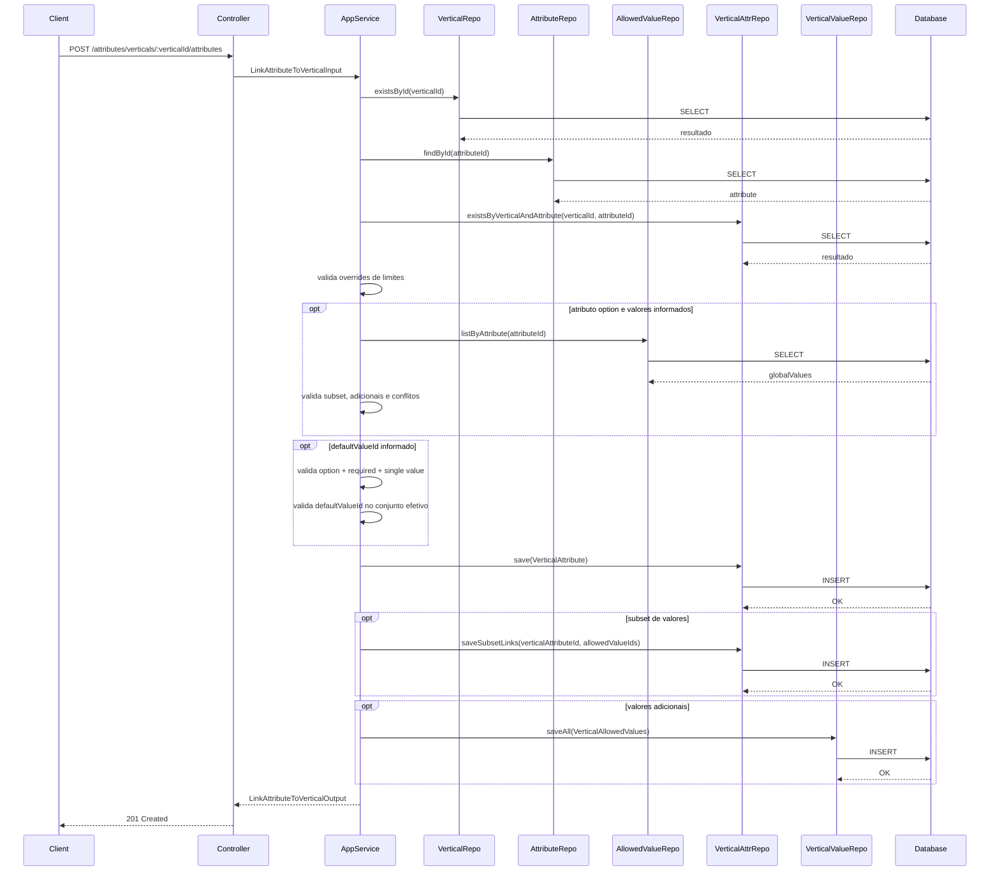
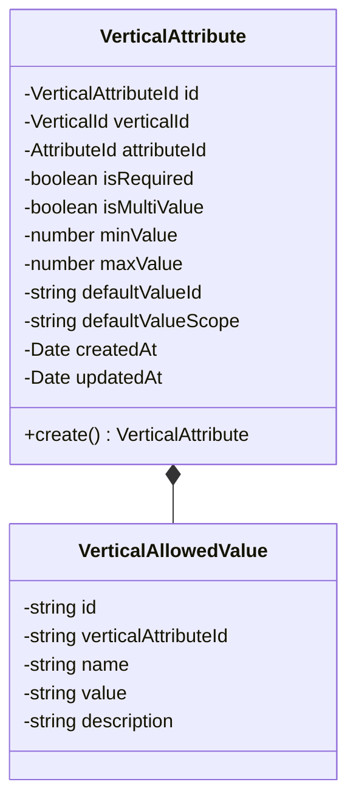
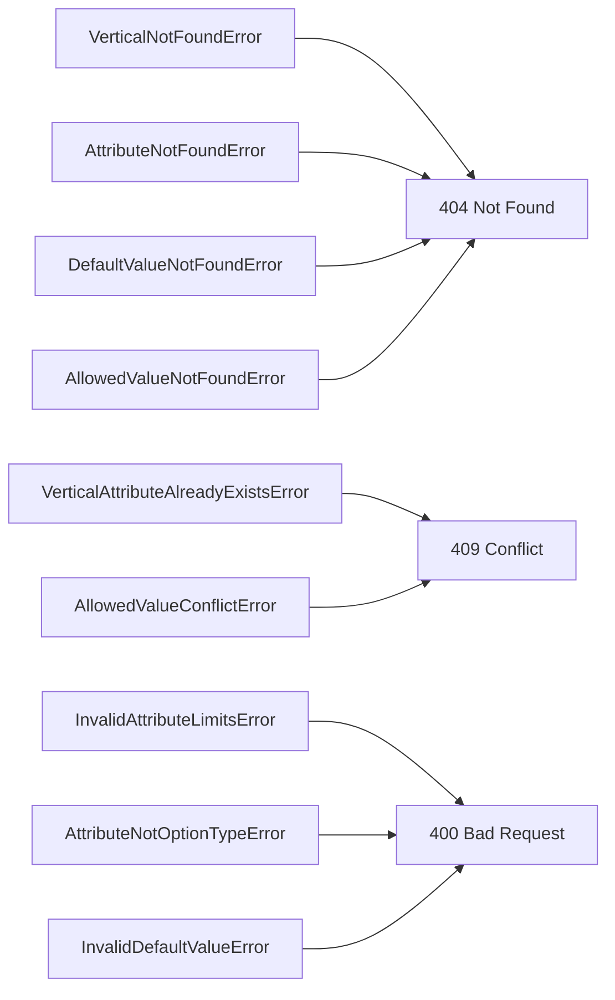

# Design: Link Attribute to Vertical

**Created**: 2026-01-08  
**Spec**: [./spec.md](./spec.md)  
**Project**: [../../../project.md](../../../project.md)

---

## Overview

A capability Link Attribute to Vertical cria o vinculo entre um atributo global e uma vertical, permitindo sobrescritas de regras e configuracao de valores permitidos.
O Application Service valida a existencia de vertical e atributo, garante unicidade do vinculo e aplica regras de override para obrigatoriedade, multivalor e limites.
Para atributos option, o vinculo pode selecionar subset dos valores globais e adicionar valores especificos, garantindo unicidade e defaultValue valido no contexto da vertical.

---

## Component Map

### Domain Layer

| Tipo | Nome | Responsabilidade |
|------|------|------------------|
| Entity | `VerticalAttribute` | Vinculo entre atributo e vertical com overrides |
| Entity | `VerticalAllowedValue` | Valor permitido especifico da vertical |
| Value Object | `VerticalAttributeId` | Identificador do vinculo |
| Value Object | `VerticalId` | Identificador da vertical |
| Value Object | `AttributeId` | Identificador do atributo |
| Repository Interface | `VerticalAttributeRepository` | Persistencia do vinculo vertical-atributo |
| Repository Interface | `VerticalAllowedValueRepository` | Persistencia de valores permitidos da vertical |
| Repository Interface | `AttributeRepository` | Consulta de atributo global |
| Repository Interface | `AllowedValueRepository` | Consulta de valores permitidos globais |
| Repository Interface | `VerticalRepository` | Consulta de vertical |

### Application Layer

| Tipo | Nome | Responsabilidade |
|------|------|------------------|
| App Service | `LinkAttributeToVerticalService` | Orquestra a criacao do vinculo |
| Input DTO | `LinkAttributeToVerticalInput` | Dados de entrada para vinculo |
| Output DTO | `LinkAttributeToVerticalOutput` | Dados retornados apos vinculo |

### Infrastructure Layer

| Tipo | Nome | Responsabilidade |
|------|------|------------------|
| Repository Impl | `PrismaVerticalAttributeRepository` | Implementa `VerticalAttributeRepository` |
| Repository Impl | `PrismaVerticalAllowedValueRepository` | Implementa `VerticalAllowedValueRepository` |
| Repository Impl | `PrismaAttributeRepository` | Implementa `AttributeRepository` |
| Repository Impl | `PrismaAllowedValueRepository` | Implementa `AllowedValueRepository` |
| Repository Impl | `PrismaVerticalRepository` | Implementa `VerticalRepository` |
| Mapper | `VerticalAttributeMapper` | Converte Domain <-> Prisma |
| Mapper | `VerticalAllowedValueMapper` | Converte AllowedValue <-> Prisma |

### Presentation Layer

| Tipo | Nome | Responsabilidade |
|------|------|------------------|
| Controller | `VerticalAttributeController` | Exposicao HTTP do caso de uso |

---

## Dependency Graph

```mermaid
graph TD
    subgraph Presentation
        CTRL[VerticalAttributeController]
    end

    subgraph Application
        SVC[LinkAttributeToVerticalService]
        DTO_IN[LinkAttributeToVerticalInput]
        DTO_OUT[LinkAttributeToVerticalOutput]
    end

    subgraph Domain
        VERT_ATTR[VerticalAttribute]
        VERT_VAL[VerticalAllowedValue]
        VO_ID[VerticalAttributeId]
        VO_VERT[VerticalId]
        VO_ATTR[AttributeId]
        VERT_ATTR_REPO[VerticalAttributeRepository]
        VERT_VAL_REPO[VerticalAllowedValueRepository]
        ATTR_REPO[AttributeRepository]
        ALLOWED_REPO[AllowedValueRepository]
        VERT_REPO[VerticalRepository]
    end

    subgraph Infrastructure
        VERT_ATTR_IMPL[PrismaVerticalAttributeRepository]
        VERT_VAL_IMPL[PrismaVerticalAllowedValueRepository]
        ATTR_REPO_IMPL[PrismaAttributeRepository]
        ALLOWED_REPO_IMPL[PrismaAllowedValueRepository]
        VERT_REPO_IMPL[PrismaVerticalRepository]
        VERT_ATTR_MAPPER[VerticalAttributeMapper]
        VERT_VAL_MAPPER[VerticalAllowedValueMapper]
        PRISMA[Prisma Client]
    end

    CTRL --> SVC
    CTRL --> DTO_IN
    SVC --> DTO_OUT
    SVC --> VERT_ATTR
    SVC --> VERT_VAL
    SVC --> VERT_ATTR_REPO
    SVC --> VERT_VAL_REPO
    SVC --> ATTR_REPO
    SVC --> ALLOWED_REPO
    SVC --> VERT_REPO
    VERT_ATTR --> VO_ID
    VERT_ATTR --> VO_VERT
    VERT_ATTR --> VO_ATTR
    VERT_ATTR_IMPL -.->|implements| VERT_ATTR_REPO
    VERT_VAL_IMPL -.->|implements| VERT_VAL_REPO
    ATTR_REPO_IMPL -.->|implements| ATTR_REPO
    ALLOWED_REPO_IMPL -.->|implements| ALLOWED_REPO
    VERT_REPO_IMPL -.->|implements| VERT_REPO
    VERT_ATTR_IMPL --> VERT_ATTR_MAPPER
    VERT_VAL_IMPL --> VERT_VAL_MAPPER
    VERT_ATTR_IMPL --> PRISMA
    VERT_VAL_IMPL --> PRISMA
    ATTR_REPO_IMPL --> PRISMA
    ALLOWED_REPO_IMPL --> PRISMA
    VERT_REPO_IMPL --> PRISMA
```



---

## Data Flow

### Fluxo: Vincular Attribute a Vertical



**Transformacoes de dados:**

| Etapa | De | Para |
|-------|----|----- |
| Controller -> AppService | JSON body | LinkAttributeToVerticalInput |
| AppService -> Domain | DTO | VerticalAttribute/VerticalAllowedValue |
| Repository -> DB | Entities | Prisma Models |

---

## Entity Structure

### VerticalAttribute



**Propriedades:**

| Propriedade | Tipo | Mutavel? | Regras |
|-------------|------|----------|--------|
| `id` | VerticalAttributeId | Nao | Gerado internamente |
| `verticalId` | VerticalId | Nao | Obrigatorio |
| `attributeId` | AttributeId | Nao | Obrigatorio |
| `isRequired` | boolean | Nao | Opcional, herda do atributo quando ausente |
| `isMultiValue` | boolean | Nao | Opcional, herda do atributo quando ausente |
| `minValue` | number | Nao | Opcional, aplicavel a text/number/decimal, valida min <= max |
| `maxValue` | number | Nao | Opcional, aplicavel a text/number/decimal, valida min <= max |
| `defaultValueId` | string | Nao | Opcional, depende de option/required/single |
| `defaultValueScope` | string | Nao | `ATTRIBUTE` ou `VERTICAL` |
| `createdAt` | Date | Nao | Automatico |
| `updatedAt` | Date | Sim | Atualizado em mudancas futuras |

**Comportamentos:**

| Metodo | Regras |
|--------|--------|
| `create` | Valida limites e regras do defaultValue |

---

## Repository Operations

| Operacao | Descricao | Usada por |
|----------|-----------|-----------|
| `VerticalRepository.existsById(id)` | Verifica existencia da vertical | LinkAttributeToVerticalService |
| `AttributeRepository.findById(id)` | Busca atributo global | LinkAttributeToVerticalService |
| `VerticalAttributeRepository.existsByVerticalAndAttribute(verticalId, attributeId)` | Verifica vinculo duplicado | LinkAttributeToVerticalService |
| `AllowedValueRepository.listByAttribute(attributeId)` | Lista valores permitidos globais | LinkAttributeToVerticalService |
| `VerticalAttributeRepository.save(verticalAttribute)` | Persiste vinculo | LinkAttributeToVerticalService |
| `VerticalAttributeRepository.saveSubsetLinks(verticalAttributeId, allowedValueIds)` | Persiste subset selecionado | LinkAttributeToVerticalService |
| `VerticalAllowedValueRepository.saveAll(values)` | Persiste valores adicionais | LinkAttributeToVerticalService |

---

## Database Model

```mermaid
erDiagram
    ATTRIBUTES {
        varchar(36) id PK
        varchar(20) type
        boolean is_required
        boolean is_multi_value
        decimal(18,4) min_value
        decimal(18,4) max_value
    }

    ATTRIBUTE_ALLOWED_VALUES {
        varchar(36) id PK
        varchar(36) attribute_id FK
        varchar(120) name
        varchar(120) value
    }

    VERTICALS {
        varchar(36) id PK
        varchar(100) name
    }

    VERTICAL_ATTRIBUTES {
        varchar(36) id PK
        varchar(36) vertical_id FK
        varchar(36) attribute_id FK
        boolean is_required
        boolean is_multi_value
        decimal(18,4) min_value
        decimal(18,4) max_value
        varchar(20) default_value_scope
        varchar(36) default_value_id
        timestamp created_at
        timestamp updated_at
    }

    VERTICAL_ALLOWED_VALUES {
        varchar(36) id PK
        varchar(36) vertical_attribute_id FK
        varchar(120) name
        varchar(120) value
        varchar(120) name_normalized
        varchar(120) value_normalized
        varchar(255) description
        timestamp created_at
        timestamp updated_at
    }

    VERTICAL_ALLOWED_VALUE_LINKS {
        varchar(36) vertical_attribute_id FK
        varchar(36) attribute_allowed_value_id FK
        timestamp created_at
    }

    ATTRIBUTES ||--o{ ATTRIBUTE_ALLOWED_VALUES : has
    VERTICALS ||--o{ VERTICAL_ATTRIBUTES : has
    ATTRIBUTES ||--o{ VERTICAL_ATTRIBUTES : linked
    VERTICAL_ATTRIBUTES ||--o{ VERTICAL_ALLOWED_VALUES : adds
    VERTICAL_ATTRIBUTES ||--o{ VERTICAL_ALLOWED_VALUE_LINKS : selects
```

### Tabela: `vertical_attributes`

| Coluna | Tipo | Constraints |
|--------|------|-------------|
| `id` | VARCHAR(36) | PK |
| `vertical_id` | VARCHAR(36) | NOT NULL, FK(verticals.id) |
| `attribute_id` | VARCHAR(36) | NOT NULL, FK(attributes.id) |
| `is_required` | BOOLEAN | NULL |
| `is_multi_value` | BOOLEAN | NULL |
| `min_value` | DECIMAL(18,4) | NULL |
| `max_value` | DECIMAL(18,4) | NULL |
| `default_value_scope` | VARCHAR(20) | NULL |
| `default_value_id` | VARCHAR(36) | NULL |
| `created_at` | TIMESTAMP | NOT NULL, DEFAULT now() |
| `updated_at` | TIMESTAMP | NULL |

---

## API Endpoints

| Metodo | Path | Operacao | Sucesso | Erros |
|--------|------|----------|---------|-------|
| POST | `/attributes/verticals/:verticalId/attributes` | Vincular atributo a vertical | 201 | 400, 404, 409 |

---

## Error Handling



| Erro de Dominio | Quando Ocorre | HTTP Status | Codigo |
|-----------------|---------------|-------------|--------|
| `VerticalNotFoundError` | verticalId inexistente | 404 | `VERTICAL_NOT_FOUND` |
| `AttributeNotFoundError` | attributeId inexistente | 404 | `ATTRIBUTE_NOT_FOUND` |
| `VerticalAttributeAlreadyExistsError` | Vinculo ja existe | 409 | `VERTICAL_ATTRIBUTE_EXISTS` |
| `InvalidAttributeLimitsError` | minValue > maxValue | 400 | `INVALID_ATTRIBUTE_LIMITS` |
| `AttributeNotOptionTypeError` | Valores informados para atributo nao option | 400 | `ATTRIBUTE_NOT_OPTION` |
| `InvalidDefaultValueError` | defaultValueId fora das regras | 400 | `INVALID_DEFAULT_VALUE` |
| `DefaultValueNotFoundError` | defaultValueId fora do conjunto efetivo | 404 | `DEFAULT_VALUE_NOT_FOUND` |
| `AllowedValueNotFoundError` | subset contem valor inexistente | 404 | `ALLOWED_VALUE_NOT_FOUND` |
| `AllowedValueConflictError` | conflito de name/value com valores herdados | 409 | `ALLOWED_VALUE_CONFLICT` |

---

## Technical Decisions

### Decisao 1: Subset por links e adicionais separados

**Contexto**: A vertical pode selecionar subset de valores globais e adicionar novos valores.

**Decisao**: Persistir subset em `vertical_allowed_value_links` e adicionais em `vertical_allowed_values`.

**Justificativa**: Evita duplicacao de valores globais e preserva heranca dinamica.

---

### Decisao 2: defaultValueId com escopo explicito

**Contexto**: O default pode apontar para valor global ou valor adicional da vertical.

**Decisao**: Armazenar `default_value_scope` (`ATTRIBUTE` ou `VERTICAL`) junto com `default_value_id`.

**Justificativa**: Remove ambiguidade e facilita resolucao de cascata.

---

## Implementation Notes

- Se nenhum subset ou adicional for informado, a vertical herda todos os valores globais.
- Validar conflitos de `name`/`value` comparando adicionais com valores herdados.
- Aplicar trim e normalizacao de `name`/`value` para checagem case-insensitive.
- Criar indices unicos em `vertical_allowed_values(vertical_attribute_id, name_normalized)` e `vertical_allowed_values(vertical_attribute_id, value_normalized)`.

---
