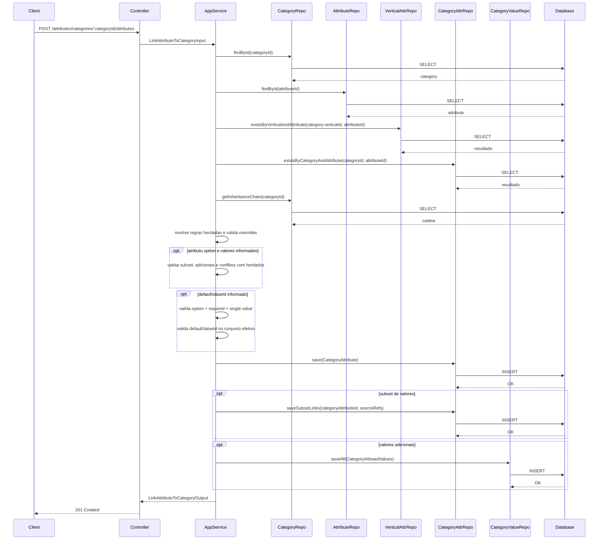
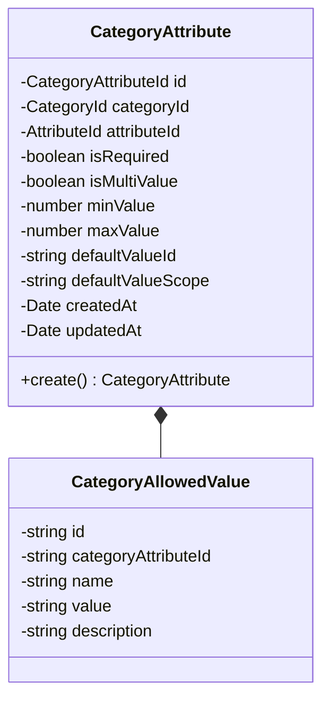
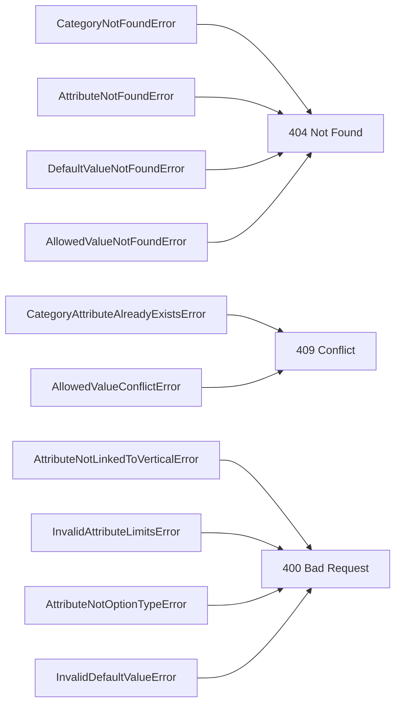

# Design: Link Attribute to Category

**Created**: 2026-01-08  
**Spec**: [./spec.md](./spec.md)  
**Project**: [../../../project.md](../../../project.md)

---

## Overview

A capability Link Attribute to Category cria o vinculo entre um atributo e uma categoria, aplicando sobrescritas e heranca em cascata.
O Application Service valida a existencia da categoria e do atributo, garante que o atributo esteja vinculado a vertical da categoria e previne duplicidade.
Para atributos option, o vinculo pode selecionar subset dos valores herdados e adicionar novos valores, com validacao de conflitos e defaultValue valido.

---

## Component Map

### Domain Layer

| Tipo | Nome | Responsabilidade |
|------|------|------------------|
| Entity | `CategoryAttribute` | Vinculo entre atributo e categoria com overrides |
| Entity | `CategoryAllowedValue` | Valor permitido especifico da categoria |
| Value Object | `CategoryAttributeId` | Identificador do vinculo |
| Value Object | `CategoryId` | Identificador da categoria |
| Value Object | `AttributeId` | Identificador do atributo |
| Value Object | `VerticalId` | Identificador da vertical |
| Repository Interface | `CategoryAttributeRepository` | Persistencia do vinculo categoria-atributo |
| Repository Interface | `CategoryAllowedValueRepository` | Persistencia de valores permitidos da categoria |
| Repository Interface | `CategoryRepository` | Consulta de categoria e hierarquia |
| Repository Interface | `VerticalAttributeRepository` | Verifica vinculo do atributo na vertical |
| Repository Interface | `AttributeRepository` | Consulta de atributo global |

### Application Layer

| Tipo | Nome | Responsabilidade |
|------|------|------------------|
| App Service | `LinkAttributeToCategoryService` | Orquestra a criacao do vinculo |
| Input DTO | `LinkAttributeToCategoryInput` | Dados de entrada para vinculo |
| Output DTO | `LinkAttributeToCategoryOutput` | Dados retornados apos vinculo |

### Infrastructure Layer

| Tipo | Nome | Responsabilidade |
|------|------|------------------|
| Repository Impl | `PrismaCategoryAttributeRepository` | Implementa `CategoryAttributeRepository` |
| Repository Impl | `PrismaCategoryAllowedValueRepository` | Implementa `CategoryAllowedValueRepository` |
| Repository Impl | `PrismaCategoryRepository` | Implementa `CategoryRepository` |
| Repository Impl | `PrismaVerticalAttributeRepository` | Implementa `VerticalAttributeRepository` |
| Repository Impl | `PrismaAttributeRepository` | Implementa `AttributeRepository` |
| Mapper | `CategoryAttributeMapper` | Converte Domain <-> Prisma |
| Mapper | `CategoryAllowedValueMapper` | Converte AllowedValue <-> Prisma |

### Presentation Layer

| Tipo | Nome | Responsabilidade |
|------|------|------------------|
| Controller | `CategoryAttributeController` | Exposicao HTTP do caso de uso |

---

## Dependency Graph

```mermaid
graph TD
    subgraph Presentation
        CTRL[CategoryAttributeController]
    end

    subgraph Application
        SVC[LinkAttributeToCategoryService]
        DTO_IN[LinkAttributeToCategoryInput]
        DTO_OUT[LinkAttributeToCategoryOutput]
    end

    subgraph Domain
        CAT_ATTR[CategoryAttribute]
        CAT_VAL[CategoryAllowedValue]
        VO_ID[CategoryAttributeId]
        VO_CAT[CategoryId]
        VO_ATTR[AttributeId]
        VO_VERT[VerticalId]
        CAT_ATTR_REPO[CategoryAttributeRepository]
        CAT_VAL_REPO[CategoryAllowedValueRepository]
        CAT_REPO[CategoryRepository]
        VERT_ATTR_REPO[VerticalAttributeRepository]
        ATTR_REPO[AttributeRepository]
    end

    subgraph Infrastructure
        CAT_ATTR_IMPL[PrismaCategoryAttributeRepository]
        CAT_VAL_IMPL[PrismaCategoryAllowedValueRepository]
        CAT_REPO_IMPL[PrismaCategoryRepository]
        VERT_ATTR_IMPL[PrismaVerticalAttributeRepository]
        ATTR_REPO_IMPL[PrismaAttributeRepository]
        CAT_ATTR_MAPPER[CategoryAttributeMapper]
        CAT_VAL_MAPPER[CategoryAllowedValueMapper]
        PRISMA[Prisma Client]
    end

    CTRL --> SVC
    CTRL --> DTO_IN
    SVC --> DTO_OUT
    SVC --> CAT_ATTR
    SVC --> CAT_VAL
    SVC --> CAT_ATTR_REPO
    SVC --> CAT_VAL_REPO
    SVC --> CAT_REPO
    SVC --> VERT_ATTR_REPO
    SVC --> ATTR_REPO
    CAT_ATTR --> VO_ID
    CAT_ATTR --> VO_CAT
    CAT_ATTR --> VO_ATTR
    CAT_ATTR --> VO_VERT
    CAT_ATTR_IMPL -.->|implements| CAT_ATTR_REPO
    CAT_VAL_IMPL -.->|implements| CAT_VAL_REPO
    CAT_REPO_IMPL -.->|implements| CAT_REPO
    VERT_ATTR_IMPL -.->|implements| VERT_ATTR_REPO
    ATTR_REPO_IMPL -.->|implements| ATTR_REPO
    CAT_ATTR_IMPL --> CAT_ATTR_MAPPER
    CAT_VAL_IMPL --> CAT_VAL_MAPPER
    CAT_ATTR_IMPL --> PRISMA
    CAT_VAL_IMPL --> PRISMA
    CAT_REPO_IMPL --> PRISMA
    VERT_ATTR_IMPL --> PRISMA
    ATTR_REPO_IMPL --> PRISMA
```



---

## Data Flow

### Fluxo: Vincular Attribute a Category



**Transformacoes de dados:**

| Etapa | De | Para |
|-------|----|----- |
| Controller -> AppService | JSON body | LinkAttributeToCategoryInput |
| AppService -> Domain | DTO | CategoryAttribute/CategoryAllowedValue |
| Repository -> DB | Entities | Prisma Models |

---

## Entity Structure

### CategoryAttribute



**Propriedades:**

| Propriedade | Tipo | Mutavel? | Regras |
|-------------|------|----------|--------|
| `id` | CategoryAttributeId | Nao | Gerado internamente |
| `categoryId` | CategoryId | Nao | Obrigatorio |
| `attributeId` | AttributeId | Nao | Obrigatorio |
| `isRequired` | boolean | Nao | Opcional, herda da categoria pai ou da vertical |
| `isMultiValue` | boolean | Nao | Opcional, herda da categoria pai ou da vertical |
| `minValue` | number | Nao | Opcional, aplicavel a text/number/decimal, valida min <= max |
| `maxValue` | number | Nao | Opcional, aplicavel a text/number/decimal, valida min <= max |
| `defaultValueId` | string | Nao | Opcional, depende de option/required/single |
| `defaultValueScope` | string | Nao | `ATTRIBUTE`, `VERTICAL` ou `CATEGORY` |
| `createdAt` | Date | Nao | Automatico |
| `updatedAt` | Date | Sim | Atualizado em mudancas futuras |

**Comportamentos:**

| Metodo | Regras |
|--------|--------|
| `create` | Valida limites e regras do defaultValue |

---

## Repository Operations

| Operacao | Descricao | Usada por |
|----------|-----------|-----------|
| `CategoryRepository.findById(id)` | Busca categoria e vertical | LinkAttributeToCategoryService |
| `AttributeRepository.findById(id)` | Busca atributo global | LinkAttributeToCategoryService |
| `VerticalAttributeRepository.existsByVerticalAndAttribute(verticalId, attributeId)` | Verifica vinculo na vertical | LinkAttributeToCategoryService |
| `CategoryAttributeRepository.existsByCategoryAndAttribute(categoryId, attributeId)` | Verifica vinculo duplicado | LinkAttributeToCategoryService |
| `CategoryRepository.getInheritanceChain(categoryId)` | Retorna cadeia de categorias ancestrais | LinkAttributeToCategoryService |
| `CategoryAttributeRepository.save(categoryAttribute)` | Persiste vinculo | LinkAttributeToCategoryService |
| `CategoryAttributeRepository.saveSubsetLinks(categoryAttributeId, sourceRefs)` | Persiste subset selecionado | LinkAttributeToCategoryService |
| `CategoryAllowedValueRepository.saveAll(values)` | Persiste valores adicionais | LinkAttributeToCategoryService |

---

## Database Model

```mermaid
erDiagram
    CATEGORIES {
        varchar(36) id PK
        varchar(36) vertical_id FK
    }

    VERTICAL_ATTRIBUTES {
        varchar(36) id PK
        varchar(36) vertical_id FK
        varchar(36) attribute_id FK
    }

    CATEGORY_ATTRIBUTES {
        varchar(36) id PK
        varchar(36) category_id FK
        varchar(36) attribute_id FK
        boolean is_required
        boolean is_multi_value
        decimal(18,4) min_value
        decimal(18,4) max_value
        varchar(20) default_value_scope
        varchar(36) default_value_id
        timestamp created_at
        timestamp updated_at
    }

    CATEGORY_ALLOWED_VALUES {
        varchar(36) id PK
        varchar(36) category_attribute_id FK
        varchar(120) name
        varchar(120) value
        varchar(120) name_normalized
        varchar(120) value_normalized
        varchar(255) description
        timestamp created_at
        timestamp updated_at
    }

    CATEGORY_ALLOWED_VALUE_LINKS {
        varchar(36) category_attribute_id FK
        varchar(20) source_scope
        varchar(36) source_value_id
        timestamp created_at
    }

    CATEGORIES ||--o{ CATEGORY_ATTRIBUTES : has
    CATEGORY_ATTRIBUTES ||--o{ CATEGORY_ALLOWED_VALUES : adds
    CATEGORY_ATTRIBUTES ||--o{ CATEGORY_ALLOWED_VALUE_LINKS : selects
    VERTICAL_ATTRIBUTES ||--o{ CATEGORY_ATTRIBUTES : inherits
```

### Tabela: `category_attributes`

| Coluna | Tipo | Constraints |
|--------|------|-------------|
| `id` | VARCHAR(36) | PK |
| `category_id` | VARCHAR(36) | NOT NULL, FK(categories.id) |
| `attribute_id` | VARCHAR(36) | NOT NULL |
| `is_required` | BOOLEAN | NULL |
| `is_multi_value` | BOOLEAN | NULL |
| `min_value` | DECIMAL(18,4) | NULL |
| `max_value` | DECIMAL(18,4) | NULL |
| `default_value_scope` | VARCHAR(20) | NULL |
| `default_value_id` | VARCHAR(36) | NULL |
| `created_at` | TIMESTAMP | NOT NULL, DEFAULT now() |
| `updated_at` | TIMESTAMP | NULL |

---

## API Endpoints

| Metodo | Path | Operacao | Sucesso | Erros |
|--------|------|----------|---------|-------|
| POST | `/attributes/categories/:categoryId/attributes` | Vincular atributo a categoria | 201 | 400, 404, 409 |

---

## Error Handling



| Erro de Dominio | Quando Ocorre | HTTP Status | Codigo |
|-----------------|---------------|-------------|--------|
| `CategoryNotFoundError` | categoryId inexistente | 404 | `CATEGORY_NOT_FOUND` |
| `AttributeNotFoundError` | attributeId inexistente | 404 | `ATTRIBUTE_NOT_FOUND` |
| `CategoryAttributeAlreadyExistsError` | Vinculo ja existe | 409 | `CATEGORY_ATTRIBUTE_EXISTS` |
| `AttributeNotLinkedToVerticalError` | atributo nao vinculado a vertical | 400 | `ATTRIBUTE_NOT_IN_VERTICAL` |
| `InvalidAttributeLimitsError` | minValue > maxValue | 400 | `INVALID_ATTRIBUTE_LIMITS` |
| `AttributeNotOptionTypeError` | Valores informados para atributo nao option | 400 | `ATTRIBUTE_NOT_OPTION` |
| `InvalidDefaultValueError` | defaultValueId fora das regras | 400 | `INVALID_DEFAULT_VALUE` |
| `DefaultValueNotFoundError` | defaultValueId fora do conjunto efetivo | 404 | `DEFAULT_VALUE_NOT_FOUND` |
| `AllowedValueNotFoundError` | subset contem valor inexistente | 404 | `ALLOWED_VALUE_NOT_FOUND` |
| `AllowedValueConflictError` | conflito com valores herdados | 409 | `ALLOWED_VALUE_CONFLICT` |

---

## Technical Decisions

### Decisao 1: Subset referencia valores herdados por escopo

**Contexto**: O subset pode vir de categoria pai, vertical ou atributo global.

**Decisao**: Persistir subset em `category_allowed_value_links` com `source_scope` e `source_value_id`.

**Justificativa**: Mantem referencia ao nivel de origem e evita duplicacao de valores herdados.

---

### Decisao 2: defaultValueId com escopo explicito

**Contexto**: O default pode apontar para valor herdado ou adicional.

**Decisao**: Armazenar `default_value_scope` com valores `ATTRIBUTE`, `VERTICAL` ou `CATEGORY`.

**Justificativa**: Remove ambiguidade na resolucao de cascata.

---

## Implementation Notes

- A cadeia de heranca segue: categoria mais especifica -> categorias ancestrais -> vertical -> atributo.
- Validar conflitos de `name`/`value` entre adicionais e valores herdados.
- Se nenhum subset ou adicional for informado, herdar todos os valores do nivel superior.
- Em `category_allowed_value_links`, `source_scope` define a tabela origem de `source_value_id` (ATTRIBUTE/VERTICAL/CATEGORY); validacao ocorre na aplicacao.
- Validar que cada `source_value_id` informado existe no conjunto herdado do `source_scope` correspondente.
- Criar indices unicos em `category_allowed_values(category_attribute_id, name_normalized)` e `category_allowed_values(category_attribute_id, value_normalized)`.

---
