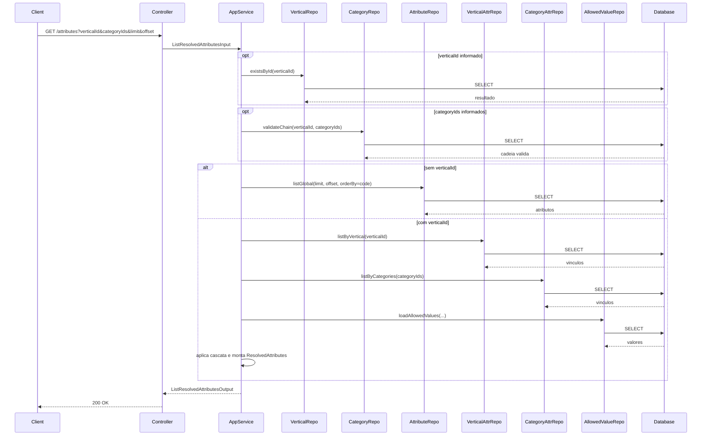
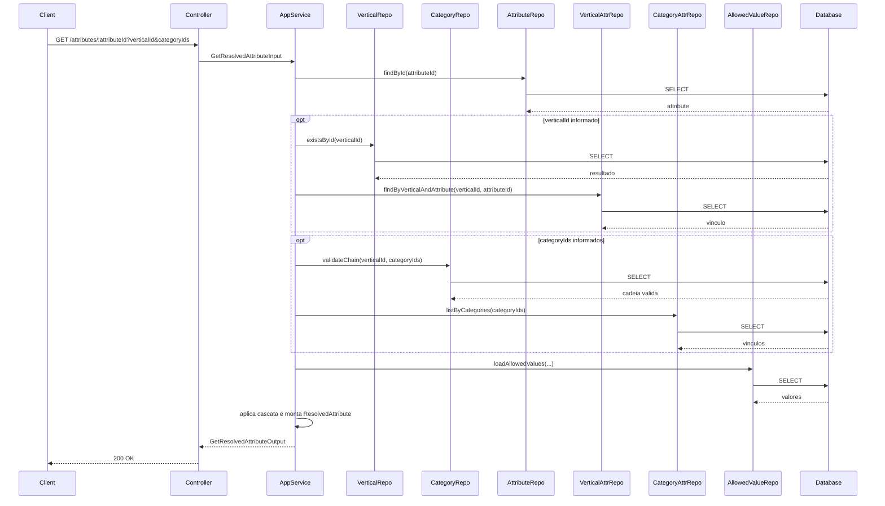
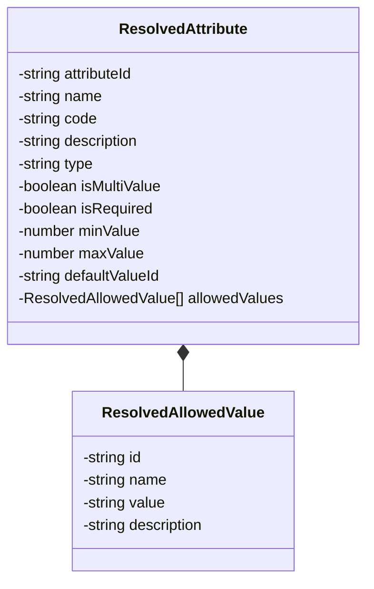
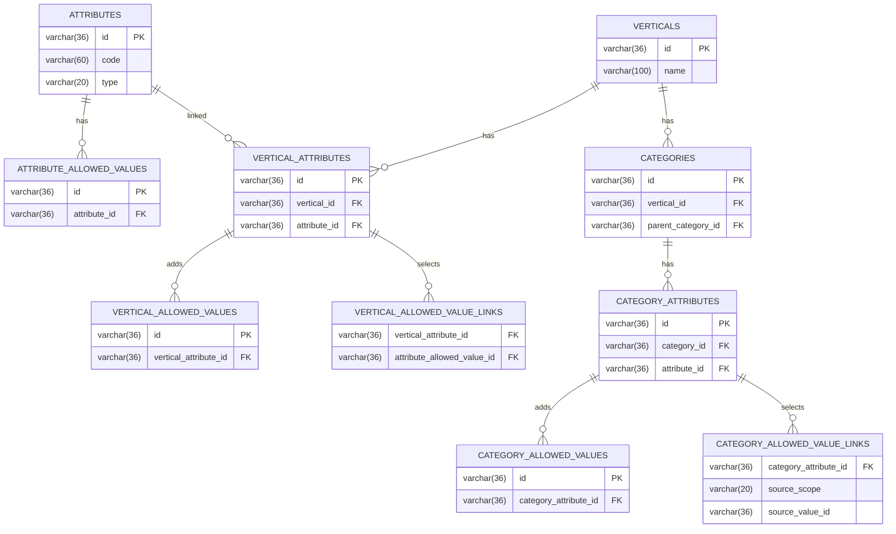
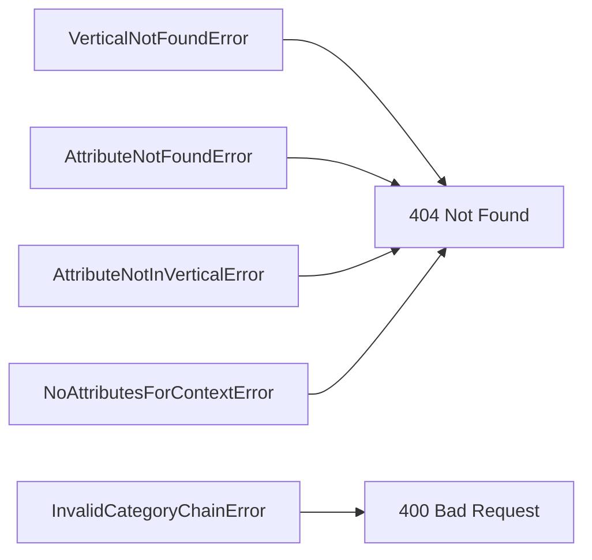

# Design: Resolve Attribute Configuration

**Created**: 2026-01-08  
**Spec**: [./spec.md](./spec.md)  
**Project**: [../../../project.md](../../../project.md)

---

## Overview

A capability Resolve Attribute Configuration lista e consulta atributos com regras efetivas resolvidas por cascata.
O Application Service valida contexto de vertical/categorias, carrega os vinculos e aplica a precedencia: categoria mais especifica -> ancestrais -> vertical -> atributo global.
O resultado retorna atributos ordenados por code, incluindo valores permitidos efetivos para atributos option quando aplicavel.

---

## Component Map

### Domain Layer

| Tipo | Nome | Responsabilidade |
|------|------|------------------|
| Entity | `ResolvedAttribute` | Representa o atributo com regras efetivas |
| Value Object | `AttributeId` | Identificador do atributo |
| Value Object | `VerticalId` | Identificador da vertical |
| Value Object | `CategoryChain` | Cadeia ordenada de categorias |
| Domain Service | `AttributeResolutionService` | Aplica a cascata e resolve valores efetivos |
| Repository Interface | `AttributeRepository` | Consulta atributos globais |
| Repository Interface | `VerticalAttributeRepository` | Consulta vinculos por vertical |
| Repository Interface | `CategoryAttributeRepository` | Consulta vinculos por categoria |
| Repository Interface | `AllowedValueRepository` | Consulta valores permitidos globais |
| Repository Interface | `VerticalAllowedValueRepository` | Consulta valores permitidos da vertical |
| Repository Interface | `CategoryAllowedValueRepository` | Consulta valores permitidos da categoria |
| Repository Interface | `VerticalRepository` | Validacao de vertical |
| Repository Interface | `CategoryRepository` | Validacao da cadeia de categorias |

### Application Layer

| Tipo | Nome | Responsabilidade |
|------|------|------------------|
| App Service | `ResolveAttributeConfigurationService` | Orquestra listagem e consulta resolvidas |
| Input DTO | `ListResolvedAttributesInput` | Parametros de listagem |
| Output DTO | `ListResolvedAttributesOutput` | Resultado da listagem |
| Input DTO | `GetResolvedAttributeInput` | Parametros de consulta individual |
| Output DTO | `GetResolvedAttributeOutput` | Resultado da consulta individual |

### Infrastructure Layer

| Tipo | Nome | Responsabilidade |
|------|------|------------------|
| Repository Impl | `PrismaAttributeRepository` | Implementa `AttributeRepository` |
| Repository Impl | `PrismaVerticalAttributeRepository` | Implementa `VerticalAttributeRepository` |
| Repository Impl | `PrismaCategoryAttributeRepository` | Implementa `CategoryAttributeRepository` |
| Repository Impl | `PrismaAllowedValueRepository` | Implementa `AllowedValueRepository` |
| Repository Impl | `PrismaVerticalAllowedValueRepository` | Implementa `VerticalAllowedValueRepository` |
| Repository Impl | `PrismaCategoryAllowedValueRepository` | Implementa `CategoryAllowedValueRepository` |
| Repository Impl | `PrismaVerticalRepository` | Implementa `VerticalRepository` |
| Repository Impl | `PrismaCategoryRepository` | Implementa `CategoryRepository` |

### Presentation Layer

| Tipo | Nome | Responsabilidade |
|------|------|------------------|
| Controller | `ResolvedAttributeController` | Exposicao HTTP de listagem e consulta |

---

## Dependency Graph

```mermaid
graph TD
    subgraph Presentation
        CTRL[ResolvedAttributeController]
    end

    subgraph Application
        SVC[ResolveAttributeConfigurationService]
        DTO_LIST_IN[ListResolvedAttributesInput]
        DTO_LIST_OUT[ListResolvedAttributesOutput]
        DTO_GET_IN[GetResolvedAttributeInput]
        DTO_GET_OUT[GetResolvedAttributeOutput]
    end

    subgraph Domain
        RES[ResolvedAttribute]
        VO_ATTR[AttributeId]
        VO_VERT[VerticalId]
        VO_CHAIN[CategoryChain]
        RESOLVE[AttributeResolutionService]
        ATTR_REPO[AttributeRepository]
        VERT_ATTR_REPO[VerticalAttributeRepository]
        CAT_ATTR_REPO[CategoryAttributeRepository]
        ALLOWED_REPO[AllowedValueRepository]
        VERT_VAL_REPO[VerticalAllowedValueRepository]
        CAT_VAL_REPO[CategoryAllowedValueRepository]
        VERT_REPO[VerticalRepository]
        CAT_REPO[CategoryRepository]
    end

    subgraph Infrastructure
        PRISMA[Prisma Client]
    end

    CTRL --> SVC
    CTRL --> DTO_LIST_IN
    CTRL --> DTO_GET_IN
    SVC --> DTO_LIST_OUT
    SVC --> DTO_GET_OUT
    SVC --> RESOLVE
    SVC --> ATTR_REPO
    SVC --> VERT_ATTR_REPO
    SVC --> CAT_ATTR_REPO
    SVC --> ALLOWED_REPO
    SVC --> VERT_VAL_REPO
    SVC --> CAT_VAL_REPO
    SVC --> VERT_REPO
    SVC --> CAT_REPO
    RESOLVE --> RES
    RESOLVE --> VO_ATTR
    RESOLVE --> VO_VERT
    RESOLVE --> VO_CHAIN
    ATTR_REPO --> PRISMA
    VERT_ATTR_REPO --> PRISMA
    CAT_ATTR_REPO --> PRISMA
    ALLOWED_REPO --> PRISMA
    VERT_VAL_REPO --> PRISMA
    CAT_VAL_REPO --> PRISMA
    VERT_REPO --> PRISMA
    CAT_REPO --> PRISMA
```

---

## Data Flow

### Fluxo: Listar Atributos Resolvidos

### Fluxo: Consultar Atributo Resolvido

**Transformacoes de dados:**

| Etapa | De | Para |
|-------|----|----- |
| Controller -> AppService | Query params | Input DTOs |
| AppService -> Domain | Dados + Repos | ResolvedAttribute |
| AppService -> Controller | ResolvedAttribute | Output DTOs |

---

## Entity Structure

### ResolvedAttribute

**Propriedades:**

| Propriedade | Tipo | Mutavel? | Regras |
|-------------|------|----------|--------|
| `attributeId` | string | Nao | Obrigatorio |
| `name` | string | Nao | Obrigatorio |
| `code` | string | Nao | Obrigatorio |
| `description` | string | Nao | Obrigatorio |
| `type` | string | Nao | Obrigatorio |
| `isMultiValue` | boolean | Nao | Obrigatorio |
| `isRequired` | boolean | Nao | Obrigatorio |
| `minValue` | number | Nao | Opcional |
| `maxValue` | number | Nao | Opcional |
| `defaultValueId` | string | Nao | Opcional |
| `allowedValues` | ResolvedAllowedValue[] | Nao | Apenas para option |

---

## Repository Operations

| Operacao | Descricao | Usada por |
|----------|-----------|-----------|
| `AttributeRepository.listGlobal(limit, offset, orderBy)` | Lista atributos globais | ResolveAttributeConfigurationService |
| `AttributeRepository.findById(id)` | Busca atributo global | ResolveAttributeConfigurationService |
| `VerticalRepository.existsById(id)` | Valida vertical | ResolveAttributeConfigurationService |
| `CategoryRepository.validateChain(verticalId, categoryIds)` | Valida cadeia pai-filho | ResolveAttributeConfigurationService |
| `VerticalAttributeRepository.listByVertical(verticalId)` | Lista vinculos da vertical | ResolveAttributeConfigurationService |
| `VerticalAttributeRepository.findByVerticalAndAttribute(verticalId, attributeId)` | Busca vinculo especifico | ResolveAttributeConfigurationService |
| `CategoryAttributeRepository.listByCategories(categoryIds)` | Lista vinculos das categorias | ResolveAttributeConfigurationService |
| `AllowedValueRepository.listByAttribute(attributeId)` | Lista valores globais | ResolveAttributeConfigurationService |
| `VerticalAllowedValueRepository.listByVerticalAttribute(verticalAttributeId)` | Lista valores adicionais da vertical | ResolveAttributeConfigurationService |
| `CategoryAllowedValueRepository.listByCategoryAttribute(categoryAttributeId)` | Lista valores adicionais da categoria | ResolveAttributeConfigurationService |
| `VerticalAttributeRepository.listSubsetLinks(verticalAttributeId)` | Lista subset selecionado na vertical | ResolveAttributeConfigurationService |
| `CategoryAttributeRepository.listSubsetLinks(categoryAttributeId)` | Lista subset selecionado na categoria | ResolveAttributeConfigurationService |

---

## Database Model

---

## API Endpoints

| Metodo | Path | Operacao | Sucesso | Erros |
|--------|------|----------|---------|-------|
| GET | `/attributes` | Listar atributos resolvidos | 200 | 400, 404 |
| GET | `/attributes/:attributeId` | Consultar atributo resolvido | 200 | 400, 404 |

---

## Error Handling

| Erro de Dominio | Quando Ocorre | HTTP Status | Codigo |
|-----------------|---------------|-------------|--------|
| `VerticalNotFoundError` | verticalId inexistente | 404 | `VERTICAL_NOT_FOUND` |
| `InvalidCategoryChainError` | Cadeia de categorias invalida | 400 | `INVALID_CATEGORY_CHAIN` |
| `AttributeNotFoundError` | attributeId inexistente | 404 | `ATTRIBUTE_NOT_FOUND` |
| `AttributeNotInVerticalError` | atributo nao vinculado a vertical | 404 | `ATTRIBUTE_NOT_IN_VERTICAL` |
| `NoAttributesForContextError` | Nenhum atributo no contexto | 404 | `NO_ATTRIBUTES_FOR_CONTEXT` |

---

## Technical Decisions

### Decisao 1: Resolucao por dominio com ordem de precedencia explicita

**Contexto**: A cascata exige uma ordem fixa de aplicacao das regras.

**Decisao**: O `AttributeResolutionService` aplica overrides na ordem: categoria mais especifica -> ancestrais -> vertical -> atributo.

**Justificativa**: Garante consistencia entre listagem e consulta individual.

---

### Decisao 2: Valores permitidos resolvidos por union controlada

**Contexto**: O conjunto efetivo combina subset + adicionais sem redefinir valores herdados.

**Decisao**: O service monta o conjunto efetivo preservando valores herdados e adicionando somente valores novos.

**Justificativa**: Mantem o comportamento esperado pelo spec e evita conflitos.

---

## Implementation Notes

- Validar `categoryIds` como cadeia ordenada (raiz -> folha) na mesma vertical.
- Ordenar listagem por `code` ascendente e suportar `limit`/`offset`.
- Quando nenhum atributo estiver disponivel no contexto, retornar not found.
- Rejeitar `categoryIds` quando `verticalId` nao for informado.
- Aplicar defaults por tipo quando nenhum nivel definir `minValue` e `maxValue`.
- Retornar `defaultValueId` apenas quando o atributo efetivo for option, obrigatorio e nao multivalor, e o valor estiver presente nos allowedValues efetivos.

---
