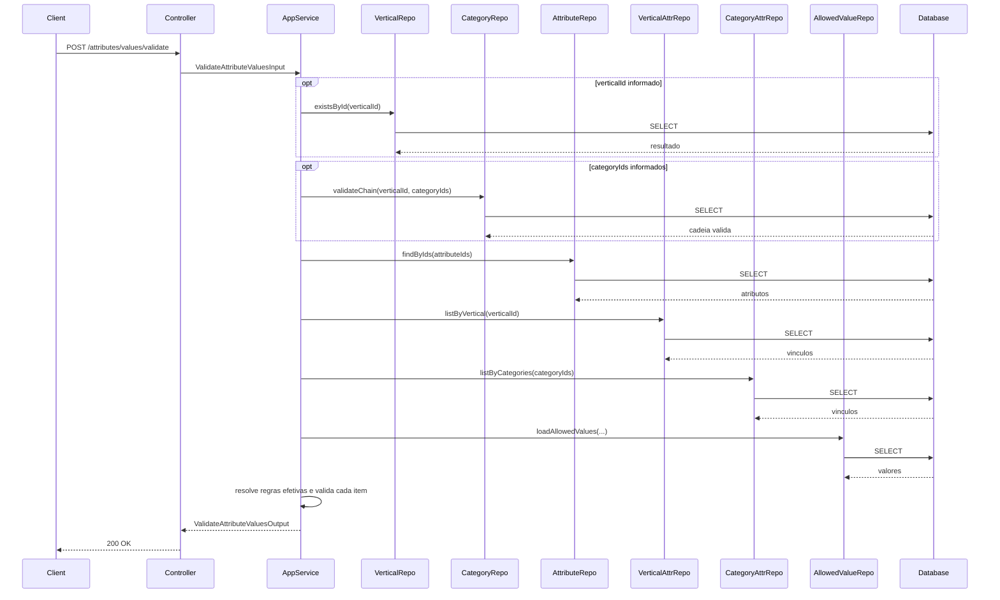
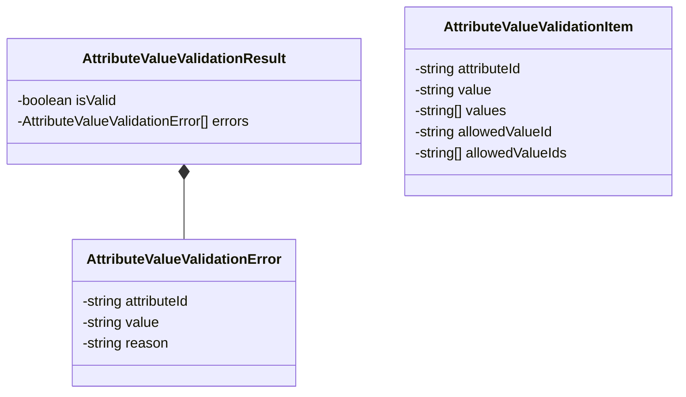
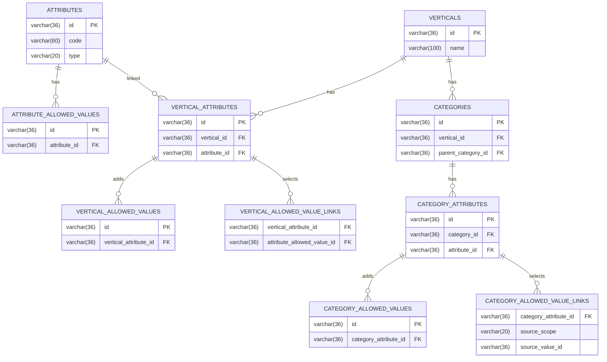
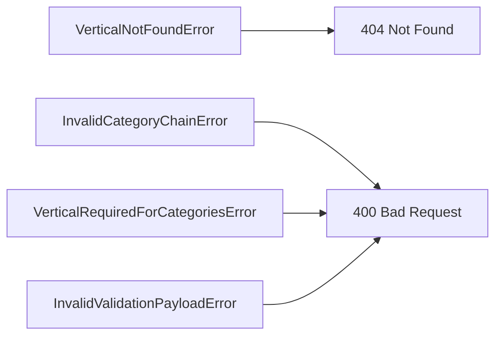

# Design: Attribute Value Validation

**Created**: 2026-01-09  
**Spec**: [./spec.md](./spec.md)  
**Project**: [../../../project.md](../../../project.md)

---

## Overview

A capability Attribute Value Validation valida uma lista de atributos e valores com contexto opcional de vertical e cadeia de categorias.
O Application Service resolve as regras efetivas por cascata e executa validacoes por atributo/valor, retornando erros detalhados sem interromper o processamento dos demais itens.
Nao ha persistencia de dados; a complexidade esta na resolucao de contexto, cascata e validacao multivalor.

---

## Component Map

### Domain Layer

| Tipo | Nome | Responsabilidade |
|------|------|------------------|
| Value Object | `AttributeValueValidationItem` | Item de validacao com atributo e valor(es) informados |
| Value Object | `AttributeValueValidationError` | Erro por atributo/valor com motivo |
| Value Object | `AttributeValueValidationResult` | Resultado da validacao (isValid + errors) |
| Value Object | `AttributeId` | Identificador do atributo |
| Value Object | `VerticalId` | Identificador da vertical |
| Value Object | `CategoryChain` | Cadeia ordenada de categorias |
| Domain Service | `AttributeResolutionService` | Resolve regras efetivas por cascata |
| Domain Service | `AttributeValueValidationService` | Valida valores conforme regras efetivas |
| Repository Interface | `AttributeRepository` | Consulta atributos globais |
| Repository Interface | `VerticalAttributeRepository` | Consulta vinculos por vertical |
| Repository Interface | `CategoryAttributeRepository` | Consulta vinculos por categoria |
| Repository Interface | `AllowedValueRepository` | Consulta valores permitidos globais |
| Repository Interface | `VerticalAllowedValueRepository` | Consulta valores permitidos da vertical |
| Repository Interface | `CategoryAllowedValueRepository` | Consulta valores permitidos da categoria |
| Repository Interface | `VerticalRepository` | Validacao de vertical |
| Repository Interface | `CategoryRepository` | Validacao da cadeia de categorias |

### Application Layer

| Tipo | Nome | Responsabilidade |
|------|------|------------------|
| App Service | `ValidateAttributeValuesService` | Orquestra validacao de valores |
| Input DTO | `ValidateAttributeValuesInput` | Dados de entrada (contexto + itens) |
| Output DTO | `ValidateAttributeValuesOutput` | Resultado da validacao e erros |

### Infrastructure Layer

| Tipo | Nome | Responsabilidade |
|------|------|------------------|
| Repository Impl | `PrismaAttributeRepository` | Implementa `AttributeRepository` |
| Repository Impl | `PrismaVerticalAttributeRepository` | Implementa `VerticalAttributeRepository` |
| Repository Impl | `PrismaCategoryAttributeRepository` | Implementa `CategoryAttributeRepository` |
| Repository Impl | `PrismaAllowedValueRepository` | Implementa `AllowedValueRepository` |
| Repository Impl | `PrismaVerticalAllowedValueRepository` | Implementa `VerticalAllowedValueRepository` |
| Repository Impl | `PrismaCategoryAllowedValueRepository` | Implementa `CategoryAllowedValueRepository` |
| Repository Impl | `PrismaVerticalRepository` | Implementa `VerticalRepository` |
| Repository Impl | `PrismaCategoryRepository` | Implementa `CategoryRepository` |

### Presentation Layer

| Tipo | Nome | Responsabilidade |
|------|------|------------------|
| Controller | `AttributeValueValidationController` | Exposicao HTTP da validacao |

---

## Dependency Graph

```mermaid
graph TD
    subgraph Presentation
        CTRL[AttributeValueValidationController]
    end

    subgraph Application
        SVC[ValidateAttributeValuesService]
        DTO_IN[ValidateAttributeValuesInput]
        DTO_OUT[ValidateAttributeValuesOutput]
    end

    subgraph Domain
        ITEM[AttributeValueValidationItem]
        ERR[AttributeValueValidationError]
        RES[AttributeValueValidationResult]
        VO_ATTR[AttributeId]
        VO_VERT[VerticalId]
        VO_CHAIN[CategoryChain]
        RESOLVE[AttributeResolutionService]
        VALIDATE[AttributeValueValidationService]
        ATTR_REPO[AttributeRepository]
        VERT_ATTR_REPO[VerticalAttributeRepository]
        CAT_ATTR_REPO[CategoryAttributeRepository]
        ALLOWED_REPO[AllowedValueRepository]
        VERT_VAL_REPO[VerticalAllowedValueRepository]
        CAT_VAL_REPO[CategoryAllowedValueRepository]
        VERT_REPO[VerticalRepository]
        CAT_REPO[CategoryRepository]
    end

    subgraph Infrastructure
        PRISMA[Prisma Client]
    end

    CTRL --> SVC
    CTRL --> DTO_IN
    SVC --> DTO_OUT
    SVC --> RESOLVE
    SVC --> VALIDATE
    SVC --> ITEM
    SVC --> ERR
    SVC --> RES
    SVC --> ATTR_REPO
    SVC --> VERT_ATTR_REPO
    SVC --> CAT_ATTR_REPO
    SVC --> ALLOWED_REPO
    SVC --> VERT_VAL_REPO
    SVC --> CAT_VAL_REPO
    SVC --> VERT_REPO
    SVC --> CAT_REPO
    RESOLVE --> VO_ATTR
    RESOLVE --> VO_VERT
    RESOLVE --> VO_CHAIN
    ATTR_REPO --> PRISMA
    VERT_ATTR_REPO --> PRISMA
    CAT_ATTR_REPO --> PRISMA
    ALLOWED_REPO --> PRISMA
    VERT_VAL_REPO --> PRISMA
    CAT_VAL_REPO --> PRISMA
    VERT_REPO --> PRISMA
    CAT_REPO --> PRISMA
```

---

## Data Flow

### Fluxo: Validar Valores de Atributos

**Transformacoes de dados:**

| Etapa | De | Para |
|-------|----|----- |
| Controller -> AppService | JSON body | ValidateAttributeValuesInput |
| AppService -> Domain | DTO + contexto | AttributeValueValidationResult |
| AppService -> Controller | Resultado | ValidateAttributeValuesOutput |

---

## Entity Structure

### AttributeValueValidationResult

**Propriedades:**

| Propriedade | Tipo | Mutavel? | Regras |
|-------------|------|----------|--------|
| `isValid` | boolean | Nao | True quando nao ha erros |
| `errors` | AttributeValueValidationError[] | Nao | Lista detalhada por atributo/valor |

**Comportamentos:**

| Metodo | Regras |
|--------|--------|
| `build` | Agrega erros e define `isValid` |

---

## Repository Operations

| Operacao | Descricao | Usada por |
|----------|-----------|-----------|
| `AttributeRepository.findByIds(ids)` | Busca atributos por lista | ValidateAttributeValuesService |
| `AttributeRepository.listGlobal()` | Lista atributos globais | ValidateAttributeValuesService |
| `VerticalRepository.existsById(id)` | Valida vertical | ValidateAttributeValuesService |
| `CategoryRepository.validateChain(verticalId, categoryIds)` | Valida cadeia pai-filho | ValidateAttributeValuesService |
| `VerticalAttributeRepository.listByVertical(verticalId)` | Lista vinculos da vertical | ValidateAttributeValuesService |
| `CategoryAttributeRepository.listByCategories(categoryIds)` | Lista vinculos das categorias | ValidateAttributeValuesService |
| `AllowedValueRepository.listByAttribute(attributeId)` | Lista valores globais | ValidateAttributeValuesService |
| `VerticalAllowedValueRepository.listByVerticalAttribute(verticalAttributeId)` | Lista valores adicionais da vertical | ValidateAttributeValuesService |
| `CategoryAllowedValueRepository.listByCategoryAttribute(categoryAttributeId)` | Lista valores adicionais da categoria | ValidateAttributeValuesService |
| `VerticalAttributeRepository.listSubsetLinks(verticalAttributeId)` | Lista subset da vertical | ValidateAttributeValuesService |
| `CategoryAttributeRepository.listSubsetLinks(categoryAttributeId)` | Lista subset da categoria | ValidateAttributeValuesService |

---

## Database Model

---

## API Endpoints

| Metodo | Path | Operacao | Sucesso | Erros |
|--------|------|----------|---------|-------|
| POST | `/attributes/values/validate` | Validar valores de atributos | 200 | 400, 404 |

---

## Error Handling

| Erro de Dominio | Quando Ocorre | HTTP Status | Codigo |
|-----------------|---------------|-------------|--------|
| `VerticalNotFoundError` | verticalId inexistente | 404 | `VERTICAL_NOT_FOUND` |
| `InvalidCategoryChainError` | Cadeia de categorias invalida | 400 | `INVALID_CATEGORY_CHAIN` |
| `VerticalRequiredForCategoriesError` | categoryIds sem verticalId | 400 | `VERTICAL_REQUIRED` |
| `InvalidValidationPayloadError` | items ausente ou vazio | 400 | `INVALID_VALIDATION_PAYLOAD` |

Notas:
- Erros por atributo/valor sao retornados no body com 200 OK, conforme o spec.

---

## Technical Decisions

### Decisao 1: Reutilizar resolucao de cascata

**Contexto**: A validacao precisa das mesmas regras efetivas usadas na listagem e consulta resolvidas.

**Decisao**: Reutilizar `AttributeResolutionService` para montar o conjunto efetivo antes de validar valores.

**Justificativa**: Garante consistencia entre configuracao resolvida e validacao de entrada.

---

### Decisao 2: Erros por atributo como dados, nao excecoes

**Contexto**: A spec exige validacao completa da lista, com erros por item sem interromper os demais.

**Decisao**: Tratar erros de atributo/valor como parte do `AttributeValueValidationResult`, sem lancar excecao.

**Justificativa**: Mantem o fluxo deterministico e permite resposta parcial com detalhes.

---

### Decisao 3: Resolucao e validacao em lote

**Contexto**: A lista pode conter varios atributos e valores.

**Decisao**: Buscar atributos, vinculos e valores permitidos em lote e validar em memoria.

**Justificativa**: Evita N+1 queries e reduz latencia.

---

## Implementation Notes

- Rejeitar categoryIds quando verticalId nao for informado.
- Identificar attributeIds duplicados; retornar erro de duplicidade e processar apenas a primeira ocorrencia.
- Para cada item, garantir exatamente um formato de valor (`value`, `values`, `allowedValueId`, `allowedValueIds`) conforme tipo e `isMultiValue`.
- Validar tipos nao option: `text` por tamanho, `number` inteiro, `decimal` com `.` como separador, `date` em ISO 8601 (`YYYY-MM-DD`), `url` absoluta com `scheme` e `host`, `boolean` apenas `true`/`false`.
- Para option, validar se o(s) allowedValueId(s) pertence(m) ao conjunto efetivo.
- Sinalizar atributos obrigatorios ausentes ou vazios; para multivalor, lista vazia e invalida.
- Quando o atributo nao existir ou nao estiver no contexto, retornar erro por atributo sem interromper os demais.

---
