# attributes

## 01-create-attribute

### design
# Design: Create Attribute

**Created**: 2026-01-08  
**Spec**: [./spec.md](./spec.md)  
**Project**: [../../../project.md](../../../project.md)

---

## Overview

A capability Create Attribute cria atributos globais com regras basicas de preenchimento e limites por tipo.
A orquestracao ocorre no Application Service, que valida unicidade de name/code, formato do code e consistencia de limites, aplicando defaults por tipo quando necessario.
O atributo e persistido na base do contexto de atributos e fica disponivel para vinculos futuros com verticais e categorias.
Opcionalmente, para atributos do tipo option, o request pode incluir allowedValues iniciais; quando informados, o defaultValueId deve referenciar um desses valores.

---

## Component Map

### Domain Layer

| Tipo | Nome | Responsabilidade |
|------|------|------------------|
| Entity | `Attribute` | Representa um atributo global reutilizavel |
| Value Object | `AttributeId` | Identificador unico do atributo |
| Value Object | `AttributeName` | Nome validado e normalizado |
| Value Object | `AttributeCode` | Codigo UPPERCASE com `_` |
| Value Object | `AttributeType` | Tipo do atributo (text, number, decimal, date, boolean, option, url) |
| Value Object | `AttributeLimits` | Encapsula min/max e valida consistencia |
| Entity | `AllowedValue` | Valor permitido inicial do atributo option |
| Value Object | `AllowedValueId` | Identificador unico do valor permitido |
| Value Object | `AllowedValueName` | Nome validado e normalizado |
| Value Object | `AllowedValueValue` | Value em Pascal Case validado |
| Repository Interface | `AttributeRepository` | Persistencia e consultas de atributo |
| Repository Interface | `AllowedValueRepository` | Persistencia e consulta de valores permitidos |

### Application Layer

| Tipo | Nome | Responsabilidade |
|------|------|------------------|
| App Service | `CreateAttributeService` | Orquestra a criacao do atributo |
| Input DTO | `CreateAttributeInput` | Dados de entrada para criacao |
| Output DTO | `CreateAttributeOutput` | Dados retornados apos criacao |

### Infrastructure Layer

| Tipo | Nome | Responsabilidade |
|------|------|------------------|
| Repository Impl | `PrismaAttributeRepository` | Implementa `AttributeRepository` |
| Repository Impl | `PrismaAllowedValueRepository` | Implementa `AllowedValueRepository` |
| Mapper | `AttributeMapper` | Converte Domain <-> Prisma |
| Mapper | `AllowedValueMapper` | Converte AllowedValue <-> Prisma |

### Presentation Layer

| Tipo | Nome | Responsabilidade |
|------|------|------------------|
| Controller | `AttributeController` | Exposicao HTTP do caso de uso |

---

## Dependency Graph

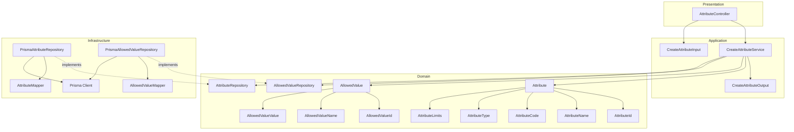

---

## Data Flow

### Fluxo: Criar Attribute

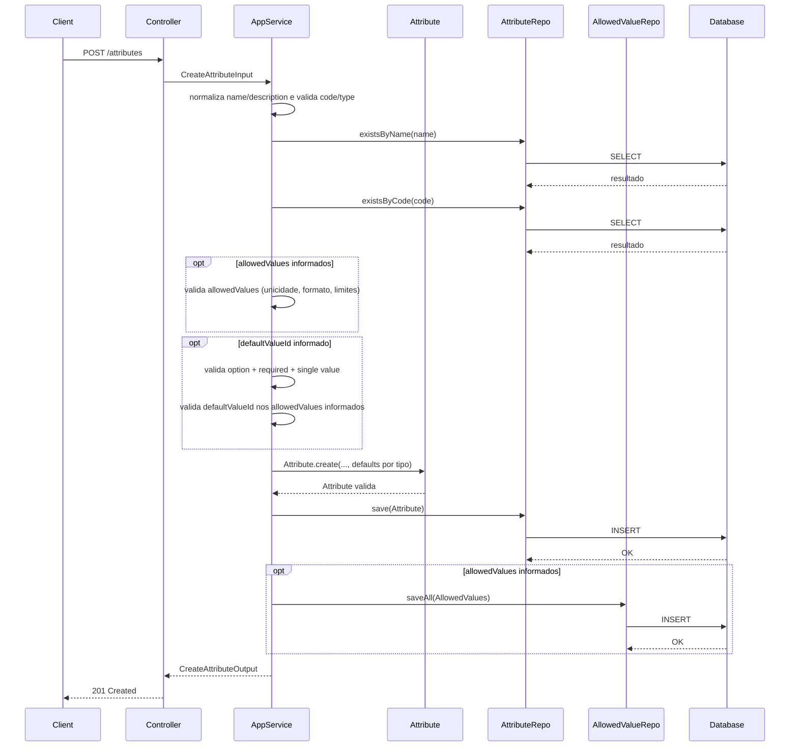

**Transformacoes de dados:**

| Etapa | De | Para |
|-------|----|----- |
| Controller -> AppService | JSON body | CreateAttributeInput |
| AppService -> Domain | DTO | Attribute |
| Repository -> DB | Attribute | Prisma Model |

---

## Entity Structure

### Attribute

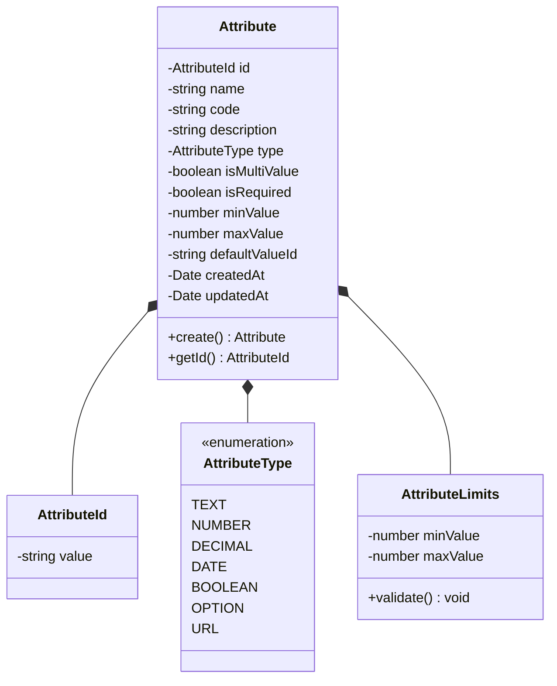

**Propriedades:**

| Propriedade | Tipo | Mutavel? | Regras |
|-------------|------|----------|--------|
| `id` | AttributeId | Nao | Gerado internamente |
| `name` | string | Nao | Obrigatorio, unico global |
| `code` | string | Nao | Obrigatorio, unico, UPPERCASE com `_` |
| `description` | string | Nao | Obrigatorio |
| `type` | AttributeType | Nao | Valores: text, number, decimal, date, boolean, option, url |
| `isMultiValue` | boolean | Nao | Obrigatorio |
| `isRequired` | boolean | Nao | Obrigatorio |
| `minValue` | number | Nao | Defaults por tipo quando ausente |
| `maxValue` | number | Nao | Defaults por tipo quando ausente |
| `defaultValueId` | string | Nao | Opcional, apenas option + required + single value |
| `createdAt` | Date | Nao | Automatico |
| `updatedAt` | Date | Sim | Atualizado em mudancas futuras |

**Comportamentos:**

| Metodo | Regras |
|--------|--------|
| `create` | Valida code, type, limites e aplica defaults por tipo |

---

## Repository Operations

| Operacao | Descricao | Usada por |
|----------|-----------|-----------|
| `AttributeRepository.save(attribute)` | Persiste atributo | CreateAttributeService |
| `AttributeRepository.existsByName(name)` | Verifica duplicidade de nome | CreateAttributeService |
| `AttributeRepository.existsByCode(code)` | Verifica duplicidade de codigo | CreateAttributeService |
| `AllowedValueRepository.saveAll(values)` | Persiste allowed values iniciais | CreateAttributeService |

---

## Database Model

```mermaid
erDiagram
    ATTRIBUTES {
        varchar(36) id PK
        varchar(120) name UK
        varchar(60) code UK
        varchar(255) description
        varchar(20) type
        boolean is_multi_value
        boolean is_required
        decimal(18,4) min_value
        decimal(18,4) max_value
        varchar(36) default_value_id FK
        timestamp created_at
        timestamp updated_at
    }

    ATTRIBUTE_ALLOWED_VALUES {
        varchar(36) id PK
        varchar(36) attribute_id FK
        varchar(120) name
        varchar(120) value
        varchar(120) name_normalized
        varchar(120) value_normalized
        varchar(255) description
        timestamp created_at
        timestamp updated_at
    }

    ATTRIBUTES ||--o{ ATTRIBUTE_ALLOWED_VALUES : has
```

### Tabela: `attributes`

| Coluna | Tipo | Constraints |
|--------|------|-------------|
| `id` | VARCHAR(36) | PK |
| `name` | VARCHAR(120) | NOT NULL, UNIQUE |
| `code` | VARCHAR(60) | NOT NULL, UNIQUE |
| `description` | VARCHAR(255) | NOT NULL |
| `type` | VARCHAR(20) | NOT NULL |
| `is_multi_value` | BOOLEAN | NOT NULL |
| `is_required` | BOOLEAN | NOT NULL |
| `min_value` | DECIMAL(18,4) | NOT NULL |
| `max_value` | DECIMAL(18,4) | NOT NULL |
| `default_value_id` | VARCHAR(36) | NULL, FK(attribute_allowed_values.id) |
| `created_at` | TIMESTAMP | NOT NULL, DEFAULT now() |
| `updated_at` | TIMESTAMP | NULL |

---

## API Endpoints

| Metodo | Path | Operacao | Sucesso | Erros |
|--------|------|----------|---------|-------|
| POST | `/attributes` | Criar atributo | 201 | 400, 404, 409 |

---

## Error Handling

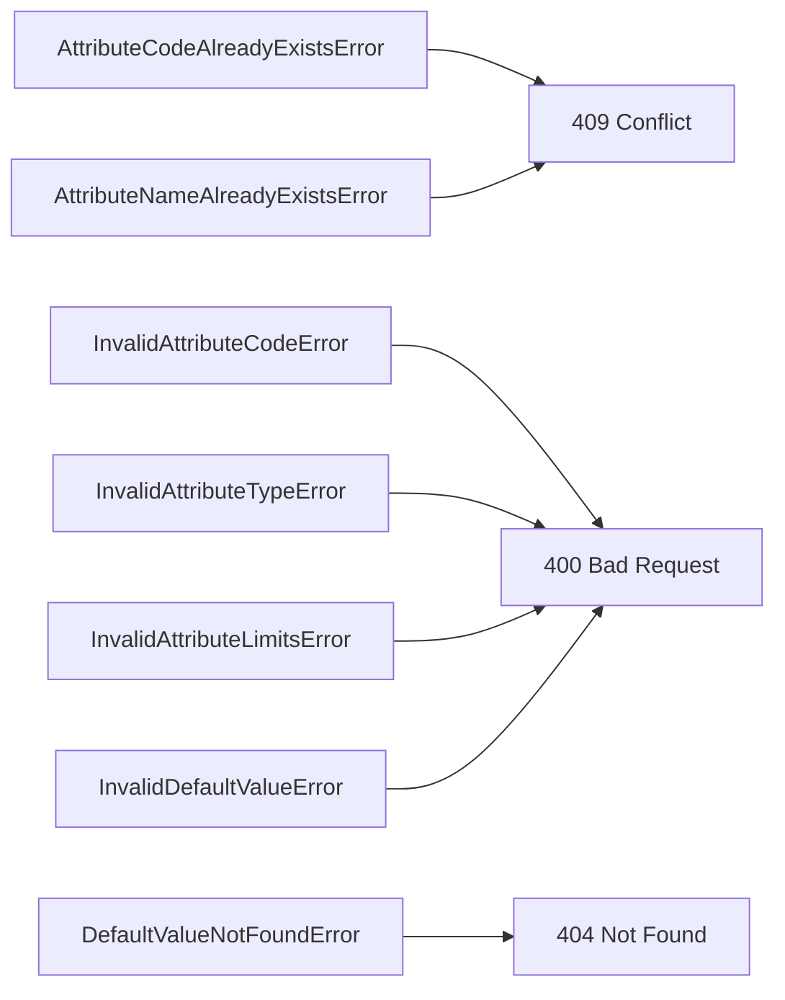

| Erro de Dominio | Quando Ocorre | HTTP Status | Codigo |
|-----------------|---------------|-------------|--------|
| `AttributeCodeAlreadyExistsError` | Code ja cadastrado | 409 | `ATTRIBUTE_CODE_ALREADY_EXISTS` |
| `AttributeNameAlreadyExistsError` | Name ja cadastrado | 409 | `ATTRIBUTE_NAME_ALREADY_EXISTS` |
| `InvalidAttributeCodeError` | Formato de code invalido | 400 | `INVALID_ATTRIBUTE_CODE` |
| `InvalidAttributeTypeError` | Type invalido | 400 | `INVALID_ATTRIBUTE_TYPE` |
| `InvalidAttributeLimitsError` | minValue > maxValue | 400 | `INVALID_ATTRIBUTE_LIMITS` |
| `InvalidDefaultValueError` | defaultValueId usado fora das regras | 400 | `INVALID_DEFAULT_VALUE` |
| `DefaultValueNotFoundError` | defaultValueId fora dos allowedValues informados | 404 | `DEFAULT_VALUE_NOT_FOUND` |

Notas:
- Quando `allowedValues` forem informados, reutilizar os codigos e erros da capability Create Allowed Value.

---

## Technical Decisions

### Decisao 1: Defaults por tipo aplicados na criacao

**Contexto**: minValue e maxValue sao opcionais e variam por tipo.

**Decisao**: `Attribute.create` aplica defaults por tipo quando valores nao sao informados.

**Justificativa**: Centraliza regras no dominio e garante consistencia entre validacoes futuras.

---

### Decisao 2: Persistir min/max como decimal unico

**Contexto**: Limites podem representar tamanho (text/option) ou faixa numerica (number/decimal).

**Decisao**: Persistir `min_value` e `max_value` como `DECIMAL(18,4)` e interpretar o tipo no dominio.

**Justificativa**: Simplifica schema e permite limites inteiros e decimais com uma unica representacao.

---

### Decisao 3: Validar defaultValueId contra valores permitidos

**Contexto**: defaultValueId e valido apenas para option + required + single value.

**Decisao**: O Application Service valida as regras e verifica a existencia do valor permitido.

**Justificativa**: Evita configuracao inconsistente e garante referencia valida.

---

### Decisao 4: defaultValueId exige allowedValues no create

**Contexto**: defaultValueId deve referenciar um valor permitido, mas esses valores podem nao existir no momento da criacao.

**Decisao**: Permitir informar `allowedValues` opcionais na criacao do atributo; quando `defaultValueId` for informado, ele deve pertencer a esse conjunto e ambos sao persistidos no mesmo fluxo.

**Justificativa**: Viabiliza defaultValueId na criacao sem quebrar a regra de referencia.

---

## Implementation Notes

- Garantir indices unicos para `attributes.name` e `attributes.code`.
- Normalizar `name` e `description` com trim antes de validar unicidade.
- Aplicar defaults de `minValue`/`maxValue` por tipo conforme o spec.
- Rejeitar `defaultValueId` quando o atributo nao for option, nao for required ou for multivalor.
- Aceitar `defaultValueId` apenas quando `allowedValues` forem informados no request.
- Quando `allowedValues` forem informados, aplicar as mesmas validacoes do Create Allowed Value (trim, Pascal Case, limites, unicidade case-insensitive) e persistir `name_normalized`/`value_normalized`.
- Validacao de valores para tipos `url` e `date` ocorre na capability de cadastro/validacao de valores do produto, fora do escopo deste create.

---

### design-validation
## Avaliacao do Design: Create Attribute

| Criterio | Nota | Observacao |
|----------|------|------------|
| Aderencia a Arquitetura | 5/5 | Camadas DDD respeitadas, domain sem dependencias externas. |
| Completude de Componentes | 5/5 | Entity, VOs, repos, service, DTOs e controller mapeados. |
| Consistencia com Spec | 5/5 | Regras cobertas e alinhadas com o fluxo do create. |
| Modelagem de Dados | 5/5 | Schema coerente com allowed values e defaults por tipo. |
| Fluxos de Dados | 5/5 | Fluxo cobre allowed values e defaultValueId de forma consistente. |
| API Design | 5/5 | Endpoint e erros alinhados com as regras. |
| Diagramas | 5/5 | Mermaid consistente com componentes e fluxo. |
| Decisoes Tecnicas | 5/5 | Decisoes claras e consistentes com a spec. |
| **TOTAL** | 40/40 | |

## Veredicto

- [x] APROVADO - Pode avancar para plan
- [ ] APROVADO COM RESSALVAS - Ajustes menores
- [ ] REPROVADO - Problemas de arquitetura

## Violacoes de Arquitetura

1. Nenhuma identificada.

## Problemas Encontrados

1. Nenhum.

## Pontos Fortes

1. VOs e defaults por tipo bem definidos.
2. Mapeamento de erros coerente com regras de duplicidade e limites.

### spec
# Capability: Create Attribute

**Created**: 2026-01-08  
**Project**: `specs/project.md`

---

<!--
  ╔═══════════════════════════════════════════════════════════════════════════╗
  ║  SPEC DE NEGÓCIO - Define O QUÊ a capability faz                          ║
  ║                                                                           ║
  ║  Este documento é agnóstico de tecnologia. Decisões técnicas              ║
  ║  ficam no design.md da capability.                                        ║
  ╚═══════════════════════════════════════════════════════════════════════════╝
-->

## User Stories

### User Story 1 - Criar atributo global para reutilização (P1)

Como **responsável pela configuração do catálogo**,  
quero **cadastrar um atributo global com nome, código e tipo**,  
para **reutilizá-lo em múltiplas verticais e categorias**.

**Por que P1**: Sem atributos globais não há base para estruturar o cadastro de produtos.

#### Acceptance Criteria

```gherkin
Scenario: Criar atributo com dados básicos
  Given que não existe atributo com o mesmo nome ou código
  When o atributo é criado com nome, código, descrição e tipo
  Then o atributo deve ser criado e ficar disponível para futuras vinculações

Scenario: Rejeitar criação com código duplicado
  Given que já existe um atributo com o mesmo código
  When o atributo é criado
  Then a criação deve ser rejeitada
  And o sistema deve informar que o código já está cadastrado

Scenario: Rejeitar criação com nome duplicado
  Given que já existe um atributo com o mesmo nome
  When o atributo é criado
  Then a criação deve ser rejeitada
  And o sistema deve informar que o nome já está cadastrado

Scenario: Rejeitar criação com código em formato inválido
  Given que o código não está em UPPERCASE com separação por _
  When o atributo é criado
  Then a criação deve ser rejeitada
  And o sistema deve informar que o formato do código é inválido

Scenario: Criar atributo do tipo option sem valores permitidos
  Given que não existe atributo com o mesmo nome ou código
  When o atributo é criado com tipo option
  Then o atributo deve ser criado mesmo sem valores permitidos
```

---

### User Story 2 - Definir regras básicas do atributo (P2)

Como **responsável pela configuração do catálogo**,  
quero **definir se o atributo é obrigatório, multivalor e seus limites**,  
para **orientar o cadastro de produtos nas próximas etapas**.

**Por que P2**: As regras básicas evitam ambiguidade e melhoram a consistência do cadastro.

#### Acceptance Criteria

```gherkin
Scenario: Criar atributo de texto com limite mínimo e máximo
  Given que não existe atributo com o mesmo nome ou código
  When o atributo de texto é criado com min e max
  Then o atributo deve ser criado com os limites de tamanho definidos

Scenario: Criar atributo numérico com faixa mínima e máxima
  Given que não existe atributo com o mesmo nome ou código
  When o atributo numérico é criado com min e max
  Then o atributo deve ser criado com os limites numéricos definidos

Scenario: Criar atributo com apenas limite mínimo
  Given que não existe atributo com o mesmo nome ou código
  When o atributo é criado informando apenas min
  Then o atributo deve ser criado com o limite mínimo definido

Scenario: Rejeitar limites inválidos
  Given que o valor mínimo informado é maior que o valor máximo
  When o atributo é criado
  Then a criação deve ser rejeitada
  And o sistema deve informar que os limites são inválidos

Scenario: Rejeitar default value para atributo não obrigatório
  Given que o atributo é criado como não obrigatório
  When o atributo é criado informando default value
  Then a criação deve ser rejeitada
  And o sistema deve informar que default value exige atributo obrigatório
```

---

## Functional Requirements

- **FR-001**: O sistema **DEVE** permitir criar um atributo com `name`, `code`, `type`, `isMultiValue` e `isRequired`.
- **FR-002**: A `description` **DEVE** ser informada na criação do atributo.
- **FR-003**: O `code` do atributo **DEVE** estar em UPPERCASE com separação por `_`.
- **FR-004**: O `name` e o `code` do atributo **DEVEM** ser únicos globalmente.
- **FR-005**: O `type` **DEVE** ser um valor válido entre: `text`, `number`, `decimal`, `date`, `boolean`, `option`, `url`.
- **FR-006**: O atributo **DEVE** ser criado de forma global, independente de vertical ou categoria.
- **FR-007**: Para `text`, o sistema **PODE** aceitar `minValue` e `maxValue`, representando o tamanho mínimo e máximo do texto; quando ausentes, **DEVEM** usar defaults `minValue=1` e `maxValue=255`.
- **FR-008**: Para `number` e `decimal`, o sistema **PODE** aceitar `minValue` e `maxValue`, representando a faixa numérica permitida; quando ausentes, **DEVEM** usar defaults `minValue=-1000000` e `maxValue=1000000`.
- **FR-009**: Para `option`, `minValue` e `maxValue` **PODEM** representar o tamanho mínimo e máximo do `value` dos valores permitidos; quando ausentes, **DEVEM** usar defaults `minValue=1` e `maxValue=100`.
- **FR-010**: `minValue` e `maxValue` **PODEM** ser informados de forma independente.
- **FR-011**: Quando `minValue` e `maxValue` forem informados, o sistema **DEVE** garantir que `minValue` seja menor ou igual a `maxValue`.
- **FR-012**: Atributos do tipo `option` **PODEM** ser criados sem valores permitidos associados.
- **FR-013**: O `defaultValueId` **PODE** ser informado apenas quando o atributo for do tipo `option`, obrigatório e não multivalor.
- **FR-014**: Quando `defaultValueId` for informado, ele **DEVE** referenciar um valor permitido do próprio atributo.
- **FR-015**: Para atributos do tipo `url`, o sistema **DEVE** validar valores como URL absoluta (com `scheme` e `host`).
- **FR-016**: Para atributos do tipo `date`, o sistema **DEVE** validar valores no formato ISO 8601 (`YYYY-MM-DD`).

---

## Entity

### Attribute

| Campo | Descrição | Regras |
| --- | --- | --- |
| `id` | Identificador único do atributo | Obrigatório, único |
| `name` | Nome do atributo | Obrigatório, único |
| `code` | Código do atributo | Obrigatório, único, UPPERCASE com `_` |
| `description` | Descrição do atributo | Obrigatório |
| `type` | Tipo do atributo | Obrigatório, valores: `text`, `number`, `decimal`, `date`, `boolean`, `option`, `url` |
| `isMultiValue` | Indica se aceita múltiplos valores | Obrigatório |
| `isRequired` | Indica se o preenchimento é obrigatório | Obrigatório |
| `minValue` | Limite mínimo do atributo | Opcional, aplicável a `text`, `number`, `decimal`, `option`; quando ausente, usa defaults por tipo |
| `maxValue` | Limite máximo do atributo | Opcional, aplicável a `text`, `number`, `decimal`, `option`; quando ausente, usa defaults por tipo |
| `defaultValueId` | Valor padrão do atributo | Opcional, aplicável a `option`, requer atributo obrigatório e não multivalor |
| `createdAt` | Data de criação | Obrigatório |
| `updatedAt` | Data da última atualização | Opcional |

**Relacionamentos**: O atributo é global e pode ser vinculado a verticais e categorias em capabilities específicas.

---

## Success Criteria

- **SC-001**: 100% dos atributos criados possuem `name` e `code` únicos.
- **SC-002**: 100% das tentativas de criação com formato de código inválido são rejeitadas.
- **SC-003**: 100% dos atributos criados ficam disponíveis para vinculação em verticais e categorias.
- **SC-004**: 100% das validações de valores para tipos `url` e `date` seguem os formatos definidos.

---

## Glossary

| Termo | Definição |
| --- | --- |
| Attribute | Característica configurável e reutilizável, independente de produto |
| Allowed Value | Valor permitido para atributos do tipo option |
| Multi-value | Capacidade de um atributo aceitar mais de um valor |
| Required | Indicação de que o atributo deve ser preenchido |
| Vertical | Tipo de operação que define o universo de atributos e categorias |
| Category | Recorte funcional dentro de uma vertical |

---

## Summary

A capability **Create Attribute** permite cadastrar atributos globais com nome, código, tipo e regras básicas de preenchimento.

Ela estabelece a base configuracional para vinculação futura a verticais e categorias, habilitando o cadastro estruturado de produtos.

---

### spec-validation
## Avaliacao da Spec: Create Attribute

| Criterio | Nota | Observacao |
|----------|------|------------|
| Estrutura e Completude | 5/5 | Secoes completas e alinhadas ao template. |
| User Stories | 5/5 | P1 e P2 bem definidos, com cenarios de erro. |
| Edge Cases | 4/5 | Cobre limites invalidos e default value; falta explicitar limites minimos aceitaveis por tipo. |
| Functional Requirements | 5/5 | Regras claras com defaults por tipo e validacoes de formato. |
| Entity | 5/5 | Campos e regras bem definidos. |
| Success Criteria | 4/5 | Pode incluir metricas sobre defaults de min/max e uso de default value. |
| Clareza | 5/5 | Texto consistente e direto. |
| Implementabilidade | 5/5 | Implementavel sem ambiguidades relevantes. |
| **TOTAL** | 38/40 | |

## Veredicto

- [x] APROVADA - Pode avancar para design
- [ ] APROVADA COM RESSALVAS - Ajustes menores necessarios
- [ ] REPROVADA - Problemas bloqueantes

## Problemas Encontrados

1. Nao explicita limites minimos aceitaveis por tipo quando `minValue` e `maxValue` forem informados (ex: `text`/`option` >= 1). Sugestao: definir limites inferiores por tipo.

## Pontos Fortes

1. Defaults de min/max por tipo e validacao de `url`/`date` bem definidos.
2. Regras de default value claras para atributos `option`.

## Template de Referencia
Arquivo: `specs/templates/spec-template.md`

## 02-create-vertical

### design
# Design: Create Vertical

**Created**: 2026-01-08  
**Spec**: [./spec.md](./spec.md)  
**Project**: [../../../project.md](../../../project.md)

---

## Overview

A capability Create Vertical cria uma vertical global com nome, codigo e descricao.
A orquestracao valida formato do codigo, normaliza textos e garante unicidade de name/code.
A vertical e persistida sem categorias ou atributos vinculados, servindo como base de organizacao do catalogo.

---

## Component Map

### Domain Layer

| Tipo | Nome | Responsabilidade |
|------|------|------------------|
| Entity | `Vertical` | Representa uma vertical global |
| Value Object | `VerticalId` | Identificador unico da vertical |
| Value Object | `VerticalName` | Nome validado e normalizado |
| Value Object | `VerticalCode` | Codigo UPPERCASE com `_` |
| Value Object | `VerticalDescription` | Descricao validada e normalizada |
| Repository Interface | `VerticalRepository` | Persistencia e consultas de vertical |

### Application Layer

| Tipo | Nome | Responsabilidade |
|------|------|------------------|
| App Service | `CreateVerticalService` | Orquestra a criacao da vertical |
| Input DTO | `CreateVerticalInput` | Dados de entrada para criacao |
| Output DTO | `CreateVerticalOutput` | Dados retornados apos criacao |

### Infrastructure Layer

| Tipo | Nome | Responsabilidade |
|------|------|------------------|
| Repository Impl | `PrismaVerticalRepository` | Implementa `VerticalRepository` |
| Mapper | `VerticalMapper` | Converte Domain <-> Prisma |

### Presentation Layer

| Tipo | Nome | Responsabilidade |
|------|------|------------------|
| Controller | `VerticalController` | Exposicao HTTP do caso de uso |

---

## Dependency Graph

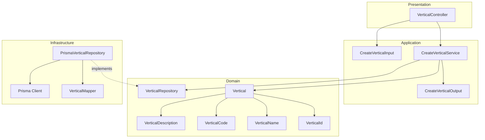

---

## Data Flow

### Fluxo: Criar Vertical

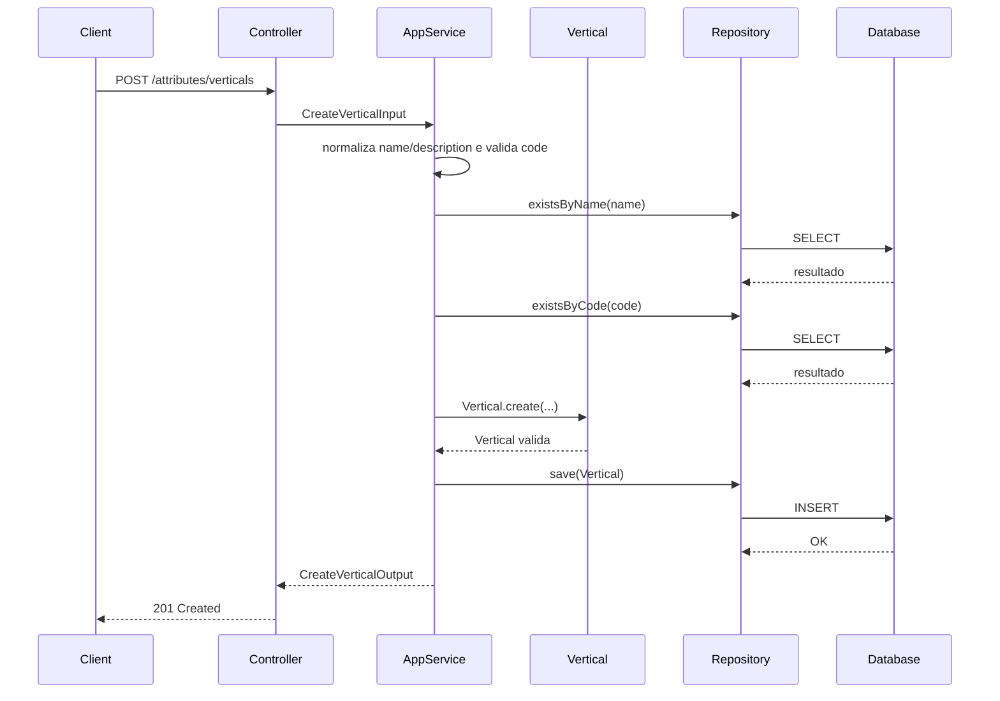

**Transformacoes de dados:**

| Etapa | De | Para |
|-------|----|----- |
| Controller -> AppService | JSON body | CreateVerticalInput |
| AppService -> Domain | DTO | Vertical |
| Repository -> DB | Vertical | Prisma Model |

---

## Entity Structure

### Vertical

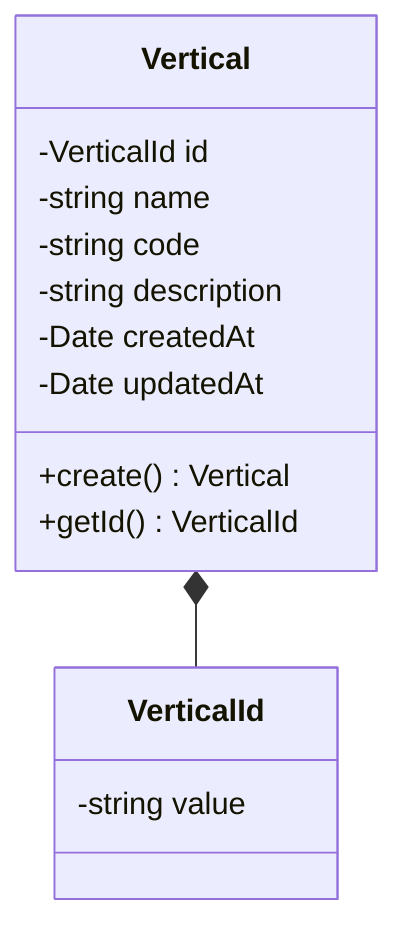

**Propriedades:**

| Propriedade | Tipo | Mutavel? | Regras |
|-------------|------|----------|--------|
| `id` | VerticalId | Nao | Gerado internamente |
| `name` | string | Nao | Obrigatorio, unico, 3-100 caracteres, trim |
| `code` | string | Nao | Obrigatorio, unico, UPPERCASE com `_` |
| `description` | string | Nao | Obrigatorio, 3-255 caracteres, trim |
| `createdAt` | Date | Nao | Automatico |
| `updatedAt` | Date | Sim | Atualizado em mudancas futuras |

**Comportamentos:**

| Metodo | Regras |
|--------|--------|
| `create` | Valida nome, descricao e formato do code |

---

## Repository Operations

| Operacao | Descricao | Usada por |
|----------|-----------|-----------|
| `VerticalRepository.save(vertical)` | Persiste vertical | CreateVerticalService |
| `VerticalRepository.existsByName(name)` | Verifica duplicidade de nome | CreateVerticalService |
| `VerticalRepository.existsByCode(code)` | Verifica duplicidade de codigo | CreateVerticalService |

---

## Database Model

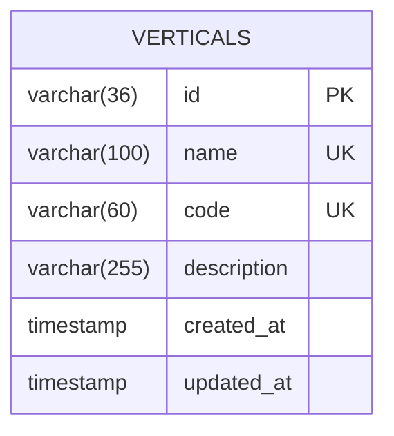

### Tabela: `verticals`

| Coluna | Tipo | Constraints |
|--------|------|-------------|
| `id` | VARCHAR(36) | PK |
| `name` | VARCHAR(100) | NOT NULL, UNIQUE |
| `code` | VARCHAR(60) | NOT NULL, UNIQUE |
| `description` | VARCHAR(255) | NOT NULL |
| `created_at` | TIMESTAMP | NOT NULL, DEFAULT now() |
| `updated_at` | TIMESTAMP | NULL |

---

## API Endpoints

| Metodo | Path | Operacao | Sucesso | Erros |
|--------|------|----------|---------|-------|
| POST | `/attributes/verticals` | Criar vertical | 201 | 400, 409 |

---

## Error Handling

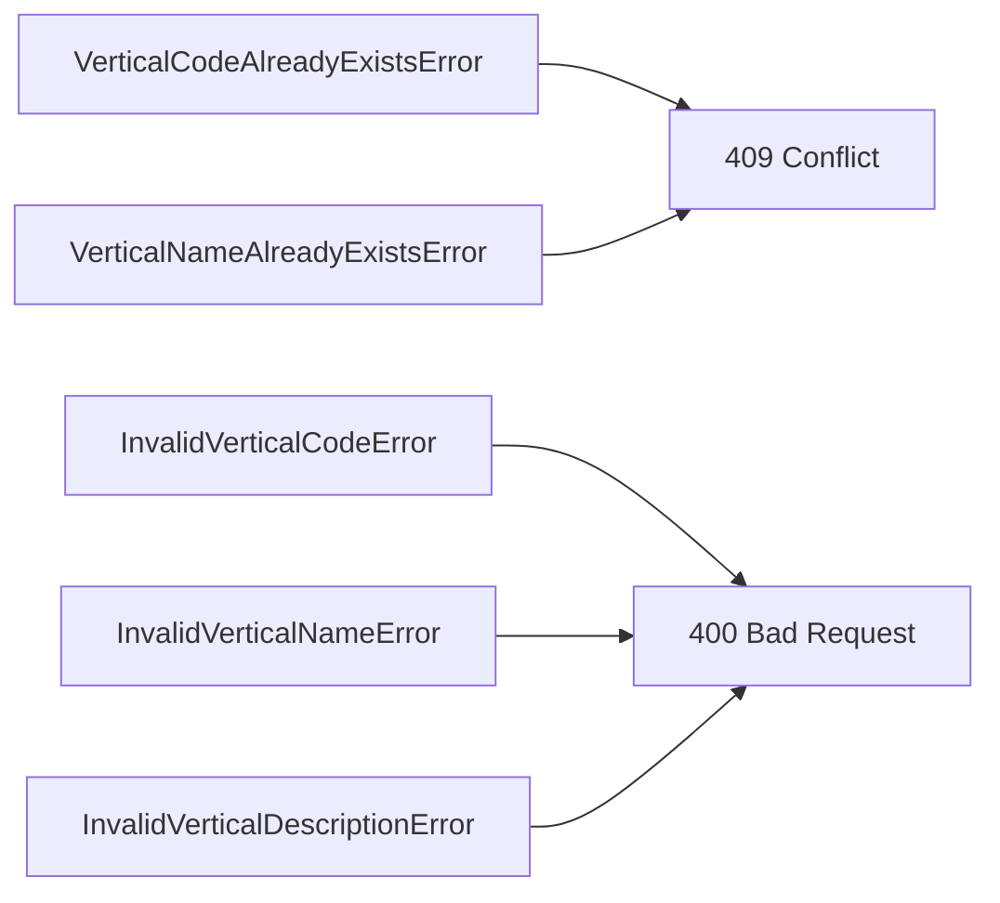

| Erro de Dominio | Quando Ocorre | HTTP Status | Codigo |
|-----------------|---------------|-------------|--------|
| `VerticalCodeAlreadyExistsError` | Code ja cadastrado | 409 | `VERTICAL_CODE_ALREADY_EXISTS` |
| `VerticalNameAlreadyExistsError` | Name ja cadastrado | 409 | `VERTICAL_NAME_ALREADY_EXISTS` |
| `InvalidVerticalCodeError` | Formato de code invalido | 400 | `INVALID_VERTICAL_CODE` |
| `InvalidVerticalNameError` | Nome vazio ou fora do tamanho | 400 | `INVALID_VERTICAL_NAME` |
| `InvalidVerticalDescriptionError` | Descricao vazia ou fora do tamanho | 400 | `INVALID_VERTICAL_DESCRIPTION` |

---

## Technical Decisions

### Decisao 1: Validacao de nome/descricao com trim no dominio

**Contexto**: A spec exige trim e rejeicao de valores vazios.

**Decisao**: `VerticalName` e `VerticalDescription` aplicam trim e validam tamanho minimo/maximo.

**Justificativa**: Evita duplicidade logica e garante regras consistentes.

---

### Decisao 2: Unicidade garantida na aplicacao e no banco

**Contexto**: Name e code devem ser unicos globalmente.

**Decisao**: O Application Service valida duplicidade e o banco possui indices unicos.

**Justificativa**: Previne conflitos concorrentes e garante integridade.

---

## Implementation Notes

- Normalizar `name` e `description` com trim antes da validacao.
- Validar `code` com regex de UPPERCASE e `_`.
- Criar indices unicos em `verticals.name` e `verticals.code`.

---

### design-validation
## Avaliacao do Design: Create Vertical

| Criterio | Nota | Observacao |
|----------|------|------------|
| Aderencia a Arquitetura | 5/5 | DDD em 4 camadas respeitado, domain sem dependencias externas. |
| Completude de Componentes | 5/5 | Entity, VOs, repos, service, DTOs e controller mapeados. |
| Consistencia com Spec | 5/5 | Regras de trim, unicidade e formato atendidas. |
| Modelagem de Dados | 4/5 | Tamanho maximo fica no dominio, nao no schema. |
| Fluxos de Dados | 5/5 | Fluxo detalha validacoes e persistencia. |
| API Design | 4/5 | Endpoint e codigos de erro alinhados. |
| Diagramas | 5/5 | Mermaid consistente com o fluxo. |
| Decisoes Tecnicas | 4/5 | Decisoes objetivas para trim e unicidade. |
| **TOTAL** | 37/40 | |

## Veredicto

- [x] APROVADO - Pode avancar para plan
- [ ] APROVADO COM RESSALVAS - Ajustes menores
- [ ] REPROVADO - Problemas de arquitetura

## Violacoes de Arquitetura

1. Nenhuma identificada.

## Problemas Encontrados

1. Nenhum.

## Pontos Fortes

1. Validacoes via VOs com trim e limites coerentes.
2. Unicidade garantida na aplicacao e no banco.

### spec
# Capability: Create Vertical

**Created**: 2026-01-08  
**Project**: `specs/project.md`

---

<!--
  ╔═══════════════════════════════════════════════════════════════════════════╗
  ║  SPEC DE NEGÓCIO - Define O QUÊ a capability faz                          ║
  ║                                                                           ║
  ║  Este documento é agnóstico de tecnologia. Decisões técnicas              ║
  ║  ficam no design.md da capability.                                        ║
  ╚═══════════════════════════════════════════════════════════════════════════╝
-->

## User Stories

### User Story 1 - Criar vertical com identificação clara (P1)

Como **responsável pela configuração do catálogo**,  
quero **cadastrar uma vertical com nome, código e descrição**,  
para **definir o universo de configuração de atributos e categorias**.

**Por que P1**: Sem vertical não é possível organizar o catálogo por tipo de negócio.

#### Acceptance Criteria

```gherkin
Scenario: Criar vertical com dados obrigatórios
  Given que não existe vertical com o mesmo nome ou código
  When a vertical é criada com nome, código e descrição
  Then a vertical deve ser criada

Scenario: Rejeitar criação com código duplicado
  Given que já existe uma vertical com o mesmo código
  When a vertical é criada
  Then a criação deve ser rejeitada
  And o sistema deve informar que o código já está cadastrado

Scenario: Rejeitar criação com nome duplicado
  Given que já existe uma vertical com o mesmo nome
  When a vertical é criada
  Then a criação deve ser rejeitada
  And o sistema deve informar que o nome já está cadastrado

Scenario: Rejeitar criação com código em formato inválido
  Given que o código não está em UPPERCASE com separação por _
  When a vertical é criada
  Then a criação deve ser rejeitada
  And o sistema deve informar que o formato do código é inválido

Scenario: Rejeitar criação com nome ou descrição vazios
  Given que o nome ou a descrição estão vazios após trim
  When a vertical é criada
  Then a criação deve ser rejeitada
  And o sistema deve informar que os campos estão inválidos

Scenario: Rejeitar criação com nome ou descrição fora do tamanho permitido
  Given que o nome ou a descrição não respeitam os limites de tamanho
  When a vertical é criada
  Then a criação deve ser rejeitada
  And o sistema deve informar que o tamanho dos campos é inválido
```

---

## Functional Requirements

- **FR-001**: O sistema **DEVE** permitir criar uma vertical com `name`, `code` e `description`.
- **FR-002**: O `code` da vertical **DEVE** estar em UPPERCASE com separação por `_`.
- **FR-003**: O `name` e o `code` da vertical **DEVEM** ser únicos globalmente.
- **FR-004**: A vertical **DEVE** poder ser criada sem categorias ou atributos vinculados.
- **FR-005**: O sistema **DEVE** normalizar `name` e `description` com trim e rejeitar valores vazios.
- **FR-006**: O `name` **DEVE** ter entre 3 e 100 caracteres; `description` **DEVE** ter entre 3 e 255 caracteres.

---

## Entity

### Vertical

| Campo | Descrição | Regras |
| --- | --- | --- |
| `id` | Identificador único da vertical | Obrigatório, único |
| `name` | Nome da vertical | Obrigatório, único, 3-100 caracteres, trim |
| `code` | Código da vertical | Obrigatório, único, UPPERCASE com `_` |
| `description` | Descrição da vertical | Obrigatório, 3-255 caracteres, trim |
| `createdAt` | Data de criação | Obrigatório |
| `updatedAt` | Data da última atualização | Opcional |

**Relacionamentos**: A vertical pode conter categorias e atributos vinculados, definidos em capabilities específicas.

---

## Success Criteria

- **SC-001**: 100% das verticais criadas possuem `name` e `code` únicos.
- **SC-002**: 100% das tentativas de criação com formato de código inválido são rejeitadas.
- **SC-003**: 100% das verticais criadas ficam disponíveis para configuração posterior de categorias e atributos.

---

## Glossary

| Termo | Definição |
| --- | --- |
| Vertical | Tipo de operação que define o universo de atributos e categorias |
| Attribute | Característica configurável e reutilizável, independente de produto |
| Category | Recorte funcional dentro de uma vertical |

---

## Summary

A capability **Create Vertical** permite cadastrar verticais com nome, código e descrição, formando a base de organização do catálogo.

Ela viabiliza a configuração futura de categorias e atributos por tipo de negócio.

---

### spec-validation
## Avaliacao da Spec: Create Vertical

| Criterio | Nota | Observacao |
|----------|------|------------|
| Estrutura e Completude | 5/5 | Secoes completas e alinhadas ao template. |
| User Stories | 4/5 | P1 bem definida; faltam variacoes de normalizacao na unicidade. |
| Edge Cases | 4/5 | Cobre duplicidade, formato e tamanho; falta explicitar comparacao case-insensitive. |
| Functional Requirements | 5/5 | Regras claras de unicidade, formato e limites. |
| Entity | 5/5 | Campos essenciais e regras bem definidos. |
| Success Criteria | 4/5 | Pode incluir cobertura para validacao de tamanho e trim. |
| Clareza | 5/5 | Linguagem clara e consistente. |
| Implementabilidade | 5/5 | Implementavel sem ambiguidades relevantes. |
| **TOTAL** | 37/40 | |

## Veredicto

- [x] APROVADA - Pode avancar para design
- [ ] APROVADA COM RESSALVAS - Ajustes menores necessarios
- [ ] REPROVADA - Problemas bloqueantes

## Problemas Encontrados

1. Nao explicita se a unicidade de `name` e `code` deve ser validada de forma case-insensitive. Sugestao: definir regra de normalizacao para comparacao.

## Pontos Fortes

1. Regras de formato do codigo e limites de tamanho bem definidos.
2. Validacoes de duplicidade cobertas nos cenarios.

## Template de Referencia
Arquivo: `specs/templates/spec-template.md`

## 03-create-category

### design
# Design: Create Category

**Created**: 2026-01-08  
**Spec**: [./spec.md](./spec.md)  
**Project**: [../../../project.md](../../../project.md)

---

## Overview

A capability Create Category cria categorias vinculadas a uma vertical, com suporte a hierarquia de ate 3 niveis.
O Application Service valida a existencia da vertical, unicidade de name/code por vertical e regras da hierarquia (mesma vertical, profundidade e ausencia de ciclos).
A categoria e persistida com referencia opcional ao parentCategoryId para compor a arvore de navegacao.

---

## Component Map

### Domain Layer

| Tipo | Nome | Responsabilidade |
|------|------|------------------|
| Entity | `Category` | Representa uma categoria dentro de uma vertical |
| Value Object | `CategoryId` | Identificador unico da categoria |
| Value Object | `CategoryName` | Nome validado e normalizado |
| Value Object | `CategoryCode` | Codigo UPPERCASE com `_` |
| Value Object | `CategoryDescription` | Descricao validada |
| Value Object | `VerticalId` | Identificador da vertical |
| Domain Service | `CategoryHierarchyService` | Valida profundidade e ciclos |
| Repository Interface | `CategoryRepository` | Persistencia e consultas de categoria |
| Repository Interface | `VerticalRepository` | Consulta existencia de vertical |

### Application Layer

| Tipo | Nome | Responsabilidade |
|------|------|------------------|
| App Service | `CreateCategoryService` | Orquestra a criacao da categoria |
| Input DTO | `CreateCategoryInput` | Dados de entrada para criacao |
| Output DTO | `CreateCategoryOutput` | Dados retornados apos criacao |

### Infrastructure Layer

| Tipo | Nome | Responsabilidade |
|------|------|------------------|
| Repository Impl | `PrismaCategoryRepository` | Implementa `CategoryRepository` |
| Repository Impl | `PrismaVerticalRepository` | Implementa `VerticalRepository` |
| Mapper | `CategoryMapper` | Converte Domain <-> Prisma |

### Presentation Layer

| Tipo | Nome | Responsabilidade |
|------|------|------------------|
| Controller | `CategoryController` | Exposicao HTTP do caso de uso |

---

## Dependency Graph

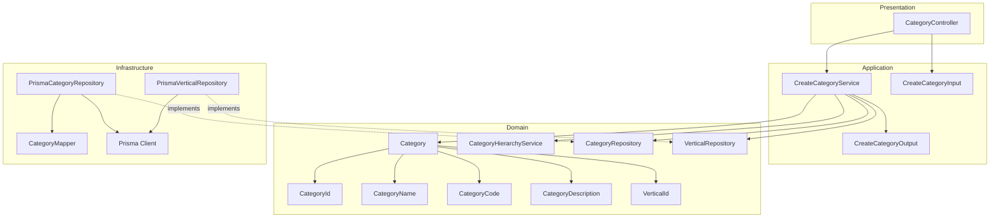

---

## Data Flow

### Fluxo: Criar Category

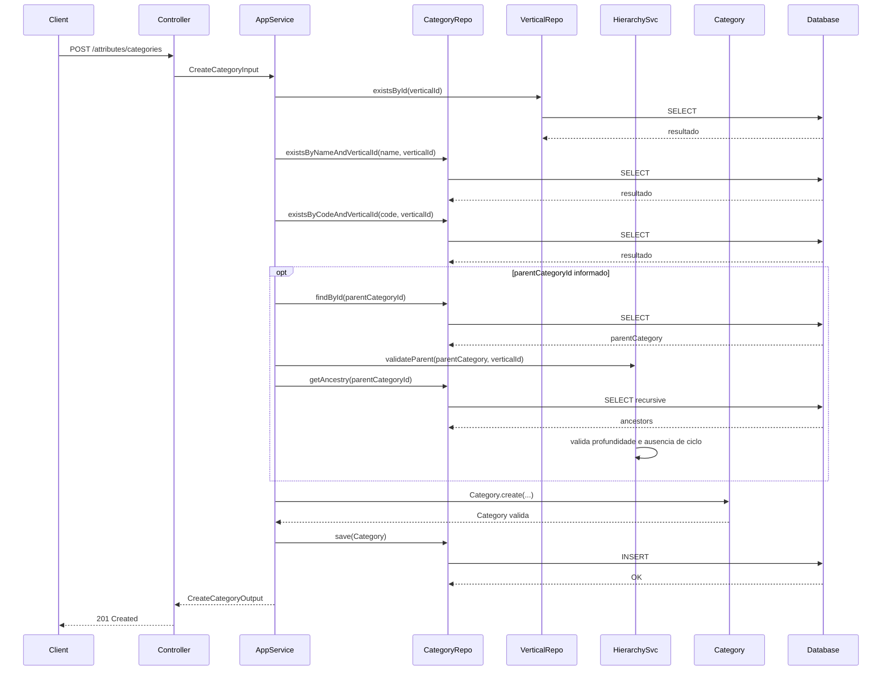

**Transformacoes de dados:**

| Etapa | De | Para |
|-------|----|----- |
| Controller -> AppService | JSON body | CreateCategoryInput |
| AppService -> Domain | DTO | Category |
| Repository -> DB | Category | Prisma Model |

---

## Entity Structure

### Category

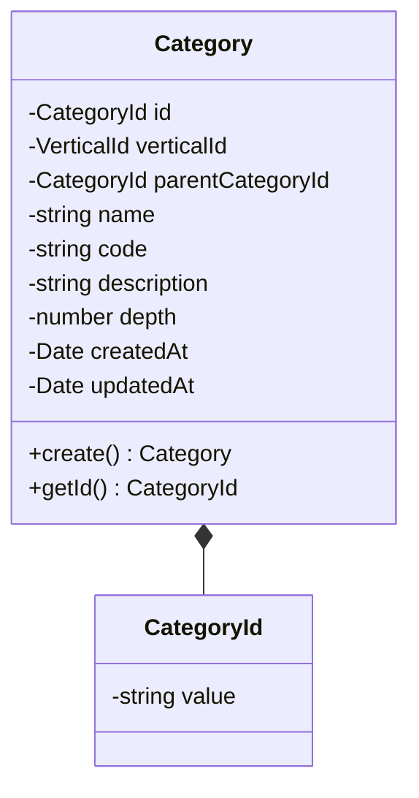

**Propriedades:**

| Propriedade | Tipo | Mutavel? | Regras |
|-------------|------|----------|--------|
| `id` | CategoryId | Nao | Gerado internamente |
| `verticalId` | VerticalId | Nao | Obrigatorio |
| `parentCategoryId` | CategoryId | Nao | Opcional, mesma vertical |
| `name` | string | Nao | Obrigatorio, unico por vertical |
| `code` | string | Nao | Obrigatorio, unico por vertical, UPPERCASE com `_` |
| `description` | string | Nao | Obrigatorio |
| `depth` | number | Nao | Calculado com base na hierarquia |
| `createdAt` | Date | Nao | Automatico |
| `updatedAt` | Date | Sim | Atualizado em mudancas futuras |

**Comportamentos:**

| Metodo | Regras |
|--------|--------|
| `create` | Valida code e aplica depth calculado |

---

## Repository Operations

| Operacao | Descricao | Usada por |
|----------|-----------|-----------|
| `VerticalRepository.existsById(id)` | Verifica existencia de vertical | CreateCategoryService |
| `CategoryRepository.existsByNameAndVerticalId(name, verticalId)` | Verifica duplicidade de nome | CreateCategoryService |
| `CategoryRepository.existsByCodeAndVerticalId(code, verticalId)` | Verifica duplicidade de codigo | CreateCategoryService |
| `CategoryRepository.findById(id)` | Busca categoria pai | CreateCategoryService |
| `CategoryRepository.getAncestry(id)` | Retorna cadeia de ancestrais | CreateCategoryService |
| `CategoryRepository.save(category)` | Persiste categoria | CreateCategoryService |

---

## Database Model

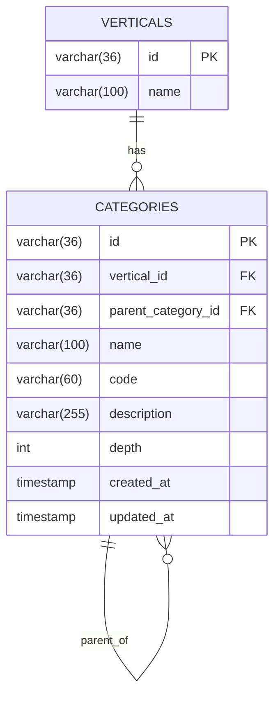

### Tabela: `categories`

| Coluna | Tipo | Constraints |
|--------|------|-------------|
| `id` | VARCHAR(36) | PK |
| `vertical_id` | VARCHAR(36) | NOT NULL, FK(verticals.id) |
| `parent_category_id` | VARCHAR(36) | NULL, FK(categories.id) |
| `name` | VARCHAR(100) | NOT NULL |
| `code` | VARCHAR(60) | NOT NULL |
| `description` | VARCHAR(255) | NOT NULL |
| `depth` | INT | NOT NULL |
| `created_at` | TIMESTAMP | NOT NULL, DEFAULT now() |
| `updated_at` | TIMESTAMP | NULL |

---

## API Endpoints

| Metodo | Path | Operacao | Sucesso | Erros |
|--------|------|----------|---------|-------|
| POST | `/attributes/categories` | Criar categoria | 201 | 400, 404, 409 |

---

## Error Handling

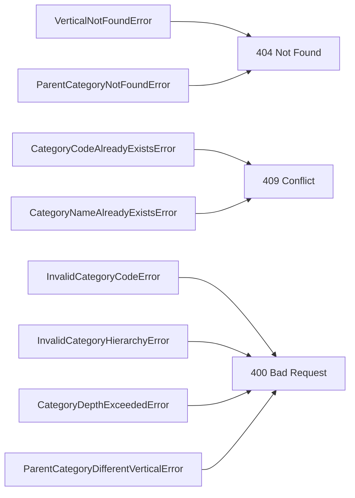

| Erro de Dominio | Quando Ocorre | HTTP Status | Codigo |
|-----------------|---------------|-------------|--------|
| `VerticalNotFoundError` | verticalId inexistente | 404 | `VERTICAL_NOT_FOUND` |
| `ParentCategoryNotFoundError` | parentCategoryId inexistente | 404 | `PARENT_CATEGORY_NOT_FOUND` |
| `CategoryCodeAlreadyExistsError` | Code ja cadastrado na vertical | 409 | `CATEGORY_CODE_ALREADY_EXISTS` |
| `CategoryNameAlreadyExistsError` | Name ja cadastrado na vertical | 409 | `CATEGORY_NAME_ALREADY_EXISTS` |
| `InvalidCategoryCodeError` | Formato de code invalido | 400 | `INVALID_CATEGORY_CODE` |
| `ParentCategoryDifferentVerticalError` | Categoria pai de outra vertical | 400 | `PARENT_CATEGORY_WRONG_VERTICAL` |
| `CategoryDepthExceededError` | Limite de profundidade excedido | 400 | `CATEGORY_DEPTH_EXCEEDED` |
| `InvalidCategoryHierarchyError` | Ciclo detectado na hierarquia | 400 | `CATEGORY_HIERARCHY_CYCLE` |

---

## Technical Decisions

### Decisao 1: Persistir depth para validacao rapida

**Contexto**: A hierarquia permite ate 3 niveis e exige validacao de profundidade.

**Decisao**: Persistir `depth` na tabela `categories` e calcular no momento da criacao.

**Justificativa**: Simplifica consultas e evita calculo recursivo frequente.

---

### Decisao 2: Validar hierarquia via ancestry

**Contexto**: O sistema deve impedir ciclos e validar pai na mesma vertical.

**Decisao**: O `CategoryHierarchyService` carrega a cadeia de ancestrais e valida vertical/ausencia de ciclos.

**Justificativa**: Centraliza regras de hierarquia e reduz logica no controller.

---

## Implementation Notes

- Validar `code` com regex de UPPERCASE e `_`.
- Garantir indices unicos em `categories.vertical_id + name` e `categories.vertical_id + code`.
- `depth` = 1 para categoria raiz; filhos incrementam baseado no pai.
- Rejeitar `parentCategoryId` quando a categoria pai pertence a outra vertical.

---

### design-validation
## Avaliacao do Design: Create Category

| Criterio | Nota | Observacao |
|----------|------|------------|
| Aderencia a Arquitetura | 5/5 | DDD em 4 camadas respeitado, domain sem dependencias externas. |
| Completude de Componentes | 5/5 | Entity, VOs, repos, service, DTOs e controller mapeados. |
| Consistencia com Spec | 5/5 | Profundidade, vertical e hierarquia cobertos. |
| Modelagem de Dados | 5/5 | Schema com depth e FKs coerentes. |
| Fluxos de Dados | 5/5 | Fluxo cobre validacoes de vertical, duplicidade e hierarquia. |
| API Design | 4/5 | Endpoint e erros alinhados com a spec. |
| Diagramas | 5/5 | Mermaid consistente com o fluxo. |
| Decisoes Tecnicas | 4/5 | Decisoes claras para depth e hierarquia. |
| **TOTAL** | 38/40 | |

## Veredicto

- [x] APROVADO - Pode avancar para plan
- [ ] APROVADO COM RESSALVAS - Ajustes menores
- [ ] REPROVADO - Problemas de arquitetura

## Violacoes de Arquitetura

1. Nenhuma identificada.

## Problemas Encontrados

1. Nenhum.

## Pontos Fortes

1. Hierarquia validada via service dedicado.
2. Persistencia de depth simplifica validacao de limite.

### spec
# Capability: Create Category

**Created**: 2026-01-08  
**Project**: `specs/project.md`

---

<!--
  ╔═══════════════════════════════════════════════════════════════════════════╗
  ║  SPEC DE NEGÓCIO - Define O QUÊ a capability faz                          ║
  ║                                                                           ║
  ║  Este documento é agnóstico de tecnologia. Decisões técnicas              ║
  ║  ficam no design.md da capability.                                        ║
  ╚═══════════════════════════════════════════════════════════════════════════╝
-->

## User Stories

### User Story 1 - Criar categoria dentro de uma vertical (P1)

Como **responsável pela configuração do catálogo**,  
quero **cadastrar uma categoria vinculada a uma vertical**,  
para **organizar produtos por recortes funcionais**.

**Por que P1**: Sem categorias não é possível orientar o cadastro de produtos dentro de uma vertical.

#### Acceptance Criteria

```gherkin
Scenario: Criar categoria raiz com dados obrigatórios
  Given que a vertical informada existe
  And que não existe categoria com o mesmo nome ou código na vertical
  When a categoria é criada sem categoria pai
  Then a categoria deve ser criada vinculada à vertical

Scenario: Rejeitar criação com vertical inexistente
  Given que a vertical informada não existe
  When a categoria é criada
  Then a criação deve ser rejeitada
  And o sistema deve informar que a vertical especificada não existe

Scenario: Rejeitar criação com código duplicado na mesma vertical
  Given que já existe uma categoria com o mesmo código na vertical
  When a categoria é criada
  Then a criação deve ser rejeitada
  And o sistema deve informar que o código já está cadastrado na vertical

Scenario: Rejeitar criação com nome duplicado na mesma vertical
  Given que já existe uma categoria com o mesmo nome na vertical
  When a categoria é criada
  Then a criação deve ser rejeitada
  And o sistema deve informar que o nome já está cadastrado na vertical

Scenario: Rejeitar criação com código em formato inválido
  Given que o código não está em UPPERCASE com separação por _
  When a categoria é criada
  Then a criação deve ser rejeitada
  And o sistema deve informar que o formato do código é inválido
```

---

### User Story 2 - Criar subcategoria (P2)

Como **responsável pela configuração do catálogo**,  
quero **criar subcategorias**,  
para **refinar a organização dos produtos dentro da vertical**.

**Por que P2**: Subcategorias melhoram a navegação e a precisão no cadastro.

#### Acceptance Criteria

```gherkin
Scenario: Criar subcategoria com categoria pai válida
  Given que a vertical informada existe
  And que a categoria pai informada existe na mesma vertical
  And que não existe categoria com o mesmo nome ou código na vertical
  When a subcategoria é criada com categoria pai
  Then a categoria deve ser criada como filha da categoria pai

Scenario: Rejeitar criação quando a categoria pai é de outra vertical
  Given que a vertical informada existe
  And que a categoria pai informada pertence a outra vertical
  When a subcategoria é criada
  Then a criação deve ser rejeitada
  And o sistema deve informar que a categoria pai pertence a outra vertical

Scenario: Rejeitar criação ao exceder o limite de profundidade
  Given que a categoria pai já está no nível máximo permitido
  When a subcategoria é criada
  Then a criação deve ser rejeitada
  And o sistema deve informar que o limite de profundidade foi excedido

Scenario: Rejeitar criação que gere ciclo na hierarquia
  Given que a categoria pai informada gera ciclo na hierarquia
  When a subcategoria é criada
  Then a criação deve ser rejeitada
  And o sistema deve informar que a hierarquia não pode conter ciclos
```

---

## Functional Requirements

- **FR-001**: O sistema **DEVE** permitir criar uma categoria com `name`, `code`, `description` e `verticalId`.
- **FR-002**: O `code` da categoria **DEVE** estar em UPPERCASE com separação por `_`.
- **FR-003**: O `name` e o `code` da categoria **DEVEM** ser únicos por `verticalId`.
- **FR-004**: A categoria **DEVE** pertencer a uma vertical existente.
- **FR-005**: A categoria **PODE** ser criada sem `parentCategoryId` (categoria raiz).
- **FR-006**: Quando `parentCategoryId` for informado, a categoria pai **DEVE** pertencer à mesma vertical.
- **FR-007**: O sistema **DEVE** limitar a profundidade da hierarquia de categorias a 3 níveis.
- **FR-008**: O sistema **DEVE** impedir ciclos na hierarquia de categorias.

---

## Entity

### Category

| Campo | Descrição | Regras |
| --- | --- | --- |
| `id` | Identificador único da categoria | Obrigatório, único |
| `verticalId` | Vertical da categoria | Obrigatório |
| `parentCategoryId` | Categoria pai | Opcional, não pode gerar ciclo |
| `name` | Nome da categoria | Obrigatório, único por vertical |
| `code` | Código da categoria | Obrigatório, único por vertical, UPPERCASE com `_` |
| `description` | Descrição da categoria | Obrigatório |
| `createdAt` | Data de criação | Obrigatório |
| `updatedAt` | Data da última atualização | Opcional |

**Relacionamentos**: Uma categoria pertence a uma vertical e pode possuir uma categoria pai.

---

## Success Criteria

- **SC-001**: 100% das categorias criadas possuem `name` e `code` únicos dentro da vertical.
- **SC-002**: 100% das tentativas de criação com vertical inexistente são rejeitadas.
- **SC-003**: 100% das tentativas de criação que excedem o limite de profundidade são rejeitadas.

---

## Glossary

| Termo | Definição |
| --- | --- |
| Vertical | Tipo de operação que define o universo de atributos e categorias |
| Category | Recorte funcional dentro de uma vertical |
| Subcategory | Categoria que possui uma categoria pai |

---

## Summary

A capability **Create Category** permite cadastrar categorias vinculadas a uma vertical, com suporte a hierarquia de até três níveis.

Ela organiza o catálogo por recortes funcionais e prepara a base para cadastro estruturado de produtos.

---

### spec-validation
## Avaliacao da Spec: Create Category

| Criterio | Nota | Observacao |
|----------|------|------------|
| Estrutura e Completude | 5/5 | Secoes completas e alinhadas ao template. |
| User Stories | 5/5 | Cobrem raiz, subcategoria e validacoes principais. |
| Edge Cases | 4/5 | Inclui limite de profundidade e ciclos; faltam limites de tamanho para campos. |
| Functional Requirements | 5/5 | Regras claras para unicidade, vertical e hierarquia. |
| Entity | 4/5 | Campos definidos, mas regras de tamanho/trim para `name` e `description` nao estao especificadas. |
| Success Criteria | 4/5 | Metricas claras; pode incluir cobertura de ciclos. |
| Clareza | 5/5 | Texto objetivo e consistente. |
| Implementabilidade | 5/5 | Implementavel sem ambiguidades relevantes. |
| **TOTAL** | 37/40 | |

## Veredicto

- [x] APROVADA - Pode avancar para design
- [ ] APROVADA COM RESSALVAS - Ajustes menores necessarios
- [ ] REPROVADA - Problemas bloqueantes

## Problemas Encontrados

1. Nao define limites de tamanho ou normalizacao para `name` e `description`. Sugestao: explicitar min/max e trim.

## Pontos Fortes

1. Limite de profundidade e prevencao de ciclos bem definidos.
2. Unicidade por vertical clara e testavel.

## Template de Referencia
Arquivo: `specs/templates/spec-template.md`

## 04-create-allowed-value

### design
# Design: Create Allowed Value

**Created**: 2026-01-08  
**Spec**: [./spec.md](./spec.md)  
**Project**: [../../../project.md](../../../project.md)

---

## Overview

A capability Create Allowed Value cadastra valores permitidos para atributos do tipo option.
O Application Service valida a existencia do atributo, o tipo option, formato Pascal Case do value e unicidade case-insensitive de name/value.
O valor permitido e persistido e passa a compor as opcoes globais do atributo.

---

## Component Map

### Domain Layer

| Tipo | Nome | Responsabilidade |
|------|------|------------------|
| Entity | `AllowedValue` | Representa um valor permitido de atributo option |
| Value Object | `AllowedValueId` | Identificador unico do valor permitido |
| Value Object | `AllowedValueName` | Nome validado e normalizado |
| Value Object | `AllowedValueValue` | Value em Pascal Case validado |
| Value Object | `AttributeId` | Identificador do atributo |
| Repository Interface | `AllowedValueRepository` | Persistencia e consultas de valores permitidos |
| Repository Interface | `AttributeRepository` | Consulta de atributo e limites |

### Application Layer

| Tipo | Nome | Responsabilidade |
|------|------|------------------|
| App Service | `CreateAllowedValueService` | Orquestra a criacao do valor permitido |
| Input DTO | `CreateAllowedValueInput` | Dados de entrada para criacao |
| Output DTO | `CreateAllowedValueOutput` | Dados retornados apos criacao |

### Infrastructure Layer

| Tipo | Nome | Responsabilidade |
|------|------|------------------|
| Repository Impl | `PrismaAllowedValueRepository` | Implementa `AllowedValueRepository` |
| Repository Impl | `PrismaAttributeRepository` | Implementa `AttributeRepository` |
| Mapper | `AllowedValueMapper` | Converte Domain <-> Prisma |

### Presentation Layer

| Tipo | Nome | Responsabilidade |
|------|------|------------------|
| Controller | `AllowedValueController` | Exposicao HTTP do caso de uso |

---

## Dependency Graph

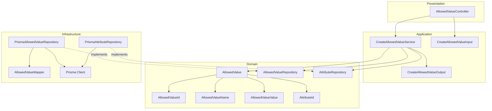

---

## Data Flow

### Fluxo: Criar Allowed Value

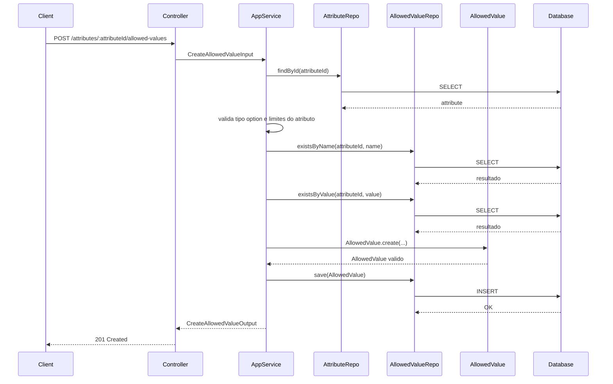

**Transformacoes de dados:**

| Etapa | De | Para |
|-------|----|----- |
| Controller -> AppService | JSON body | CreateAllowedValueInput |
| AppService -> Domain | DTO | AllowedValue |
| Repository -> DB | AllowedValue | Prisma Model |

---

## Entity Structure

### AllowedValue

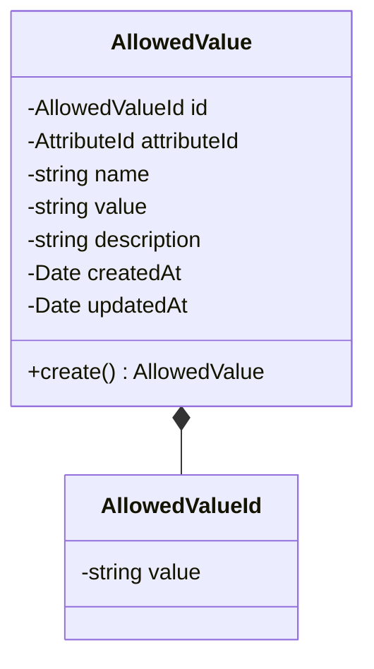

**Propriedades:**

| Propriedade | Tipo | Mutavel? | Regras |
|-------------|------|----------|--------|
| `id` | AllowedValueId | Nao | Gerado internamente |
| `attributeId` | AttributeId | Nao | Obrigatorio, atributo option |
| `name` | string | Nao | Obrigatorio, unico por atributo, trim, case-insensitive |
| `value` | string | Nao | Obrigatorio, Pascal Case, unico por atributo, case-insensitive |
| `description` | string | Nao | Opcional |
| `createdAt` | Date | Nao | Automatico |
| `updatedAt` | Date | Sim | Atualizado em mudancas futuras |

**Comportamentos:**

| Metodo | Regras |
|--------|--------|
| `create` | Valida Pascal Case e tamanho do value conforme limites do atributo |

---

## Repository Operations

| Operacao | Descricao | Usada por |
|----------|-----------|-----------|
| `AttributeRepository.findById(id)` | Busca atributo e limites | CreateAllowedValueService |
| `AllowedValueRepository.existsByName(attributeId, name)` | Verifica duplicidade de name | CreateAllowedValueService |
| `AllowedValueRepository.existsByValue(attributeId, value)` | Verifica duplicidade de value | CreateAllowedValueService |
| `AllowedValueRepository.save(allowedValue)` | Persiste valor permitido | CreateAllowedValueService |

---

## Database Model

```mermaid
erDiagram
    ATTRIBUTES {
        varchar(36) id PK
        varchar(20) type
        decimal(18,4) min_value
        decimal(18,4) max_value
    }

    ATTRIBUTE_ALLOWED_VALUES {
        varchar(36) id PK
        varchar(36) attribute_id FK
        varchar(120) name
        varchar(120) value
        varchar(120) name_normalized
        varchar(120) value_normalized
        varchar(255) description
        timestamp created_at
        timestamp updated_at
    }

    ATTRIBUTES ||--o{ ATTRIBUTE_ALLOWED_VALUES : has
```

### Tabela: `attribute_allowed_values`

| Coluna | Tipo | Constraints |
|--------|------|-------------|
| `id` | VARCHAR(36) | PK |
| `attribute_id` | VARCHAR(36) | NOT NULL, FK(attributes.id) |
| `name` | VARCHAR(120) | NOT NULL |
| `value` | VARCHAR(120) | NOT NULL |
| `name_normalized` | VARCHAR(120) | NOT NULL |
| `value_normalized` | VARCHAR(120) | NOT NULL |
| `description` | VARCHAR(255) | NULL |
| `created_at` | TIMESTAMP | NOT NULL, DEFAULT now() |
| `updated_at` | TIMESTAMP | NULL |

---

## API Endpoints

| Metodo | Path | Operacao | Sucesso | Erros |
|--------|------|----------|---------|-------|
| POST | `/attributes/:attributeId/allowed-values` | Criar valor permitido | 201 | 400, 404, 409 |

---

## Error Handling

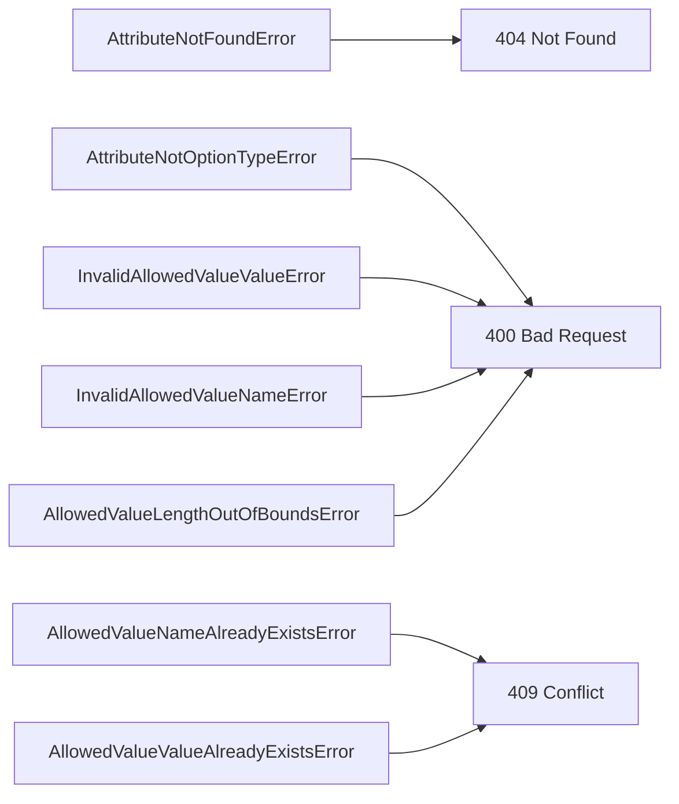

| Erro de Dominio | Quando Ocorre | HTTP Status | Codigo |
|-----------------|---------------|-------------|--------|
| `AttributeNotFoundError` | attributeId inexistente | 404 | `ATTRIBUTE_NOT_FOUND` |
| `AttributeNotOptionTypeError` | atributo nao e option | 400 | `ATTRIBUTE_NOT_OPTION` |
| `AllowedValueNameAlreadyExistsError` | Name duplicado no atributo | 409 | `ALLOWED_VALUE_NAME_EXISTS` |
| `AllowedValueValueAlreadyExistsError` | Value duplicado no atributo | 409 | `ALLOWED_VALUE_VALUE_EXISTS` |
| `InvalidAllowedValueValueError` | Formato de value invalido | 400 | `INVALID_ALLOWED_VALUE_VALUE` |
| `InvalidAllowedValueNameError` | Name vazio apos trim | 400 | `INVALID_ALLOWED_VALUE_NAME` |
| `AllowedValueLengthOutOfBoundsError` | Value fora dos limites | 400 | `ALLOWED_VALUE_OUT_OF_BOUNDS` |

---

## Technical Decisions

### Decisao 1: Unicidade case-insensitive com colunas normalizadas

**Contexto**: Name e value devem ser unicos por atributo, ignorando caixa.

**Decisao**: Persistir `name_normalized` e `value_normalized` em lowercase e aplicar indices unicos.

**Justificativa**: Evita dependencia de collation do banco e garante regra consistente.

---

### Decisao 2: Validar tamanho do value com limites do atributo

**Contexto**: `value` deve respeitar minValue/maxValue do atributo.

**Decisao**: O Application Service obtem os limites efetivos do atributo (com defaults) antes de criar o AllowedValue.

**Justificativa**: Garante consistencia entre definicao do atributo e seus valores permitidos.

---

## Implementation Notes

- Validar `value` com regex de Pascal Case, permitindo numeros e espacos simples.
- Aplicar trim em `name` e `value` antes de validar duplicidade.
- Rejeitar criacao quando o atributo nao for do tipo option.
- Criar indices unicos em `attribute_allowed_values(attribute_id, name_normalized)` e `attribute_allowed_values(attribute_id, value_normalized)`.

---

### design-validation
## Avaliacao do Design: Create Allowed Value

| Criterio | Nota | Observacao |
|----------|------|------------|
| Aderencia a Arquitetura | 5/5 | DDD em 4 camadas respeitado, domain sem dependencias externas. |
| Completude de Componentes | 5/5 | Entity, VOs, repos, service, DTOs e controller mapeados. |
| Consistencia com Spec | 5/5 | Regras cobertas e endpoint alinhado. |
| Modelagem de Dados | 5/5 | Colunas normalizadas suportam unicidade case-insensitive. |
| Fluxos de Dados | 5/5 | Fluxo correto e endpoint consistente. |
| API Design | 5/5 | Path consistente com o restante das rotas. |
| Diagramas | 5/5 | Mermaid consistente com o fluxo. |
| Decisoes Tecnicas | 5/5 | Decisoes sobre normalizacao e limites bem justificadas. |
| **TOTAL** | 40/40 | |

## Veredicto

- [x] APROVADO - Pode avancar para plan
- [ ] APROVADO COM RESSALVAS - Ajustes menores
- [ ] REPROVADO - Problemas de arquitetura

## Violacoes de Arquitetura

1. Nenhuma identificada.

## Problemas Encontrados

1. Nenhum.

## Pontos Fortes

1. Normalizacao evita dependencia de collation do banco.
2. Validacao de tamanho do value com limites do atributo.

### spec
# Capability: Create Allowed Value

**Created**: 2026-01-08  
**Project**: `specs/project.md`

---

<!--
  ╔═══════════════════════════════════════════════════════════════════════════╗
  ║  SPEC DE NEGÓCIO - Define O QUÊ a capability faz                          ║
  ║                                                                           ║
  ║  Este documento é agnóstico de tecnologia. Decisões técnicas              ║
  ║  ficam no design.md da capability.                                        ║
  ╚═══════════════════════════════════════════════════════════════════════════╝
-->

## User Stories

### User Story 1 - Criar valor permitido para atributo do tipo option (P1)

Como **responsável pela configuração do catálogo**,  
quero **cadastrar valores permitidos para um atributo do tipo option**,  
para **padronizar a seleção de valores no cadastro de produtos**.

**Por que P1**: Sem valores permitidos, atributos do tipo option não podem ser usados de forma consistente.

#### Acceptance Criteria

```gherkin
Scenario: Criar valor permitido com dados obrigatórios
  Given que o atributo informado existe e é do tipo option
  And que não existe valor permitido com o mesmo value ou name no atributo
  When o valor permitido é criado com name e value
  Then o valor permitido deve ser criado vinculado ao atributo

Scenario: Rejeitar criação para atributo inexistente
  Given que o atributo informado não existe
  When o valor permitido é criado
  Then a criação deve ser rejeitada
  And o sistema deve informar que o atributo especificado não existe

Scenario: Rejeitar criação para atributo de tipo diferente de option
  Given que o atributo informado existe e não é do tipo option
  When o valor permitido é criado
  Then a criação deve ser rejeitada
  And o sistema deve informar que o atributo não é do tipo option

Scenario: Rejeitar criação com value duplicado no mesmo atributo
  Given que já existe um valor permitido com o mesmo value no atributo
  When o valor permitido é criado
  Then a criação deve ser rejeitada
  And o sistema deve informar que o value já está cadastrado no atributo

Scenario: Rejeitar criação com name duplicado no mesmo atributo
  Given que já existe um valor permitido com o mesmo name no atributo
  When o valor permitido é criado
  Then a criação deve ser rejeitada
  And o sistema deve informar que o name já está cadastrado no atributo

Scenario: Rejeitar criação com value em formato inválido
  Given que o value não está em Pascal Case ou não respeita o tamanho permitido
  When o valor permitido é criado
  Then a criação deve ser rejeitada
  And o sistema deve informar que o formato do value é inválido
```

---

## Functional Requirements

- **FR-001**: O sistema **DEVE** permitir criar um valor permitido com `attributeId`, `name`, `value` e `description`.
- **FR-002**: A `description` do valor permitido **PODE** ser informada.
- **FR-003**: O valor permitido **DEVE** pertencer a um atributo existente do tipo `option`.
- **FR-004**: O `name` do valor permitido **DEVE** ser único por atributo.
- **FR-005**: O `value` do valor permitido **DEVE** ser único por atributo.
- **FR-006**: O sistema **DEVE** normalizar `name` e `value` com trim e rejeitar valores vazios.
- **FR-007**: O `value` **DEVE** estar em Pascal Case (ex: `Batata Frita`), contendo apenas letras, números e espaços simples entre palavras.
- **FR-008**: O tamanho do `value` **DEVE** respeitar `minValue` e `maxValue` do atributo (ou seus defaults).
- **FR-009**: A unicidade de `name` e `value` **DEVE** ser validada de forma case-insensitive.

---

## Entity

### AllowedValue

| Campo | Descrição | Regras |
| --- | --- | --- |
| `id` | Identificador único do valor permitido | Obrigatório, único |
| `attributeId` | Atributo associado | Obrigatório, atributo do tipo `option` |
| `name` | Nome amigável do valor permitido | Obrigatório, único por atributo, trim, case-insensitive |
| `value` | Valor interno do permitido | Obrigatório, único por atributo, Pascal Case, trim, case-insensitive, respeita `minValue`/`maxValue` |
| `description` | Descrição do valor permitido | Opcional |
| `createdAt` | Data de criação | Obrigatório |
| `updatedAt` | Data da última atualização | Opcional |

**Relacionamentos**: Um valor permitido pertence a um atributo do tipo `option`.

---

## Success Criteria

- **SC-001**: 100% dos valores permitidos criados pertencem a atributos do tipo `option`.
- **SC-002**: 100% das tentativas de criação com `name` ou `value` duplicados no mesmo atributo são rejeitadas.
- **SC-003**: 100% dos valores permitidos criados ficam disponíveis para seleção em atributos do tipo option.

---

## Glossary

| Termo | Definição |
| --- | --- |
| Allowed Value | Valor permitido para atributos do tipo option |
| Attribute | Característica configurável e reutilizável, independente de produto |
| Option | Tipo de atributo que exige valores pré-definidos |

---

## Summary

A capability **Create Allowed Value** permite cadastrar valores permitidos para atributos do tipo option, com nome e valor únicos por atributo.

Ela padroniza a seleção de opções e garante consistência no cadastro de produtos.

---

### spec-validation
## Avaliacao da Spec: Create Allowed Value

| Criterio | Nota | Observacao |
|----------|------|------------|
| Estrutura e Completude | 5/5 | Secoes completas e alinhadas ao template. |
| User Stories | 5/5 | Cobrem criacao, atributo inexistente e tipo invalido. |
| Edge Cases | 4/5 | Duplicidade e formato cobertos; faltam limites para `name` e `description`. |
| Functional Requirements | 5/5 | Regras claras de pertencimento, formato e tamanho do `value`. |
| Entity | 5/5 | Campos e regras bem definidos. |
| Success Criteria | 4/5 | Metricas claras; pode incluir cobertura de rejeicao por formato invalido. |
| Clareza | 5/5 | Texto consistente e direto. |
| Implementabilidade | 5/5 | Implementavel sem ambiguidades relevantes. |
| **TOTAL** | 38/40 | |

## Veredicto

- [x] APROVADA - Pode avancar para design
- [ ] APROVADA COM RESSALVAS - Ajustes menores necessarios
- [ ] REPROVADA - Problemas bloqueantes

## Problemas Encontrados

1. Nao define limites de tamanho para `name` e `description`. Sugestao: explicitar min/max ou alinhar com `value`.

## Pontos Fortes

1. Regras claras para Pascal Case e tamanho do `value`.
2. Validacoes de atributo inexistente e tipo invalido bem definidas.

## Template de Referencia
Arquivo: `specs/templates/spec-template.md`

## 05-link-attribute-to-vertical

### design
# Design: Link Attribute to Vertical

**Created**: 2026-01-08  
**Spec**: [./spec.md](./spec.md)  
**Project**: [../../../project.md](../../../project.md)

---

## Overview

A capability Link Attribute to Vertical cria o vinculo entre um atributo global e uma vertical, permitindo sobrescritas de regras e configuracao de valores permitidos.
O Application Service valida a existencia de vertical e atributo, garante unicidade do vinculo e aplica regras de override para obrigatoriedade, multivalor e limites.
Para atributos option, o vinculo pode selecionar subset dos valores globais e adicionar valores especificos, garantindo unicidade e defaultValue valido no contexto da vertical.

---

## Component Map

### Domain Layer

| Tipo | Nome | Responsabilidade |
|------|------|------------------|
| Entity | `VerticalAttribute` | Vinculo entre atributo e vertical com overrides |
| Entity | `VerticalAllowedValue` | Valor permitido especifico da vertical |
| Value Object | `VerticalAttributeId` | Identificador do vinculo |
| Value Object | `VerticalId` | Identificador da vertical |
| Value Object | `AttributeId` | Identificador do atributo |
| Repository Interface | `VerticalAttributeRepository` | Persistencia do vinculo vertical-atributo |
| Repository Interface | `VerticalAllowedValueRepository` | Persistencia de valores permitidos da vertical |
| Repository Interface | `AttributeRepository` | Consulta de atributo global |
| Repository Interface | `AllowedValueRepository` | Consulta de valores permitidos globais |
| Repository Interface | `VerticalRepository` | Consulta de vertical |

### Application Layer

| Tipo | Nome | Responsabilidade |
|------|------|------------------|
| App Service | `LinkAttributeToVerticalService` | Orquestra a criacao do vinculo |
| Input DTO | `LinkAttributeToVerticalInput` | Dados de entrada para vinculo |
| Output DTO | `LinkAttributeToVerticalOutput` | Dados retornados apos vinculo |

### Infrastructure Layer

| Tipo | Nome | Responsabilidade |
|------|------|------------------|
| Repository Impl | `PrismaVerticalAttributeRepository` | Implementa `VerticalAttributeRepository` |
| Repository Impl | `PrismaVerticalAllowedValueRepository` | Implementa `VerticalAllowedValueRepository` |
| Repository Impl | `PrismaAttributeRepository` | Implementa `AttributeRepository` |
| Repository Impl | `PrismaAllowedValueRepository` | Implementa `AllowedValueRepository` |
| Repository Impl | `PrismaVerticalRepository` | Implementa `VerticalRepository` |
| Mapper | `VerticalAttributeMapper` | Converte Domain <-> Prisma |
| Mapper | `VerticalAllowedValueMapper` | Converte AllowedValue <-> Prisma |

### Presentation Layer

| Tipo | Nome | Responsabilidade |
|------|------|------------------|
| Controller | `VerticalAttributeController` | Exposicao HTTP do caso de uso |

---

## Dependency Graph

```mermaid
graph TD
    subgraph Presentation
        CTRL[VerticalAttributeController]
    end

    subgraph Application
        SVC[LinkAttributeToVerticalService]
        DTO_IN[LinkAttributeToVerticalInput]
        DTO_OUT[LinkAttributeToVerticalOutput]
    end

    subgraph Domain
        VERT_ATTR[VerticalAttribute]
        VERT_VAL[VerticalAllowedValue]
        VO_ID[VerticalAttributeId]
        VO_VERT[VerticalId]
        VO_ATTR[AttributeId]
        VERT_ATTR_REPO[VerticalAttributeRepository]
        VERT_VAL_REPO[VerticalAllowedValueRepository]
        ATTR_REPO[AttributeRepository]
        ALLOWED_REPO[AllowedValueRepository]
        VERT_REPO[VerticalRepository]
    end

    subgraph Infrastructure
        VERT_ATTR_IMPL[PrismaVerticalAttributeRepository]
        VERT_VAL_IMPL[PrismaVerticalAllowedValueRepository]
        ATTR_REPO_IMPL[PrismaAttributeRepository]
        ALLOWED_REPO_IMPL[PrismaAllowedValueRepository]
        VERT_REPO_IMPL[PrismaVerticalRepository]
        VERT_ATTR_MAPPER[VerticalAttributeMapper]
        VERT_VAL_MAPPER[VerticalAllowedValueMapper]
        PRISMA[Prisma Client]
    end

    CTRL --> SVC
    CTRL --> DTO_IN
    SVC --> DTO_OUT
    SVC --> VERT_ATTR
    SVC --> VERT_VAL
    SVC --> VERT_ATTR_REPO
    SVC --> VERT_VAL_REPO
    SVC --> ATTR_REPO
    SVC --> ALLOWED_REPO
    SVC --> VERT_REPO
    VERT_ATTR --> VO_ID
    VERT_ATTR --> VO_VERT
    VERT_ATTR --> VO_ATTR
    VERT_ATTR_IMPL -.->|implements| VERT_ATTR_REPO
    VERT_VAL_IMPL -.->|implements| VERT_VAL_REPO
    ATTR_REPO_IMPL -.->|implements| ATTR_REPO
    ALLOWED_REPO_IMPL -.->|implements| ALLOWED_REPO
    VERT_REPO_IMPL -.->|implements| VERT_REPO
    VERT_ATTR_IMPL --> VERT_ATTR_MAPPER
    VERT_VAL_IMPL --> VERT_VAL_MAPPER
    VERT_ATTR_IMPL --> PRISMA
    VERT_VAL_IMPL --> PRISMA
    ATTR_REPO_IMPL --> PRISMA
    ALLOWED_REPO_IMPL --> PRISMA
    VERT_REPO_IMPL --> PRISMA
```

---

## Data Flow

### Fluxo: Vincular Attribute a Vertical

```mermaid
sequenceDiagram
    participant Client
    participant Controller
    participant AppService
    participant VerticalRepo
    participant AttributeRepo
    participant AllowedValueRepo
    participant VerticalAttrRepo
    participant VerticalValueRepo
    participant Database

    Client->>Controller: POST /attributes/verticals/:verticalId/attributes
    Controller->>AppService: LinkAttributeToVerticalInput

    AppService->>VerticalRepo: existsById(verticalId)
    VerticalRepo->>Database: SELECT
    Database-->>VerticalRepo: resultado

    AppService->>AttributeRepo: findById(attributeId)
    AttributeRepo->>Database: SELECT
    Database-->>AttributeRepo: attribute

    AppService->>VerticalAttrRepo: existsByVerticalAndAttribute(verticalId, attributeId)
    VerticalAttrRepo->>Database: SELECT
    Database-->>VerticalAttrRepo: resultado

    AppService->>AppService: valida overrides de limites

    opt atributo option e valores informados
        AppService->>AllowedValueRepo: listByAttribute(attributeId)
        AllowedValueRepo->>Database: SELECT
        Database-->>AllowedValueRepo: globalValues
        AppService->>AppService: valida subset, adicionais e conflitos
    end

    opt defaultValueId informado
        AppService->>AppService: valida option + required + single value
        AppService->>AppService: valida defaultValueId no conjunto efetivo
    end

    AppService->>VerticalAttrRepo: save(VerticalAttribute)
    VerticalAttrRepo->>Database: INSERT
    Database-->>VerticalAttrRepo: OK

    opt subset de valores
        AppService->>VerticalAttrRepo: saveSubsetLinks(verticalAttributeId, allowedValueIds)
        VerticalAttrRepo->>Database: INSERT
        Database-->>VerticalAttrRepo: OK
    end

    opt valores adicionais
        AppService->>VerticalValueRepo: saveAll(VerticalAllowedValues)
        VerticalValueRepo->>Database: INSERT
        Database-->>VerticalValueRepo: OK
    end

    AppService-->>Controller: LinkAttributeToVerticalOutput
    Controller-->>Client: 201 Created
```

**Transformacoes de dados:**

| Etapa | De | Para |
|-------|----|----- |
| Controller -> AppService | JSON body | LinkAttributeToVerticalInput |
| AppService -> Domain | DTO | VerticalAttribute/VerticalAllowedValue |
| Repository -> DB | Entities | Prisma Models |

---

## Entity Structure

### VerticalAttribute

```mermaid
classDiagram
    class VerticalAttribute {
        -VerticalAttributeId id
        -VerticalId verticalId
        -AttributeId attributeId
        -boolean isRequired
        -boolean isMultiValue
        -number minValue
        -number maxValue
        -string defaultValueId
        -string defaultValueScope
        -Date createdAt
        -Date updatedAt
        +create() VerticalAttribute
    }

    class VerticalAllowedValue {
        -string id
        -string verticalAttributeId
        -string name
        -string value
        -string description
    }

    VerticalAttribute *-- VerticalAllowedValue
```

**Propriedades:**

| Propriedade | Tipo | Mutavel? | Regras |
|-------------|------|----------|--------|
| `id` | VerticalAttributeId | Nao | Gerado internamente |
| `verticalId` | VerticalId | Nao | Obrigatorio |
| `attributeId` | AttributeId | Nao | Obrigatorio |
| `isRequired` | boolean | Nao | Opcional, herda do atributo quando ausente |
| `isMultiValue` | boolean | Nao | Opcional, herda do atributo quando ausente |
| `minValue` | number | Nao | Opcional, aplicavel a text/number/decimal, valida min <= max |
| `maxValue` | number | Nao | Opcional, aplicavel a text/number/decimal, valida min <= max |
| `defaultValueId` | string | Nao | Opcional, depende de option/required/single |
| `defaultValueScope` | string | Nao | `ATTRIBUTE` ou `VERTICAL` |
| `createdAt` | Date | Nao | Automatico |
| `updatedAt` | Date | Sim | Atualizado em mudancas futuras |

**Comportamentos:**

| Metodo | Regras |
|--------|--------|
| `create` | Valida limites e regras do defaultValue |

---

## Repository Operations

| Operacao | Descricao | Usada por |
|----------|-----------|-----------|
| `VerticalRepository.existsById(id)` | Verifica existencia da vertical | LinkAttributeToVerticalService |
| `AttributeRepository.findById(id)` | Busca atributo global | LinkAttributeToVerticalService |
| `VerticalAttributeRepository.existsByVerticalAndAttribute(verticalId, attributeId)` | Verifica vinculo duplicado | LinkAttributeToVerticalService |
| `AllowedValueRepository.listByAttribute(attributeId)` | Lista valores permitidos globais | LinkAttributeToVerticalService |
| `VerticalAttributeRepository.save(verticalAttribute)` | Persiste vinculo | LinkAttributeToVerticalService |
| `VerticalAttributeRepository.saveSubsetLinks(verticalAttributeId, allowedValueIds)` | Persiste subset selecionado | LinkAttributeToVerticalService |
| `VerticalAllowedValueRepository.saveAll(values)` | Persiste valores adicionais | LinkAttributeToVerticalService |

---

## Database Model

```mermaid
erDiagram
    ATTRIBUTES {
        varchar(36) id PK
        varchar(20) type
        boolean is_required
        boolean is_multi_value
        decimal(18,4) min_value
        decimal(18,4) max_value
    }

    ATTRIBUTE_ALLOWED_VALUES {
        varchar(36) id PK
        varchar(36) attribute_id FK
        varchar(120) name
        varchar(120) value
    }

    VERTICALS {
        varchar(36) id PK
        varchar(100) name
    }

    VERTICAL_ATTRIBUTES {
        varchar(36) id PK
        varchar(36) vertical_id FK
        varchar(36) attribute_id FK
        boolean is_required
        boolean is_multi_value
        decimal(18,4) min_value
        decimal(18,4) max_value
        varchar(20) default_value_scope
        varchar(36) default_value_id
        timestamp created_at
        timestamp updated_at
    }

    VERTICAL_ALLOWED_VALUES {
        varchar(36) id PK
        varchar(36) vertical_attribute_id FK
        varchar(120) name
        varchar(120) value
        varchar(120) name_normalized
        varchar(120) value_normalized
        varchar(255) description
        timestamp created_at
        timestamp updated_at
    }

    VERTICAL_ALLOWED_VALUE_LINKS {
        varchar(36) vertical_attribute_id FK
        varchar(36) attribute_allowed_value_id FK
        timestamp created_at
    }

    ATTRIBUTES ||--o{ ATTRIBUTE_ALLOWED_VALUES : has
    VERTICALS ||--o{ VERTICAL_ATTRIBUTES : has
    ATTRIBUTES ||--o{ VERTICAL_ATTRIBUTES : linked
    VERTICAL_ATTRIBUTES ||--o{ VERTICAL_ALLOWED_VALUES : adds
    VERTICAL_ATTRIBUTES ||--o{ VERTICAL_ALLOWED_VALUE_LINKS : selects
```

### Tabela: `vertical_attributes`

| Coluna | Tipo | Constraints |
|--------|------|-------------|
| `id` | VARCHAR(36) | PK |
| `vertical_id` | VARCHAR(36) | NOT NULL, FK(verticals.id) |
| `attribute_id` | VARCHAR(36) | NOT NULL, FK(attributes.id) |
| `is_required` | BOOLEAN | NULL |
| `is_multi_value` | BOOLEAN | NULL |
| `min_value` | DECIMAL(18,4) | NULL |
| `max_value` | DECIMAL(18,4) | NULL |
| `default_value_scope` | VARCHAR(20) | NULL |
| `default_value_id` | VARCHAR(36) | NULL |
| `created_at` | TIMESTAMP | NOT NULL, DEFAULT now() |
| `updated_at` | TIMESTAMP | NULL |

---

## API Endpoints

| Metodo | Path | Operacao | Sucesso | Erros |
|--------|------|----------|---------|-------|
| POST | `/attributes/verticals/:verticalId/attributes` | Vincular atributo a vertical | 201 | 400, 404, 409 |

---

## Error Handling

```mermaid
flowchart LR
    V404[VerticalNotFoundError] --> H404[404 Not Found]
    A404[AttributeNotFoundError] --> H404
    LINK409[VerticalAttributeAlreadyExistsError] --> H409[409 Conflict]
    LIMIT400[InvalidAttributeLimitsError] --> H400[400 Bad Request]
    TYPE400[AttributeNotOptionTypeError] --> H400
    DEFAULT400[InvalidDefaultValueError] --> H400
    DEFAULT404[DefaultValueNotFoundError] --> H404
    ALLOWED404[AllowedValueNotFoundError] --> H404
    CONFLICT409[AllowedValueConflictError] --> H409
```

| Erro de Dominio | Quando Ocorre | HTTP Status | Codigo |
|-----------------|---------------|-------------|--------|
| `VerticalNotFoundError` | verticalId inexistente | 404 | `VERTICAL_NOT_FOUND` |
| `AttributeNotFoundError` | attributeId inexistente | 404 | `ATTRIBUTE_NOT_FOUND` |
| `VerticalAttributeAlreadyExistsError` | Vinculo ja existe | 409 | `VERTICAL_ATTRIBUTE_EXISTS` |
| `InvalidAttributeLimitsError` | minValue > maxValue | 400 | `INVALID_ATTRIBUTE_LIMITS` |
| `AttributeNotOptionTypeError` | Valores informados para atributo nao option | 400 | `ATTRIBUTE_NOT_OPTION` |
| `InvalidDefaultValueError` | defaultValueId fora das regras | 400 | `INVALID_DEFAULT_VALUE` |
| `DefaultValueNotFoundError` | defaultValueId fora do conjunto efetivo | 404 | `DEFAULT_VALUE_NOT_FOUND` |
| `AllowedValueNotFoundError` | subset contem valor inexistente | 404 | `ALLOWED_VALUE_NOT_FOUND` |
| `AllowedValueConflictError` | conflito de name/value com valores herdados | 409 | `ALLOWED_VALUE_CONFLICT` |

---

## Technical Decisions

### Decisao 1: Subset por links e adicionais separados

**Contexto**: A vertical pode selecionar subset de valores globais e adicionar novos valores.

**Decisao**: Persistir subset em `vertical_allowed_value_links` e adicionais em `vertical_allowed_values`.

**Justificativa**: Evita duplicacao de valores globais e preserva heranca dinamica.

---

### Decisao 2: defaultValueId com escopo explicito

**Contexto**: O default pode apontar para valor global ou valor adicional da vertical.

**Decisao**: Armazenar `default_value_scope` (`ATTRIBUTE` ou `VERTICAL`) junto com `default_value_id`.

**Justificativa**: Remove ambiguidade e facilita resolucao de cascata.

---

## Implementation Notes

- Se nenhum subset ou adicional for informado, a vertical herda todos os valores globais.
- Validar conflitos de `name`/`value` comparando adicionais com valores herdados.
- Aplicar trim e normalizacao de `name`/`value` para checagem case-insensitive.
- Criar indices unicos em `vertical_allowed_values(vertical_attribute_id, name_normalized)` e `vertical_allowed_values(vertical_attribute_id, value_normalized)`.

---

### design-validation
## Avaliacao do Design: Link Attribute to Vertical

| Criterio | Nota | Observacao |
|----------|------|------------|
| Aderencia a Arquitetura | 5/5 | DDD em 4 camadas respeitado, domain sem dependencias externas. |
| Completude de Componentes | 5/5 | Componentes essenciais mapeados. |
| Consistencia com Spec | 5/5 | Regras alinhadas e restricao de min/max por tipo explicita. |
| Modelagem de Dados | 5/5 | Modelo para subset e adicionais bem definido. |
| Fluxos de Dados | 5/5 | Fluxo cobre subset/adicionais e regra de tipo para limites. |
| API Design | 5/5 | Endpoint e erros alinhados. |
| Diagramas | 5/5 | Mermaid consistente com o fluxo. |
| Decisoes Tecnicas | 5/5 | Decisoes claras com limites por tipo. |
| **TOTAL** | 40/40 | |

## Veredicto

- [x] APROVADO - Pode avancar para plan
- [ ] APROVADO COM RESSALVAS - Ajustes menores
- [ ] REPROVADO - Problemas de arquitetura

## Violacoes de Arquitetura

1. Nenhuma identificada.

## Problemas Encontrados

1. Nenhum.

## Pontos Fortes

1. Estrategia de subset + adicionais bem definida.
2. defaultValueScope remove ambiguidade na cascata.

### spec
# Capability: Link Attribute to Vertical

**Created**: 2026-01-08  
**Project**: `specs/project.md`

---

<!--
  ╔═══════════════════════════════════════════════════════════════════════════╗
  ║  SPEC DE NEGÓCIO - Define O QUÊ a capability faz                          ║
  ║                                                                           ║
  ║  Este documento é agnóstico de tecnologia. Decisões técnicas              ║
  ║  ficam no design.md da capability.                                        ║
  ╚═══════════════════════════════════════════════════════════════════════════╝
-->

## User Stories

### User Story 1 - Vincular atributo a uma vertical (P1)

Como **responsável pela configuração do catálogo**,  
quero **vincular um atributo a uma vertical**,  
para **torná-lo disponível para uso nas categorias dessa vertical**.

**Por que P1**: Sem o vínculo, a vertical não consegue expor atributos para cadastro de produtos.

#### Acceptance Criteria

```gherkin
Scenario: Vincular atributo sem sobrescritas
  Given que a vertical informada existe
  And que o atributo informado existe
  And que não existe vínculo entre esse atributo e essa vertical
  When o vínculo é criado sem sobrescritas
  Then o atributo deve ficar disponível na vertical com as regras do atributo global

Scenario: Rejeitar vínculo duplicado
  Given que já existe vínculo entre o atributo e a vertical
  When o vínculo é criado
  Then a criação deve ser rejeitada
  And o sistema deve informar que o vínculo já existe

Scenario: Rejeitar vínculo com vertical inexistente
  Given que a vertical informada não existe
  When o vínculo é criado
  Then a criação deve ser rejeitada
  And o sistema deve informar que a vertical especificada não existe

Scenario: Rejeitar vínculo com atributo inexistente
  Given que o atributo informado não existe
  When o vínculo é criado
  Then a criação deve ser rejeitada
  And o sistema deve informar que o atributo especificado não existe
```

---

### User Story 2 - Sobrescrever regras do atributo na vertical (P2)

Como **responsável pela configuração do catálogo**,  
quero **sobrescrever regras do atributo na vertical**,  
para **adequar o uso do atributo ao contexto daquela vertical**.

**Por que P2**: A mesma característica pode ter limites e obrigatoriedades diferentes por vertical.

#### Acceptance Criteria

```gherkin
Scenario: Sobrescrever limites de um atributo
  Given que a vertical informada existe
  And que o atributo informado existe
  When o vínculo é criado com min e max específicos
  Then o atributo deve usar os limites definidos para a vertical

Scenario: Definir subset de valores permitidos da vertical
  Given que o atributo informado é do tipo option
  And que o atributo possui valores permitidos globais
  When o vínculo é criado informando apenas parte desses valores
  Then a vertical deve expor apenas os valores selecionados

Scenario: Adicionar valores permitidos específicos da vertical
  Given que o atributo informado é do tipo option
  When o vínculo é criado informando valores adicionais
  Then a vertical deve expor os valores globais selecionados e os valores adicionais

Scenario: Rejeitar default value inválido
  Given que o atributo informado é do tipo option
  And que o vínculo informa um default value fora dos valores permitidos da vertical
  When o vínculo é criado
  Then a criação deve ser rejeitada
  And o sistema deve informar que o default value é inválido

Scenario: Rejeitar valores permitidos com conflito
  Given que o vínculo informa valores adicionais com `name` ou `value` já presentes nos valores herdados do atributo
  When o vínculo é criado
  Then a criação deve ser rejeitada
  And o sistema deve informar que há conflito entre valores permitidos
```

---

## Functional Requirements

- **FR-001**: O sistema **DEVE** permitir criar um vínculo entre `verticalId` e `attributeId`.
- **FR-002**: O vínculo **DEVE** ser único por combinação de `verticalId` e `attributeId`.
- **FR-003**: O vínculo **PODE** ser criado sem sobrescritas, herdando todas as regras do atributo global.
- **FR-004**: Qualquer regra não informada no vínculo **DEVE** ser herdada do atributo global.
- **FR-005**: O vínculo **PODE** sobrescrever `isRequired` e `isMultiValue` do atributo.
- **FR-006**: Para `text`, o vínculo **PODE** sobrescrever `minValue` e `maxValue`.
- **FR-007**: Para `number` e `decimal`, o vínculo **PODE** sobrescrever `minValue` e `maxValue`.
- **FR-008**: `minValue` e `maxValue` **PODEM** ser informados de forma independente.
- **FR-009**: Quando `minValue` e `maxValue` forem informados, o sistema **DEVE** garantir que `minValue` seja menor ou igual a `maxValue`.
- **FR-010**: O vínculo **PODE** definir um conjunto de valores permitidos para atributos do tipo `option`.
- **FR-011**: Se o vínculo não informar subset nem valores adicionais, a vertical **DEVE** herdar todos os valores permitidos do atributo.
- **FR-012**: Os valores permitidos da vertical **PODEM** ser um subconjunto dos valores permitidos do atributo (exclusão explícita).
- **FR-013**: O vínculo **PODE** adicionar valores permitidos específicos da vertical.
- **FR-014**: O `name` e o `value` dos valores permitidos **DEVEM** ser únicos dentro do vínculo vertical-atributo.
- **FR-015**: O `defaultValueId` **PODE** ser informado apenas quando o atributo efetivo for do tipo `option`, obrigatório e não multivalor.
- **FR-016**: Quando `defaultValueId` for informado, ele **DEVE** pertencer aos valores permitidos disponíveis na vertical.
- **FR-017**: Quando houver valores adicionais, o sistema **DEVE** rejeitar conflitos de `name` ou `value` com qualquer valor herdado do atributo.
- **FR-018**: O conjunto efetivo de valores permitidos na vertical **DEVE** ser a união do subset selecionado (ou do conjunto completo herdado) e dos valores adicionais, respeitando unicidade.

---

## Entity

### VerticalAttribute

| Campo | Descrição | Regras |
| --- | --- | --- |
| `id` | Identificador único do vínculo | Obrigatório, único |
| `verticalId` | Vertical associada | Obrigatório |
| `attributeId` | Atributo associado | Obrigatório |
| `isRequired` | Obrigatoriedade na vertical | Opcional, quando ausente herda do atributo |
| `isMultiValue` | Multivalor na vertical | Opcional, quando ausente herda do atributo |
| `minValue` | Limite mínimo na vertical | Opcional, aplicável a `text`, `number`, `decimal` |
| `maxValue` | Limite máximo na vertical | Opcional, aplicável a `text`, `number`, `decimal` |
| `defaultValueId` | Valor padrão na vertical | Opcional, aplicável a `option`, requer atributo obrigatório e não multivalor |
| `createdAt` | Data de criação | Obrigatório |
| `updatedAt` | Data da última atualização | Opcional |

### VerticalAllowedValue

| Campo | Descrição | Regras |
| --- | --- | --- |
| `id` | Identificador único do valor permitido | Obrigatório, único |
| `verticalAttributeId` | Vínculo vertical-atributo | Obrigatório |
| `name` | Nome amigável do valor permitido | Obrigatório, único por vínculo |
| `value` | Valor interno do permitido | Obrigatório, único por vínculo |
| `description` | Descrição do valor permitido | Opcional |
| `createdAt` | Data de criação | Obrigatório |
| `updatedAt` | Data da última atualização | Opcional |

**Relacionamentos**: Um vínculo vertical-atributo pode definir valores permitidos herdados do atributo e valores específicos da vertical.

---

## Success Criteria

- **SC-001**: 100% dos vínculos criados possuem `verticalId` e `attributeId` válidos.
- **SC-002**: 100% dos vínculos sem sobrescritas herdam as regras do atributo global.
- **SC-003**: 100% dos default values informados pertencem aos valores permitidos da vertical.

---

## Glossary

| Termo | Definição |
| --- | --- |
| Vertical | Tipo de operação que define o universo de atributos e categorias |
| Attribute | Característica configurável e reutilizável, independente de produto |
| Allowed Value | Valor permitido para atributos do tipo option |
| Vertical Attribute | Vínculo entre um atributo e uma vertical com regras específicas |

---

## Summary

A capability **Link Attribute to Vertical** cria o vínculo entre atributo e vertical e permite sobrescrever regras de uso do atributo nesse contexto.

Ela habilita a seleção e a extensão de valores permitidos, além de ajustes de obrigatoriedade e limites para cada vertical.

---

### spec-validation
## Avaliacao da Spec: Link Attribute to Vertical

| Criterio | Nota | Observacao |
|----------|------|------------|
| Estrutura e Completude | 5/5 | Secoes completas e alinhadas ao template. |
| User Stories | 5/5 | Cobrem vinculo basico e sobrescritas principais. |
| Edge Cases | 4/5 | Conflitos e default value cobertos; falta explicitar validacao de formato para valores adicionais. |
| Functional Requirements | 5/5 | Regras claras de heranca, sobrescrita e merge. |
| Entity | 5/5 | Campos e regras bem definidos para vinculo e valores. |
| Success Criteria | 4/5 | Metricas claras; pode incluir cobertura para conflitos e merge. |
| Clareza | 5/5 | Texto consistente e objetivo. |
| Implementabilidade | 4/5 | Validacoes de formato/tamanho para valores adicionais nao estao explicitas. |
| **TOTAL** | 37/40 | |

## Veredicto

- [x] APROVADA - Pode avancar para design
- [ ] APROVADA COM RESSALVAS - Ajustes menores necessarios
- [ ] REPROVADA - Problemas bloqueantes

## Problemas Encontrados

1. Nao explicita se valores adicionais seguem as mesmas regras de `value` (Pascal Case e tamanho conforme min/max). Sugestao: alinhar validacao com a spec de Allowed Value.

## Pontos Fortes

1. Heranca e sobrescrita de campos bem detalhadas.
2. Regras de merge e bloqueio de duplicidade na hierarquia definidas.

## Template de Referencia
Arquivo: `specs/templates/spec-template.md`

## 06-link-attribute-to-category

### design
# Design: Link Attribute to Category

**Created**: 2026-01-08  
**Spec**: [./spec.md](./spec.md)  
**Project**: [../../../project.md](../../../project.md)

---

## Overview

A capability Link Attribute to Category cria o vinculo entre um atributo e uma categoria, aplicando sobrescritas e heranca em cascata.
O Application Service valida a existencia da categoria e do atributo, garante que o atributo esteja vinculado a vertical da categoria e previne duplicidade.
Para atributos option, o vinculo pode selecionar subset dos valores herdados e adicionar novos valores, com validacao de conflitos e defaultValue valido.

---

## Component Map

### Domain Layer

| Tipo | Nome | Responsabilidade |
|------|------|------------------|
| Entity | `CategoryAttribute` | Vinculo entre atributo e categoria com overrides |
| Entity | `CategoryAllowedValue` | Valor permitido especifico da categoria |
| Value Object | `CategoryAttributeId` | Identificador do vinculo |
| Value Object | `CategoryId` | Identificador da categoria |
| Value Object | `AttributeId` | Identificador do atributo |
| Value Object | `VerticalId` | Identificador da vertical |
| Repository Interface | `CategoryAttributeRepository` | Persistencia do vinculo categoria-atributo |
| Repository Interface | `CategoryAllowedValueRepository` | Persistencia de valores permitidos da categoria |
| Repository Interface | `CategoryRepository` | Consulta de categoria e hierarquia |
| Repository Interface | `VerticalAttributeRepository` | Verifica vinculo do atributo na vertical |
| Repository Interface | `AttributeRepository` | Consulta de atributo global |

### Application Layer

| Tipo | Nome | Responsabilidade |
|------|------|------------------|
| App Service | `LinkAttributeToCategoryService` | Orquestra a criacao do vinculo |
| Input DTO | `LinkAttributeToCategoryInput` | Dados de entrada para vinculo |
| Output DTO | `LinkAttributeToCategoryOutput` | Dados retornados apos vinculo |

### Infrastructure Layer

| Tipo | Nome | Responsabilidade |
|------|------|------------------|
| Repository Impl | `PrismaCategoryAttributeRepository` | Implementa `CategoryAttributeRepository` |
| Repository Impl | `PrismaCategoryAllowedValueRepository` | Implementa `CategoryAllowedValueRepository` |
| Repository Impl | `PrismaCategoryRepository` | Implementa `CategoryRepository` |
| Repository Impl | `PrismaVerticalAttributeRepository` | Implementa `VerticalAttributeRepository` |
| Repository Impl | `PrismaAttributeRepository` | Implementa `AttributeRepository` |
| Mapper | `CategoryAttributeMapper` | Converte Domain <-> Prisma |
| Mapper | `CategoryAllowedValueMapper` | Converte AllowedValue <-> Prisma |

### Presentation Layer

| Tipo | Nome | Responsabilidade |
|------|------|------------------|
| Controller | `CategoryAttributeController` | Exposicao HTTP do caso de uso |

---

## Dependency Graph

```mermaid
graph TD
    subgraph Presentation
        CTRL[CategoryAttributeController]
    end

    subgraph Application
        SVC[LinkAttributeToCategoryService]
        DTO_IN[LinkAttributeToCategoryInput]
        DTO_OUT[LinkAttributeToCategoryOutput]
    end

    subgraph Domain
        CAT_ATTR[CategoryAttribute]
        CAT_VAL[CategoryAllowedValue]
        VO_ID[CategoryAttributeId]
        VO_CAT[CategoryId]
        VO_ATTR[AttributeId]
        VO_VERT[VerticalId]
        CAT_ATTR_REPO[CategoryAttributeRepository]
        CAT_VAL_REPO[CategoryAllowedValueRepository]
        CAT_REPO[CategoryRepository]
        VERT_ATTR_REPO[VerticalAttributeRepository]
        ATTR_REPO[AttributeRepository]
    end

    subgraph Infrastructure
        CAT_ATTR_IMPL[PrismaCategoryAttributeRepository]
        CAT_VAL_IMPL[PrismaCategoryAllowedValueRepository]
        CAT_REPO_IMPL[PrismaCategoryRepository]
        VERT_ATTR_IMPL[PrismaVerticalAttributeRepository]
        ATTR_REPO_IMPL[PrismaAttributeRepository]
        CAT_ATTR_MAPPER[CategoryAttributeMapper]
        CAT_VAL_MAPPER[CategoryAllowedValueMapper]
        PRISMA[Prisma Client]
    end

    CTRL --> SVC
    CTRL --> DTO_IN
    SVC --> DTO_OUT
    SVC --> CAT_ATTR
    SVC --> CAT_VAL
    SVC --> CAT_ATTR_REPO
    SVC --> CAT_VAL_REPO
    SVC --> CAT_REPO
    SVC --> VERT_ATTR_REPO
    SVC --> ATTR_REPO
    CAT_ATTR --> VO_ID
    CAT_ATTR --> VO_CAT
    CAT_ATTR --> VO_ATTR
    CAT_ATTR --> VO_VERT
    CAT_ATTR_IMPL -.->|implements| CAT_ATTR_REPO
    CAT_VAL_IMPL -.->|implements| CAT_VAL_REPO
    CAT_REPO_IMPL -.->|implements| CAT_REPO
    VERT_ATTR_IMPL -.->|implements| VERT_ATTR_REPO
    ATTR_REPO_IMPL -.->|implements| ATTR_REPO
    CAT_ATTR_IMPL --> CAT_ATTR_MAPPER
    CAT_VAL_IMPL --> CAT_VAL_MAPPER
    CAT_ATTR_IMPL --> PRISMA
    CAT_VAL_IMPL --> PRISMA
    CAT_REPO_IMPL --> PRISMA
    VERT_ATTR_IMPL --> PRISMA
    ATTR_REPO_IMPL --> PRISMA
```

---

## Data Flow

### Fluxo: Vincular Attribute a Category

```mermaid
sequenceDiagram
    participant Client
    participant Controller
    participant AppService
    participant CategoryRepo
    participant AttributeRepo
    participant VerticalAttrRepo
    participant CategoryAttrRepo
    participant CategoryValueRepo
    participant Database

    Client->>Controller: POST /attributes/categories/:categoryId/attributes
    Controller->>AppService: LinkAttributeToCategoryInput

    AppService->>CategoryRepo: findById(categoryId)
    CategoryRepo->>Database: SELECT
    Database-->>CategoryRepo: category

    AppService->>AttributeRepo: findById(attributeId)
    AttributeRepo->>Database: SELECT
    Database-->>AttributeRepo: attribute

    AppService->>VerticalAttrRepo: existsByVerticalAndAttribute(category.verticalId, attributeId)
    VerticalAttrRepo->>Database: SELECT
    Database-->>VerticalAttrRepo: resultado

    AppService->>CategoryAttrRepo: existsByCategoryAndAttribute(categoryId, attributeId)
    CategoryAttrRepo->>Database: SELECT
    Database-->>CategoryAttrRepo: resultado

    AppService->>CategoryRepo: getInheritanceChain(categoryId)
    CategoryRepo->>Database: SELECT
    Database-->>CategoryRepo: cadeia

    AppService->>AppService: resolve regras herdadas e valida overrides

    opt atributo option e valores informados
        AppService->>AppService: valida subset, adicionais e conflitos com herdados
    end

    opt defaultValueId informado
        AppService->>AppService: valida option + required + single value
        AppService->>AppService: valida defaultValueId no conjunto efetivo
    end

    AppService->>CategoryAttrRepo: save(CategoryAttribute)
    CategoryAttrRepo->>Database: INSERT
    Database-->>CategoryAttrRepo: OK

    opt subset de valores
        AppService->>CategoryAttrRepo: saveSubsetLinks(categoryAttributeId, sourceRefs)
        CategoryAttrRepo->>Database: INSERT
        Database-->>CategoryAttrRepo: OK
    end

    opt valores adicionais
        AppService->>CategoryValueRepo: saveAll(CategoryAllowedValues)
        CategoryValueRepo->>Database: INSERT
        Database-->>CategoryValueRepo: OK
    end

    AppService-->>Controller: LinkAttributeToCategoryOutput
    Controller-->>Client: 201 Created
```

**Transformacoes de dados:**

| Etapa | De | Para |
|-------|----|----- |
| Controller -> AppService | JSON body | LinkAttributeToCategoryInput |
| AppService -> Domain | DTO | CategoryAttribute/CategoryAllowedValue |
| Repository -> DB | Entities | Prisma Models |

---

## Entity Structure

### CategoryAttribute

```mermaid
classDiagram
    class CategoryAttribute {
        -CategoryAttributeId id
        -CategoryId categoryId
        -AttributeId attributeId
        -boolean isRequired
        -boolean isMultiValue
        -number minValue
        -number maxValue
        -string defaultValueId
        -string defaultValueScope
        -Date createdAt
        -Date updatedAt
        +create() CategoryAttribute
    }

    class CategoryAllowedValue {
        -string id
        -string categoryAttributeId
        -string name
        -string value
        -string description
    }

    CategoryAttribute *-- CategoryAllowedValue
```

**Propriedades:**

| Propriedade | Tipo | Mutavel? | Regras |
|-------------|------|----------|--------|
| `id` | CategoryAttributeId | Nao | Gerado internamente |
| `categoryId` | CategoryId | Nao | Obrigatorio |
| `attributeId` | AttributeId | Nao | Obrigatorio |
| `isRequired` | boolean | Nao | Opcional, herda da categoria pai ou da vertical |
| `isMultiValue` | boolean | Nao | Opcional, herda da categoria pai ou da vertical |
| `minValue` | number | Nao | Opcional, aplicavel a text/number/decimal, valida min <= max |
| `maxValue` | number | Nao | Opcional, aplicavel a text/number/decimal, valida min <= max |
| `defaultValueId` | string | Nao | Opcional, depende de option/required/single |
| `defaultValueScope` | string | Nao | `ATTRIBUTE`, `VERTICAL` ou `CATEGORY` |
| `createdAt` | Date | Nao | Automatico |
| `updatedAt` | Date | Sim | Atualizado em mudancas futuras |

**Comportamentos:**

| Metodo | Regras |
|--------|--------|
| `create` | Valida limites e regras do defaultValue |

---

## Repository Operations

| Operacao | Descricao | Usada por |
|----------|-----------|-----------|
| `CategoryRepository.findById(id)` | Busca categoria e vertical | LinkAttributeToCategoryService |
| `AttributeRepository.findById(id)` | Busca atributo global | LinkAttributeToCategoryService |
| `VerticalAttributeRepository.existsByVerticalAndAttribute(verticalId, attributeId)` | Verifica vinculo na vertical | LinkAttributeToCategoryService |
| `CategoryAttributeRepository.existsByCategoryAndAttribute(categoryId, attributeId)` | Verifica vinculo duplicado | LinkAttributeToCategoryService |
| `CategoryRepository.getInheritanceChain(categoryId)` | Retorna cadeia de categorias ancestrais | LinkAttributeToCategoryService |
| `CategoryAttributeRepository.save(categoryAttribute)` | Persiste vinculo | LinkAttributeToCategoryService |
| `CategoryAttributeRepository.saveSubsetLinks(categoryAttributeId, sourceRefs)` | Persiste subset selecionado | LinkAttributeToCategoryService |
| `CategoryAllowedValueRepository.saveAll(values)` | Persiste valores adicionais | LinkAttributeToCategoryService |

---

## Database Model

```mermaid
erDiagram
    CATEGORIES {
        varchar(36) id PK
        varchar(36) vertical_id FK
    }

    VERTICAL_ATTRIBUTES {
        varchar(36) id PK
        varchar(36) vertical_id FK
        varchar(36) attribute_id FK
    }

    CATEGORY_ATTRIBUTES {
        varchar(36) id PK
        varchar(36) category_id FK
        varchar(36) attribute_id FK
        boolean is_required
        boolean is_multi_value
        decimal(18,4) min_value
        decimal(18,4) max_value
        varchar(20) default_value_scope
        varchar(36) default_value_id
        timestamp created_at
        timestamp updated_at
    }

    CATEGORY_ALLOWED_VALUES {
        varchar(36) id PK
        varchar(36) category_attribute_id FK
        varchar(120) name
        varchar(120) value
        varchar(120) name_normalized
        varchar(120) value_normalized
        varchar(255) description
        timestamp created_at
        timestamp updated_at
    }

    CATEGORY_ALLOWED_VALUE_LINKS {
        varchar(36) category_attribute_id FK
        varchar(20) source_scope
        varchar(36) source_value_id
        timestamp created_at
    }

    CATEGORIES ||--o{ CATEGORY_ATTRIBUTES : has
    CATEGORY_ATTRIBUTES ||--o{ CATEGORY_ALLOWED_VALUES : adds
    CATEGORY_ATTRIBUTES ||--o{ CATEGORY_ALLOWED_VALUE_LINKS : selects
    VERTICAL_ATTRIBUTES ||--o{ CATEGORY_ATTRIBUTES : inherits
```

### Tabela: `category_attributes`

| Coluna | Tipo | Constraints |
|--------|------|-------------|
| `id` | VARCHAR(36) | PK |
| `category_id` | VARCHAR(36) | NOT NULL, FK(categories.id) |
| `attribute_id` | VARCHAR(36) | NOT NULL |
| `is_required` | BOOLEAN | NULL |
| `is_multi_value` | BOOLEAN | NULL |
| `min_value` | DECIMAL(18,4) | NULL |
| `max_value` | DECIMAL(18,4) | NULL |
| `default_value_scope` | VARCHAR(20) | NULL |
| `default_value_id` | VARCHAR(36) | NULL |
| `created_at` | TIMESTAMP | NOT NULL, DEFAULT now() |
| `updated_at` | TIMESTAMP | NULL |

---

## API Endpoints

| Metodo | Path | Operacao | Sucesso | Erros |
|--------|------|----------|---------|-------|
| POST | `/attributes/categories/:categoryId/attributes` | Vincular atributo a categoria | 201 | 400, 404, 409 |

---

## Error Handling

```mermaid
flowchart LR
    C404[CategoryNotFoundError] --> H404[404 Not Found]
    A404[AttributeNotFoundError] --> H404
    LINK409[CategoryAttributeAlreadyExistsError] --> H409[409 Conflict]
    VLINK400[AttributeNotLinkedToVerticalError] --> H400[400 Bad Request]
    LIMIT400[InvalidAttributeLimitsError] --> H400
    TYPE400[AttributeNotOptionTypeError] --> H400
    DEFAULT400[InvalidDefaultValueError] --> H400
    DEFAULT404[DefaultValueNotFoundError] --> H404
    ALLOWED404[AllowedValueNotFoundError] --> H404
    CONFLICT409[AllowedValueConflictError] --> H409
```

| Erro de Dominio | Quando Ocorre | HTTP Status | Codigo |
|-----------------|---------------|-------------|--------|
| `CategoryNotFoundError` | categoryId inexistente | 404 | `CATEGORY_NOT_FOUND` |
| `AttributeNotFoundError` | attributeId inexistente | 404 | `ATTRIBUTE_NOT_FOUND` |
| `CategoryAttributeAlreadyExistsError` | Vinculo ja existe | 409 | `CATEGORY_ATTRIBUTE_EXISTS` |
| `AttributeNotLinkedToVerticalError` | atributo nao vinculado a vertical | 400 | `ATTRIBUTE_NOT_IN_VERTICAL` |
| `InvalidAttributeLimitsError` | minValue > maxValue | 400 | `INVALID_ATTRIBUTE_LIMITS` |
| `AttributeNotOptionTypeError` | Valores informados para atributo nao option | 400 | `ATTRIBUTE_NOT_OPTION` |
| `InvalidDefaultValueError` | defaultValueId fora das regras | 400 | `INVALID_DEFAULT_VALUE` |
| `DefaultValueNotFoundError` | defaultValueId fora do conjunto efetivo | 404 | `DEFAULT_VALUE_NOT_FOUND` |
| `AllowedValueNotFoundError` | subset contem valor inexistente | 404 | `ALLOWED_VALUE_NOT_FOUND` |
| `AllowedValueConflictError` | conflito com valores herdados | 409 | `ALLOWED_VALUE_CONFLICT` |

---

## Technical Decisions

### Decisao 1: Subset referencia valores herdados por escopo

**Contexto**: O subset pode vir de categoria pai, vertical ou atributo global.

**Decisao**: Persistir subset em `category_allowed_value_links` com `source_scope` e `source_value_id`.

**Justificativa**: Mantem referencia ao nivel de origem e evita duplicacao de valores herdados.

---

### Decisao 2: defaultValueId com escopo explicito

**Contexto**: O default pode apontar para valor herdado ou adicional.

**Decisao**: Armazenar `default_value_scope` com valores `ATTRIBUTE`, `VERTICAL` ou `CATEGORY`.

**Justificativa**: Remove ambiguidade na resolucao de cascata.

---

## Implementation Notes

- A cadeia de heranca segue: categoria mais especifica -> categorias ancestrais -> vertical -> atributo.
- Validar conflitos de `name`/`value` entre adicionais e valores herdados.
- Se nenhum subset ou adicional for informado, herdar todos os valores do nivel superior.
- Em `category_allowed_value_links`, `source_scope` define a tabela origem de `source_value_id` (ATTRIBUTE/VERTICAL/CATEGORY); validacao ocorre na aplicacao.
- Validar que cada `source_value_id` informado existe no conjunto herdado do `source_scope` correspondente.
- Criar indices unicos em `category_allowed_values(category_attribute_id, name_normalized)` e `category_allowed_values(category_attribute_id, value_normalized)`.

---

### design-validation
## Avaliacao do Design: Link Attribute to Category

| Criterio | Nota | Observacao |
|----------|------|------------|
| Aderencia a Arquitetura | 5/5 | DDD em 4 camadas respeitado, domain sem dependencias externas. |
| Completude de Componentes | 5/5 | Componentes essenciais mapeados. |
| Consistencia com Spec | 5/5 | Regras alinhadas, restricao de min/max e validacao do subset explicitadas. |
| Modelagem de Dados | 5/5 | Modelo com links por escopo alinhado a cascata. |
| Fluxos de Dados | 5/5 | Fluxo cobre heranca e regra do subset herdado. |
| API Design | 5/5 | Endpoint e erros alinhados. |
| Diagramas | 5/5 | Mermaid consistente com o fluxo. |
| Decisoes Tecnicas | 5/5 | Decisoes boas e validacao do subset detalhada. |
| **TOTAL** | 40/40 | |

## Veredicto

- [x] APROVADO - Pode avancar para plan
- [ ] APROVADO COM RESSALVAS - Ajustes menores
- [ ] REPROVADO - Problemas de arquitetura

## Violacoes de Arquitetura

1. Nenhuma identificada.

## Problemas Encontrados

1. Nenhum.

## Pontos Fortes

1. Cascata e heranca bem descritas.
2. defaultValueScope facilita resolucao de cascata.

### spec
# Capability: Link Attribute to Category

**Created**: 2026-01-08  
**Project**: `specs/project.md`

---

<!--
  ╔═══════════════════════════════════════════════════════════════════════════╗
  ║  SPEC DE NEGÓCIO - Define O QUÊ a capability faz                          ║
  ║                                                                           ║
  ║  Este documento é agnóstico de tecnologia. Decisões técnicas              ║
  ║  ficam no design.md da capability.                                        ║
  ╚═══════════════════════════════════════════════════════════════════════════╝
-->

## User Stories

### User Story 1 - Vincular atributo a uma categoria (P1)

Como **responsável pela configuração do catálogo**,  
quero **vincular um atributo a uma categoria**,  
para **refinar o uso do atributo dentro da vertical**.

**Por que P1**: Sem o vínculo, a categoria não consegue personalizar o uso dos atributos.

#### Acceptance Criteria

```gherkin
Scenario: Vincular atributo sem sobrescritas
  Given que a categoria informada existe
  And que o atributo informado existe
  And que o atributo está vinculado à vertical da categoria
  And que não existe vínculo entre esse atributo e essa categoria
  When o vínculo é criado sem sobrescritas
  Then o atributo deve ficar disponível na categoria com as regras herdadas

Scenario: Rejeitar vínculo duplicado
  Given que já existe vínculo entre o atributo e a categoria
  When o vínculo é criado
  Then a criação deve ser rejeitada
  And o sistema deve informar que o vínculo já existe

Scenario: Rejeitar vínculo com categoria inexistente
  Given que a categoria informada não existe
  When o vínculo é criado
  Then a criação deve ser rejeitada
  And o sistema deve informar que a categoria especificada não existe

Scenario: Rejeitar vínculo com atributo inexistente
  Given que o atributo informado não existe
  When o vínculo é criado
  Then a criação deve ser rejeitada
  And o sistema deve informar que o atributo especificado não existe

Scenario: Rejeitar vínculo com atributo não vinculado à vertical
  Given que a categoria informada existe
  And que o atributo informado não está vinculado à vertical da categoria
  When o vínculo é criado
  Then a criação deve ser rejeitada
  And o sistema deve informar que o atributo não pertence à vertical
```

---

### User Story 2 - Sobrescrever regras do atributo na categoria (P2)

Como **responsável pela configuração do catálogo**,  
quero **sobrescrever regras do atributo na categoria**,  
para **adequar o uso do atributo ao contexto daquela categoria**.

**Por que P2**: A categoria pode exigir limites e opções diferentes do padrão da vertical.

#### Acceptance Criteria

```gherkin
Scenario: Sobrescrever limites de um atributo
  Given que a categoria informada existe
  And que o atributo informado existe
  When o vínculo é criado com min e max específicos
  Then o atributo deve usar os limites definidos para a categoria

Scenario: Definir subset de valores permitidos da categoria
  Given que o atributo informado é do tipo option
  And que existem valores permitidos herdados para a categoria
  When o vínculo é criado informando apenas parte desses valores
  Then a categoria deve expor apenas os valores selecionados

Scenario: Adicionar valores permitidos específicos da categoria
  Given que o atributo informado é do tipo option
  When o vínculo é criado informando valores adicionais
  Then a categoria deve expor os valores herdados selecionados e os valores adicionais

Scenario: Rejeitar default value inválido
  Given que o atributo informado é do tipo option
  And que o vínculo informa um default value fora dos valores permitidos da categoria
  When o vínculo é criado
  Then a criação deve ser rejeitada
  And o sistema deve informar que o default value é inválido

Scenario: Rejeitar valores permitidos com conflito
  Given que o vínculo informa valores adicionais com `name` ou `value` já presentes nos valores herdados da categoria pai ou da vertical
  When o vínculo é criado
  Then a criação deve ser rejeitada
  And o sistema deve informar que há conflito entre valores permitidos
```

---

## Functional Requirements

- **FR-001**: O sistema **DEVE** permitir criar um vínculo entre `categoryId` e `attributeId`.
- **FR-002**: O vínculo **DEVE** ser único por combinação de `categoryId` e `attributeId`.
- **FR-003**: O atributo **DEVE** estar vinculado à vertical da categoria para que o vínculo seja criado.
- **FR-004**: O vínculo **PODE** ser criado sem sobrescritas, herdando as regras da categoria pai ou da vertical.
- **FR-005**: Qualquer regra não informada no vínculo **DEVE** ser herdada da categoria pai, da vertical ou do atributo global, nessa ordem.
- **FR-006**: O vínculo **PODE** sobrescrever `isRequired` e `isMultiValue` do atributo.
- **FR-007**: Para `text`, o vínculo **PODE** sobrescrever `minValue` e `maxValue`.
- **FR-008**: Para `number` e `decimal`, o vínculo **PODE** sobrescrever `minValue` e `maxValue`.
- **FR-009**: `minValue` e `maxValue` **PODEM** ser informados de forma independente.
- **FR-010**: Quando `minValue` e `maxValue` forem informados, o sistema **DEVE** garantir que `minValue` seja menor ou igual a `maxValue`.
- **FR-011**: O vínculo **PODE** definir um conjunto de valores permitidos para atributos do tipo `option`.
- **FR-012**: Se o vínculo não informar subset nem valores adicionais, a categoria **DEVE** herdar os valores da categoria pai, ou da vertical quando não houver pai.
- **FR-013**: Os valores permitidos da categoria **PODEM** ser um subconjunto dos valores herdados (exclusão explícita).
- **FR-014**: O vínculo **PODE** adicionar valores permitidos específicos da categoria.
- **FR-015**: O `name` e o `value` dos valores permitidos **DEVEM** ser únicos dentro do vínculo categoria-atributo.
- **FR-016**: O `defaultValueId` **PODE** ser informado apenas quando o atributo efetivo for do tipo `option`, obrigatório e não multivalor.
- **FR-017**: Quando `defaultValueId` for informado, ele **DEVE** pertencer aos valores permitidos disponíveis na categoria.
- **FR-018**: Na ausência de vínculo na categoria filha, a categoria **DEVE** herdar o atributo da categoria pai; na ausência de pai, herda da vertical; na ausência de regra na vertical, herda do atributo global.
- **FR-019**: Quando houver valores adicionais, o sistema **DEVE** rejeitar conflitos de `name` ou `value` com qualquer valor herdado da hierarquia acima.
- **FR-020**: O conjunto efetivo de valores permitidos na categoria **DEVE** ser a união do subset selecionado (ou do conjunto completo herdado) e dos valores adicionais, respeitando unicidade.

---

## Entity

### CategoryAttribute

| Campo | Descrição | Regras |
| --- | --- | --- |
| `id` | Identificador único do vínculo | Obrigatório, único |
| `categoryId` | Categoria associada | Obrigatório |
| `attributeId` | Atributo associado | Obrigatório |
| `isRequired` | Obrigatoriedade na categoria | Opcional, quando ausente herda da categoria pai ou da vertical |
| `isMultiValue` | Multivalor na categoria | Opcional, quando ausente herda da categoria pai ou da vertical |
| `minValue` | Limite mínimo na categoria | Opcional, aplicável a `text`, `number`, `decimal` |
| `maxValue` | Limite máximo na categoria | Opcional, aplicável a `text`, `number`, `decimal` |
| `defaultValueId` | Valor padrão na categoria | Opcional, aplicável a `option`, requer atributo obrigatório e não multivalor |
| `createdAt` | Data de criação | Obrigatório |
| `updatedAt` | Data da última atualização | Opcional |

### CategoryAllowedValue

| Campo | Descrição | Regras |
| --- | --- | --- |
| `id` | Identificador único do valor permitido | Obrigatório, único |
| `categoryAttributeId` | Vínculo categoria-atributo | Obrigatório |
| `name` | Nome amigável do valor permitido | Obrigatório, único por vínculo |
| `value` | Valor interno do permitido | Obrigatório, único por vínculo |
| `description` | Descrição do valor permitido | Opcional |
| `createdAt` | Data de criação | Obrigatório |
| `updatedAt` | Data da última atualização | Opcional |

**Relacionamentos**: Um vínculo categoria-atributo pode definir valores permitidos herdados e valores específicos da categoria.

---

## Success Criteria

- **SC-001**: 100% dos vínculos criados possuem `categoryId` e `attributeId` válidos e pertencentes à mesma vertical.
- **SC-002**: 100% dos vínculos sem sobrescritas herdam regras da categoria pai ou da vertical.
- **SC-003**: 100% dos default values informados pertencem aos valores permitidos da categoria.

---

## Glossary

| Termo | Definição |
| --- | --- |
| Vertical | Tipo de operação que define o universo de atributos e categorias |
| Category | Recorte funcional dentro de uma vertical |
| Attribute | Característica configurável e reutilizável, independente de produto |
| Allowed Value | Valor permitido para atributos do tipo option |
| Category Attribute | Vínculo entre um atributo e uma categoria com regras específicas |

---

## Summary

A capability **Link Attribute to Category** cria o vínculo entre atributo e categoria e permite sobrescrever regras de uso do atributo nesse contexto.

Ela garante a herança em cascata entre vertical, categoria pai e categoria filha, habilitando ajustes locais sem perder o padrão global.

---

### spec-validation
## Avaliacao da Spec: Link Attribute to Category

| Criterio | Nota | Observacao |
|----------|------|------------|
| Estrutura e Completude | 5/5 | Secoes completas e alinhadas ao template. |
| User Stories | 5/5 | Cobrem vinculo basico, validacoes e sobrescritas. |
| Edge Cases | 4/5 | Conflitos e default value cobertos; falta explicitar validacao de formato para valores adicionais. |
| Functional Requirements | 5/5 | Regras claras de heranca em cascata, sobrescrita e merge. |
| Entity | 5/5 | Campos e regras bem definidos para vinculo e valores. |
| Success Criteria | 4/5 | Metricas claras; pode incluir cobertura para conflitos e heranca em cascata. |
| Clareza | 5/5 | Texto consistente e objetivo. |
| Implementabilidade | 4/5 | Validacoes de formato/tamanho para valores adicionais nao estao explicitas. |
| **TOTAL** | 37/40 | |

## Veredicto

- [x] APROVADA - Pode avancar para design
- [ ] APROVADA COM RESSALVAS - Ajustes menores necessarios
- [ ] REPROVADA - Problemas bloqueantes

## Problemas Encontrados

1. Nao explicita se valores adicionais seguem as mesmas regras de `value` (Pascal Case e tamanho conforme min/max). Sugestao: alinhar validacao com a spec de Allowed Value.

## Pontos Fortes

1. Cascata entre vertical, categoria pai e filha bem definida.
2. Regras de merge e bloqueio de duplicidade na hierarquia definidas.

## Template de Referencia
Arquivo: `specs/templates/spec-template.md`

## 07-resolve-attribute-configuration

### design
# Design: Resolve Attribute Configuration

**Created**: 2026-01-08  
**Spec**: [./spec.md](./spec.md)  
**Project**: [../../../project.md](../../../project.md)

---

## Overview

A capability Resolve Attribute Configuration lista e consulta atributos com regras efetivas resolvidas por cascata.
O Application Service valida contexto de vertical/categorias, carrega os vinculos e aplica a precedencia: categoria mais especifica -> ancestrais -> vertical -> atributo global.
O resultado retorna atributos ordenados por code, incluindo valores permitidos efetivos para atributos option quando aplicavel.

---

## Component Map

### Domain Layer

| Tipo | Nome | Responsabilidade |
|------|------|------------------|
| Entity | `ResolvedAttribute` | Representa o atributo com regras efetivas |
| Value Object | `AttributeId` | Identificador do atributo |
| Value Object | `VerticalId` | Identificador da vertical |
| Value Object | `CategoryChain` | Cadeia ordenada de categorias |
| Domain Service | `AttributeResolutionService` | Aplica a cascata e resolve valores efetivos |
| Repository Interface | `AttributeRepository` | Consulta atributos globais |
| Repository Interface | `VerticalAttributeRepository` | Consulta vinculos por vertical |
| Repository Interface | `CategoryAttributeRepository` | Consulta vinculos por categoria |
| Repository Interface | `AllowedValueRepository` | Consulta valores permitidos globais |
| Repository Interface | `VerticalAllowedValueRepository` | Consulta valores permitidos da vertical |
| Repository Interface | `CategoryAllowedValueRepository` | Consulta valores permitidos da categoria |
| Repository Interface | `VerticalRepository` | Validacao de vertical |
| Repository Interface | `CategoryRepository` | Validacao da cadeia de categorias |

### Application Layer

| Tipo | Nome | Responsabilidade |
|------|------|------------------|
| App Service | `ResolveAttributeConfigurationService` | Orquestra listagem e consulta resolvidas |
| Input DTO | `ListResolvedAttributesInput` | Parametros de listagem |
| Output DTO | `ListResolvedAttributesOutput` | Resultado da listagem |
| Input DTO | `GetResolvedAttributeInput` | Parametros de consulta individual |
| Output DTO | `GetResolvedAttributeOutput` | Resultado da consulta individual |

### Infrastructure Layer

| Tipo | Nome | Responsabilidade |
|------|------|------------------|
| Repository Impl | `PrismaAttributeRepository` | Implementa `AttributeRepository` |
| Repository Impl | `PrismaVerticalAttributeRepository` | Implementa `VerticalAttributeRepository` |
| Repository Impl | `PrismaCategoryAttributeRepository` | Implementa `CategoryAttributeRepository` |
| Repository Impl | `PrismaAllowedValueRepository` | Implementa `AllowedValueRepository` |
| Repository Impl | `PrismaVerticalAllowedValueRepository` | Implementa `VerticalAllowedValueRepository` |
| Repository Impl | `PrismaCategoryAllowedValueRepository` | Implementa `CategoryAllowedValueRepository` |
| Repository Impl | `PrismaVerticalRepository` | Implementa `VerticalRepository` |
| Repository Impl | `PrismaCategoryRepository` | Implementa `CategoryRepository` |

### Presentation Layer

| Tipo | Nome | Responsabilidade |
|------|------|------------------|
| Controller | `ResolvedAttributeController` | Exposicao HTTP de listagem e consulta |

---

## Dependency Graph

```mermaid
graph TD
    subgraph Presentation
        CTRL[ResolvedAttributeController]
    end

    subgraph Application
        SVC[ResolveAttributeConfigurationService]
        DTO_LIST_IN[ListResolvedAttributesInput]
        DTO_LIST_OUT[ListResolvedAttributesOutput]
        DTO_GET_IN[GetResolvedAttributeInput]
        DTO_GET_OUT[GetResolvedAttributeOutput]
    end

    subgraph Domain
        RES[ResolvedAttribute]
        VO_ATTR[AttributeId]
        VO_VERT[VerticalId]
        VO_CHAIN[CategoryChain]
        RESOLVE[AttributeResolutionService]
        ATTR_REPO[AttributeRepository]
        VERT_ATTR_REPO[VerticalAttributeRepository]
        CAT_ATTR_REPO[CategoryAttributeRepository]
        ALLOWED_REPO[AllowedValueRepository]
        VERT_VAL_REPO[VerticalAllowedValueRepository]
        CAT_VAL_REPO[CategoryAllowedValueRepository]
        VERT_REPO[VerticalRepository]
        CAT_REPO[CategoryRepository]
    end

    subgraph Infrastructure
        PRISMA[Prisma Client]
    end

    CTRL --> SVC
    CTRL --> DTO_LIST_IN
    CTRL --> DTO_GET_IN
    SVC --> DTO_LIST_OUT
    SVC --> DTO_GET_OUT
    SVC --> RESOLVE
    SVC --> ATTR_REPO
    SVC --> VERT_ATTR_REPO
    SVC --> CAT_ATTR_REPO
    SVC --> ALLOWED_REPO
    SVC --> VERT_VAL_REPO
    SVC --> CAT_VAL_REPO
    SVC --> VERT_REPO
    SVC --> CAT_REPO
    RESOLVE --> RES
    RESOLVE --> VO_ATTR
    RESOLVE --> VO_VERT
    RESOLVE --> VO_CHAIN
    ATTR_REPO --> PRISMA
    VERT_ATTR_REPO --> PRISMA
    CAT_ATTR_REPO --> PRISMA
    ALLOWED_REPO --> PRISMA
    VERT_VAL_REPO --> PRISMA
    CAT_VAL_REPO --> PRISMA
    VERT_REPO --> PRISMA
    CAT_REPO --> PRISMA
```

---

## Data Flow

### Fluxo: Listar Atributos Resolvidos

```mermaid
sequenceDiagram
    participant Client
    participant Controller
    participant AppService
    participant VerticalRepo
    participant CategoryRepo
    participant AttributeRepo
    participant VerticalAttrRepo
    participant CategoryAttrRepo
    participant AllowedValueRepo
    participant Database

    Client->>Controller: GET /attributes?verticalId&categoryIds&limit&offset
    Controller->>AppService: ListResolvedAttributesInput

    opt verticalId informado
        AppService->>VerticalRepo: existsById(verticalId)
        VerticalRepo->>Database: SELECT
        Database-->>VerticalRepo: resultado
    end

    opt categoryIds informados
        AppService->>CategoryRepo: validateChain(verticalId, categoryIds)
        CategoryRepo->>Database: SELECT
        Database-->>CategoryRepo: cadeia valida
    end

    alt sem verticalId
        AppService->>AttributeRepo: listGlobal(limit, offset, orderBy=code)
        AttributeRepo->>Database: SELECT
        Database-->>AttributeRepo: atributos
    else com verticalId
        AppService->>VerticalAttrRepo: listByVertical(verticalId)
        VerticalAttrRepo->>Database: SELECT
        Database-->>VerticalAttrRepo: vinculos
        AppService->>CategoryAttrRepo: listByCategories(categoryIds)
        CategoryAttrRepo->>Database: SELECT
        Database-->>CategoryAttrRepo: vinculos
        AppService->>AllowedValueRepo: loadAllowedValues(...)
        AllowedValueRepo->>Database: SELECT
        Database-->>AllowedValueRepo: valores
        AppService->>AppService: aplica cascata e monta ResolvedAttributes
    end

    AppService-->>Controller: ListResolvedAttributesOutput
    Controller-->>Client: 200 OK
```

### Fluxo: Consultar Atributo Resolvido

```mermaid
sequenceDiagram
    participant Client
    participant Controller
    participant AppService
    participant VerticalRepo
    participant CategoryRepo
    participant AttributeRepo
    participant VerticalAttrRepo
    participant CategoryAttrRepo
    participant AllowedValueRepo
    participant Database

    Client->>Controller: GET /attributes/:attributeId?verticalId&categoryIds
    Controller->>AppService: GetResolvedAttributeInput

    AppService->>AttributeRepo: findById(attributeId)
    AttributeRepo->>Database: SELECT
    Database-->>AttributeRepo: attribute

    opt verticalId informado
        AppService->>VerticalRepo: existsById(verticalId)
        VerticalRepo->>Database: SELECT
        Database-->>VerticalRepo: resultado
        AppService->>VerticalAttrRepo: findByVerticalAndAttribute(verticalId, attributeId)
        VerticalAttrRepo->>Database: SELECT
        Database-->>VerticalAttrRepo: vinculo
    end

    opt categoryIds informados
        AppService->>CategoryRepo: validateChain(verticalId, categoryIds)
        CategoryRepo->>Database: SELECT
        Database-->>CategoryRepo: cadeia valida
        AppService->>CategoryAttrRepo: listByCategories(categoryIds)
        CategoryAttrRepo->>Database: SELECT
        Database-->>CategoryAttrRepo: vinculos
    end

    AppService->>AllowedValueRepo: loadAllowedValues(...)
    AllowedValueRepo->>Database: SELECT
    Database-->>AllowedValueRepo: valores

    AppService->>AppService: aplica cascata e monta ResolvedAttribute
    AppService-->>Controller: GetResolvedAttributeOutput
    Controller-->>Client: 200 OK
```

**Transformacoes de dados:**

| Etapa | De | Para |
|-------|----|----- |
| Controller -> AppService | Query params | Input DTOs |
| AppService -> Domain | Dados + Repos | ResolvedAttribute |
| AppService -> Controller | ResolvedAttribute | Output DTOs |

---

## Entity Structure

### ResolvedAttribute

```mermaid
classDiagram
    class ResolvedAttribute {
        -string attributeId
        -string name
        -string code
        -string description
        -string type
        -boolean isMultiValue
        -boolean isRequired
        -number minValue
        -number maxValue
        -string defaultValueId
        -ResolvedAllowedValue[] allowedValues
    }

    class ResolvedAllowedValue {
        -string id
        -string name
        -string value
        -string description
    }

    ResolvedAttribute *-- ResolvedAllowedValue
```

**Propriedades:**

| Propriedade | Tipo | Mutavel? | Regras |
|-------------|------|----------|--------|
| `attributeId` | string | Nao | Obrigatorio |
| `name` | string | Nao | Obrigatorio |
| `code` | string | Nao | Obrigatorio |
| `description` | string | Nao | Obrigatorio |
| `type` | string | Nao | Obrigatorio |
| `isMultiValue` | boolean | Nao | Obrigatorio |
| `isRequired` | boolean | Nao | Obrigatorio |
| `minValue` | number | Nao | Opcional |
| `maxValue` | number | Nao | Opcional |
| `defaultValueId` | string | Nao | Opcional |
| `allowedValues` | ResolvedAllowedValue[] | Nao | Apenas para option |

---

## Repository Operations

| Operacao | Descricao | Usada por |
|----------|-----------|-----------|
| `AttributeRepository.listGlobal(limit, offset, orderBy)` | Lista atributos globais | ResolveAttributeConfigurationService |
| `AttributeRepository.findById(id)` | Busca atributo global | ResolveAttributeConfigurationService |
| `VerticalRepository.existsById(id)` | Valida vertical | ResolveAttributeConfigurationService |
| `CategoryRepository.validateChain(verticalId, categoryIds)` | Valida cadeia pai-filho | ResolveAttributeConfigurationService |
| `VerticalAttributeRepository.listByVertical(verticalId)` | Lista vinculos da vertical | ResolveAttributeConfigurationService |
| `VerticalAttributeRepository.findByVerticalAndAttribute(verticalId, attributeId)` | Busca vinculo especifico | ResolveAttributeConfigurationService |
| `CategoryAttributeRepository.listByCategories(categoryIds)` | Lista vinculos das categorias | ResolveAttributeConfigurationService |
| `AllowedValueRepository.listByAttribute(attributeId)` | Lista valores globais | ResolveAttributeConfigurationService |
| `VerticalAllowedValueRepository.listByVerticalAttribute(verticalAttributeId)` | Lista valores adicionais da vertical | ResolveAttributeConfigurationService |
| `CategoryAllowedValueRepository.listByCategoryAttribute(categoryAttributeId)` | Lista valores adicionais da categoria | ResolveAttributeConfigurationService |
| `VerticalAttributeRepository.listSubsetLinks(verticalAttributeId)` | Lista subset selecionado na vertical | ResolveAttributeConfigurationService |
| `CategoryAttributeRepository.listSubsetLinks(categoryAttributeId)` | Lista subset selecionado na categoria | ResolveAttributeConfigurationService |

---

## Database Model

```mermaid
erDiagram
    ATTRIBUTES {
        varchar(36) id PK
        varchar(60) code
        varchar(20) type
    }

    ATTRIBUTE_ALLOWED_VALUES {
        varchar(36) id PK
        varchar(36) attribute_id FK
    }

    VERTICALS {
        varchar(36) id PK
        varchar(100) name
    }

    CATEGORIES {
        varchar(36) id PK
        varchar(36) vertical_id FK
        varchar(36) parent_category_id FK
    }

    VERTICAL_ATTRIBUTES {
        varchar(36) id PK
        varchar(36) vertical_id FK
        varchar(36) attribute_id FK
    }

    VERTICAL_ALLOWED_VALUES {
        varchar(36) id PK
        varchar(36) vertical_attribute_id FK
    }

    VERTICAL_ALLOWED_VALUE_LINKS {
        varchar(36) vertical_attribute_id FK
        varchar(36) attribute_allowed_value_id FK
    }

    CATEGORY_ATTRIBUTES {
        varchar(36) id PK
        varchar(36) category_id FK
        varchar(36) attribute_id FK
    }

    CATEGORY_ALLOWED_VALUES {
        varchar(36) id PK
        varchar(36) category_attribute_id FK
    }

    CATEGORY_ALLOWED_VALUE_LINKS {
        varchar(36) category_attribute_id FK
        varchar(20) source_scope
        varchar(36) source_value_id
    }

    ATTRIBUTES ||--o{ ATTRIBUTE_ALLOWED_VALUES : has
    VERTICALS ||--o{ CATEGORIES : has
    VERTICALS ||--o{ VERTICAL_ATTRIBUTES : has
    ATTRIBUTES ||--o{ VERTICAL_ATTRIBUTES : linked
    VERTICAL_ATTRIBUTES ||--o{ VERTICAL_ALLOWED_VALUES : adds
    VERTICAL_ATTRIBUTES ||--o{ VERTICAL_ALLOWED_VALUE_LINKS : selects
    CATEGORIES ||--o{ CATEGORY_ATTRIBUTES : has
    CATEGORY_ATTRIBUTES ||--o{ CATEGORY_ALLOWED_VALUES : adds
    CATEGORY_ATTRIBUTES ||--o{ CATEGORY_ALLOWED_VALUE_LINKS : selects
```

---

## API Endpoints

| Metodo | Path | Operacao | Sucesso | Erros |
|--------|------|----------|---------|-------|
| GET | `/attributes` | Listar atributos resolvidos | 200 | 400, 404 |
| GET | `/attributes/:attributeId` | Consultar atributo resolvido | 200 | 400, 404 |

---

## Error Handling

```mermaid
flowchart LR
    V404[VerticalNotFoundError] --> H404[404 Not Found]
    C400[InvalidCategoryChainError] --> H400[400 Bad Request]
    A404[AttributeNotFoundError] --> H404
    AV404[AttributeNotInVerticalError] --> H404
    EMPTY404[NoAttributesForContextError] --> H404
```

| Erro de Dominio | Quando Ocorre | HTTP Status | Codigo |
|-----------------|---------------|-------------|--------|
| `VerticalNotFoundError` | verticalId inexistente | 404 | `VERTICAL_NOT_FOUND` |
| `InvalidCategoryChainError` | Cadeia de categorias invalida | 400 | `INVALID_CATEGORY_CHAIN` |
| `AttributeNotFoundError` | attributeId inexistente | 404 | `ATTRIBUTE_NOT_FOUND` |
| `AttributeNotInVerticalError` | atributo nao vinculado a vertical | 404 | `ATTRIBUTE_NOT_IN_VERTICAL` |
| `NoAttributesForContextError` | Nenhum atributo no contexto | 404 | `NO_ATTRIBUTES_FOR_CONTEXT` |

---

## Technical Decisions

### Decisao 1: Resolucao por dominio com ordem de precedencia explicita

**Contexto**: A cascata exige uma ordem fixa de aplicacao das regras.

**Decisao**: O `AttributeResolutionService` aplica overrides na ordem: categoria mais especifica -> ancestrais -> vertical -> atributo.

**Justificativa**: Garante consistencia entre listagem e consulta individual.

---

### Decisao 2: Valores permitidos resolvidos por union controlada

**Contexto**: O conjunto efetivo combina subset + adicionais sem redefinir valores herdados.

**Decisao**: O service monta o conjunto efetivo preservando valores herdados e adicionando somente valores novos.

**Justificativa**: Mantem o comportamento esperado pelo spec e evita conflitos.

---

## Implementation Notes

- Validar `categoryIds` como cadeia ordenada (raiz -> folha) na mesma vertical.
- Ordenar listagem por `code` ascendente e suportar `limit`/`offset`.
- Quando nenhum atributo estiver disponivel no contexto, retornar not found.
- Rejeitar `categoryIds` quando `verticalId` nao for informado.
- Aplicar defaults por tipo quando nenhum nivel definir `minValue` e `maxValue`.
- Retornar `defaultValueId` apenas quando o atributo efetivo for option, obrigatorio e nao multivalor, e o valor estiver presente nos allowedValues efetivos.

---

### design-validation
## Avaliacao do Design: Resolve Attribute Configuration

| Criterio | Nota | Observacao |
|----------|------|------------|
| Aderencia a Arquitetura | 5/5 | Domain service dedicado para resolucao e repos separados. |
| Completude de Componentes | 5/5 | Componentes e repos essenciais mapeados. |
| Consistencia com Spec | 5/5 | Regras explicitas para defaultValueId e categoryIds sem vertical. |
| Modelagem de Dados | 5/5 | Modelo adequado e consistente com a resolucao. |
| Fluxos de Dados | 5/5 | Fluxos completos e com validacoes de contexto. |
| API Design | 5/5 | Endpoints e erros completos. |
| Diagramas | 5/5 | Mermaid consistente com o fluxo. |
| Decisoes Tecnicas | 5/5 | Decisoes boas e completas. |
| **TOTAL** | 40/40 | |

## Veredicto

- [x] APROVADO - Pode avancar para plan
- [ ] APROVADO COM RESSALVAS - Ajustes menores
- [ ] REPROVADO - Problemas de arquitetura

## Violacoes de Arquitetura

1. Nenhuma identificada.

## Problemas Encontrados

1. Nenhum.

## Pontos Fortes

1. Ordem de precedencia da cascata bem definida.
2. Union controlada de allowed values evita redefinicoes.

### spec
# Capability: Resolve Attribute Configuration

**Created**: 2026-01-08  
**Project**: `specs/project.md`

---

<!--
  ╔═══════════════════════════════════════════════════════════════════════════╗
  ║  SPEC DE NEGÓCIO - Define O QUÊ a capability faz                          ║
  ║                                                                           ║
  ║  Este documento é agnóstico de tecnologia. Decisões técnicas              ║
  ║  ficam no design.md da capability.                                        ║
  ╚═══════════════════════════════════════════════════════════════════════════╝
-->

## User Stories

### User Story 1 - Listar atributos com resolução de cascata (P1)

Como **responsável pelo catálogo**,  
quero **listar atributos já resolvidos para um contexto**,  
para **exibir apenas o que é válido no cadastro de produtos**.

**Por que P1**: A listagem resolvida evita inconsistência no formulário de cadastro.

#### Acceptance Criteria

```gherkin
Scenario: Listar atributos globais sem contexto
  Given que existem atributos cadastrados
  When a listagem é solicitada sem vertical e sem categorias
  Then o sistema deve retornar os atributos globais sem resolução de cascata

Scenario: Listar atributos resolvidos para uma vertical
  Given que a vertical informada existe
  And que existem atributos vinculados à vertical
  When a listagem é solicitada informando a vertical
  Then o sistema deve retornar os atributos resolvidos com base na vertical

Scenario: Listar atributos resolvidos para uma cadeia de categorias
  Given que a vertical informada existe
  And que a cadeia de categorias informada pertence à vertical
  And que existem atributos vinculados à vertical
  When a listagem é solicitada informando a vertical e a cadeia de categorias
  Then o sistema deve retornar os atributos resolvidos com base na cascata

Scenario: Rejeitar listagem com cadeia de categorias inválida
  Given que a cadeia de categorias informada não forma uma relação pai-filho válida
  When a listagem é solicitada
  Then a consulta deve ser rejeitada
  And o sistema deve informar que a cadeia de categorias é inválida

Scenario: Listar atributos quando não há resultados
  Given que não existem atributos vinculados ao contexto solicitado
  When a listagem é solicitada
  Then a consulta deve ser rejeitada
  And o sistema deve informar que não há atributos para o contexto informado
```

---

### User Story 2 - Consultar um atributo com resolução de cascata (P2)

Como **responsável pelo catálogo**,  
quero **consultar um atributo específico já resolvido**,  
para **visualizar suas regras efetivas no contexto de uso**.

**Por que P2**: Permite inspeção precisa das regras aplicadas por vertical e categoria.

#### Acceptance Criteria

```gherkin
Scenario: Consultar atributo global por id
  Given que o atributo informado existe
  When a consulta é feita apenas com o id do atributo
  Then o sistema deve retornar o atributo global sem resolução de cascata

Scenario: Consultar atributo resolvido para uma vertical
  Given que o atributo informado existe
  And que o atributo está vinculado à vertical informada
  When a consulta é feita com o id do atributo e a vertical
  Then o sistema deve retornar o atributo resolvido para a vertical

Scenario: Rejeitar consulta quando o atributo não pertence à vertical
  Given que o atributo informado existe
  And que o atributo não está vinculado à vertical informada
  When a consulta é feita com o id do atributo e a vertical
  Then a consulta deve ser rejeitada
  And o sistema deve informar que o atributo não está disponível nesse contexto

Scenario: Consultar atributo resolvido para categoria filha
  Given que o atributo informado existe
  And que o atributo está vinculado à vertical informada
  And que a cadeia de categorias informada pertence à vertical
  When a consulta é feita com o id do atributo, a vertical e a cadeia de categorias
  Then o sistema deve retornar o atributo resolvido com base na cascata

Scenario: Consultar atributo do tipo option com valores permitidos
  Given que o atributo informado existe e é do tipo option
  When a consulta é feita com o id do atributo
  Then o sistema deve retornar os valores permitidos efetivos do atributo

Scenario: Rejeitar consulta com atributo inexistente
  Given que o atributo informado não existe
  When a consulta é feita
  Then a consulta deve ser rejeitada
  And o sistema deve informar que o atributo não foi encontrado
```

---

## Functional Requirements

- **FR-001**: O sistema **DEVE** permitir listar atributos globais sem informar vertical ou categorias.
- **FR-002**: O sistema **DEVE** permitir listar atributos resolvidos informando `verticalId`.
- **FR-003**: O sistema **DEVE** permitir listar atributos resolvidos informando `verticalId` e uma cadeia ordenada de categorias.
- **FR-004**: O sistema **DEVE** permitir consultar um atributo por `attributeId` sem informar vertical ou categorias.
- **FR-005**: O sistema **DEVE** permitir consultar um atributo por `attributeId` informando `verticalId`.
- **FR-006**: O sistema **DEVE** permitir consultar um atributo por `attributeId` informando `verticalId` e uma cadeia ordenada de categorias.
- **FR-007**: Quando `verticalId` for informado, o atributo **DEVE** estar vinculado à vertical; caso contrário, a consulta **DEVE** ser rejeitada.
- **FR-008**: A cadeia de categorias **DEVE** pertencer à vertical informada e respeitar a hierarquia pai-filho; caso contrário, a consulta **DEVE** ser rejeitada.
- **FR-009**: A resolução **DEVE** aplicar a seguinte ordem de precedência: categoria mais específica → categorias ancestrais → vertical → atributo global.
- **FR-010**: Para cada campo de regra (`isRequired`, `isMultiValue`, `minValue`, `maxValue`), o valor efetivo **DEVE** ser o primeiro definido na ordem de precedência.
- **FR-011**: Para valores permitidos de atributos do tipo `option`, o conjunto efetivo **DEVE** ser a união do conjunto herdado (ou subset explícito) com os valores adicionais do nível mais específico; valores já existentes em níveis superiores **DEVEM** prevalecer e não podem ser redefinidos.
- **FR-012**: Quando `minValue` e `maxValue` existirem no resultado, o sistema **DEVE** garantir que `minValue` seja menor ou igual a `maxValue`.
- **FR-013**: Quando nenhum nível definir `minValue` e `maxValue`, o sistema **DEVE** aplicar os defaults por tipo definidos na criação do atributo.
- **FR-014**: O `defaultValueId` **SÓ DEVE** ser retornado quando o atributo efetivo for do tipo `option`, obrigatório e não multivalor.
- **FR-015**: Em listagens com contexto de vertical ou categoria, o sistema **DEVE** retornar apenas atributos vinculados à vertical informada.
- **FR-016**: Na consulta de um atributo individual do tipo `option`, o sistema **DEVE** retornar os valores permitidos efetivos.
- **FR-017**: Quando não houver atributos no contexto solicitado, o sistema **DEVE** retornar not found.
- **FR-018**: Quando `attributeId` não existir, a consulta **DEVE** ser rejeitada.
- **FR-019**: A listagem **DEVE** ser ordenada por `code` em ordem ascendente.
- **FR-020**: A listagem **PODE** suportar paginação via `limit` e `offset`.

---

## Entity

### ResolvedAttribute

| Campo | Descrição | Regras |
| --- | --- | --- |
| `attributeId` | Identificador do atributo | Obrigatório |
| `name` | Nome do atributo | Obrigatório |
| `code` | Código do atributo | Obrigatório |
| `description` | Descrição do atributo | Obrigatório |
| `type` | Tipo do atributo | Obrigatório |
| `isMultiValue` | Indica se aceita múltiplos valores | Obrigatório |
| `isRequired` | Indica se o preenchimento é obrigatório | Obrigatório |
| `minValue` | Limite mínimo efetivo | Opcional |
| `maxValue` | Limite máximo efetivo | Opcional |
| `defaultValueId` | Valor padrão efetivo | Opcional |
| `allowedValues` | Valores permitidos efetivos | Opcional, apenas para `option` |

---

## Success Criteria

- **SC-001**: 100% das consultas com contexto inválido são rejeitadas.
- **SC-002**: 100% dos atributos retornados com contexto possuem regras efetivas resolvidas pela cascata.
- **SC-003**: 100% dos atributos retornados em contexto de vertical pertencem à vertical informada.

---

## Glossary

| Termo | Definição |
| --- | --- |
| Cascata | Regra de herança entre atributo global, vertical, categoria pai e categoria filha |
| Resolved Attribute | Visão do atributo com regras efetivas após aplicar a cascata |
| Cadeia de categorias | Lista ordenada de categorias da raiz até a categoria mais específica |

---

## Summary

A capability **Resolve Attribute Configuration** permite listar e consultar atributos com regras efetivas resolvidas por cascata.

Ela garante que o catálogo exponha apenas atributos válidos para uma vertical ou cadeia de categorias, com limites e valores permitidos corretos.

---

### spec-validation
## Avaliacao da Spec: Resolve Attribute Configuration

| Criterio | Nota | Observacao |
|----------|------|------------|
| Estrutura e Completude | 5/5 | Secoes completas e alinhadas ao template. |
| User Stories | 5/5 | Cobrem listagem e consulta com e sem contexto. |
| Edge Cases | 4/5 | Inclui cadeia invalida e not found; falta detalhar padrao de erro na listagem. |
| Functional Requirements | 5/5 | Regras claras de precedencia, merge e defaults. |
| Entity | 5/5 | Campos efetivos bem definidos. |
| Success Criteria | 4/5 | Metricas claras; pode incluir cobertura para not found em filtros. |
| Clareza | 5/5 | Texto consistente e objetivo. |
| Implementabilidade | 5/5 | Implementavel sem ambiguidades relevantes. |
| **TOTAL** | 38/40 | |

## Veredicto

- [x] APROVADA - Pode avancar para design
- [ ] APROVADA COM RESSALVAS - Ajustes menores necessarios
- [ ] REPROVADA - Problemas bloqueantes

## Problemas Encontrados

1. Nao explicita o padrao de erro na listagem quando nao ha resultados (ex: mensagem e codigo). Sugestao: definir resposta padrao de not found.

## Pontos Fortes

1. Ordem de precedencia da cascata e regras de merge bem definidas.
2. Tratamento de not found e ordenacao/paginacao claros.

## Template de Referencia
Arquivo: `specs/templates/spec-template.md`

## 08-attribute-value-validation

### design
# Design: Attribute Value Validation

**Created**: 2026-01-09  
**Spec**: [./spec.md](./spec.md)  
**Project**: [../../../project.md](../../../project.md)

---

## Overview

A capability Attribute Value Validation valida uma lista de atributos e valores com contexto opcional de vertical e cadeia de categorias.
O Application Service resolve as regras efetivas por cascata e executa validacoes por atributo/valor, retornando erros detalhados sem interromper o processamento dos demais itens.
Nao ha persistencia de dados; a complexidade esta na resolucao de contexto, cascata e validacao multivalor.

---

## Component Map

### Domain Layer

| Tipo | Nome | Responsabilidade |
|------|------|------------------|
| Value Object | `AttributeValueValidationItem` | Item de validacao com atributo e valor(es) informados |
| Value Object | `AttributeValueValidationError` | Erro por atributo/valor com motivo |
| Value Object | `AttributeValueValidationResult` | Resultado da validacao (isValid + errors) |
| Value Object | `AttributeId` | Identificador do atributo |
| Value Object | `VerticalId` | Identificador da vertical |
| Value Object | `CategoryChain` | Cadeia ordenada de categorias |
| Domain Service | `AttributeResolutionService` | Resolve regras efetivas por cascata |
| Domain Service | `AttributeValueValidationService` | Valida valores conforme regras efetivas |
| Repository Interface | `AttributeRepository` | Consulta atributos globais |
| Repository Interface | `VerticalAttributeRepository` | Consulta vinculos por vertical |
| Repository Interface | `CategoryAttributeRepository` | Consulta vinculos por categoria |
| Repository Interface | `AllowedValueRepository` | Consulta valores permitidos globais |
| Repository Interface | `VerticalAllowedValueRepository` | Consulta valores permitidos da vertical |
| Repository Interface | `CategoryAllowedValueRepository` | Consulta valores permitidos da categoria |
| Repository Interface | `VerticalRepository` | Validacao de vertical |
| Repository Interface | `CategoryRepository` | Validacao da cadeia de categorias |

### Application Layer

| Tipo | Nome | Responsabilidade |
|------|------|------------------|
| App Service | `ValidateAttributeValuesService` | Orquestra validacao de valores |
| Input DTO | `ValidateAttributeValuesInput` | Dados de entrada (contexto + itens) |
| Output DTO | `ValidateAttributeValuesOutput` | Resultado da validacao e erros |

### Infrastructure Layer

| Tipo | Nome | Responsabilidade |
|------|------|------------------|
| Repository Impl | `PrismaAttributeRepository` | Implementa `AttributeRepository` |
| Repository Impl | `PrismaVerticalAttributeRepository` | Implementa `VerticalAttributeRepository` |
| Repository Impl | `PrismaCategoryAttributeRepository` | Implementa `CategoryAttributeRepository` |
| Repository Impl | `PrismaAllowedValueRepository` | Implementa `AllowedValueRepository` |
| Repository Impl | `PrismaVerticalAllowedValueRepository` | Implementa `VerticalAllowedValueRepository` |
| Repository Impl | `PrismaCategoryAllowedValueRepository` | Implementa `CategoryAllowedValueRepository` |
| Repository Impl | `PrismaVerticalRepository` | Implementa `VerticalRepository` |
| Repository Impl | `PrismaCategoryRepository` | Implementa `CategoryRepository` |

### Presentation Layer

| Tipo | Nome | Responsabilidade |
|------|------|------------------|
| Controller | `AttributeValueValidationController` | Exposicao HTTP da validacao |

---

## Dependency Graph

```mermaid
graph TD
    subgraph Presentation
        CTRL[AttributeValueValidationController]
    end

    subgraph Application
        SVC[ValidateAttributeValuesService]
        DTO_IN[ValidateAttributeValuesInput]
        DTO_OUT[ValidateAttributeValuesOutput]
    end

    subgraph Domain
        ITEM[AttributeValueValidationItem]
        ERR[AttributeValueValidationError]
        RES[AttributeValueValidationResult]
        VO_ATTR[AttributeId]
        VO_VERT[VerticalId]
        VO_CHAIN[CategoryChain]
        RESOLVE[AttributeResolutionService]
        VALIDATE[AttributeValueValidationService]
        ATTR_REPO[AttributeRepository]
        VERT_ATTR_REPO[VerticalAttributeRepository]
        CAT_ATTR_REPO[CategoryAttributeRepository]
        ALLOWED_REPO[AllowedValueRepository]
        VERT_VAL_REPO[VerticalAllowedValueRepository]
        CAT_VAL_REPO[CategoryAllowedValueRepository]
        VERT_REPO[VerticalRepository]
        CAT_REPO[CategoryRepository]
    end

    subgraph Infrastructure
        PRISMA[Prisma Client]
    end

    CTRL --> SVC
    CTRL --> DTO_IN
    SVC --> DTO_OUT
    SVC --> RESOLVE
    SVC --> VALIDATE
    SVC --> ITEM
    SVC --> ERR
    SVC --> RES
    SVC --> ATTR_REPO
    SVC --> VERT_ATTR_REPO
    SVC --> CAT_ATTR_REPO
    SVC --> ALLOWED_REPO
    SVC --> VERT_VAL_REPO
    SVC --> CAT_VAL_REPO
    SVC --> VERT_REPO
    SVC --> CAT_REPO
    RESOLVE --> VO_ATTR
    RESOLVE --> VO_VERT
    RESOLVE --> VO_CHAIN
    ATTR_REPO --> PRISMA
    VERT_ATTR_REPO --> PRISMA
    CAT_ATTR_REPO --> PRISMA
    ALLOWED_REPO --> PRISMA
    VERT_VAL_REPO --> PRISMA
    CAT_VAL_REPO --> PRISMA
    VERT_REPO --> PRISMA
    CAT_REPO --> PRISMA
```

---

## Data Flow

### Fluxo: Validar Valores de Atributos

```mermaid
sequenceDiagram
    participant Client
    participant Controller
    participant AppService
    participant VerticalRepo
    participant CategoryRepo
    participant AttributeRepo
    participant VerticalAttrRepo
    participant CategoryAttrRepo
    participant AllowedValueRepo
    participant Database

    Client->>Controller: POST /attributes/values/validate
    Controller->>AppService: ValidateAttributeValuesInput

    opt verticalId informado
        AppService->>VerticalRepo: existsById(verticalId)
        VerticalRepo->>Database: SELECT
        Database-->>VerticalRepo: resultado
    end

    opt categoryIds informados
        AppService->>CategoryRepo: validateChain(verticalId, categoryIds)
        CategoryRepo->>Database: SELECT
        Database-->>CategoryRepo: cadeia valida
    end

    AppService->>AttributeRepo: findByIds(attributeIds)
    AttributeRepo->>Database: SELECT
    Database-->>AttributeRepo: atributos

    AppService->>VerticalAttrRepo: listByVertical(verticalId)
    VerticalAttrRepo->>Database: SELECT
    Database-->>VerticalAttrRepo: vinculos

    AppService->>CategoryAttrRepo: listByCategories(categoryIds)
    CategoryAttrRepo->>Database: SELECT
    Database-->>CategoryAttrRepo: vinculos

    AppService->>AllowedValueRepo: loadAllowedValues(...)
    AllowedValueRepo->>Database: SELECT
    Database-->>AllowedValueRepo: valores

    AppService->>AppService: resolve regras efetivas e valida cada item
    AppService-->>Controller: ValidateAttributeValuesOutput
    Controller-->>Client: 200 OK
```

**Transformacoes de dados:**

| Etapa | De | Para |
|-------|----|----- |
| Controller -> AppService | JSON body | ValidateAttributeValuesInput |
| AppService -> Domain | DTO + contexto | AttributeValueValidationResult |
| AppService -> Controller | Resultado | ValidateAttributeValuesOutput |

---

## Entity Structure

### AttributeValueValidationResult

```mermaid
classDiagram
    class AttributeValueValidationResult {
        -boolean isValid
        -AttributeValueValidationError[] errors
    }

    class AttributeValueValidationItem {
        -string attributeId
        -string value
        -string[] values
        -string allowedValueId
        -string[] allowedValueIds
    }

    class AttributeValueValidationError {
        -string attributeId
        -string value
        -string reason
    }

    AttributeValueValidationResult *-- AttributeValueValidationError
```

**Propriedades:**

| Propriedade | Tipo | Mutavel? | Regras |
|-------------|------|----------|--------|
| `isValid` | boolean | Nao | True quando nao ha erros |
| `errors` | AttributeValueValidationError[] | Nao | Lista detalhada por atributo/valor |

**Comportamentos:**

| Metodo | Regras |
|--------|--------|
| `build` | Agrega erros e define `isValid` |

---

## Repository Operations

| Operacao | Descricao | Usada por |
|----------|-----------|-----------|
| `AttributeRepository.findByIds(ids)` | Busca atributos por lista | ValidateAttributeValuesService |
| `AttributeRepository.listGlobal()` | Lista atributos globais | ValidateAttributeValuesService |
| `VerticalRepository.existsById(id)` | Valida vertical | ValidateAttributeValuesService |
| `CategoryRepository.validateChain(verticalId, categoryIds)` | Valida cadeia pai-filho | ValidateAttributeValuesService |
| `VerticalAttributeRepository.listByVertical(verticalId)` | Lista vinculos da vertical | ValidateAttributeValuesService |
| `CategoryAttributeRepository.listByCategories(categoryIds)` | Lista vinculos das categorias | ValidateAttributeValuesService |
| `AllowedValueRepository.listByAttribute(attributeId)` | Lista valores globais | ValidateAttributeValuesService |
| `VerticalAllowedValueRepository.listByVerticalAttribute(verticalAttributeId)` | Lista valores adicionais da vertical | ValidateAttributeValuesService |
| `CategoryAllowedValueRepository.listByCategoryAttribute(categoryAttributeId)` | Lista valores adicionais da categoria | ValidateAttributeValuesService |
| `VerticalAttributeRepository.listSubsetLinks(verticalAttributeId)` | Lista subset da vertical | ValidateAttributeValuesService |
| `CategoryAttributeRepository.listSubsetLinks(categoryAttributeId)` | Lista subset da categoria | ValidateAttributeValuesService |

---

## Database Model

```mermaid
erDiagram
    ATTRIBUTES {
        varchar(36) id PK
        varchar(60) code
        varchar(20) type
    }

    ATTRIBUTE_ALLOWED_VALUES {
        varchar(36) id PK
        varchar(36) attribute_id FK
    }

    VERTICALS {
        varchar(36) id PK
        varchar(100) name
    }

    CATEGORIES {
        varchar(36) id PK
        varchar(36) vertical_id FK
        varchar(36) parent_category_id FK
    }

    VERTICAL_ATTRIBUTES {
        varchar(36) id PK
        varchar(36) vertical_id FK
        varchar(36) attribute_id FK
    }

    VERTICAL_ALLOWED_VALUES {
        varchar(36) id PK
        varchar(36) vertical_attribute_id FK
    }

    VERTICAL_ALLOWED_VALUE_LINKS {
        varchar(36) vertical_attribute_id FK
        varchar(36) attribute_allowed_value_id FK
    }

    CATEGORY_ATTRIBUTES {
        varchar(36) id PK
        varchar(36) category_id FK
        varchar(36) attribute_id FK
    }

    CATEGORY_ALLOWED_VALUES {
        varchar(36) id PK
        varchar(36) category_attribute_id FK
    }

    CATEGORY_ALLOWED_VALUE_LINKS {
        varchar(36) category_attribute_id FK
        varchar(20) source_scope
        varchar(36) source_value_id
    }

    ATTRIBUTES ||--o{ ATTRIBUTE_ALLOWED_VALUES : has
    VERTICALS ||--o{ CATEGORIES : has
    VERTICALS ||--o{ VERTICAL_ATTRIBUTES : has
    ATTRIBUTES ||--o{ VERTICAL_ATTRIBUTES : linked
    VERTICAL_ATTRIBUTES ||--o{ VERTICAL_ALLOWED_VALUES : adds
    VERTICAL_ATTRIBUTES ||--o{ VERTICAL_ALLOWED_VALUE_LINKS : selects
    CATEGORIES ||--o{ CATEGORY_ATTRIBUTES : has
    CATEGORY_ATTRIBUTES ||--o{ CATEGORY_ALLOWED_VALUES : adds
    CATEGORY_ATTRIBUTES ||--o{ CATEGORY_ALLOWED_VALUE_LINKS : selects
```

---

## API Endpoints

| Metodo | Path | Operacao | Sucesso | Erros |
|--------|------|----------|---------|-------|
| POST | `/attributes/values/validate` | Validar valores de atributos | 200 | 400, 404 |

---

## Error Handling

```mermaid
flowchart LR
    V404[VerticalNotFoundError] --> H404[404 Not Found]
    C400[InvalidCategoryChainError] --> H400[400 Bad Request]
    VC400[VerticalRequiredForCategoriesError] --> H400
    PAY400[InvalidValidationPayloadError] --> H400
```

| Erro de Dominio | Quando Ocorre | HTTP Status | Codigo |
|-----------------|---------------|-------------|--------|
| `VerticalNotFoundError` | verticalId inexistente | 404 | `VERTICAL_NOT_FOUND` |
| `InvalidCategoryChainError` | Cadeia de categorias invalida | 400 | `INVALID_CATEGORY_CHAIN` |
| `VerticalRequiredForCategoriesError` | categoryIds sem verticalId | 400 | `VERTICAL_REQUIRED` |
| `InvalidValidationPayloadError` | items ausente ou vazio | 400 | `INVALID_VALIDATION_PAYLOAD` |

Notas:
- Erros por atributo/valor sao retornados no body com 200 OK, conforme o spec.

---

## Technical Decisions

### Decisao 1: Reutilizar resolucao de cascata

**Contexto**: A validacao precisa das mesmas regras efetivas usadas na listagem e consulta resolvidas.

**Decisao**: Reutilizar `AttributeResolutionService` para montar o conjunto efetivo antes de validar valores.

**Justificativa**: Garante consistencia entre configuracao resolvida e validacao de entrada.

---

### Decisao 2: Erros por atributo como dados, nao excecoes

**Contexto**: A spec exige validacao completa da lista, com erros por item sem interromper os demais.

**Decisao**: Tratar erros de atributo/valor como parte do `AttributeValueValidationResult`, sem lancar excecao.

**Justificativa**: Mantem o fluxo deterministico e permite resposta parcial com detalhes.

---

### Decisao 3: Resolucao e validacao em lote

**Contexto**: A lista pode conter varios atributos e valores.

**Decisao**: Buscar atributos, vinculos e valores permitidos em lote e validar em memoria.

**Justificativa**: Evita N+1 queries e reduz latencia.

---

## Implementation Notes

- Rejeitar categoryIds quando verticalId nao for informado.
- Identificar attributeIds duplicados; retornar erro de duplicidade e processar apenas a primeira ocorrencia.
- Para cada item, garantir exatamente um formato de valor (`value`, `values`, `allowedValueId`, `allowedValueIds`) conforme tipo e `isMultiValue`.
- Validar tipos nao option: `text` por tamanho, `number` inteiro, `decimal` com `.` como separador, `date` em ISO 8601 (`YYYY-MM-DD`), `url` absoluta com `scheme` e `host`, `boolean` apenas `true`/`false`.
- Para option, validar se o(s) allowedValueId(s) pertence(m) ao conjunto efetivo.
- Sinalizar atributos obrigatorios ausentes ou vazios; para multivalor, lista vazia e invalida.
- Quando o atributo nao existir ou nao estiver no contexto, retornar erro por atributo sem interromper os demais.

---

### spec
# Capability: Attribute Value Validation

**Created**: 2026-01-09  
**Project**: `specs/project.md`

---

<!--
  ╔═══════════════════════════════════════════════════════════════════════════╗
  ║  SPEC DE NEGÓCIO - Define O QUÊ a capability faz                          ║
  ║                                                                           ║
  ║  Este documento é agnóstico de tecnologia. Decisões técnicas              ║
  ║  ficam no design.md da capability.                                        ║
  ╚═══════════════════════════════════════════════════════════════════════════╝
-->

## User Stories

### User Story 1 - Validar valores de atributos por contexto (P1)

Como **responsável pelo cadastro de produtos**,  
quero **validar uma lista de atributos e valores considerando a cascata**,  
para **garantir consistência antes de persistir dados**.

**Por que P1**: Evita gravações inválidas e reduz retrabalho em múltiplas verticais.

#### Acceptance Criteria

```gherkin
Scenario: Validar valores com contexto completo
  Given que a vertical informada existe
  And que a cadeia de categorias é válida e pertence à vertical
  And que os atributos informados estão disponíveis no contexto
  When a validação é solicitada com valores compatíveis com as regras efetivas
  Then o sistema deve retornar que a lista é válida

Scenario: Validar valores sem contexto
  Given que existem atributos globais cadastrados
  When a validação é solicitada sem vertical e sem categorias
  Then o sistema deve validar usando apenas as regras globais do atributo

Scenario: Rejeitar cadeia de categorias inválida
  Given que a cadeia de categorias informada não forma uma relação pai-filho válida
  When a validação é solicitada
  Then a validação deve ser rejeitada
  And o sistema deve informar que a cadeia de categorias é inválida

Scenario: Informar erro quando atributo não está vinculado à vertical
  Given que a vertical informada existe
  And que o atributo informado não está vinculado à vertical
  When a validação é solicitada informando apenas a vertical
  Then o sistema deve retornar erro para esse atributo

Scenario: Validar atributo herdado da categoria pai
  Given que a vertical informada existe
  And que a cadeia de categorias é válida e pertence à vertical
  And que o atributo não está vinculado à categoria filha
  And que o atributo está vinculado a uma categoria pai na cadeia
  When a validação é solicitada
  Then o sistema deve validar usando as regras da categoria pai mais próxima

Scenario: Informar erro quando atributo não está em nenhuma camada do contexto
  Given que a vertical informada existe
  And que a cadeia de categorias é válida e pertence à vertical
  And que o atributo não está vinculado a nenhuma categoria da cadeia
  And que o atributo não está vinculado à vertical
  When a validação é solicitada
  Then o sistema deve retornar erro para esse atributo

Scenario: Retornar erros por valor inválido
  Given que o atributo informado existe e está disponível no contexto
  And que foram enviados múltiplos valores para esse atributo
  When um dos valores viola as regras do atributo
  Then o sistema deve retornar erro apenas para o valor inválido
  And manter o status dos demais valores
```

---

### User Story 2 - Sinalizar obrigatoriedade ausente (P2)

Como **responsável pelo cadastro de produtos**,  
quero **saber quando atributos obrigatórios não foram informados**,  
para **corrigir o preenchimento antes de continuar o fluxo**.

**Por que P2**: Evita inconsistência em dados essenciais do produto.

#### Acceptance Criteria

```gherkin
Scenario: Sinalizar atributo obrigatório ausente
  Given que o contexto possui atributos obrigatórios
  When a validação é solicitada sem informar um atributo obrigatório
  Then o sistema deve retornar erro indicando ausência do atributo

Scenario: Rejeitar lista em atributo não multivalor
  Given que o atributo informado não é multivalor
  When a validação é solicitada com lista de valores
  Then o sistema deve retornar erro indicando formato inválido

Scenario: Rejeitar item com campos de valor conflitantes
  Given que o atributo informado existe e está disponível no contexto
  When a validação é solicitada com `value` e `values` no mesmo item
  Then o sistema deve retornar erro indicando formato inválido
```

---

## Functional Requirements

- **FR-001**: O sistema **DEVE** aceitar uma lista de itens de validação contendo `attributeId` e um valor informado.
- **FR-002**: `verticalId` e a cadeia ordenada de `categoryIds` **DEVEM** ser informados no nível da requisição e aplicados a todos os itens, sem repetição por item.
- **FR-003**: A validação **DEVE** permitir informar `verticalId` e `categoryIds`, ambos opcionais.
- **FR-004**: Quando `categoryIds` forem informados, `verticalId` **DEVE** ser informado e a cadeia **DEVE** pertencer à vertical, respeitando a hierarquia pai-filho; caso contrário, a validação **DEVE** ser rejeitada.
- **FR-005**: O sistema **DEVE** resolver as regras do atributo seguindo a cascata: categoria mais específica → categorias ancestrais → vertical → atributo global.
- **FR-006**: Quando `categoryIds` forem informados e o atributo não estiver vinculado a nenhuma categoria da cadeia, o sistema **DEVE** verificar vínculo na vertical; se não existir, **DEVE** retornar erro para esse atributo.
- **FR-007**: Quando `verticalId` for informado, o atributo **DEVE** estar vinculado à vertical; caso contrário, **DEVE** retornar erro para esse atributo.
- **FR-008**: Quando o atributo informado não existir, o sistema **DEVE** retornar erro para esse atributo.
- **FR-009**: Para atributos do tipo `option`, o valor informado **DEVE** ser um `allowedValueId`.
- **FR-010**: Para atributos que não são `option`, o valor informado **DEVE** ser texto e **DEVE** ser validado conforme o tipo do atributo.
- **FR-011**: Para `text`, o sistema **DEVE** validar o tamanho do texto entre `minValue` e `maxValue` efetivos.
- **FR-012**: Para `number`, o sistema **DEVE** validar que o texto representa um número inteiro válido e está entre `minValue` e `maxValue` efetivos.
- **FR-013**: Para `decimal`, o sistema **DEVE** validar que o texto representa um número decimal válido com separador `.` e está entre `minValue` e `maxValue` efetivos.
- **FR-014**: Para `date`, o sistema **DEVE** validar o formato ISO 8601 (`YYYY-MM-DD`).
- **FR-015**: Para `url`, o sistema **DEVE** validar que o valor é uma URL absoluta com `scheme` e `host`.
- **FR-016**: Para `boolean`, o sistema **DEVE** validar apenas os valores `true` ou `false`.
- **FR-017**: Para atributos do tipo `option`, o `allowedValueId` informado **DEVE** existir no conjunto de valores permitidos efetivos do atributo.
- **FR-018**: Somente atributos `isMultiValue=true` **DEVEM** aceitar listas de valores; atributos de valor único **NÃO DEVEM** aceitar listas.
- **FR-019**: Para atributos multivalor, cada valor **DEVE** ser validado individualmente e **DEVE** retornar erro por valor inválido.
- **FR-020**: Para cada item, **DEVE** ser informado exatamente um formato de valor: `value` ou `values` para atributos não `option`, `allowedValueId` ou `allowedValueIds` para atributos `option`; combinações ou ausência **DEVEM** gerar erro.
- **FR-021**: O sistema **DEVE** retornar erros por atributo/valor, sem interromper a validação dos demais itens da lista.
- **FR-022**: O sistema **DEVE** sinalizar ausência de atributos obrigatórios no contexto quando não forem informados ou estiverem vazios.
- **FR-023**: Quando o atributo for obrigatório e multivalor, uma lista vazia **DEVE** ser considerada inválida.
- **FR-024**: Quando não houver erros, o sistema **DEVE** retornar a lista como válida.
- **FR-025**: Um mesmo `attributeId` **NÃO DEVE** aparecer mais de uma vez na lista de validação; quando ocorrer, **DEVE** retornar erro de atributo duplicado.

---

## Entity

### AttributeValueValidationRequest

| Campo | Descrição | Regras |
| --- | --- | --- |
| `verticalId` | Vertical de contexto | Opcional |
| `categoryIds` | Cadeia ordenada de categorias | Opcional, exige `verticalId` |
| `items` | Lista de valores a validar | Obrigatório, não vazia |

**Regras de contexto**: `verticalId` e `categoryIds` são informados uma única vez e aplicados a todos os itens da lista.

### AttributeValueValidationItem

| Campo | Descrição | Regras |
| --- | --- | --- |
| `attributeId` | Atributo a validar | Obrigatório |
| `value` | Valor informado | Usado para tipos não `option` com valor único |
| `values` | Lista de valores | Usado para tipos não `option` com `isMultiValue=true` |
| `allowedValueId` | Valor permitido informado | Usado para tipo `option` com valor único |
| `allowedValueIds` | Lista de valores permitidos | Usado para tipo `option` com `isMultiValue=true` |

**Regras de formato**: cada item deve informar exatamente um dos campos de valor (`value`, `values`, `allowedValueId`, `allowedValueIds`), conforme o tipo do atributo e `isMultiValue`.

**Relacionamentos**: Cada item referencia um atributo que deve existir e estar disponível no contexto resolvido.

### AttributeValueValidationError

| Campo | Descrição | Regras |
| --- | --- | --- |
| `attributeId` | Atributo relacionado ao erro | Obrigatório |
| `value` | Valor que gerou o erro | Opcional, informado quando existir |
| `reason` | Motivo do erro | Obrigatório |

---

## Success Criteria

- **SC-001**: 100% dos valores inválidos são identificados com erro por atributo/valor.
- **SC-002**: 100% das ausências de atributos obrigatórios são sinalizadas.
- **SC-003**: 100% das validações respeitam as regras efetivas resolvidas pela cascata.

---

## Glossary

| Termo | Definição |
| --- | --- |
| Cascata | Regra de herança entre atributo global, vertical e categorias |
| Resolved Attribute | Atributo com regras efetivas após aplicar a cascata |
| Allowed Value | Valor permitido para atributos do tipo option |
| Erro de validação | Inconsistência identificada para um atributo/valor específico |

---

## Summary

A capability **Attribute Value Validation** valida listas de atributos e valores conforme as regras efetivas resolvidas por cascata.

Ela suporta diferentes verticais e categorias e retorna erros detalhados por atributo/valor, incluindo ausência de campos obrigatórios.

---

### spec-validation
## Avaliacao da Spec: Attribute Value Validation

| Criterio | Nota | Observacao |
|----------|------|------------|
| Estrutura e Completude | 5/5 | Segue o template completo com todas as secoes. |
| User Stories | 5/5 | Cobre validacao com e sem contexto, cascata e erros por atributo. |
| Edge Cases | 4/5 | Cobre cadeia invalida e conflitos de formato; pode incluir cenario de vertical inexistente se desejado. |
| Functional Requirements | 5/5 | Regras claras para cascata, disponibilidade e formatos de valor. |
| Entity | 5/5 | Estrutura e regras de formato bem definidas. |
| Success Criteria | 5/5 | Metricas objetivas e alinhadas ao valor de negocio. |
| Clareza | 5/5 | Texto consistente e sem ambiguidades relevantes. |
| Implementabilidade | 5/5 | Implementavel sem decisoes adicionais criticas. |
| **TOTAL** | 39/40 | |

## Veredicto

- [x] APROVADA - Pode avancar para design
- [ ] APROVADA COM RESSALVAS - Ajustes menores necessarios
- [ ] REPROVADA - Problemas bloqueantes

## Problemas Encontrados

1. Nenhum.

## Pontos Fortes

1. Cascata e disponibilidade do atributo estao alinhadas ao comportamento esperado.
2. Formatos de valor e multivalor claramente definidos.

## Template de Referencia
Arquivo: `specs/templates/spec-template.md`
