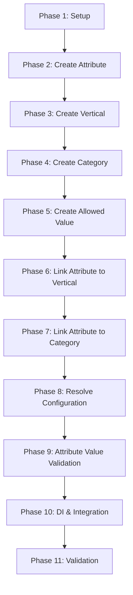

# Plan: Attributes Module

**Created**: 2026-01-16  
**Spec**: [./attributes.md](./attributes.md)  
**Design**: [./01-create-attribute/design.md](./01-create-attribute/design.md), [./02-create-vertical/design.md](./02-create-vertical/design.md), [./03-create-category/design.md](./03-create-category/design.md), [./04-create-allowed-value/design.md](./04-create-allowed-value/design.md), [./05-link-attribute-to-vertical/design.md](./05-link-attribute-to-vertical/design.md), [./06-link-attribute-to-category/design.md](./06-link-attribute-to-category/design.md), [./07-resolve-attribute-configuration/design.md](./07-resolve-attribute-configuration/design.md), [./08-attribute-value-validation/design.md](./08-attribute-value-validation/design.md)  
**Project**: [../../project.md](../../project.md)

---

<!--
  ╔═══════════════════════════════════════════════════════════════════════════╗
  ║  PLANO DE EXECUÇÃO - Define QUANDO fazer cada task                        ║
  ║                                                                           ║
  ║  Este documento contém APENAS tasks de execução.                          ║
  ║  Decisões de negócio → spec.md                                            ║
  ║  Decisões técnicas → design.md                                            ║
  ║  Padrões do projeto → project.md                                          ║
  ║                                                                           ║
  ║  REGRAS PARA TASKS:                                                       ║
  ║  - Atômicas: uma task = uma unidade de trabalho                           ║
  ║  - Verificáveis: deve ser possível validar se está completa               ║
  ║  - Independentes: minimizar dependências entre tasks                      ║
  ╚═══════════════════════════════════════════════════════════════════════════╝
-->

## Phase 1: Setup & Foundations

**Objetivo**: Preparar contexto attributes (estrutura, Prisma e testes)

| ID | Task | Verificação |
|----|------|-------------|
| T001 | Criar estrutura base do módulo `src/modules/attributes` (domain/application/presentation/infrastructure/di/database) | `npm run build` executa sem erro |
| T002 | Adicionar setup Prisma do contexto attributes (schema, datasource, env `DATABASE_URL_ATTRIBUTES`, Prisma Client) | `npx prisma validate --schema src/modules/attributes/infrastructure/database/prisma/schema.prisma` passa |
| T003 | Preparar scaffolding de testes do contexto attributes (unit/integration + helpers Prisma/factories) | `npm test -- --listTests` lista os novos caminhos |

**Checkpoint**: Estrutura base, Prisma e scaffolding de testes prontos

---

## Phase 2: Capability 01 - Create Attribute

**Objetivo**: Criar atributos globais e allowed values iniciais

| ID | Task | Verificação |
|----|------|-------------|
| T004 | Criar migration e modelos Prisma para `attributes` e `attribute_allowed_values` (campos normalizados e índices únicos) | `npx prisma migrate dev` executa sem erro |
| T005 | Implementar `Attribute`, `AllowedValue` e VOs + erros de domínio com testes unitários | Testes unitários passam |
| T006 | Definir interfaces `AttributeRepository` e `AllowedValueRepository` conforme design | TypeScript compila |
| T007 | Implementar `CreateAttributeService` + DTOs com testes unitários (regras de code/limites/default) | Testes unitários passam |
| T008 | Implementar Prisma repos + mappers e testes de integração da capability Create Attribute | Teste de integração passa |
| T009 | Implementar `AttributeController` e rota POST `/attributes` com mapeamento de erros + teste unitário | Teste unitário passa |

**Checkpoint**: Create Attribute funcional e testado

---

## Phase 3: Capability 02 - Create Vertical

**Objetivo**: Criar verticais globais

| ID | Task | Verificação |
|----|------|-------------|
| T010 | Criar migration e modelo Prisma para `verticals` | `npx prisma migrate dev` executa sem erro |
| T011 | Implementar `Vertical` + VOs + erros de domínio com testes unitários | Testes unitários passam |
| T012 | Implementar `CreateVerticalService` + DTOs com testes unitários | Testes unitários passam |
| T013 | Implementar `PrismaVerticalRepository` + mapper e testes de integração da capability Create Vertical | Teste de integração passa |
| T014 | Implementar `VerticalController` e rota POST `/attributes/verticals` com teste unitário | Teste unitário passa |

**Checkpoint**: Create Vertical funcional e testado

---

## Phase 4: Capability 03 - Create Category

**Objetivo**: Criar categorias vinculadas a uma vertical

| ID | Task | Verificação |
|----|------|-------------|
| T015 | Criar migration e modelo Prisma para `categories` (hierarquia e constraints por vertical) | `npx prisma migrate dev` executa sem erro |
| T016 | Implementar `Category`, VOs, `CategoryHierarchyService` e erros com testes unitários | Testes unitários passam |
| T017 | Definir `CategoryRepository` (exists/find/getAncestry/save) e atualizar contrato de `VerticalRepository` | TypeScript compila |
| T018 | Implementar `CreateCategoryService` + DTOs com testes unitários | Testes unitários passam |
| T019 | Implementar `PrismaCategoryRepository` + mapper e testes de integração da capability Create Category | Teste de integração passa |
| T020 | Implementar `CategoryController` e rota POST `/attributes/categories` com teste unitário | Teste unitário passa |

**Checkpoint**: Create Category funcional e testado

---

## Phase 5: Capability 04 - Create Allowed Value

**Objetivo**: Cadastrar valores permitidos para atributos option

| ID | Task | Verificação |
|----|------|-------------|
| T021 | Implementar `CreateAllowedValueService` + DTOs com testes unitários (existência do atributo, Pascal Case, unicidade) | Testes unitários passam |
| T022 | Atualizar `PrismaAllowedValueRepository` (existsByName/Value normalizados) e testes de integração da capability Create Allowed Value | Teste de integração passa |
| T023 | Implementar `AllowedValueController` e rota POST `/attributes/:attributeId/allowed-values` com teste unitário | Teste unitário passa |

**Checkpoint**: Create Allowed Value funcional e testado

---

## Phase 6: Capability 05 - Link Attribute to Vertical

**Objetivo**: Vincular atributos a verticais com overrides

| ID | Task | Verificação |
|----|------|-------------|
| T024 | Criar migration e modelos Prisma para `vertical_attributes`, `vertical_allowed_values`, `vertical_allowed_value_links` | `npx prisma migrate dev` executa sem erro |
| T025 | Implementar `VerticalAttribute`, `VerticalAllowedValue` e erros com testes unitários | Testes unitários passam |
| T026 | Definir interfaces `VerticalAttributeRepository` e `VerticalAllowedValueRepository` | TypeScript compila |
| T027 | Implementar `LinkAttributeToVerticalService` + DTOs com testes unitários | Testes unitários passam |
| T028 | Implementar repos Prisma + mappers e testes de integração da capability Link Attribute to Vertical | Teste de integração passa |
| T029 | Implementar `VerticalAttributeController` e rota POST `/attributes/verticals/:verticalId/attributes` com teste unitário | Teste unitário passa |

**Checkpoint**: Link Attribute to Vertical funcional e testado

---

## Phase 7: Capability 06 - Link Attribute to Category

**Objetivo**: Vincular atributos a categorias com overrides em cascata

| ID | Task | Verificação |
|----|------|-------------|
| T030 | Criar migration e modelos Prisma para `category_attributes`, `category_allowed_values`, `category_allowed_value_links` | `npx prisma migrate dev` executa sem erro |
| T031 | Implementar `CategoryAttribute`, `CategoryAllowedValue` e erros com testes unitários | Testes unitários passam |
| T032 | Definir interfaces `CategoryAttributeRepository` e `CategoryAllowedValueRepository` | TypeScript compila |
| T033 | Implementar `LinkAttributeToCategoryService` + DTOs com testes unitários | Testes unitários passam |
| T034 | Implementar repos Prisma + mappers e testes de integração da capability Link Attribute to Category | Teste de integração passa |
| T035 | Implementar `CategoryAttributeController` e rota POST `/attributes/categories/:categoryId/attributes` com teste unitário | Teste unitário passa |

**Checkpoint**: Link Attribute to Category funcional e testado

---

## Phase 8: Capability 07 - Resolve Attribute Configuration

**Objetivo**: Listar e consultar atributos com regras efetivas resolvidas por cascata

| ID | Task | Verificação |
|----|------|-------------|
| T036 | Implementar `CategoryChain`, `ResolvedAttribute`, `AttributeResolutionService` com testes unitários (precedência e allowed values) | Testes unitários passam |
| T037 | Estender interfaces de repositórios com operações de resolução (list/find/validateChain) | TypeScript compila |
| T038 | Implementar `ResolveAttributeConfigurationService` + DTOs com testes unitários | Testes unitários passam |
| T039 | Implementar métodos Prisma para resolução + testes de integração da capability Resolve Attribute Configuration | Teste de integração passa |
| T040 | Implementar `ResolvedAttributeController` e rotas GET `/attributes` e `/attributes/:attributeId` com teste unitário | Teste unitário passa |

**Checkpoint**: Resolve Attribute Configuration funcional e testado

---

## Phase 9: Capability 08 - Attribute Value Validation

**Objetivo**: Validar valores de atributos com contexto opcional

| ID | Task | Verificação |
|----|------|-------------|
| T041 | Implementar `AttributeValueValidationItem/Error/Result` e `AttributeValueValidationService` com testes unitários | Testes unitários passam |
| T042 | Implementar `ValidateAttributeValuesService` + DTOs com testes unitários | Testes unitários passam |
| T043 | Implementar métodos Prisma para validação + testes de integração da capability Attribute Value Validation | Teste de integração passa |
| T044 | Implementar `AttributeValueValidationController` e rota POST `/attributes/values/validate` com teste unitário | Teste unitário passa |

**Checkpoint**: Attribute Value Validation funcional e testado

---

## Phase 10: DI & Integration

**Objetivo**: Integrar o módulo de atributos na aplicação

| ID | Task | Verificação |
|----|------|-------------|
| T045 | Consolidar DI do módulo (repos/services/controllers) e registrar rotas no bootstrap | Aplicação sobe e rotas do módulo aparecem |

**Checkpoint**: Módulo integrado e com rotas expostas

---

## Phase 11: Validation

**Objetivo**: Validar o módulo completo com a estratégia de testes

| ID | Task | Verificação |
|----|------|-------------|
| T046 | Executar testes unitários do contexto attributes | `npm test -- tests/unit/attributes` passa |
| T047 | Executar testes de integração das capabilities do módulo | `npm test -- tests/integration/attributes` passa |

**Checkpoint**: Módulo validado segundo a estratégia de testes

---

## Dependencies

---

## Execution Notes

- Seguir a estratégia de testes em `specs/testing-strategy.md` (integration tests por capability sem HTTP).
- Cada task deve incluir os testes correspondentes na mesma entrega.
- As camadas devem respeitar as regras de import do `specs/project.md`.
- Se a base de erros (Domain/Application + catálogo HTTP) ou o bootstrap Fastify ainda não existirem, criar como pré-requisito antes de Phase 2.
