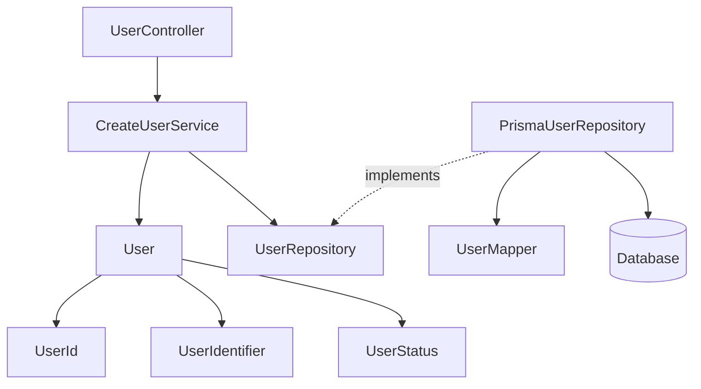
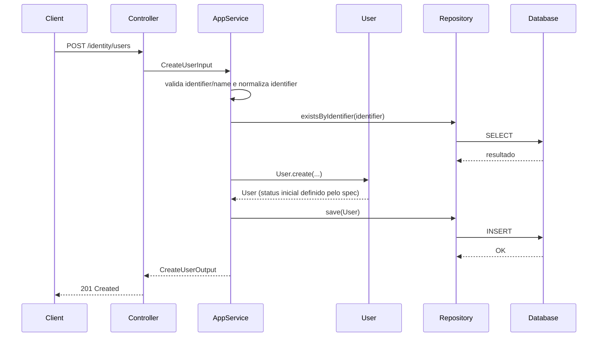
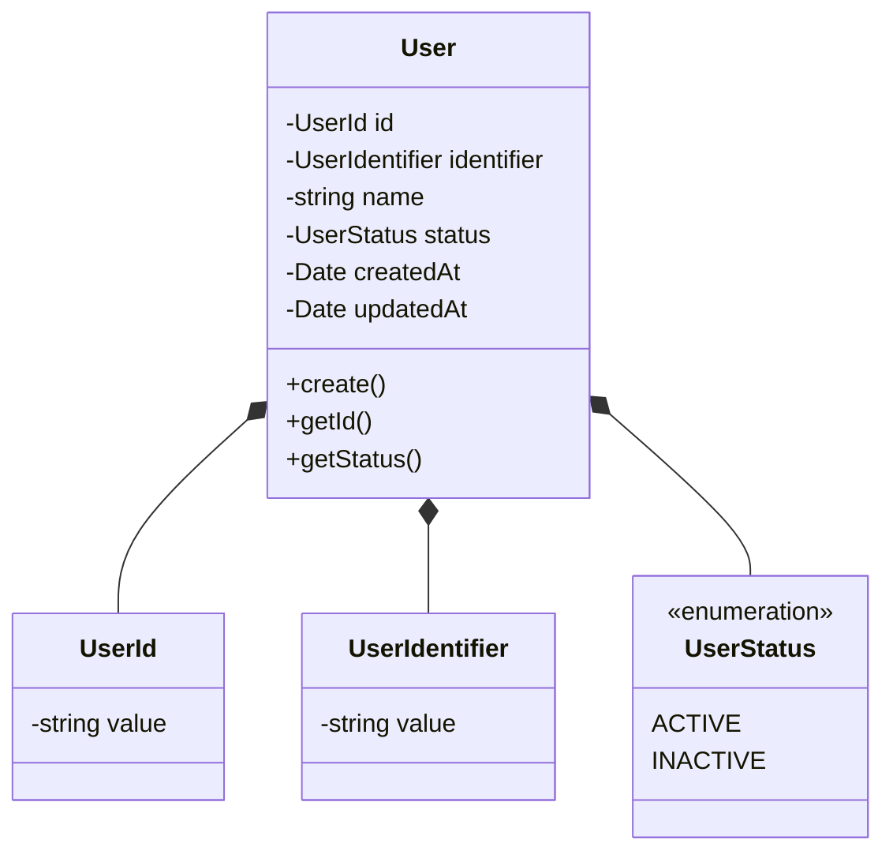
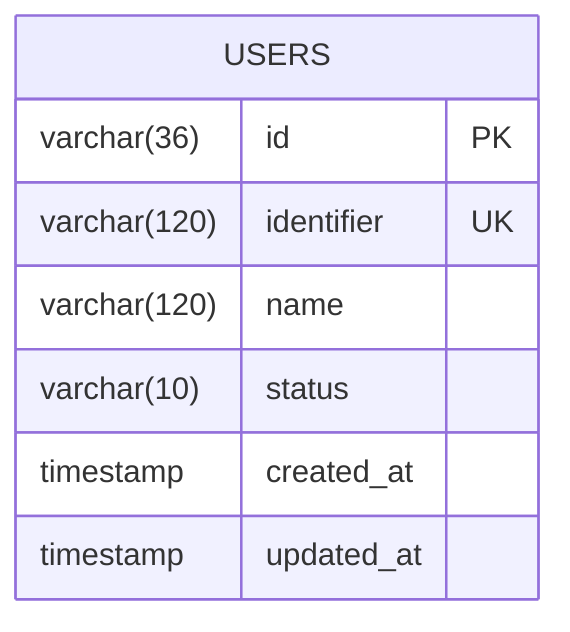
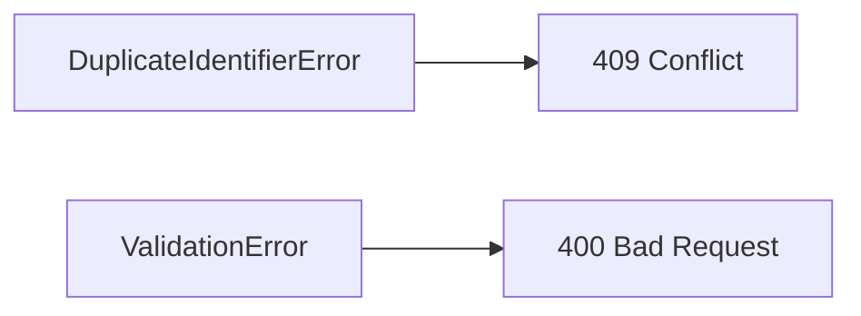

# Create User - Design

**Created**: 2025-12-29

**Spec**: `./spec.md`

**Project**: `../project.md`

---

## Overview

A capability **Create User** implementa a criação de uma **identidade administrativa** no contexto Identity.

Ela cria um registro único de usuário, com **status inicial definido pelo spec**, sem criar credenciais, autenticação, autorização ou qualquer vínculo operacional.

Esta capability é a **porta de entrada obrigatória** para todas as demais funcionalidades do módulo Identity.
Ela é consumida internamente e **não realiza validação de acesso** do chamador.

---

## Component Map

### Domain Layer

| Tipo | Nome | Responsabilidade |
| --- | --- | --- |
| Entity | `User` | Representa a identidade administrativa |
| Value Object | `UserId` | Identificador técnico imutável |
| Value Object | `UserIdentifier` | Identificador lógico único |
| Value Object | `UserStatus` | Estado administrativo da identidade |
| Repository Interface | `UserRepository` | Contrato de persistência da identidade |

---

### Application Layer

| Tipo | Nome | Responsabilidade |
| --- | --- | --- |
| App Service | `CreateUserService` | Orquestra o caso de uso de criação |
| Input DTO | `CreateUserInput` | Dados necessários para criação |
| Output DTO | `CreateUserOutput` | Dados retornados após criação |

---

### Infrastructure Layer

| Tipo | Nome | Responsabilidade |
| --- | --- | --- |
| Repository Impl | `PrismaUserRepository` | Implementa `UserRepository` |
| Mapper | `UserMapper` | Converte Domain ↔ Prisma |

---

### Presentation Layer

| Tipo | Nome | Responsabilidade |
| --- | --- | --- |
| Controller | `UserController` | Exposição HTTP do caso de uso |

---

## Dependency Graph

---

## Data Flow

### Fluxo: Criar Identidade de Usuário

**Transformações de dados**

| Etapa | De | Para |
| --- | --- | --- |
| HTTP → Application | JSON | CreateUserInput |
| Application → Domain | DTO | User |
| Domain → Infra | User | Prisma Model |

---

## Entity Structure

### User

### Propriedades

| Propriedade | Tipo | Mutável | Regras |
| --- | --- | --- | --- |
| `id` | UserId | Não | Gerado internamente |
| `identifier` | UserIdentifier | Não | Único, sem espaços, 3-120 chars, case-insensitive, email ou username |
| `name` | string | Não | Obrigatório, 2-120 chars |
| `status` | UserStatus | Não | Valor inicial definido pelo spec |
| `createdAt` | Date | Não | Automático |
| `updatedAt` | Date | Não | Inicialmente vazio |

---

## Repository Operations

| Operação | Descrição | Usada por |
| --- | --- | --- |
| `save(user)` | Persiste identidade | CreateUserService |
| `existsByIdentifier(identifier)` | Verifica duplicidade (case-insensitive) | CreateUserService |
| `findById(id)` | Consulta futura | Outras capabilities |

---

## Database Model

### Tabela: `users`

---

## API Endpoints

| Método | Path | Operação | Sucesso | Erros |
| --- | --- | --- | --- | --- |
| POST | `/identity/users` | Criar identidade | 201 | 400, 409 |

---

## Error Handling

| Erro | Quando | HTTP | Code |
| --- | --- | --- | --- |
| DuplicateIdentifierError | Identifier já existe | 409 | `USER_ALREADY_EXISTS` |
| ValidationError | Dados inválidos | 400 | `VALIDATION_ERROR` |

---

## Alignment Notes (Spec-Driven)

- O status inicial do usuário é **imposto pelo spec**, não por decisão técnica
- Esta capability **não**:
    - cria credenciais
    - autentica usuários
    - emite tokens
    - concede acessos operacionais
- Qualquer evolução de acesso ocorre **exclusivamente via outras capabilities**

---

## Implementation Notes

- **Aggregate root do Identity**
- Deve ser implementada **antes** das demais capabilities
- Nenhuma dependência com:
    - crypto
    - token
    - autorização externa
- Domain permanece **100% puro**
