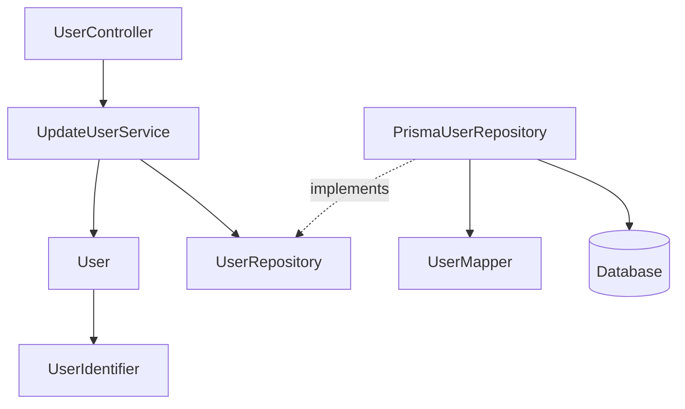
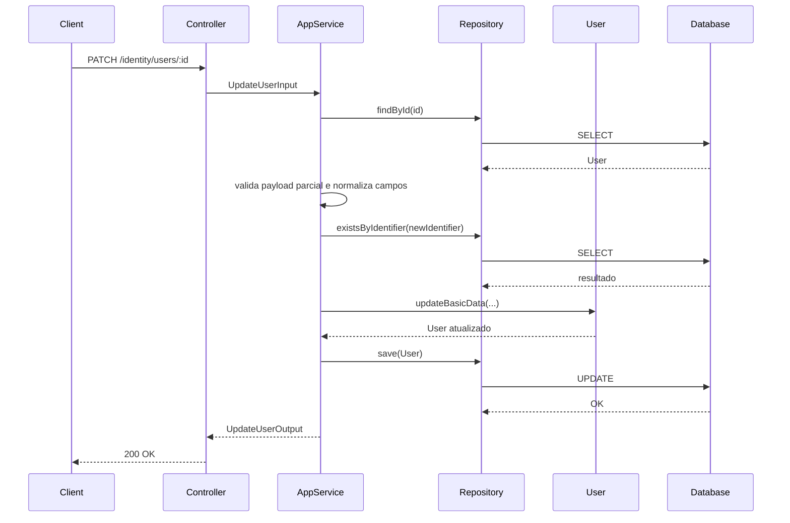
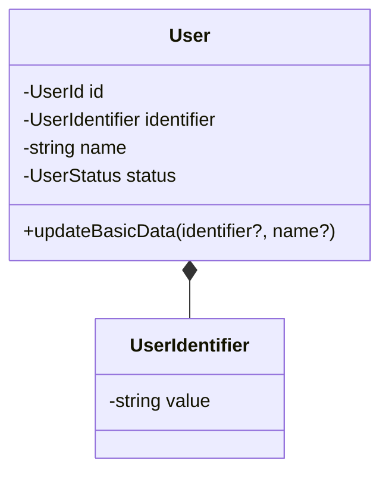
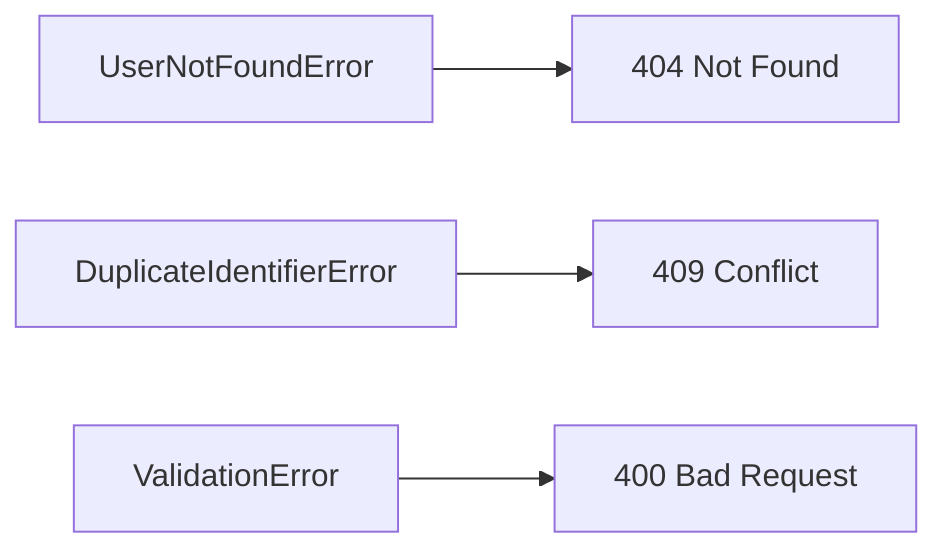

# Update User

**Created**: 2025-12-29

**Spec**: `./spec.md`

**Project**: `../project.md`

---

## Overview

A capability **Update User** permite a atualização de **dados básicos da identidade** de um usuário existente.

Ela atua exclusivamente sobre atributos **não sensíveis ao acesso**, preservando:

- identidade técnica (`id`)
- status administrativo
- credenciais
- verificações de acesso
- associações externas

O fluxo segue **Presentation → Application → Domain → Infrastructure**, reutilizando o aggregate `User` já existente.
Este endpoint é de uso interno e **não realiza validação de acesso** do chamador.

---

## Component Map

### Domain Layer

| Tipo | Nome | Responsabilidade |
| --- | --- | --- |
| Entity | `User` | Aggregate de identidade |
| Value Object | `UserIdentifier` | Identificador lógico (mutável, único) |
| Repository Interface | `UserRepository` | Acesso à identidade persistida |

📌 **Nenhuma nova entity é criada neste design.**

---

### Application Layer

| Tipo | Nome | Responsabilidade |
| --- | --- | --- |
| App Service | `UpdateUserService` | Orquestra a atualização da identidade |
| Input DTO | `UpdateUserInput` | Dados permitidos para atualização |
| Output DTO | `UpdateUserOutput` | Estado atualizado da identidade |

---

### Infrastructure Layer

| Tipo | Nome | Responsabilidade |
| --- | --- | --- |
| Repository Impl | `PrismaUserRepository` | Persistência da identidade |
| Mapper | `UserMapper` | Domain ↔ Prisma |

---

### Presentation Layer

| Tipo | Nome | Responsabilidade |
| --- | --- | --- |
| Controller | `UserController` | Endpoint HTTP de atualização |

---

## Dependency Graph

---

## Data Flow

### Fluxo: Atualizar Dados Básicos do Usuário

**Notas de validacao**

- Campos fornecidos vazios ou invalidos resultam em erro de validacao.
- Campos ausentes permanecem inalterados.

---

## Entity Structure (Reuso)

### User (recorte relevante)

### Regras de Mutabilidade

| Campo | Mutável | Observações |
| --- | --- | --- |
| `id` | ❌ | Identidade técnica imutável |
| `identifier` | ✅ | Único, sem espaços, 3-120 chars, case-insensitive, email ou username |
| `name` | ✅ | 2-120 chars, não vazio |
| `status` | ❌ | Não alterado nesta capability |
| `credentials` | ❌ | Fora do escopo |
| `associations` | ❌ | Fora do escopo |

---

## Repository Operations

| Operação | Descrição | Usada por |
| --- | --- | --- |
| `findById(id)` | Busca identidade | UpdateUserService |
| `existsByIdentifier(identifier)` | Evita duplicidade (apenas se mudou) | UpdateUserService |
| `save(user)` | Persiste alterações | UpdateUserService |

---

## Database Model

📌 **Nenhuma alteração estrutural** em relação à tabela `users` definida em *Create User*.

Apenas operação `UPDATE`.

---

## API Endpoints

| Método | Path | Operação | Sucesso | Erros |
| --- | --- | --- | --- | --- |
| PATCH | `/identity/users/:id` | Atualizar identidade | 200 | 400, 404, 409 |

---

## Error Handling

| Erro | Quando | HTTP | Code |
| --- | --- | --- | --- |
| UserNotFoundError | Usuário inexistente | 404 | `USER_NOT_FOUND` |
| DuplicateIdentifierError | Identifier duplicado | 409 | `IDENTIFIER_ALREADY_EXISTS` |
| ValidationError | Dados inválidos | 400 | `VALIDATION_ERROR` |

---

## Alignment Notes (Spec-Driven)

- Esta capability **não altera status**
- Esta capability **não cria nem altera credenciais**
- Esta capability **não concede nem revoga acesso**
- Toda regra vem diretamente do spec **Update User**

---

## Implementation Notes

- Reuso integral do aggregate `User`
- Método de domínio recomendado: `updateBasicData`
- Nenhum evento de domínio é emitido
- Dependency Injection reaproveita `UserRepository`
