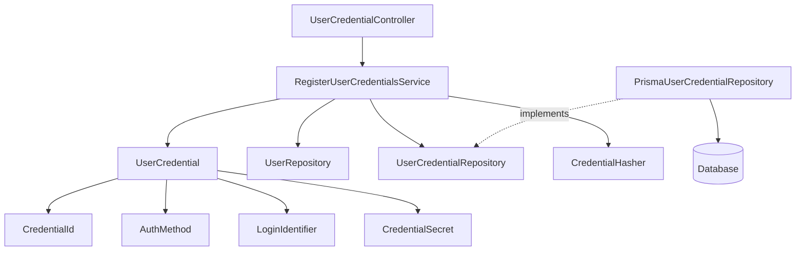
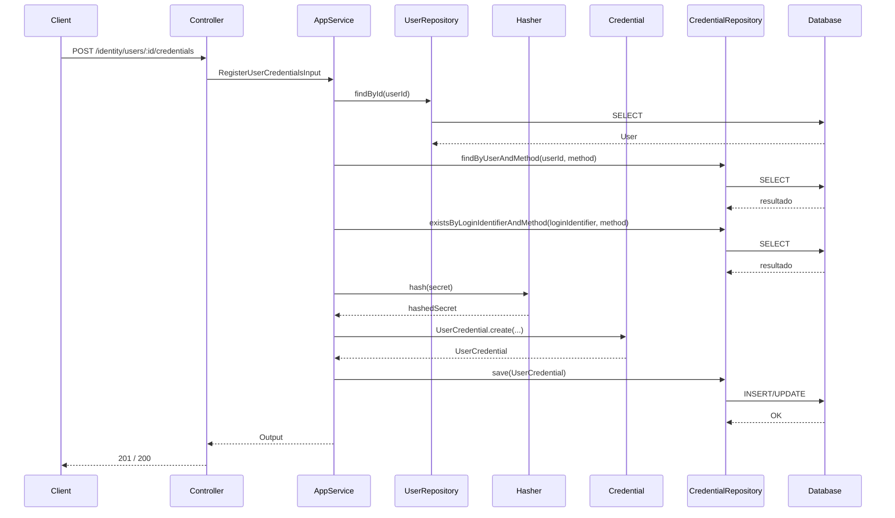
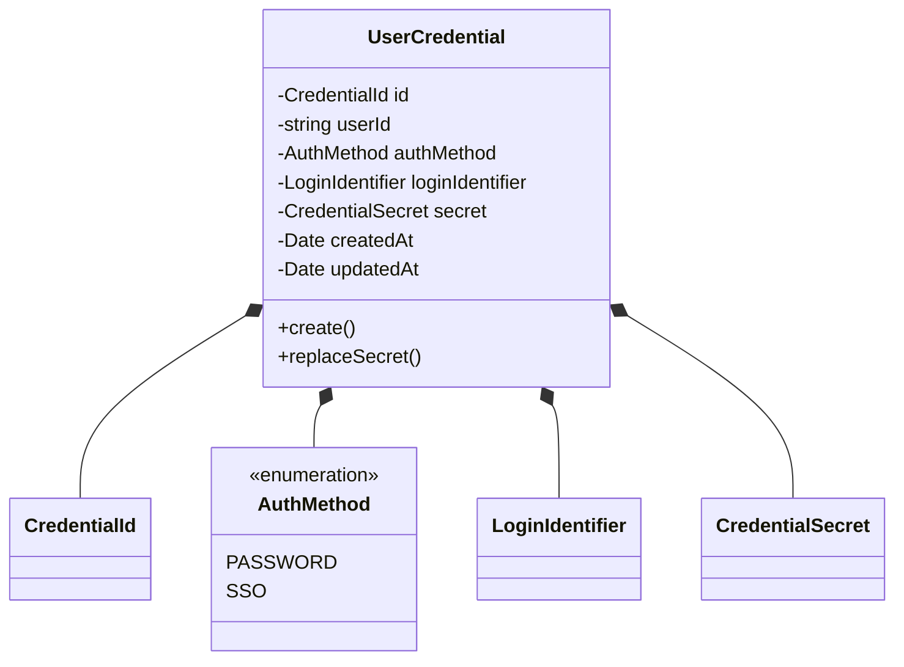
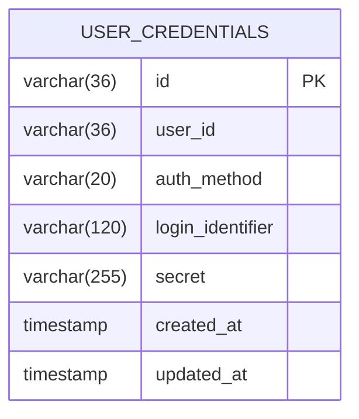
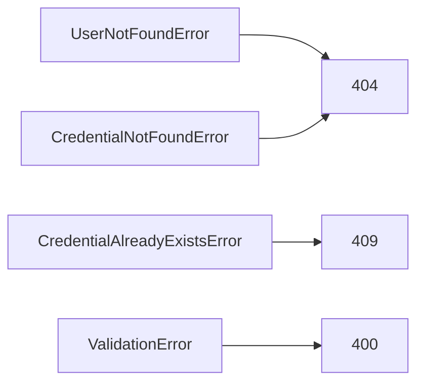

# Register User Credentials

**Created**: 2025-12-29

**Spec**: `./spec.md`

**Project**: `../project.md`

---

## Overview

A capability **Register User Credentials** permite **registrar ou atualizar credenciais de autenticação** associadas a uma identidade existente.

Ela **não autentica**, **não emite token**, **não cria sessão** e **não concede acesso**.

Seu único papel é **persistir de forma segura os meios de autenticação** que poderão ser usados futuramente pela capability *Authenticate User*.
Esta capability é de uso interno, **não altera o status** da identidade e **não valida acesso** do chamador.

---

## Component Map

### Domain Layer

| Tipo | Nome | Responsabilidade |
| --- | --- | --- |
| Entity | `UserCredential` | Representa uma credencial de autenticação |
| Value Object | `CredentialId` | Identificador técnico da credencial |
| Value Object | `AuthMethod` | Método de autenticação (ex: PASSWORD, SSO) |
| Value Object | `LoginIdentifier` | Identificador de login (ex: email) |
| Value Object | `CredentialSecret` | Segredo protegido (hash) |
| Repository Interface | `UserCredentialRepository` | Persistência de credenciais |
| Repository Interface | `UserRepository` | Validação de identidade |

📌 **`User` NÃO é modificado nesta capability.**

---

### Application Layer

| Tipo | Nome | Responsabilidade |
| --- | --- | --- |
| App Service | `RegisterUserCredentialsService` | Orquestra registro/atualização |
| Input DTO | `RegisterUserCredentialsInput` | Dados para registro |
| Output DTO | `RegisterUserCredentialsOutput` | Confirmação da operação |

---

### Infrastructure Layer

| Tipo | Nome | Responsabilidade |
| --- | --- | --- |
| Repository Impl | `PrismaUserCredentialRepository` | Persistência |
| Mapper | `UserCredentialMapper` | Domain ↔ Prisma |
| Crypto Adapter | `CredentialHasher` | Hash do segredo (infra only) |

📌 **Algoritmo e lib não vazam para Domain nem Application.**

---

### Presentation Layer

| Tipo | Nome | Responsabilidade |
| --- | --- | --- |
| Controller | `UserCredentialController` | Endpoint administrativo |

---

## Dependency Graph

---

## Data Flow

### Fluxo: Registrar Credenciais

**Notas de fluxo**

- Registro: se já existir credencial para (`userId`, `authMethod`), rejeitar.
- Atualização: requer credencial existente para (`userId`, `authMethod`).
- `loginIdentifier` deve ser único por `authMethod` (case-insensitive).
- Atualização substitui apenas o `secret`.

---

## Entity Structure

### UserCredential

### Regras de Negócio

| Regra | Observação |
| --- | --- |
| 1 credencial por (`userId`, `authMethod`) | Imposta no domínio |
| Usuário pode estar `ACTIVE` ou `INACTIVE` | Validado no Application |
| Segredo nunca em texto plano | Infra faz hashing |
| `loginIdentifier` único por `authMethod` | Validado no Application |
| `loginIdentifier` normalizado | Trim + lowercase antes de validar unicidade |
| `loginIdentifier` igual ao `User.identifier` | Validado no Application |
| `secret` com politica minima | 8+ chars, 1 minuscula, 1 maiuscula, 1 numero, 1 especial |

---

## Repository Operations

| Operação | Descrição | Usada por |
| --- | --- | --- |
| `findByUserAndMethod(userId, method)` | Verifica existência | Service |
| `existsByLoginIdentifierAndMethod(loginIdentifier, method)` | Verifica unicidade | Service |
| `save(credential)` | Cria ou substitui | Service |

---

## Database Model

### Tabela: `user_credentials`

**Constraints importantes**

- UNIQUE (`user_id`, `auth_method`)
- UNIQUE (`login_identifier`, `auth_method`)
- FK `user_id → users.id`

---

## API Endpoints

| Método | Path | Operação | Sucesso | Erros |
| --- | --- | --- | --- | --- |
| POST | `/identity/users/:id/credentials` | Registrar | 201 | 400, 404, 409 |
| PUT | `/identity/users/:id/credentials/:method` | Atualizar | 200 | 400, 404 |

---

## Error Handling

| Erro | Quando | Code |
| --- | --- | --- |
| UserNotFoundError | Usuário inexistente | `USER_NOT_FOUND` |
| CredentialAlreadyExistsError | Credencial já existente | `CREDENTIAL_ALREADY_EXISTS` |
| CredentialNotFoundError | Credencial inexistente | `CREDENTIAL_NOT_FOUND` |
| ValidationError | Dados inválidos | `VALIDATION_ERROR` |

---

## Alignment Notes (Spec-Driven)

- Esta capability **não autentica**
- Esta capability **não cria token**
- Esta capability **não cria sessão**
- Esta capability **não concede acesso**
- Segue integralmente o spec *Register User Credentials*

---

## Implementation Notes

- Hashing **exclusivamente na Infrastructure**
- Domain **nunca conhece segredo em claro**
- Application **orquestra, não decide algoritmo**
- Repositório garante unicidade (`userId`, `authMethod`) e (`loginIdentifier`, `authMethod`)
- Nenhuma dependência com autorização externa
