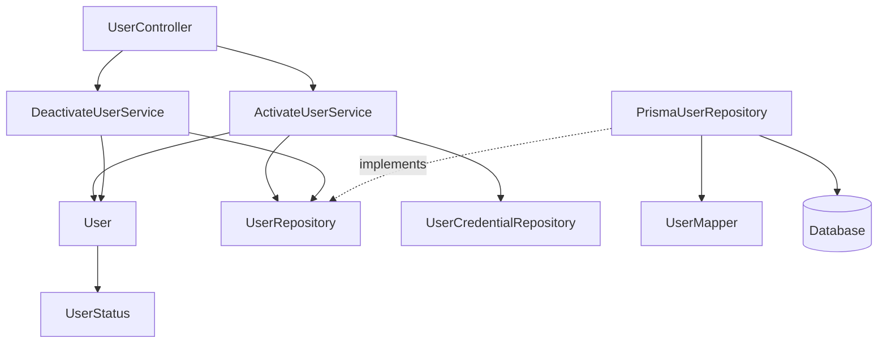
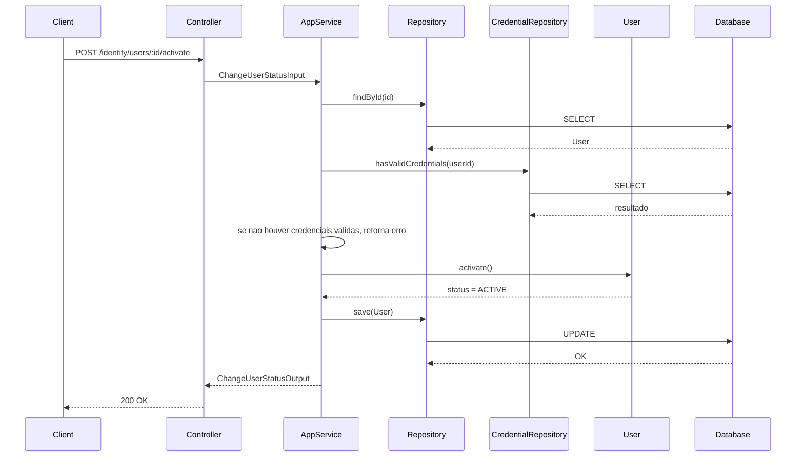
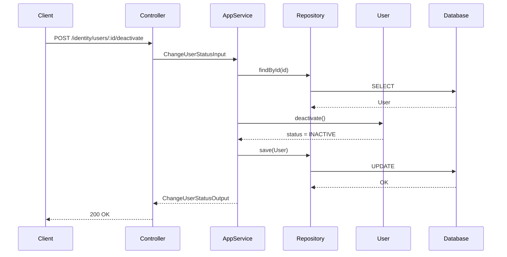
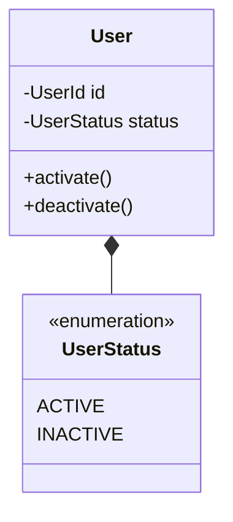
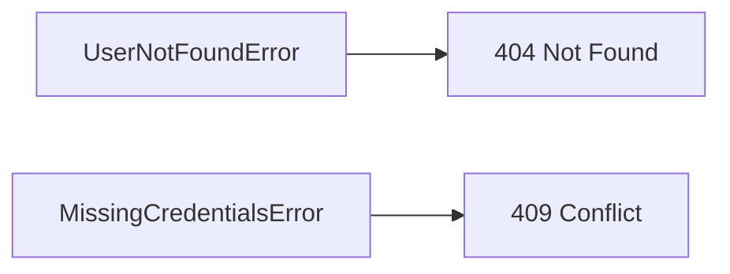

# Activate / Deactivate User

**Created**: 2025-12-29

**Spec**: `./spec.md`

**Project**: `../project.md`

---

## Overview

A capability **Activate / Deactivate User** controla o **estado administrativo** de uma identidade existente, determinando se ela **pode ou não tentar se autenticar** no sistema.

Ela atua exclusivamente sobre o atributo `status` da entity `User`, preservando integralmente:

- identidade técnica
- dados básicos
- credenciais
- verificações de acesso
- associações externas

O fluxo segue **Presentation → Application → Domain → Infrastructure**, reutilizando o aggregate `User`.
Para ativação, a Application **valida a existência de credenciais válidas** antes de alterar o status.
Esta capability é de uso interno e **não realiza validação de acesso** do chamador.

---

## Component Map

### Domain Layer

| Tipo | Nome | Responsabilidade |
| --- | --- | --- |
| Entity | `User` | Aggregate de identidade |
| Value Object | `UserStatus` | Estado administrativo (`ACTIVE`, `INACTIVE`) |
| Repository Interface | `UserRepository` | Acesso à identidade |
| Repository Interface | `UserCredentialRepository` | Verificação de credenciais válidas |

📌 **Nenhuma nova entity é criada.**

---

### Application Layer

| Tipo | Nome | Responsabilidade |
| --- | --- | --- |
| App Service | `ActivateUserService` | Ativa uma identidade |
| App Service | `DeactivateUserService` | Desativa uma identidade |
| Input DTO | `ChangeUserStatusInput` | Identifica a identidade alvo |
| Output DTO | `ChangeUserStatusOutput` | Retorno do novo estado |

---

### Infrastructure Layer

| Tipo | Nome | Responsabilidade |
| --- | --- | --- |
| Repository Impl | `PrismaUserRepository` | Persistência da identidade |
| Repository Impl | `PrismaUserCredentialRepository` | Consulta de credenciais |
| Mapper | `UserMapper` | Domain ↔ Prisma |

---

### Presentation Layer

| Tipo | Nome | Responsabilidade |
| --- | --- | --- |
| Controller | `UserController` | Endpoints administrativos de status |

---

## Dependency Graph

---

## Data Flow

### Fluxo: Ativar Usuário

**Notas de resposta**

- Operacoes idempotentes retornam sucesso e indicam que nenhuma alteracao foi necessaria.

---

### Fluxo: Desativar Usuário

---

## Entity Structure (Reuso + Comportamento)

### User (recorte relevante)

### Regras de Comportamento

| Método | Regra |
| --- | --- |
| `activate()` | Se já ACTIVE, operação idempotente |
| `deactivate()` | Se já INACTIVE, operação idempotente |
| `status` | Única alteração permitida nesta capability |

---

## Repository Operations

| Operação | Descrição | Usada por |
| --- | --- | --- |
| `findById(id)` | Busca identidade | Activate/Deactivate |
| `hasValidCredentials(userId)` | Verifica credenciais válidas | Activate |
| `save(user)` | Persiste status | Activate/Deactivate |

---

## Database Model

📌 **Nenhuma alteração estrutural** na tabela `users`.

Apenas atualização do campo `status` e `updated_at`.

---

## API Endpoints

| Método | Path | Operação | Sucesso | Erros |
| --- | --- | --- | --- | --- |
| POST | `/identity/users/:id/activate` | Ativar usuário | 200 | 404, 409 |
| POST | `/identity/users/:id/deactivate` | Desativar usuário | 200 | 404 |

---

## Error Handling

| Erro | Quando | HTTP | Code |
| --- | --- | --- | --- |
| UserNotFoundError | Usuário inexistente | 404 | `USER_NOT_FOUND` |
| MissingCredentialsError | Usuário sem credenciais válidas | 409 | `USER_MISSING_CREDENTIALS` |

📌 Operações são **idempotentes** — não geram erro se o status já estiver no valor desejado.

---

## Alignment Notes (Spec-Driven)

- Esta capability **não cria nem altera credenciais**
- Esta capability **não autentica usuários**
- Esta capability **não concede nem revoga acessos operacionais**
- O status **apenas controla a possibilidade futura de autenticação**
- Toda regra vem diretamente do spec *Activate / Deactivate User*

---

## Implementation Notes

- Reuso total do aggregate `User`
- Métodos de domínio explícitos: `activate()` e `deactivate()`
- Nenhum evento de domínio é emitido
- Nenhuma integração com autorização externa
- Dependency Injection reaproveita `UserRepository`
