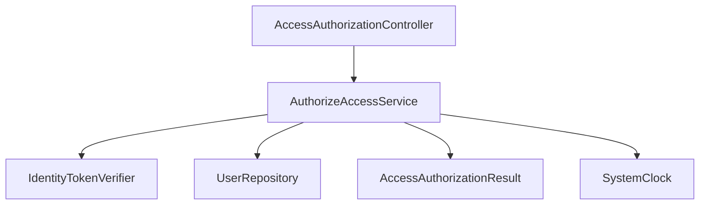
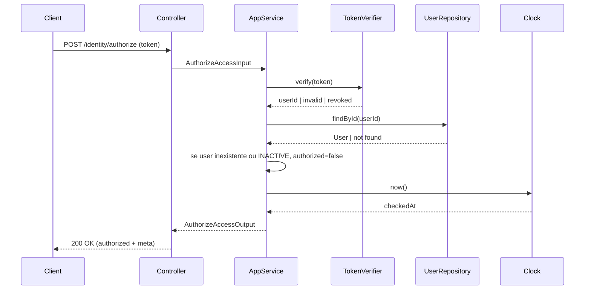
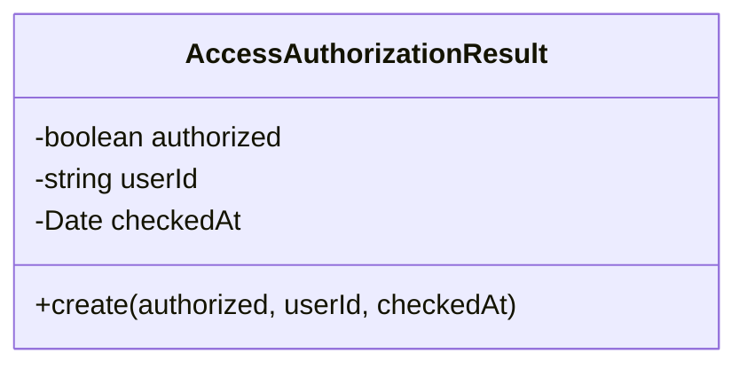
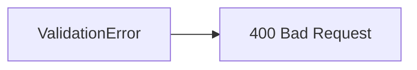

# Authorize Access (verify identity)

**Created**: 2025-12-29

**Spec**: `./spec.md`

**Project**: `../project.md`

---

## Overview

A capability **Authorize Access** valida um token e confirma se ele representa uma identidade existente e ativa.

Ela **não avalia regras de acesso**, **não interpreta domínio**, **não emite tokens** e **não mantém estado**.

---

## Component Map

### Domain Layer

| Tipo | Nome | Responsabilidade |
| --- | --- | --- |
| Entity | `AccessAuthorizationResult` | Resultado da verificação de acesso |

---

### Application Layer

| Tipo | Nome | Responsabilidade |
| --- | --- | --- |
| App Service | `AuthorizeAccessService` | Orquestra verificação do token e da identidade |
| Input DTO | `AuthorizeAccessInput` | Token informado pelo módulo consumidor |
| Output DTO | `AuthorizeAccessOutput` | `authorized`, `userId?`, `checkedAt` |

---

### Infrastructure Layer

| Tipo | Nome | Responsabilidade |
| --- | --- | --- |
| Token Verifier | `IdentityTokenVerifier` | Verifica assinatura, expiração e revogação |
| Repository Impl | `PrismaUserRepository` | Consulta de identidade |
| Clock Adapter | `SystemClock` | Fornece `checkedAt` |

---

### Presentation Layer

| Tipo | Nome | Responsabilidade |
| --- | --- | --- |
| Controller | `AccessAuthorizationController` | Endpoint HTTP de verificação |

---

## Dependency Graph

---

## Data Flow

### Fluxo: Verificar acesso por token

---

## Entity Structure

### AccessAuthorizationResult

📌 `userId` só é preenchido quando `authorized = true`.

---

## API Endpoints

| Método | Path | Operação | Sucesso | Erros |
| --- | --- | --- | --- | --- |
| POST | `/identity/authorize` | Verificar acesso | 200 | 400 |

Notas:

- `400`: payload inválido (token ausente ou malformado).

---

## Error Handling

| Erro | Quando | HTTP | Code |
| --- | --- | --- | --- |
| `ValidationError` | Token ausente ou inválido no payload | 400 | `VALIDATION_ERROR` |

---

## Technical Decisions

### TD-01: Verificação de token isolada na Infrastructure

**Contexto**: O domínio não deve conhecer formato de token ou criptografia.

**Decisão**: `IdentityTokenVerifier` fica na Infrastructure e retorna apenas `userId` ou falha.

**Justificativa**: Mantém o domínio puro e desacopla decisões técnicas.

---

## Implementation Notes

- **Stateless**: nenhuma persistência ou cache de decisão.
- **Fail-closed**: token inválido ou revogado resulta em `authorized=false`.
- **Sem regras de acesso**: apenas verificação de identidade.
