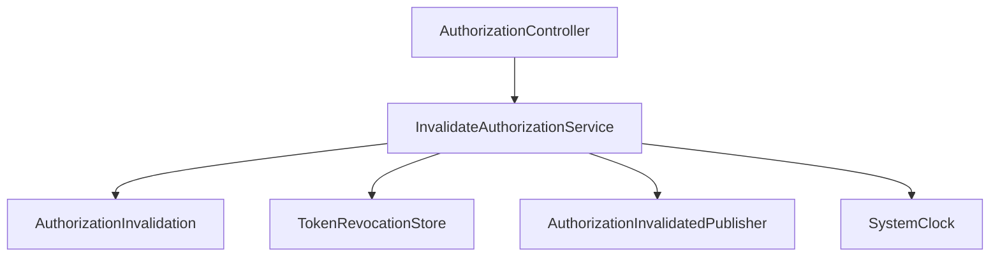
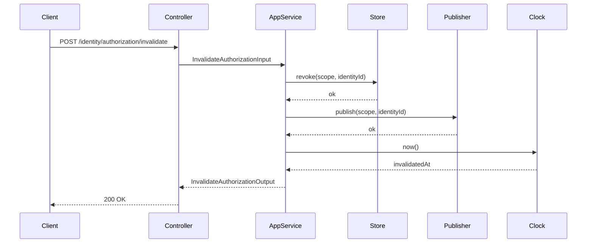
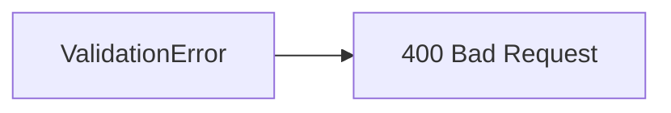

# Invalidate Authorization (token revocation)

**Created**: 2025-12-29

**Spec**: `./spec.md`

**Project**: `../project.md`

---

## Overview

A capability **Invalidate Authorization** revoga tokens emitidos para uma identidade ou de forma global, garantindo que verificações futuras neguem acesso.

Ela **não entende regras de acesso**, **não altera identidade**, **não interpreta domínio**, e atua apenas como mecanismo técnico de revogação.

---

## Component Map

### Domain Layer

| Tipo | Nome | Responsabilidade |
| --- | --- | --- |
| Entity | `AuthorizationInvalidation` | Representa uma invalidação solicitada |
| Value Object | `InvalidationScope` | Escopo da invalidação (`IDENTITY`, `GLOBAL`) |
| Value Object | `IdentityId` | Identidade alvo (quando aplicável) |

---

### Application Layer

| Tipo | Nome | Responsabilidade |
| --- | --- | --- |
| App Service | `InvalidateAuthorizationService` | Orquestra revogação de tokens |
| Input DTO | `InvalidateAuthorizationInput` | Escopo e identidade a invalidar |
| Output DTO | `InvalidateAuthorizationOutput` | Confirmação da operação |

---

### Infrastructure Layer

| Tipo | Nome | Responsabilidade |
| --- | --- | --- |
| Revocation Store | `TokenRevocationStore` | Registra revogações (identity/global) |
| Event Publisher | `AuthorizationInvalidatedPublisher` | Publica evento de revogação |
| Clock Adapter | `SystemClock` | Timestamp técnico |

📌 Implementações concretas (Redis, RabbitMQ, etc.) vivem **exclusivamente aqui**.

---

### Presentation Layer

| Tipo | Nome | Responsabilidade |
| --- | --- | --- |
| Controller | `AuthorizationController` | Endpoint HTTP administrativo |

---

## Dependency Graph



---

## Data Flow

### Fluxo: Revogar Tokens



---

## DTOs

### InvalidateAuthorizationInput

```tsx
{
scope:"IDENTITY" | "GLOBAL",
identityId?:string,
reason?:string
}

```

📌 `identityId` é obrigatório quando `scope = "IDENTITY"` e segue o formato de `User.id`.

---

### InvalidateAuthorizationOutput

```tsx
{
invalidatedAt:Date,
scope:"IDENTITY" | "GLOBAL",
identityId?:string
}

```

---

## Revocation Store Contract

### TokenRevocationStore (Port)

```tsx
interface TokenRevocationStore {
  revoke(scope:"IDENTITY" | "GLOBAL", identityId?:string):Promise<void>
}

```

📌 Implementações possíveis:

- Redis (revocation list)
- In-memory
- No-op (quando não há revogação)

---

## Event Publishing

### Evento: AuthorizationInvalidated

```tsx
{
scope:"IDENTITY" | "GLOBAL",
identityId?:string,
occurredAt:Date
}

```

---

## API Endpoints

| Método | Path | Operação | Sucesso | Erros |
| --- | --- | --- | --- | --- |
| POST | `/identity/authorization/invalidate` | Invalidar tokens | 200 | 400 |

---

## Error Handling



| Erro | Quando | Code |
| --- | --- | --- |
| ValidationError | Payload inválido | `VALIDATION_ERROR` |

---

## Alignment Notes (Spec-Driven)

- Revogação **não altera identidade**
- Revogação **não interpreta regras de acesso**
- Escopo é **apenas IDENTITY/GLOBAL**
- Totalmente alinhado ao spec

---

## Implementation Notes

- Stateless
- Sem persistência obrigatória
- Alta coesão, baixo acoplamento
