# auth

## auth-context
# Identity Context - Security & Token Strategy

**Created**: 2025-12-29

**Project**: `specs/project.md`

**Context**: Identity

---

## Purpose

Este documento registra **decisões técnicas explícitas** relacionadas a:

- Proteção de credenciais
- Emissão e verificação de tokens de autenticação

O objetivo é **viabilizar implementação consistente**, evitando ambiguidades e decisões implícitas durante o desenvolvimento.

Este documento **não descreve fluxos**, **não repete specs**, e **não define comportamento de negócio**.

---

## Scope

Este documento se aplica exclusivamente ao **contexto Identity** e às seguintes capabilities:

- Register User Credentials
- Authenticate User
- Authorize Access (verify identity)
- Invalidate Authorization (token revocation)

---

## Credential Hashing Strategy

### Decision

Utilizar **Argon2id** como algoritmo padrão para hashing de credenciais sensíveis.

---

### Rationale

Argon2id foi escolhido com base nos seguintes critérios técnicos:

- ✅ **Resistência a ataques por GPU**
- ✅ **Proteção contra side-channel attacks**
- ✅ **Parâmetros explícitos e configuráveis**
- ✅ **Recomendado por padrões modernos de segurança**
- ✅ **Vencedor do Password Hashing Competition (PHC)**

Comparativamente:

| Algoritmo | Motivo de não escolha |
| --- | --- |
| bcrypt | Vulnerável a paralelização em GPU |
| bcryptjs | Performance inferior (pure JS) |
| pbkdf2 | Fácil configuração incorreta |
| scrypt | Mais complexo sem ganho claro |

---

### Usage Constraints

- Segredos **nunca** devem ser armazenados ou logados em texto plano
- Hashing ocorre **exclusivamente na Infrastructure**
- Domain e Application **não conhecem** algoritmo, parâmetros ou biblioteca
- Parâmetros (memória, iterações, paralelismo) são definidos via configuração de infraestrutura

---

### Dependency

- Biblioteca Node.js compatível com Argon2id
    
    (ex: implementação nativa de argon2)
    

---

## Authentication Token Strategy

### Decision

Utilizar **JWT assinado com chave assimétrica (RS256)** como token de autenticação.

---

### Rationale

A escolha por JWT (RS256) atende aos seguintes requisitos:

- ✅ **Stateless** (não requer persistência de sessão)
- ✅ **Verificação local por múltiplos consumidores**
- ✅ **Separação clara entre emissão e verificação**
- ✅ **Evita compartilhamento de segredo**
- ✅ **Boa interoperabilidade com outros módulos**

Comparativamente:

| Estratégia | Motivo de não escolha |
| --- | --- |
| JWT HS256 | Chave simétrica compartilhada |
| Tokens opacos | Requer estado central |
| Sessions | Não escala bem |
| PASETO | Menor adoção/ecossistema |

---

### Token Semantics

O token de autenticação **DEVE**:

- Identificar unicamente a identidade autenticada (`userId`)
- Conter timestamps técnicos (`iat`, `exp`)
- Ser tratado como **opaco** fora do Identity

O token **NÃO DEVE**:

- Conter regras de acesso
- Conter semântica de domínio (tenant, BU, etc.)
- Ser interpretado fora do Identity

---

### Usage Constraints

- Emissão do token ocorre **somente** no Identity
- Verificação ocorre na Infrastructure (Identity ou consumidores)
- Application recebe apenas `userId` derivado
- Domain não conhece tokens

---

### Dependency

- Biblioteca JWT compatível com RS256
    
    (ex: `jose`, `jsonwebtoken`, ou equivalente)
    

---

## Authorization Boundary

- Tokens **não carregam regras de acesso**
- Autorização aqui significa **apenas verificação de identidade**
- Token serve apenas para **identificação da identidade**
- Revogação de token exige **Invalidate Authorization**

---

## Operational Considerations

### Rotation & Expiration

- Chaves privadas de assinatura devem permitir rotação
- `exp` deve ser configurável
- Tokens expirados **não** são renovados automaticamente

---

### Observability

- Falhas de autenticação devem ser logadas
- Nunca logar segredos ou hashes
- Tokens **não** devem ser logados em produção

---

## Non-Goals

Este documento **não define**:

- Fluxos de login
- Endpoints HTTP
- Políticas de senha
- Regras de autorização
- Integrações externas

Esses aspectos pertencem aos **specs** e **designs específicos**.

---

## Summary

- Credenciais: **Argon2id**
- Tokens: **JWT RS256**
- Identity permanece:
    - Stateless
    - Sem autorização embutida
    - Sem vazamento de domínio
- Decisões suficientes para **implementar com segurança**

## 01-create-user

### design
# Create User - Design

**Created**: 2025-12-29

**Spec**: `./spec.md`

**Project**: `../project.md`

---

## Overview

A capability **Create User** implementa a criação de uma **identidade administrativa** no contexto Identity.

Ela cria um registro único de usuário, com **status inicial definido pelo spec**, sem criar credenciais, autenticação, autorização ou qualquer vínculo operacional.

Esta capability é a **porta de entrada obrigatória** para todas as demais funcionalidades do módulo Identity.
Ela é consumida internamente e **não realiza validação de acesso** do chamador.

---

## Component Map

### Domain Layer

| Tipo | Nome | Responsabilidade |
| --- | --- | --- |
| Entity | `User` | Representa a identidade administrativa |
| Value Object | `UserId` | Identificador técnico imutável |
| Value Object | `UserIdentifier` | Identificador lógico único |
| Value Object | `UserStatus` | Estado administrativo da identidade |
| Repository Interface | `UserRepository` | Contrato de persistência da identidade |

---

### Application Layer

| Tipo | Nome | Responsabilidade |
| --- | --- | --- |
| App Service | `CreateUserService` | Orquestra o caso de uso de criação |
| Input DTO | `CreateUserInput` | Dados necessários para criação |
| Output DTO | `CreateUserOutput` | Dados retornados após criação |

---

### Infrastructure Layer

| Tipo | Nome | Responsabilidade |
| --- | --- | --- |
| Repository Impl | `PrismaUserRepository` | Implementa `UserRepository` |
| Mapper | `UserMapper` | Converte Domain ↔ Prisma |

---

### Presentation Layer

| Tipo | Nome | Responsabilidade |
| --- | --- | --- |
| Controller | `UserController` | Exposição HTTP do caso de uso |

---

## Dependency Graph

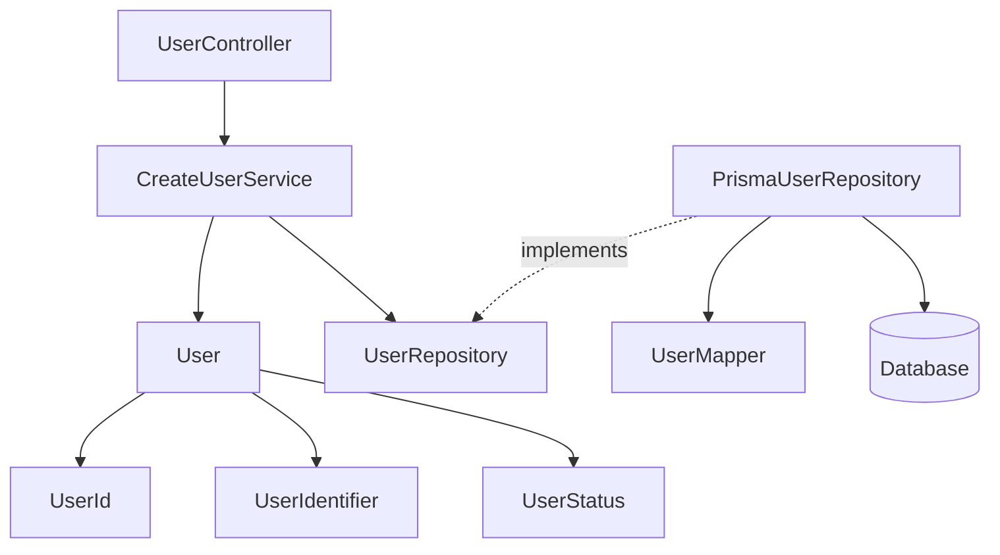

---

## Data Flow

### Fluxo: Criar Identidade de Usuário

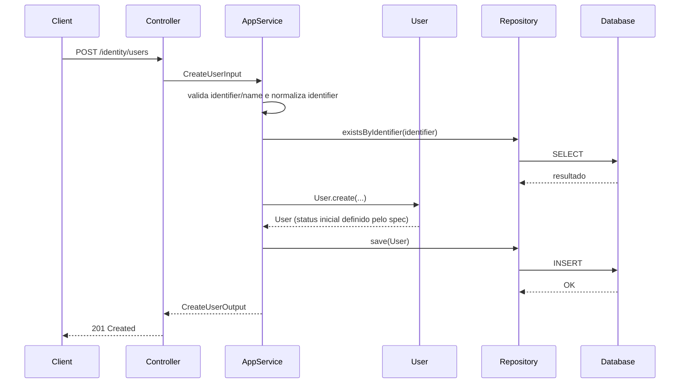

**Transformações de dados**

| Etapa | De | Para |
| --- | --- | --- |
| HTTP → Application | JSON | CreateUserInput |
| Application → Domain | DTO | User |
| Domain → Infra | User | Prisma Model |

---

## Entity Structure

### User

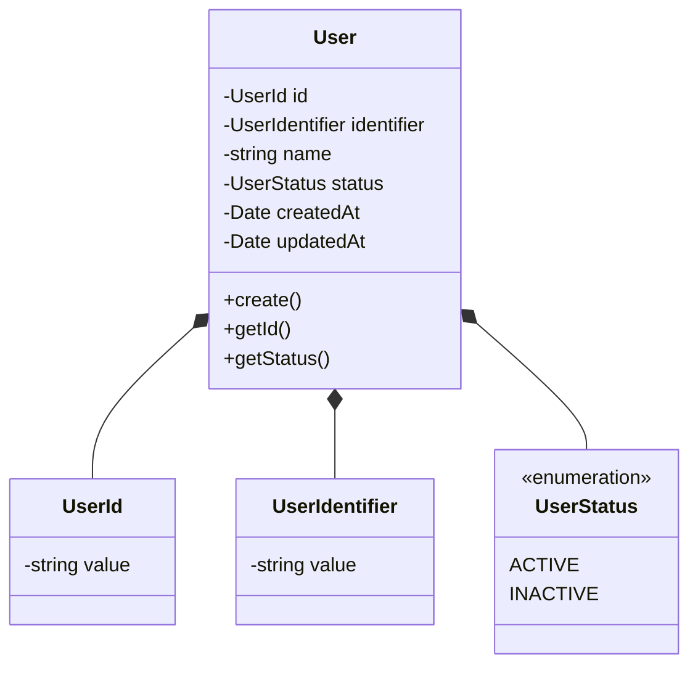

### Propriedades

| Propriedade | Tipo | Mutável | Regras |
| --- | --- | --- | --- |
| `id` | UserId | Não | Gerado internamente |
| `identifier` | UserIdentifier | Não | Único, sem espaços, 3-120 chars, case-insensitive, email ou username |
| `name` | string | Não | Obrigatório, 2-120 chars |
| `status` | UserStatus | Não | Valor inicial definido pelo spec |
| `createdAt` | Date | Não | Automático |
| `updatedAt` | Date | Não | Inicialmente vazio |

---

## Repository Operations

| Operação | Descrição | Usada por |
| --- | --- | --- |
| `save(user)` | Persiste identidade | CreateUserService |
| `existsByIdentifier(identifier)` | Verifica duplicidade (case-insensitive) | CreateUserService |
| `findById(id)` | Consulta futura | Outras capabilities |

---

## Database Model

### Tabela: `users`

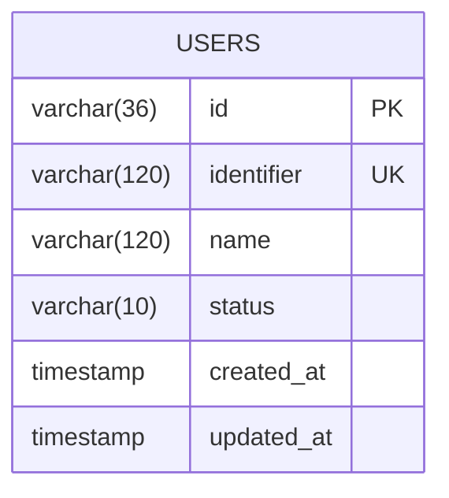

---

## API Endpoints

| Método | Path | Operação | Sucesso | Erros |
| --- | --- | --- | --- | --- |
| POST | `/identity/users` | Criar identidade | 201 | 400, 409 |

---

## Error Handling

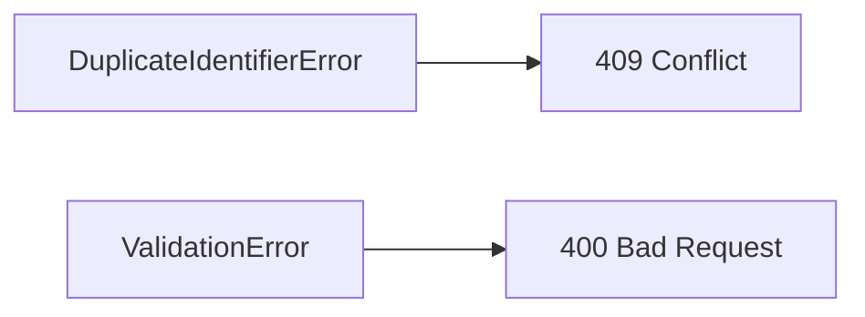

| Erro | Quando | HTTP | Code |
| --- | --- | --- | --- |
| DuplicateIdentifierError | Identifier já existe | 409 | `USER_ALREADY_EXISTS` |
| ValidationError | Dados inválidos | 400 | `VALIDATION_ERROR` |

---

## Alignment Notes (Spec-Driven)

- O status inicial do usuário é **imposto pelo spec**, não por decisão técnica
- Esta capability **não**:
    - cria credenciais
    - autentica usuários
    - emite tokens
    - concede acessos operacionais
- Qualquer evolução de acesso ocorre **exclusivamente via outras capabilities**

---

## Implementation Notes

- **Aggregate root do Identity**
- Deve ser implementada **antes** das demais capabilities
- Nenhuma dependência com:
    - crypto
    - token
    - autorização externa
- Domain permanece **100% puro**

### spec
# Create User

**Created**: 2025-12-29

**Project**: `specs/project.md`

---

## User Stories

### User Story 1 — Criar identidade de usuário (P1)

Como **módulo interno**,

quero **criar uma identidade de usuário única**,

para que essa identidade possa futuramente ser utilizada em processos de autenticação e verificação de acesso.

**Por que P1**:

Sem a existência de uma identidade, nenhuma outra capability do módulo Identity pode operar.

### Acceptance Criteria

```gherkin
Scenario: Criar um usuário com dados válidos
  Given que não existe um usuário com o mesmo identificador único
  When o módulo interno solicita a criação de um novo usuário
  Then uma identidade de usuário deve ser criada
  And o usuário deve possuir um status inicial definido
  And o usuário não deve possuir credenciais registradas
  And o usuário não deve possuir associações ou acessos operacionais

Scenario: Tentar criar um usuário com identificador já existente
  Given que já existe um usuário com o mesmo identificador único
  When o módulo interno solicita a criação de um novo usuário
  Then a criação deve ser rejeitada
  And o sistema deve informar que a identidade já existe

Scenario: Tentar criar um usuário com dados inválidos
  Given que o identificador ou o nome estão vazios ou inválidos
  When o módulo interno solicita a criação de um novo usuário
  Then a criação deve ser rejeitada
  And o sistema deve informar erro de validação

```

---

## Functional Requirements

- **FR-001**: O sistema **DEVE** permitir a criação de um usuário como identidade única.
- **FR-002**: O identificador lógico do usuário **DEVE** ser único no sistema.
- **FR-003**: O usuário criado **DEVE** possuir um status inicial definido.
- **FR-004**: O sistema **NÃO DEVE** conceder acesso operacional durante a criação do usuário.
- **FR-005**: A criação de um usuário **NÃO DEVE** associá-lo automaticamente a tenants ou business units.
- **FR-006**: A criação de um usuário **NÃO DEVE** registrar credenciais de autenticação.
- **FR-007**: O sistema **DEVE** impedir a criação de identidades duplicadas.
- **FR-008**: O status inicial do usuário **DEVE** ser `INACTIVE`.
- **FR-009**: O identificador lógico **DEVE** ser normalizado para comparação e tratado como **case-insensitive** para unicidade.
- **FR-010**: O identificador lógico **DEVE** ter entre 3 e 120 caracteres e **NÃO DEVE** conter espaços.
- **FR-011**: O identificador lógico **DEVE** seguir o padrão de **email** ou **username**.
- **FR-012**: O nome **DEVE** ter entre 2 e 120 caracteres após normalização e **NÃO DEVE** ser vazio.
- **FR-013**: A criação de identidade **NÃO DEVE** realizar validação de acesso do chamador, pois é uso interno do módulo.

📌 *A ativação da identidade é responsabilidade de outra capability.*

---

## Entity

### User

| Campo | Descrição | Regras |
| --- | --- | --- |
| `id` | Identificador único da identidade | Obrigatório, único |
| `identifier` | Identificador lógico (email ou username) | Obrigatório, único, 3-120 chars, sem espaços, case-insensitive |
| `name` | Nome exibido do usuário | Obrigatório, 2-120 chars, não vazio |
| `status` | Estado administrativo da identidade | Valores permitidos: `ACTIVE`, `INACTIVE` |
| `createdAt` | Data de criação | Obrigatório |
| `updatedAt` | Data da última atualização | Opcional |

**Observações importantes**:

- No momento da criação:
    - o usuário **não possui** credenciais
    - o usuário **não possui** associações
    - o usuário **não possui** acesso operacional
- Qualquer vínculo futuro ocorre **exclusivamente via outras capabilities**.

---

## Success Criteria

- **SC-001**: 100% dos usuários criados possuem identificador único.
- **SC-002**: 100% dos usuários criados possuem status inicial `INACTIVE`.
- **SC-003**: Nenhum usuário criado possui acesso operacional implícito.
- **SC-004**: Tentativas de criação duplicada são rejeitadas de forma consistente.
- **SC-005**: Tentativas de criação com dados inválidos são rejeitadas de forma consistente.

---

## Glossary

| Termo | Definição |
| --- | --- |
| User | Identidade administrativa e autenticável |
| Identidade | Representação única de uma pessoa no sistema |
| Status | Estado administrativo que controla autenticação |

---

## Summary

A capability **Create User** cria uma identidade única no sistema, sem conceder qualquer tipo de acesso, autenticação ou autorização.

Ela estabelece a base sobre a qual todas as demais capabilities do módulo Identity operam, mantendo separação rigorosa entre identidade, autenticação e acesso.

### spec-validation
## Avaliacao da Spec: Create User

| Criterio | Nota | Observacao |
|----------|------|------------|
| Estrutura e Completude | 5/5 | Secoes completas e alinhadas ao template. |
| User Stories | 5/5 | Cobrem sucesso, duplicidade e dados invalidos. |
| Edge Cases | 4/5 | Cobre invalidos; normalizacao detalhada pode ser expandida. |
| Functional Requirements | 5/5 | Regras claras de unicidade, formato e status. |
| Entity | 5/5 | Campos e regras bem definidos. |
| Success Criteria | 4/5 | Metricas claras; pode incluir validacao por padrao. |
| Clareza | 5/5 | Texto claro e consistente. |
| Implementabilidade | 5/5 | Implementavel sem ambiguidades. |
| **TOTAL** | 38/40 | |

## Veredicto

- [x] APROVADA - Pode avancar para design
- [ ] APROVADA COM RESSALVAS - Ajustes menores necessarios
- [ ] REPROVADA - Problemas bloqueantes

## Problemas Encontrados

1. Nao ha problemas bloqueantes identificados.

## Pontos Fortes

1. Regras de identidade e validacao bem especificadas.
2. Separacao clara entre identidade e acesso.

## Template de Referencia
Arquivo: `specs/templates/spec-template.md`

## 02-update-user

### design
# Update User

**Created**: 2025-12-29

**Spec**: `./spec.md`

**Project**: `../project.md`

---

## Overview

A capability **Update User** permite a atualização de **dados básicos da identidade** de um usuário existente.

Ela atua exclusivamente sobre atributos **não sensíveis ao acesso**, preservando:

- identidade técnica (`id`)
- status administrativo
- credenciais
- verificações de acesso
- associações externas

O fluxo segue **Presentation → Application → Domain → Infrastructure**, reutilizando o aggregate `User` já existente.
Este endpoint é de uso interno e **não realiza validação de acesso** do chamador.

---

## Component Map

### Domain Layer

| Tipo | Nome | Responsabilidade |
| --- | --- | --- |
| Entity | `User` | Aggregate de identidade |
| Value Object | `UserIdentifier` | Identificador lógico (mutável, único) |
| Repository Interface | `UserRepository` | Acesso à identidade persistida |

📌 **Nenhuma nova entity é criada neste design.**

---

### Application Layer

| Tipo | Nome | Responsabilidade |
| --- | --- | --- |
| App Service | `UpdateUserService` | Orquestra a atualização da identidade |
| Input DTO | `UpdateUserInput` | Dados permitidos para atualização |
| Output DTO | `UpdateUserOutput` | Estado atualizado da identidade |

---

### Infrastructure Layer

| Tipo | Nome | Responsabilidade |
| --- | --- | --- |
| Repository Impl | `PrismaUserRepository` | Persistência da identidade |
| Mapper | `UserMapper` | Domain ↔ Prisma |

---

### Presentation Layer

| Tipo | Nome | Responsabilidade |
| --- | --- | --- |
| Controller | `UserController` | Endpoint HTTP de atualização |

---

## Dependency Graph

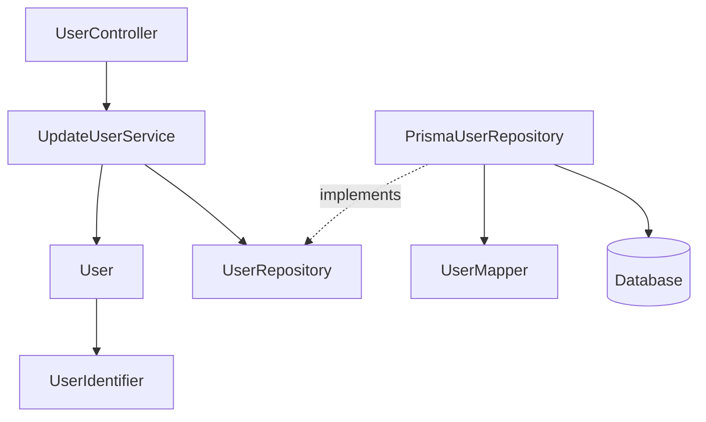

---

## Data Flow

### Fluxo: Atualizar Dados Básicos do Usuário

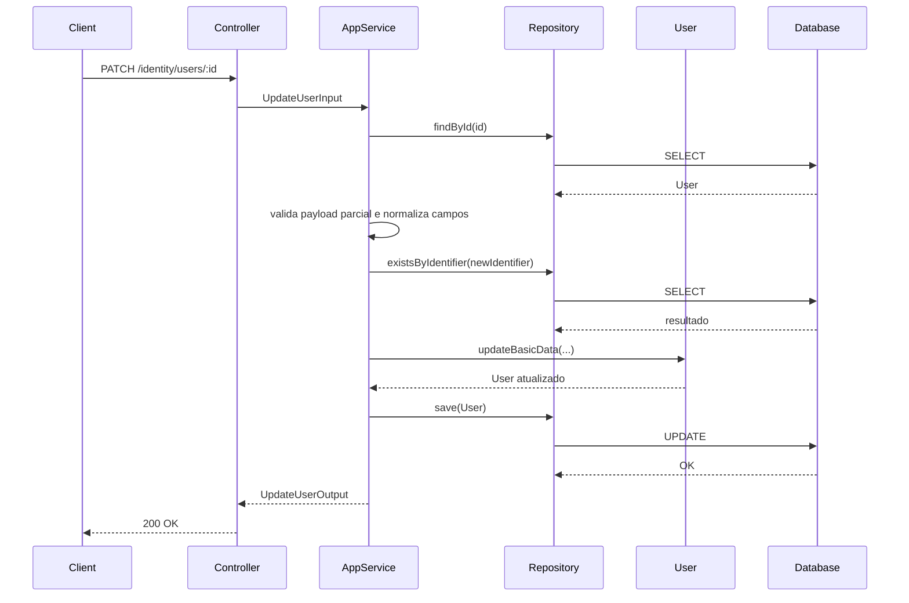

**Notas de validacao**

- Campos fornecidos vazios ou invalidos resultam em erro de validacao.
- Campos ausentes permanecem inalterados.

---

## Entity Structure (Reuso)

### User (recorte relevante)

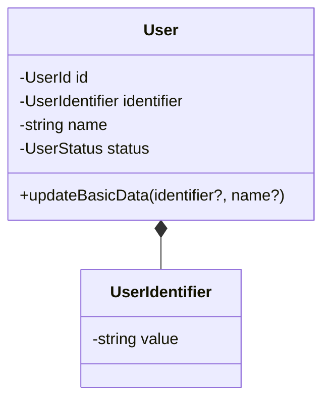

### Regras de Mutabilidade

| Campo | Mutável | Observações |
| --- | --- | --- |
| `id` | ❌ | Identidade técnica imutável |
| `identifier` | ✅ | Único, sem espaços, 3-120 chars, case-insensitive, email ou username |
| `name` | ✅ | 2-120 chars, não vazio |
| `status` | ❌ | Não alterado nesta capability |
| `credentials` | ❌ | Fora do escopo |
| `associations` | ❌ | Fora do escopo |

---

## Repository Operations

| Operação | Descrição | Usada por |
| --- | --- | --- |
| `findById(id)` | Busca identidade | UpdateUserService |
| `existsByIdentifier(identifier)` | Evita duplicidade (apenas se mudou) | UpdateUserService |
| `save(user)` | Persiste alterações | UpdateUserService |

---

## Database Model

📌 **Nenhuma alteração estrutural** em relação à tabela `users` definida em *Create User*.

Apenas operação `UPDATE`.

---

## API Endpoints

| Método | Path | Operação | Sucesso | Erros |
| --- | --- | --- | --- | --- |
| PATCH | `/identity/users/:id` | Atualizar identidade | 200 | 400, 404, 409 |

---

## Error Handling

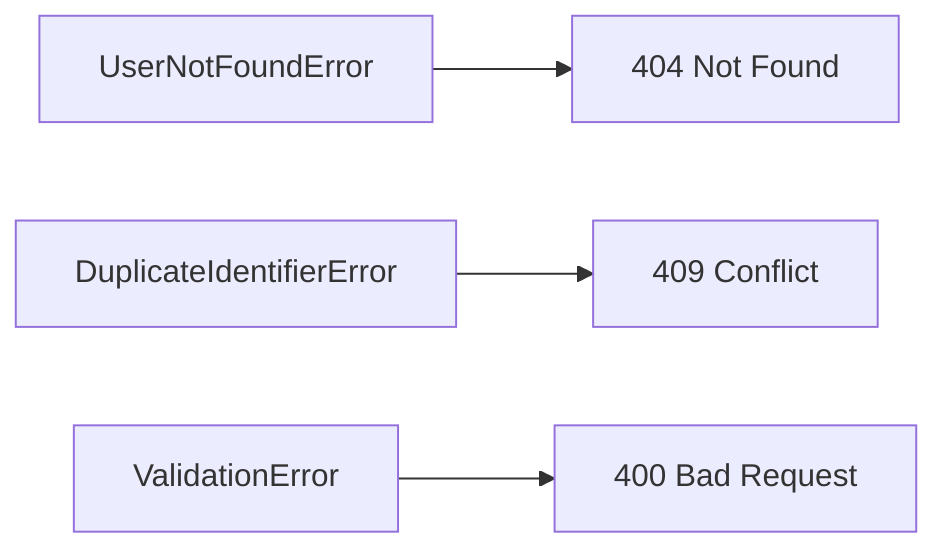

| Erro | Quando | HTTP | Code |
| --- | --- | --- | --- |
| UserNotFoundError | Usuário inexistente | 404 | `USER_NOT_FOUND` |
| DuplicateIdentifierError | Identifier duplicado | 409 | `IDENTIFIER_ALREADY_EXISTS` |
| ValidationError | Dados inválidos | 400 | `VALIDATION_ERROR` |

---

## Alignment Notes (Spec-Driven)

- Esta capability **não altera status**
- Esta capability **não cria nem altera credenciais**
- Esta capability **não concede nem revoga acesso**
- Toda regra vem diretamente do spec **Update User**

---

## Implementation Notes

- Reuso integral do aggregate `User`
- Método de domínio recomendado: `updateBasicData`
- Nenhum evento de domínio é emitido
- Dependency Injection reaproveita `UserRepository`

### spec
# Update User

**Created**: 2025-12-29

**Project**: `specs/project.md`

---

## User Stories

### User Story 1 — Atualizar dados básicos de uma identidade (P1)

Como **módulo interno**,

quero **atualizar os dados básicos de uma identidade de usuário existente**,

para manter as informações da identidade corretas e atualizadas ao longo do tempo.

**Por que P1**:

Informações de identidade podem mudar (nome, identificador lógico), e o sistema precisa refletir essas mudanças sem recriar usuários.

### Acceptance Criteria

```gherkin
Scenario: Atualizar dados básicos de um usuário existente
  Given que existe um usuário previamente criado
  And que o usuário possui uma identidade válida
  When o módulo interno solicita a atualização dos dados básicos
  Then os dados informados devem ser atualizados com sucesso
  And a identidade do usuário deve ser preservada

Scenario: Atualizar apenas parte dos dados
  Given que existe um usuário previamente criado
  When o módulo interno atualiza apenas um dos campos permitidos
  Then apenas o campo informado deve ser alterado
  And os demais dados devem permanecer inalterados

Scenario: Tentar atualizar com payload vazio
  Given que existe um usuário previamente criado
  When o módulo interno envia uma atualização sem campos válidos
  Then a operação deve ser rejeitada
  And o sistema deve informar erro de validação

Scenario: Tentar atualizar com campo inválido
  Given que existe um usuário previamente criado
  When o módulo interno informa um campo inválido ou vazio
  Then a operação deve ser rejeitada
  And o sistema deve informar erro de validação

Scenario: Tentar atualizar um usuário inexistente
  Given que não existe um usuário com o identificador informado
  When o módulo interno solicita a atualização dos dados
  Then a operação deve ser rejeitada
  And o sistema deve informar que a identidade não existe

```

---

### User Story 2 — Impedir atualização de dados sensíveis ao acesso (P1)

Como **sistema**,

quero **impedir que a atualização de identidade afete autenticação ou verificação de acesso**,

para garantir separação clara de responsabilidades dentro do módulo Identity.

**Por que P1**:

Misturar atualização de identidade com acesso ou autenticação introduz risco de segurança e acoplamento indevido.

### Acceptance Criteria

```gherkin
Scenario: Atualização não afeta autenticação nem verificação de acesso
  Given que um usuário existente possui credenciais e associações
  When os dados básicos da identidade são atualizados
  Then nenhuma credencial deve ser criada, alterada ou removida
  And nenhum acesso operacional deve ser concedido ou revogado

```

---

## Functional Requirements

- **FR-001**: O sistema **DEVE** permitir a atualização apenas de usuários previamente criados.
- **FR-002**: O sistema **DEVE** permitir a atualização de dados básicos da identidade.
- **FR-003**: O sistema **NÃO DEVE** permitir alteração do identificador técnico da identidade (`id`).
- **FR-004**: O sistema **DEVE** impedir a atualização para um identificador lógico já existente.
- **FR-005**: A atualização de um usuário **NÃO DEVE** criar, alterar ou remover credenciais de autenticação.
- **FR-006**: A atualização de um usuário **NÃO DEVE** conceder, revogar ou alterar acessos operacionais.
- **FR-007**: A atualização **NÃO DEVE** alterar o status administrativo do usuário.
- **FR-008**: O sistema **DEVE** preservar todas as associações existentes da identidade.
- **FR-009**: A atualização **DEVE** ser parcial: apenas campos presentes na solicitação são alterados.
- **FR-010**: Uma atualização sem campos válidos **DEVE** ser rejeitada.
- **FR-011**: `identifier` e `name` **DEVEM** seguir as mesmas regras de validação da criação.
- **FR-012**: A verificação de unicidade do `identifier` **NÃO DEVE** considerar o próprio usuário como duplicado.
- **FR-013**: Campos fornecidos com valor vazio ou inválido **DEVEM** resultar em erro de validação.
- **FR-014**: A atualização **NÃO DEVE** realizar validação de acesso do chamador, pois é uso interno do módulo.

---

## Entity

### User

| Campo | Descrição | Regras |
| --- | --- | --- |
| `id` | Identificador único da identidade | Imutável |
| `identifier` | Identificador lógico do usuário (email ou username) | Mutável, único, 3-120 chars, sem espaços, case-insensitive |
| `name` | Nome exibido do usuário | Mutável, 2-120 chars, não vazio |
| `status` | Estado administrativo da identidade | Imutável nesta capability |
| `createdAt` | Data de criação | Imutável |
| `updatedAt` | Data da última atualização | Atualizado automaticamente |

**Observações importantes**:

- Esta capability **atua apenas sobre dados de identidade**.
- Nenhum campo relacionado a:
    - autenticação
    - credenciais
    - tenants
    - business units
        
        é afetado por esta operação.
        

---

## Success Criteria

- **SC-001**: 100% das atualizações preservam o identificador técnico da identidade.
- **SC-002**: Nenhuma atualização altera autenticação ou autorização.
- **SC-003**: Atualizações inválidas (usuário inexistente ou identificador duplicado) são rejeitadas consistentemente.
- **SC-004**: Dados atualizados passam a refletir corretamente em consultas subsequentes.

---

## Glossary

| Termo | Definição |
| --- | --- |
| Update User | Atualização de dados básicos de uma identidade |
| Identidade | Representação única e persistente de um usuário |
| Dados Básicos | Informações não relacionadas a acesso ou autenticação |

---

## Summary

A capability **Update User** permite atualizar dados básicos de uma identidade existente, preservando completamente autenticação, autorizações e associações.

Ela existe para manter a identidade do usuário correta ao longo do tempo, sem introduzir efeitos colaterais no modelo de acesso do sistema.

### spec-validation
## Avaliacao da Spec: Update User

| Criterio | Nota | Observacao |
|----------|------|------------|
| Estrutura e Completude | 5/5 | Secoes completas e alinhadas ao template. |
| User Stories | 5/5 | Cobre atualizacao, parcial, payload vazio e invalido. |
| Edge Cases | 4/5 | Ainda nao define comportamento de null explicitamente. |
| Functional Requirements | 5/5 | Regras claras para atualizacao parcial e validacao. |
| Entity | 5/5 | Campos e regras bem definidos. |
| Success Criteria | 4/5 | Metricas claras e verificaveis. |
| Clareza | 5/5 | Texto consistente e objetivo. |
| Implementabilidade | 4/5 | Depende de decisao sobre null (rejeitar ou limpar). |
| **TOTAL** | 37/40 | |

## Veredicto

- [x] APROVADA - Pode avancar para design
- [ ] APROVADA COM RESSALVAS - Ajustes menores necessarios
- [ ] REPROVADA - Problemas bloqueantes

## Problemas Encontrados

1. Nao define comportamento para campos com valor `null` em update parcial. Sugestao: rejeitar `null` ou tratar como limpeza explicita.

## Pontos Fortes

1. Atualizacao parcial bem definida.
2. Regras de validacao alinhadas a criacao.

## Template de Referencia
Arquivo: `specs/templates/spec-template.md`

## 03-register-user-credentials

### design
# Register User Credentials

**Created**: 2025-12-29

**Spec**: `./spec.md`

**Project**: `../project.md`

---

## Overview

A capability **Register User Credentials** permite **registrar ou atualizar credenciais de autenticação** associadas a uma identidade existente.

Ela **não autentica**, **não emite token**, **não cria sessão** e **não concede acesso**.

Seu único papel é **persistir de forma segura os meios de autenticação** que poderão ser usados futuramente pela capability *Authenticate User*.
Esta capability é de uso interno, **não altera o status** da identidade e **não valida acesso** do chamador.

---

## Component Map

### Domain Layer

| Tipo | Nome | Responsabilidade |
| --- | --- | --- |
| Entity | `UserCredential` | Representa uma credencial de autenticação |
| Value Object | `CredentialId` | Identificador técnico da credencial |
| Value Object | `AuthMethod` | Método de autenticação (ex: PASSWORD, SSO) |
| Value Object | `LoginIdentifier` | Identificador de login (ex: email) |
| Value Object | `CredentialSecret` | Segredo protegido (hash) |
| Repository Interface | `UserCredentialRepository` | Persistência de credenciais |
| Repository Interface | `UserRepository` | Validação de identidade |

📌 **`User` NÃO é modificado nesta capability.**

---

### Application Layer

| Tipo | Nome | Responsabilidade |
| --- | --- | --- |
| App Service | `RegisterUserCredentialsService` | Orquestra registro/atualização |
| Input DTO | `RegisterUserCredentialsInput` | Dados para registro |
| Output DTO | `RegisterUserCredentialsOutput` | Confirmação da operação |

---

### Infrastructure Layer

| Tipo | Nome | Responsabilidade |
| --- | --- | --- |
| Repository Impl | `PrismaUserCredentialRepository` | Persistência |
| Mapper | `UserCredentialMapper` | Domain ↔ Prisma |
| Crypto Adapter | `CredentialHasher` | Hash do segredo (infra only) |

📌 **Algoritmo e lib não vazam para Domain nem Application.**

---

### Presentation Layer

| Tipo | Nome | Responsabilidade |
| --- | --- | --- |
| Controller | `UserCredentialController` | Endpoint administrativo |

---

## Dependency Graph

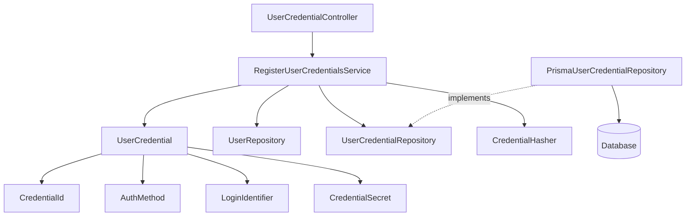

---

## Data Flow

### Fluxo: Registrar Credenciais

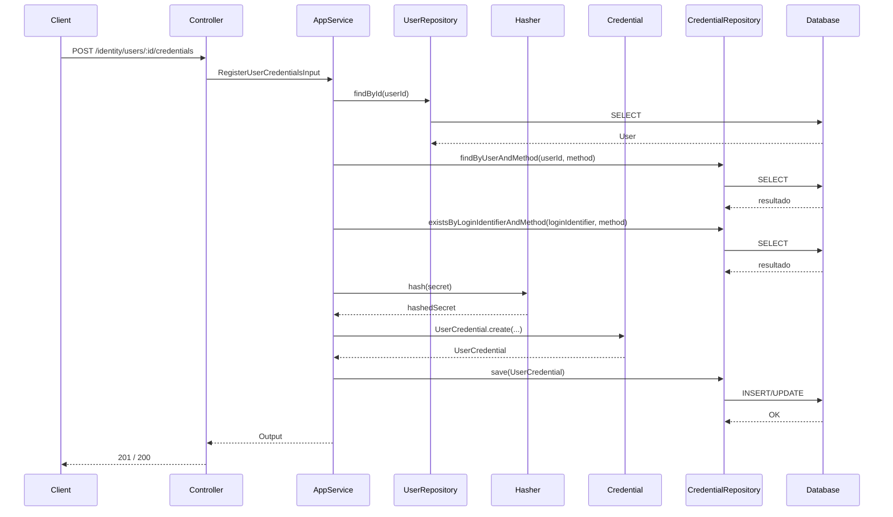

**Notas de fluxo**

- Registro: se já existir credencial para (`userId`, `authMethod`), rejeitar.
- Atualização: requer credencial existente para (`userId`, `authMethod`).
- `loginIdentifier` deve ser único por `authMethod` (case-insensitive).
- Atualização substitui apenas o `secret`.

---

## Entity Structure

### UserCredential

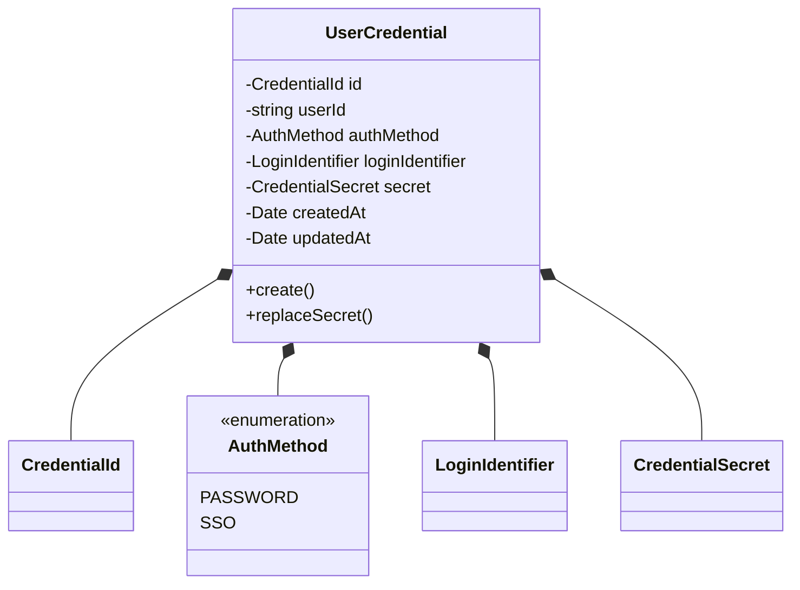

### Regras de Negócio

| Regra | Observação |
| --- | --- |
| 1 credencial por (`userId`, `authMethod`) | Imposta no domínio |
| Usuário pode estar `ACTIVE` ou `INACTIVE` | Validado no Application |
| Segredo nunca em texto plano | Infra faz hashing |
| `loginIdentifier` único por `authMethod` | Validado no Application |
| `loginIdentifier` normalizado | Trim + lowercase antes de validar unicidade |
| `loginIdentifier` igual ao `User.identifier` | Validado no Application |
| `secret` com politica minima | 8+ chars, 1 minuscula, 1 maiuscula, 1 numero, 1 especial |

---

## Repository Operations

| Operação | Descrição | Usada por |
| --- | --- | --- |
| `findByUserAndMethod(userId, method)` | Verifica existência | Service |
| `existsByLoginIdentifierAndMethod(loginIdentifier, method)` | Verifica unicidade | Service |
| `save(credential)` | Cria ou substitui | Service |

---

## Database Model

### Tabela: `user_credentials`

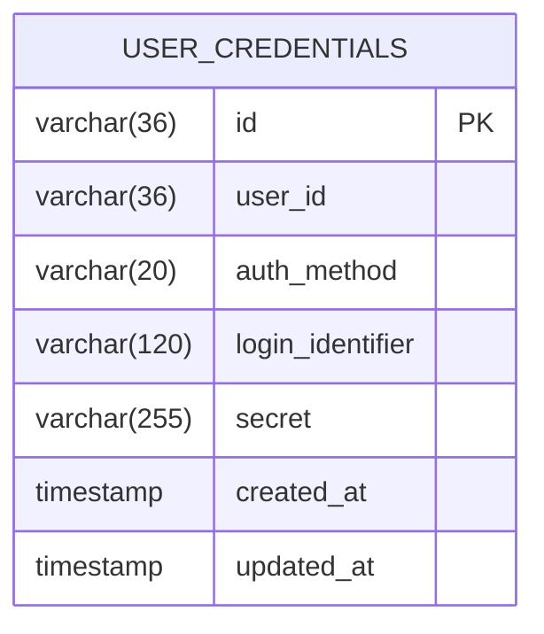

**Constraints importantes**

- UNIQUE (`user_id`, `auth_method`)
- UNIQUE (`login_identifier`, `auth_method`)
- FK `user_id → users.id`

---

## API Endpoints

| Método | Path | Operação | Sucesso | Erros |
| --- | --- | --- | --- | --- |
| POST | `/identity/users/:id/credentials` | Registrar | 201 | 400, 404, 409 |
| PUT | `/identity/users/:id/credentials/:method` | Atualizar | 200 | 400, 404 |

---

## Error Handling

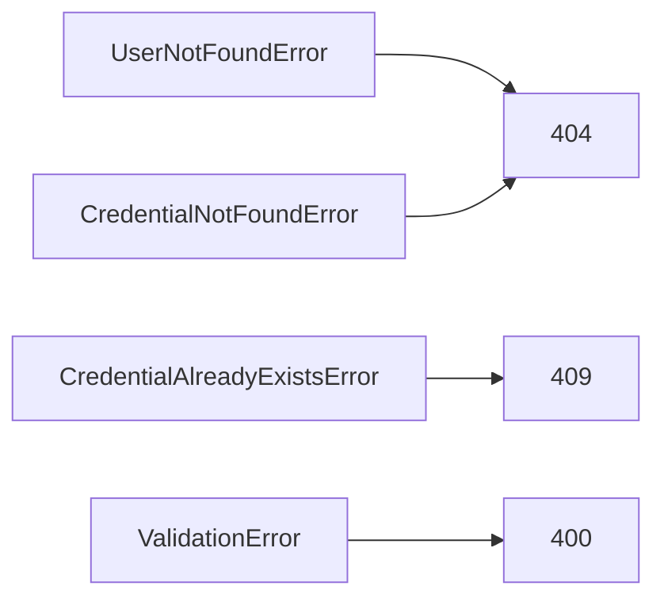

| Erro | Quando | Code |
| --- | --- | --- |
| UserNotFoundError | Usuário inexistente | `USER_NOT_FOUND` |
| CredentialAlreadyExistsError | Credencial já existente | `CREDENTIAL_ALREADY_EXISTS` |
| CredentialNotFoundError | Credencial inexistente | `CREDENTIAL_NOT_FOUND` |
| ValidationError | Dados inválidos | `VALIDATION_ERROR` |

---

## Alignment Notes (Spec-Driven)

- Esta capability **não autentica**
- Esta capability **não cria token**
- Esta capability **não cria sessão**
- Esta capability **não concede acesso**
- Segue integralmente o spec *Register User Credentials*

---

## Implementation Notes

- Hashing **exclusivamente na Infrastructure**
- Domain **nunca conhece segredo em claro**
- Application **orquestra, não decide algoritmo**
- Repositório garante unicidade (`userId`, `authMethod`) e (`loginIdentifier`, `authMethod`)
- Nenhuma dependência com autorização externa

### spec
# Register User Credentials

**Created**: 2025-12-29

**Project**: `specs/project.md`

---

## User Stories

### User Story 1 — Registrar credenciais para um usuário existente (P1)

Como **módulo interno**,

quero **registrar credenciais de autenticação para um usuário existente**,

para que essa identidade possa futuramente tentar se autenticar no sistema.

**Por que P1**:

Sem credenciais associadas, uma identidade existente não consegue realizar autenticação, mesmo estando ativa.

### Acceptance Criteria

```gherkin
Scenario: Registrar credenciais para um usuário existente
  Given que existe um usuário válido no sistema
  And que o usuário ainda não possui credenciais registradas para o método informado
  When é solicitado o registro de credenciais para esse usuário
  Then as credenciais devem ser registradas com sucesso
  And as credenciais devem ficar associadas ao usuário
  And o status do usuário não deve ser alterado
  And nenhuma autenticação ou sessão deve ser criada automaticamente

Scenario: Tentar registrar credenciais para um usuário inexistente
  Given que não existe um usuário com o identificador informado
  When é solicitado o registro de credenciais
  Then o registro deve ser rejeitado
  And o sistema deve informar que a identidade não existe

Scenario: Registrar credenciais para usuário INACTIVE
  Given que existe um usuário com status INACTIVE
  When é solicitado o registro de credenciais
  Then o registro deve ser realizado
  And o status do usuário deve permanecer INACTIVE

Scenario: Tentar registrar credenciais já existentes para o mesmo método
  Given que existe um usuário válido no sistema
  And que já existe credencial registrada para o método informado
  When é solicitado o registro de credenciais para esse usuário
  Then o registro deve ser rejeitado
  And o sistema deve informar que já existe credencial para o método

Scenario: Tentar registrar credenciais com segredo fraco
  Given que existe um usuário válido no sistema
  When é solicitado o registro de credenciais com segredo inválido
  Then o registro deve ser rejeitado
  And o sistema deve informar erro de validação

```

---

### User Story 2 — Atualizar credenciais existentes (P2)

Como **módulo interno**,

quero **atualizar credenciais de autenticação existentes**,

para permitir troca de segredo, recuperação de acesso ou mudança controlada de método de login.

**Por que P2**:

Credenciais precisam ser rotacionáveis ao longo do tempo sem recriar identidades.

### Acceptance Criteria

```gherkin
Scenario: Atualizar credenciais existentes
  Given que existe um usuário válido no sistema
  And que o usuário possui credenciais previamente registradas para um método específico
  When é solicitada a atualização das credenciais desse método
  Then as credenciais anteriores do mesmo método devem ser substituídas
  And apenas as novas credenciais devem ser consideradas válidas
  And nenhuma autenticação ou sessão deve ser criada automaticamente
  And o identificador de login deve ser preservado
  And o status do usuário não deve ser alterado

Scenario: Tentar atualizar credenciais inexistentes
  Given que existe um usuário válido no sistema
  And que o usuário não possui credenciais registradas para o método informado
  When é solicitada a atualização das credenciais desse método
  Then a atualização deve ser rejeitada
  And o sistema deve informar que não há credenciais para o método

```

---

## Functional Requirements

- **FR-001**: O sistema **DEVE** permitir o registro de credenciais apenas para usuários previamente criados.
- **FR-002**: O sistema **DEVE** associar cada credencial a exatamente um usuário.
- **FR-003**: O sistema **NÃO DEVE** autenticar o usuário automaticamente após o registro ou atualização de credenciais.
- **FR-004**: O sistema **DEVE** permitir a atualização de credenciais existentes.
- **FR-005**: O sistema **DEVE** garantir que exista no máximo uma credencial por usuário para cada método de autenticação.
- **FR-006**: O sistema **PODE** suportar múltiplos métodos de autenticação por usuário (ex: senha, link, SSO).
- **FR-007**: O registro ou atualização de credenciais **NÃO DEVE** criar sessão, token ou estado autenticado.
- **FR-008**: O registro e a atualização **DEVEM** ser permitidos para usuários `INACTIVE` e `ACTIVE`.
- **FR-009**: O `loginIdentifier` **DEVE** ser único no sistema para cada `authMethod` (case-insensitive).
- **FR-010**: O `loginIdentifier` **DEVE** ter entre 3 e 120 caracteres e **NÃO DEVE** conter espaços.
- **FR-011**: O `authMethod` **DEVE** pertencer ao catálogo de métodos habilitados (`PASSWORD`, `SSO`).
- **FR-012**: O registro **DEVE** ser rejeitado quando já existir credencial para o mesmo método.
- **FR-013**: A atualização **DEVE** ser rejeitada quando não existir credencial para o método informado.
- **FR-014**: O `loginIdentifier` **DEVE** ser o mesmo identificador lógico do usuário.
- **FR-015**: A atualização de credenciais **DEVE** substituir apenas o `secret`, mantendo `loginIdentifier` e `authMethod`.
- **FR-016**: O `secret` **DEVE** ter no mínimo 8 caracteres e conter ao menos 1 letra minuscula, 1 letra maiuscula, 1 numero e 1 caractere especial.
- **FR-017**: O registro ou atualização de credenciais **NÃO DEVE** alterar o status do usuário.

---

## Entity

### UserCredential

| Campo | Descrição | Regras |
| --- | --- | --- |
| `id` | Identificador único da credencial | Obrigatório, único |
| `userId` | Referência à identidade do usuário | Obrigatório |
| `authMethod` | Método de autenticação | Obrigatório, valores controlados |
| `loginIdentifier` | Identificador de login (email ou username do usuario) | Obrigatório, único por método, case-insensitive, sem espaços |
| `secret` | Segredo de autenticação | Obrigatório |
| `createdAt` | Data de criação | Obrigatório |
| `updatedAt` | Data da última atualização | Opcional |

**Relacionamentos**:

- Um usuário **PODE** possuir múltiplas credenciais, desde que cada uma seja de um método distinto.
- Cada credencial **DEVE** pertencer a exatamente um usuário.
- Para cada par (`userId`, `authMethod`), **DEVE existir no máximo uma credencial ativa**.
- Para cada par (`loginIdentifier`, `authMethod`), **DEVE existir no máximo uma credencial ativa**.

---

## Success Criteria

- **SC-001**: 100% das credenciais registradas estão associadas a usuários válidos.
- **SC-002**: Credenciais duplicadas para o mesmo método não são aceitas.
- **SC-003**: Atualizações de credenciais substituem completamente as credenciais anteriores do mesmo método.
- **SC-004**: Nenhum registro ou atualização de credencial gera autenticação implícita.

---

## Glossary

| Termo | Definição |
| --- | --- |
| Credencial | Conjunto de dados usado para autenticar uma identidade |
| Método de Autenticação | Forma pela qual a identidade prova quem é |
| Identificador de Login | Dado utilizado no processo de autenticação |

---

## Summary

A capability **Register User Credentials** permite registrar e atualizar os meios pelos quais uma identidade pode se autenticar no sistema.

Ela separa claramente identidade de autenticação, garantindo segurança, controle explícito e evolução futura do modelo de acesso sem efeitos colaterais.
Credenciais válidas são **pré-requisito para ativação** da identidade.

### spec-validation
## Avaliacao da Spec: Register User Credentials

| Criterio | Nota | Observacao |
|----------|------|------------|
| Estrutura e Completude | 5/5 | Secoes completas e alinhadas ao template. |
| User Stories | 5/5 | Cobre registro, atualizacao, duplicidade, inativo e segredo fraco. |
| Edge Cases | 4/5 | Politica de troca de loginIdentifier ja definida como proibida. |
| Functional Requirements | 5/5 | Regras claras de unicidade, metodos e politica de segredo. |
| Entity | 5/5 | Campos e regras bem definidos. |
| Success Criteria | 4/5 | Metricas claras; pode incluir rejeicao por segredo fraco. |
| Clareza | 5/5 | Texto consistente e objetivo. |
| Implementabilidade | 5/5 | Implementavel sem ambiguidades. |
| **TOTAL** | 39/40 | |

## Veredicto

- [x] APROVADA - Pode avancar para design
- [ ] APROVADA COM RESSALVAS - Ajustes menores necessarios
- [ ] REPROVADA - Problemas bloqueantes

## Problemas Encontrados

1. Nao ha problemas bloqueantes identificados.

## Pontos Fortes

1. Politica de segredo bem definida.
2. Unicidade e fluxo de update claramente especificados.

## Template de Referencia
Arquivo: `specs/templates/spec-template.md`

## 04-activate-deactivate-user

### design
# Activate / Deactivate User

**Created**: 2025-12-29

**Spec**: `./spec.md`

**Project**: `../project.md`

---

## Overview

A capability **Activate / Deactivate User** controla o **estado administrativo** de uma identidade existente, determinando se ela **pode ou não tentar se autenticar** no sistema.

Ela atua exclusivamente sobre o atributo `status` da entity `User`, preservando integralmente:

- identidade técnica
- dados básicos
- credenciais
- verificações de acesso
- associações externas

O fluxo segue **Presentation → Application → Domain → Infrastructure**, reutilizando o aggregate `User`.
Para ativação, a Application **valida a existência de credenciais válidas** antes de alterar o status.
Esta capability é de uso interno e **não realiza validação de acesso** do chamador.

---

## Component Map

### Domain Layer

| Tipo | Nome | Responsabilidade |
| --- | --- | --- |
| Entity | `User` | Aggregate de identidade |
| Value Object | `UserStatus` | Estado administrativo (`ACTIVE`, `INACTIVE`) |
| Repository Interface | `UserRepository` | Acesso à identidade |
| Repository Interface | `UserCredentialRepository` | Verificação de credenciais válidas |

📌 **Nenhuma nova entity é criada.**

---

### Application Layer

| Tipo | Nome | Responsabilidade |
| --- | --- | --- |
| App Service | `ActivateUserService` | Ativa uma identidade |
| App Service | `DeactivateUserService` | Desativa uma identidade |
| Input DTO | `ChangeUserStatusInput` | Identifica a identidade alvo |
| Output DTO | `ChangeUserStatusOutput` | Retorno do novo estado |

---

### Infrastructure Layer

| Tipo | Nome | Responsabilidade |
| --- | --- | --- |
| Repository Impl | `PrismaUserRepository` | Persistência da identidade |
| Repository Impl | `PrismaUserCredentialRepository` | Consulta de credenciais |
| Mapper | `UserMapper` | Domain ↔ Prisma |

---

### Presentation Layer

| Tipo | Nome | Responsabilidade |
| --- | --- | --- |
| Controller | `UserController` | Endpoints administrativos de status |

---

## Dependency Graph

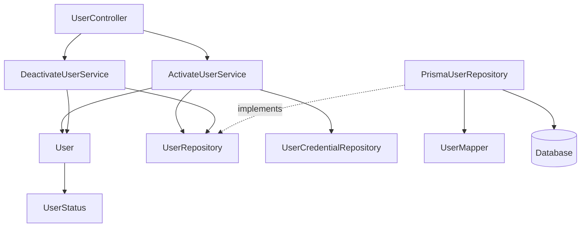

---

## Data Flow

### Fluxo: Ativar Usuário

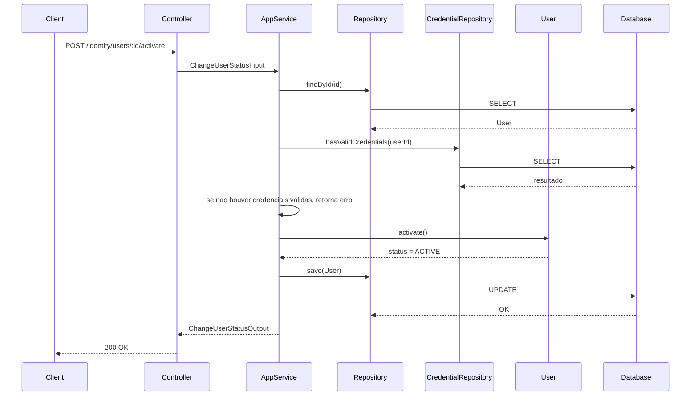

**Notas de resposta**

- Operacoes idempotentes retornam sucesso e indicam que nenhuma alteracao foi necessaria.

---

### Fluxo: Desativar Usuário

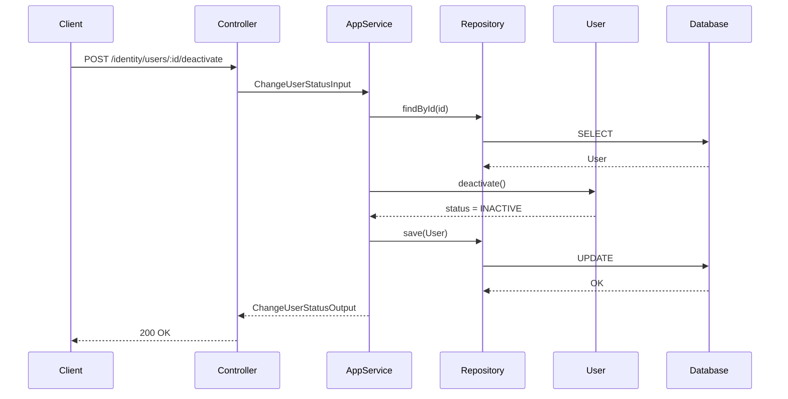

---

## Entity Structure (Reuso + Comportamento)

### User (recorte relevante)

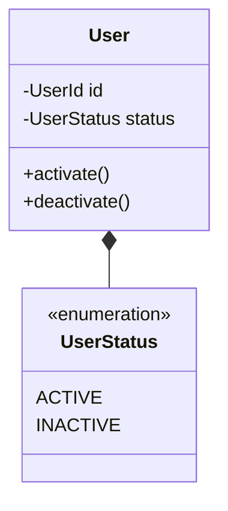

### Regras de Comportamento

| Método | Regra |
| --- | --- |
| `activate()` | Se já ACTIVE, operação idempotente |
| `deactivate()` | Se já INACTIVE, operação idempotente |
| `status` | Única alteração permitida nesta capability |

---

## Repository Operations

| Operação | Descrição | Usada por |
| --- | --- | --- |
| `findById(id)` | Busca identidade | Activate/Deactivate |
| `hasValidCredentials(userId)` | Verifica credenciais válidas | Activate |
| `save(user)` | Persiste status | Activate/Deactivate |

---

## Database Model

📌 **Nenhuma alteração estrutural** na tabela `users`.

Apenas atualização do campo `status` e `updated_at`.

---

## API Endpoints

| Método | Path | Operação | Sucesso | Erros |
| --- | --- | --- | --- | --- |
| POST | `/identity/users/:id/activate` | Ativar usuário | 200 | 404, 409 |
| POST | `/identity/users/:id/deactivate` | Desativar usuário | 200 | 404 |

---

## Error Handling

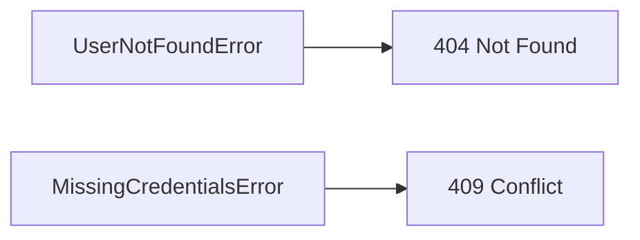

| Erro | Quando | HTTP | Code |
| --- | --- | --- | --- |
| UserNotFoundError | Usuário inexistente | 404 | `USER_NOT_FOUND` |
| MissingCredentialsError | Usuário sem credenciais válidas | 409 | `USER_MISSING_CREDENTIALS` |

📌 Operações são **idempotentes** — não geram erro se o status já estiver no valor desejado.

---

## Alignment Notes (Spec-Driven)

- Esta capability **não cria nem altera credenciais**
- Esta capability **não autentica usuários**
- Esta capability **não concede nem revoga acessos operacionais**
- O status **apenas controla a possibilidade futura de autenticação**
- Toda regra vem diretamente do spec *Activate / Deactivate User*

---

## Implementation Notes

- Reuso total do aggregate `User`
- Métodos de domínio explícitos: `activate()` e `deactivate()`
- Nenhum evento de domínio é emitido
- Nenhuma integração com autorização externa
- Dependency Injection reaproveita `UserRepository`

### spec
# Activate / Deactivate User

**Created**: 2025-12-29

**Project**: `specs/project.md`

---

## User Stories

### User Story 1 — Ativar um usuário existente (P1)

Como **módulo interno**,

quero **ativar um usuário existente**,

para permitir que ele **possa tentar se autenticar** no sistema.

**Por que P1**:

Sem ativação explícita, o sistema não consegue controlar quais identidades estão autorizadas a tentar autenticação.

### Acceptance Criteria

```gherkin
Scenario: Ativar um usuário inativo
  Given que existe um usuário com status INACTIVE
  And que o usuário possui credenciais válidas registradas
  When o módulo interno solicita a ativação do usuário
  Then o status do usuário deve ser alterado para ACTIVE
  And o usuário passa a estar apto a tentar autenticação

Scenario: Tentar ativar um usuário já ativo
  Given que existe um usuário com status ACTIVE
  When o módulo interno solicita a ativação do usuário
  Then nenhuma alteração deve ser realizada
  And o sistema deve manter o status atual
  And o sistema deve informar que nenhuma alteração foi necessária

Scenario: Tentar ativar um usuário inexistente
  Given que não existe um usuário com o identificador informado
  When o módulo interno solicita a ativação do usuário
  Then a operação deve ser rejeitada
  And o sistema deve informar que a identidade não existe

Scenario: Tentar ativar usuário sem credenciais válidas
  Given que existe um usuário com status INACTIVE
  And que o usuário não possui credenciais válidas registradas
  When o módulo interno solicita a ativação do usuário
  Then a operação deve ser rejeitada
  And o sistema deve informar que a identidade não possui credenciais válidas

```

---

### User Story 2 — Desativar um usuário existente (P1)

Como **módulo interno**,

quero **desativar um usuário existente**,

para impedir imediatamente que ele tente se autenticar no sistema.

**Por que P1**:

A desativação é um mecanismo crítico de segurança e controle administrativo.

### Acceptance Criteria

```gherkin
Scenario: Desativar um usuário ativo
  Given que existe um usuário com status ACTIVE
  When o módulo interno solicita a desativação do usuário
  Then o status do usuário deve ser alterado para INACTIVE
  And qualquer tentativa futura de autenticação deve ser negada

Scenario: Tentar desativar um usuário já inativo
  Given que existe um usuário com status INACTIVE
  When o módulo interno solicita a desativação do usuário
  Then nenhuma alteração deve ser realizada
  And o status do usuário deve ser mantido
  And o sistema deve informar que nenhuma alteração foi necessária

Scenario: Tentar desativar um usuário inexistente
  Given que não existe um usuário com o identificador informado
  When o módulo interno solicita a desativação do usuário
  Then a operação deve ser rejeitada
  And o sistema deve informar que a identidade não existe

```

---

## Functional Requirements

- **FR-001**: O sistema **DEVE** permitir ativar apenas usuários previamente criados.
- **FR-002**: O sistema **DEVE** permitir desativar apenas usuários previamente criados.
- **FR-003**: Um usuário com status `INACTIVE` **NÃO DEVE** conseguir se autenticar.
- **FR-004**: Um usuário **SÓ PODE** ser ativado se possuir pelo menos uma credencial válida registrada.
- **FR-005**: Um usuário com status `ACTIVE` **PODE** tentar se autenticar, desde que possua credenciais válidas.
- **FR-006**: A ativação ou desativação de um usuário **NÃO DEVE** criar, alterar ou remover credenciais.
- **FR-007**: A ativação ou desativação **NÃO DEVE** conceder, revogar ou alterar acessos operacionais.
- **FR-008**: O sistema **DEVE** preservar todos os vínculos e históricos do usuário ao desativá-lo.
- **FR-009**: O status do usuário **NÃO DEVE** ser interpretado como concessão de acesso operacional.
- **FR-010**: A ativação e a desativação **DEVEM** ser operações idempotentes.
- **FR-011**: A operação **DEVE** ser rejeitada quando o usuário não existir.

---

## Entity

### User

| Campo | Descrição | Regras |
| --- | --- | --- |
| `id` | Identificador único da identidade | Obrigatório, único |
| `status` | Estado administrativo da identidade | Valores permitidos: `ACTIVE`, `INACTIVE` |
| `updatedAt` | Data da última alteração de status | Obrigatório |

**Relacionamentos**:

- Um usuário **PODE** possuir credenciais, independentemente do status.
- Um usuário **PODE** manter associações com tenants e business units mesmo quando inativo.

---

## Success Criteria

- **SC-001**: Usuários desativados não conseguem autenticar em 100% dos casos.
- **SC-002**: Ativações e desativações não afetam credenciais ou autorizações.
- **SC-003**: Identidade, associações e histórico do usuário são preservados após desativação.
- **SC-004**: Ativações sem credenciais válidas são rejeitadas de forma consistente.

---

## Glossary

| Termo | Definição |
| --- | --- |
| Usuário Ativo | Identidade autorizada a tentar autenticação |
| Usuário Inativo | Identidade impedida de tentar autenticação |
| Ativação | Ato administrativo de habilitar uma identidade |

---

## Summary

A capability **Activate / Deactivate User** controla o estado administrativo de uma identidade, determinando se ela pode ou não tentar se autenticar no sistema.

Ela garante controle e segurança sem afetar identidade, credenciais, autorizações ou associações existentes.

### spec-validation
## Avaliacao da Spec: Activate / Deactivate User

| Criterio | Nota | Observacao |
|----------|------|------------|
| Estrutura e Completude | 5/5 | Secoes completas e alinhadas ao template. |
| User Stories | 5/5 | Cobre ativar, desativar, inexistente e idempotencia. |
| Edge Cases | 4/5 | Falta detalhar payload/retorno da resposta. |
| Functional Requirements | 5/5 | Regras claras de status e idempotencia. |
| Entity | 4/5 | Campos essenciais definidos. |
| Success Criteria | 4/5 | Metricas claras e verificaveis. |
| Clareza | 5/5 | Texto direto e consistente. |
| Implementabilidade | 4/5 | Retorno idempotente pode ser formalizado. |
| **TOTAL** | 36/40 | |

## Veredicto

- [x] APROVADA - Pode avancar para design
- [ ] APROVADA COM RESSALVAS - Ajustes menores necessarios
- [ ] REPROVADA - Problemas bloqueantes

## Problemas Encontrados

1. Contrato de resposta para idempotencia nao esta formalizado. Sugestao: definir campo de resposta indicando nenhuma alteracao.

## Pontos Fortes

1. Regras de seguranca e status bem definidas.
2. Idempotencia e comportamento para inexistente claros.

## Template de Referencia
Arquivo: `specs/templates/spec-template.md`

## 05-authenticate-user

### design
# Authenticate User

**Created**: 2025-12-29

**Spec**: `./spec.md`

**Project**: `../project.md`

---

## Overview

A capability **Authenticate User** autentica uma identidade **ativa** a partir de credenciais previamente registradas e, em caso de sucesso, **emite um token de autenticação**.

Ela **não interpreta autorização**, **não carrega regras de acesso**, **não decide comportamento de negócio** e **não mantém estado de sessão** além do token emitido.

O fluxo segue **Presentation → Application → Domain → Infrastructure**, com decisões criptográficas e de token **isoladas na Infrastructure**.

---

## Component Map

### Domain Layer

| Tipo | Nome | Responsabilidade |
| --- | --- | --- |
| Entity | `AuthenticationToken` | Representa um token emitido |
| Value Object | `AuthTokenId` | Identificador do token |
| Value Object | `TokenExpiration` | Expiração do token |
| Repository Interface | `UserRepository` | Consulta de identidade |
| Repository Interface | `UserCredentialRepository` | Consulta de credenciais |

📌 O Domain **não valida segredo** e **não conhece algoritmo criptográfico**.

---

### Application Layer

| Tipo | Nome | Responsabilidade |
| --- | --- | --- |
| App Service | `AuthenticateUserService` | Orquestra a autenticação |
| Input DTO | `AuthenticateUserInput` | Dados fornecidos pelo usuário |
| Output DTO | `AuthenticateUserOutput` | Token emitido |

---

### Infrastructure Layer

| Tipo | Nome | Responsabilidade |
| --- | --- | --- |
| Credential Verifier | `CredentialVerifier` | Valida segredo (hash compare) |
| Token Generator | `AuthTokenGenerator` | Gera token assinado |
| Clock Adapter | `SystemClock` | Fonte de tempo |
| Repository Impl | `PrismaUserCredentialRepository` | Persistência |
| Repository Impl | `PrismaUserRepository` | Persistência |

📌 JWT, libs crypto e formato do token **vivem aqui**.

---

### Presentation Layer

| Tipo | Nome | Responsabilidade |
| --- | --- | --- |
| Controller | `AuthenticationController` | Endpoint de login |

---

## Dependency Graph

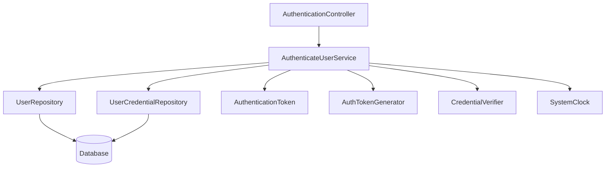

---

## Data Flow

### Fluxo: Autenticar Usuário

```mermaid
sequenceDiagram
    participant Client
    participant Controller
    participant AppService
    participant UserRepo
    participant CredentialRepo
    participant Verifier
    participant TokenGen
    participant Database

    Client->>Controller: POST /identity/authenticate
    Controller->>AppService: AuthenticateUserInput

    AppService->>CredentialRepo: findByIdentifierAndMethod(identifier, method)
    CredentialRepo->>Database: SELECT
    Database-->>CredentialRepo: Credential

    AppService->>UserRepo: findById(userId)
    UserRepo->>Database: SELECT
    Database-->>UserRepo: User

    AppService->>AppService: valida status == ACTIVE

    AppService->>Verifier: verify(inputSecret, storedHash)
    Verifier-->>AppService: valid | invalid

    AppService->>TokenGen: generate(userId, issuedAt, expiresAt)
    TokenGen-->>AppService: token

    AppService-->>Controller: AuthenticateUserOutput
    Controller-->>Client: 200 OK (token)

```

---

## Entity Structure

### AuthenticationToken

```mermaid
classDiagram
    class AuthenticationToken {
        -AuthTokenId id
        -string userId
        -Date issuedAt
        -Date expiresAt
    }

    class AuthTokenId {
        -string value
    }

    AuthenticationToken *-- AuthTokenId

```

📌 O token **não carrega regras de acesso**.

---

## Repository Operations

| Operação | Descrição | Usada por |
| --- | --- | --- |
| `findByIdentifierAndMethod(identifier, method)` | Localiza credencial | AuthenticateUserService |
| `findById(userId)` | Localiza identidade | AuthenticateUserService |

---

## API Endpoints

| Método | Path | Operação | Sucesso | Erros |
| --- | --- | --- | --- | --- |
| POST | `/identity/authenticate` | Autenticar | 200 | 401, 403, 404 |

---

## Error Handling

```mermaid
flowchart LR
    NF[UserNotFoundError] --> H404[404]
    INACTIVE[UserInactiveError] --> H403[403]
    CRED[InvalidCredentialError] --> H401[401]
    CNF[CredentialNotFoundError] --> H401[401]

```

| Erro | Quando | Code |
| --- | --- | --- |
| UserNotFoundError | Identidade inexistente | `USER_NOT_FOUND` |
| UserInactiveError | Usuário INACTIVE | `USER_INACTIVE` |
| InvalidCredentialError | Segredo inválido | `INVALID_CREDENTIAL` |
| CredentialNotFoundError | Credencial inexistente | `CREDENTIAL_NOT_FOUND` |

📌 Todos os erros **negam autenticação** e **não retornam token**.

---

## Alignment Notes (Spec-Driven)

- Autenticação **exige usuário ACTIVE**
- Credenciais inválidas **sempre negam**
- Token **não implica autorização**
- Nenhuma regra de acesso é resolvida aqui
- Nenhum estado de sessão é criado

---

## Implementation Notes

- Verificação de segredo **isolada na Infrastructure**
- Token é **opaco para módulos consumidores**
- Clock injetado para testes determinísticos
- Nenhum cache de autenticação
- Nenhum acoplamento com autorização externa
- `identifier` normalizado (trim + lowercase) antes da busca
- `identifier` validado como email ou username antes da busca

### spec
# Authenticate User

**Created**: 2025-12-29

**Project**: `specs/project.md`

## User Stories

### User Story 1 — Autenticar usuário ativo com credenciais válidas (P1)

Como **usuário**,

quero **me autenticar utilizando minhas credenciais**,

para que o sistema **possa identificar minha identidade de forma segura**.

**Por que P1**:

Sem autenticação, o sistema não consegue identificar a identidade nem iniciar fluxos protegidos.

### Acceptance Criteria

```gherkin
Scenario: Autenticar usuário ativo com credenciais válidas
  Given que existe um usuário com status ACTIVE
  And que o usuário possui credenciais válidas registradas
  When o usuário fornece credenciais corretas
  Then a autenticação deve ser realizada com sucesso
  And um token de autenticação deve ser emitido

```

---

### User Story 2 — Negar autenticação para usuário inativo (P1)

Como **sistema**,

quero **impedir autenticação de usuários inativos**,

para garantir controle administrativo e segurança.

**Por que P1**:

Usuários inativos não devem conseguir iniciar processos de autenticação.

### Acceptance Criteria

```gherkin
Scenario: Tentar autenticar usuário inativo
  Given que existe um usuário com status INACTIVE
  And que o usuário possui credenciais registradas
  When o usuário tenta se autenticar
  Then a autenticação deve ser negada
  And nenhum token deve ser emitido

```

---

### User Story 3 — Negar autenticação com credenciais inválidas (P1)

Como **sistema**,

quero **negar autenticação quando as credenciais forem inválidas**,

para evitar acesso não autorizado.

**Por que P1**:

Esse é o controle fundamental de segurança do processo de autenticação.

### Acceptance Criteria

```gherkin
Scenario: Tentar autenticar com credenciais inválidas
  Given que existe um usuário com status ACTIVE
  And que o usuário possui credenciais registradas
  When o usuário fornece credenciais incorretas
  Then a autenticação deve ser negada
  And nenhum token deve ser emitido

Scenario: Tentar autenticar com usuário inexistente
  Given que não existe uma identidade correspondente ao identificador informado
  When o usuário tenta se autenticar
  Then a autenticação deve ser negada
  And nenhum token deve ser emitido

Scenario: Tentar autenticar sem credenciais para o método informado
  Given que existe um usuário com status ACTIVE
  And que o usuário não possui credenciais registradas para o método informado
  When o usuário tenta se autenticar
  Then a autenticação deve ser negada
  And nenhum token deve ser emitido

```

---

## Functional Requirements

- **FR-001**: O sistema **DEVE** permitir autenticação apenas para usuários existentes.
- **FR-002**: O sistema **DEVE** permitir autenticação apenas para usuários com status `ACTIVE`.
- **FR-003**: O sistema **DEVE** validar as credenciais fornecidas durante a autenticação.
- **FR-004**: O sistema **NÃO DEVE** autenticar usuários com credenciais inválidas.
- **FR-005**: O sistema **DEVE** emitir um token de autenticação quando a autenticação for bem-sucedida.
- **FR-006**: O sistema **NÃO DEVE** conceder autorizações ou acessos operacionais durante a autenticação.
- **FR-007**: O token emitido **DEVE** identificar unicamente a identidade autenticada.
- **FR-008**: O sistema **PODE** aplicar políticas adicionais de segurança durante a autenticação (ex: limitação de tentativas, bloqueios temporários).
- **FR-009**: A autenticação **NÃO DEVE** resolver, inferir ou carregar contexto de autorização.
- **FR-010**: A autenticação **DEVE** receber `identifier`, `authMethod` e `secret` como dados de entrada.
- **FR-011**: O `authMethod` **DEVE** pertencer ao catálogo de métodos habilitados (`PASSWORD`, `SSO`).
- **FR-012**: O `identifier` **DEVE** ser tratado como case-insensitive e seguir as regras de validação de credenciais.
- **FR-013**: O token **DEVE** expirar conforme política de expiração definida pelo contexto Identity, seguindo o padrão de segurança vigente.
- **FR-014**: O `identifier` **DEVE** seguir o padrão de **email** ou **username**.

---

## Entity

### AuthenticationToken

| Campo | Descrição | Regras |
| --- | --- | --- |
| `id` | Identificador único do token | Obrigatório, único |
| `userId` | Identificador da identidade autenticada | Obrigatório |
| `issuedAt` | Data de emissão do token | Obrigatório |
| `expiresAt` | Data de expiração do token | Obrigatório |

**Relacionamentos**:

- Um token **DEVE** estar associado a exatamente uma identidade.
- Uma identidade **PODE** possuir múltiplos tokens válidos simultaneamente.

---

## Success Criteria

- **SC-001**: 100% das autenticações bem-sucedidas resultam na emissão de um token válido.
- **SC-002**: Usuários inativos não conseguem autenticar em 100% dos casos.
- **SC-003**: Credenciais inválidas nunca resultam em token emitido.
- **SC-004**: Autenticação não concede acesso operacional implícito.

---

## Glossary

| Termo | Definição |
| --- | --- |
| Autenticação | Processo de verificação da identidade |
| Token de Autenticação | Artefato emitido após autenticação bem-sucedida |
| Credencial | Informação usada para provar identidade |

---

## Summary

A capability **Authenticate User** valida as credenciais de uma identidade ativa e emite um token de autenticação.

Ela existe exclusivamente para identificação segura da identidade, mantendo separação rigorosa entre autenticação, autorização e acesso operacional.

### spec-validation
## Avaliacao da Spec: Authenticate User

| Criterio | Nota | Observacao |
|----------|------|------------|
| Estrutura e Completude | 5/5 | Secoes completas e alinhadas ao template. |
| User Stories | 5/5 | Cobre sucesso, inativo, invalido, inexistente e credencial ausente. |
| Edge Cases | 4/5 | Politica de indistinguibilidade de erros nao definida. |
| Functional Requirements | 4/5 | Expiracao definida como politica vigente, sem valor. |
| Entity | 4/5 | Token definido com campos essenciais. |
| Success Criteria | 4/5 | Metricas claras e verificaveis. |
| Clareza | 4/5 | Boa clareza, com politica de expiracao generica. |
| Implementabilidade | 4/5 | Implementavel; depende da politica vigente. |
| **TOTAL** | 34/40 | |

## Veredicto

- [x] APROVADA - Pode avancar para design
- [ ] APROVADA COM RESSALVAS - Ajustes menores necessarios
- [ ] REPROVADA - Problemas bloqueantes

## Problemas Encontrados

1. Politica de expiracao nao tem valor padrao definido. Sugestao: definir valor ou documento de referencia.
2. Nao explicita se erros de credencial devem ser indistinguiveis para o cliente. Sugestao: declarar regra de seguranca.

## Pontos Fortes

1. Fluxos negativos completos.
2. Separacao entre autenticacao e autorizacao clara.

## Template de Referencia
Arquivo: `specs/templates/spec-template.md`

## 06-authorize-action

### design
# Authorize Access (verify identity)

**Created**: 2025-12-29

**Spec**: `./spec.md`

**Project**: `../project.md`

---

## Overview

A capability **Authorize Access** valida um token e confirma se ele representa uma identidade existente e ativa.

Ela **não avalia regras de acesso**, **não interpreta domínio**, **não emite tokens** e **não mantém estado**.

---

## Component Map

### Domain Layer

| Tipo | Nome | Responsabilidade |
| --- | --- | --- |
| Entity | `AccessAuthorizationResult` | Resultado da verificação de acesso |

---

### Application Layer

| Tipo | Nome | Responsabilidade |
| --- | --- | --- |
| App Service | `AuthorizeAccessService` | Orquestra verificação do token e da identidade |
| Input DTO | `AuthorizeAccessInput` | Token informado pelo módulo consumidor |
| Output DTO | `AuthorizeAccessOutput` | `authorized`, `userId?`, `checkedAt` |

---

### Infrastructure Layer

| Tipo | Nome | Responsabilidade |
| --- | --- | --- |
| Token Verifier | `IdentityTokenVerifier` | Verifica assinatura, expiração e revogação |
| Repository Impl | `PrismaUserRepository` | Consulta de identidade |
| Clock Adapter | `SystemClock` | Fornece `checkedAt` |

---

### Presentation Layer

| Tipo | Nome | Responsabilidade |
| --- | --- | --- |
| Controller | `AccessAuthorizationController` | Endpoint HTTP de verificação |

---

## Dependency Graph

```mermaid
graph TD
    CTRL[AccessAuthorizationController]
    SVC[AuthorizeAccessService]
    RES[AccessAuthorizationResult]
    TV[IdentityTokenVerifier]
    USER_REPO[UserRepository]
    CLOCK[SystemClock]

    CTRL --> SVC
    SVC --> TV
    SVC --> USER_REPO
    SVC --> RES
    SVC --> CLOCK

```

---

## Data Flow

### Fluxo: Verificar acesso por token

```mermaid
sequenceDiagram
    participant Client
    participant Controller
    participant AppService
    participant TokenVerifier
    participant UserRepository
    participant Clock

    Client->>Controller: POST /identity/authorize (token)
    Controller->>AppService: AuthorizeAccessInput

    AppService->>TokenVerifier: verify(token)
    TokenVerifier-->>AppService: userId | invalid | revoked

    AppService->>UserRepository: findById(userId)
    UserRepository-->>AppService: User | not found

    AppService->>AppService: se user inexistente ou INACTIVE, authorized=false

    AppService->>Clock: now()
    Clock-->>AppService: checkedAt

    AppService-->>Controller: AuthorizeAccessOutput
    Controller-->>Client: 200 OK (authorized + meta)

```

---

## Entity Structure

### AccessAuthorizationResult

```mermaid
classDiagram
    class AccessAuthorizationResult {
        -boolean authorized
        -string userId
        -Date checkedAt
        +create(authorized, userId, checkedAt)
    }

```

📌 `userId` só é preenchido quando `authorized = true`.

---

## API Endpoints

| Método | Path | Operação | Sucesso | Erros |
| --- | --- | --- | --- | --- |
| POST | `/identity/authorize` | Verificar acesso | 200 | 400 |

Notas:

- `400`: payload inválido (token ausente ou malformado).

---

## Error Handling

```mermaid
flowchart LR
    VAL[ValidationError] --> H400[400 Bad Request]

```

| Erro | Quando | HTTP | Code |
| --- | --- | --- | --- |
| `ValidationError` | Token ausente ou inválido no payload | 400 | `VALIDATION_ERROR` |

---

## Technical Decisions

### TD-01: Verificação de token isolada na Infrastructure

**Contexto**: O domínio não deve conhecer formato de token ou criptografia.

**Decisão**: `IdentityTokenVerifier` fica na Infrastructure e retorna apenas `userId` ou falha.

**Justificativa**: Mantém o domínio puro e desacopla decisões técnicas.

---

## Implementation Notes

- **Stateless**: nenhuma persistência ou cache de decisão.
- **Fail-closed**: token inválido ou revogado resulta em `authorized=false`.
- **Sem regras de acesso**: apenas verificação de identidade.

### spec
# Authorize Access (verify identity)

**Created**: 2025-12-29

**Project**: `specs/project.md`

---

## User Stories

### User Story 1 — Verificar identidade autenticada a partir de token (P1)

Como **módulo consumidor**,

quero **verificar se um token representa uma identidade válida e ativa**,

para decidir localmente se o acesso deve ser permitido.

**Por que P1**:

Sem essa verificação, outros módulos não conseguem validar a identidade de forma consistente e desacoplada.

### Acceptance Criteria

```gherkin
Scenario: Token válido para identidade ativa
  Given que existe um token válido emitido para uma identidade ativa
  When o módulo consumidor solicita a verificação de acesso
  Then o resultado deve indicar acesso autorizado
  And o userId deve ser retornado

Scenario: Token inválido ou expirado
  Given que o token informado é inválido ou expirado
  When o módulo consumidor solicita a verificação de acesso
  Then o resultado deve indicar acesso negado

Scenario: Token revogado
  Given que o token informado foi revogado
  When o módulo consumidor solicita a verificação de acesso
  Then o resultado deve indicar acesso negado

Scenario: Identidade inativa
  Given que o token é válido
  And que a identidade associada está INACTIVE
  When o módulo consumidor solicita a verificação de acesso
  Then o resultado deve indicar acesso negado

```

---

### User Story 2 — Negar acesso quando não houver identidade válida (P1)

Como **sistema**,

quero **negar acesso quando não existir identidade válida**,

para garantir que nenhuma operação ocorra sem autenticação válida.

### Acceptance Criteria

```gherkin
Scenario: Token válido mas identidade inexistente
  Given que o token é válido
  And que não existe identidade correspondente
  When é solicitada a verificação de acesso
  Then o resultado deve indicar acesso negado

```

---

## Functional Requirements

- **FR-001**: A capability **DEVE** receber um `token` como entrada obrigatória.
- **FR-002**: O token **DEVE** ser validado quanto à assinatura e expiração.
- **FR-003**: Tokens revogados **DEVEM** resultar em acesso negado.
- **FR-004**: A identidade associada ao token **DEVE** existir e estar `ACTIVE`.
- **FR-005**: A capability **DEVE** retornar apenas o resultado da verificação.
- **FR-006**: A capability **NÃO DEVE** interpretar regras de negócio ou regras de acesso.
- **FR-007**: A capability **NÃO DEVE** materializar, armazenar ou cachear decisões.
- **FR-008**: A ausência de identidade válida **DEVE** resultar em acesso negado.
- **FR-009**: Em caso de falha técnica na verificação do token, o acesso **DEVE** ser negado.

---

## Entity

### AccessAuthorizationResult

| Campo | Descrição | Regras |
| --- | --- | --- |
| `authorized` | Resultado da verificação | Boolean |
| `userId` | Identidade verificada | Obrigatório quando `authorized = true` |
| `checkedAt` | Data/hora da verificação | Obrigatório |

**Observações**:

- O resultado **não contém semântica de domínio**.
- O resultado **não contém regras internas de acesso**.
- O resultado **não implica decisão automática de negócio**.

---

## Success Criteria

- **SC-001**: 100% das verificações retornam resultado booleano consistente.
- **SC-002**: Nenhuma verificação autoriza acesso sem identidade ativa.
- **SC-003**: Nenhuma verificação interpreta regras de acesso ou domínio externo.
- **SC-004**: A verificação permanece stateless.

---

## Glossary

| Termo | Definição |
| --- | --- |
| Autorização de Acesso | Verificação de token e identidade ativa |
| Access Authorization Result | Resultado da verificação de acesso |
| Token Revogado | Token explicitamente invalidado |

---

## Summary

A capability **Authorize Access** verifica um token e confirma se ele representa uma identidade existente e ativa.

Ela não avalia regras de acesso, não interpreta regras de negócio e opera de forma stateless, servindo apenas como verificação de identidade para módulos consumidores.

### spec-validation
## Avaliacao da Spec: Authorize Access (verify identity)

| Criterio | Nota | Observacao |
|----------|------|------------|
| Estrutura e Completude | 5/5 | Secoes completas e alinhadas ao template. |
| User Stories | 5/5 | Cobre token valido, invalido, revogado e identidade inativa. |
| Edge Cases | 4/5 | Pode detalhar motivo de negacao na saida. |
| Functional Requirements | 5/5 | Regras claras para token e fail-closed. |
| Entity | 5/5 | Campos e regras bem definidos. |
| Success Criteria | 4/5 | Metricas claras e verificaveis. |
| Clareza | 5/5 | Texto consistente e objetivo. |
| Implementabilidade | 4/5 | Definir contrato de saida pode melhorar. |
| **TOTAL** | 37/40 | |

## Veredicto

- [x] APROVADA - Pode avancar para design
- [ ] APROVADA COM RESSALVAS - Ajustes menores necessarios
- [ ] REPROVADA - Problemas bloqueantes

## Problemas Encontrados

1. Contrato de saida nao define se inclui apenas `authorized` ou tambem motivo. Sugestao: explicitar output.

## Pontos Fortes

1. Regras claras para token e identidade ativa.
2. Fail-closed explicito para token invalido ou revogado.

## Template de Referencia
Arquivo: `specs/templates/spec-template.md`

## 07-invalidate-authorization

### design
# Invalidate Authorization (token revocation)

**Created**: 2025-12-29

**Spec**: `./spec.md`

**Project**: `../project.md`

---

## Overview

A capability **Invalidate Authorization** revoga tokens emitidos para uma identidade ou de forma global, garantindo que verificações futuras neguem acesso.

Ela **não entende regras de acesso**, **não altera identidade**, **não interpreta domínio**, e atua apenas como mecanismo técnico de revogação.

---

## Component Map

### Domain Layer

| Tipo | Nome | Responsabilidade |
| --- | --- | --- |
| Entity | `AuthorizationInvalidation` | Representa uma invalidação solicitada |
| Value Object | `InvalidationScope` | Escopo da invalidação (`IDENTITY`, `GLOBAL`) |
| Value Object | `IdentityId` | Identidade alvo (quando aplicável) |

---

### Application Layer

| Tipo | Nome | Responsabilidade |
| --- | --- | --- |
| App Service | `InvalidateAuthorizationService` | Orquestra revogação de tokens |
| Input DTO | `InvalidateAuthorizationInput` | Escopo e identidade a invalidar |
| Output DTO | `InvalidateAuthorizationOutput` | Confirmação da operação |

---

### Infrastructure Layer

| Tipo | Nome | Responsabilidade |
| --- | --- | --- |
| Revocation Store | `TokenRevocationStore` | Registra revogações (identity/global) |
| Event Publisher | `AuthorizationInvalidatedPublisher` | Publica evento de revogação |
| Clock Adapter | `SystemClock` | Timestamp técnico |

📌 Implementações concretas (Redis, RabbitMQ, etc.) vivem **exclusivamente aqui**.

---

### Presentation Layer

| Tipo | Nome | Responsabilidade |
| --- | --- | --- |
| Controller | `AuthorizationController` | Endpoint HTTP administrativo |

---

## Dependency Graph

```mermaid
graph TD
    CTRL[AuthorizationController]
    SVC[InvalidateAuthorizationService]
    INV[AuthorizationInvalidation]

    STORE[TokenRevocationStore]
    PUB[AuthorizationInvalidatedPublisher]
    CLOCK[SystemClock]

    CTRL --> SVC
    SVC --> INV
    SVC --> STORE
    SVC --> PUB
    SVC --> CLOCK

```

---

## Data Flow

### Fluxo: Revogar Tokens

```mermaid
sequenceDiagram
    participant Client
    participant Controller
    participant AppService
    participant Store
    participant Publisher
    participant Clock

    Client->>Controller: POST /identity/authorization/invalidate
    Controller->>AppService: InvalidateAuthorizationInput

    AppService->>Store: revoke(scope, identityId)
    Store-->>AppService: ok

    AppService->>Publisher: publish(scope, identityId)
    Publisher-->>AppService: ok

    AppService->>Clock: now()
    Clock-->>AppService: invalidatedAt

    AppService-->>Controller: InvalidateAuthorizationOutput
    Controller-->>Client: 200 OK

```

---

## DTOs

### InvalidateAuthorizationInput

```tsx
{
scope:"IDENTITY" | "GLOBAL",
identityId?:string,
reason?:string
}

```

📌 `identityId` é obrigatório quando `scope = "IDENTITY"` e segue o formato de `User.id`.

---

### InvalidateAuthorizationOutput

```tsx
{
invalidatedAt:Date,
scope:"IDENTITY" | "GLOBAL",
identityId?:string
}

```

---

## Revocation Store Contract

### TokenRevocationStore (Port)

```tsx
interface TokenRevocationStore {
  revoke(scope:"IDENTITY" | "GLOBAL", identityId?:string):Promise<void>
}

```

📌 Implementações possíveis:

- Redis (revocation list)
- In-memory
- No-op (quando não há revogação)

---

## Event Publishing

### Evento: AuthorizationInvalidated

```tsx
{
scope:"IDENTITY" | "GLOBAL",
identityId?:string,
occurredAt:Date
}

```

---

## API Endpoints

| Método | Path | Operação | Sucesso | Erros |
| --- | --- | --- | --- | --- |
| POST | `/identity/authorization/invalidate` | Invalidar tokens | 200 | 400 |

---

## Error Handling

```mermaid
flowchart LR
    VAL[ValidationError] --> H400[400 Bad Request]

```

| Erro | Quando | Code |
| --- | --- | --- |
| ValidationError | Payload inválido | `VALIDATION_ERROR` |

---

## Alignment Notes (Spec-Driven)

- Revogação **não altera identidade**
- Revogação **não interpreta regras de acesso**
- Escopo é **apenas IDENTITY/GLOBAL**
- Totalmente alinhado ao spec

---

## Implementation Notes

- Stateless
- Sem persistência obrigatória
- Alta coesão, baixo acoplamento

### spec
# Invalidate Authorization (token revocation)

**Created**: 2025-12-29

**Project**: `specs/project.md`

---

## User Stories

### User Story 1 — Invalidar tokens de uma identidade (P1)

Como **sistema ou módulo interno**,

quero **invalidar tokens emitidos para uma identidade**,

para que acessos previamente autorizados sejam encerrados imediatamente.

**Por que P1**:

Quando credenciais são rotacionadas ou ocorre incidente de segurança, é necessário revogar tokens em uso.

### Acceptance Criteria

```gherkin
Scenario: Invalidar tokens de uma identidade
  Given que existem tokens emitidos para uma identidade
  When é solicitada a invalidação para essa identidade
  Then os tokens emitidos devem ser considerados revogados
  And verificações futuras devem negar acesso

Scenario: Tentar invalidar identidade sem informar identityId
  Given que é solicitada uma invalidação por identidade
  And que o identityId não foi informado
  When a solicitação é processada
  Then a invalidação deve ser rejeitada
  And o sistema deve informar erro de validação

```

---

### User Story 2 — Invalidar tokens globalmente (P2)

Como **sistema**,

quero **invalidar tokens de múltiplas identidades**,

para lidar com mudanças amplas de segurança.

**Por que P2**:

Rotação de chaves ou incidentes sistêmicos exigem revogação ampla.

### Acceptance Criteria

```gherkin
Scenario: Invalidar tokens globalmente
  Given que existem tokens previamente emitidos
  When é solicitada a invalidação global
  Then todos os tokens emitidos devem ser considerados revogados
  And verificações futuras devem negar acesso

```

---

## Functional Requirements

- **FR-001**: A capability **DEVE** permitir a invalidação de tokens previamente emitidos.
- **FR-002**: A invalidação **DEVE** poder ser direcionada a uma identidade específica.
- **FR-003**: A invalidação **PODE** ser aplicada de forma global.
- **FR-004**: A invalidação **NÃO DEVE** conceder, revogar ou alterar acessos operacionais.
- **FR-005**: A invalidação **NÃO DEVE** interpretar semântica de domínio.
- **FR-006**: A invalidação **DEVE** apenas tornar tokens inválidos para verificações futuras.
- **FR-007**: A invalidação **NÃO DEVE** exigir recomputação imediata de qualquer estado externo.
- **FR-008**: A solicitação **DEVE** informar `scope` como `IDENTITY` ou `GLOBAL`.
- **FR-009**: Quando `scope = IDENTITY`, `identityId` **DEVE** ser informado.
- **FR-010**: Quando `scope = GLOBAL`, `identityId` **NÃO DEVE** ser informado.
- **FR-011**: O campo `reason` **PODE** ser informado para auditoria.
- **FR-012**: O `identityId` **DEVE** seguir o mesmo formato do `User.id`.

---

## Entity

### AuthorizationInvalidation

| Campo | Descrição | Regras |
| --- | --- | --- |
| `scope` | Escopo da invalidação | Valores: `IDENTITY`, `GLOBAL` |
| `identityId` | Identidade afetada | Obrigatório se scope = `IDENTITY`, formato de `User.id` |
| `invalidatedAt` | Data/hora da invalidação | Obrigatório |
| `reason` | Motivo da invalidação | Opcional |

**Observações**:

- Esta entity representa **um evento de revogação**, não regras de acesso.
- Nenhuma decisão de autorização é tomada no momento da invalidação.

---

## Success Criteria

- **SC-001**: Tokens revogados não são aceitos em verificações futuras.
- **SC-002**: Verificações após invalidação sempre negam acesso quando aplicável.
- **SC-003**: Nenhuma invalidação altera identidades ou acessos operacionais.
- **SC-004**: A invalidação não introduz estado de autorização no módulo.

---

## Glossary

| Termo | Definição |
| --- | --- |
| Revogação de Token | Ato de invalidar tokens previamente emitidos |
| Escopo | Alcance da invalidação (identidade ou global) |

---

## Summary

A capability **Invalidate Authorization** permite revogar tokens emitidos, garantindo que verificações futuras neguem acesso quando apropriado.

Ela não altera acessos operacionais, não interpreta semântica de domínio e atua apenas como mecanismo técnico de revogação.

### spec-validation
## Avaliacao da Spec: Invalidate Authorization

| Criterio | Nota | Observacao |
|----------|------|------------|
| Estrutura e Completude | 5/5 | Secoes completas e alinhadas ao template. |
| User Stories | 5/5 | Cobre invalidacao por identidade, global e erro de payload. |
| Edge Cases | 4/5 | Falta limite para reason. |
| Functional Requirements | 5/5 | Regras claras de escopo e formato. |
| Entity | 4/5 | Campos definidos; limites de reason nao definidos. |
| Success Criteria | 4/5 | Metricas claras e verificaveis. |
| Clareza | 4/5 | Texto consistente com pequenas definicoes pendentes. |
| Implementabilidade | 4/5 | Implementavel; limite de reason pode ser definido. |
| **TOTAL** | 35/40 | |

## Veredicto

- [x] APROVADA - Pode avancar para design
- [ ] APROVADA COM RESSALVAS - Ajustes menores necessarios
- [ ] REPROVADA - Problemas bloqueantes

## Problemas Encontrados

1. Limite de tamanho para `reason` nao esta definido. Sugestao: definir maximo ou declarar livre.

## Pontos Fortes

1. Escopos e validacoes bem definidos.
2. Semantica de acesso permanece fora do modulo.

## Template de Referencia
Arquivo: `specs/templates/spec-template.md`
