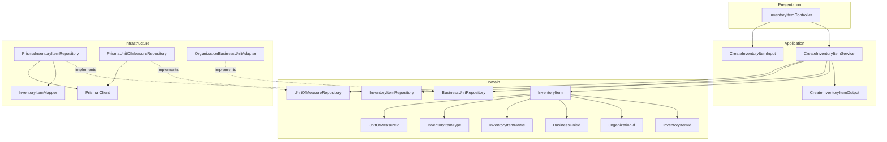
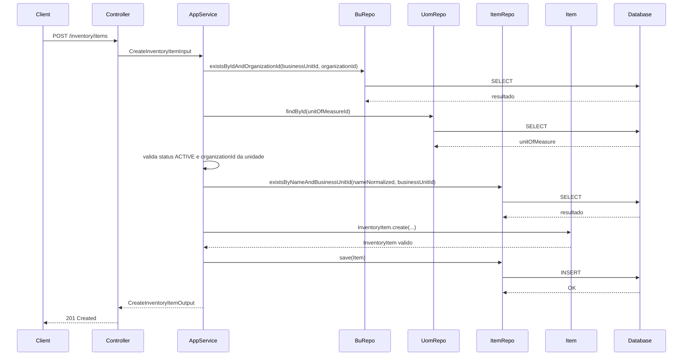
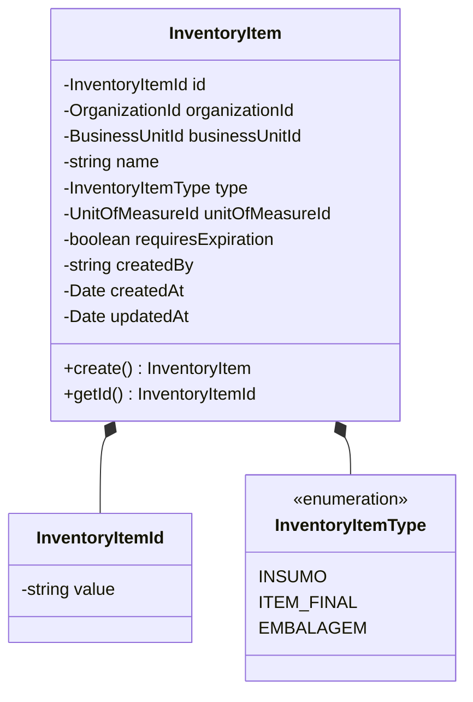
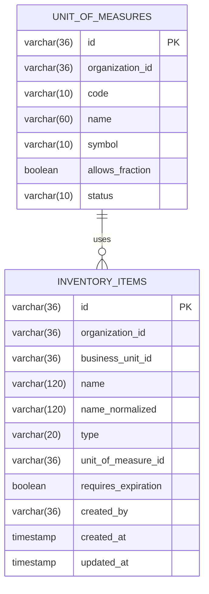
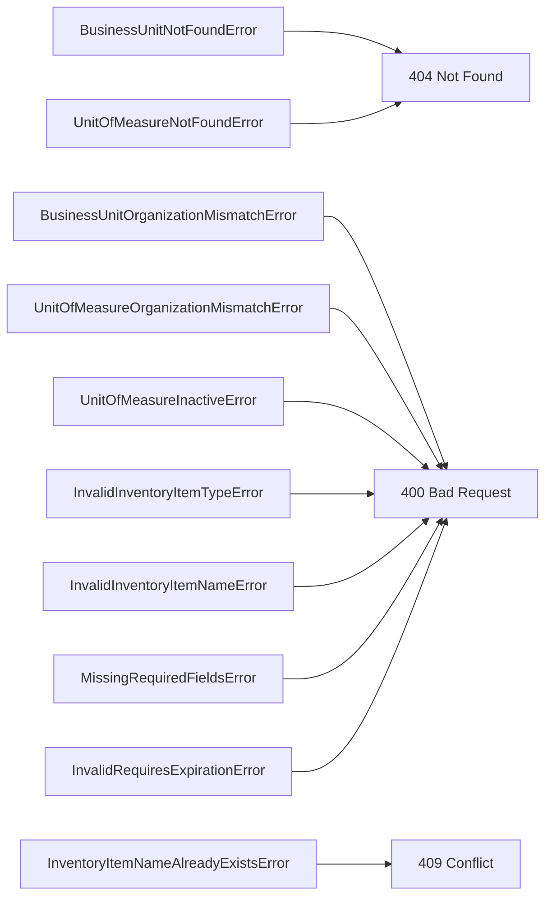

# Design: Create Inventory Item

**Created**: 2026-01-12  
**Spec**: [./spec.md](./spec.md)  
**Project**: [../../../project.md](../../../project.md)

---

## Overview

A capability Create Inventory Item cria a identidade do item fisico controlado no estoque.
O Application Service valida unidade de negocio, organizacao e unidade de medida ativa, garante unicidade de nome por unidade e persiste o item.
A complexidade e moderada por validacoes de integridade entre contexto Organization e o catalogo de unidades de medida.

---

## Component Map

### Domain Layer

| Tipo | Nome | Responsabilidade |
|------|------|------------------|
| Entity | `InventoryItem` | Representa um item fisico controlado no estoque |
| Value Object | `InventoryItemId` | Identificador unico do item |
| Value Object | `OrganizationId` | Identificador da organizacao |
| Value Object | `BusinessUnitId` | Identificador da unidade de negocio |
| Value Object | `InventoryItemName` | Nome validado e normalizado |
| Value Object | `InventoryItemType` | Tipificacao (`INSUMO`, `ITEM_FINAL`, `EMBALAGEM`) |
| Value Object | `UnitOfMeasureId` | Identificador da unidade de medida |
| Repository Interface | `InventoryItemRepository` | Persistencia e consultas de item |
| Repository Interface | `BusinessUnitRepository` | Consulta unidade de negocio no modulo organization (port) |
| Repository Interface | `UnitOfMeasureRepository` | Consulta unidade de medida no catalogo do inventory |

### Application Layer

| Tipo | Nome | Responsabilidade |
|------|------|------------------|
| App Service | `CreateInventoryItemService` | Orquestra a criacao do item |
| Input DTO | `CreateInventoryItemInput` | Dados de entrada para criacao |
| Output DTO | `CreateInventoryItemOutput` | Dados retornados apos criacao |

### Infrastructure Layer

| Tipo | Nome | Responsabilidade |
|------|------|------------------|
| Repository Impl | `PrismaInventoryItemRepository` | Implementa `InventoryItemRepository` |
| Repository Impl | `PrismaUnitOfMeasureRepository` | Implementa `UnitOfMeasureRepository` |
| Port Adapter | `OrganizationBusinessUnitAdapter` | Implementa `BusinessUnitRepository` |
| Mapper | `InventoryItemMapper` | Converte Domain <-> Prisma |

### Presentation Layer

| Tipo | Nome | Responsabilidade |
|------|------|------------------|
| Controller | `InventoryItemController` | Exposicao HTTP do caso de uso |

---

## Dependency Graph

---

## Data Flow

### Fluxo: Criar Inventory Item

**Transformacoes de dados:**

| Etapa | De | Para |
|-------|----|----- |
| Controller -> AppService | JSON body | CreateInventoryItemInput |
| AppService -> Domain | DTO | InventoryItem |
| Repository -> DB | Entity | Prisma Model |

---

## Entity Structure

### InventoryItem

**Propriedades:**

| Propriedade | Tipo | Mutavel? | Regras |
|-------------|------|----------|--------|
| `id` | InventoryItemId | Nao | Gerado internamente |
| `organizationId` | OrganizationId | Nao | Obrigatorio |
| `businessUnitId` | BusinessUnitId | Nao | Obrigatorio, deve pertencer a organizacao |
| `name` | string | Nao | 2-120, unico por unidade (case-insensitive) |
| `type` | InventoryItemType | Nao | INSUMO, ITEM_FINAL, EMBALAGEM |
| `unitOfMeasureId` | UnitOfMeasureId | Nao | Obrigatorio, unidade ativa da organizacao |
| `requiresExpiration` | boolean | Nao | Obrigatorio |
| `createdBy` | string | Nao | Obrigatorio |
| `createdAt` | Date | Nao | Automatico |
| `updatedAt` | Date | Sim | Atualizado em mudancas futuras |

**Comportamentos:**

| Metodo | Regras |
|--------|--------|
| `create` | Valida name, type e requiresExpiration |

---

## Repository Operations

| Operacao | Descricao | Usada por |
|----------|-----------|-----------|
| `InventoryItemRepository.save(item)` | Persiste item | CreateInventoryItemService |
| `InventoryItemRepository.existsByNameAndBusinessUnitId(name, businessUnitId)` | Verifica duplicidade de nome | CreateInventoryItemService |
| `BusinessUnitRepository.existsByIdAndOrganizationId(businessUnitId, organizationId)` | Valida unidade e organizacao | CreateInventoryItemService |
| `UnitOfMeasureRepository.findById(id)` | Busca unidade de medida | CreateInventoryItemService |

---

## Database Model

### Tabela: `inventory_items`

| Coluna | Tipo | Constraints |
|--------|------|-------------|
| `id` | VARCHAR(36) | PK |
| `organization_id` | VARCHAR(36) | NOT NULL |
| `business_unit_id` | VARCHAR(36) | NOT NULL |
| `name` | VARCHAR(120) | NOT NULL |
| `name_normalized` | VARCHAR(120) | NOT NULL, UNIQUE(business_unit_id + name_normalized) |
| `type` | VARCHAR(20) | NOT NULL |
| `unit_of_measure_id` | VARCHAR(36) | NOT NULL, FK(unit_of_measures.id) |
| `requires_expiration` | BOOLEAN | NOT NULL |
| `created_by` | VARCHAR(36) | NOT NULL |
| `created_at` | TIMESTAMP | NOT NULL, DEFAULT now() |
| `updated_at` | TIMESTAMP | NULL |

---

## API Endpoints

| Metodo | Path | Operacao | Sucesso | Erros |
|--------|------|----------|---------|-------|
| POST | `/inventory/items` | Criar item | 201 | 400, 404, 409 |

---

## Error Handling

| Erro de Dominio | Quando Ocorre | HTTP Status | Codigo |
|-----------------|---------------|-------------|--------|
| `BusinessUnitNotFoundError` | businessUnitId inexistente | 404 | `BUSINESS_UNIT_NOT_FOUND` |
| `BusinessUnitOrganizationMismatchError` | unidade nao pertence a organizacao | 400 | `BUSINESS_UNIT_ORG_MISMATCH` |
| `UnitOfMeasureNotFoundError` | unitOfMeasureId inexistente | 404 | `UNIT_OF_MEASURE_NOT_FOUND` |
| `UnitOfMeasureOrganizationMismatchError` | unidade de medida de outra organizacao | 400 | `UNIT_OF_MEASURE_ORG_MISMATCH` |
| `UnitOfMeasureInactiveError` | unidade de medida inativa | 400 | `UNIT_OF_MEASURE_INACTIVE` |
| `InventoryItemNameAlreadyExistsError` | name duplicado na unidade | 409 | `INVENTORY_ITEM_NAME_EXISTS` |
| `InvalidInventoryItemTypeError` | type fora do enum | 400 | `INVALID_INVENTORY_ITEM_TYPE` |
| `InvalidInventoryItemNameError` | name fora do tamanho | 400 | `INVALID_INVENTORY_ITEM_NAME` |
| `MissingRequiredFieldsError` | campos obrigatorios ausentes | 400 | `MISSING_REQUIRED_FIELDS` |
| `InvalidRequiresExpirationError` | requiresExpiration invalido | 400 | `INVALID_REQUIRES_EXPIRATION` |

---

## Technical Decisions

### Decisao 1: Unicidade case-insensitive via coluna normalizada

**Contexto**: O nome do item deve ser unico por unidade de negocio, ignorando caixa.

**Decisao**: Persistir `name_normalized` em lowercase e criar indice unico por `business_unit_id`.

**Justificativa**: Simplifica comparacoes e evita duplicidade logica no banco.

---

### Decisao 2: Validacao de unidade de negocio via port do modulo organization

**Contexto**: A unidade deve existir e pertencer a organizacao informada.

**Decisao**: `CreateInventoryItemService` consulta `BusinessUnitRepository` (port) antes da criacao.

**Justificativa**: Mantem o inventory desacoplado do contexto organization.

---

### Decisao 3: Unidade de medida ativa como pre-requisito

**Contexto**: O item nao pode ser criado com unidade inativa.

**Decisao**: A validacao de status e feita no Application Service usando `UnitOfMeasureRepository`.

**Justificativa**: Garante consistencia com o catalogo e previne uso futuro indevido.

---

## Implementation Notes

- Normalizar `name` com trim + lowercase para validacao de unicidade.
- Validar `requiresExpiration` como boolean antes de criar a entity.
- Rejeitar `unitOfMeasureId` quando `status != ACTIVE`.
- Criar indice unico em `(business_unit_id, name_normalized)`.
- `createdAt` deve ser gerado na criacao; `updatedAt` inicia como NULL.

---
