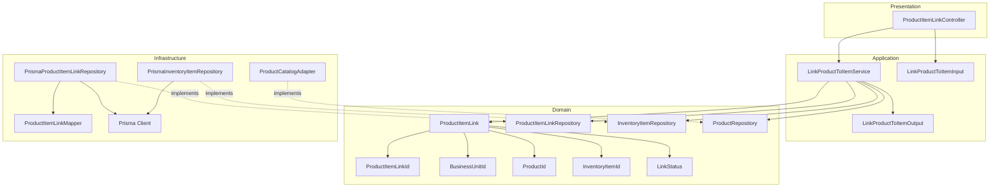
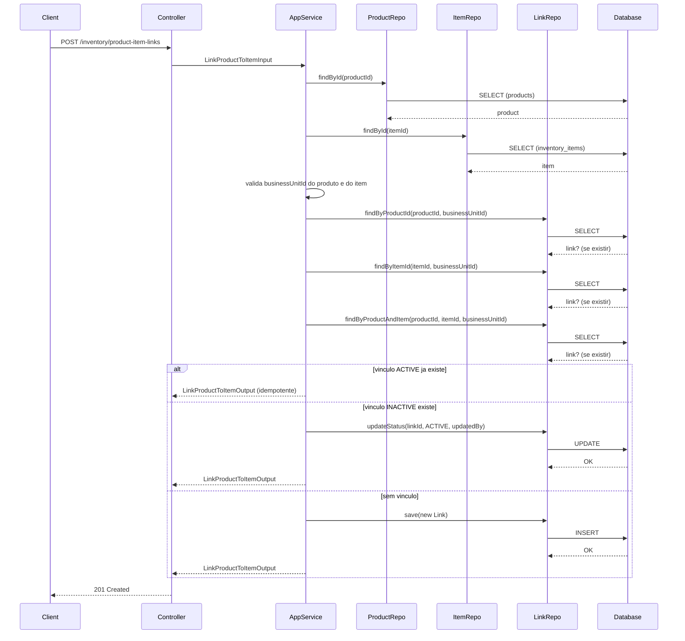
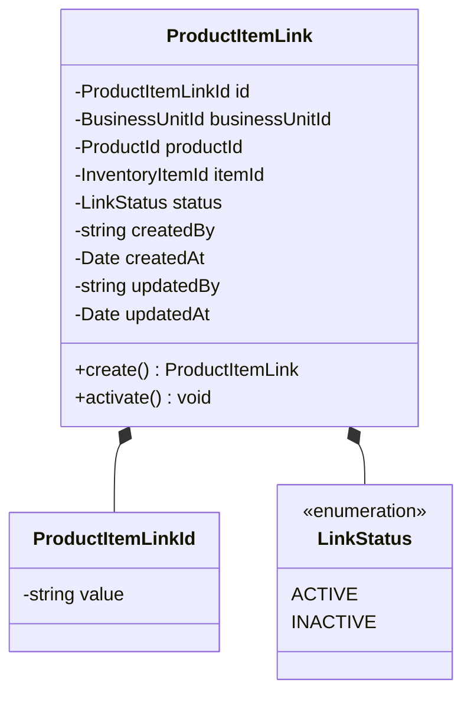
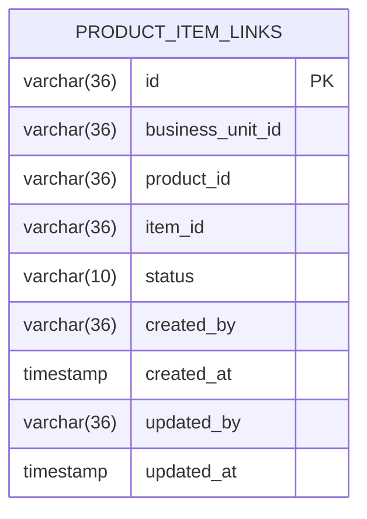
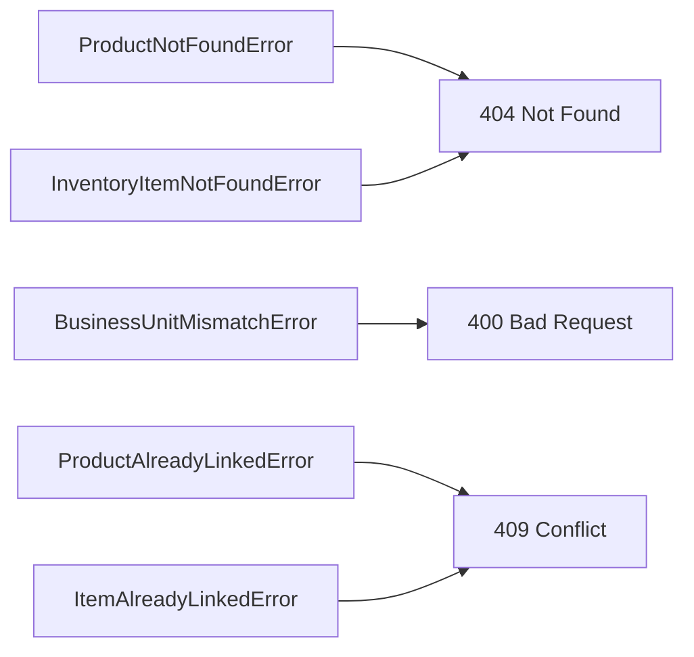

# Design: Link Product to Inventory Item

**Created**: 2026-01-12  
**Spec**: [./spec.md](./spec.md)  
**Project**: [../../../project.md](../../../project.md)

---

## Overview

A capability Link Product to Inventory Item cria o vinculo 1:1 entre um produto comercial e um item fisico no estoque.
O Application Service valida existencia de produto e item, garante que pertencem a mesma unidade e aplica regras de idempotencia/reativacao.
A complexidade e moderada por restricoes de unicidade ativa e pela necessidade de reconciliar status existentes.

---

## Component Map

### Domain Layer

| Tipo | Nome | Responsabilidade |
|------|------|------------------|
| Entity | `ProductItemLink` | Vinculo entre produto e item com status |
| Value Object | `ProductItemLinkId` | Identificador unico do vinculo |
| Value Object | `BusinessUnitId` | Identificador da unidade de negocio |
| Value Object | `ProductId` | Identificador do produto |
| Value Object | `InventoryItemId` | Identificador do item |
| Value Object | `LinkStatus` | Estado do vinculo (`ACTIVE`, `INACTIVE`) |
| Repository Interface | `ProductItemLinkRepository` | Persistencia e consultas de vinculo |
| Repository Interface | `InventoryItemRepository` | Consulta item de estoque |
| Repository Interface | `ProductRepository` | Consulta produto no modulo products (port) |

### Application Layer

| Tipo | Nome | Responsabilidade |
|------|------|------------------|
| App Service | `LinkProductToItemService` | Orquestra o vinculo produto-item |
| Input DTO | `LinkProductToItemInput` | Dados de entrada do vinculo |
| Output DTO | `LinkProductToItemOutput` | Dados retornados apos vinculo |

### Infrastructure Layer

| Tipo | Nome | Responsabilidade |
|------|------|------------------|
| Repository Impl | `PrismaProductItemLinkRepository` | Implementa `ProductItemLinkRepository` |
| Repository Impl | `PrismaInventoryItemRepository` | Implementa `InventoryItemRepository` |
| Port Adapter | `ProductCatalogAdapter` | Implementa `ProductRepository` |
| Mapper | `ProductItemLinkMapper` | Converte Domain <-> Prisma |

### Presentation Layer

| Tipo | Nome | Responsabilidade |
|------|------|------------------|
| Controller | `ProductItemLinkController` | Exposicao HTTP do caso de uso |

---

## Dependency Graph

---

## Data Flow

### Fluxo: Vincular Produto a Item

**Transformacoes de dados:**

| Etapa | De | Para |
|-------|----|----- |
| Controller -> AppService | JSON body | LinkProductToItemInput |
| AppService -> Domain | DTO | ProductItemLink |
| Repository -> DB | Entity | Prisma Model |

---

## Entity Structure

### ProductItemLink

**Propriedades:**

| Propriedade | Tipo | Mutavel? | Regras |
|-------------|------|----------|--------|
| `id` | ProductItemLinkId | Nao | Gerado internamente |
| `businessUnitId` | BusinessUnitId | Nao | Obrigatorio |
| `productId` | ProductId | Nao | Obrigatorio |
| `itemId` | InventoryItemId | Nao | Obrigatorio |
| `status` | LinkStatus | Sim | ACTIVE ou INACTIVE |
| `createdBy` | string | Nao | Obrigatorio |
| `createdAt` | Date | Nao | Automatico |
| `updatedBy` | string | Sim | Obrigatorio na reativacao |
| `updatedAt` | Date | Sim | Atualizado na reativacao |

**Comportamentos:**

| Metodo | Regras |
|--------|--------|
| `create` | Inicia com status ACTIVE |
| `activate` | Se INACTIVE, reativa e registra updatedBy/updatedAt |

---

## Repository Operations

| Operacao | Descricao | Usada por |
|----------|-----------|-----------|
| `ProductRepository.findById(id)` | Busca produto e businessUnitId | LinkProductToItemService |
| `InventoryItemRepository.findById(id)` | Busca item e businessUnitId | LinkProductToItemService |
| `ProductItemLinkRepository.findByProductId(productId, businessUnitId)` | Verifica vinculo por produto | LinkProductToItemService |
| `ProductItemLinkRepository.findByItemId(itemId, businessUnitId)` | Verifica vinculo por item | LinkProductToItemService |
| `ProductItemLinkRepository.findByProductAndItem(productId, itemId, businessUnitId)` | Verifica vinculo existente | LinkProductToItemService |
| `ProductItemLinkRepository.save(link)` | Persiste novo vinculo | LinkProductToItemService |
| `ProductItemLinkRepository.updateStatus(id, status, updatedBy)` | Reativa vinculo | LinkProductToItemService |

---

## Database Model

### Tabela: `product_item_links`

| Coluna | Tipo | Constraints |
|--------|------|-------------|
| `id` | VARCHAR(36) | PK |
| `business_unit_id` | VARCHAR(36) | NOT NULL |
| `product_id` | VARCHAR(36) | NOT NULL, UNIQUE(business_unit_id + product_id) |
| `item_id` | VARCHAR(36) | NOT NULL, UNIQUE(business_unit_id + item_id) |
| `status` | VARCHAR(10) | NOT NULL |
| `created_by` | VARCHAR(36) | NOT NULL |
| `created_at` | TIMESTAMP | NOT NULL, DEFAULT now() |
| `updated_by` | VARCHAR(36) | NULL |
| `updated_at` | TIMESTAMP | NULL |

Notas:
- A unicidade por produto e item garante relacao 1:1 com status alternado.

---

## API Endpoints

| Metodo | Path | Operacao | Sucesso | Erros |
|--------|------|----------|---------|-------|
| POST | `/inventory/product-item-links` | Vincular produto a item | 201 | 400, 404, 409 |

---

## Error Handling

| Erro de Dominio | Quando Ocorre | HTTP Status | Codigo |
|-----------------|---------------|-------------|--------|
| `ProductNotFoundError` | productId inexistente | 404 | `PRODUCT_NOT_FOUND` |
| `InventoryItemNotFoundError` | itemId inexistente | 404 | `INVENTORY_ITEM_NOT_FOUND` |
| `BusinessUnitMismatchError` | produto e item em unidades diferentes | 400 | `PRODUCT_ITEM_BUSINESS_UNIT_MISMATCH` |
| `ProductAlreadyLinkedError` | produto ja vinculado a outro item | 409 | `PRODUCT_ALREADY_LINKED` |
| `ItemAlreadyLinkedError` | item ja vinculado a outro produto | 409 | `ITEM_ALREADY_LINKED` |

---

## Technical Decisions

### Decisao 1: Reativacao reutiliza o mesmo registro

**Contexto**: O vinculo pode ser reativado sem criar novo registro.

**Decisao**: Quando existir `INACTIVE`, atualizar status e `updatedAt/updatedBy` no mesmo registro.

**Justificativa**: Preserva historico e garante idempotencia sem duplicidade.

---

### Decisao 2: Validar unidade via leitura de produto e item

**Contexto**: Produto e item devem pertencer a mesma unidade.

**Decisao**: O service carrega `businessUnitId` do produto (port) e do item (repo local) antes do vinculo.

**Justificativa**: Evita inconsistencias entre contextos e mantem regra 1:1 por unidade.

---

### Decisao 3: Unicidade garantida por constraints e validacao

**Contexto**: Nao pode haver mais de um vinculo ativo para produto ou item.

**Decisao**: Unicidade por `business_unit_id + product_id` e `business_unit_id + item_id` com validacao previa.

**Justificativa**: Evita concorrencia e falhas logicas na criacao de vinculos.

---

## Implementation Notes

- Retornar resposta idempotente quando vinculo ACTIVE ja existir.
- Rejeitar criacao quando existir vinculo ACTIVE para produto ou item diferente.
- Usar transacao apenas quando houver atualizacao de status (reativacao).
- `createdAt` nao deve ser alterado na reativacao.
- Indicar no output o `status` final do vinculo.

---
