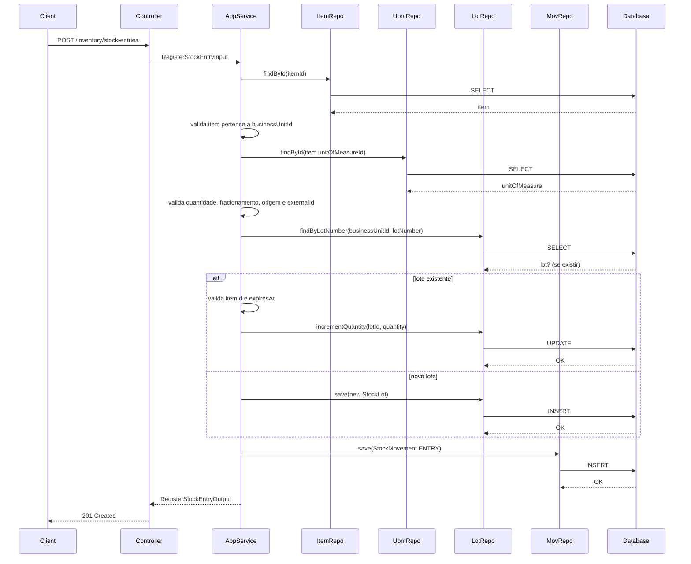
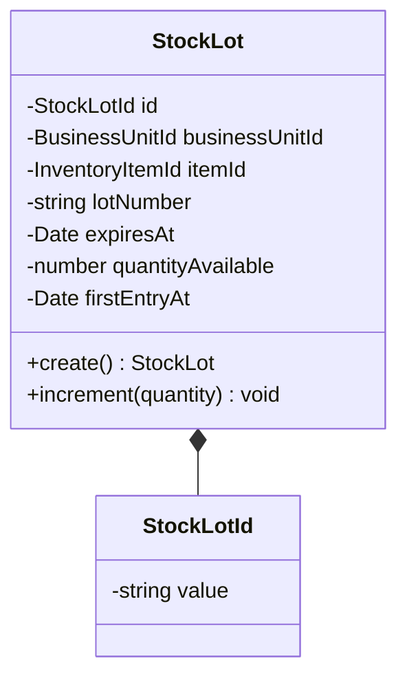
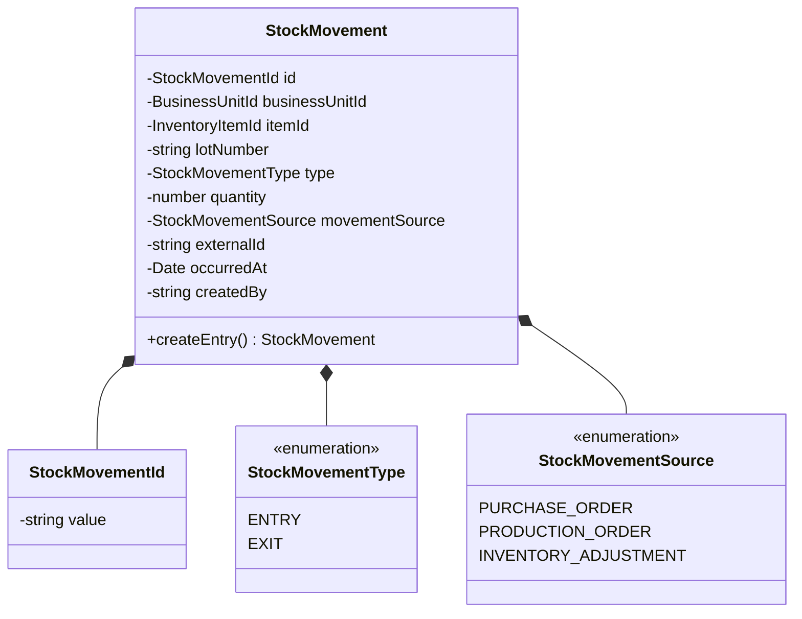
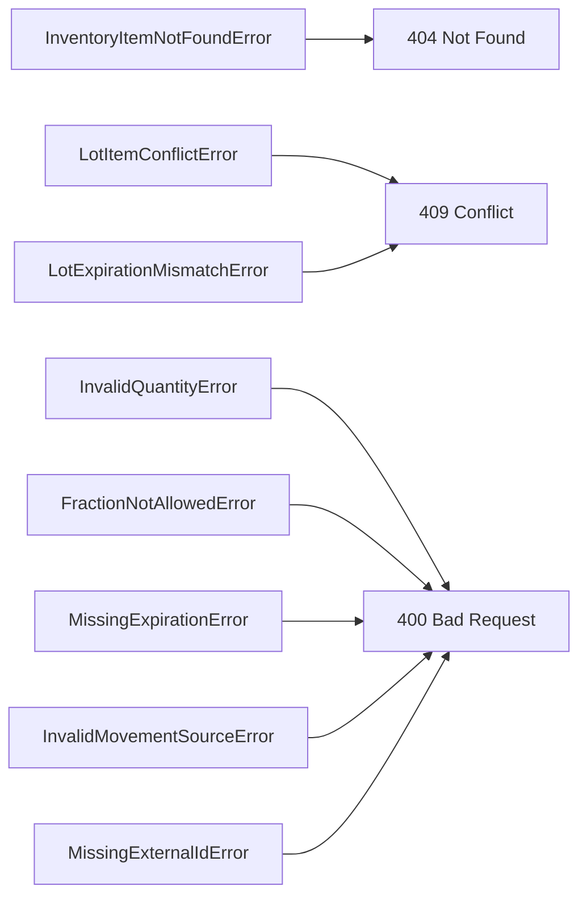

# Design: Register Stock Entry

**Created**: 2026-01-12  
**Spec**: [./spec.md](./spec.md)  
**Project**: [../../../project.md](../../../project.md)

---

## Overview

A capability Register Stock Entry registra a entrada fisica de itens por lote, criando ou incrementando lotes e gerando movimentacoes imutaveis.
O Application Service valida item (escopo da unidade), unidade de medida, quantidade, origem e consistencia de lote/validade.
A operacao exige transacao para garantir atualizacao atomica de lote e gravacao da movimentacao.

---

## Component Map

### Domain Layer

| Tipo | Nome | Responsabilidade |
|------|------|------------------|
| Entity | `StockLot` | Lote de estoque com saldo e validade |
| Entity | `StockMovement` | Movimentacao imutavel de estoque |
| Value Object | `StockLotId` | Identificador do lote |
| Value Object | `StockMovementId` | Identificador da movimentacao |
| Value Object | `BusinessUnitId` | Identificador da unidade |
| Value Object | `InventoryItemId` | Identificador do item |
| Value Object | `StockMovementType` | Tipo (`ENTRY`, `EXIT`) |
| Value Object | `StockMovementSource` | Origem da movimentacao |
| Repository Interface | `StockLotRepository` | Persistencia e consultas de lotes |
| Repository Interface | `StockMovementRepository` | Persistencia de movimentacoes |
| Repository Interface | `InventoryItemRepository` | Consulta item de estoque |
| Repository Interface | `UnitOfMeasureRepository` | Consulta unidade de medida |

### Application Layer

| Tipo | Nome | Responsabilidade |
|------|------|------------------|
| App Service | `RegisterStockEntryService` | Orquestra a entrada de estoque |
| Input DTO | `RegisterStockEntryInput` | Dados de entrada |
| Output DTO | `RegisterStockEntryOutput` | Dados retornados apos registro |

### Infrastructure Layer

| Tipo | Nome | Responsabilidade |
|------|------|------------------|
| Repository Impl | `PrismaStockLotRepository` | Implementa `StockLotRepository` |
| Repository Impl | `PrismaStockMovementRepository` | Implementa `StockMovementRepository` |
| Repository Impl | `PrismaInventoryItemRepository` | Implementa `InventoryItemRepository` |
| Repository Impl | `PrismaUnitOfMeasureRepository` | Implementa `UnitOfMeasureRepository` |
| Mapper | `StockLotMapper` | Converte Domain <-> Prisma |
| Mapper | `StockMovementMapper` | Converte Domain <-> Prisma |

### Presentation Layer

| Tipo | Nome | Responsabilidade |
|------|------|------------------|
| Controller | `StockEntryController` | Exposicao HTTP do caso de uso |

---

## Dependency Graph

```mermaid
graph TD
    subgraph Presentation
        CTRL[StockEntryController]
    end

    subgraph Application
        SVC[RegisterStockEntryService]
        DTO_IN[RegisterStockEntryInput]
        DTO_OUT[RegisterStockEntryOutput]
    end

    subgraph Domain
        LOT[StockLot]
        MOV[StockMovement]
        VO_LOT[StockLotId]
        VO_MOV[StockMovementId]
        VO_BU[BusinessUnitId]
        VO_ITEM[InventoryItemId]
        VO_TYPE[StockMovementType]
        VO_SRC[StockMovementSource]
        LOT_REPO[StockLotRepository]
        MOV_REPO[StockMovementRepository]
        ITEM_REPO[InventoryItemRepository]
        UOM_REPO[UnitOfMeasureRepository]
    end

    subgraph Infrastructure
        LOT_IMPL[PrismaStockLotRepository]
        MOV_IMPL[PrismaStockMovementRepository]
        ITEM_IMPL[PrismaInventoryItemRepository]
        UOM_IMPL[PrismaUnitOfMeasureRepository]
        LOT_MAPPER[StockLotMapper]
        MOV_MAPPER[StockMovementMapper]
        PRISMA[Prisma Client]
    end

    CTRL --> SVC
    CTRL --> DTO_IN
    SVC --> DTO_OUT
    SVC --> LOT_REPO
    SVC --> MOV_REPO
    SVC --> ITEM_REPO
    SVC --> UOM_REPO
    SVC --> LOT
    SVC --> MOV
    LOT --> VO_LOT
    LOT --> VO_BU
    LOT --> VO_ITEM
    MOV --> VO_MOV
    MOV --> VO_TYPE
    MOV --> VO_SRC
    LOT_IMPL -.->|implements| LOT_REPO
    MOV_IMPL -.->|implements| MOV_REPO
    ITEM_IMPL -.->|implements| ITEM_REPO
    UOM_IMPL -.->|implements| UOM_REPO
    LOT_IMPL --> LOT_MAPPER
    MOV_IMPL --> MOV_MAPPER
    LOT_IMPL --> PRISMA
    MOV_IMPL --> PRISMA
    ITEM_IMPL --> PRISMA
    UOM_IMPL --> PRISMA
```



---

## Data Flow

### Fluxo: Registrar Entrada de Estoque



**Transformacoes de dados:**

| Etapa | De | Para |
|-------|----|----- |
| Controller -> AppService | JSON body | RegisterStockEntryInput |
| AppService -> Domain | DTO | StockLot, StockMovement |
| Repository -> DB | Entities | Prisma Models |

---

## Entity Structure

### StockLot



**Propriedades:**

| Propriedade | Tipo | Mutavel? | Regras |
|-------------|------|----------|--------|
| `id` | StockLotId | Nao | Gerado internamente |
| `businessUnitId` | BusinessUnitId | Nao | Obrigatorio |
| `itemId` | InventoryItemId | Nao | Obrigatorio |
| `lotNumber` | string | Nao | Obrigatorio, unico por unidade |
| `expiresAt` | Date | Nao | Obrigatorio quando item exige validade |
| `quantityAvailable` | number | Sim | >= 0 |
| `firstEntryAt` | Date | Nao | Timestamp da primeira entrada |

**Comportamentos:**

| Metodo | Regras |
|--------|--------|
| `create` | Inicializa quantityAvailable e firstEntryAt |
| `increment` | Soma quantidade positiva ao saldo |

### StockMovement



---

## Repository Operations

| Operacao | Descricao | Usada por |
|----------|-----------|-----------|
| `InventoryItemRepository.findById(id)` | Busca item | RegisterStockEntryService |
| `UnitOfMeasureRepository.findById(id)` | Busca unidade de medida | RegisterStockEntryService |
| `StockLotRepository.findByLotNumber(businessUnitId, lotNumber)` | Busca lote existente | RegisterStockEntryService |
| `StockLotRepository.save(lot)` | Persiste novo lote | RegisterStockEntryService |
| `StockLotRepository.incrementQuantity(lotId, quantity)` | Atualiza saldo do lote | RegisterStockEntryService |
| `StockMovementRepository.save(movement)` | Persiste movimentacao | RegisterStockEntryService |

---

## Database Model

```mermaid
erDiagram
    STOCK_LOTS {
        varchar(36) id PK
        varchar(36) business_unit_id
        varchar(36) item_id
        varchar(80) lot_number
        date expires_at
        decimal(18,4) quantity_available
        timestamp first_entry_at
    }

    STOCK_MOVEMENTS {
        varchar(36) id PK
        varchar(36) business_unit_id
        varchar(36) item_id
        varchar(80) lot_number
        varchar(10) type
        decimal(18,4) quantity
        varchar(30) movement_source
        varchar(60) external_id
        timestamp occurred_at
        varchar(36) created_by
        timestamp created_at
    }

    STOCK_LOTS ||--o{ STOCK_MOVEMENTS : uses
```

### Tabela: `stock_lots`

| Coluna | Tipo | Constraints |
|--------|------|-------------|
| `id` | VARCHAR(36) | PK |
| `business_unit_id` | VARCHAR(36) | NOT NULL |
| `item_id` | VARCHAR(36) | NOT NULL |
| `lot_number` | VARCHAR(80) | NOT NULL, UNIQUE(business_unit_id + lot_number) |
| `expires_at` | DATE | NULL |
| `quantity_available` | DECIMAL(18,4) | NOT NULL |
| `first_entry_at` | TIMESTAMP | NOT NULL |

### Tabela: `stock_movements`

| Coluna | Tipo | Constraints |
|--------|------|-------------|
| `id` | VARCHAR(36) | PK |
| `business_unit_id` | VARCHAR(36) | NOT NULL |
| `item_id` | VARCHAR(36) | NOT NULL |
| `lot_number` | VARCHAR(80) | NOT NULL |
| `type` | VARCHAR(10) | NOT NULL |
| `quantity` | DECIMAL(18,4) | NOT NULL |
| `movement_source` | VARCHAR(30) | NOT NULL |
| `external_id` | VARCHAR(60) | NULL |
| `occurred_at` | TIMESTAMP | NOT NULL |
| `created_by` | VARCHAR(36) | NOT NULL |
| `created_at` | TIMESTAMP | NOT NULL, DEFAULT now() |

---

## API Endpoints

| Metodo | Path | Operacao | Sucesso | Erros |
|--------|------|----------|---------|-------|
| POST | `/inventory/stock-entries` | Registrar entrada | 201 | 400, 404, 409 |

---

## Error Handling



| Erro de Dominio | Quando Ocorre | HTTP Status | Codigo |
|-----------------|---------------|-------------|--------|
| `InventoryItemNotFoundError` | itemId inexistente ou fora da unidade | 404 | `INVENTORY_ITEM_NOT_FOUND` |
| `LotItemConflictError` | lote pertence a outro item | 409 | `LOT_ITEM_CONFLICT` |
| `LotExpirationMismatchError` | expiresAt diverge do lote | 409 | `LOT_EXPIRATION_MISMATCH` |
| `InvalidQuantityError` | quantidade <= 0 | 400 | `INVALID_QUANTITY` |
| `FractionNotAllowedError` | fracionamento nao permitido | 400 | `FRACTION_NOT_ALLOWED` |
| `MissingExpirationError` | expiresAt obrigatorio e ausente | 400 | `MISSING_EXPIRATION` |
| `InvalidMovementSourceError` | movementSource invalido | 400 | `INVALID_MOVEMENT_SOURCE` |
| `MissingExternalIdError` | externalId obrigatorio e ausente | 400 | `MISSING_EXTERNAL_ID` |

---

## Technical Decisions

### Decisao 1: Lote unico por unidade de negocio

**Contexto**: `lotNumber` deve ser unico dentro da unidade.

**Decisao**: Criar indice unico `(business_unit_id, lot_number)` e validar itemId do lote existente.

**Justificativa**: Evita colisao de lotes entre itens diferentes.

---

### Decisao 2: Movimentacao imutavel por lote

**Contexto**: Cada entrada deve gerar uma movimentacao rastreavel.

**Decisao**: Criar um `StockMovement` por entrada com `lot_number` e `type = ENTRY`.

**Justificativa**: Simplifica auditoria e consulta de historico.

---

### Decisao 3: Transacao para lote + movimentacao

**Contexto**: A entrada nao pode atualizar lote sem registrar movimentacao.

**Decisao**: Persistir lote (create/increment) e movimentacao na mesma transacao.

**Justificativa**: Garante consistencia entre saldo e historico.

---

## Implementation Notes

- Rejeitar quando `itemId` nao pertence a `businessUnitId`.
- Quando o item exige validade, `expiresAt` e obrigatorio para novo lote.
- Se `movementSource != INVENTORY_ADJUSTMENT`, exigir `externalId`.
- Validar fracionamento usando `allowsFraction` da unidade de medida.
- `firstEntryAt` deve ser definido na criacao do lote com `occurredAt`.
- Para lote existente, nao alterar `firstEntryAt` nem `expiresAt`.

---
