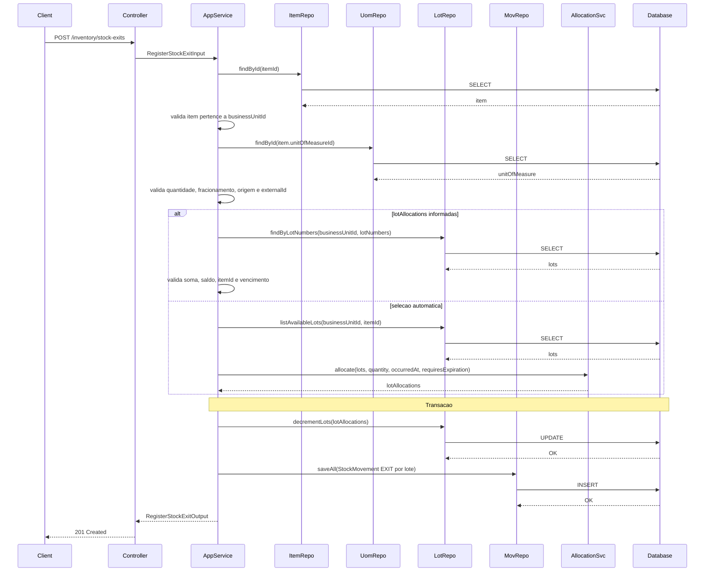
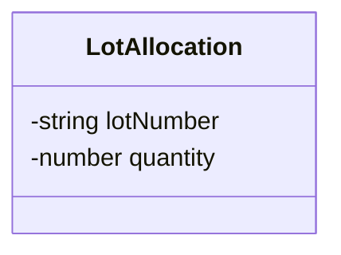
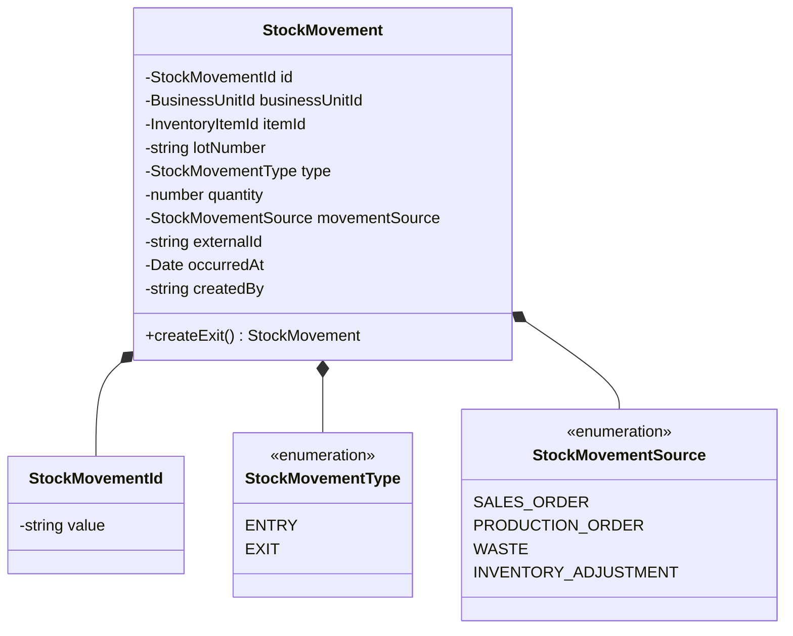
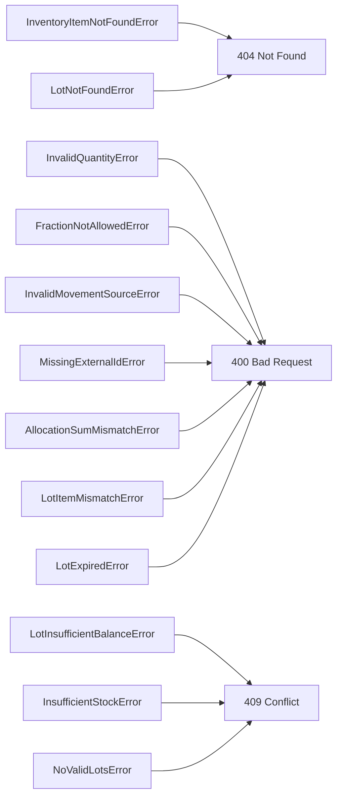

# Design: Register Stock Exit

**Created**: 2026-01-12  
**Spec**: [./spec.md](./spec.md)  
**Project**: [../../../project.md](../../../project.md)

---

## Overview

A capability Register Stock Exit registra a saida fisica de itens, reduzindo saldos de lotes e gravando movimentacoes imutaveis.
O Application Service valida item (escopo da unidade), fracionamento, origem e alocacoes de lote, aplicando FEFO/FIFO quando a selecao e automatica.
A operacao exige transacao para garantir deducao de saldos e persistencia das movimentacoes.

---

## Component Map

### Domain Layer

| Tipo | Nome | Responsabilidade |
|------|------|------------------|
| Entity | `StockLot` | Lote com saldo, validade e primeira entrada |
| Entity | `StockMovement` | Movimentacao imutavel de estoque |
| Value Object | `StockMovementId` | Identificador da movimentacao |
| Value Object | `BusinessUnitId` | Identificador da unidade |
| Value Object | `InventoryItemId` | Identificador do item |
| Value Object | `StockMovementType` | Tipo (`ENTRY`, `EXIT`) |
| Value Object | `StockMovementSource` | Origem da movimentacao |
| Value Object | `LotAllocation` | Alocacao de saida por lote |
| Domain Service | `StockExitAllocationService` | Seleciona lotes por FEFO/FIFO |
| Repository Interface | `StockLotRepository` | Persistencia e consultas de lotes |
| Repository Interface | `StockMovementRepository` | Persistencia de movimentacoes |
| Repository Interface | `InventoryItemRepository` | Consulta item de estoque |
| Repository Interface | `UnitOfMeasureRepository` | Consulta unidade de medida |

### Application Layer

| Tipo | Nome | Responsabilidade |
|------|------|------------------|
| App Service | `RegisterStockExitService` | Orquestra a saida de estoque |
| Input DTO | `RegisterStockExitInput` | Dados de entrada |
| Output DTO | `RegisterStockExitOutput` | Dados retornados apos registro |

### Infrastructure Layer

| Tipo | Nome | Responsabilidade |
|------|------|------------------|
| Repository Impl | `PrismaStockLotRepository` | Implementa `StockLotRepository` |
| Repository Impl | `PrismaStockMovementRepository` | Implementa `StockMovementRepository` |
| Repository Impl | `PrismaInventoryItemRepository` | Implementa `InventoryItemRepository` |
| Repository Impl | `PrismaUnitOfMeasureRepository` | Implementa `UnitOfMeasureRepository` |
| Mapper | `StockLotMapper` | Converte Domain <-> Prisma |
| Mapper | `StockMovementMapper` | Converte Domain <-> Prisma |

### Presentation Layer

| Tipo | Nome | Responsabilidade |
|------|------|------------------|
| Controller | `StockExitController` | Exposicao HTTP do caso de uso |

---

## Dependency Graph

```mermaid
graph TD
    subgraph Presentation
        CTRL[StockExitController]
    end

    subgraph Application
        SVC[RegisterStockExitService]
        DTO_IN[RegisterStockExitInput]
        DTO_OUT[RegisterStockExitOutput]
    end

    subgraph Domain
        LOT[StockLot]
        MOV[StockMovement]
        ALLOC[LotAllocation]
        VO_MOV[StockMovementId]
        VO_BU[BusinessUnitId]
        VO_ITEM[InventoryItemId]
        VO_TYPE[StockMovementType]
        VO_SRC[StockMovementSource]
        ALLOC_SVC[StockExitAllocationService]
        LOT_REPO[StockLotRepository]
        MOV_REPO[StockMovementRepository]
        ITEM_REPO[InventoryItemRepository]
        UOM_REPO[UnitOfMeasureRepository]
    end

    subgraph Infrastructure
        LOT_IMPL[PrismaStockLotRepository]
        MOV_IMPL[PrismaStockMovementRepository]
        ITEM_IMPL[PrismaInventoryItemRepository]
        UOM_IMPL[PrismaUnitOfMeasureRepository]
        LOT_MAPPER[StockLotMapper]
        MOV_MAPPER[StockMovementMapper]
        PRISMA[Prisma Client]
    end

    CTRL --> SVC
    CTRL --> DTO_IN
    SVC --> DTO_OUT
    SVC --> LOT_REPO
    SVC --> MOV_REPO
    SVC --> ITEM_REPO
    SVC --> UOM_REPO
    SVC --> ALLOC_SVC
    SVC --> LOT
    SVC --> MOV
    ALLOC_SVC --> LOT
    MOV --> VO_MOV
    MOV --> VO_TYPE
    MOV --> VO_SRC
    ALLOC --> VO_ITEM
    LOT_IMPL -.->|implements| LOT_REPO
    MOV_IMPL -.->|implements| MOV_REPO
    ITEM_IMPL -.->|implements| ITEM_REPO
    UOM_IMPL -.->|implements| UOM_REPO
    LOT_IMPL --> LOT_MAPPER
    MOV_IMPL --> MOV_MAPPER
    LOT_IMPL --> PRISMA
    MOV_IMPL --> PRISMA
    ITEM_IMPL --> PRISMA
    UOM_IMPL --> PRISMA
```



---

## Data Flow

### Fluxo: Registrar Saida de Estoque



**Transformacoes de dados:**

| Etapa | De | Para |
|-------|----|----- |
| Controller -> AppService | JSON body | RegisterStockExitInput |
| AppService -> Domain | DTO | LotAllocation[], StockMovement[] |
| Repository -> DB | Entities | Prisma Models |

---

## Entity Structure

### LotAllocation



### StockMovement



---

## Repository Operations

| Operacao | Descricao | Usada por |
|----------|-----------|-----------|
| `InventoryItemRepository.findById(id)` | Busca item | RegisterStockExitService |
| `UnitOfMeasureRepository.findById(id)` | Busca unidade de medida | RegisterStockExitService |
| `StockLotRepository.findByLotNumbers(businessUnitId, lotNumbers)` | Busca lotes informados | RegisterStockExitService |
| `StockLotRepository.listAvailableLots(businessUnitId, itemId)` | Lista lotes com saldo | RegisterStockExitService |
| `StockLotRepository.decrementLots(lotAllocations)` | Reduz saldo por lote | RegisterStockExitService |
| `StockMovementRepository.saveAll(movements)` | Persiste movimentacoes | RegisterStockExitService |

---

## Database Model

```mermaid
erDiagram
    STOCK_LOTS {
        varchar(36) id PK
        varchar(36) business_unit_id
        varchar(36) item_id
        varchar(80) lot_number
        date expires_at
        decimal(18,4) quantity_available
        timestamp first_entry_at
    }

    STOCK_MOVEMENTS {
        varchar(36) id PK
        varchar(36) business_unit_id
        varchar(36) item_id
        varchar(80) lot_number
        varchar(10) type
        decimal(18,4) quantity
        varchar(30) movement_source
        varchar(60) external_id
        timestamp occurred_at
        varchar(36) created_by
        timestamp created_at
    }
```

---

## API Endpoints

| Metodo | Path | Operacao | Sucesso | Erros |
|--------|------|----------|---------|-------|
| POST | `/inventory/stock-exits` | Registrar saida | 201 | 400, 404, 409 |

---

## Error Handling



| Erro de Dominio | Quando Ocorre | HTTP Status | Codigo |
|-----------------|---------------|-------------|--------|
| `InventoryItemNotFoundError` | itemId inexistente ou fora da unidade | 404 | `INVENTORY_ITEM_NOT_FOUND` |
| `InvalidQuantityError` | quantidade <= 0 | 400 | `INVALID_QUANTITY` |
| `FractionNotAllowedError` | fracionamento nao permitido | 400 | `FRACTION_NOT_ALLOWED` |
| `InvalidMovementSourceError` | movementSource invalido | 400 | `INVALID_MOVEMENT_SOURCE` |
| `MissingExternalIdError` | externalId obrigatorio e ausente | 400 | `MISSING_EXTERNAL_ID` |
| `AllocationSumMismatchError` | soma de alocacoes != quantity | 400 | `ALLOCATION_SUM_MISMATCH` |
| `LotNotFoundError` | lote informado inexistente | 404 | `LOT_NOT_FOUND` |
| `LotItemMismatchError` | lote pertence a outro item | 400 | `LOT_ITEM_MISMATCH` |
| `LotExpiredError` | lote vencido na data da saida | 400 | `LOT_EXPIRED` |
| `LotInsufficientBalanceError` | lote com saldo insuficiente | 409 | `LOT_INSUFFICIENT_BALANCE` |
| `InsufficientStockError` | saldo total insuficiente | 409 | `INSUFFICIENT_STOCK` |
| `NoValidLotsError` | apenas lotes vencidos | 409 | `NO_VALID_LOTS` |

---

## Technical Decisions

### Decisao 1: Selecionar lotes por FEFO/FIFO via Domain Service

**Contexto**: A regra de selecao depende de validade e data da primeira entrada.

**Decisao**: Implementar `StockExitAllocationService` para ordenar lotes e calcular alocacoes.

**Justificativa**: Centraliza a regra e permite testes isolados de FEFO/FIFO.

---

### Decisao 2: Movimentacao por lote para saidas

**Contexto**: A listagem retorna `lotNumber` por movimentacao.

**Decisao**: Persistir uma movimentacao `EXIT` por lote alocado.

**Justificativa**: Facilita auditoria e alinhamento com a listagem de movimentacoes.

---

### Decisao 3: Transacao para deducao e movimentacoes

**Contexto**: A saida nao pode reduzir saldo sem registrar historico.

**Decisao**: Atualizar lotes e inserir movimentacoes na mesma transacao.

**Justificativa**: Evita inconsistencias entre saldo atual e historico.

---

## Implementation Notes

- Rejeitar quando `itemId` nao pertence a `businessUnitId`.
- Para selecao automatica, ignorar lotes vencidos (`expiresAt < occurredAt`).
- Para itens sem validade, ordenar por `firstEntryAt` e desempatar por `lotNumber`.
- Para itens com validade, ordenar por `expiresAt` e desempatar por `lotNumber`.
- Validar `lotAllocations` quando informado: soma exata e saldo suficiente.
- `movementSource != INVENTORY_ADJUSTMENT` exige `externalId`.

---
