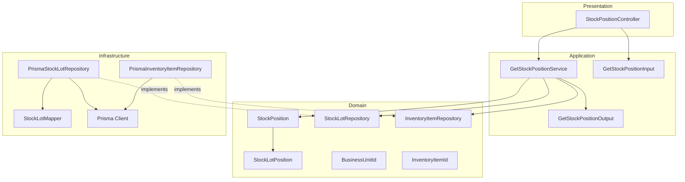
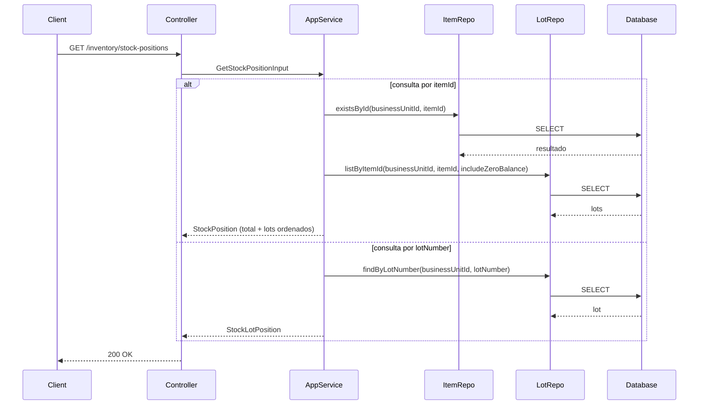
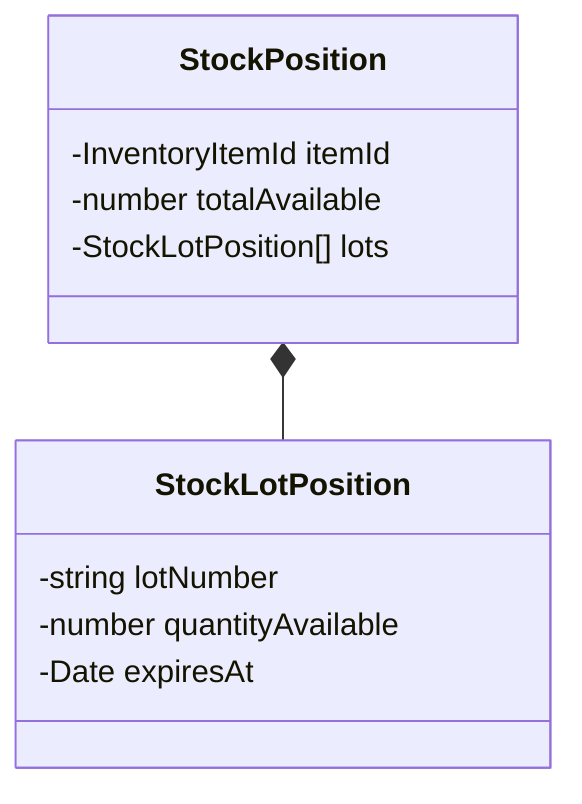
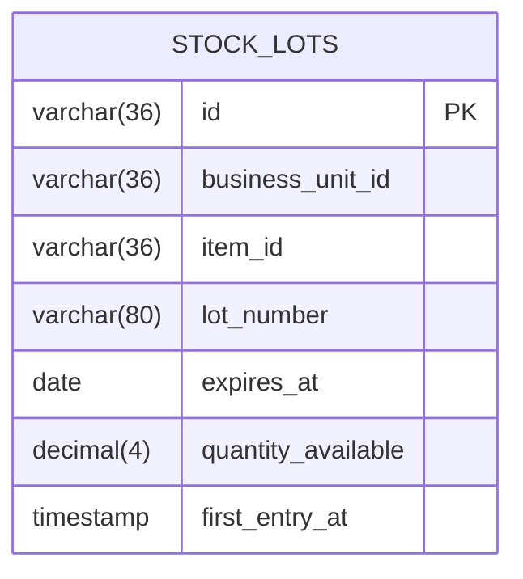
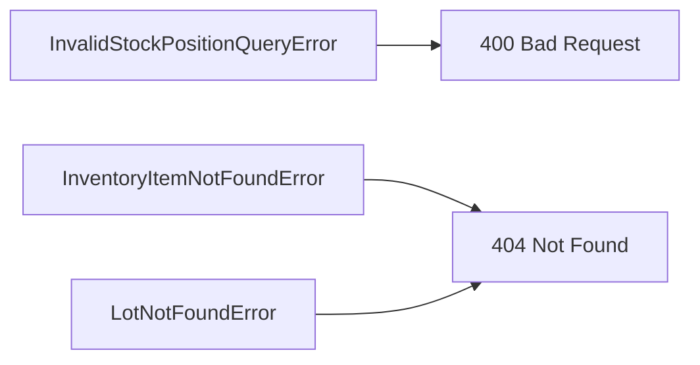

# Design: Get Stock Position

**Created**: 2026-01-12  
**Spec**: [./spec.md](./spec.md)  
**Project**: [../../../project.md](../../../project.md)

---

## Overview

A capability Get Stock Position consulta o saldo atual de um item ou de um lote especifico.
O Application Service valida o escopo da consulta, confirma a existencia do item ou lote e monta o retorno ordenado.
A complexidade e baixa, com foco em leitura consistente e sem alteracao de estado.

---

## Component Map

### Domain Layer

| Tipo | Nome | Responsabilidade |
|------|------|------------------|
| Entity | `StockPosition` | Posicao agregada por item |
| Entity | `StockLotPosition` | Posicao individual de lote |
| Value Object | `BusinessUnitId` | Identificador da unidade |
| Value Object | `InventoryItemId` | Identificador do item |
| Repository Interface | `StockLotRepository` | Consulta lotes e saldos |
| Repository Interface | `InventoryItemRepository` | Consulta item de estoque |

### Application Layer

| Tipo | Nome | Responsabilidade |
|------|------|------------------|
| App Service | `GetStockPositionService` | Orquestra a consulta de posicao |
| Input DTO | `GetStockPositionInput` | Parametros de consulta |
| Output DTO | `GetStockPositionOutput` | Posicao retornada |

### Infrastructure Layer

| Tipo | Nome | Responsabilidade |
|------|------|------------------|
| Repository Impl | `PrismaStockLotRepository` | Implementa `StockLotRepository` |
| Repository Impl | `PrismaInventoryItemRepository` | Implementa `InventoryItemRepository` |
| Mapper | `StockLotMapper` | Converte Domain <-> Prisma |

### Presentation Layer

| Tipo | Nome | Responsabilidade |
|------|------|------------------|
| Controller | `StockPositionController` | Exposicao HTTP do caso de uso |

---

## Dependency Graph

---

## Data Flow

### Fluxo: Consultar Posicao de Estoque

**Transformacoes de dados:**

| Etapa | De | Para |
|-------|----|----- |
| Controller -> AppService | Query params | GetStockPositionInput |
| AppService -> Domain | DTO | StockPosition |
| Repository -> DB | Query | Prisma Models |

---

## Entity Structure

### StockPosition

---

## Repository Operations

| Operacao | Descricao | Usada por |
|----------|-----------|-----------|
| `InventoryItemRepository.existsById(businessUnitId, itemId)` | Verifica existencia do item | GetStockPositionService |
| `StockLotRepository.listByItemId(businessUnitId, itemId, includeZeroBalance)` | Lista lotes do item | GetStockPositionService |
| `StockLotRepository.findByLotNumber(businessUnitId, lotNumber)` | Busca lote especifico | GetStockPositionService |

---

## Database Model

---

## API Endpoints

| Metodo | Path | Operacao | Sucesso | Erros |
|--------|------|----------|---------|-------|
| GET | `/inventory/stock-positions` | Consultar posicao | 200 | 400, 404 |

---

## Error Handling

| Erro de Dominio | Quando Ocorre | HTTP Status | Codigo |
|-----------------|---------------|-------------|--------|
| `InvalidStockPositionQueryError` | itemId/lotNumber ausentes ou ambos presentes | 400 | `INVALID_STOCK_POSITION_QUERY` |
| `InventoryItemNotFoundError` | itemId inexistente na unidade | 404 | `INVENTORY_ITEM_NOT_FOUND` |
| `LotNotFoundError` | lotNumber inexistente na unidade | 404 | `LOT_NOT_FOUND` |

---

## Technical Decisions

### Decisao 1: Ordenacao por validade e numero de lote

**Contexto**: A spec exige ordenacao por expiresAt ascendente e lotNumber ascendente.

**Decisao**: Aplicar ordenacao no repository, com `expiresAt` nulo por ultimo.

**Justificativa**: Garante consistencia do retorno e simplifica a camada de aplicacao.

---

### Decisao 2: Consulta de lote sempre retorna saldo, mesmo zero

**Contexto**: A consulta por lote deve retornar saldo mesmo quando zero.

**Decisao**: `findByLotNumber` retorna o lote sem filtrar por `quantityAvailable`.

**Justificativa**: Facilita auditoria e alinhamento com a spec.

---

## Implementation Notes

- Rejeitar quando `itemId` e `lotNumber` estiverem ausentes ou ambos informados.
- Para consulta por item, calcular `totalAvailable` somando `quantityAvailable`.
- `includeZeroBalance = false` deve filtrar lotes com saldo zero.
- Retornar lista vazia quando nao houver lotes com saldo.

---
