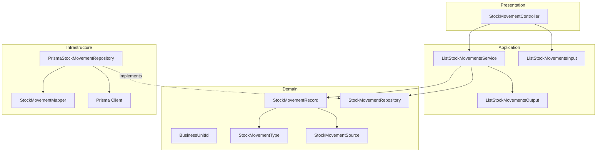
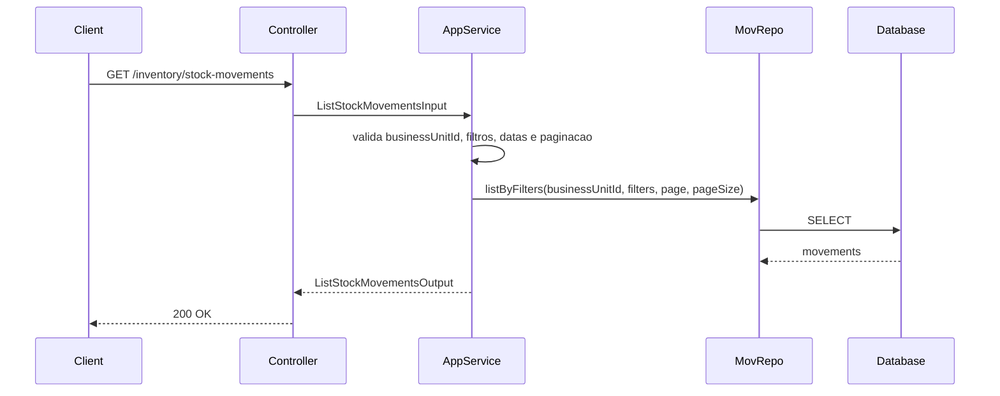
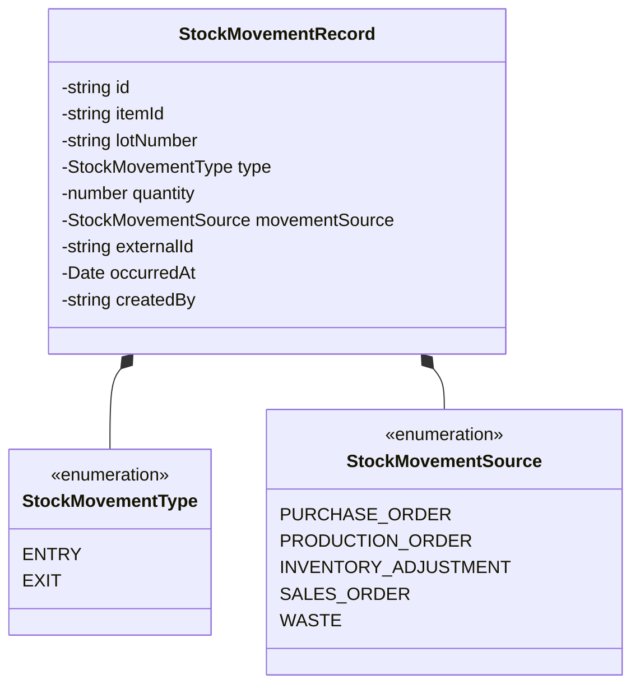
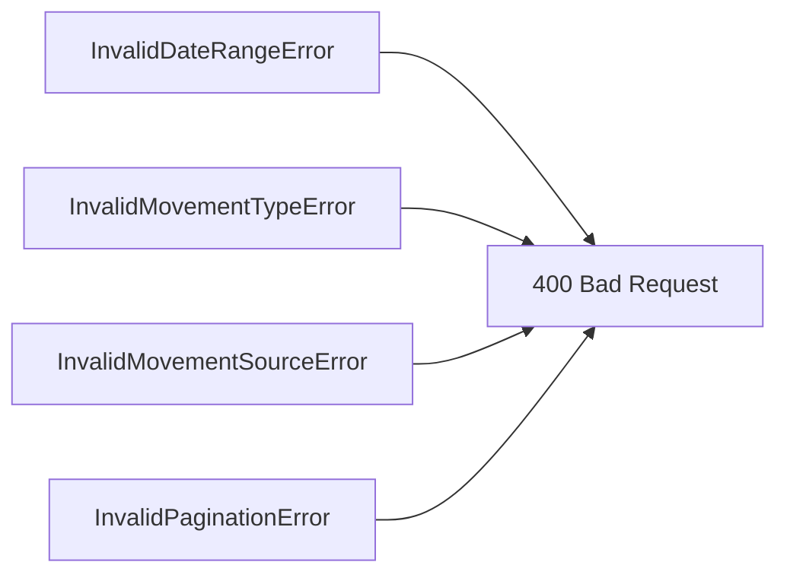

# Design: List Stock Movements

**Created**: 2026-01-12  
**Spec**: [./spec.md](./spec.md)  
**Project**: [../../../project.md](../../../project.md)

---

## Overview

A capability List Stock Movements consulta o historico imutavel de entradas e saidas de estoque com filtros e paginacao.
O Application Service valida `businessUnitId` como escopo obrigatorio, filtros, intervalo de datas e parametros de pagina antes de consultar o repositorio.
A complexidade e baixa, focada em leitura ordenada e consistente.

---

## Component Map

### Domain Layer

| Tipo | Nome | Responsabilidade |
|------|------|------------------|
| Entity | `StockMovementRecord` | Registro de movimentacao para leitura |
| Value Object | `BusinessUnitId` | Identificador da unidade |
| Value Object | `StockMovementType` | Tipo (`ENTRY`, `EXIT`) |
| Value Object | `StockMovementSource` | Origem da movimentacao |
| Repository Interface | `StockMovementRepository` | Consulta de movimentacoes |

### Application Layer

| Tipo | Nome | Responsabilidade |
|------|------|------------------|
| App Service | `ListStockMovementsService` | Orquestra a listagem de historico |
| Input DTO | `ListStockMovementsInput` | Escopo (`businessUnitId`), filtros e pagina |
| Output DTO | `ListStockMovementsOutput` | Lista paginada de movimentacoes |

### Infrastructure Layer

| Tipo | Nome | Responsabilidade |
|------|------|------------------|
| Repository Impl | `PrismaStockMovementRepository` | Implementa `StockMovementRepository` |
| Mapper | `StockMovementMapper` | Converte Domain <-> Prisma |

### Presentation Layer

| Tipo | Nome | Responsabilidade |
|------|------|------------------|
| Controller | `StockMovementController` | Exposicao HTTP da listagem |

---

## Dependency Graph



---

## Data Flow

### Fluxo: Listar Movimentacoes



**Transformacoes de dados:**

| Etapa | De | Para |
|-------|----|----- |
| Controller -> AppService | Query params | ListStockMovementsInput |
| AppService -> Domain | DTO | StockMovementRecord[] |
| Repository -> DB | Query | Prisma Models |

---

## Entity Structure

### StockMovementRecord



---

## Repository Operations

| Operacao | Descricao | Usada por |
|----------|-----------|-----------|
| `StockMovementRepository.listByFilters(businessUnitId, filters, page, pageSize)` | Lista movimentacoes por unidade com filtros | ListStockMovementsService |

---

## Database Model

```mermaid
erDiagram
    STOCK_MOVEMENTS {
        varchar(36) id PK
        varchar(36) business_unit_id
        varchar(36) item_id
        varchar(80) lot_number
        varchar(10) type
        decimal(18,4) quantity
        varchar(30) movement_source
        varchar(60) external_id
        timestamp occurred_at
        varchar(36) created_by
        timestamp created_at
    }
```

---

## API Endpoints

| Metodo | Path | Operacao | Sucesso | Erros |
|--------|------|----------|---------|-------|
| GET | `/inventory/stock-movements` | Listar movimentacoes | 200 | 400 |

---

## Error Handling



| Erro de Dominio | Quando Ocorre | HTTP Status | Codigo |
|-----------------|---------------|-------------|--------|
| `InvalidDateRangeError` | data inicial > final | 400 | `INVALID_DATE_RANGE` |
| `InvalidMovementTypeError` | movementType invalido | 400 | `INVALID_MOVEMENT_TYPE` |
| `InvalidMovementSourceError` | movementSource invalido | 400 | `INVALID_MOVEMENT_SOURCE` |
| `InvalidPaginationError` | page < 1 ou pageSize > 200 | 400 | `INVALID_PAGINATION` |

---

## Technical Decisions

### Decisao 1: Ordenacao cronologica com desempate por id

**Contexto**: A spec exige ordenacao por occurredAt asc e desempate por id.

**Decisao**: Implementar ordenacao no repository com `ORDER BY occurred_at ASC, id ASC`.

**Justificativa**: Garante retorno deterministico para paginacao.

---

### Decisao 2: Paginacao padrao no repository

**Contexto**: Page e pageSize sao parametros obrigatorios com limites.

**Decisao**: Aplicar default `pageSize = 50` e limitar a 200 no Application Service.

**Justificativa**: Evita consultas pesadas e padroniza respostas.

---

## Implementation Notes

- Converter datas ISO-8601 para UTC quando timezone ausente.
- Exigir `businessUnitId` como filtro obrigatorio de escopo.
- Validar `movementType` e `movementSource` contra enums suportados.
- Retornar lista vazia quando nao houver movimentacoes para os filtros.
- Incluir `externalId` apenas quando existir.

---
