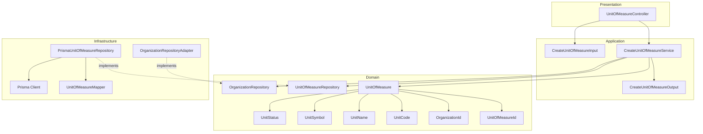
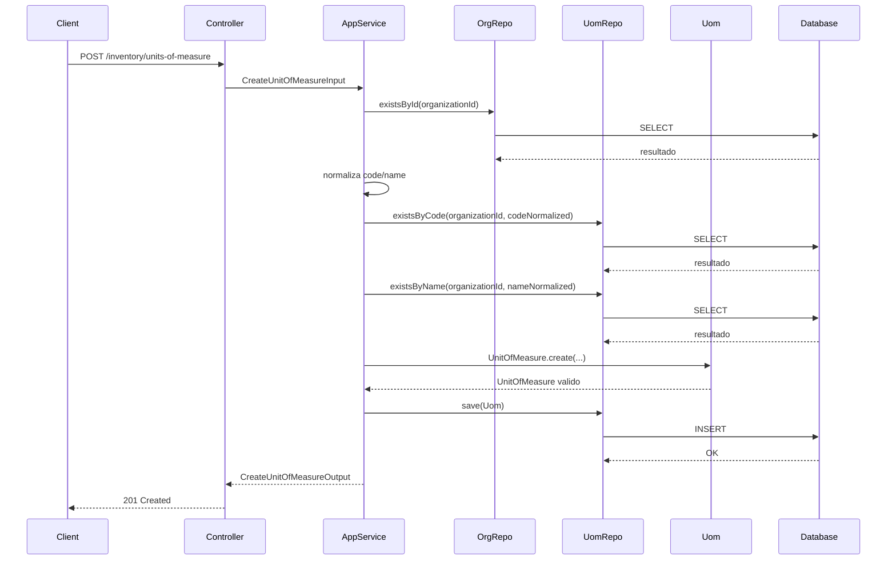
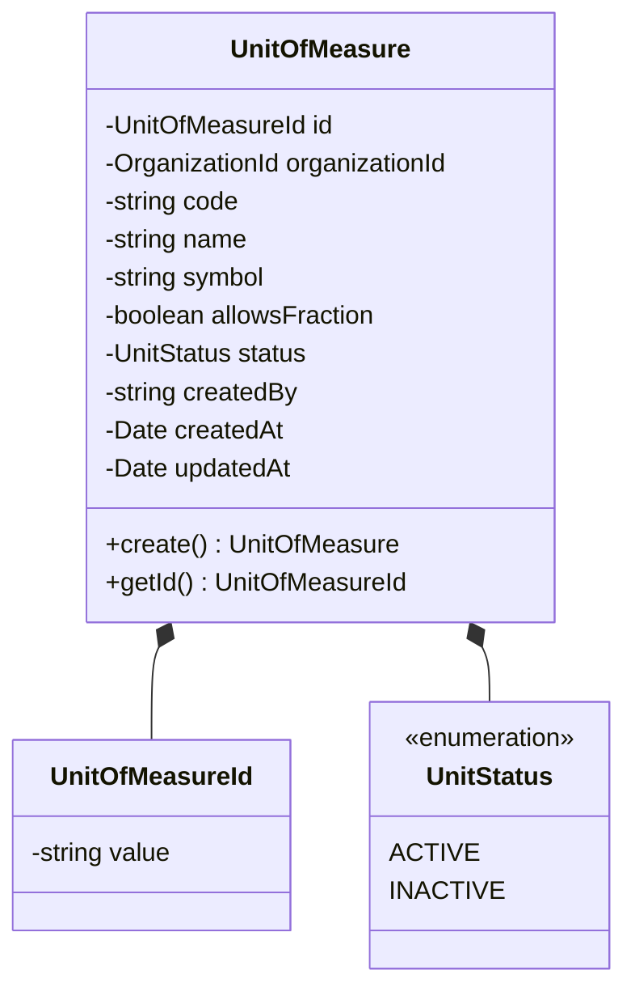
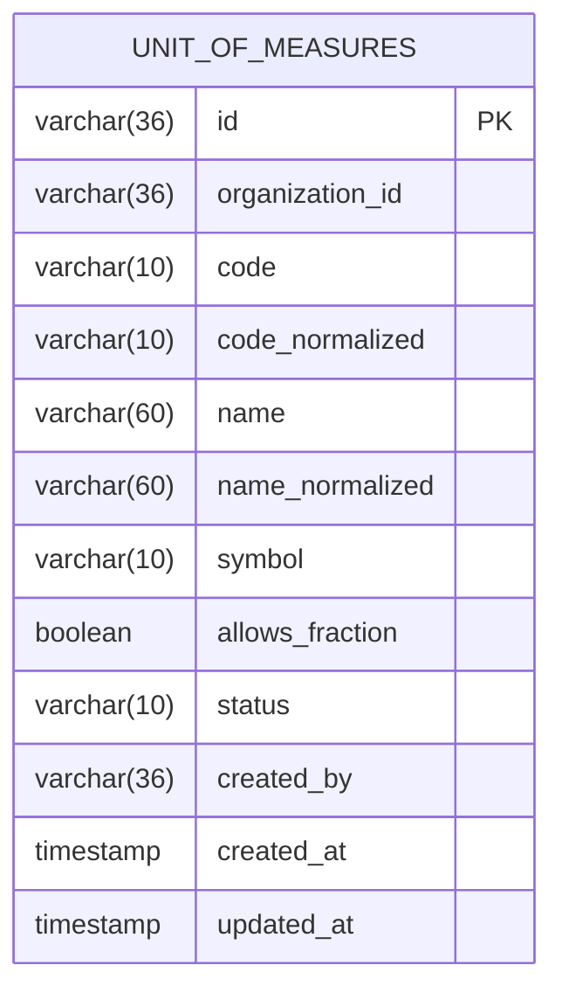
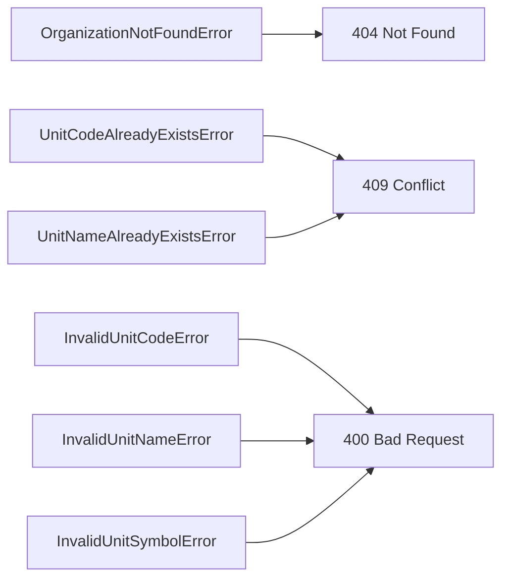

# Design: Create Unit of Measure

**Created**: 2026-01-12  
**Spec**: [./spec.md](./spec.md)  
**Project**: [../../../project.md](../../../project.md)

---

## Overview

A capability Create Unit of Measure cadastra unidades de medida padronizadas por organizacao.
O Application Service valida a existencia da organizacao, normaliza code e name e garante unicidade case-insensitive.
A complexidade e baixa, com foco em validacoes de formato e persistencia simples.

---

## Component Map

### Domain Layer

| Tipo | Nome | Responsabilidade |
|------|------|------------------|
| Entity | `UnitOfMeasure` | Unidade de medida do catalogo |
| Value Object | `UnitOfMeasureId` | Identificador unico |
| Value Object | `OrganizationId` | Identificador da organizacao |
| Value Object | `UnitCode` | Codigo validado e normalizado |
| Value Object | `UnitName` | Nome validado e normalizado |
| Value Object | `UnitSymbol` | Simbolo validado |
| Value Object | `UnitStatus` | Status (`ACTIVE`, `INACTIVE`) |
| Repository Interface | `UnitOfMeasureRepository` | Persistencia e consultas |
| Repository Interface | `OrganizationRepository` | Consulta organizacao (port) |

### Application Layer

| Tipo | Nome | Responsabilidade |
|------|------|------------------|
| App Service | `CreateUnitOfMeasureService` | Orquestra a criacao da unidade |
| Input DTO | `CreateUnitOfMeasureInput` | Dados de entrada |
| Output DTO | `CreateUnitOfMeasureOutput` | Dados retornados apos criacao |

### Infrastructure Layer

| Tipo | Nome | Responsabilidade |
|------|------|------------------|
| Repository Impl | `PrismaUnitOfMeasureRepository` | Implementa `UnitOfMeasureRepository` |
| Port Adapter | `OrganizationRepositoryAdapter` | Implementa `OrganizationRepository` |
| Mapper | `UnitOfMeasureMapper` | Converte Domain <-> Prisma |

### Presentation Layer

| Tipo | Nome | Responsabilidade |
|------|------|------------------|
| Controller | `UnitOfMeasureController` | Exposicao HTTP do caso de uso |

---

## Dependency Graph

---

## Data Flow

### Fluxo: Criar Unidade de Medida

**Transformacoes de dados:**

| Etapa | De | Para |
|-------|----|----- |
| Controller -> AppService | JSON body | CreateUnitOfMeasureInput |
| AppService -> Domain | DTO | UnitOfMeasure |
| Repository -> DB | Entity | Prisma Model |

---

## Entity Structure

### UnitOfMeasure

**Propriedades:**

| Propriedade | Tipo | Mutavel? | Regras |
|-------------|------|----------|--------|
| `id` | UnitOfMeasureId | Nao | Gerado internamente |
| `organizationId` | OrganizationId | Nao | Obrigatorio |
| `code` | string | Nao | 1-10, letras/numeros, sem espacos |
| `name` | string | Nao | 2-60, unico por organizacao |
| `symbol` | string | Nao | 1-10 |
| `allowsFraction` | boolean | Nao | Obrigatorio |
| `status` | UnitStatus | Nao | Inicia como ACTIVE |
| `createdBy` | string | Nao | Obrigatorio |
| `createdAt` | Date | Nao | Automatico |
| `updatedAt` | Date | Sim | Atualizado em mudancas futuras |

**Comportamentos:**

| Metodo | Regras |
|--------|--------|
| `create` | Valida code, name e symbol |

---

## Repository Operations

| Operacao | Descricao | Usada por |
|----------|-----------|-----------|
| `OrganizationRepository.existsById(id)` | Verifica existencia da organizacao | CreateUnitOfMeasureService |
| `UnitOfMeasureRepository.existsByCode(orgId, code)` | Verifica duplicidade de code | CreateUnitOfMeasureService |
| `UnitOfMeasureRepository.existsByName(orgId, name)` | Verifica duplicidade de name | CreateUnitOfMeasureService |
| `UnitOfMeasureRepository.save(unit)` | Persiste unidade | CreateUnitOfMeasureService |

---

## Database Model

### Tabela: `unit_of_measures`

| Coluna | Tipo | Constraints |
|--------|------|-------------|
| `id` | VARCHAR(36) | PK |
| `organization_id` | VARCHAR(36) | NOT NULL |
| `code` | VARCHAR(10) | NOT NULL |
| `code_normalized` | VARCHAR(10) | NOT NULL, UNIQUE(organization_id + code_normalized) |
| `name` | VARCHAR(60) | NOT NULL |
| `name_normalized` | VARCHAR(60) | NOT NULL, UNIQUE(organization_id + name_normalized) |
| `symbol` | VARCHAR(10) | NOT NULL |
| `allows_fraction` | BOOLEAN | NOT NULL |
| `status` | VARCHAR(10) | NOT NULL |
| `created_by` | VARCHAR(36) | NOT NULL |
| `created_at` | TIMESTAMP | NOT NULL, DEFAULT now() |
| `updated_at` | TIMESTAMP | NULL |

---

## API Endpoints

| Metodo | Path | Operacao | Sucesso | Erros |
|--------|------|----------|---------|-------|
| POST | `/inventory/units-of-measure` | Criar unidade | 201 | 400, 404, 409 |

---

## Error Handling

| Erro de Dominio | Quando Ocorre | HTTP Status | Codigo |
|-----------------|---------------|-------------|--------|
| `OrganizationNotFoundError` | organizationId inexistente | 404 | `ORGANIZATION_NOT_FOUND` |
| `UnitCodeAlreadyExistsError` | code duplicado na organizacao | 409 | `UNIT_CODE_ALREADY_EXISTS` |
| `UnitNameAlreadyExistsError` | name duplicado na organizacao | 409 | `UNIT_NAME_ALREADY_EXISTS` |
| `InvalidUnitCodeError` | code fora do formato | 400 | `INVALID_UNIT_CODE` |
| `InvalidUnitNameError` | name fora do tamanho | 400 | `INVALID_UNIT_NAME` |
| `InvalidUnitSymbolError` | symbol fora do tamanho | 400 | `INVALID_UNIT_SYMBOL` |

---

## Technical Decisions

### Decisao 1: Normalizacao de code e name para unicidade

**Contexto**: Unicidade deve ser case-insensitive.

**Decisao**: Persistir `code_normalized` (uppercase) e `name_normalized` (lowercase + trim).

**Justificativa**: Evita comparacoes complexas e garante unicidade no banco.

---

### Decisao 2: Organizacao validada via port

**Contexto**: A unidade pertence a organizacao, mas o contexto Organization e separado.

**Decisao**: `CreateUnitOfMeasureService` consulta `OrganizationRepository` (port) antes de criar.

**Justificativa**: Mantem desacoplamento entre contextos.

---

## Implementation Notes

- Normalizar `code` com trim + uppercase e `name` com trim + lowercase.
- Validar `code` apenas com letras e numeros, sem espacos.
- `status` inicial deve ser `ACTIVE`.
- Criar indices unicos em `(organization_id, code_normalized)` e `(organization_id, name_normalized)`.

---
