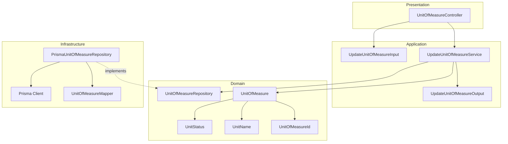
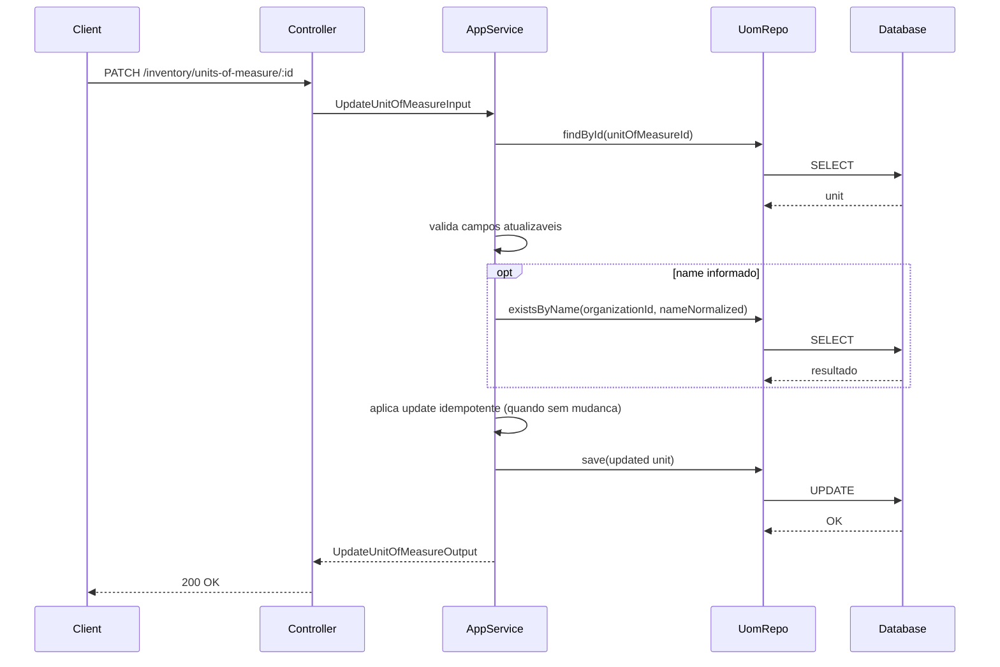
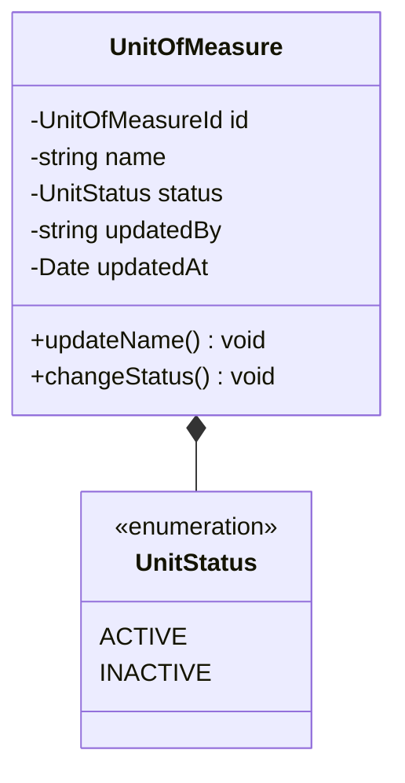
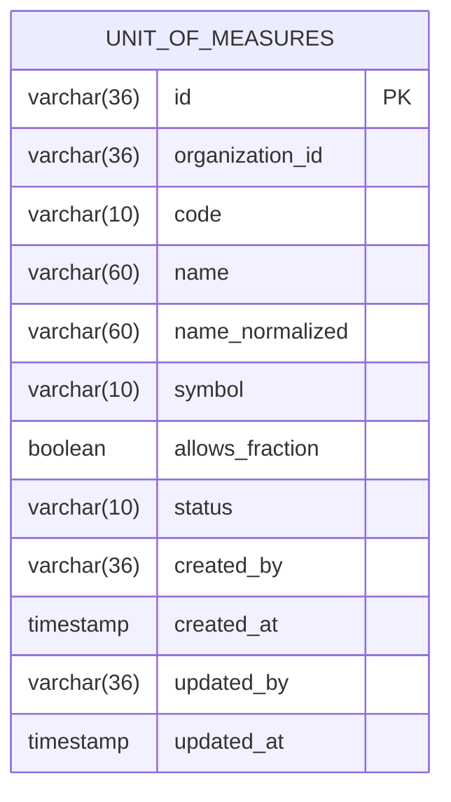
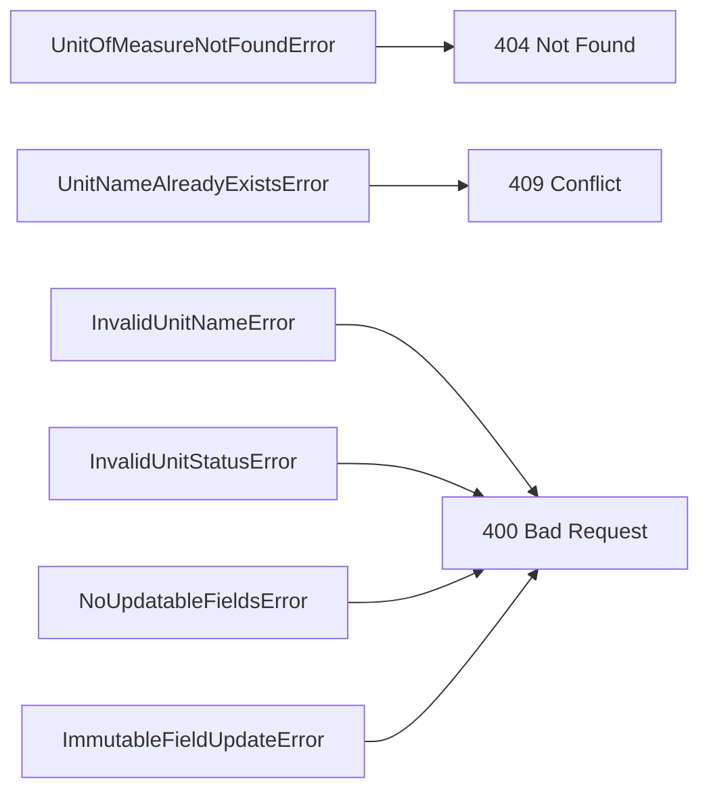

# Design: Update/Deactivate Unit of Measure

**Created**: 2026-01-12  
**Spec**: [./spec.md](./spec.md)  
**Project**: [../../../project.md](../../../project.md)

---

## Overview

A capability Update/Deactivate Unit of Measure permite alterar o nome exibido e o status da unidade de medida sem remover registros.
O Application Service valida existencia, unicidade de nome e idempotencia, bloqueando mudancas em campos imutaveis.
A complexidade e baixa, focada em validacoes e atualizacao controlada.

---

## Component Map

### Domain Layer

| Tipo | Nome | Responsabilidade |
|------|------|------------------|
| Entity | `UnitOfMeasure` | Unidade de medida do catalogo |
| Value Object | `UnitOfMeasureId` | Identificador unico |
| Value Object | `UnitName` | Nome validado e normalizado |
| Value Object | `UnitStatus` | Status (`ACTIVE`, `INACTIVE`) |
| Repository Interface | `UnitOfMeasureRepository` | Persistencia e consultas |

### Application Layer

| Tipo | Nome | Responsabilidade |
|------|------|------------------|
| App Service | `UpdateUnitOfMeasureService` | Orquestra atualizacao e desativacao |
| Input DTO | `UpdateUnitOfMeasureInput` | Dados de entrada |
| Output DTO | `UpdateUnitOfMeasureOutput` | Unidade atualizada |

### Infrastructure Layer

| Tipo | Nome | Responsabilidade |
|------|------|------------------|
| Repository Impl | `PrismaUnitOfMeasureRepository` | Implementa `UnitOfMeasureRepository` |
| Mapper | `UnitOfMeasureMapper` | Converte Domain <-> Prisma |

### Presentation Layer

| Tipo | Nome | Responsabilidade |
|------|------|------------------|
| Controller | `UnitOfMeasureController` | Exposicao HTTP do caso de uso |

---

## Dependency Graph

---

## Data Flow

### Fluxo: Atualizar/Desativar Unidade de Medida

**Transformacoes de dados:**

| Etapa | De | Para |
|-------|----|----- |
| Controller -> AppService | Params + body | UpdateUnitOfMeasureInput |
| AppService -> Domain | DTO | UnitOfMeasure |
| Repository -> DB | Entity | Prisma Model |

---

## Entity Structure

### UnitOfMeasure (recorte relevante)

**Comportamentos:**

| Metodo | Regras |
|--------|--------|
| `updateName` | Valida tamanho e aplica normalizacao |
| `changeStatus` | Aceita apenas ACTIVE/INACTIVE |

---

## Repository Operations

| Operacao | Descricao | Usada por |
|----------|-----------|-----------|
| `UnitOfMeasureRepository.findById(id)` | Busca unidade | UpdateUnitOfMeasureService |
| `UnitOfMeasureRepository.existsByName(orgId, name)` | Verifica duplicidade de name | UpdateUnitOfMeasureService |
| `UnitOfMeasureRepository.save(unit)` | Persiste atualizacao | UpdateUnitOfMeasureService |

---

## Database Model

---

## API Endpoints

| Metodo | Path | Operacao | Sucesso | Erros |
|--------|------|----------|---------|-------|
| PATCH | `/inventory/units-of-measure/:id` | Atualizar/desativar unidade | 200 | 400, 404, 409 |

---

## Error Handling

| Erro de Dominio | Quando Ocorre | HTTP Status | Codigo |
|-----------------|---------------|-------------|--------|
| `UnitOfMeasureNotFoundError` | id inexistente | 404 | `UNIT_OF_MEASURE_NOT_FOUND` |
| `UnitNameAlreadyExistsError` | name duplicado na organizacao | 409 | `UNIT_NAME_ALREADY_EXISTS` |
| `InvalidUnitNameError` | name fora do tamanho | 400 | `INVALID_UNIT_NAME` |
| `InvalidUnitStatusError` | status fora de ACTIVE/INACTIVE | 400 | `INVALID_UNIT_STATUS` |
| `NoUpdatableFieldsError` | nenhum campo atualizavel informado | 400 | `NO_UPDATABLE_FIELDS` |
| `ImmutableFieldUpdateError` | tentativa de alterar code/symbol/allowsFraction | 400 | `IMMUTABLE_FIELD_UPDATE` |

---

## Technical Decisions

### Decisao 1: Atualizacao idempotente

**Contexto**: O sistema deve retornar estado atual quando nao ha mudanca.

**Decisao**: Se `name` e `status` forem iguais, retornar sem atualizar `updatedAt`.

**Justificativa**: Mantem idempotencia e evita ruido em auditoria.

---

### Decisao 2: Campos imutaveis bloqueados na aplicacao

**Contexto**: `code`, `symbol` e `allowsFraction` nao podem mudar.

**Decisao**: O controller rejeita payloads com esses campos antes do service.

**Justificativa**: Falha rapida e evita alteracoes indevidas.

---

## Implementation Notes

- Normalizar `name` com trim + lowercase para validar unicidade.
- Ao atualizar status para INACTIVE, nao alterar itens existentes.
- Retornar `status` atualizado no output.
- Manter `updatedBy` obrigatorio quando houver alteracao real.

---
