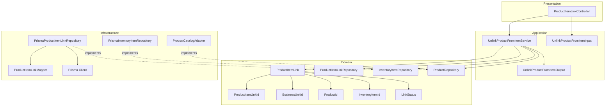
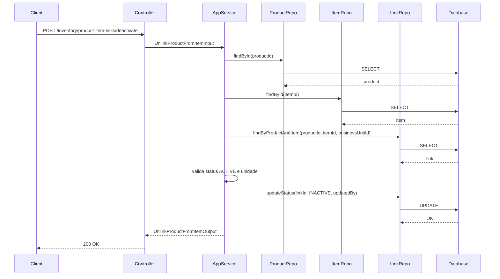
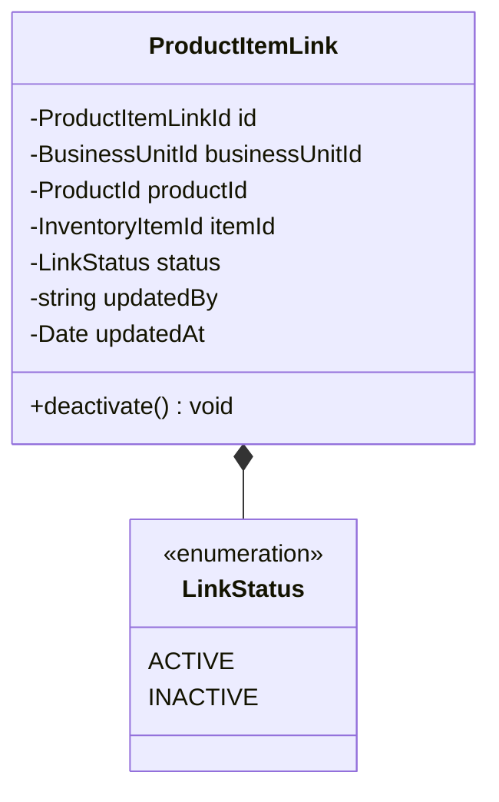
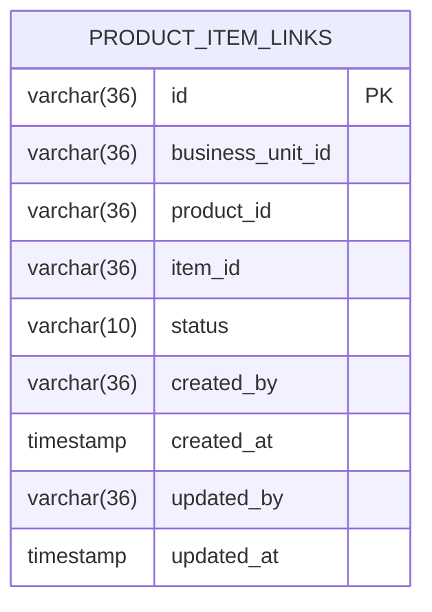
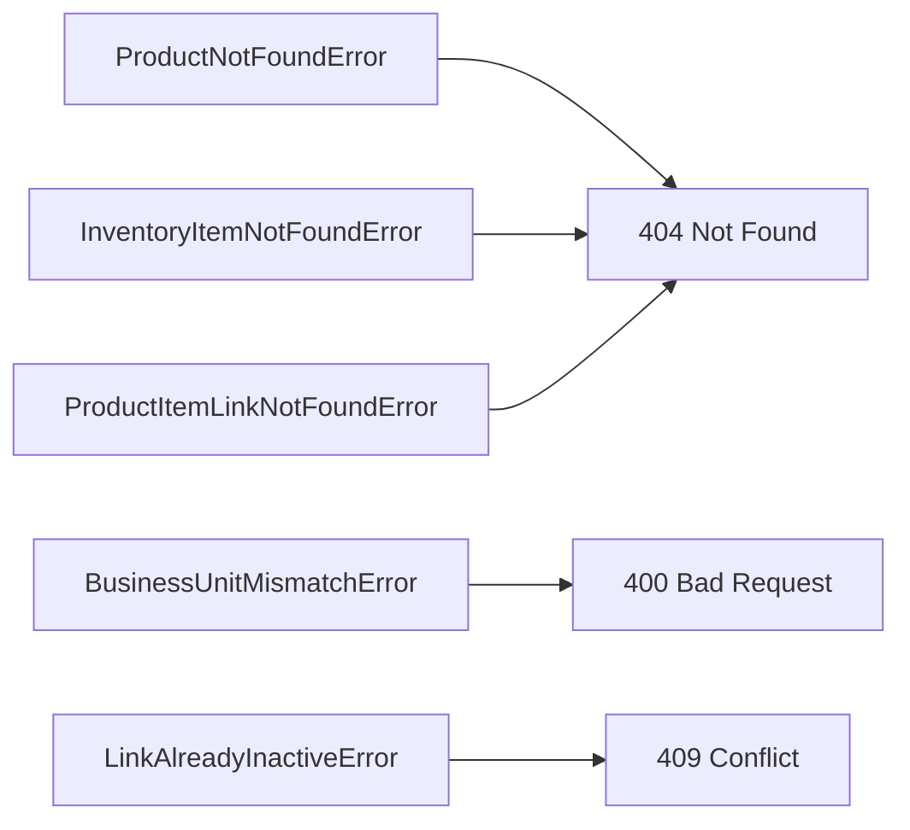

# Design: Unlink Product from Inventory Item

**Created**: 2026-01-12  
**Spec**: [./spec.md](./spec.md)  
**Project**: [../../../project.md](../../../project.md)

---

## Overview

A capability Unlink Product from Inventory Item desativa um vinculo existente entre produto e item, preservando historico.
O Application Service valida existencia de produto, item e vinculo na unidade informada e aplica a transicao para INACTIVE.
A complexidade e baixa, com foco em validacao e atualizacao idempotente.

---

## Component Map

### Domain Layer

| Tipo | Nome | Responsabilidade |
|------|------|------------------|
| Entity | `ProductItemLink` | Vinculo entre produto e item com status |
| Value Object | `ProductItemLinkId` | Identificador unico do vinculo |
| Value Object | `BusinessUnitId` | Identificador da unidade |
| Value Object | `ProductId` | Identificador do produto |
| Value Object | `InventoryItemId` | Identificador do item |
| Value Object | `LinkStatus` | Estado do vinculo (`ACTIVE`, `INACTIVE`) |
| Repository Interface | `ProductItemLinkRepository` | Persistencia e consultas de vinculo |
| Repository Interface | `InventoryItemRepository` | Consulta item de estoque |
| Repository Interface | `ProductRepository` | Consulta produto no modulo products (port) |

### Application Layer

| Tipo | Nome | Responsabilidade |
|------|------|------------------|
| App Service | `UnlinkProductFromItemService` | Orquestra a desativacao do vinculo |
| Input DTO | `UnlinkProductFromItemInput` | Dados de entrada |
| Output DTO | `UnlinkProductFromItemOutput` | Dados retornados apos desativacao |

### Infrastructure Layer

| Tipo | Nome | Responsabilidade |
|------|------|------------------|
| Repository Impl | `PrismaProductItemLinkRepository` | Implementa `ProductItemLinkRepository` |
| Repository Impl | `PrismaInventoryItemRepository` | Implementa `InventoryItemRepository` |
| Port Adapter | `ProductCatalogAdapter` | Implementa `ProductRepository` |
| Mapper | `ProductItemLinkMapper` | Converte Domain <-> Prisma |

### Presentation Layer

| Tipo | Nome | Responsabilidade |
|------|------|------------------|
| Controller | `ProductItemLinkController` | Exposicao HTTP do caso de uso |

---

## Dependency Graph

---

## Data Flow

### Fluxo: Desvincular Produto de Item

**Transformacoes de dados:**

| Etapa | De | Para |
|-------|----|----- |
| Controller -> AppService | JSON body | UnlinkProductFromItemInput |
| AppService -> Domain | DTO | ProductItemLink |
| Repository -> DB | Entity | Prisma Model |

---

## Entity Structure

### ProductItemLink (recorte relevante)

---

## Repository Operations

| Operacao | Descricao | Usada por |
|----------|-----------|-----------|
| `ProductRepository.findById(id)` | Busca produto e businessUnitId | UnlinkProductFromItemService |
| `InventoryItemRepository.findById(id)` | Busca item e businessUnitId | UnlinkProductFromItemService |
| `ProductItemLinkRepository.findByProductAndItem(productId, itemId, businessUnitId)` | Busca vinculo | UnlinkProductFromItemService |
| `ProductItemLinkRepository.updateStatus(id, status, updatedBy)` | Desativa vinculo | UnlinkProductFromItemService |

---

## Database Model

---

## API Endpoints

| Metodo | Path | Operacao | Sucesso | Erros |
|--------|------|----------|---------|-------|
| POST | `/inventory/product-item-links/deactivate` | Desvincular produto de item | 200 | 400, 404, 409 |

---

## Error Handling

| Erro de Dominio | Quando Ocorre | HTTP Status | Codigo |
|-----------------|---------------|-------------|--------|
| `ProductNotFoundError` | productId inexistente | 404 | `PRODUCT_NOT_FOUND` |
| `InventoryItemNotFoundError` | itemId inexistente | 404 | `INVENTORY_ITEM_NOT_FOUND` |
| `ProductItemLinkNotFoundError` | vinculo inexistente | 404 | `PRODUCT_ITEM_LINK_NOT_FOUND` |
| `BusinessUnitMismatchError` | vinculo nao pertence a unidade | 400 | `PRODUCT_ITEM_BUSINESS_UNIT_MISMATCH` |
| `LinkAlreadyInactiveError` | vinculo ja inativo | 409 | `LINK_ALREADY_INACTIVE` |

---

## Technical Decisions

### Decisao 1: Desativacao preserva historico

**Contexto**: O vinculo nao deve ser removido para manter rastreabilidade.

**Decisao**: Atualizar `status` para `INACTIVE` e manter o registro.

**Justificativa**: Permite reativacao futura e auditoria de vinculos.

---

### Decisao 2: Validar existencia de produto e item antes do vinculo

**Contexto**: A spec exige erro especifico para produto/item inexistente.

**Decisao**: Consultar `ProductRepository` e `InventoryItemRepository` antes de buscar o vinculo.

**Justificativa**: Garante mensagens corretas e evita ambiguidade.

---

## Implementation Notes

- Rejeitar quando o vinculo estiver `INACTIVE` com erro especifico.
- Garantir que `updatedBy` seja obrigatorio na desativacao.
- Manter `createdAt` inalterado ao desativar.

---
