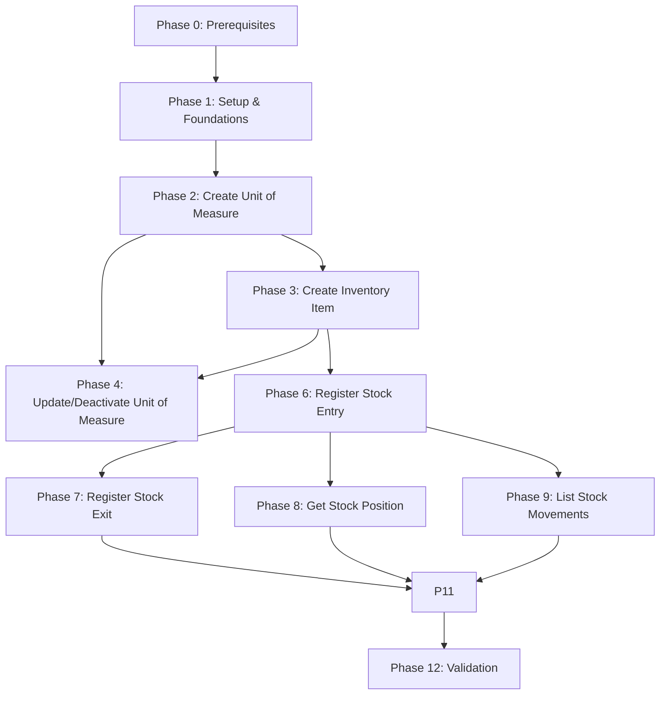

# Plan: Inventory Module

**Created**: 2026-01-17  
**Spec**: [./inventory.md](./inventory.md)  
**Design**: [./01-create-item/design.md](./01-create-item/design.md), [./03-register-stock-entry/design.md](./03-register-stock-entry/design.md), [./04-register-stock-exit/design.md](./04-register-stock-exit/design.md), [./05-get-stock-position/design.md](05-get-stock-position/design.md), [./06-list-stock-movements/design.md](./06-list-stock-movements/design.md), [./07-create-unit-of-measure/design.md](./07-create-unit-of-measure/design.md), [./08-update-deactivate-unit-of-measure/design.md](./08-update-deactivate-unit-of-measure/design.md)  
**Project**: [../../project.md](../../project.md)

---

<!--
  ======================================================================
  PLANO DE EXECUCAO - Define QUANDO fazer cada task

  Este documento contem APENAS tasks de execucao.
  Decisoes de negocio -> spec.md
  Decisoes tecnicas -> design.md
  Padroes do projeto -> project.md

  REGRAS PARA TASKS:
  - Atomicas: uma task = uma unidade de trabalho
  - Verificaveis: deve ser possivel validar se esta completa
  - Independentes: minimizar dependencias entre tasks
  ======================================================================
-->

## Phase 0: Prerequisites

**Objetivo**: Garantir prerequisitos de plataforma (erros e bootstrap)

| ID | Task | Verificacao |
|----|------|-------------|
| T001 | Garantir base de erros (BaseAppError/DomainError/ApplicationError) e catalogo HTTP central; se inexistentes, criar base | Catalogo central existe e `npm run build` executa sem erro |
| T002 | Garantir bootstrap Fastify base para registro de rotas por modulo; se inexistente, criar base | Bootstrap existe e `npm run build` executa sem erro |

**Checkpoint**: Prerequisitos de plataforma prontos

---

## Phase 1: Setup & Foundations

**Objetivo**: Preparar contexto inventory (estrutura, Prisma e testes)

| ID | Task | Verificacao |
|----|------|-------------|
| T003 | Criar estrutura base do modulo `src/modules/inventory` (domain/application/presentation/infrastructure/di/database) + exports `index.ts` | `npm run build` executa sem erro |
| T004 | Adicionar setup Prisma do contexto inventory (schema, datasource, env `DATABASE_URL_INVENTORY`, client factory, env example) | `npx prisma validate --schema src/modules/inventory/infrastructure/database/prisma/schema.prisma` passa |
| T005 | Configurar infra local do DB inventory (docker-compose + variavel `DATABASE_URL_INVENTORY` na app) | `docker compose config -q` executa sem erro |
| T006 | Preparar scaffolding de testes do contexto inventory (unit/integration + helpers Prisma/factories) | `npm test -- --listTests` lista os novos caminhos |

**Checkpoint**: Estrutura base, Prisma e scaffolding de testes prontos

---

## Phase 2: Capability 07 - Create Unit of Measure

**Objetivo**: Criar unidades de medida do catalogo do inventory

| ID | Task | Verificacao |
|----|------|-------------|
| T007 | Criar migration e modelos Prisma para `unit_of_measures` (incluindo `allowsFraction`, `createdBy`, `createdAt`, `updatedAt` + indices) | `npx prisma migrate dev --schema src/modules/inventory/infrastructure/database/prisma/schema.prisma` executa sem erro |
| T008 | Implementar `UnitOfMeasure` + VOs (`UnitOfMeasureId`, `OrganizationId`, `UnitCode`, `UnitName`, `UnitSymbol`, `UnitStatus`) e campos auditaveis/`allowsFraction` com testes unitarios | Testes unitarios passam |
| T009 | Definir interfaces `UnitOfMeasureRepository` e `OrganizationRepository` conforme design | TypeScript compila |
| T010 | Implementar `CreateUnitOfMeasureService` + DTOs com testes unitarios (organizacao valida, unicidade code/name, `allowsFraction`, `createdBy`) | Testes unitarios passam |
| T011 | Implementar `UnitOfMeasureMapper` e `PrismaUnitOfMeasureRepository` (save, existsByCode, existsByName) incluindo audit fields + teste de integracao da capability | Teste de integracao passa |
| T012 | Implementar `OrganizationRepositoryAdapter` (port) com testes unitarios | Testes unitarios passam |
| T013 | Implementar `UnitOfMeasureController` e rota POST `/inventory/units-of-measure` com mapeamento de erros + teste unitario | Teste unitario passa |
| T014 | Atualizar catalogo HTTP central com erros da capability Create Unit of Measure | Catalogo central contem os codigos do modulo inventory |

**Checkpoint**: Create Unit of Measure funcional e testado

---

## Phase 3: Capability 01 - Create Inventory Item

**Objetivo**: Criar item de estoque com validacoes de unidade e unidade de medida

| ID | Task | Verificacao |
|----|------|-------------|
| T015 | Criar migration e modelo Prisma para `inventory_items` (coluna `name_normalized`, indice unico, FK para `unit_of_measures` e audit fields) | `npx prisma migrate dev --schema src/modules/inventory/infrastructure/database/prisma/schema.prisma` executa sem erro |
| T016 | Implementar `InventoryItem` + VOs (`InventoryItemId`, `OrganizationId`, `BusinessUnitId`, `InventoryItemName`, `InventoryItemType`, `UnitOfMeasureId`) e `createdBy` com testes unitarios | Testes unitarios passam |
| T017 | Definir/atualizar interfaces `InventoryItemRepository`, `BusinessUnitRepository` (port) e `UnitOfMeasureRepository` (findById) | TypeScript compila |
| T018 | Implementar `CreateInventoryItemService` + DTOs com testes unitarios (validacao BU/org, UoM ativa, unicidade name, requiresExpiration, `createdBy`) | Testes unitarios passam |
| T019 | Implementar `InventoryItemMapper` e `PrismaInventoryItemRepository` (save, existsByNameAndBusinessUnitId, findById) incluindo audit fields + teste de integracao da capability | Teste de integracao passa |
| T020 | Estender `PrismaUnitOfMeasureRepository` com `findById` + testes unitarios | Testes unitarios passam |
| T021 | Implementar `OrganizationBusinessUnitAdapter` (port) com testes unitarios | Testes unitarios passam |
| T022 | Implementar `InventoryItemController` e rota POST `/inventory/items` com mapeamento de erros + teste unitario | Teste unitario passa |
| T023 | Atualizar catalogo HTTP central com erros da capability Create Inventory Item | Catalogo central contem os codigos do modulo inventory |

**Checkpoint**: Create Inventory Item funcional e testado

---

## Phase 4: Capability 08 - Update/Deactivate Unit of Measure

**Objetivo**: Atualizar nome e status de unidades de medida

| ID | Task | Verificacao |
|----|------|-------------|
| T024 | Estender `UnitOfMeasure` com `updateName`/`changeStatus` e erros (name/status/imutaveis, `updatedBy`) com testes unitarios | Testes unitarios passam |
| T025 | Estender `UnitOfMeasureRepository` + `PrismaUnitOfMeasureRepository` (save update com `updatedBy/updatedAt`) com testes unitarios | Testes unitarios passam |
| T026 | Implementar `UpdateUnitOfMeasureService` + DTOs com testes unitarios (idempotencia sem alterar `updatedBy/updatedAt`, campos imutaveis) | Testes unitarios cobrem idempotencia e audit fields |
| T027 | Implementar rota PATCH `/inventory/units-of-measure/:id` no `UnitOfMeasureController` com mapeamento de erros + teste unitario | Teste unitario passa |
| T028 | Implementar testes de integracao da capability Update/Deactivate Unit of Measure | Teste de integracao passa |
| T029 | Atualizar catalogo HTTP central com erros da capability Update/Deactivate Unit of Measure | Catalogo central contem os codigos do modulo inventory |

**Checkpoint**: Update/Deactivate Unit of Measure funcional e testado

---

## Phase 5: Capability 02 - Link Product to Item (fora de escopo)

**Objetivo**: Registrar a mudanca de escopo para o modulo de producao.

Esta capability foi movida para o modulo de producao para manter o inventory agnostico de produto.
Nao ha tarefas neste plano para essa capability.

**Checkpoint**: N/A (capability movida para producao)

---

## Phase 6: Capability 03 - Register Stock Entry

**Objetivo**: Registrar entrada de estoque com lote e movimentacao

| ID | Task | Verificacao |
|----|------|-------------|
| T038 | Criar migration e modelos Prisma para `stock_lots` e `stock_movements` (indices, constraints e campos de auditoria/`occurredAt`/`externalId`) | `npx prisma migrate dev --schema src/modules/inventory/infrastructure/database/prisma/schema.prisma` executa sem erro |
| T039 | Implementar `StockLot` e `StockMovement` + VOs (`StockLotId`, `StockMovementId`, `StockMovementType`, `StockMovementSource`) com `createdBy`, `occurredAt`, `externalId` e erros de dominio | Testes unitarios passam |
| T040 | Definir interfaces `StockLotRepository` e `StockMovementRepository` (findByLotNumber, save, incrementQuantity) e atualizar repos de item/UoM para leitura | TypeScript compila |
| T041 | Implementar `RegisterStockEntryService` + DTOs com testes unitarios (conflito de lote, expiracao, fracionamento, `createdBy`, `occurredAt`, `externalId` obrigatorio por `movementSource`) | Testes unitarios cobrem regras de audit fields e `externalId` |
| T042 | Implementar `StockLotMapper`/`StockMovementMapper` e repos Prisma com transacao (save/increment + movement) + teste de integracao | Teste de integracao passa |
| T043 | Implementar `StockEntryController` e rota POST `/inventory/stock-entries` com mapeamento de erros + teste unitario | Teste unitario passa |
| T044 | Atualizar catalogo HTTP central com erros da capability Register Stock Entry | Catalogo central contem os codigos do modulo inventory |

**Checkpoint**: Register Stock Entry funcional e testado

---

## Phase 7: Capability 04 - Register Stock Exit

**Objetivo**: Registrar saida de estoque com alocacao por lote

| ID | Task | Verificacao |
|----|------|-------------|
| T045 | Implementar `LotAllocation` e `StockExitAllocationService` (FEFO/FIFO) + erros de dominio com testes unitarios | Testes unitarios passam |
| T046 | Estender `StockLotRepository` (listAvailableLots, findByLotNumbers, decrementLots) e `StockMovementRepository.saveAll` no Prisma + testes unitarios | Testes unitarios passam |
| T047 | Implementar `RegisterStockExitService` + DTOs com testes unitarios (soma de alocacoes, vencimento, saldo insuficiente, `externalId` obrigatorio por `movementSource`, `createdBy`, `occurredAt`) | Testes unitarios cobrem regras de audit fields e `externalId` |
| T048 | Implementar `StockExitController` e rota POST `/inventory/stock-exits` com mapeamento de erros + teste unitario | Teste unitario passa |
| T049 | Implementar testes de integracao da capability Register Stock Exit | Teste de integracao passa |
| T050 | Atualizar catalogo HTTP central com erros da capability Register Stock Exit | Catalogo central contem os codigos do modulo inventory |

**Checkpoint**: Register Stock Exit funcional e testado

---

## Phase 8: Capability 05 - Get Stock Position

**Objetivo**: Consultar posicao de estoque por item ou lote

| ID | Task | Verificacao |
|----|------|-------------|
| T051 | Implementar `StockPosition` e `StockLotPosition` (modelos de leitura) com testes unitarios | Testes unitarios passam |
| T052 | Estender `InventoryItemRepository.existsById` e `StockLotRepository.listByItemId`/`findByLotNumber` com ordenacao definida | TypeScript compila |
| T053 | Implementar `GetStockPositionService` + DTOs com testes unitarios (validacao de query) | Testes unitarios passam |
| T054 | Implementar `StockPositionController` e rota GET `/inventory/stock-positions` com mapeamento de erros + teste unitario | Teste unitario passa |
| T055 | Implementar testes de integracao da capability Get Stock Position | Teste de integracao passa |
| T056 | Atualizar catalogo HTTP central com erros da capability Get Stock Position | Catalogo central contem os codigos do modulo inventory |

**Checkpoint**: Get Stock Position funcional e testado

---

## Phase 9: Capability 06 - List Stock Movements

**Objetivo**: Listar historico de movimentacoes com filtros e paginacao

| ID | Task | Verificacao |
|----|------|-------------|
| T057 | Implementar `StockMovementRecord` (modelo de leitura) com testes unitarios | Testes unitarios passam |
| T058 | Implementar `StockMovementRepository.listByFilters` (paginacao/ordenacao) no Prisma + testes unitarios | Testes unitarios passam |
| T059 | Implementar `ListStockMovementsService` + DTOs com testes unitarios (validacao de filtros e pagina) | Testes unitarios passam |
| T060 | Implementar `StockMovementController` e rota GET `/inventory/stock-movements` com mapeamento de erros + teste unitario | Teste unitario passa |
| T061 | Implementar testes de integracao da capability List Stock Movements | Teste de integracao passa |
| T062 | Atualizar catalogo HTTP central com erros da capability List Stock Movements | Catalogo central contem os codigos do modulo inventory |

**Checkpoint**: List Stock Movements funcional e testado

---

## Phase 10: Capability 09 - Unlink Product from Item (fora de escopo)

**Objetivo**: Registrar a mudanca de escopo para o modulo de producao.

Esta capability foi movida para o modulo de producao para manter o inventory agnostico de produto.
Nao ha tarefas neste plano para essa capability.

**Checkpoint**: N/A (capability movida para producao)

---

## Phase 11: DI & Integration

**Objetivo**: Integrar o modulo inventory na aplicacao

| ID | Task | Verificacao |
|----|------|-------------|
| T069 | Consolidar DI do modulo (repos/adapters/services/controllers) e registrar rotas no bootstrap | Aplicacao sobe e rotas do modulo aparecem |

**Checkpoint**: Modulo integrado e com rotas expostas

---

## Phase 12: Validation

**Objetivo**: Validar o modulo completo com a estrategia de testes

| ID | Task | Verificacao |
|----|------|-------------|
| T070 | Executar testes unitarios do contexto inventory | `npm test -- tests/unit/inventory` passa |
| T071 | Executar testes de integracao das capabilities do modulo | `npm test -- tests/integration/inventory` passa |

**Checkpoint**: Modulo validado segundo a estrategia de testes

---

## Dependencies

---

## Execution Notes

- Seguir a estrategia de testes em `specs/testing-strategy.md` (integration tests por capability sem HTTP).
- Cada task deve incluir os testes correspondentes na mesma entrega.
- As camadas devem respeitar as regras de import do `specs/project.md`.
