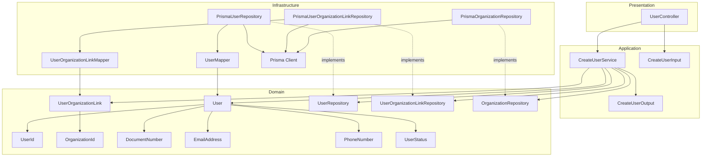
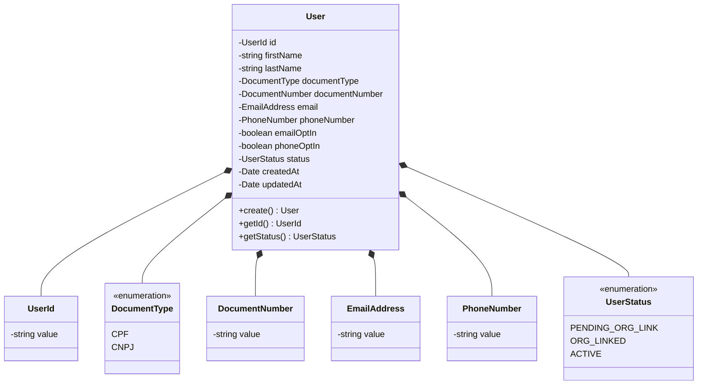
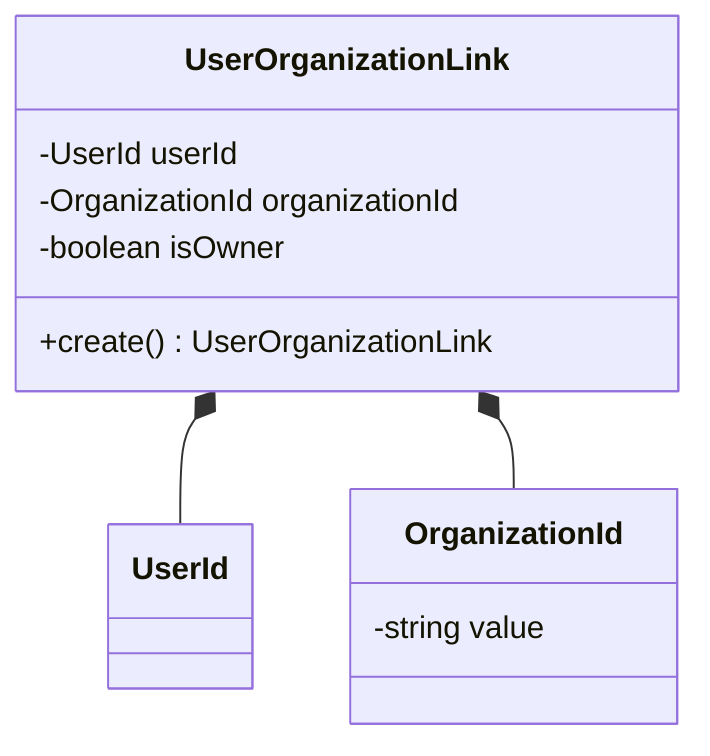
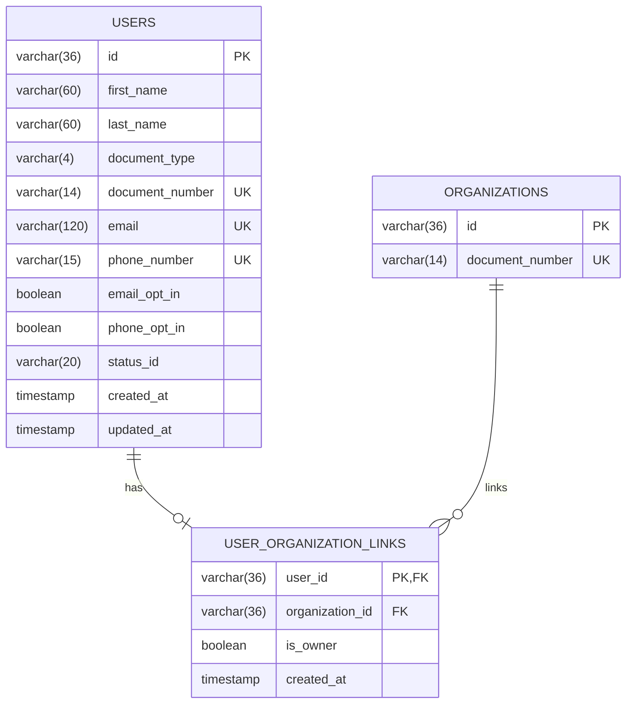
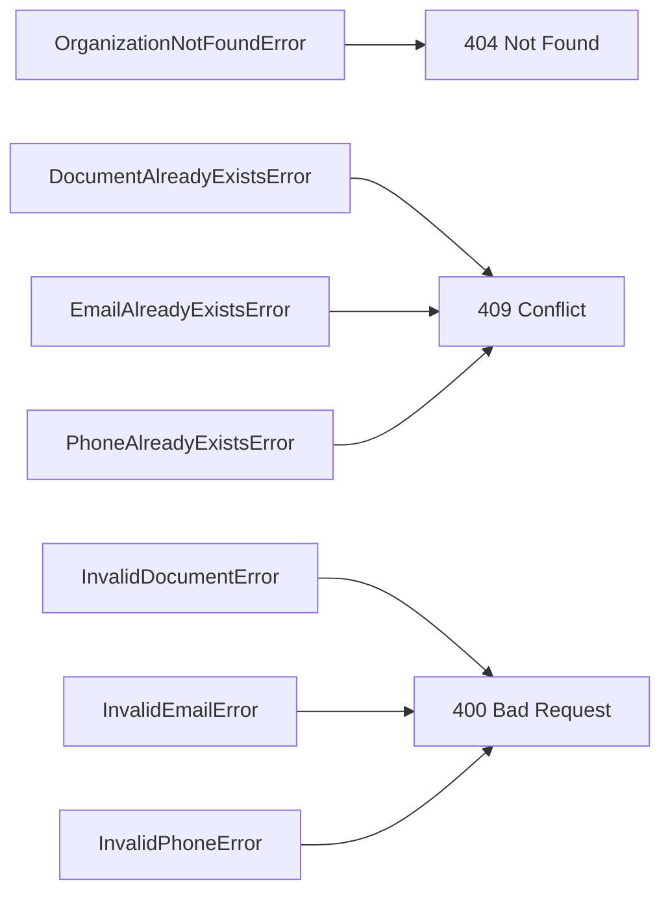

# Design: Create User

**Created**: 2026-01-08  
**Spec**: [./spec.md](./spec.md)  
**Project**: [../../../project.md](../../../project.md)

---

## Overview

A capability Create User no contexto Organization cria a identidade do usuario e, opcionalmente, o vinculo com uma organizacao existente.
A orquestracao ocorre no Application Service, que valida unicidade e regras de documento/contato, define o status inicial e persiste User e UserOrganizationLink em transacao.
A complexidade e moderada por validacoes cruzadas entre usuarios e organizacoes.

---

## Component Map

### Domain Layer

| Tipo | Nome | Responsabilidade |
|------|------|------------------|
| Entity | `User` | Identidade do usuario no contexto Organization |
| Entity | `UserOrganizationLink` | Vinculo entre usuario e organizacao |
| Value Object | `UserId` | Identificador unico do usuario |
| Value Object | `OrganizationId` | Identificador unico da organizacao |
| Value Object | `DocumentType` | Tipo do documento (CPF, CNPJ) |
| Value Object | `DocumentNumber` | Documento normalizado (apenas digitos) |
| Value Object | `EmailAddress` | Email validado e normalizado |
| Value Object | `PhoneNumber` | Celular validado e normalizado |
| Value Object | `UserStatus` | Estado do usuario (PENDING_ORG_LINK, ORG_LINKED, ACTIVE) |
| Repository Interface | `UserRepository` | Persistencia e consultas de usuario |
| Repository Interface | `UserOrganizationLinkRepository` | Persistencia do vinculo usuario-organizacao |
| Repository Interface | `OrganizationRepository` | Consultas de organizacao para validacao |

### Application Layer

| Tipo | Nome | Responsabilidade |
|------|------|------------------|
| App Service | `CreateUserService` | Orquestra a criacao do usuario |
| Input DTO | `CreateUserInput` | Dados de entrada para criacao |
| Output DTO | `CreateUserOutput` | Dados retornados apos criacao |

### Infrastructure Layer

| Tipo | Nome | Responsabilidade |
|------|------|------------------|
| Repository Impl | `PrismaUserRepository` | Implementa `UserRepository` |
| Repository Impl | `PrismaUserOrganizationLinkRepository` | Implementa `UserOrganizationLinkRepository` |
| Repository Impl | `PrismaOrganizationRepository` | Implementa `OrganizationRepository` |
| Mapper | `UserMapper` | Converte Domain ↔ Prisma |
| Mapper | `UserOrganizationLinkMapper` | Converte Domain ↔ Prisma |

### Presentation Layer

| Tipo | Nome | Responsabilidade |
|------|------|------------------|
| Controller | `UserController` | Exposicao HTTP do caso de uso |

---

## Dependency Graph



---

## Data Flow

### Fluxo: Criar Usuario

```mermaid
sequenceDiagram
    participant Client
    participant Controller
    participant AppService
    participant UserRepo
    participant OrgRepo
    participant LinkRepo
    participant User
    participant Link
    participant Database

    Client->>Controller: POST /organization/users
    Controller->>AppService: CreateUserInput

    AppService->>AppService: normaliza e valida documento, email, celular

    AppService->>UserRepo: existsByDocumentNumber(document)
    UserRepo->>Database: SELECT
    Database-->>UserRepo: resultado

    AppService->>OrgRepo: existsByDocumentNumber(document)
    OrgRepo->>Database: SELECT
    Database-->>OrgRepo: resultado

    AppService->>UserRepo: existsByEmail(email)
    UserRepo->>Database: SELECT
    Database-->>UserRepo: resultado

    AppService->>UserRepo: existsByPhoneNumber(phone)
    UserRepo->>Database: SELECT
    Database-->>UserRepo: resultado

    alt organizationId informado
        AppService->>OrgRepo: existsById(organizationId)
        OrgRepo->>Database: SELECT
        Database-->>OrgRepo: resultado
        AppService->>Link: UserOrganizationLink.create(...)
    end

    AppService->>User: User.create(status definido pela aplicacao)

    Note over AppService,Database: Persistencia em transacao
    AppService->>UserRepo: save(User)
    UserRepo->>Database: INSERT
    Database-->>UserRepo: OK

    opt link criado
        AppService->>LinkRepo: save(Link)
        LinkRepo->>Database: INSERT
        Database-->>LinkRepo: OK
    end

    AppService-->>Controller: CreateUserOutput
    Controller-->>Client: 201 Created
```

**Transformacoes de dados:**

| Etapa | De | Para |
|-------|----|------|
| Controller → AppService | JSON body | CreateUserInput |
| AppService → Domain | DTO | User, UserOrganizationLink |
| Domain → Infra | Entities | Prisma Models |

---

## Entity Structure

### User



**Propriedades:**

| Propriedade | Tipo | Mutavel? | Regras |
|-------------|------|----------|--------|
| `id` | UserId | Nao | Gerado internamente |
| `firstName` | string | Nao | Obrigatorio |
| `lastName` | string | Nao | Obrigatorio |
| `documentType` | DocumentType | Nao | CPF ou CNPJ |
| `documentNumber` | DocumentNumber | Nao | Apenas digitos, 11/14 chars, unico |
| `email` | EmailAddress | Nao | Formato valido, unico |
| `phoneNumber` | PhoneNumber | Nao | Apenas digitos, max 15, unico |
| `emailOptIn` | boolean | Nao | Obrigatorio |
| `phoneOptIn` | boolean | Nao | Obrigatorio |
| `status` | UserStatus | Nao | Definido pela aplicacao |
| `createdAt` | Date | Nao | Automatico |
| `updatedAt` | Date | Sim | Atualizado em mudancas futuras |

**Comportamentos:**

| Metodo | Regras |
|--------|--------|
| `create` | Valida VO e aplica status inicial conforme organizationId |

### UserOrganizationLink



**Propriedades:**

| Propriedade | Tipo | Mutavel? | Regras |
|-------------|------|----------|--------|
| `userId` | UserId | Nao | Obrigatorio |
| `organizationId` | OrganizationId | Nao | Obrigatorio |
| `isOwner` | boolean | Nao | Default `false` |

**Comportamentos:**

| Metodo | Regras |
|--------|--------|
| `create` | Impoe isOwner = false no vinculo inicial |

---

## Repository Operations

| Operacao | Descricao | Usada por |
|----------|-----------|-----------|
| `UserRepository.save(user)` | Persiste usuario | CreateUserService |
| `UserRepository.existsByDocumentNumber(document)` | Verifica duplicidade de documento em usuarios | CreateUserService |
| `UserRepository.existsByEmail(email)` | Verifica duplicidade de email | CreateUserService |
| `UserRepository.existsByPhoneNumber(phone)` | Verifica duplicidade de celular | CreateUserService |
| `OrganizationRepository.existsById(id)` | Verifica existencia de organizacao | CreateUserService |
| `OrganizationRepository.existsByDocumentNumber(document)` | Verifica duplicidade de documento em organizacoes | CreateUserService |
| `UserOrganizationLinkRepository.save(link)` | Persiste vinculo usuario-organizacao | CreateUserService |

---

## Database Model



### Tabela: `users`

| Coluna | Tipo | Constraints |
|--------|------|-------------|
| `id` | VARCHAR(36) | PK |
| `first_name` | VARCHAR(60) | NOT NULL |
| `last_name` | VARCHAR(60) | NOT NULL |
| `document_type` | VARCHAR(4) | NOT NULL |
| `document_number` | VARCHAR(14) | NOT NULL, UNIQUE |
| `email` | VARCHAR(120) | NOT NULL, UNIQUE |
| `phone_number` | VARCHAR(15) | NOT NULL, UNIQUE |
| `email_opt_in` | BOOLEAN | NOT NULL |
| `phone_opt_in` | BOOLEAN | NOT NULL |
| `status_id` | VARCHAR(20) | NOT NULL |
| `created_at` | TIMESTAMP | NOT NULL, DEFAULT now() |
| `updated_at` | TIMESTAMP | NULL |

### Tabela: `user_organization_links`

| Coluna | Tipo | Constraints |
|--------|------|-------------|
| `user_id` | VARCHAR(36) | PK, FK(users.id), UNIQUE |
| `organization_id` | VARCHAR(36) | FK(organizations.id) |
| `is_owner` | BOOLEAN | NOT NULL, DEFAULT false |
| `created_at` | TIMESTAMP | NOT NULL, DEFAULT now() |

### Tabela: `organizations`

| Coluna | Tipo | Constraints |
|--------|------|-------------|
| `id` | VARCHAR(36) | PK |
| `document_number` | VARCHAR(14) | NOT NULL, UNIQUE |

---

## API Endpoints

| Metodo | Path | Operacao | Sucesso | Erros |
|--------|------|----------|---------|-------|
| POST | `/organization/users` | Criar usuario | 201 | 400, 404, 409 |

---

## Error Handling



| Erro de Dominio | Quando Ocorre | HTTP Status | Codigo |
|-----------------|---------------|-------------|--------|
| `OrganizationNotFoundError` | organizationId inexistente | 404 | `ORGANIZATION_NOT_FOUND` |
| `DocumentAlreadyExistsError` | Documento ja cadastrado | 409 | `DOCUMENT_ALREADY_EXISTS` |
| `EmailAlreadyExistsError` | Email ja cadastrado | 409 | `EMAIL_ALREADY_EXISTS` |
| `PhoneAlreadyExistsError` | Celular ja cadastrado | 409 | `PHONE_ALREADY_EXISTS` |
| `InvalidDocumentError` | Documento invalido | 400 | `INVALID_DOCUMENT` |
| `InvalidEmailError` | Email invalido | 400 | `INVALID_EMAIL` |
| `InvalidPhoneError` | Celular invalido | 400 | `INVALID_PHONE` |

---

## Technical Decisions

### Decisao 1: Unicidade de documento cruzada entre usuarios e organizacoes

**Contexto**: O documento do usuario deve ser unico no contexto Organization, incluindo usuarios e organizacoes.

**Decisao**: A validacao de duplicidade consulta `UserRepository` e `OrganizationRepository` antes da criacao.

**Justificativa**: A regra cruza tabelas diferentes, portanto precisa de validacao de aplicacao e tratamento de conflito.

---

### Decisao 2: Persistir usuario e vinculo em uma unica transacao

**Contexto**: O status inicial depende do vinculo com a organizacao e o vinculo nao pode ficar inconsistente.

**Decisao**: O `CreateUserService` persiste `User` e `UserOrganizationLink` dentro da mesma transacao do Prisma.

**Justificativa**: Garante atomicidade entre status e vinculo, evitando usuario criado com status incorreto.

---

### Decisao 3: Normalizacao de documento, email e celular via Value Objects

**Contexto**: Validacoes de formato e unicidade devem ser consistentes em todo o sistema.

**Decisao**: `DocumentNumber`, `EmailAddress` e `PhoneNumber` normalizam entrada (digitos e lower-case) antes das consultas.

**Justificativa**: Evita duplicidade logica e simplifica comparacoes em repositorios.

---

## Implementation Notes

- Normalizar `documentNumber` e `phoneNumber` para apenas digitos antes das validacoes e consultas.
- `organizationId` opcional define o status inicial e a criacao do `UserOrganizationLink`.
- Nao aceitar `statusId` nem `isOwner` no input do controller.
- Garantir indices unicos em `users.document_number`, `users.email` e `users.phone_number`.
- Usar transacao unica para salvar `users` e `user_organization_links`.

---
