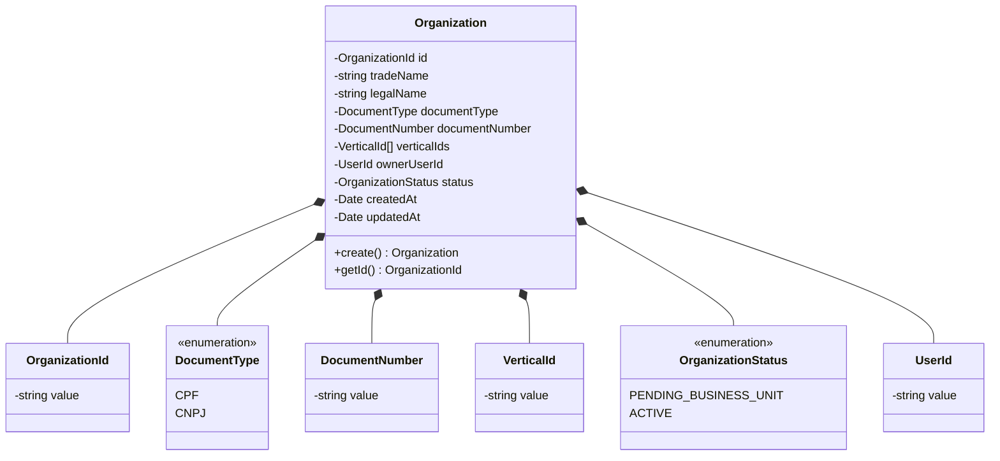
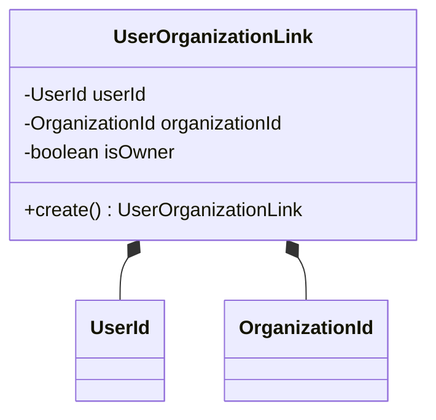
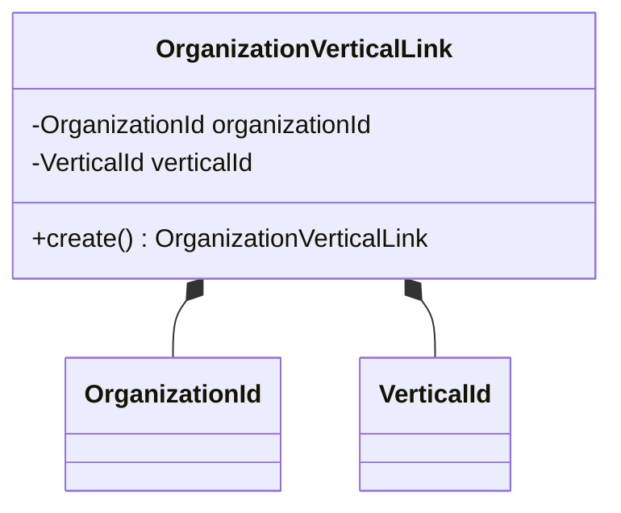
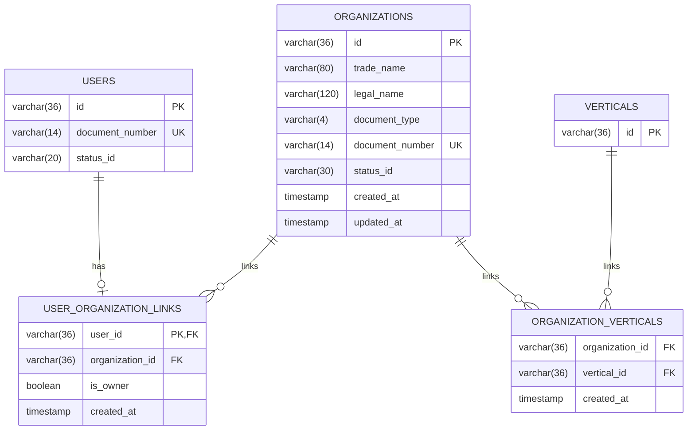
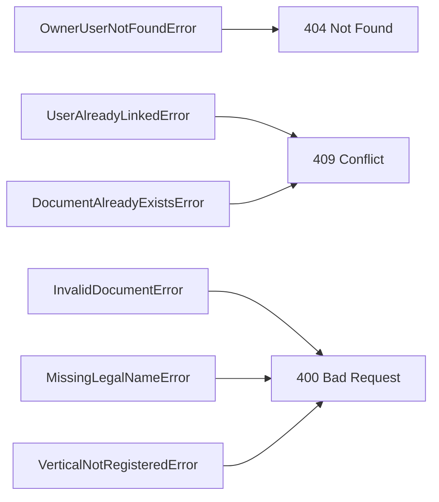

# Design: Create Organization

**Created**: 2026-01-08  
**Spec**: [./spec.md](./spec.md)  
**Project**: [../../../project.md](../../../project.md)

---

## Overview

A capability Create Organization no contexto Organization cria a organizacao com dados legais e vincula um usuario owner existente.
A orquestracao ocorre no Application Service, que valida documento, verticais e regras de unicidade cruzada, define status inicial e ativa o owner.
A persistencia de organizacao, atualizacao do usuario e criacao do vinculo acontece em transacao unica.

---

## Component Map

### Domain Layer

| Tipo | Nome | Responsabilidade |
|------|------|------------------|
| Entity | `Organization` | Representa a organizacao e seus dados legais |
| Entity | `User` | Representa o usuario owner e seu status |
| Entity | `UserOrganizationLink` | Vinculo entre usuario e organizacao |
| Entity | `OrganizationVerticalLink` | Vinculo entre organizacao e vertical |
| Value Object | `OrganizationId` | Identificador unico da organizacao |
| Value Object | `UserId` | Identificador unico do usuario |
| Value Object | `DocumentType` | Tipo do documento (CPF, CNPJ) |
| Value Object | `DocumentNumber` | Documento normalizado (apenas digitos) |
| Value Object | `VerticalId` | Identificador da vertical |
| Value Object | `OrganizationStatus` | Status da organizacao (PENDING_BUSINESS_UNIT, ACTIVE) |
| Value Object | `UserStatus` | Status do usuario (PENDING_ORG_LINK, ORG_LINKED, ACTIVE) |
| Repository Interface | `OrganizationRepository` | Persistencia e consultas de organizacao |
| Repository Interface | `UserRepository` | Consultas e persistencia de usuario |
| Repository Interface | `UserOrganizationLinkRepository` | Persistencia do vinculo usuario-organizacao |
| Repository Interface | `OrganizationVerticalRepository` | Persistencia e consulta de vinculos organizacao-vertical |
| Repository Interface | `VerticalRepository` | Validacao de verticais existentes |

### Application Layer

| Tipo | Nome | Responsabilidade |
|------|------|------------------|
| App Service | `CreateOrganizationService` | Orquestra a criacao da organizacao |
| Input DTO | `CreateOrganizationInput` | Dados de entrada para criacao |
| Output DTO | `CreateOrganizationOutput` | Dados retornados apos criacao |

### Infrastructure Layer

| Tipo | Nome | Responsabilidade |
|------|------|------------------|
| Repository Impl | `PrismaOrganizationRepository` | Implementa `OrganizationRepository` |
| Repository Impl | `PrismaUserRepository` | Implementa `UserRepository` |
| Repository Impl | `PrismaUserOrganizationLinkRepository` | Implementa `UserOrganizationLinkRepository` |
| Repository Impl | `PrismaOrganizationVerticalRepository` | Implementa `OrganizationVerticalRepository` |
| Repository Impl | `PrismaVerticalRepository` | Implementa `VerticalRepository` |
| Mapper | `OrganizationMapper` | Converte Domain <-> Prisma |
| Mapper | `UserMapper` | Converte Domain <-> Prisma |
| Mapper | `UserOrganizationLinkMapper` | Converte Domain <-> Prisma |
| Mapper | `OrganizationVerticalMapper` | Converte Domain <-> Prisma |

### Presentation Layer

| Tipo | Nome | Responsabilidade |
|------|------|------------------|
| Controller | `OrganizationController` | Exposicao HTTP do caso de uso |

---

## Dependency Graph

```mermaid
graph TD
    subgraph Presentation
        CTRL[OrganizationController]
    end

    subgraph Application
        SVC[CreateOrganizationService]
        DTO_IN[CreateOrganizationInput]
        DTO_OUT[CreateOrganizationOutput]
    end

    subgraph Domain
        ORG[Organization]
        USER[User]
        LINK[UserOrganizationLink]
        ORG_VERT_LINK[OrganizationVerticalLink]
        VO_ORG_ID[OrganizationId]
        VO_USER_ID[UserId]
        VO_DOC_TYPE[DocumentType]
        VO_DOC_NUM[DocumentNumber]
        VO_VERT_ID[VerticalId]
        VO_ORG_STATUS[OrganizationStatus]
        VO_USER_STATUS[UserStatus]
        ORG_REPO[OrganizationRepository]
        USER_REPO[UserRepository]
        LINK_REPO[UserOrganizationLinkRepository]
        ORG_VERT_REPO[OrganizationVerticalRepository]
        VERT_REPO[VerticalRepository]
    end

    subgraph Infrastructure
        ORG_REPO_IMPL[PrismaOrganizationRepository]
        USER_REPO_IMPL[PrismaUserRepository]
        LINK_REPO_IMPL[PrismaUserOrganizationLinkRepository]
        ORG_VERT_REPO_IMPL[PrismaOrganizationVerticalRepository]
        VERT_REPO_IMPL[PrismaVerticalRepository]
        ORG_MAPPER[OrganizationMapper]
        USER_MAPPER[UserMapper]
        LINK_MAPPER[UserOrganizationLinkMapper]
        ORG_VERT_MAPPER[OrganizationVerticalMapper]
        PRISMA[Prisma Client]
    end

    CTRL --> SVC
    CTRL --> DTO_IN
    SVC --> DTO_OUT
    SVC --> ORG
    SVC --> USER
    SVC --> LINK
    SVC --> ORG_VERT_LINK
    SVC --> ORG_REPO
    SVC --> USER_REPO
    SVC --> LINK_REPO
    SVC --> ORG_VERT_REPO
    SVC --> VERT_REPO
    ORG --> VO_ORG_ID
    ORG --> VO_DOC_TYPE
    ORG --> VO_DOC_NUM
    ORG --> VO_VERT_ID
    ORG --> VO_ORG_STATUS
    ORG --> VO_USER_ID
    USER --> VO_USER_ID
    USER --> VO_USER_STATUS
    LINK --> VO_USER_ID
    LINK --> VO_ORG_ID
    ORG_VERT_LINK --> VO_ORG_ID
    ORG_VERT_LINK --> VO_VERT_ID
    ORG_REPO_IMPL -.->|implements| ORG_REPO
    USER_REPO_IMPL -.->|implements| USER_REPO
    LINK_REPO_IMPL -.->|implements| LINK_REPO
    ORG_VERT_REPO_IMPL -.->|implements| ORG_VERT_REPO
    VERT_REPO_IMPL -.->|implements| VERT_REPO
    ORG_REPO_IMPL --> ORG_MAPPER
    USER_REPO_IMPL --> USER_MAPPER
    LINK_REPO_IMPL --> LINK_MAPPER
    ORG_VERT_REPO_IMPL --> ORG_VERT_MAPPER
    ORG_MAPPER --> ORG
    USER_MAPPER --> USER
    LINK_MAPPER --> LINK
    ORG_VERT_MAPPER --> ORG_VERT_LINK
    ORG_REPO_IMPL --> PRISMA
    USER_REPO_IMPL --> PRISMA
    LINK_REPO_IMPL --> PRISMA
    ORG_VERT_REPO_IMPL --> PRISMA
    VERT_REPO_IMPL --> PRISMA
```



---

## Data Flow

### Fluxo: Criar Organizacao

```mermaid
sequenceDiagram
    participant Client
    participant Controller
    participant AppService
    participant VerticalRepo
    participant UserRepo
    participant OrgRepo
    participant LinkRepo
    participant OrgVertRepo
    participant Organization
    participant User
    participant Link
    participant OrgVertLink
    participant Database

    Client->>Controller: POST /organization/organizations
    Controller->>AppService: CreateOrganizationInput

    AppService->>AppService: normaliza e valida documentNumber/documentType
    AppService->>UserRepo: findById(ownerUserId)
    UserRepo->>Database: SELECT
    Database-->>UserRepo: resultado

    AppService->>LinkRepo: existsByUserId(ownerUserId)
    LinkRepo->>Database: SELECT
    Database-->>LinkRepo: resultado

    AppService->>UserRepo: existsByDocumentNumber(document)
    UserRepo->>Database: SELECT
    Database-->>UserRepo: resultado

    AppService->>OrgRepo: existsByDocumentNumber(document)
    OrgRepo->>Database: SELECT
    Database-->>OrgRepo: resultado

    AppService->>AppService: valida legalName quando CNPJ
    AppService->>VerticalRepo: existsByIds(verticalIds)
    VerticalRepo->>Database: SELECT
    Database-->>VerticalRepo: resultado

    AppService->>Organization: Organization.create(status PENDING_BUSINESS_UNIT)
    AppService->>User: User.activate()
    AppService->>Link: UserOrganizationLink.create(isOwner true)
    AppService->>OrgVertLink: OrganizationVerticalLink.create(...)

    Note over AppService,Database: Persistencia em transacao
    AppService->>OrgRepo: save(Organization)
    OrgRepo->>Database: INSERT
    Database-->>OrgRepo: OK
    AppService->>UserRepo: save(User)
    UserRepo->>Database: UPDATE
    Database-->>UserRepo: OK
    AppService->>LinkRepo: save(Link)
    LinkRepo->>Database: INSERT
    Database-->>LinkRepo: OK
    AppService->>OrgVertRepo: saveMany(OrganizationVerticalLink[])
    OrgVertRepo->>Database: INSERT
    Database-->>OrgVertRepo: OK

    AppService-->>Controller: CreateOrganizationOutput
    Controller-->>Client: 201 Created
```

**Transformacoes de dados:**

| Etapa | De | Para |
|-------|----|----- |
| Controller -> AppService | JSON body | CreateOrganizationInput |
| AppService -> Domain | DTO | Organization, User, UserOrganizationLink, OrganizationVerticalLink |
| Domain -> Infra | Entities | Prisma Models |

---

## Entity Structure

### Organization



**Propriedades:**

| Propriedade | Tipo | Mutavel? | Regras |
|-------------|------|----------|--------|
| `id` | OrganizationId | Nao | Gerado internamente |
| `tradeName` | string | Nao | Obrigatorio |
| `legalName` | string | Nao | Obrigatorio quando CNPJ |
| `documentType` | DocumentType | Nao | CPF ou CNPJ |
| `documentNumber` | DocumentNumber | Nao | Apenas digitos, 11/14 chars, unico |
| `verticalIds` | VerticalId[] | Nao | Deve conter 1+ ids registrados |
| `ownerUserId` | UserId | Nao | Owner existente e unico |
| `status` | OrganizationStatus | Sim | Inicial PENDING_BUSINESS_UNIT |
| `createdAt` | Date | Nao | Automatico |
| `updatedAt` | Date | Sim | Atualizado em mudancas futuras |

**Comportamentos:**

| Metodo | Regras |
|--------|--------|
| `create` | Valida VO e aplica status inicial |

### UserOrganizationLink



**Propriedades:**

| Propriedade | Tipo | Mutavel? | Regras |
|-------------|------|----------|--------|
| `userId` | UserId | Nao | Obrigatorio |
| `organizationId` | OrganizationId | Nao | Obrigatorio |
| `isOwner` | boolean | Nao | Deve ser true para o owner |

**Comportamentos:**

| Metodo | Regras |
|--------|--------|
| `create` | Impoe isOwner = true no vinculo de owner |

---

### OrganizationVerticalLink



**Propriedades:**

| Propriedade | Tipo | Mutavel? | Regras |
|-------------|------|----------|--------|
| `organizationId` | OrganizationId | Nao | Obrigatorio |
| `verticalId` | VerticalId | Nao | Obrigatorio |

**Comportamentos:**

| Metodo | Regras |
|--------|--------|
| `create` | Gera vinculos para cada vertical informada |

---

## Repository Operations

| Operacao | Descricao | Usada por |
|----------|-----------|-----------|
| `OrganizationRepository.save(organization)` | Persiste organizacao | CreateOrganizationService |
| `OrganizationRepository.existsByDocumentNumber(document)` | Verifica duplicidade em organizacoes | CreateOrganizationService |
| `UserRepository.findById(id)` | Busca owner por id | CreateOrganizationService |
| `UserRepository.existsByDocumentNumber(document)` | Verifica duplicidade em usuarios | CreateOrganizationService |
| `UserRepository.save(user)` | Atualiza status do owner | CreateOrganizationService |
| `UserOrganizationLinkRepository.existsByUserId(userId)` | Verifica vinculo existente do usuario | CreateOrganizationService |
| `UserOrganizationLinkRepository.save(link)` | Persiste vinculo owner | CreateOrganizationService |
| `VerticalRepository.existsByIds(ids)` | Valida existencia das verticais | CreateOrganizationService |
| `OrganizationVerticalRepository.saveMany(links)` | Persiste vinculos organizacao-vertical | CreateOrganizationService |

---

## Database Model



### Tabela: `organizations`

| Coluna | Tipo | Constraints |
|--------|------|-------------|
| `id` | VARCHAR(36) | PK |
| `trade_name` | VARCHAR(80) | NOT NULL |
| `legal_name` | VARCHAR(120) | NULL |
| `document_type` | VARCHAR(4) | NOT NULL |
| `document_number` | VARCHAR(14) | NOT NULL, UNIQUE |
| `status_id` | VARCHAR(30) | NOT NULL |
| `created_at` | TIMESTAMP | NOT NULL, DEFAULT now() |
| `updated_at` | TIMESTAMP | NULL |

### Tabela: `organization_verticals`

| Coluna | Tipo | Constraints |
|--------|------|-------------|
| `organization_id` | VARCHAR(36) | FK(organizations.id), NOT NULL |
| `vertical_id` | VARCHAR(36) | FK(verticals.id), NOT NULL |
| `created_at` | TIMESTAMP | NOT NULL, DEFAULT now() |

### Tabela: `users`

| Coluna | Tipo | Constraints |
|--------|------|-------------|
| `id` | VARCHAR(36) | PK |
| `document_number` | VARCHAR(14) | NOT NULL, UNIQUE |
| `status_id` | VARCHAR(20) | NOT NULL |

### Tabela: `user_organization_links`

| Coluna | Tipo | Constraints |
|--------|------|-------------|
| `user_id` | VARCHAR(36) | PK, FK(users.id), UNIQUE |
| `organization_id` | VARCHAR(36) | FK(organizations.id) |
| `is_owner` | BOOLEAN | NOT NULL, DEFAULT false |
| `created_at` | TIMESTAMP | NOT NULL, DEFAULT now() |

---

## API Endpoints

| Metodo | Path | Operacao | Sucesso | Erros |
|--------|------|----------|---------|-------|
| POST | `/organization/organizations` | Criar organizacao | 201 | 400, 404, 409 |

---

## Error Handling



| Erro de Dominio | Quando Ocorre | HTTP Status | Codigo |
|-----------------|---------------|-------------|--------|
| `OwnerUserNotFoundError` | ownerUserId inexistente | 404 | `OWNER_USER_NOT_FOUND` |
| `UserAlreadyLinkedError` | Usuario ja vinculado a organizacao | 409 | `USER_ALREADY_LINKED` |
| `DocumentAlreadyExistsError` | Documento ja cadastrado | 409 | `DOCUMENT_ALREADY_EXISTS` |
| `InvalidDocumentError` | Documento invalido | 400 | `INVALID_DOCUMENT` |
| `MissingLegalNameError` | CNPJ sem razao social | 400 | `LEGAL_NAME_REQUIRED` |
| `VerticalNotRegisteredError` | verticalId nao registrado | 400 | `VERTICAL_NOT_REGISTERED` |

---

## Technical Decisions

### Decisao 1: Unicidade de documento cruzada entre usuarios e organizacoes

**Contexto**: O documento da organizacao deve ser unico considerando usuarios e organizacoes.

**Decisao**: O `CreateOrganizationService` consulta `UserRepository` e `OrganizationRepository` antes da criacao.

**Justificativa**: A regra cruza tabelas diferentes e precisa ser garantida pela aplicacao.

---

### Decisao 2: Vinculo do owner e atualizacao de status em transacao unica

**Contexto**: A organizacao e o vinculo owner nao podem ficar inconsistentes com o status do usuario.

**Decisao**: Persistir organizacao, atualizar status do usuario para ACTIVE e criar `UserOrganizationLink` (isOwner=true) dentro da mesma transacao.

**Justificativa**: Garante atomicidade e evita organizacao criada sem owner ativo.

---

### Decisao 3: Validacao de verticais via catalogo

**Contexto**: As verticais sao cadastradas no modulo de atributos e uma organizacao pode ter mais de uma vertical.

**Decisao**: Validar todos os `verticalIds` no Application Service via `VerticalRepository` e persistir os vinculos em `organization_verticals`.

**Justificativa**: Centraliza a validacao, evita ids inexistentes e suporta associacao multipla.

---

## Implementation Notes

- Normalizar `documentNumber` para apenas digitos antes das validacoes e consultas.
- Nao aceitar `statusId` no input do controller; `verticalIds` devem ser informados.
- Exigir `legalName` quando `documentType` for CNPJ.
- Validar todos os `verticalIds` no catalogo de verticais antes da persistencia.
- Garantir indice unico em `organizations.document_number`, `user_organization_links.user_id` e `organization_verticals(organization_id, vertical_id)`.
- `ownerUserId` deve existir e nao possuir vinculo previo em `user_organization_links`.

---
