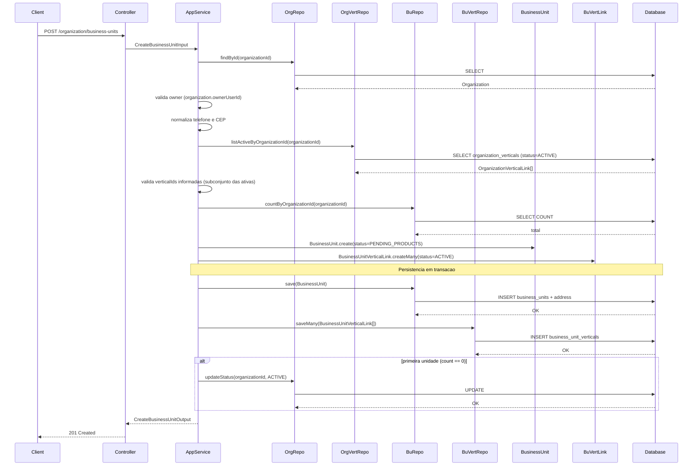
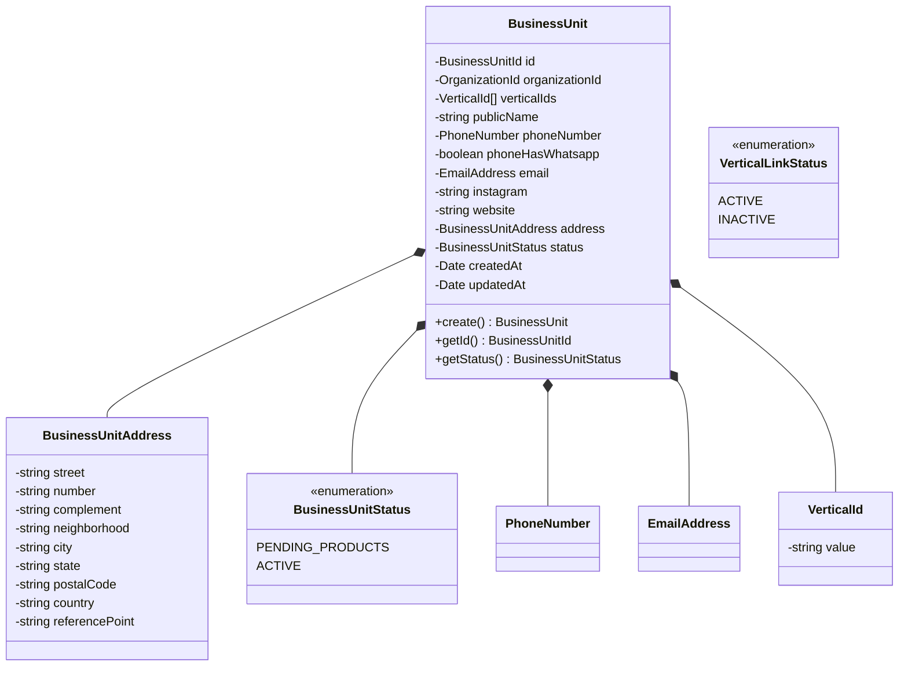
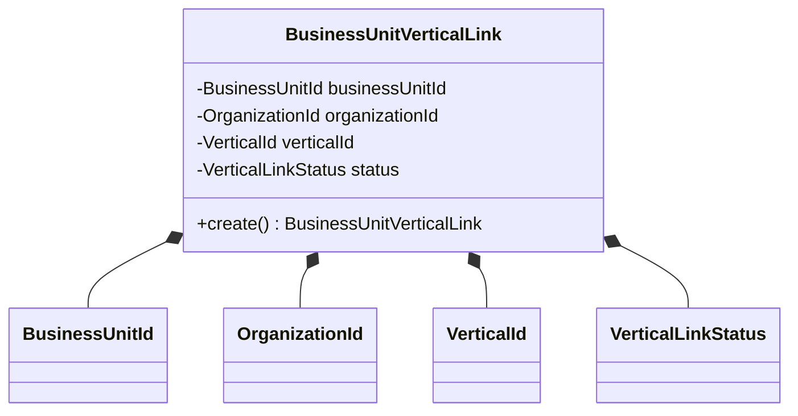
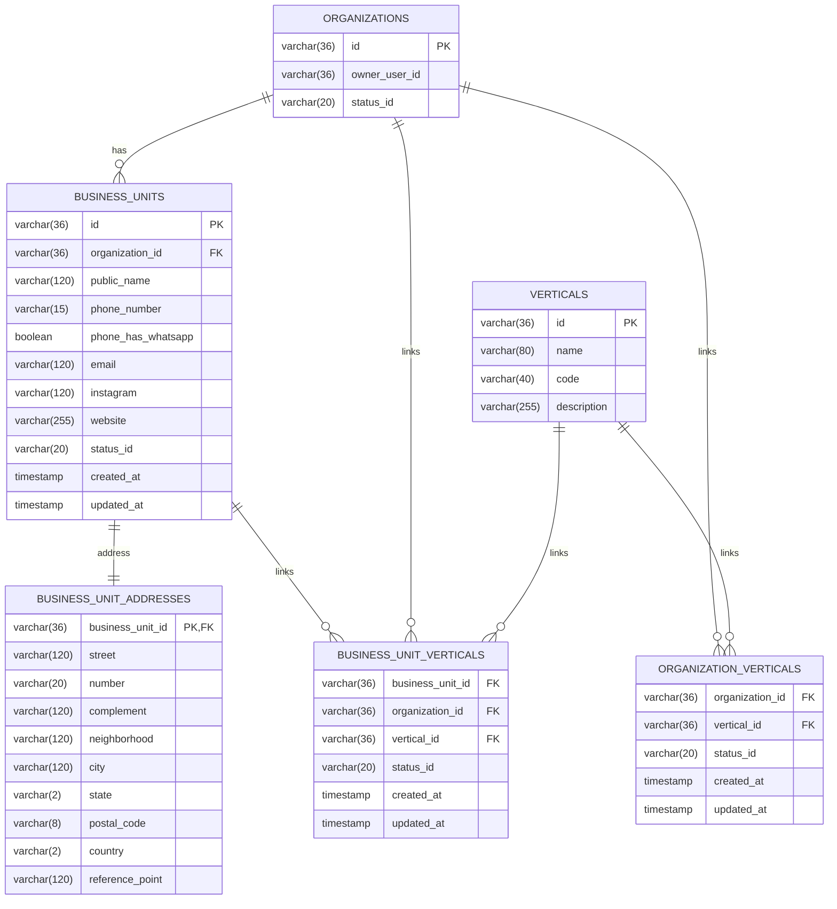
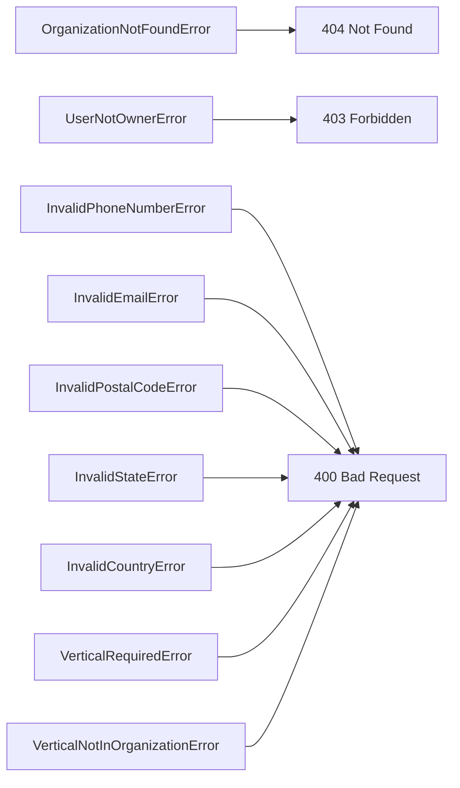

# Design: Create Business Unit

**Created**: 2026-01-08  
**Spec**: [./spec.md](./spec.md)  
**Project**: [../../../project.md](../../../project.md)

---

## Overview

A capability Create Business Unit no contexto Organization cria a unidade de negocio com dados publicos, endereco completo e vincula verticais da organizacao.
A orquestracao ocorre no Application Service, que valida organizacao e owner, confirma verticais ativas, cria BusinessUnit com status inicial PENDING_PRODUCTS e persiste em transacao com seus vinculos.
A complexidade e moderada por validacoes de endereco Brasil, verificacao das verticais e pelo update condicional do status da organizacao.

---

## Component Map

### Domain Layer

| Tipo | Nome | Responsabilidade |
|------|------|------------------|
| Entity | `BusinessUnit` | Unidade de negocio com dados publicos e status |
| Entity | `Organization` | Organizacao usada para validar owner e status |
| Entity | `BusinessUnitVerticalLink` | Vinculo entre unidade de negocio e vertical |
| Entity | `OrganizationVerticalLink` | Vinculo entre organizacao e vertical |
| Value Object | `BusinessUnitId` | Identificador unico da unidade |
| Value Object | `OrganizationId` | Identificador unico da organizacao |
| Value Object | `VerticalId` | Identificador da vertical |
| Value Object | `BusinessUnitAddress` | Endereco completo com validacoes BR |
| Value Object | `BusinessUnitStatus` | Estado da unidade (PENDING_PRODUCTS, ACTIVE) |
| Value Object | `VerticalLinkStatus` | Estado do vinculo (ACTIVE, INACTIVE) |
| Value Object | `PhoneNumber` | Telefone normalizado (apenas digitos) |
| Value Object | `EmailAddress` | Email validado quando informado |
| Repository Interface | `BusinessUnitRepository` | Persistencia e consultas por organizacao |
| Repository Interface | `BusinessUnitVerticalRepository` | Persistencia de vinculos unidade-vertical |
| Repository Interface | `OrganizationRepository` | Consulta e atualizacao de organizacao |
| Repository Interface | `OrganizationVerticalRepository` | Consulta de verticais da organizacao |

### Application Layer

| Tipo | Nome | Responsabilidade |
|------|------|------------------|
| App Service | `CreateBusinessUnitService` | Orquestra a criacao da unidade |
| Input DTO | `CreateBusinessUnitInput` | Dados de entrada para criacao |
| Output DTO | `CreateBusinessUnitOutput` | Dados retornados apos criacao |

### Infrastructure Layer

| Tipo | Nome | Responsabilidade |
|------|------|------------------|
| Repository Impl | `PrismaBusinessUnitRepository` | Implementa `BusinessUnitRepository` |
| Repository Impl | `PrismaBusinessUnitVerticalRepository` | Implementa `BusinessUnitVerticalRepository` |
| Repository Impl | `PrismaOrganizationRepository` | Implementa `OrganizationRepository` |
| Repository Impl | `PrismaOrganizationVerticalRepository` | Implementa `OrganizationVerticalRepository` |
| Mapper | `BusinessUnitMapper` | Converte Domain ↔ Prisma |
| Mapper | `BusinessUnitVerticalMapper` | Converte Domain ↔ Prisma |
| Mapper | `OrganizationVerticalMapper` | Converte Domain ↔ Prisma |

### Presentation Layer

| Tipo | Nome | Responsabilidade |
|------|------|------------------|
| Controller | `BusinessUnitController` | Exposicao HTTP do caso de uso |

---

## Dependency Graph

```mermaid
graph TD
    subgraph Presentation
        CTRL[BusinessUnitController]
    end

    subgraph Application
        SVC[CreateBusinessUnitService]
        DTO_IN[CreateBusinessUnitInput]
        DTO_OUT[CreateBusinessUnitOutput]
    end

    subgraph Domain
        BU[BusinessUnit]
        ORG[Organization]
        BU_VERT_LINK[BusinessUnitVerticalLink]
        ORG_VERT_LINK[OrganizationVerticalLink]
        VO_ID[BusinessUnitId]
        VO_ORG[OrganizationId]
        VO_VERT_ID[VerticalId]
        VO_ADDR[BusinessUnitAddress]
        VO_PHONE[PhoneNumber]
        VO_EMAIL[EmailAddress]
        VO_STATUS[BusinessUnitStatus]
        VO_LINK_STATUS[VerticalLinkStatus]
        BU_REPO[BusinessUnitRepository]
        BU_VERT_REPO[BusinessUnitVerticalRepository]
        ORG_REPO[OrganizationRepository]
        ORG_VERT_REPO[OrganizationVerticalRepository]
    end

    subgraph Infrastructure
        BU_REPO_IMPL[PrismaBusinessUnitRepository]
        BU_VERT_REPO_IMPL[PrismaBusinessUnitVerticalRepository]
        ORG_REPO_IMPL[PrismaOrganizationRepository]
        ORG_VERT_REPO_IMPL[PrismaOrganizationVerticalRepository]
        BU_MAPPER[BusinessUnitMapper]
        BU_VERT_MAPPER[BusinessUnitVerticalMapper]
        ORG_VERT_MAPPER[OrganizationVerticalMapper]
        PRISMA[Prisma Client]
    end

    CTRL --> SVC
    CTRL --> DTO_IN
    SVC --> DTO_OUT
    SVC --> BU
    SVC --> ORG
    SVC --> BU_REPO
    SVC --> BU_VERT_REPO
    SVC --> ORG_REPO
    SVC --> ORG_VERT_REPO
    BU --> VO_ID
    BU --> VO_ORG
    BU --> VO_VERT_ID
    BU --> VO_ADDR
    BU --> VO_PHONE
    BU --> VO_EMAIL
    BU --> VO_STATUS
    BU_VERT_LINK --> VO_ID
    BU_VERT_LINK --> VO_ORG
    BU_VERT_LINK --> VO_VERT_ID
    BU_VERT_LINK --> VO_LINK_STATUS
    ORG_VERT_LINK --> VO_ORG
    ORG_VERT_LINK --> VO_VERT_ID
    ORG_VERT_LINK --> VO_LINK_STATUS
    BU_REPO_IMPL -.->|implements| BU_REPO
    BU_VERT_REPO_IMPL -.->|implements| BU_VERT_REPO
    ORG_REPO_IMPL -.->|implements| ORG_REPO
    ORG_VERT_REPO_IMPL -.->|implements| ORG_VERT_REPO
    BU_REPO_IMPL --> BU_MAPPER
    BU_VERT_REPO_IMPL --> BU_VERT_MAPPER
    ORG_VERT_REPO_IMPL --> ORG_VERT_MAPPER
    BU_REPO_IMPL --> PRISMA
    BU_VERT_REPO_IMPL --> PRISMA
    ORG_REPO_IMPL --> PRISMA
    ORG_VERT_REPO_IMPL --> PRISMA
    BU_VERT_MAPPER --> BU_VERT_LINK
    ORG_VERT_MAPPER --> ORG_VERT_LINK
```

---

## Data Flow

### Fluxo: Criar Business Unit

**Transformacoes de dados:**

| Etapa | De | Para |
|-------|----|----- |
| Controller → AppService | JSON body + actorUserId | CreateBusinessUnitInput |
| AppService → Domain | DTO | BusinessUnit, BusinessUnitVerticalLink |
| Domain → Infra | Entities | Prisma Models |

---

## Entity Structure

### BusinessUnit

**Propriedades:**

| Propriedade | Tipo | Mutavel? | Regras |
|-------------|------|----------|--------|
| `id` | BusinessUnitId | Nao | Gerado internamente |
| `organizationId` | OrganizationId | Nao | Obrigatorio |
| `verticalIds` | VerticalId[] | Nao | 1+ ids ativos na organizacao |
| `publicName` | string | Nao | Obrigatorio |
| `phoneNumber` | PhoneNumber | Nao | Apenas digitos, max 15 |
| `phoneHasWhatsapp` | boolean | Nao | Obrigatorio |
| `email` | EmailAddress | Nao | Opcional, formato valido |
| `instagram` | string | Nao | Opcional |
| `website` | string | Nao | Opcional |
| `address` | BusinessUnitAddress | Nao | Obrigatorio |
| `status` | BusinessUnitStatus | Nao | Definido pela aplicacao |
| `createdAt` | Date | Nao | Automatico |
| `updatedAt` | Date | Sim | Atualizado em mudancas futuras |

### BusinessUnitAddress

**Propriedades:**

| Propriedade | Tipo | Mutavel? | Regras |
|-------------|------|----------|--------|
| `street` | string | Nao | Obrigatorio |
| `number` | string | Nao | Obrigatorio |
| `complement` | string | Nao | Opcional |
| `neighborhood` | string | Nao | Obrigatorio |
| `city` | string | Nao | Obrigatorio |
| `state` | string | Nao | UF valida do Brasil |
| `postalCode` | string | Nao | 8 digitos numericos |
| `country` | string | Nao | Valor fixo `BR` |
| `referencePoint` | string | Nao | Obrigatorio |

**Comportamentos:**

| Metodo | Regras |
|--------|--------|
| `create` | Valida dados obrigatorios, UF e pais BR |

### BusinessUnitVerticalLink

**Propriedades:**

| Propriedade | Tipo | Mutavel? | Regras |
|-------------|------|----------|--------|
| `businessUnitId` | BusinessUnitId | Nao | Obrigatorio |
| `organizationId` | OrganizationId | Nao | Obrigatorio |
| `verticalId` | VerticalId | Nao | Obrigatorio |
| `status` | VerticalLinkStatus | Sim | Default ACTIVE |

---

## Repository Operations

| Operacao | Descricao | Usada por |
|----------|-----------|-----------|
| `BusinessUnitRepository.save(unit)` | Persiste unidade e endereco | CreateBusinessUnitService |
| `BusinessUnitRepository.countByOrganizationId(orgId)` | Conta unidades da organizacao | CreateBusinessUnitService |
| `OrganizationRepository.findById(id)` | Carrega organizacao e owner | CreateBusinessUnitService |
| `OrganizationRepository.updateStatus(id, status)` | Atualiza status da organizacao | CreateBusinessUnitService |
| `OrganizationVerticalRepository.listActiveByOrganizationId(orgId)` | Lista verticais ativas da organizacao | CreateBusinessUnitService |
| `BusinessUnitVerticalRepository.saveMany(links)` | Persiste vinculos unidade-vertical | CreateBusinessUnitService |

---

## Database Model

### Tabela: `business_units`

| Coluna | Tipo | Constraints |
|--------|------|-------------|
| `id` | VARCHAR(36) | PK |
| `organization_id` | VARCHAR(36) | FK(organizations.id), NOT NULL |
| `public_name` | VARCHAR(120) | NOT NULL |
| `phone_number` | VARCHAR(15) | NOT NULL |
| `phone_has_whatsapp` | BOOLEAN | NOT NULL |
| `email` | VARCHAR(120) | NULL |
| `instagram` | VARCHAR(120) | NULL |
| `website` | VARCHAR(255) | NULL |
| `status_id` | VARCHAR(20) | NOT NULL |
| `created_at` | TIMESTAMP | NOT NULL, DEFAULT now() |
| `updated_at` | TIMESTAMP | NULL |

### Tabela: `business_unit_addresses`

| Coluna | Tipo | Constraints |
|--------|------|-------------|
| `business_unit_id` | VARCHAR(36) | PK, FK(business_units.id) |
| `street` | VARCHAR(120) | NOT NULL |
| `number` | VARCHAR(20) | NOT NULL |
| `complement` | VARCHAR(120) | NULL |
| `neighborhood` | VARCHAR(120) | NOT NULL |
| `city` | VARCHAR(120) | NOT NULL |
| `state` | VARCHAR(2) | NOT NULL |
| `postal_code` | VARCHAR(8) | NOT NULL |
| `country` | VARCHAR(2) | NOT NULL |
| `reference_point` | VARCHAR(120) | NOT NULL |

### Tabela: `organization_verticals`

| Coluna | Tipo | Constraints |
|--------|------|-------------|
| `organization_id` | VARCHAR(36) | FK(organizations.id), NOT NULL |
| `vertical_id` | VARCHAR(36) | FK(verticals.id), NOT NULL |
| `status_id` | VARCHAR(20) | NOT NULL |
| `created_at` | TIMESTAMP | NOT NULL, DEFAULT now() |
| `updated_at` | TIMESTAMP | NULL |

### Tabela: `business_unit_verticals`

| Coluna | Tipo | Constraints |
|--------|------|-------------|
| `business_unit_id` | VARCHAR(36) | FK(business_units.id), NOT NULL |
| `organization_id` | VARCHAR(36) | FK(organizations.id), NOT NULL |
| `vertical_id` | VARCHAR(36) | FK(verticals.id), NOT NULL |
| `status_id` | VARCHAR(20) | NOT NULL |
| `created_at` | TIMESTAMP | NOT NULL, DEFAULT now() |
| `updated_at` | TIMESTAMP | NULL |

### Tabela: `organizations`

| Coluna | Tipo | Constraints |
|--------|------|-------------|
| `id` | VARCHAR(36) | PK |
| `owner_user_id` | VARCHAR(36) | NOT NULL |
| `status_id` | VARCHAR(20) | NOT NULL |

---

## API Endpoints

| Metodo | Path | Operacao | Sucesso | Erros |
|--------|------|----------|---------|-------|
| POST | `/organization/business-units` | Criar unidade de negocio | 201 | 400, 403, 404 |

---

## Error Handling

| Erro de Dominio | Quando Ocorre | HTTP Status | Codigo |
|-----------------|---------------|-------------|--------|
| `OrganizationNotFoundError` | organizationId inexistente | 404 | `ORGANIZATION_NOT_FOUND` |
| `UserNotOwnerError` | usuario nao e owner da organizacao | 403 | `USER_NOT_OWNER` |
| `InvalidPhoneNumberError` | telefone invalido | 400 | `INVALID_PHONE_NUMBER` |
| `InvalidEmailError` | email invalido | 400 | `INVALID_EMAIL` |
| `InvalidPostalCodeError` | CEP invalido | 400 | `INVALID_POSTAL_CODE` |
| `InvalidStateError` | UF invalida | 400 | `INVALID_STATE` |
| `InvalidCountryError` | pais diferente de BR | 400 | `INVALID_COUNTRY` |
| `VerticalRequiredError` | nenhuma vertical informada | 400 | `VERTICAL_REQUIRED` |
| `VerticalNotInOrganizationError` | vertical nao vinculada ou inativa na organizacao | 400 | `VERTICAL_NOT_IN_ORGANIZATION` |

---

## Technical Decisions

### Decisao 1: Validar ownership via ownerUserId da organizacao

**Contexto**: A criacao exige que o solicitante seja owner da organizacao.

**Decisao**: O `CreateBusinessUnitService` carrega a organizacao e compara `ownerUserId` com o `actorUserId` do request.

**Justificativa**: Evita consultas adicionais ao vinculo usuario-organizacao e usa a fonte unica de ownership da organizacao.

---

### Decisao 2: Transacao unica para unidade, endereco e update de organizacao

**Contexto**: A primeira unidade ativa a organizacao e nao pode existir inconsistencias.

**Decisao**: Persistir `BusinessUnit`, `BusinessUnitAddress` e o update de status da organizacao na mesma transacao do Prisma.

**Justificativa**: Garante atomicidade entre criacao da unidade e status da organizacao.

---

### Decisao 3: Endereco como Value Object e tabela 1:1

**Contexto**: O endereco tem regras de validacao Brasil e eh parte obrigatoria da unidade.

**Decisao**: Modelar `BusinessUnitAddress` como VO dentro de `BusinessUnit` e persistir em `business_unit_addresses`.

**Justificativa**: Mantem regras de endereco encapsuladas e permite evolucao do endereco sem inflar a tabela principal.

---

### Decisao 4: Validar verticais pela organizacao e criar vinculos da unidade

**Contexto**: A unidade de negocio deve ser criada com verticais pertencentes e ativas na organizacao.

**Decisao**: Carregar as verticais ativas da organizacao via `OrganizationVerticalRepository` e validar que `verticalIds` informadas sao subconjunto, criando `BusinessUnitVerticalLink` como ACTIVE.

**Justificativa**: Garante consistencia entre organizacao e unidades sem depender do catalogo global no fluxo de criacao.

---

### Decisao 5: Validacao de UF e CEP por regras locais

**Contexto**: O endereco precisa validar UF e CEP conforme regras BR.

**Decisao**: Validar UF usando lista fixa de UFs no dominio e validar CEP com regex `^\\d{8}$`, sem consulta externa.

**Justificativa**: Mantem validacao deterministica e evita dependencia de servicos externos.

---

## Implementation Notes

- Normalizar `phoneNumber` e `postalCode` para apenas digitos antes da validacao.
- Rejeitar `state` fora da lista de UFs e `country` diferente de `BR`.
- Definir `status` como `PENDING_PRODUCTS` sempre na criacao.
- Rejeitar criacao sem `verticalIds` ou com ids fora das verticais ativas da organizacao.
- Persistir `business_unit_verticals` como ACTIVE na mesma transacao da unidade.
- Atualizar `organizations.status_id` para `ACTIVE` apenas quando `countByOrganizationId` for 0.
- Usar transacao unica para `business_units`, `business_unit_addresses`, `business_unit_verticals` e update de organizacao.

---
