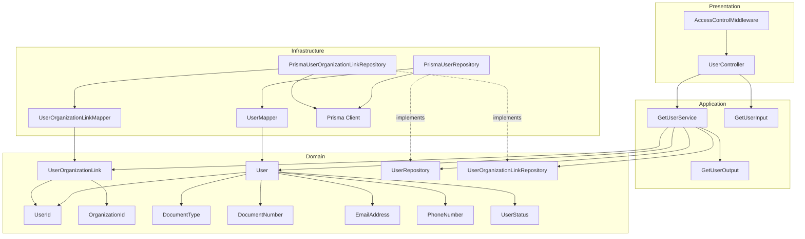
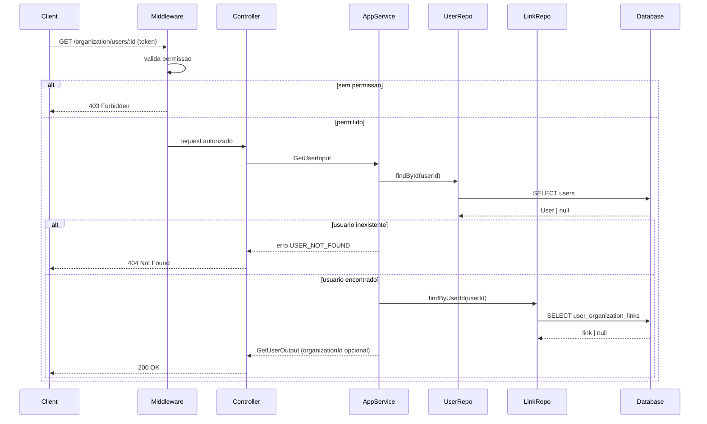
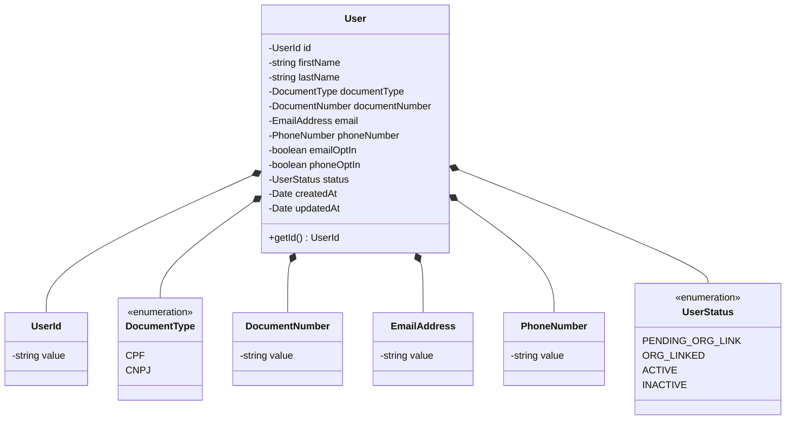
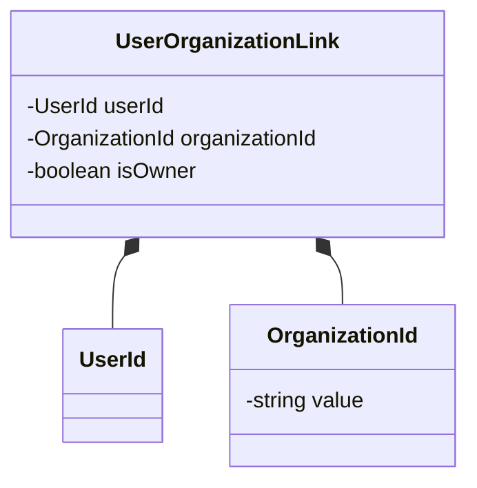
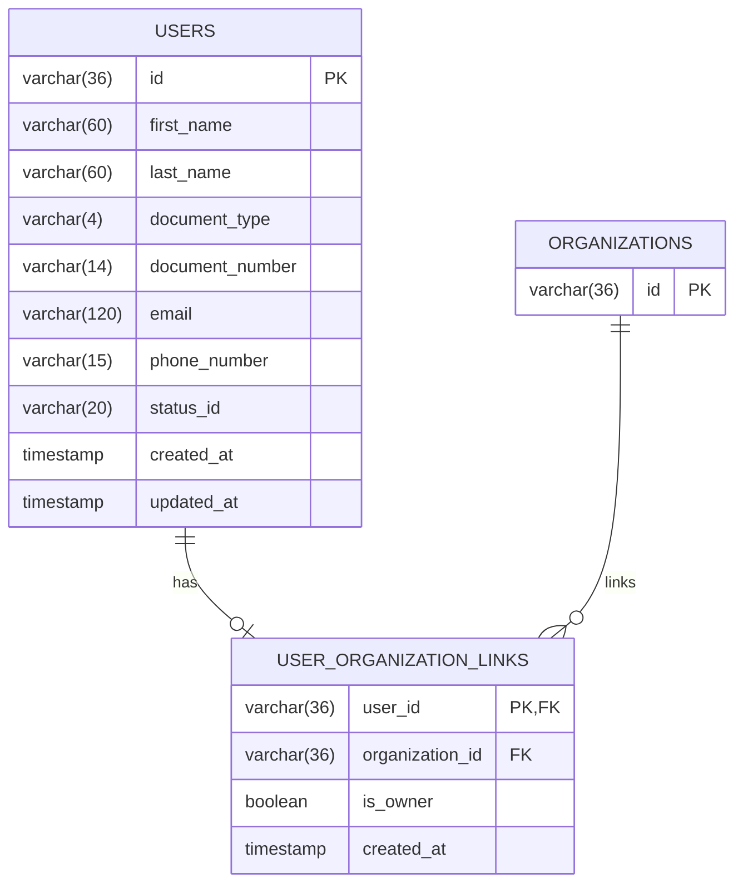
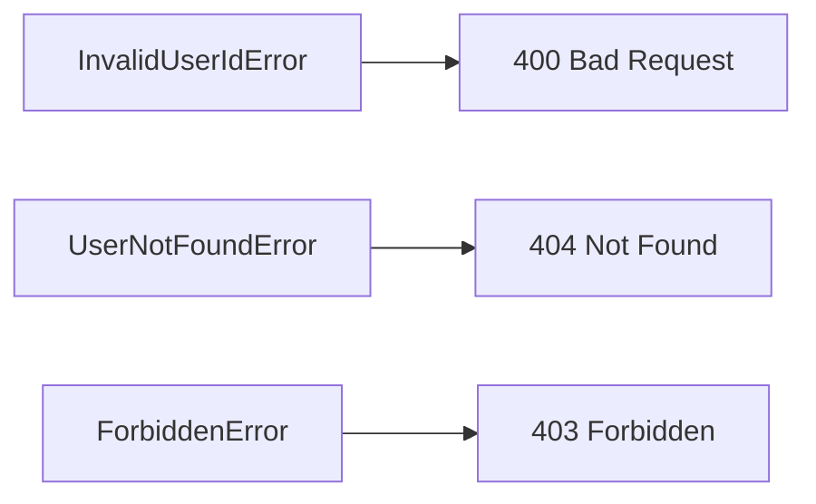

# Design: Get User

**Created**: 2026-01-08  
**Spec**: [./spec.md](./spec.md)  
**Project**: [../../../project.md](../../../project.md)

---

## Overview

A capability Get User no contexto Organization consulta um usuario por id e retorna seus dados completos com o organizationId quando houver vinculo.
A orquestracao ocorre no Application Service, que valida o UserId, aplica politica de acesso e consulta UserRepository e UserOrganizationLinkRepository.
A complexidade e baixa, com foco em leitura consistente e retorno de vinculo opcional.

---

## Component Map

### Domain Layer

| Tipo | Nome | Responsabilidade |
|------|------|------------------|
| Entity | `User` | Dados do usuario e status atual |
| Entity | `UserOrganizationLink` | Vinculo entre usuario e organizacao |
| Value Object | `UserId` | Identificador unico do usuario |
| Value Object | `OrganizationId` | Identificador unico da organizacao |
| Value Object | `DocumentType` | Tipo do documento (CPF, CNPJ) |
| Value Object | `DocumentNumber` | Documento normalizado |
| Value Object | `EmailAddress` | Email validado e normalizado |
| Value Object | `PhoneNumber` | Celular validado e normalizado |
| Value Object | `UserStatus` | Status atual do usuario |
| Repository Interface | `UserRepository` | Consulta de usuario por id |
| Repository Interface | `UserOrganizationLinkRepository` | Consulta de vinculo usuario-organizacao |

### Application Layer

| Tipo | Nome | Responsabilidade |
|------|------|------------------|
| App Service | `GetUserService` | Orquestra a consulta do usuario |
| Input DTO | `GetUserInput` | Dados de entrada (userId, actorUserId) |
| Output DTO | `GetUserOutput` | Dados completos do usuario |

### Infrastructure Layer

| Tipo | Nome | Responsabilidade |
|------|------|------------------|
| Repository Impl | `PrismaUserRepository` | Implementa `UserRepository` |
| Repository Impl | `PrismaUserOrganizationLinkRepository` | Implementa `UserOrganizationLinkRepository` |
| Mapper | `UserMapper` | Converte Domain <-> Prisma |
| Mapper | `UserOrganizationLinkMapper` | Converte Domain <-> Prisma |

### Presentation Layer

| Tipo | Nome | Responsabilidade |
|------|------|------------------|
| Controller | `UserController` | Endpoint HTTP de consulta |
| Middleware | `AccessControlMiddleware` | Valida permissao e rejeita com FORBIDDEN |

---

## Dependency Graph

---

## Data Flow

### Fluxo: Consultar Usuario

**Transformacoes de dados:**

| Etapa | De | Para |
|-------|----|----- |
| Controller -> AppService | Params + actorUserId | GetUserInput |
| AppService -> Domain | DTO | User, UserOrganizationLink |
| Domain -> Presentation | Entities | GetUserOutput |

---

## Entity Structure

### User

### UserOrganizationLink

**Propriedades:**

| Propriedade | Tipo | Mutavel? | Regras |
|-------------|------|----------|--------|
| `id` | UserId | Nao | Obrigatorio |
| `firstName` | string | Nao | Obrigatorio |
| `lastName` | string | Nao | Obrigatorio |
| `documentType` | DocumentType | Nao | CPF ou CNPJ |
| `documentNumber` | DocumentNumber | Nao | Apenas digitos |
| `email` | EmailAddress | Nao | Formato valido |
| `phoneNumber` | PhoneNumber | Nao | Apenas digitos |
| `status` | UserStatus | Nao | Retornar estado atual |

---

## Repository Operations

| Operacao | Descricao | Usada por |
|----------|-----------|-----------|
| `UserRepository.findById(id)` | Busca usuario por id | GetUserService |
| `UserOrganizationLinkRepository.findByUserId(userId)` | Busca vinculo do usuario | GetUserService |

---

## Database Model

### Tabela: `users`

| Coluna | Tipo | Constraints |
|--------|------|-------------|
| `id` | VARCHAR(36) | PK |
| `first_name` | VARCHAR(60) | NOT NULL |
| `last_name` | VARCHAR(60) | NOT NULL |
| `document_type` | VARCHAR(4) | NOT NULL |
| `document_number` | VARCHAR(14) | NOT NULL, UNIQUE |
| `email` | VARCHAR(120) | NOT NULL, UNIQUE |
| `phone_number` | VARCHAR(15) | NOT NULL, UNIQUE |
| `status_id` | VARCHAR(20) | NOT NULL |
| `created_at` | TIMESTAMP | NOT NULL, DEFAULT now() |
| `updated_at` | TIMESTAMP | NULL |

### Tabela: `user_organization_links`

| Coluna | Tipo | Constraints |
|--------|------|-------------|
| `user_id` | VARCHAR(36) | PK, FK(users.id) |
| `organization_id` | VARCHAR(36) | FK(organizations.id) |
| `is_owner` | BOOLEAN | NOT NULL |
| `created_at` | TIMESTAMP | NOT NULL, DEFAULT now() |

---

## API Endpoints

| Metodo | Path | Operacao | Sucesso | Erros |
|--------|------|----------|---------|-------|
| GET | `/organization/users/:id` | Consultar usuario | 200 | 400, 403, 404 |

---

## Error Handling

| Erro de Dominio | Quando Ocorre | HTTP Status | Codigo |
|-----------------|---------------|-------------|--------|
| `InvalidUserIdError` | userId invalido | 400 | `INVALID_USER_ID` |
| `UserNotFoundError` | usuario inexistente | 404 | `USER_NOT_FOUND` |
| `ForbiddenError` | sem permissao para consultar | 403 | `FORBIDDEN` |

---

## Technical Decisions

### Decisao 1: Vinculo separado do usuario

**Contexto**: O organizationId e opcional e vive em tabela de vinculo.

**Decisao**: Consultar `UserOrganizationLinkRepository` apos carregar o usuario, retornando `organizationId` quando existir.

**Justificativa**: Mantem `User` independente do vinculo e permite ausencia de organizacao.

---

### Decisao 2: Permissao validada antes da consulta

**Contexto**: A spec exige rejeitar consultas sem permissao.

**Decisao**: `AccessControlMiddleware` valida a permissao do solicitante antes de chamar o `GetUserService`.

**Justificativa**: Bloqueia acesso cedo e padroniza respostas 403 na camada de presentation.

---

## Implementation Notes

- Validar `userId` via `UserId` antes de consultar repositorios.
- Quando nao existir vinculo, retornar `organizationId = null`.
- Evitar consulta ao vinculo quando o usuario nao existir.
- Manter mapeamento de status conforme valor atual do `UserStatus`.

---
