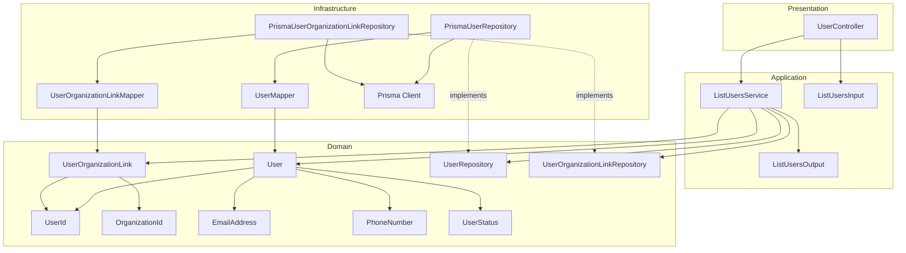
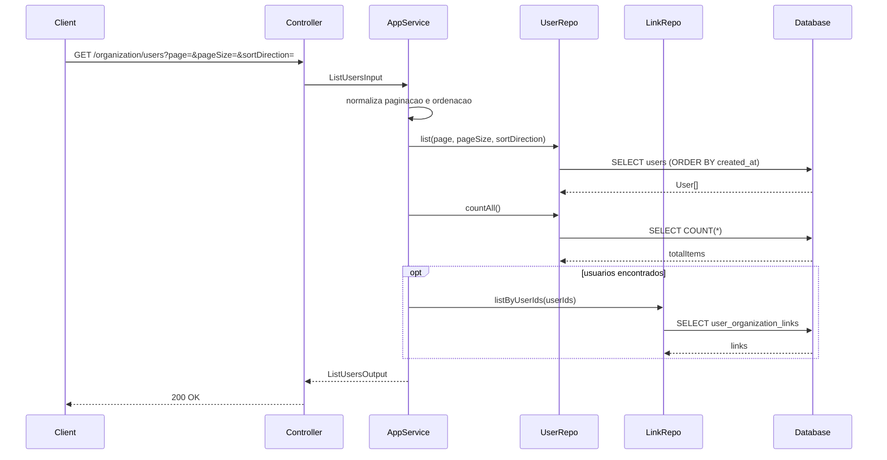
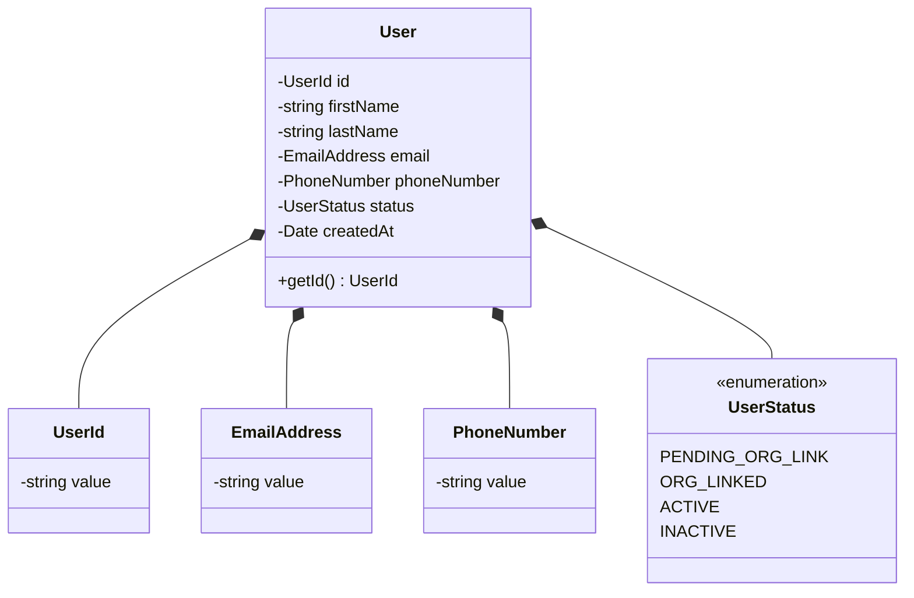
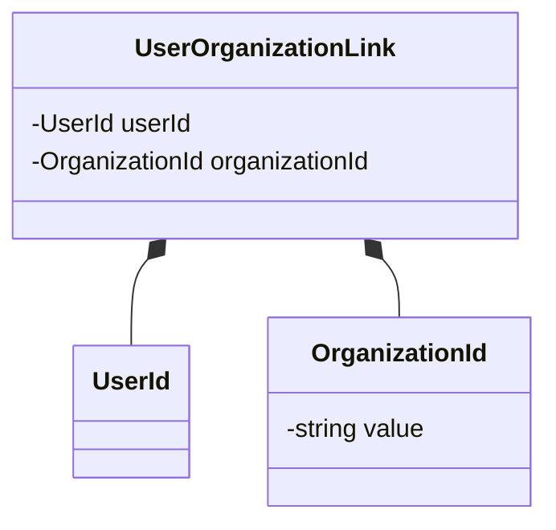
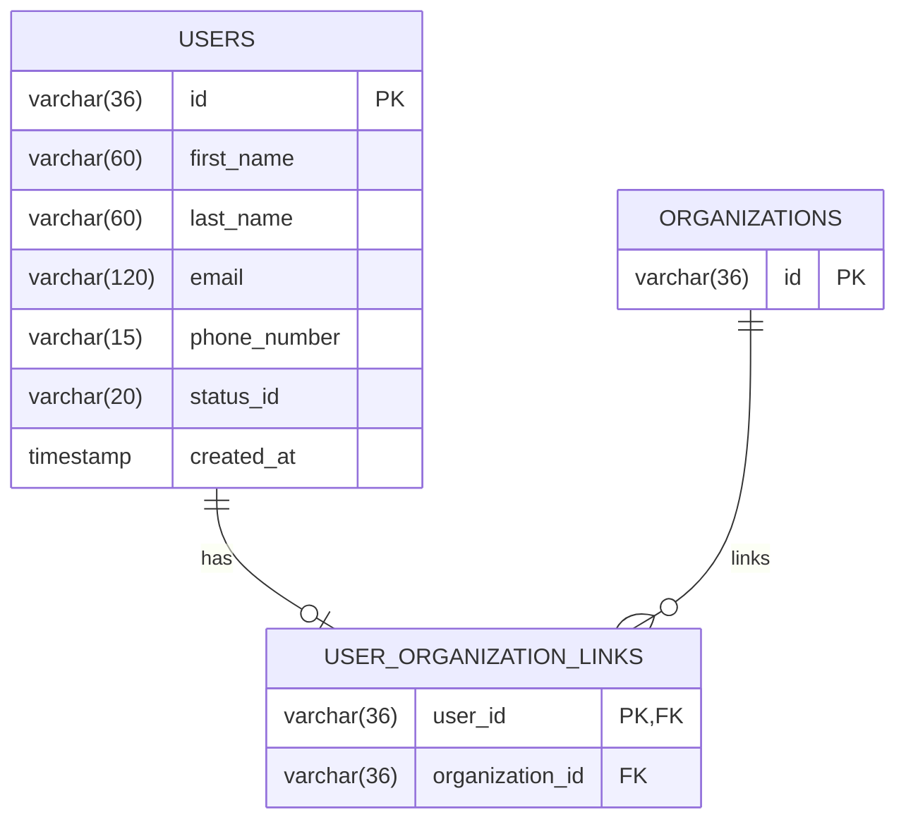
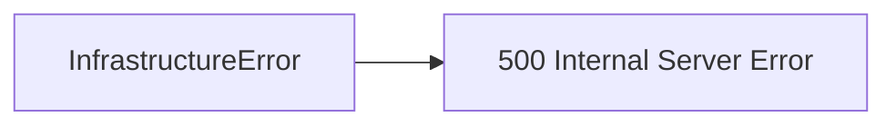

# Design: List Users

**Created**: 2026-01-08  
**Spec**: [./spec.md](./spec.md)  
**Project**: [../../../project.md](../../../project.md)

---

## Overview

A capability List Users no contexto Organization retorna usuarios cadastrados com metadados de paginacao e o organizationId quando houver vinculo.
A orquestracao ocorre no Application Service, que normaliza paginacao e ordenacao, consulta usuarios e agrega os vinculos em lote.
A complexidade e baixa, com foco em leitura paginada e montagem de resposta consistente.

---

## Component Map

### Domain Layer

| Tipo | Nome | Responsabilidade |
|------|------|------------------|
| Entity | `User` | Dados do usuario para listagem |
| Entity | `UserOrganizationLink` | Vinculo entre usuario e organizacao |
| Value Object | `UserId` | Identificador unico do usuario |
| Value Object | `OrganizationId` | Identificador unico da organizacao |
| Value Object | `EmailAddress` | Email validado e normalizado |
| Value Object | `PhoneNumber` | Celular validado e normalizado |
| Value Object | `UserStatus` | Status atual do usuario |
| Repository Interface | `UserRepository` | Listagem e totalizacao de usuarios |
| Repository Interface | `UserOrganizationLinkRepository` | Consulta de vinculos em lote |

### Application Layer

| Tipo | Nome | Responsabilidade |
|------|------|------------------|
| App Service | `ListUsersService` | Orquestra a listagem paginada |
| Input DTO | `ListUsersInput` | Parametros de paginacao e ordenacao |
| Output DTO | `ListUsersOutput` | Lista de usuarios + metadados |

### Infrastructure Layer

| Tipo | Nome | Responsabilidade |
|------|------|------------------|
| Repository Impl | `PrismaUserRepository` | Implementa `UserRepository` |
| Repository Impl | `PrismaUserOrganizationLinkRepository` | Implementa `UserOrganizationLinkRepository` |
| Mapper | `UserMapper` | Converte Domain <-> Prisma |
| Mapper | `UserOrganizationLinkMapper` | Converte Domain <-> Prisma |

### Presentation Layer

| Tipo | Nome | Responsabilidade |
|------|------|------------------|
| Controller | `UserController` | Endpoint HTTP de listagem |

---

## Dependency Graph

---

## Data Flow

### Fluxo: Listar Usuarios

**Transformacoes de dados:**

| Etapa | De | Para |
|-------|----|----- |
| Controller -> AppService | Query params | ListUsersInput |
| AppService -> Domain | DTO | User + UserOrganizationLink |
| Domain -> Presentation | Entities | ListUsersOutput |

---

## Entity Structure

### User

### UserOrganizationLink

---

## Repository Operations

| Operacao | Descricao | Usada por |
|----------|-----------|-----------|
| `UserRepository.list(page, pageSize, sortDirection)` | Lista usuarios paginados | ListUsersService |
| `UserRepository.countAll()` | Total de usuarios | ListUsersService |
| `UserOrganizationLinkRepository.listByUserIds(userIds)` | Vinculos dos usuarios listados | ListUsersService |

---

## Database Model

### Tabela: `users`

| Coluna | Tipo | Constraints |
|--------|------|-------------|
| `id` | VARCHAR(36) | PK |
| `first_name` | VARCHAR(60) | NOT NULL |
| `last_name` | VARCHAR(60) | NOT NULL |
| `email` | VARCHAR(120) | NOT NULL |
| `phone_number` | VARCHAR(15) | NOT NULL |
| `status_id` | VARCHAR(20) | NOT NULL |
| `created_at` | TIMESTAMP | NOT NULL, DEFAULT now() |

---

## API Endpoints

| Metodo | Path | Operacao | Sucesso | Erros |
|--------|------|----------|---------|-------|
| GET | `/organization/users` | Listar usuarios | 200 | 500 |

---

## Error Handling

| Erro de Dominio | Quando Ocorre | HTTP Status | Codigo |
|-----------------|---------------|-------------|--------|
| `InfrastructureError` | Falha inesperada de infraestrutura | 500 | `INTERNAL_ERROR` |

---

## Technical Decisions

### Decisao 1: Normalizacao de paginacao e ordenacao na aplicacao

**Contexto**: A spec define ajustes automaticos para `page`, `pageSize` e `sortDirection` invalidos.

**Decisao**: O `ListUsersService` normaliza valores para `page = 1`, `pageSize = 20` e `sortDirection = desc` quando necessario.

**Justificativa**: Mantem comportamento consistente e evita erros desnecessarios.

---

### Decisao 2: Vinculos carregados em lote

**Contexto**: Cada usuario pode ou nao ter organizacao vinculada.

**Decisao**: Buscar vinculos via `listByUserIds` e montar o `organizationId` no AppService.

**Justificativa**: Evita N+1 e mantem o `User` independente do vinculo.

---

## Implementation Notes

- Se `items` estiver vazio, retornar `totalItems = 0` e `totalPages = 0`.
- Ordenar sempre por `createdAt` conforme `sortDirection`.
- `organizationId` deve ser `null` quando nao houver vinculo.
- Nao aplicar filtros adicionais alem de paginacao e ordenacao.

---
