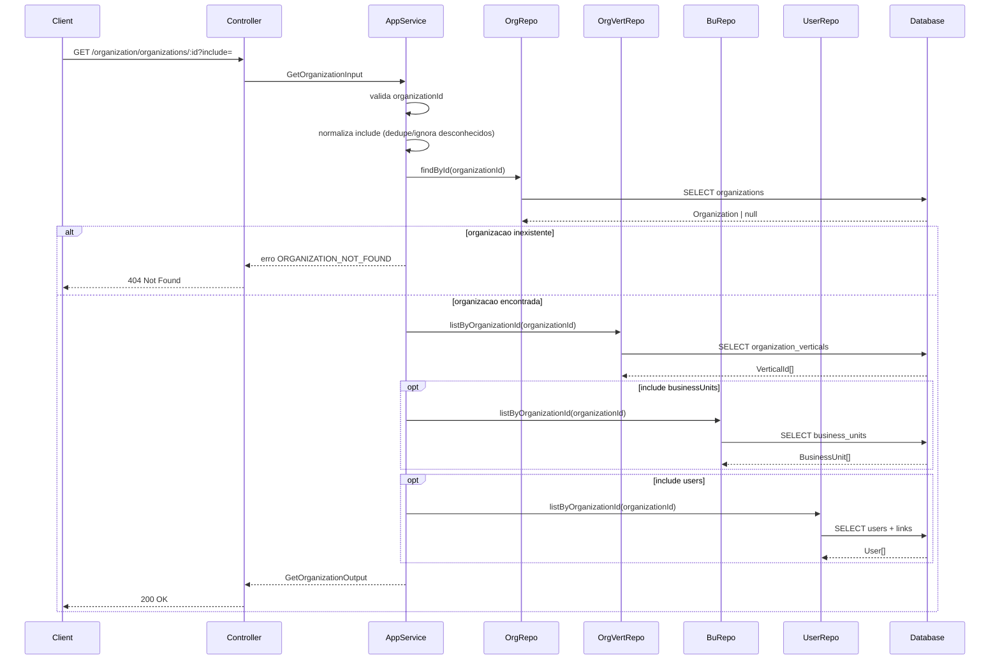
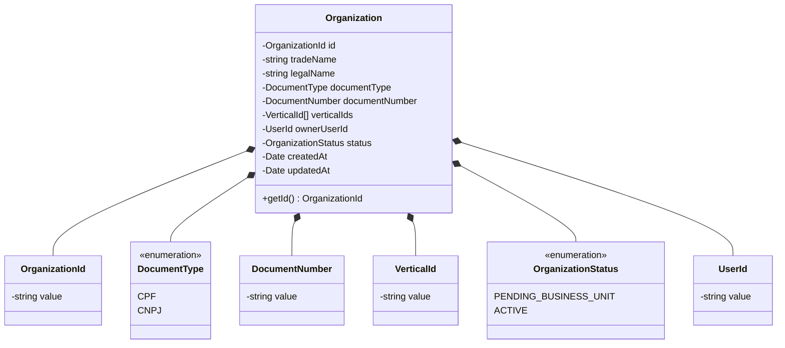
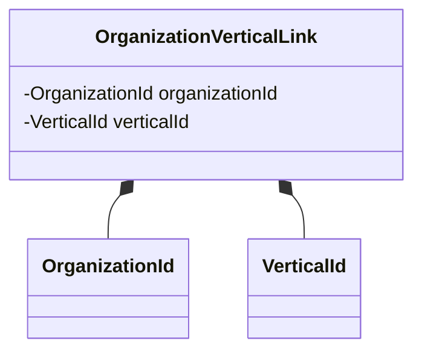
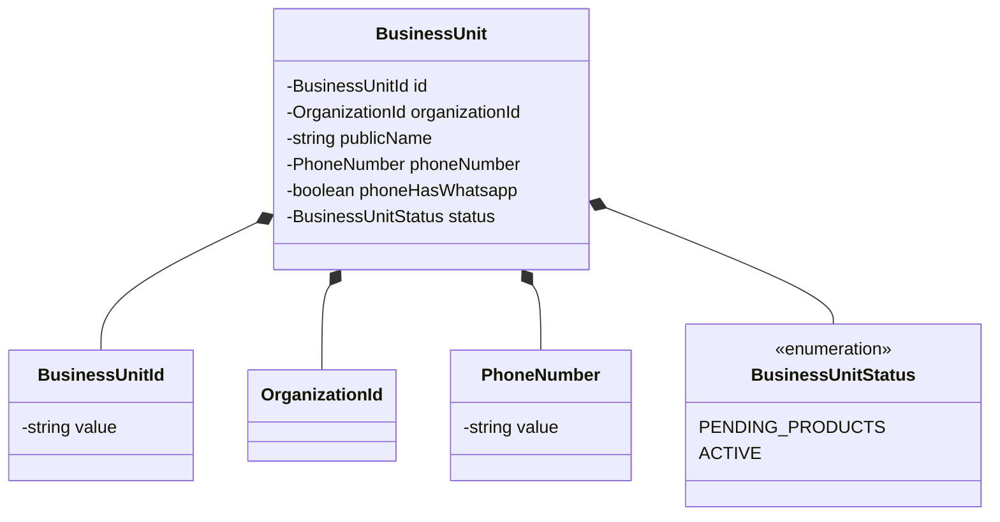
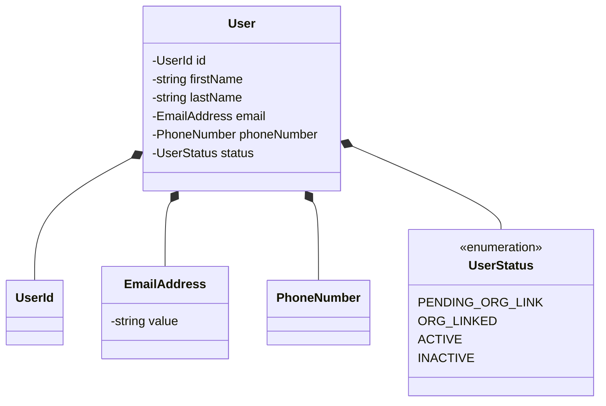
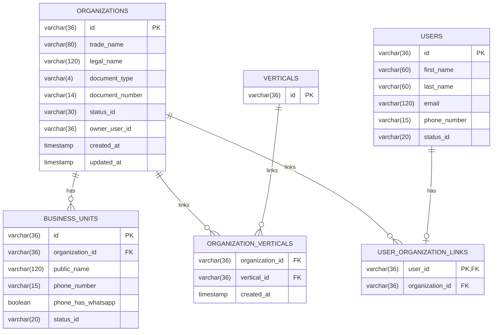
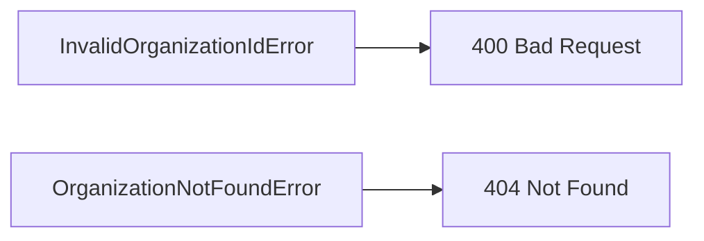

# Design: Get Organization

**Created**: 2026-01-08  
**Spec**: [./spec.md](./spec.md)  
**Project**: [../../../project.md](../../../project.md)

---

## Overview

A capability Get Organization no contexto Organization consulta uma organizacao por id e, quando solicitado, inclui unidades de negocio e usuarios vinculados.
A orquestracao ocorre no Application Service, que valida o OrganizationId, interpreta o parametro include e carrega apenas os relacionamentos pedidos.
A complexidade e moderada pelo include condicional e pela composicao do resultado.

---

## Component Map

### Domain Layer

| Tipo | Nome | Responsabilidade |
|------|------|------------------|
| Entity | `Organization` | Dados legais e status da organizacao |
| Entity | `BusinessUnit` | Unidade de negocio vinculada |
| Entity | `User` | Usuario vinculado a organizacao |
| Entity | `OrganizationVerticalLink` | Vinculo entre organizacao e vertical |
| Value Object | `OrganizationId` | Identificador unico da organizacao |
| Value Object | `BusinessUnitId` | Identificador unico da unidade |
| Value Object | `UserId` | Identificador unico do usuario |
| Value Object | `DocumentType` | Tipo do documento (CPF, CNPJ) |
| Value Object | `DocumentNumber` | Documento normalizado |
| Value Object | `VerticalId` | Identificador da vertical |
| Value Object | `OrganizationStatus` | Status da organizacao |
| Value Object | `BusinessUnitStatus` | Status da unidade |
| Value Object | `UserStatus` | Status do usuario |
| Value Object | `PhoneNumber` | Telefone normalizado |
| Value Object | `EmailAddress` | Email validado e normalizado |
| Repository Interface | `OrganizationRepository` | Consulta de organizacao |
| Repository Interface | `BusinessUnitRepository` | Lista unidades da organizacao |
| Repository Interface | `UserRepository` | Lista usuarios da organizacao |
| Repository Interface | `OrganizationVerticalRepository` | Lista verticais da organizacao |

### Application Layer

| Tipo | Nome | Responsabilidade |
|------|------|------------------|
| App Service | `GetOrganizationService` | Orquestra a consulta da organizacao |
| Input DTO | `GetOrganizationInput` | Dados de entrada (organizationId, include) |
| Output DTO | `GetOrganizationOutput` | Dados completos da organizacao + vinculos |

### Infrastructure Layer

| Tipo | Nome | Responsabilidade |
|------|------|------------------|
| Repository Impl | `PrismaOrganizationRepository` | Implementa `OrganizationRepository` |
| Repository Impl | `PrismaBusinessUnitRepository` | Implementa `BusinessUnitRepository` |
| Repository Impl | `PrismaUserRepository` | Implementa `UserRepository` |
| Repository Impl | `PrismaOrganizationVerticalRepository` | Implementa `OrganizationVerticalRepository` |
| Mapper | `OrganizationMapper` | Converte Domain <-> Prisma |
| Mapper | `BusinessUnitMapper` | Converte Domain <-> Prisma |
| Mapper | `UserMapper` | Converte Domain <-> Prisma |
| Mapper | `OrganizationVerticalMapper` | Converte Domain <-> Prisma |

### Presentation Layer

| Tipo | Nome | Responsabilidade |
|------|------|------------------|
| Controller | `OrganizationController` | Endpoint HTTP de consulta |

---

## Dependency Graph

```mermaid
graph TD
    subgraph Presentation
        CTRL[OrganizationController]
    end

    subgraph Application
        SVC[GetOrganizationService]
        DTO_IN[GetOrganizationInput]
        DTO_OUT[GetOrganizationOutput]
    end

    subgraph Domain
        ORG[Organization]
        BU[BusinessUnit]
        USER[User]
        ORG_VERT_LINK[OrganizationVerticalLink]
        VO_ORG[OrganizationId]
        VO_BU[BusinessUnitId]
        VO_USER[UserId]
        VO_DOC_TYPE[DocumentType]
        VO_DOC[DocumentNumber]
        VO_VERT_ID[VerticalId]
        VO_ORG_STATUS[OrganizationStatus]
        VO_BU_STATUS[BusinessUnitStatus]
        VO_USER_STATUS[UserStatus]
        VO_PHONE[PhoneNumber]
        VO_EMAIL[EmailAddress]
        ORG_REPO[OrganizationRepository]
        BU_REPO[BusinessUnitRepository]
        USER_REPO[UserRepository]
        ORG_VERT_REPO[OrganizationVerticalRepository]
    end

    subgraph Infrastructure
        ORG_REPO_IMPL[PrismaOrganizationRepository]
        BU_REPO_IMPL[PrismaBusinessUnitRepository]
        USER_REPO_IMPL[PrismaUserRepository]
        ORG_VERT_REPO_IMPL[PrismaOrganizationVerticalRepository]
        ORG_MAPPER[OrganizationMapper]
        BU_MAPPER[BusinessUnitMapper]
        USER_MAPPER[UserMapper]
        ORG_VERT_MAPPER[OrganizationVerticalMapper]
        PRISMA[Prisma Client]
    end

    CTRL --> SVC
    CTRL --> DTO_IN
    SVC --> DTO_OUT
    SVC --> ORG_REPO
    SVC --> BU_REPO
    SVC --> USER_REPO
    SVC --> ORG_VERT_REPO
    SVC --> ORG
    SVC --> BU
    SVC --> USER
    ORG --> VO_ORG
    ORG --> VO_DOC_TYPE
    ORG --> VO_DOC
    ORG --> VO_VERT_ID
    ORG --> VO_ORG_STATUS
    BU --> VO_BU
    BU --> VO_PHONE
    BU --> VO_BU_STATUS
    USER --> VO_USER
    USER --> VO_EMAIL
    USER --> VO_USER_STATUS
    ORG_VERT_LINK --> VO_ORG
    ORG_VERT_LINK --> VO_VERT_ID
    ORG_REPO_IMPL -.->|implements| ORG_REPO
    BU_REPO_IMPL -.->|implements| BU_REPO
    USER_REPO_IMPL -.->|implements| USER_REPO
    ORG_VERT_REPO_IMPL -.->|implements| ORG_VERT_REPO
    ORG_REPO_IMPL --> ORG_MAPPER
    BU_REPO_IMPL --> BU_MAPPER
    USER_REPO_IMPL --> USER_MAPPER
    ORG_VERT_REPO_IMPL --> ORG_VERT_MAPPER
    ORG_REPO_IMPL --> PRISMA
    BU_REPO_IMPL --> PRISMA
    USER_REPO_IMPL --> PRISMA
    ORG_VERT_REPO_IMPL --> PRISMA
    ORG_MAPPER --> ORG
    BU_MAPPER --> BU
    USER_MAPPER --> USER
    ORG_VERT_MAPPER --> ORG_VERT_LINK
```

---

## Data Flow

### Fluxo: Consultar Organizacao

**Transformacoes de dados:**

| Etapa | De | Para |
|-------|----|----- |
| Controller -> AppService | Params + query include | GetOrganizationInput |
| AppService -> Domain | DTO | Organization + summaries |
| Domain -> Presentation | Entities | GetOrganizationOutput |

---

## Entity Structure

### Organization

### OrganizationVerticalLink

### BusinessUnit

### User

---

## Repository Operations

| Operacao | Descricao | Usada por |
|----------|-----------|-----------|
| `OrganizationRepository.findById(id)` | Busca organizacao por id | GetOrganizationService |
| `OrganizationVerticalRepository.listByOrganizationId(orgId)` | Lista verticais vinculadas | GetOrganizationService |
| `BusinessUnitRepository.listByOrganizationId(orgId)` | Lista unidades vinculadas | GetOrganizationService |
| `UserRepository.listByOrganizationId(orgId)` | Lista usuarios vinculados | GetOrganizationService |

---

## Database Model

### Tabela: `organizations`

| Coluna | Tipo | Constraints |
|--------|------|-------------|
| `id` | VARCHAR(36) | PK |
| `trade_name` | VARCHAR(80) | NOT NULL |
| `legal_name` | VARCHAR(120) | NULL |
| `document_type` | VARCHAR(4) | NOT NULL |
| `document_number` | VARCHAR(14) | NOT NULL, UNIQUE |
| `status_id` | VARCHAR(30) | NOT NULL |
| `owner_user_id` | VARCHAR(36) | NOT NULL |
| `created_at` | TIMESTAMP | NOT NULL, DEFAULT now() |
| `updated_at` | TIMESTAMP | NULL |

### Tabela: `organization_verticals`

| Coluna | Tipo | Constraints |
|--------|------|-------------|
| `organization_id` | VARCHAR(36) | FK(organizations.id), NOT NULL |
| `vertical_id` | VARCHAR(36) | FK(verticals.id), NOT NULL |
| `created_at` | TIMESTAMP | NOT NULL, DEFAULT now() |

---

## API Endpoints

| Metodo | Path | Operacao | Sucesso | Erros |
|--------|------|----------|---------|-------|
| GET | `/organization/organizations/:id` | Consultar organizacao | 200 | 400, 404 |

---

## Error Handling

| Erro de Dominio | Quando Ocorre | HTTP Status | Codigo |
|-----------------|---------------|-------------|--------|
| `InvalidOrganizationIdError` | organizationId invalido | 400 | `INVALID_ORGANIZATION_ID` |
| `OrganizationNotFoundError` | organizacao inexistente | 404 | `ORGANIZATION_NOT_FOUND` |

---

## Technical Decisions

### Decisao 1: Include tratado como conjunto

**Contexto**: O parametro `include` pode ter valores desconhecidos ou repetidos.

**Decisao**: Normalizar `include` como set, ignorando valores invalidos e removendo duplicados.

**Justificativa**: Garante resposta deterministica e alinhada a spec.

---

### Decisao 2: Relacionamentos carregados sob demanda

**Contexto**: Business units e usuarios so devem ser retornados quando solicitados.

**Decisao**: Buscar `BusinessUnit` e `User` apenas quando `include` contiver os respectivos valores.

**Justificativa**: Evita custo desnecessario e cumpre FR-008.

---

### Decisao 3: Listas de vinculos ordenadas por createdAt desc

**Contexto**: A spec nao define ordenacao para listas embutidas.

**Decisao**: Ordenar unidades e usuarios por `createdAt desc` no repositorio.

**Justificativa**: Garante ordem consistente sem expor parametro adicional.

---

## Implementation Notes

- `include` ausente deve resultar em resposta sem `businessUnits` e `users`.
- Quando `include` solicitar vinculos inexistentes, retornar listas vazias.
- `organizationId` deve ser validado via `OrganizationId` antes das consultas.
- Sempre carregar e retornar `verticalIds` vinculados via `organization_verticals`.
- Usar projections para `BusinessUnitSummary` e `OrganizationUserSummary`.

---
