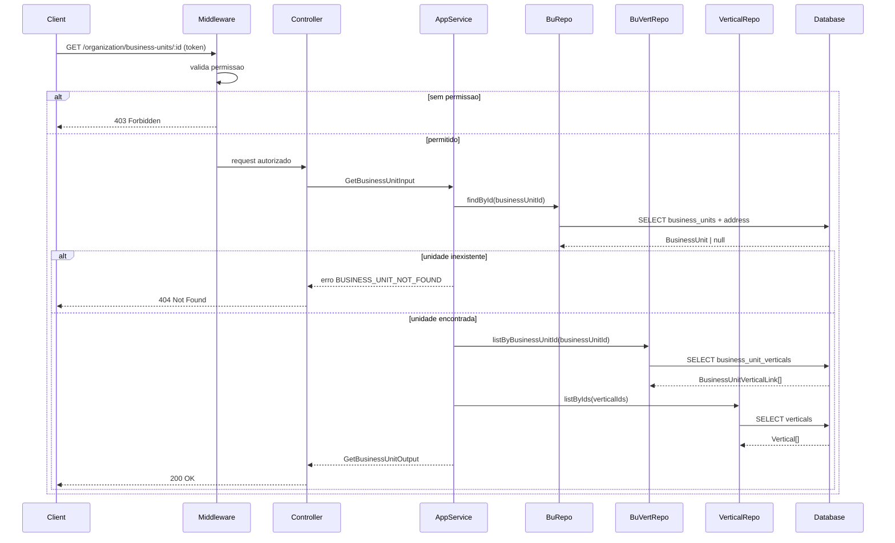
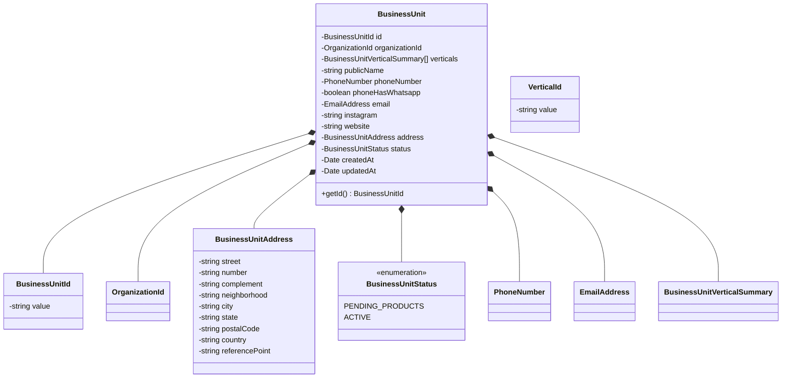
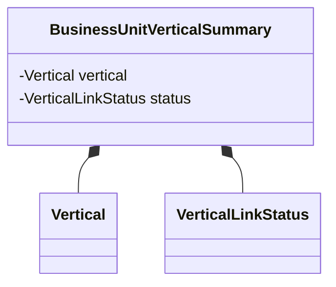
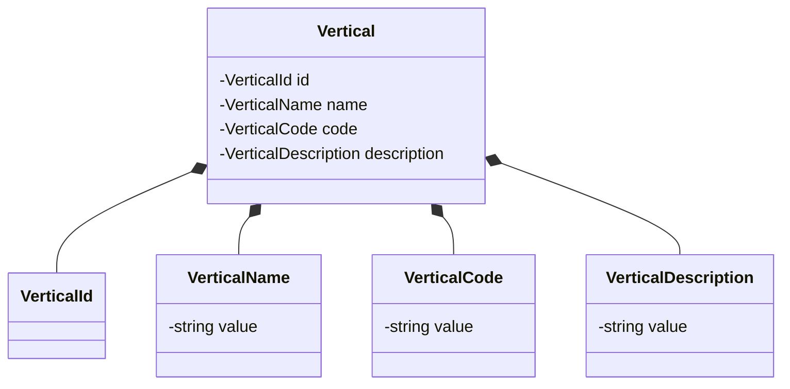
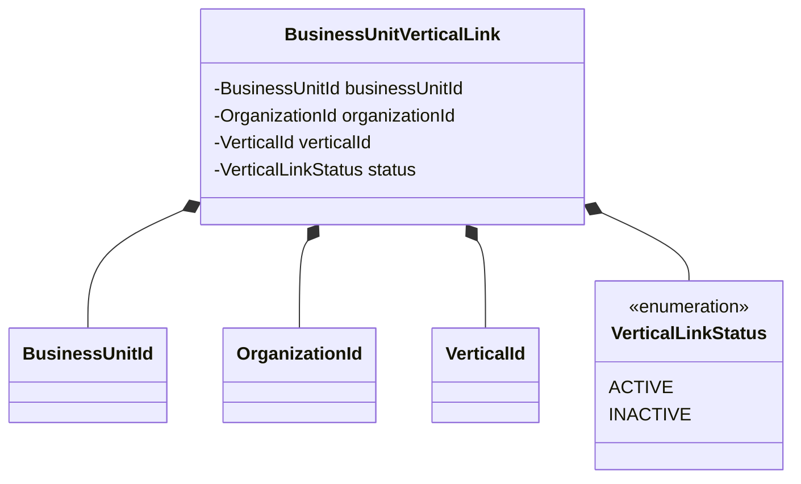
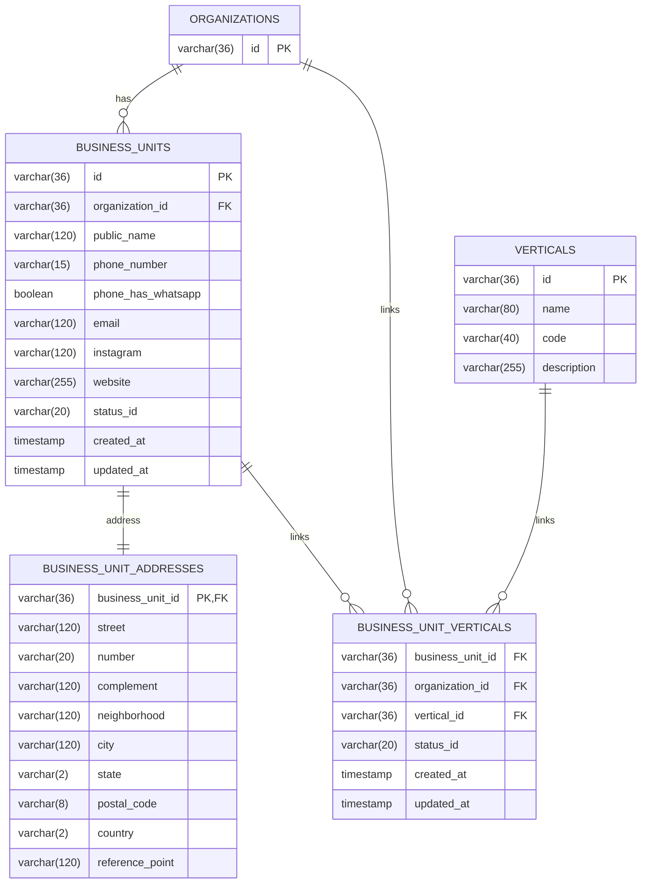
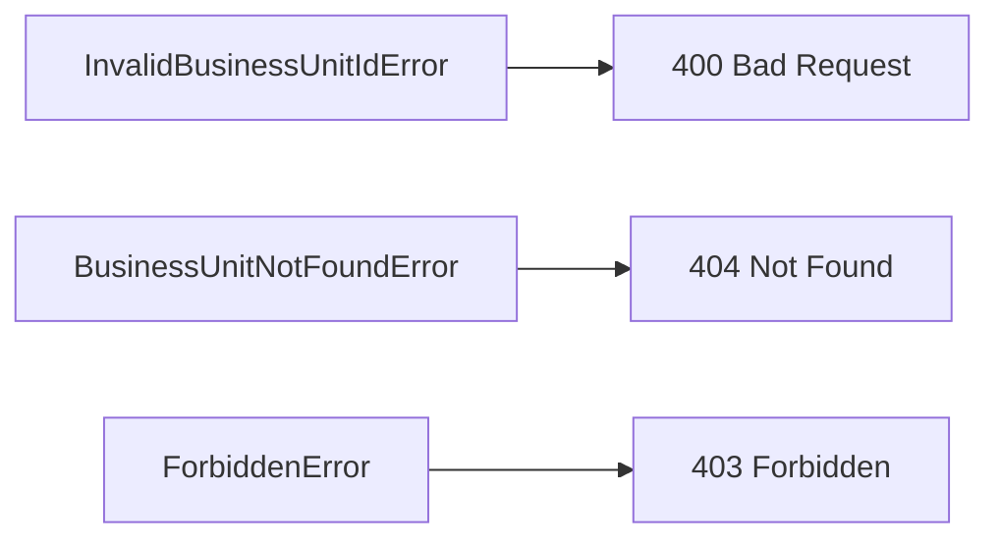

# Design: Get Business Unit

**Created**: 2026-01-08  
**Spec**: [./spec.md](./spec.md)  
**Project**: [../../../project.md](../../../project.md)

---

## Overview

A capability Get Business Unit no contexto Organization consulta uma unidade de negocio por id e retorna seus dados completos com endereco e verticais.
A orquestracao ocorre no Application Service, que valida o BusinessUnitId, aplica politica de acesso e carrega a unidade com seu endereco e os vinculos de verticais.
A complexidade e baixa, com foco em leitura consistente e retorno completo do ponto de venda.

---

## Component Map

### Domain Layer

| Tipo | Nome | Responsabilidade |
|------|------|------------------|
| Entity | `BusinessUnit` | Unidade de negocio e status atual |
| Entity | `BusinessUnitVerticalLink` | Vinculo entre unidade e vertical |
| Entity | `Vertical` | Dados basicos da vertical |
| Value Object | `BusinessUnitId` | Identificador unico da unidade |
| Value Object | `OrganizationId` | Identificador unico da organizacao |
| Value Object | `BusinessUnitAddress` | Endereco completo da unidade |
| Value Object | `BusinessUnitStatus` | Status atual da unidade |
| Value Object | `VerticalId` | Identificador da vertical |
| Value Object | `VerticalName` | Nome normalizado |
| Value Object | `VerticalCode` | Codigo UPPERCASE com `_` |
| Value Object | `VerticalDescription` | Descricao normalizada |
| Value Object | `VerticalLinkStatus` | Estado do vinculo (ACTIVE, INACTIVE) |
| Value Object | `PhoneNumber` | Telefone normalizado |
| Value Object | `EmailAddress` | Email validado e normalizado |
| Repository Interface | `BusinessUnitRepository` | Consulta de unidade por id |
| Repository Interface | `BusinessUnitVerticalRepository` | Lista verticais da unidade |
| Repository Interface | `VerticalRepository` | Consulta dados basicos de verticais |

### Application Layer

| Tipo | Nome | Responsabilidade |
|------|------|------------------|
| App Service | `GetBusinessUnitService` | Orquestra a consulta da unidade |
| Input DTO | `GetBusinessUnitInput` | Dados de entrada (businessUnitId, actorUserId) |
| Output DTO | `GetBusinessUnitOutput` | Dados completos da unidade |

### Infrastructure Layer

| Tipo | Nome | Responsabilidade |
|------|------|------------------|
| Repository Impl | `PrismaBusinessUnitRepository` | Implementa `BusinessUnitRepository` |
| Repository Impl | `PrismaBusinessUnitVerticalRepository` | Implementa `BusinessUnitVerticalRepository` |
| Repository Impl | `PrismaVerticalRepository` | Implementa `VerticalRepository` |
| Mapper | `BusinessUnitMapper` | Converte Domain <-> Prisma |
| Mapper | `BusinessUnitVerticalMapper` | Converte Domain <-> Prisma |
| Mapper | `VerticalMapper` | Converte Domain <-> Prisma |

### Presentation Layer

| Tipo | Nome | Responsabilidade |
|------|------|------------------|
| Controller | `BusinessUnitController` | Endpoint HTTP de consulta |
| Middleware | `AccessControlMiddleware` | Valida permissao e rejeita com FORBIDDEN |

---

## Dependency Graph

```mermaid
graph TD
    subgraph Presentation
        MW[AccessControlMiddleware]
        CTRL[BusinessUnitController]
    end

    subgraph Application
        SVC[GetBusinessUnitService]
        DTO_IN[GetBusinessUnitInput]
        DTO_OUT[GetBusinessUnitOutput]
    end

    subgraph Domain
        BU[BusinessUnit]
        BU_VERT_LINK[BusinessUnitVerticalLink]
        VERT[Vertical]
        VO_ID[BusinessUnitId]
        VO_ORG[OrganizationId]
        VO_ADDR[BusinessUnitAddress]
        VO_STATUS[BusinessUnitStatus]
        VO_VERT_ID[VerticalId]
        VO_VERT_NAME[VerticalName]
        VO_VERT_CODE[VerticalCode]
        VO_VERT_DESC[VerticalDescription]
        VO_LINK_STATUS[VerticalLinkStatus]
        VO_PHONE[PhoneNumber]
        VO_EMAIL[EmailAddress]
        BU_REPO[BusinessUnitRepository]
        BU_VERT_REPO[BusinessUnitVerticalRepository]
        VERT_REPO[VerticalRepository]
    end

    subgraph Infrastructure
        BU_REPO_IMPL[PrismaBusinessUnitRepository]
        BU_VERT_REPO_IMPL[PrismaBusinessUnitVerticalRepository]
        VERT_REPO_IMPL[PrismaVerticalRepository]
        BU_MAPPER[BusinessUnitMapper]
        BU_VERT_MAPPER[BusinessUnitVerticalMapper]
        VERT_MAPPER[VerticalMapper]
        PRISMA[Prisma Client]
    end

    MW --> CTRL
    CTRL --> SVC
    CTRL --> DTO_IN
    SVC --> DTO_OUT
    SVC --> BU_REPO
    SVC --> BU
    SVC --> BU_VERT_REPO
    SVC --> VERT_REPO
    SVC --> VERT
    BU --> VO_ID
    BU --> VO_ORG
    BU --> VO_ADDR
    BU --> VO_STATUS
    BU --> VO_PHONE
    BU --> VO_EMAIL
    BU_VERT_LINK --> VO_ID
    BU_VERT_LINK --> VO_ORG
    BU_VERT_LINK --> VO_VERT_ID
    BU_VERT_LINK --> VO_LINK_STATUS
    VERT --> VO_VERT_ID
    VERT --> VO_VERT_NAME
    VERT --> VO_VERT_CODE
    VERT --> VO_VERT_DESC
    BU_REPO_IMPL -.->|implements| BU_REPO
    BU_VERT_REPO_IMPL -.->|implements| BU_VERT_REPO
    VERT_REPO_IMPL -.->|implements| VERT_REPO
    BU_REPO_IMPL --> BU_MAPPER
    BU_VERT_REPO_IMPL --> BU_VERT_MAPPER
    VERT_REPO_IMPL --> VERT_MAPPER
    BU_REPO_IMPL --> PRISMA
    BU_VERT_REPO_IMPL --> PRISMA
    VERT_REPO_IMPL --> PRISMA
    BU_MAPPER --> BU
    BU_VERT_MAPPER --> BU_VERT_LINK
    VERT_MAPPER --> VERT
```

---

## Data Flow

### Fluxo: Consultar Business Unit

**Transformacoes de dados:**

| Etapa | De | Para |
|-------|----|----- |
| Controller -> AppService | Params + actorUserId | GetBusinessUnitInput |
| AppService -> Domain | DTO | BusinessUnit + verticals |
| Domain -> Presentation | Entity | GetBusinessUnitOutput |

---

## Entity Structure

### BusinessUnit

**Propriedades:**

| Propriedade | Tipo | Mutavel? | Regras |
|-------------|------|----------|--------|
| `id` | BusinessUnitId | Nao | Obrigatorio |
| `organizationId` | OrganizationId | Nao | Obrigatorio |
| `publicName` | string | Nao | Obrigatorio |
| `phoneNumber` | PhoneNumber | Nao | Apenas digitos |
| `phoneHasWhatsapp` | boolean | Nao | Obrigatorio |
| `email` | EmailAddress | Nao | Opcional |
| `instagram` | string | Nao | Opcional |
| `website` | string | Nao | Opcional |
| `address` | BusinessUnitAddress | Nao | Obrigatorio |
| `verticals` | BusinessUnitVerticalSummary[] | Nao | 1+ itens com status |
| `status` | BusinessUnitStatus | Nao | Retornar estado atual |
| `createdAt` | Date | Nao | Obrigatorio |
| `updatedAt` | Date | Sim | Opcional |

### BusinessUnitVerticalSummary

### Vertical

### BusinessUnitVerticalLink

---

## Repository Operations

| Operacao | Descricao | Usada por |
|----------|-----------|-----------|
| `BusinessUnitRepository.findById(id)` | Busca unidade por id com endereco | GetBusinessUnitService |
| `BusinessUnitVerticalRepository.listByBusinessUnitId(id)` | Lista verticais da unidade | GetBusinessUnitService |
| `VerticalRepository.listByIds(ids)` | Carrega dados das verticais | GetBusinessUnitService |

---

## Database Model

### Tabela: `business_units`

| Coluna | Tipo | Constraints |
|--------|------|-------------|
| `id` | VARCHAR(36) | PK |
| `organization_id` | VARCHAR(36) | FK(organizations.id), NOT NULL |
| `public_name` | VARCHAR(120) | NOT NULL |
| `phone_number` | VARCHAR(15) | NOT NULL |
| `phone_has_whatsapp` | BOOLEAN | NOT NULL |
| `email` | VARCHAR(120) | NULL |
| `instagram` | VARCHAR(120) | NULL |
| `website` | VARCHAR(255) | NULL |
| `status_id` | VARCHAR(20) | NOT NULL |
| `created_at` | TIMESTAMP | NOT NULL, DEFAULT now() |
| `updated_at` | TIMESTAMP | NULL |

### Tabela: `business_unit_addresses`

| Coluna | Tipo | Constraints |
|--------|------|-------------|
| `business_unit_id` | VARCHAR(36) | PK, FK(business_units.id) |
| `street` | VARCHAR(120) | NOT NULL |
| `number` | VARCHAR(20) | NOT NULL |
| `complement` | VARCHAR(120) | NULL |
| `neighborhood` | VARCHAR(120) | NOT NULL |
| `city` | VARCHAR(120) | NOT NULL |
| `state` | VARCHAR(2) | NOT NULL |
| `postal_code` | VARCHAR(8) | NOT NULL |
| `country` | VARCHAR(2) | NOT NULL |
| `reference_point` | VARCHAR(120) | NOT NULL |

### Tabela: `business_unit_verticals`

| Coluna | Tipo | Constraints |
|--------|------|-------------|
| `business_unit_id` | VARCHAR(36) | FK(business_units.id), NOT NULL |
| `organization_id` | VARCHAR(36) | FK(organizations.id), NOT NULL |
| `vertical_id` | VARCHAR(36) | FK(verticals.id), NOT NULL |
| `status_id` | VARCHAR(20) | NOT NULL |
| `created_at` | TIMESTAMP | NOT NULL, DEFAULT now() |
| `updated_at` | TIMESTAMP | NULL |

### Tabela: `verticals`

| Coluna | Tipo | Constraints |
|--------|------|-------------|
| `id` | VARCHAR(36) | PK |
| `name` | VARCHAR(80) | NOT NULL |
| `code` | VARCHAR(40) | NOT NULL, UNIQUE |
| `description` | VARCHAR(255) | NOT NULL |

---

## API Endpoints

| Metodo | Path | Operacao | Sucesso | Erros |
|--------|------|----------|---------|-------|
| GET | `/organization/business-units/:id` | Consultar unidade de negocio | 200 | 400, 403, 404 |

---

## Error Handling

| Erro de Dominio | Quando Ocorre | HTTP Status | Codigo |
|-----------------|---------------|-------------|--------|
| `InvalidBusinessUnitIdError` | businessUnitId invalido | 400 | `INVALID_BUSINESS_UNIT_ID` |
| `BusinessUnitNotFoundError` | unidade inexistente | 404 | `BUSINESS_UNIT_NOT_FOUND` |
| `ForbiddenError` | sem permissao para consultar | 403 | `FORBIDDEN` |

---

## Technical Decisions

### Decisao 1: Permissao validada antes da consulta

**Contexto**: A spec exige rejeitar consultas sem permissao.

**Decisao**: `AccessControlMiddleware` valida a permissao do solicitante antes de chamar o `GetBusinessUnitService`.

**Justificativa**: Bloqueia acesso cedo e padroniza respostas 403 na camada de presentation.

---

### Decisao 2: Carregar unidade e endereco em uma consulta

**Contexto**: O retorno exige dados completos da unidade e endereco.

**Decisao**: `BusinessUnitRepository.findById` retorna a unidade com seu `BusinessUnitAddress` em uma unica query.

**Justificativa**: Evita round-trips e garante consistencia do retorno.

---

### Decisao 3: Retornar vinculos com status

**Contexto**: A consulta deve retornar o status do vinculo de cada vertical.

**Decisao**: Carregar todos os registros de `business_unit_verticals` e combinar com os dados de `verticals`, expondo o `statusId`.

**Justificativa**: Permite visualizar o estado atual de cada vertical vinculada a unidade.

---

## Implementation Notes

- Validar `businessUnitId` via `BusinessUnitId` antes de consultar o repositorio.
- Sempre incluir `address` no output, mesmo quando campos opcionais estiverem vazios.
- Retornar `statusId` conforme estado atual do `BusinessUnitStatus`.
- Carregar verticais e incluir `id`, `name`, `code`, `description` e `statusId` do vinculo no output.

---
