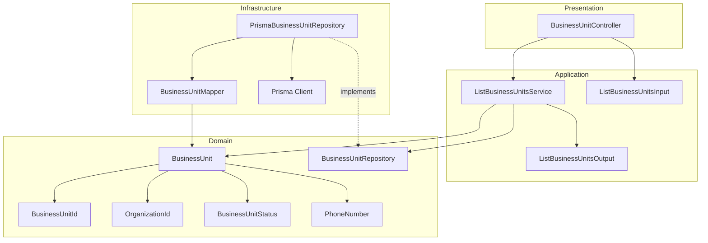
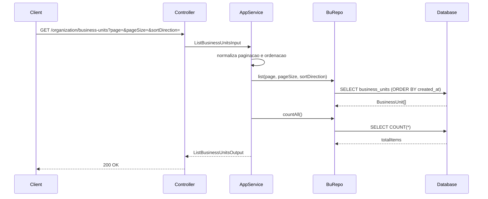
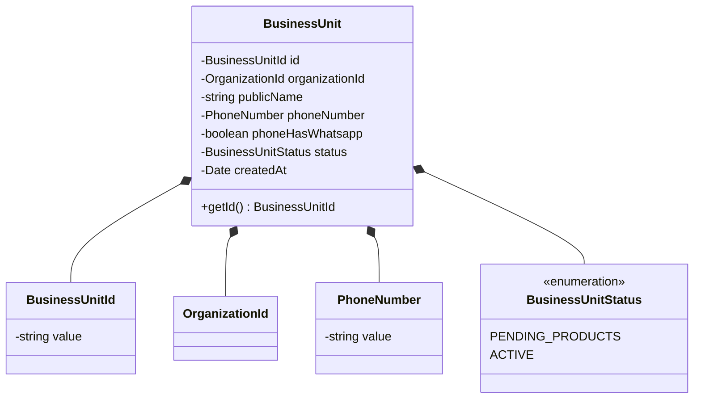
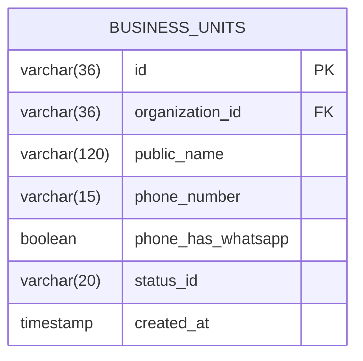

# Design: List Business Units

**Created**: 2026-01-08  
**Spec**: [./spec.md](./spec.md)  
**Project**: [../../../project.md](../../../project.md)

---

## Overview

A capability List Business Units no contexto Organization retorna unidades de negocio cadastradas com metadados de paginacao.
A orquestracao ocorre no Application Service, que normaliza paginacao e ordenacao por createdAt e consulta o repositorio.
A complexidade e baixa, com foco em leitura paginada e resposta consistente.

---

## Component Map

### Domain Layer

| Tipo | Nome | Responsabilidade |
|------|------|------------------|
| Entity | `BusinessUnit` | Dados basicos da unidade de negocio |
| Value Object | `BusinessUnitId` | Identificador unico da unidade |
| Value Object | `OrganizationId` | Identificador unico da organizacao |
| Value Object | `BusinessUnitStatus` | Status atual da unidade |
| Value Object | `PhoneNumber` | Telefone normalizado |
| Repository Interface | `BusinessUnitRepository` | Listagem e totalizacao de unidades |

### Application Layer

| Tipo | Nome | Responsabilidade |
|------|------|------------------|
| App Service | `ListBusinessUnitsService` | Orquestra a listagem paginada |
| Input DTO | `ListBusinessUnitsInput` | Parametros de paginacao e ordenacao |
| Output DTO | `ListBusinessUnitsOutput` | Lista de unidades + metadados |

### Infrastructure Layer

| Tipo | Nome | Responsabilidade |
|------|------|------------------|
| Repository Impl | `PrismaBusinessUnitRepository` | Implementa `BusinessUnitRepository` |
| Mapper | `BusinessUnitMapper` | Converte Domain <-> Prisma |

### Presentation Layer

| Tipo | Nome | Responsabilidade |
|------|------|------------------|
| Controller | `BusinessUnitController` | Endpoint HTTP de listagem |

---

## Dependency Graph

---

## Data Flow

### Fluxo: Listar Business Units

**Transformacoes de dados:**

| Etapa | De | Para |
|-------|----|----- |
| Controller -> AppService | Query params | ListBusinessUnitsInput |
| AppService -> Domain | DTO | BusinessUnit |
| Domain -> Presentation | Entities | ListBusinessUnitsOutput |

---

## Entity Structure

### BusinessUnit

---

## Repository Operations

| Operacao | Descricao | Usada por |
|----------|-----------|-----------|
| `BusinessUnitRepository.list(page, pageSize, sortDirection)` | Lista unidades paginadas | ListBusinessUnitsService |
| `BusinessUnitRepository.countAll()` | Total de unidades | ListBusinessUnitsService |

---

## Database Model

### Tabela: `business_units`

| Coluna | Tipo | Constraints |
|--------|------|-------------|
| `id` | VARCHAR(36) | PK |
| `organization_id` | VARCHAR(36) | FK(organizations.id), NOT NULL |
| `public_name` | VARCHAR(120) | NOT NULL |
| `phone_number` | VARCHAR(15) | NOT NULL |
| `phone_has_whatsapp` | BOOLEAN | NOT NULL |
| `status_id` | VARCHAR(20) | NOT NULL |
| `created_at` | TIMESTAMP | NOT NULL, DEFAULT now() |

---

## API Endpoints

| Metodo | Path | Operacao | Sucesso | Erros |
|--------|------|----------|---------|-------|
| GET | `/organization/business-units` | Listar unidades de negocio | 200 | 500 |

---

## Error Handling

| Erro de Dominio | Quando Ocorre | HTTP Status | Codigo |
|-----------------|---------------|-------------|--------|
| `InfrastructureError` | Falha inesperada de infraestrutura | 500 | `INTERNAL_ERROR` |

---

## Technical Decisions

### Decisao 1: Normalizacao de paginacao e ordenacao na aplicacao

**Contexto**: A spec define ajustes automaticos para `page`, `pageSize` e `sortDirection` invalidos.

**Decisao**: O `ListBusinessUnitsService` normaliza valores para `page = 1`, `pageSize = 20` e `sortDirection = desc` quando necessario.

**Justificativa**: Mantem comportamento consistente e evita erros desnecessarios.

---

### Decisao 2: Sem filtros adicionais

**Contexto**: A listagem nao deve aplicar filtros alem de paginacao e ordenacao.

**Decisao**: O repositorio aplica apenas `LIMIT/OFFSET` e `ORDER BY created_at`.

**Justificativa**: Garante aderencia total aos requisitos.

---

## Implementation Notes

- Se `items` estiver vazio, retornar `totalItems = 0` e `totalPages = 0`.
- Ordenar sempre por `createdAt` conforme `sortDirection`.
- Nao aplicar filtros adicionais.

---
