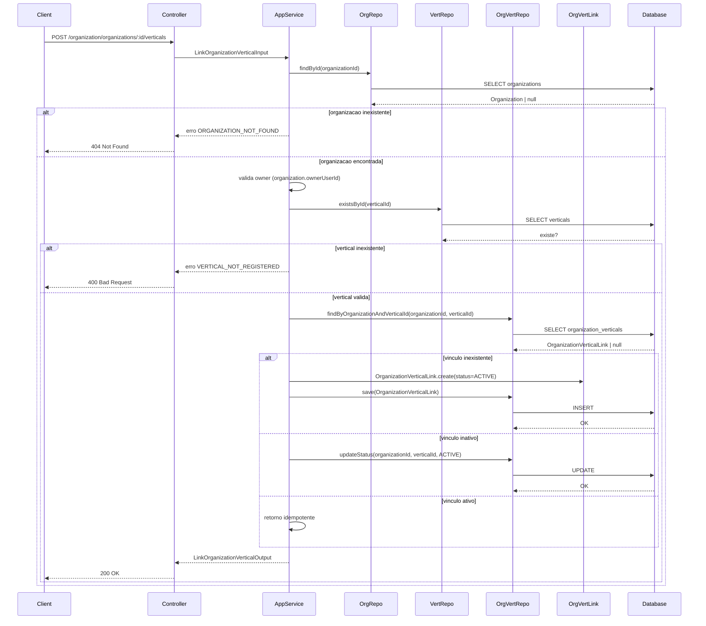
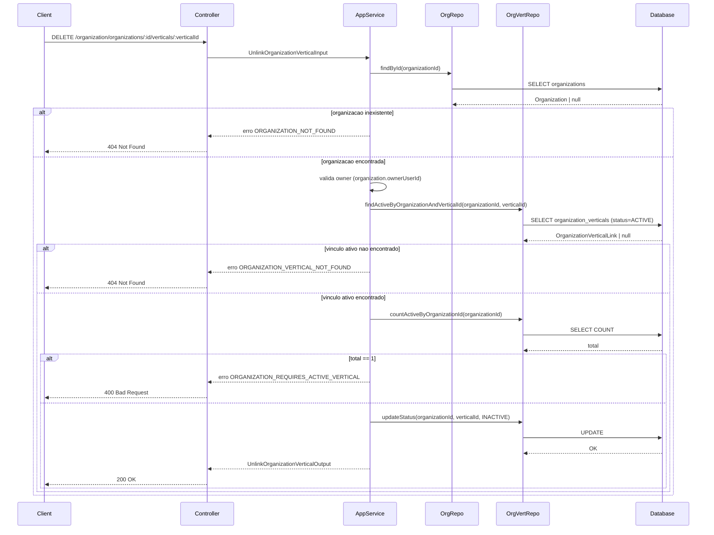
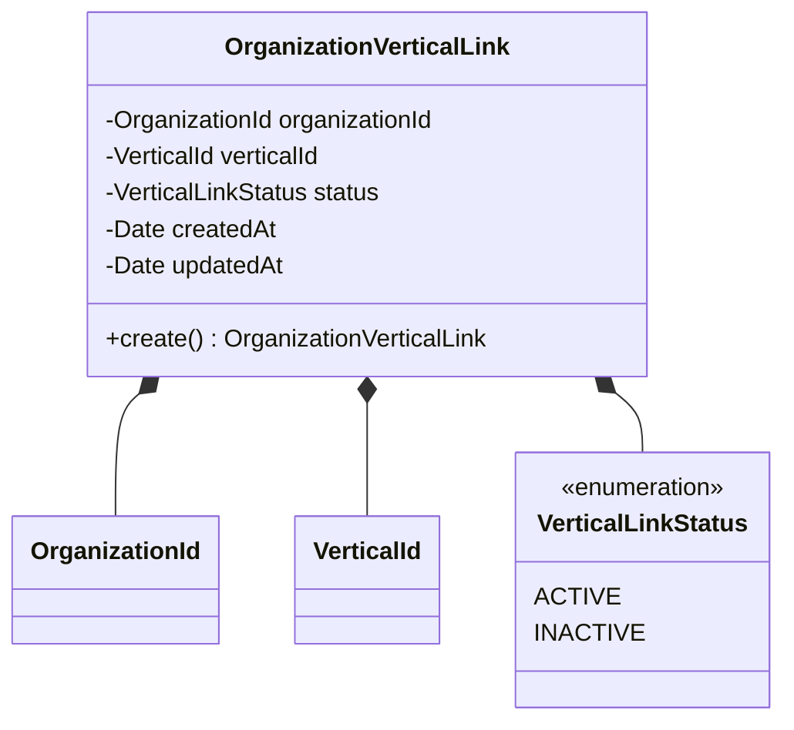
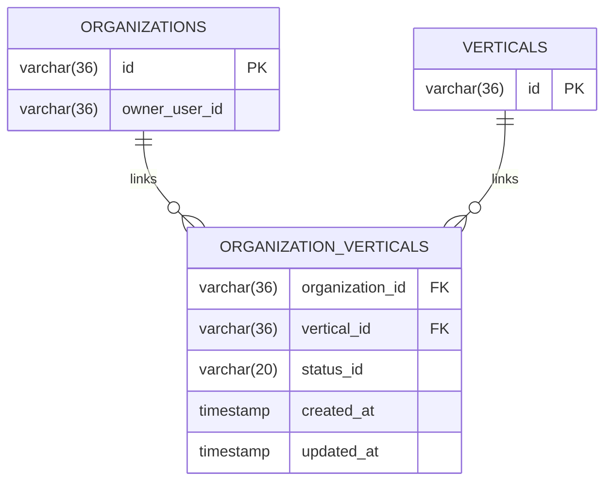
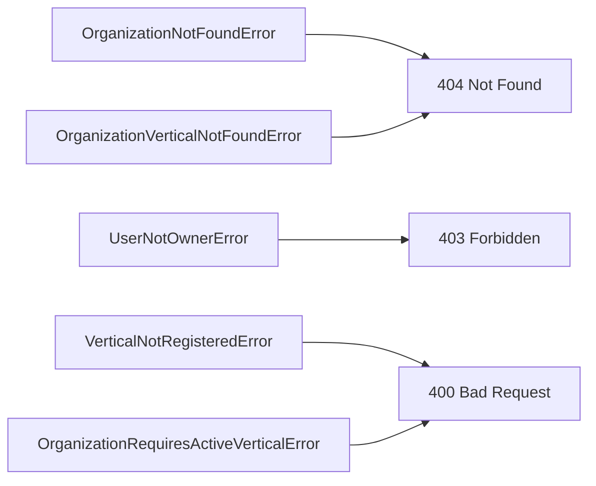

# Design: Manage Organization Verticals

**Created**: 2026-01-17  
**Spec**: [./spec.md](./spec.md)  
**Project**: [../../../project.md](../../../project.md)

---

## Overview

A capability Manage Organization Verticals permite vincular e desativar verticais de uma organizacao existente.
A orquestracao ocorre no Application Service, que valida organizacao e ownership, verifica existencia de vertical e atualiza o status do vinculo.
A complexidade e moderada por regras de reativacao e pela restricao de manter ao menos uma vertical ativa.

---

## Component Map

### Domain Layer

| Tipo | Nome | Responsabilidade |
|------|------|------------------|
| Entity | `Organization` | Organizacao e owner atual |
| Entity | `OrganizationVerticalLink` | Vinculo organizacao-vertical com status |
| Value Object | `OrganizationId` | Identificador unico da organizacao |
| Value Object | `VerticalId` | Identificador da vertical |
| Value Object | `UserId` | Identificador do usuario solicitante |
| Value Object | `VerticalLinkStatus` | Estado do vinculo (ACTIVE, INACTIVE) |
| Repository Interface | `OrganizationRepository` | Consulta de organizacao |
| Repository Interface | `OrganizationVerticalRepository` | Persistencia e consulta de vinculos |
| Repository Interface | `VerticalRepository` | Validacao de vertical existente |

### Application Layer

| Tipo | Nome | Responsabilidade |
|------|------|------------------|
| App Service | `LinkOrganizationVerticalService` | Orquestra o vinculo de vertical |
| App Service | `UnlinkOrganizationVerticalService` | Orquestra a desativacao de vertical |
| Input DTO | `LinkOrganizationVerticalInput` | Dados de entrada para vinculo |
| Input DTO | `UnlinkOrganizationVerticalInput` | Dados de entrada para desvinculo |
| Output DTO | `LinkOrganizationVerticalOutput` | Resultado do vinculo |
| Output DTO | `UnlinkOrganizationVerticalOutput` | Resultado do desvinculo |

### Infrastructure Layer

| Tipo | Nome | Responsabilidade |
|------|------|------------------|
| Repository Impl | `PrismaOrganizationRepository` | Implementa `OrganizationRepository` |
| Repository Impl | `PrismaOrganizationVerticalRepository` | Implementa `OrganizationVerticalRepository` |
| Repository Impl | `PrismaVerticalRepository` | Implementa `VerticalRepository` |
| Mapper | `OrganizationVerticalMapper` | Converte Domain <-> Prisma |

### Presentation Layer

| Tipo | Nome | Responsabilidade |
|------|------|------------------|
| Controller | `OrganizationVerticalController` | Endpoints HTTP de vinculo e desvinculo |

---

## Dependency Graph

```mermaid
graph TD
    subgraph Presentation
        CTRL[OrganizationVerticalController]
    end

    subgraph Application
        SVC_LINK[LinkOrganizationVerticalService]
        SVC_UNLINK[UnlinkOrganizationVerticalService]
        DTO_IN_LINK[LinkOrganizationVerticalInput]
        DTO_IN_UNLINK[UnlinkOrganizationVerticalInput]
        DTO_OUT_LINK[LinkOrganizationVerticalOutput]
        DTO_OUT_UNLINK[UnlinkOrganizationVerticalOutput]
    end

    subgraph Domain
        ORG[Organization]
        ORG_VERT_LINK[OrganizationVerticalLink]
        VO_ORG[OrganizationId]
        VO_VERT[VerticalId]
        VO_USER[UserId]
        VO_STATUS[VerticalLinkStatus]
        ORG_REPO[OrganizationRepository]
        ORG_VERT_REPO[OrganizationVerticalRepository]
        VERT_REPO[VerticalRepository]
    end

    subgraph Infrastructure
        ORG_REPO_IMPL[PrismaOrganizationRepository]
        ORG_VERT_REPO_IMPL[PrismaOrganizationVerticalRepository]
        VERT_REPO_IMPL[PrismaVerticalRepository]
        ORG_VERT_MAPPER[OrganizationVerticalMapper]
        PRISMA[Prisma Client]
    end

    CTRL --> SVC_LINK
    CTRL --> SVC_UNLINK
    CTRL --> DTO_IN_LINK
    CTRL --> DTO_IN_UNLINK
    SVC_LINK --> DTO_OUT_LINK
    SVC_UNLINK --> DTO_OUT_UNLINK
    SVC_LINK --> ORG_REPO
    SVC_LINK --> ORG_VERT_REPO
    SVC_LINK --> VERT_REPO
    SVC_UNLINK --> ORG_REPO
    SVC_UNLINK --> ORG_VERT_REPO
    SVC_LINK --> ORG
    SVC_UNLINK --> ORG
    ORG_VERT_LINK --> VO_ORG
    ORG_VERT_LINK --> VO_VERT
    ORG_VERT_LINK --> VO_STATUS
    ORG --> VO_ORG
    ORG --> VO_USER
    ORG_REPO_IMPL -.->|implements| ORG_REPO
    ORG_VERT_REPO_IMPL -.->|implements| ORG_VERT_REPO
    VERT_REPO_IMPL -.->|implements| VERT_REPO
    ORG_VERT_REPO_IMPL --> ORG_VERT_MAPPER
    ORG_REPO_IMPL --> PRISMA
    ORG_VERT_REPO_IMPL --> PRISMA
    VERT_REPO_IMPL --> PRISMA
    ORG_VERT_MAPPER --> ORG_VERT_LINK
```

---

## Data Flow

### Fluxo: Vincular vertical

### Fluxo: Desvincular vertical

**Transformacoes de dados:**

| Etapa | De | Para |
|-------|----|----- |
| Controller -> AppService | Params + actorUserId | Link/Unlink OrganizationVerticalInput |
| AppService -> Domain | DTO | OrganizationVerticalLink |
| Domain -> Infra | Entity | Prisma Models |

---

## Entity Structure

### OrganizationVerticalLink

**Propriedades:**

| Propriedade | Tipo | Mutavel? | Regras |
|-------------|------|----------|--------|
| `organizationId` | OrganizationId | Nao | Obrigatorio |
| `verticalId` | VerticalId | Nao | Obrigatorio |
| `status` | VerticalLinkStatus | Sim | Default ACTIVE |
| `createdAt` | Date | Nao | Obrigatorio |
| `updatedAt` | Date | Sim | Opcional |

---

## Repository Operations

| Operacao | Descricao | Usada por |
|----------|-----------|-----------|
| `OrganizationRepository.findById(id)` | Busca organizacao por id | Link/UnlinkOrganizationVerticalService |
| `VerticalRepository.existsById(id)` | Valida existencia de vertical | LinkOrganizationVerticalService |
| `OrganizationVerticalRepository.findByOrganizationAndVerticalId(orgId, verticalId)` | Busca vinculo existente | LinkOrganizationVerticalService |
| `OrganizationVerticalRepository.findActiveByOrganizationAndVerticalId(orgId, verticalId)` | Busca vinculo ativo | UnlinkOrganizationVerticalService |
| `OrganizationVerticalRepository.save(link)` | Persiste novo vinculo | LinkOrganizationVerticalService |
| `OrganizationVerticalRepository.updateStatus(orgId, verticalId, status)` | Atualiza status do vinculo | Link/UnlinkOrganizationVerticalService |
| `OrganizationVerticalRepository.countActiveByOrganizationId(orgId)` | Conta vinculos ativos | UnlinkOrganizationVerticalService |

---

## Database Model

### Tabela: `organization_verticals`

| Coluna | Tipo | Constraints |
|--------|------|-------------|
| `organization_id` | VARCHAR(36) | FK(organizations.id), NOT NULL |
| `vertical_id` | VARCHAR(36) | FK(verticals.id), NOT NULL |
| `status_id` | VARCHAR(20) | NOT NULL |
| `created_at` | TIMESTAMP | NOT NULL, DEFAULT now() |
| `updated_at` | TIMESTAMP | NULL |

---

## API Endpoints

| Metodo | Path | Operacao | Sucesso | Erros |
|--------|------|----------|---------|-------|
| POST | `/organization/organizations/:organizationId/verticals` | Vincular vertical | 200 | 400, 403, 404 |
| DELETE | `/organization/organizations/:organizationId/verticals/:verticalId` | Desvincular vertical | 200 | 400, 403, 404 |

---

## Error Handling

| Erro de Dominio | Quando Ocorre | HTTP Status | Codigo |
|-----------------|---------------|-------------|--------|
| `OrganizationNotFoundError` | organizationId inexistente | 404 | `ORGANIZATION_NOT_FOUND` |
| `UserNotOwnerError` | usuario nao e owner da organizacao | 403 | `USER_NOT_OWNER` |
| `VerticalNotRegisteredError` | verticalId inexistente | 400 | `VERTICAL_NOT_REGISTERED` |
| `OrganizationVerticalNotFoundError` | vinculo ativo inexistente | 404 | `ORGANIZATION_VERTICAL_NOT_FOUND` |
| `OrganizationRequiresActiveVerticalError` | tentativa de remover ultima vertical ativa | 400 | `ORGANIZATION_REQUIRES_ACTIVE_VERTICAL` |

---

## Technical Decisions

### Decisao 1: Vinculo idempotente

**Contexto**: A mesma vertical pode ser vinculada mais de uma vez por chamadas repetidas.

**Decisao**: Se o vinculo ja estiver ativo, retornar sucesso sem alterar dados; se estiver inativo, reativar.

**Justificativa**: Evita erros desnecessarios e simplifica integracoes clientes.

---

### Decisao 2: Contagem de vinculos ativos antes de desativar

**Contexto**: A organizacao deve manter ao menos uma vertical ativa.

**Decisao**: Consultar `countActiveByOrganizationId` e rejeitar a desativacao quando o total for 1.

**Justificativa**: Garante a regra de negocio sem remover historico de vinculos.

---

## Implementation Notes

- Validar `organizationId` via `OrganizationId` e comparar `ownerUserId` com `actorUserId`.
- Usar transacao ao atualizar status para evitar races entre contagem e update.
- Manter indice unico em `organization_verticals(organization_id, vertical_id)`.

---
