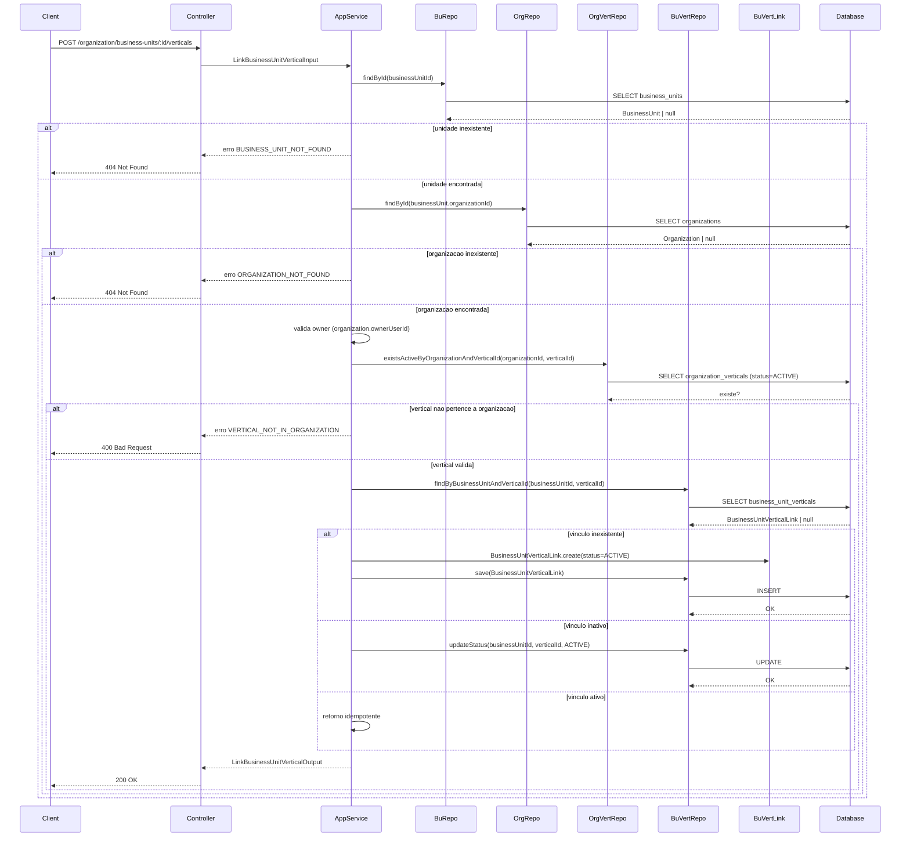
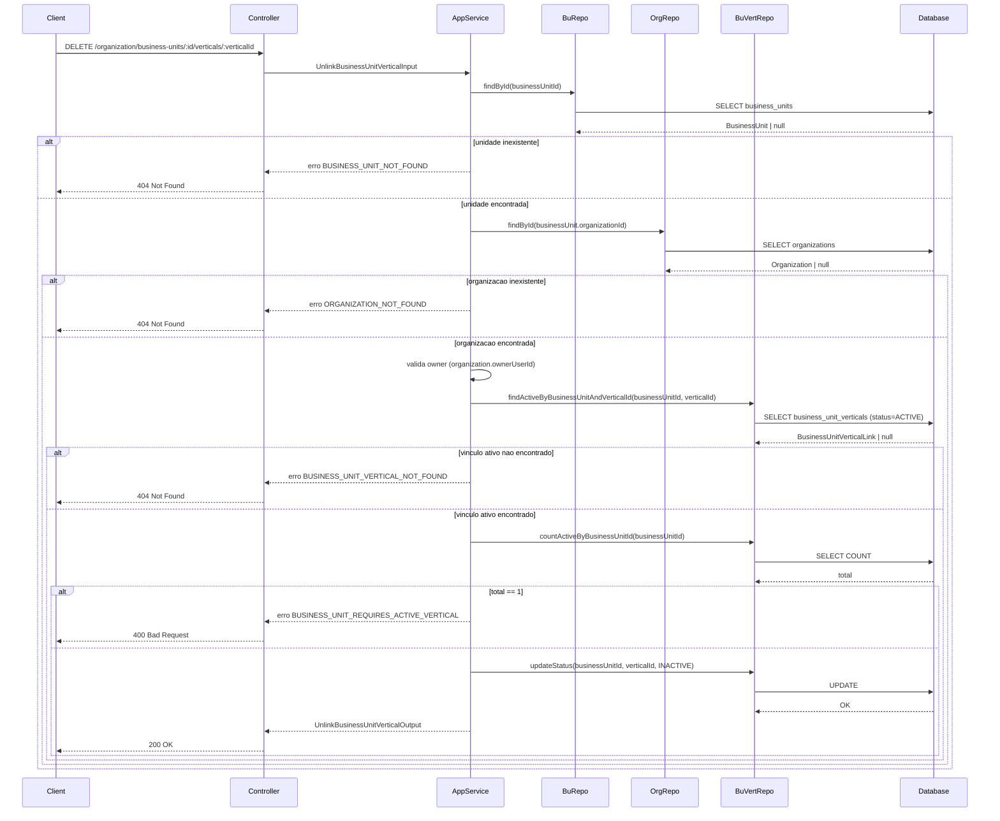
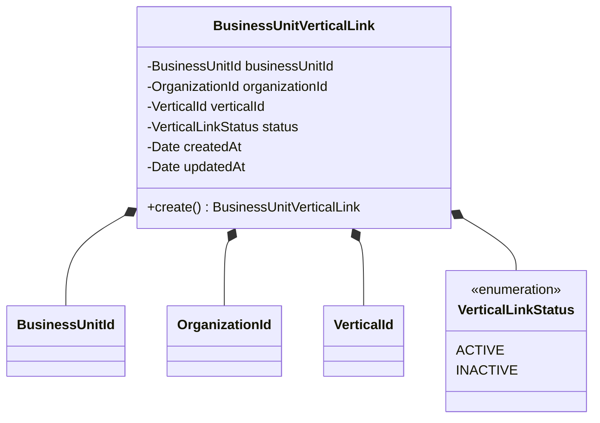
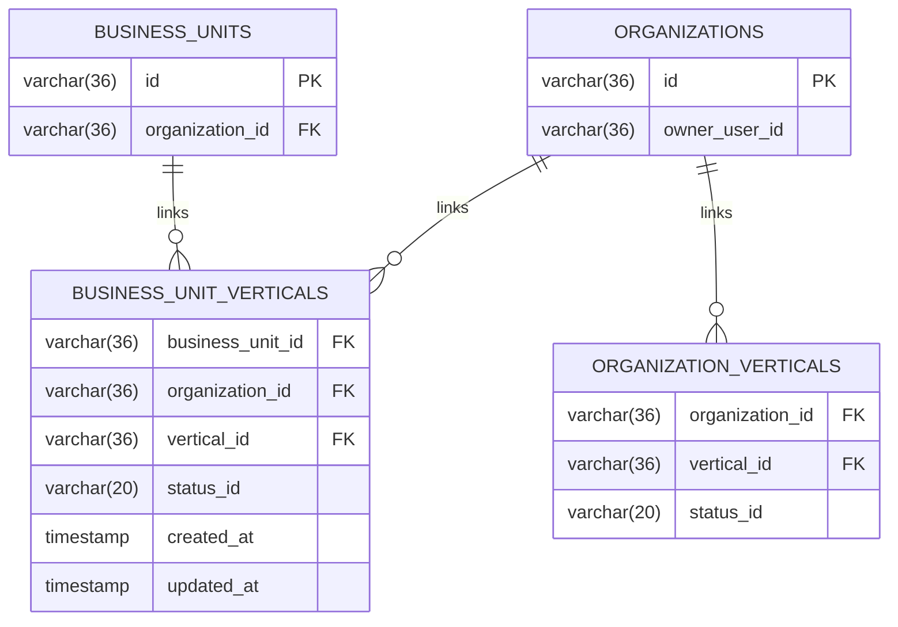
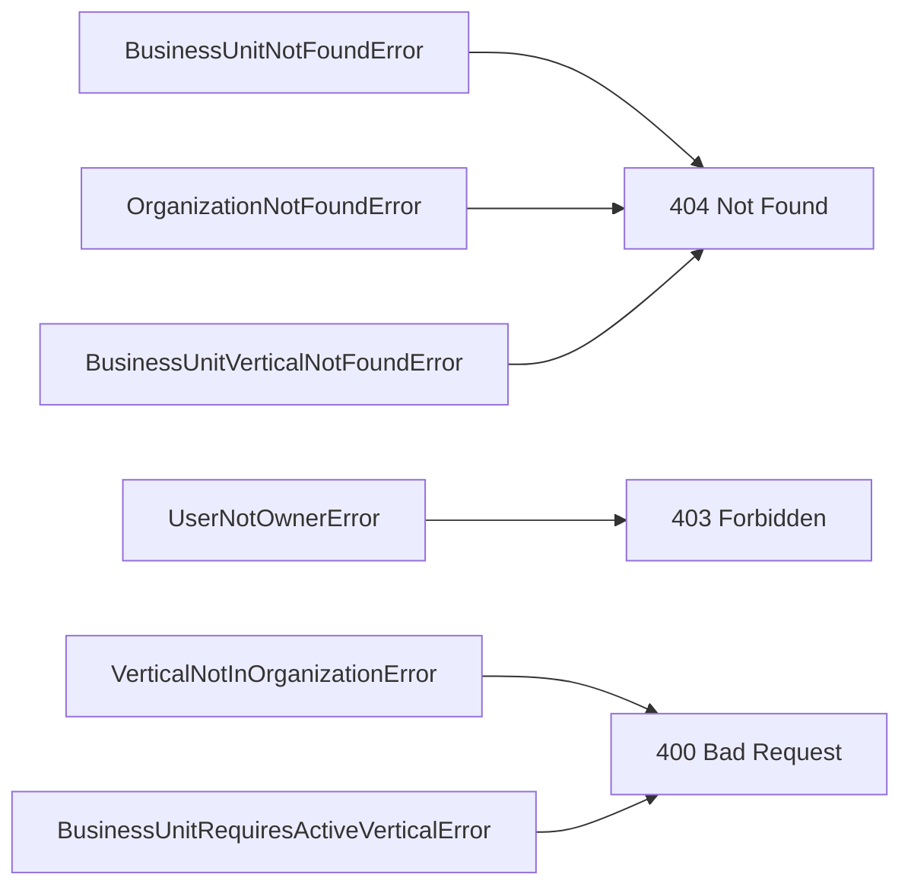

# Design: Manage Business Unit Verticals

**Created**: 2026-01-17  
**Spec**: [./spec.md](./spec.md)  
**Project**: [../../../project.md](../../../project.md)

---

## Overview

A capability Manage Business Unit Verticals permite vincular e desativar verticais de uma unidade de negocio.
A orquestracao ocorre no Application Service, que valida unidade, organizacao, ownership e verticais ativas da organizacao antes de atualizar o vinculo.
A complexidade e moderada por regras de reativacao e pela exigencia de manter ao menos uma vertical ativa por unidade.

---

## Component Map

### Domain Layer

| Tipo | Nome | Responsabilidade |
|------|------|------------------|
| Entity | `BusinessUnit` | Unidade de negocio e organizacao vinculada |
| Entity | `Organization` | Organizacao e owner atual |
| Entity | `BusinessUnitVerticalLink` | Vinculo unidade-vertical com status |
| Entity | `OrganizationVerticalLink` | Vinculo organizacao-vertical para validacao |
| Value Object | `BusinessUnitId` | Identificador unico da unidade |
| Value Object | `OrganizationId` | Identificador unico da organizacao |
| Value Object | `VerticalId` | Identificador da vertical |
| Value Object | `UserId` | Identificador do usuario solicitante |
| Value Object | `VerticalLinkStatus` | Estado do vinculo (ACTIVE, INACTIVE) |
| Repository Interface | `BusinessUnitRepository` | Consulta de unidade de negocio |
| Repository Interface | `OrganizationRepository` | Consulta de organizacao |
| Repository Interface | `BusinessUnitVerticalRepository` | Persistencia e consulta de vinculos |
| Repository Interface | `OrganizationVerticalRepository` | Consulta de verticais ativas da organizacao |

### Application Layer

| Tipo | Nome | Responsabilidade |
|------|------|------------------|
| App Service | `LinkBusinessUnitVerticalService` | Orquestra o vinculo de vertical |
| App Service | `UnlinkBusinessUnitVerticalService` | Orquestra a desativacao de vertical |
| Input DTO | `LinkBusinessUnitVerticalInput` | Dados de entrada para vinculo |
| Input DTO | `UnlinkBusinessUnitVerticalInput` | Dados de entrada para desvinculo |
| Output DTO | `LinkBusinessUnitVerticalOutput` | Resultado do vinculo |
| Output DTO | `UnlinkBusinessUnitVerticalOutput` | Resultado do desvinculo |

### Infrastructure Layer

| Tipo | Nome | Responsabilidade |
|------|------|------------------|
| Repository Impl | `PrismaBusinessUnitRepository` | Implementa `BusinessUnitRepository` |
| Repository Impl | `PrismaOrganizationRepository` | Implementa `OrganizationRepository` |
| Repository Impl | `PrismaBusinessUnitVerticalRepository` | Implementa `BusinessUnitVerticalRepository` |
| Repository Impl | `PrismaOrganizationVerticalRepository` | Implementa `OrganizationVerticalRepository` |
| Mapper | `BusinessUnitVerticalMapper` | Converte Domain <-> Prisma |

### Presentation Layer

| Tipo | Nome | Responsabilidade |
|------|------|------------------|
| Controller | `BusinessUnitVerticalController` | Endpoints HTTP de vinculo e desvinculo |

---

## Dependency Graph

```mermaid
graph TD
    subgraph Presentation
        CTRL[BusinessUnitVerticalController]
    end

    subgraph Application
        SVC_LINK[LinkBusinessUnitVerticalService]
        SVC_UNLINK[UnlinkBusinessUnitVerticalService]
        DTO_IN_LINK[LinkBusinessUnitVerticalInput]
        DTO_IN_UNLINK[UnlinkBusinessUnitVerticalInput]
        DTO_OUT_LINK[LinkBusinessUnitVerticalOutput]
        DTO_OUT_UNLINK[UnlinkBusinessUnitVerticalOutput]
    end

    subgraph Domain
        BU[BusinessUnit]
        ORG[Organization]
        BU_VERT_LINK[BusinessUnitVerticalLink]
        ORG_VERT_LINK[OrganizationVerticalLink]
        VO_BU[BusinessUnitId]
        VO_ORG[OrganizationId]
        VO_VERT[VerticalId]
        VO_USER[UserId]
        VO_STATUS[VerticalLinkStatus]
        BU_REPO[BusinessUnitRepository]
        ORG_REPO[OrganizationRepository]
        BU_VERT_REPO[BusinessUnitVerticalRepository]
        ORG_VERT_REPO[OrganizationVerticalRepository]
    end

    subgraph Infrastructure
        BU_REPO_IMPL[PrismaBusinessUnitRepository]
        ORG_REPO_IMPL[PrismaOrganizationRepository]
        BU_VERT_REPO_IMPL[PrismaBusinessUnitVerticalRepository]
        ORG_VERT_REPO_IMPL[PrismaOrganizationVerticalRepository]
        BU_VERT_MAPPER[BusinessUnitVerticalMapper]
        PRISMA[Prisma Client]
    end

    CTRL --> SVC_LINK
    CTRL --> SVC_UNLINK
    CTRL --> DTO_IN_LINK
    CTRL --> DTO_IN_UNLINK
    SVC_LINK --> DTO_OUT_LINK
    SVC_UNLINK --> DTO_OUT_UNLINK
    SVC_LINK --> BU_REPO
    SVC_LINK --> ORG_REPO
    SVC_LINK --> BU_VERT_REPO
    SVC_LINK --> ORG_VERT_REPO
    SVC_UNLINK --> BU_REPO
    SVC_UNLINK --> ORG_REPO
    SVC_UNLINK --> BU_VERT_REPO
    SVC_LINK --> BU
    SVC_LINK --> ORG
    SVC_UNLINK --> BU
    SVC_UNLINK --> ORG
    BU_VERT_LINK --> VO_BU
    BU_VERT_LINK --> VO_ORG
    BU_VERT_LINK --> VO_VERT
    BU_VERT_LINK --> VO_STATUS
    ORG_VERT_LINK --> VO_ORG
    ORG_VERT_LINK --> VO_VERT
    ORG_VERT_LINK --> VO_STATUS
    BU_REPO_IMPL -.->|implements| BU_REPO
    ORG_REPO_IMPL -.->|implements| ORG_REPO
    BU_VERT_REPO_IMPL -.->|implements| BU_VERT_REPO
    ORG_VERT_REPO_IMPL -.->|implements| ORG_VERT_REPO
    BU_VERT_REPO_IMPL --> BU_VERT_MAPPER
    BU_REPO_IMPL --> PRISMA
    ORG_REPO_IMPL --> PRISMA
    BU_VERT_REPO_IMPL --> PRISMA
    ORG_VERT_REPO_IMPL --> PRISMA
    BU_VERT_MAPPER --> BU_VERT_LINK
```

---

## Data Flow

### Fluxo: Vincular vertical a unidade de negocio

### Fluxo: Desvincular vertical da unidade de negocio

**Transformacoes de dados:**

| Etapa | De | Para |
|-------|----|----- |
| Controller -> AppService | Params + actorUserId | Link/Unlink BusinessUnitVerticalInput |
| AppService -> Domain | DTO | BusinessUnitVerticalLink |
| Domain -> Infra | Entity | Prisma Models |

---

## Entity Structure

### BusinessUnitVerticalLink

**Propriedades:**

| Propriedade | Tipo | Mutavel? | Regras |
|-------------|------|----------|--------|
| `businessUnitId` | BusinessUnitId | Nao | Obrigatorio |
| `organizationId` | OrganizationId | Nao | Obrigatorio |
| `verticalId` | VerticalId | Nao | Obrigatorio |
| `status` | VerticalLinkStatus | Sim | Default ACTIVE |
| `createdAt` | Date | Nao | Obrigatorio |
| `updatedAt` | Date | Sim | Opcional |

---

## Repository Operations

| Operacao | Descricao | Usada por |
|----------|-----------|-----------|
| `BusinessUnitRepository.findById(id)` | Busca unidade por id | Link/UnlinkBusinessUnitVerticalService |
| `OrganizationRepository.findById(id)` | Busca organizacao por id | Link/UnlinkBusinessUnitVerticalService |
| `OrganizationVerticalRepository.existsActiveByOrganizationAndVerticalId(orgId, verticalId)` | Valida vertical ativa da organizacao | LinkBusinessUnitVerticalService |
| `BusinessUnitVerticalRepository.findByBusinessUnitAndVerticalId(buId, verticalId)` | Busca vinculo existente | LinkBusinessUnitVerticalService |
| `BusinessUnitVerticalRepository.findActiveByBusinessUnitAndVerticalId(buId, verticalId)` | Busca vinculo ativo | UnlinkBusinessUnitVerticalService |
| `BusinessUnitVerticalRepository.save(link)` | Persiste novo vinculo | LinkBusinessUnitVerticalService |
| `BusinessUnitVerticalRepository.updateStatus(buId, verticalId, status)` | Atualiza status do vinculo | Link/UnlinkBusinessUnitVerticalService |
| `BusinessUnitVerticalRepository.countActiveByBusinessUnitId(buId)` | Conta vinculos ativos | UnlinkBusinessUnitVerticalService |

---

## Database Model

### Tabela: `business_unit_verticals`

| Coluna | Tipo | Constraints |
|--------|------|-------------|
| `business_unit_id` | VARCHAR(36) | FK(business_units.id), NOT NULL |
| `organization_id` | VARCHAR(36) | FK(organizations.id), NOT NULL |
| `vertical_id` | VARCHAR(36) | FK(verticals.id), NOT NULL |
| `status_id` | VARCHAR(20) | NOT NULL |
| `created_at` | TIMESTAMP | NOT NULL, DEFAULT now() |
| `updated_at` | TIMESTAMP | NULL |

---

## API Endpoints

| Metodo | Path | Operacao | Sucesso | Erros |
|--------|------|----------|---------|-------|
| POST | `/organization/business-units/:businessUnitId/verticals` | Vincular vertical | 200 | 400, 403, 404 |
| DELETE | `/organization/business-units/:businessUnitId/verticals/:verticalId` | Desvincular vertical | 200 | 400, 403, 404 |

---

## Error Handling

| Erro de Dominio | Quando Ocorre | HTTP Status | Codigo |
|-----------------|---------------|-------------|--------|
| `BusinessUnitNotFoundError` | businessUnitId inexistente | 404 | `BUSINESS_UNIT_NOT_FOUND` |
| `OrganizationNotFoundError` | organizationId inexistente | 404 | `ORGANIZATION_NOT_FOUND` |
| `UserNotOwnerError` | usuario nao e owner da organizacao | 403 | `USER_NOT_OWNER` |
| `VerticalNotInOrganizationError` | vertical nao pertence a organizacao | 400 | `VERTICAL_NOT_IN_ORGANIZATION` |
| `BusinessUnitVerticalNotFoundError` | vinculo ativo inexistente | 404 | `BUSINESS_UNIT_VERTICAL_NOT_FOUND` |
| `BusinessUnitRequiresActiveVerticalError` | tentativa de remover ultima vertical ativa | 400 | `BUSINESS_UNIT_REQUIRES_ACTIVE_VERTICAL` |

---

## Technical Decisions

### Decisao 1: Vinculo idempotente

**Contexto**: A mesma vertical pode ser vinculada varias vezes por chamadas repetidas.

**Decisao**: Se o vinculo ja estiver ativo, retornar sucesso sem alterar dados; se estiver inativo, reativar.

**Justificativa**: Simplifica integracoes e evita erros desnecessarios.

---

### Decisao 2: Validar vertical pela organizacao

**Contexto**: A unidade so pode operar em verticais ativas da organizacao.

**Decisao**: Verificar `organization_verticals` com status ACTIVE antes de criar ou reativar vinculos da unidade.

**Justificativa**: Garante alinhamento do escopo da unidade com a organizacao.

---

### Decisao 3: Contagem de vinculos ativos antes de desativar

**Contexto**: A unidade deve manter ao menos uma vertical ativa.

**Decisao**: Consultar `countActiveByBusinessUnitId` e rejeitar a desativacao quando o total for 1.

**Justificativa**: Garante a regra de negocio sem excluir historico.

---

## Implementation Notes

- Validar `businessUnitId` via `BusinessUnitId` e comparar `ownerUserId` com `actorUserId`.
- Usar transacao ao atualizar status para evitar races entre contagem e update.
- Manter indice unico em `business_unit_verticals(business_unit_id, vertical_id)`.
- Desvinculos nao alteram o vinculo da unidade com a organizacao.

---
