# Design: List Related Verticals

**Created**: 2026-01-17  
**Spec**: [./spec.md](./spec.md)  
**Project**: [../../../project.md](../../../project.md)

---

## Overview

A capability List Related Verticals lista verticais vinculadas a uma organizacao ou a uma unidade de negocio, incluindo o status do vinculo.
A orquestracao ocorre no Application Service, que valida a existencia do recurso, carrega os vinculos e hidrata os dados das verticais.
A complexidade e baixa, com foco em consultas de leitura e composicao de resultados.

---

## Component Map

### Domain Layer

| Tipo | Nome | Responsabilidade |
|------|------|------------------|
| Entity | `Organization` | Organizacao consultada |
| Entity | `BusinessUnit` | Unidade de negocio consultada |
| Entity | `OrganizationVerticalLink` | Vinculo organizacao-vertical com status |
| Entity | `BusinessUnitVerticalLink` | Vinculo unidade-vertical com status |
| Entity | `Vertical` | Dados basicos da vertical |
| Value Object | `OrganizationId` | Identificador unico da organizacao |
| Value Object | `BusinessUnitId` | Identificador unico da unidade |
| Value Object | `VerticalId` | Identificador da vertical |
| Value Object | `VerticalName` | Nome normalizado |
| Value Object | `VerticalCode` | Codigo UPPERCASE com `_` |
| Value Object | `VerticalDescription` | Descricao normalizada |
| Value Object | `VerticalLinkStatus` | Estado do vinculo (ACTIVE, INACTIVE) |
| Repository Interface | `OrganizationRepository` | Consulta de organizacao |
| Repository Interface | `BusinessUnitRepository` | Consulta de unidade de negocio |
| Repository Interface | `OrganizationVerticalRepository` | Lista vinculos por organizacao |
| Repository Interface | `BusinessUnitVerticalRepository` | Lista vinculos por unidade |
| Repository Interface | `VerticalRepository` | Consulta dados basicos de verticais |

### Application Layer

| Tipo | Nome | Responsabilidade |
|------|------|------------------|
| App Service | `ListOrganizationVerticalsService` | Lista verticais da organizacao |
| App Service | `ListBusinessUnitVerticalsService` | Lista verticais da unidade de negocio |
| Input DTO | `ListOrganizationVerticalsInput` | Dados de entrada para listagem por organizacao |
| Input DTO | `ListBusinessUnitVerticalsInput` | Dados de entrada para listagem por unidade |
| Output DTO | `ListOrganizationVerticalsOutput` | Resultado da listagem por organizacao |
| Output DTO | `ListBusinessUnitVerticalsOutput` | Resultado da listagem por unidade |

### Infrastructure Layer

| Tipo | Nome | Responsabilidade |
|------|------|------------------|
| Repository Impl | `PrismaOrganizationRepository` | Implementa `OrganizationRepository` |
| Repository Impl | `PrismaBusinessUnitRepository` | Implementa `BusinessUnitRepository` |
| Repository Impl | `PrismaOrganizationVerticalRepository` | Implementa `OrganizationVerticalRepository` |
| Repository Impl | `PrismaBusinessUnitVerticalRepository` | Implementa `BusinessUnitVerticalRepository` |
| Repository Impl | `PrismaVerticalRepository` | Implementa `VerticalRepository` |
| Mapper | `OrganizationVerticalMapper` | Converte Domain <-> Prisma |
| Mapper | `BusinessUnitVerticalMapper` | Converte Domain <-> Prisma |
| Mapper | `VerticalMapper` | Converte Domain <-> Prisma |

### Presentation Layer

| Tipo | Nome | Responsabilidade |
|------|------|------------------|
| Controller | `OrganizationVerticalController` | Endpoint HTTP de listagem por organizacao |
| Controller | `BusinessUnitVerticalController` | Endpoint HTTP de listagem por unidade |

---

## Dependency Graph

```mermaid
graph TD
    subgraph Presentation
        ORG_CTRL[OrganizationVerticalController]
        BU_CTRL[BusinessUnitVerticalController]
    end

    subgraph Application
        SVC_ORG[ListOrganizationVerticalsService]
        SVC_BU[ListBusinessUnitVerticalsService]
        DTO_IN_ORG[ListOrganizationVerticalsInput]
        DTO_IN_BU[ListBusinessUnitVerticalsInput]
        DTO_OUT_ORG[ListOrganizationVerticalsOutput]
        DTO_OUT_BU[ListBusinessUnitVerticalsOutput]
    end

    subgraph Domain
        ORG[Organization]
        BU[BusinessUnit]
        ORG_VERT_LINK[OrganizationVerticalLink]
        BU_VERT_LINK[BusinessUnitVerticalLink]
        VERT[Vertical]
        VO_ORG[OrganizationId]
        VO_BU[BusinessUnitId]
        VO_VERT[VerticalId]
        VO_VERT_NAME[VerticalName]
        VO_VERT_CODE[VerticalCode]
        VO_VERT_DESC[VerticalDescription]
        VO_STATUS[VerticalLinkStatus]
        ORG_REPO[OrganizationRepository]
        BU_REPO[BusinessUnitRepository]
        ORG_VERT_REPO[OrganizationVerticalRepository]
        BU_VERT_REPO[BusinessUnitVerticalRepository]
        VERT_REPO[VerticalRepository]
    end

    subgraph Infrastructure
        ORG_REPO_IMPL[PrismaOrganizationRepository]
        BU_REPO_IMPL[PrismaBusinessUnitRepository]
        ORG_VERT_REPO_IMPL[PrismaOrganizationVerticalRepository]
        BU_VERT_REPO_IMPL[PrismaBusinessUnitVerticalRepository]
        VERT_REPO_IMPL[PrismaVerticalRepository]
        ORG_VERT_MAPPER[OrganizationVerticalMapper]
        BU_VERT_MAPPER[BusinessUnitVerticalMapper]
        VERT_MAPPER[VerticalMapper]
        PRISMA[Prisma Client]
    end

    ORG_CTRL --> SVC_ORG
    ORG_CTRL --> DTO_IN_ORG
    BU_CTRL --> SVC_BU
    BU_CTRL --> DTO_IN_BU
    SVC_ORG --> DTO_OUT_ORG
    SVC_BU --> DTO_OUT_BU
    SVC_ORG --> ORG_REPO
    SVC_ORG --> ORG_VERT_REPO
    SVC_ORG --> VERT_REPO
    SVC_BU --> BU_REPO
    SVC_BU --> BU_VERT_REPO
    SVC_BU --> VERT_REPO
    SVC_ORG --> ORG
    SVC_BU --> BU
    ORG_VERT_LINK --> VO_ORG
    ORG_VERT_LINK --> VO_VERT
    ORG_VERT_LINK --> VO_STATUS
    BU_VERT_LINK --> VO_BU
    BU_VERT_LINK --> VO_ORG
    BU_VERT_LINK --> VO_VERT
    BU_VERT_LINK --> VO_STATUS
    VERT --> VO_VERT
    VERT --> VO_VERT_NAME
    VERT --> VO_VERT_CODE
    VERT --> VO_VERT_DESC
    ORG_REPO_IMPL -.->|implements| ORG_REPO
    BU_REPO_IMPL -.->|implements| BU_REPO
    ORG_VERT_REPO_IMPL -.->|implements| ORG_VERT_REPO
    BU_VERT_REPO_IMPL -.->|implements| BU_VERT_REPO
    VERT_REPO_IMPL -.->|implements| VERT_REPO
    ORG_VERT_REPO_IMPL --> ORG_VERT_MAPPER
    BU_VERT_REPO_IMPL --> BU_VERT_MAPPER
    VERT_REPO_IMPL --> VERT_MAPPER
    ORG_REPO_IMPL --> PRISMA
    BU_REPO_IMPL --> PRISMA
    ORG_VERT_REPO_IMPL --> PRISMA
    BU_VERT_REPO_IMPL --> PRISMA
    VERT_REPO_IMPL --> PRISMA
    ORG_VERT_MAPPER --> ORG_VERT_LINK
    BU_VERT_MAPPER --> BU_VERT_LINK
    VERT_MAPPER --> VERT
```

---

## Data Flow

### Fluxo: Listar verticais da organizacao

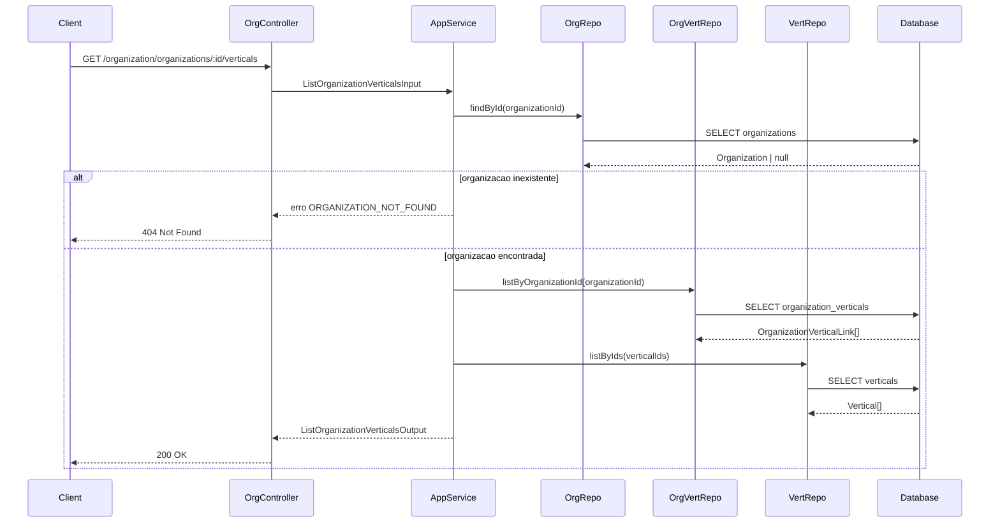

### Fluxo: Listar verticais da unidade de negocio

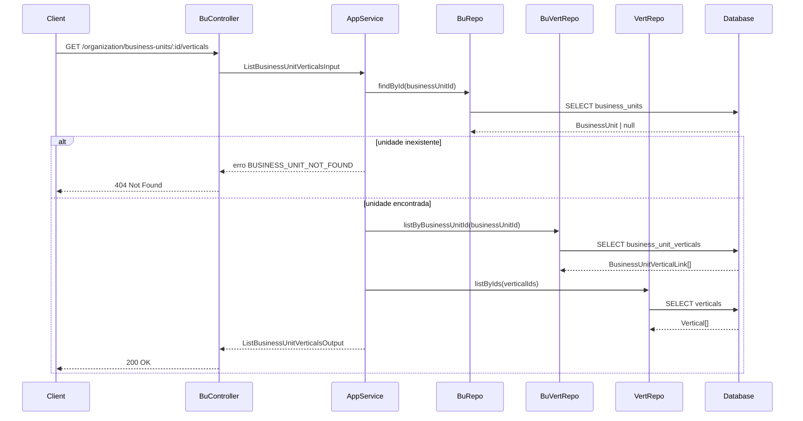

**Transformacoes de dados:**

| Etapa | De | Para |
|-------|----|----- |
| Controller -> AppService | Params | List Organization/BusinessUnit Verticals Input |
| AppService -> Domain | DTO | Vertical + link status |
| Domain -> Presentation | Entities | List Related Verticals Output |

---

## Entity Structure

### Vertical

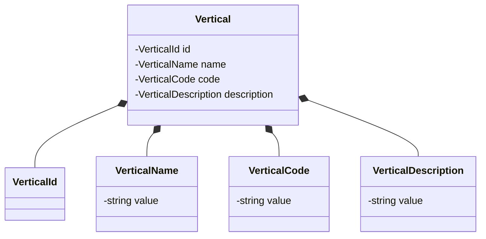

### VerticalSummary

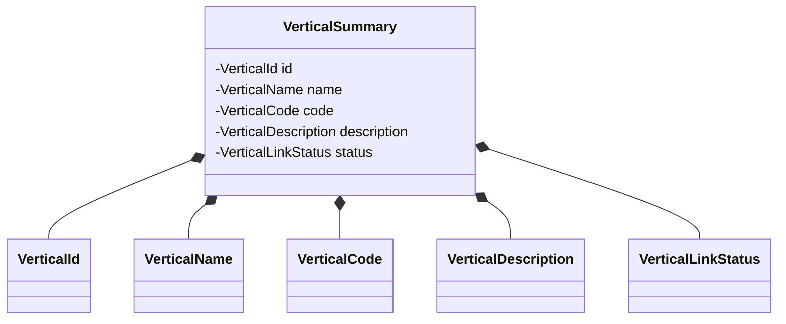

### OrganizationVerticalLink

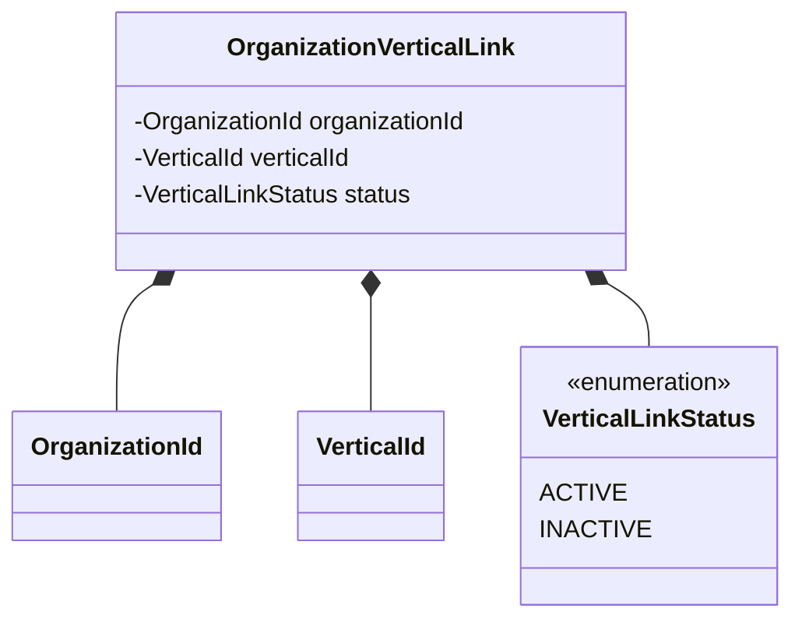

### BusinessUnitVerticalLink

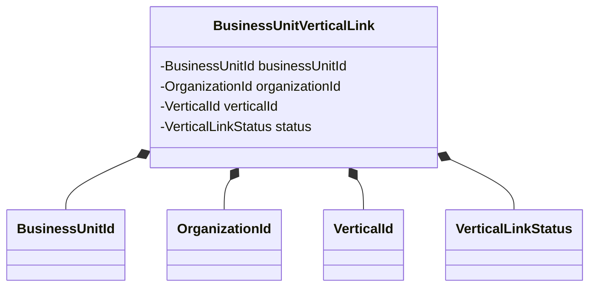

### ListOrganizationVerticalsOutput

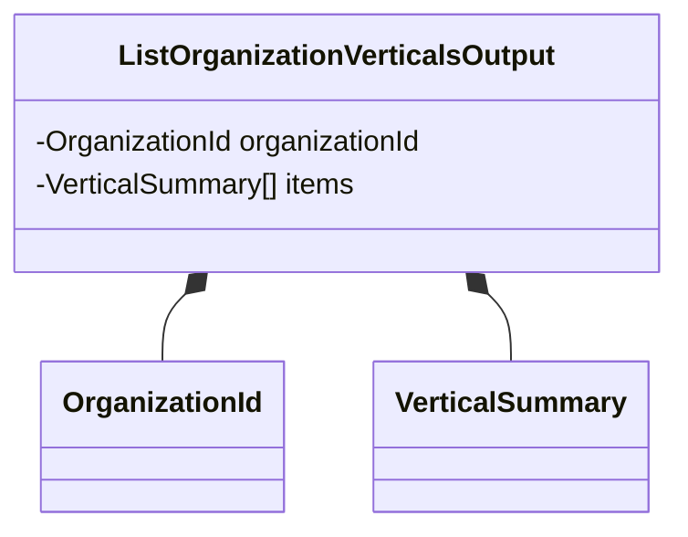

### ListBusinessUnitVerticalsOutput

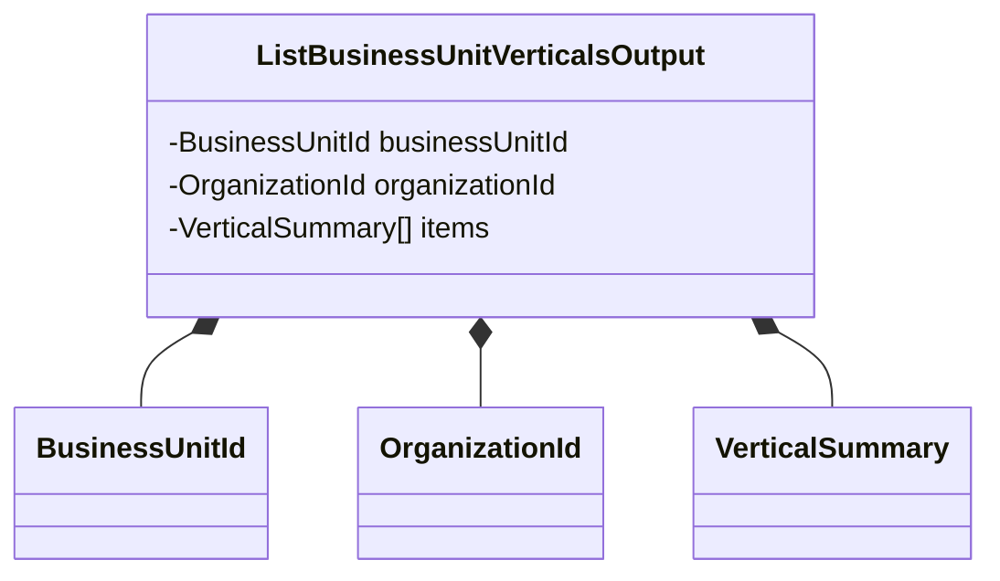

---

## Repository Operations

| Operacao | Descricao | Usada por |
|----------|-----------|-----------|
| `OrganizationRepository.findById(id)` | Busca organizacao por id | ListOrganizationVerticalsService |
| `BusinessUnitRepository.findById(id)` | Busca unidade por id | ListBusinessUnitVerticalsService |
| `OrganizationVerticalRepository.listByOrganizationId(orgId)` | Lista vinculos da organizacao | ListOrganizationVerticalsService |
| `BusinessUnitVerticalRepository.listByBusinessUnitId(buId)` | Lista vinculos da unidade | ListBusinessUnitVerticalsService |
| `VerticalRepository.listByIds(ids)` | Carrega dados das verticais | Ambos os services |

---

## Database Model

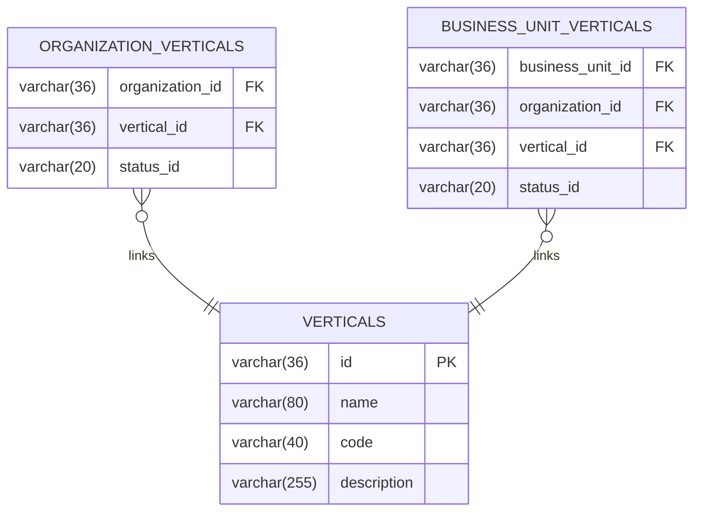

---

## API Endpoints

| Metodo | Path | Operacao | Sucesso | Erros |
|--------|------|----------|---------|-------|
| GET | `/organization/organizations/:organizationId/verticals` | Listar verticais da organizacao | 200 | 404 |
| GET | `/organization/business-units/:businessUnitId/verticals` | Listar verticais da unidade | 200 | 404 |

---

## Error Handling

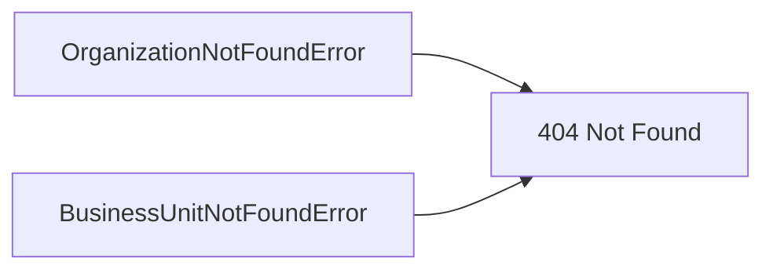

| Erro de Dominio | Quando Ocorre | HTTP Status | Codigo |
|-----------------|---------------|-------------|--------|
| `OrganizationNotFoundError` | organizationId inexistente | 404 | `ORGANIZATION_NOT_FOUND` |
| `BusinessUnitNotFoundError` | businessUnitId inexistente | 404 | `BUSINESS_UNIT_NOT_FOUND` |

---

## Technical Decisions

### Decisao 1: Retornar vinculos ativos e inativos

**Contexto**: A listagem deve trazer visibilidade completa do historico de vinculos.

**Decisao**: Retornar todos os vinculos com `statusId` a partir de `organization_verticals` e `business_unit_verticals`.

**Justificativa**: Fornece transparencia sem exigir chamadas separadas para estados diferentes.

---

## Implementation Notes

- Manter o mapeamento por `verticalId` para combinar dados de `verticals` com o `statusId` do vinculo.
- Retornar lista vazia quando nao houver vinculos.
- Output deve incluir `organizationId` ou `businessUnitId` e `statusId` em cada item.

---
