# organization

## 01-create-user

### design
# Design: Create User

**Created**: 2026-01-08  
**Spec**: [./spec.md](./spec.md)  
**Project**: [../../../project.md](../../../project.md)

---

## Overview

A capability Create User no contexto Organization cria a identidade do usuario e, opcionalmente, o vinculo com uma organizacao existente.
A orquestracao ocorre no Application Service, que valida unicidade e regras de documento/contato, define o status inicial e persiste User e UserOrganizationLink em transacao.
A complexidade e moderada por validacoes cruzadas entre usuarios e organizacoes.

---

## Component Map

### Domain Layer

| Tipo | Nome | Responsabilidade |
|------|------|------------------|
| Entity | `User` | Identidade do usuario no contexto Organization |
| Entity | `UserOrganizationLink` | Vinculo entre usuario e organizacao |
| Value Object | `UserId` | Identificador unico do usuario |
| Value Object | `OrganizationId` | Identificador unico da organizacao |
| Value Object | `DocumentType` | Tipo do documento (CPF, CNPJ) |
| Value Object | `DocumentNumber` | Documento normalizado (apenas digitos) |
| Value Object | `EmailAddress` | Email validado e normalizado |
| Value Object | `PhoneNumber` | Celular validado e normalizado |
| Value Object | `UserStatus` | Estado do usuario (PENDING_ORG_LINK, ORG_LINKED, ACTIVE) |
| Repository Interface | `UserRepository` | Persistencia e consultas de usuario |
| Repository Interface | `UserOrganizationLinkRepository` | Persistencia do vinculo usuario-organizacao |
| Repository Interface | `OrganizationRepository` | Consultas de organizacao para validacao |

### Application Layer

| Tipo | Nome | Responsabilidade |
|------|------|------------------|
| App Service | `CreateUserService` | Orquestra a criacao do usuario |
| Input DTO | `CreateUserInput` | Dados de entrada para criacao |
| Output DTO | `CreateUserOutput` | Dados retornados apos criacao |

### Infrastructure Layer

| Tipo | Nome | Responsabilidade |
|------|------|------------------|
| Repository Impl | `PrismaUserRepository` | Implementa `UserRepository` |
| Repository Impl | `PrismaUserOrganizationLinkRepository` | Implementa `UserOrganizationLinkRepository` |
| Repository Impl | `PrismaOrganizationRepository` | Implementa `OrganizationRepository` |
| Mapper | `UserMapper` | Converte Domain ↔ Prisma |
| Mapper | `UserOrganizationLinkMapper` | Converte Domain ↔ Prisma |

### Presentation Layer

| Tipo | Nome | Responsabilidade |
|------|------|------------------|
| Controller | `UserController` | Exposicao HTTP do caso de uso |

---

## Dependency Graph

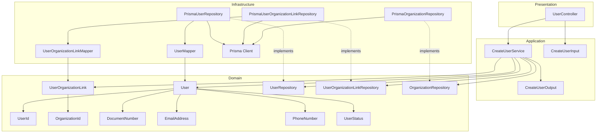

---

## Data Flow

### Fluxo: Criar Usuario

```mermaid
sequenceDiagram
    participant Client
    participant Controller
    participant AppService
    participant UserRepo
    participant OrgRepo
    participant LinkRepo
    participant User
    participant Link
    participant Database

    Client->>Controller: POST /organization/users
    Controller->>AppService: CreateUserInput

    AppService->>AppService: normaliza e valida documento, email, celular

    AppService->>UserRepo: existsByDocumentNumber(document)
    UserRepo->>Database: SELECT
    Database-->>UserRepo: resultado

    AppService->>OrgRepo: existsByDocumentNumber(document)
    OrgRepo->>Database: SELECT
    Database-->>OrgRepo: resultado

    AppService->>UserRepo: existsByEmail(email)
    UserRepo->>Database: SELECT
    Database-->>UserRepo: resultado

    AppService->>UserRepo: existsByPhoneNumber(phone)
    UserRepo->>Database: SELECT
    Database-->>UserRepo: resultado

    alt organizationId informado
        AppService->>OrgRepo: existsById(organizationId)
        OrgRepo->>Database: SELECT
        Database-->>OrgRepo: resultado
        AppService->>Link: UserOrganizationLink.create(...)
    end

    AppService->>User: User.create(status definido pela aplicacao)

    Note over AppService,Database: Persistencia em transacao
    AppService->>UserRepo: save(User)
    UserRepo->>Database: INSERT
    Database-->>UserRepo: OK

    opt link criado
        AppService->>LinkRepo: save(Link)
        LinkRepo->>Database: INSERT
        Database-->>LinkRepo: OK
    end

    AppService-->>Controller: CreateUserOutput
    Controller-->>Client: 201 Created
```

**Transformacoes de dados:**

| Etapa | De | Para |
|-------|----|------|
| Controller → AppService | JSON body | CreateUserInput |
| AppService → Domain | DTO | User, UserOrganizationLink |
| Domain → Infra | Entities | Prisma Models |

---

## Entity Structure

### User

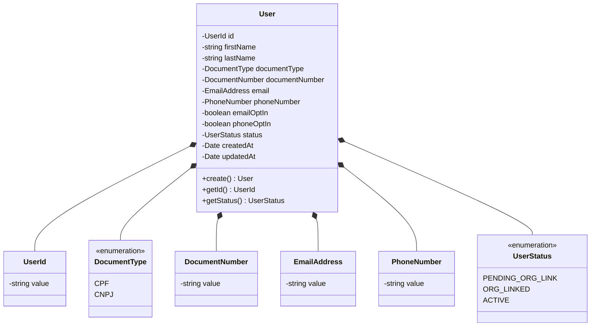

**Propriedades:**

| Propriedade | Tipo | Mutavel? | Regras |
|-------------|------|----------|--------|
| `id` | UserId | Nao | Gerado internamente |
| `firstName` | string | Nao | Obrigatorio |
| `lastName` | string | Nao | Obrigatorio |
| `documentType` | DocumentType | Nao | CPF ou CNPJ |
| `documentNumber` | DocumentNumber | Nao | Apenas digitos, 11/14 chars, unico |
| `email` | EmailAddress | Nao | Formato valido, unico |
| `phoneNumber` | PhoneNumber | Nao | Apenas digitos, max 15, unico |
| `emailOptIn` | boolean | Nao | Obrigatorio |
| `phoneOptIn` | boolean | Nao | Obrigatorio |
| `status` | UserStatus | Nao | Definido pela aplicacao |
| `createdAt` | Date | Nao | Automatico |
| `updatedAt` | Date | Sim | Atualizado em mudancas futuras |

**Comportamentos:**

| Metodo | Regras |
|--------|--------|
| `create` | Valida VO e aplica status inicial conforme organizationId |

### UserOrganizationLink

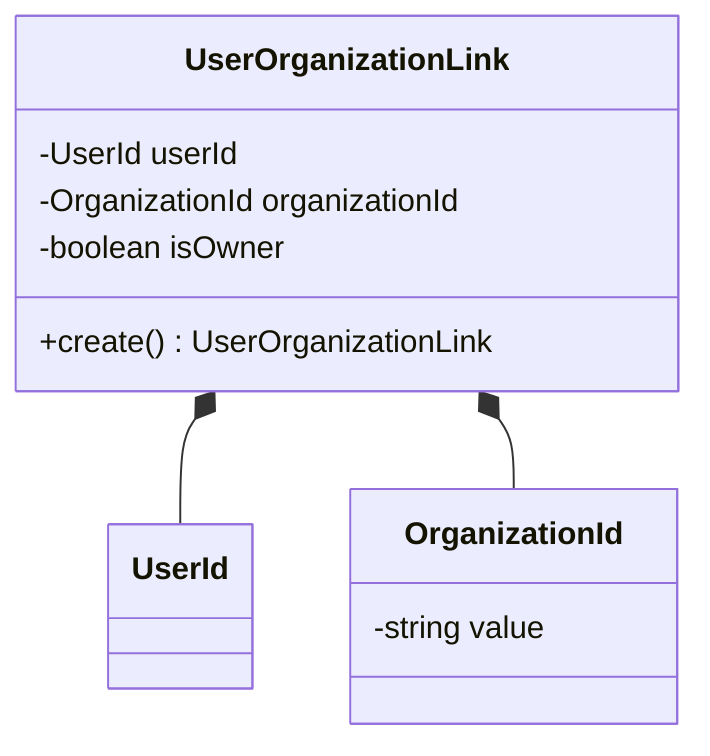

**Propriedades:**

| Propriedade | Tipo | Mutavel? | Regras |
|-------------|------|----------|--------|
| `userId` | UserId | Nao | Obrigatorio |
| `organizationId` | OrganizationId | Nao | Obrigatorio |
| `isOwner` | boolean | Nao | Default `false` |

**Comportamentos:**

| Metodo | Regras |
|--------|--------|
| `create` | Impoe isOwner = false no vinculo inicial |

---

## Repository Operations

| Operacao | Descricao | Usada por |
|----------|-----------|-----------|
| `UserRepository.save(user)` | Persiste usuario | CreateUserService |
| `UserRepository.existsByDocumentNumber(document)` | Verifica duplicidade de documento em usuarios | CreateUserService |
| `UserRepository.existsByEmail(email)` | Verifica duplicidade de email | CreateUserService |
| `UserRepository.existsByPhoneNumber(phone)` | Verifica duplicidade de celular | CreateUserService |
| `OrganizationRepository.existsById(id)` | Verifica existencia de organizacao | CreateUserService |
| `OrganizationRepository.existsByDocumentNumber(document)` | Verifica duplicidade de documento em organizacoes | CreateUserService |
| `UserOrganizationLinkRepository.save(link)` | Persiste vinculo usuario-organizacao | CreateUserService |

---

## Database Model

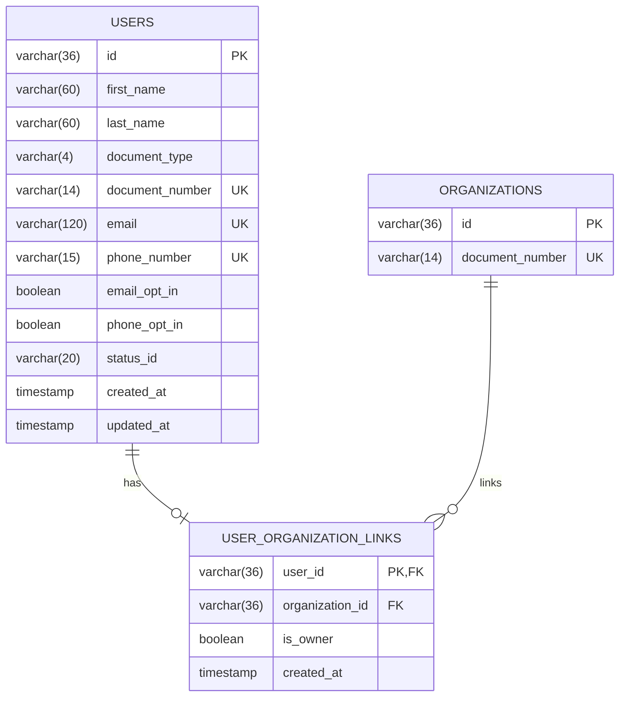

### Tabela: `users`

| Coluna | Tipo | Constraints |
|--------|------|-------------|
| `id` | VARCHAR(36) | PK |
| `first_name` | VARCHAR(60) | NOT NULL |
| `last_name` | VARCHAR(60) | NOT NULL |
| `document_type` | VARCHAR(4) | NOT NULL |
| `document_number` | VARCHAR(14) | NOT NULL, UNIQUE |
| `email` | VARCHAR(120) | NOT NULL, UNIQUE |
| `phone_number` | VARCHAR(15) | NOT NULL, UNIQUE |
| `email_opt_in` | BOOLEAN | NOT NULL |
| `phone_opt_in` | BOOLEAN | NOT NULL |
| `status_id` | VARCHAR(20) | NOT NULL |
| `created_at` | TIMESTAMP | NOT NULL, DEFAULT now() |
| `updated_at` | TIMESTAMP | NULL |

### Tabela: `user_organization_links`

| Coluna | Tipo | Constraints |
|--------|------|-------------|
| `user_id` | VARCHAR(36) | PK, FK(users.id), UNIQUE |
| `organization_id` | VARCHAR(36) | FK(organizations.id) |
| `is_owner` | BOOLEAN | NOT NULL, DEFAULT false |
| `created_at` | TIMESTAMP | NOT NULL, DEFAULT now() |

### Tabela: `organizations`

| Coluna | Tipo | Constraints |
|--------|------|-------------|
| `id` | VARCHAR(36) | PK |
| `document_number` | VARCHAR(14) | NOT NULL, UNIQUE |

---

## API Endpoints

| Metodo | Path | Operacao | Sucesso | Erros |
|--------|------|----------|---------|-------|
| POST | `/organization/users` | Criar usuario | 201 | 400, 404, 409 |

---

## Error Handling

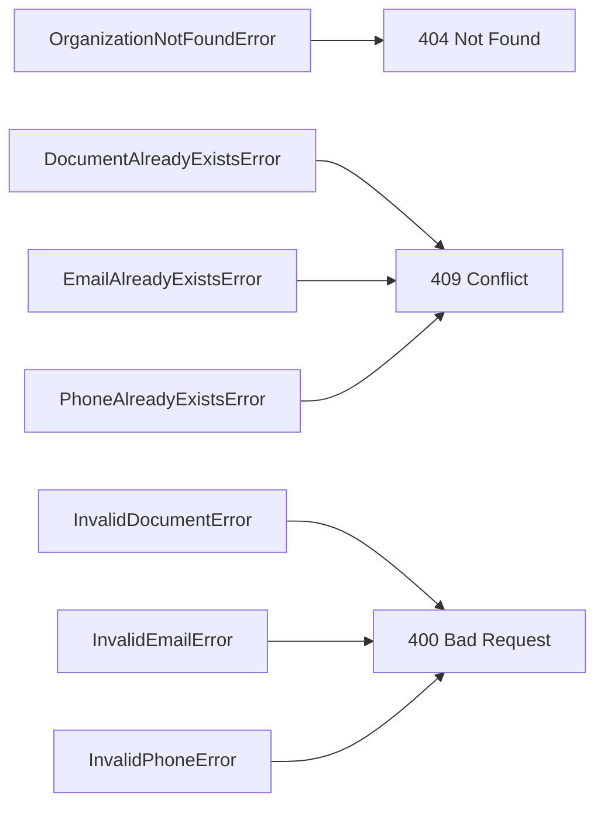

| Erro de Dominio | Quando Ocorre | HTTP Status | Codigo |
|-----------------|---------------|-------------|--------|
| `OrganizationNotFoundError` | organizationId inexistente | 404 | `ORGANIZATION_NOT_FOUND` |
| `DocumentAlreadyExistsError` | Documento ja cadastrado | 409 | `DOCUMENT_ALREADY_EXISTS` |
| `EmailAlreadyExistsError` | Email ja cadastrado | 409 | `EMAIL_ALREADY_EXISTS` |
| `PhoneAlreadyExistsError` | Celular ja cadastrado | 409 | `PHONE_ALREADY_EXISTS` |
| `InvalidDocumentError` | Documento invalido | 400 | `INVALID_DOCUMENT` |
| `InvalidEmailError` | Email invalido | 400 | `INVALID_EMAIL` |
| `InvalidPhoneError` | Celular invalido | 400 | `INVALID_PHONE` |

---

## Technical Decisions

### Decisao 1: Unicidade de documento cruzada entre usuarios e organizacoes

**Contexto**: O documento do usuario deve ser unico no contexto Organization, incluindo usuarios e organizacoes.

**Decisao**: A validacao de duplicidade consulta `UserRepository` e `OrganizationRepository` antes da criacao.

**Justificativa**: A regra cruza tabelas diferentes, portanto precisa de validacao de aplicacao e tratamento de conflito.

---

### Decisao 2: Persistir usuario e vinculo em uma unica transacao

**Contexto**: O status inicial depende do vinculo com a organizacao e o vinculo nao pode ficar inconsistente.

**Decisao**: O `CreateUserService` persiste `User` e `UserOrganizationLink` dentro da mesma transacao do Prisma.

**Justificativa**: Garante atomicidade entre status e vinculo, evitando usuario criado com status incorreto.

---

### Decisao 3: Normalizacao de documento, email e celular via Value Objects

**Contexto**: Validacoes de formato e unicidade devem ser consistentes em todo o sistema.

**Decisao**: `DocumentNumber`, `EmailAddress` e `PhoneNumber` normalizam entrada (digitos e lower-case) antes das consultas.

**Justificativa**: Evita duplicidade logica e simplifica comparacoes em repositorios.

---

## Implementation Notes

- Normalizar `documentNumber` e `phoneNumber` para apenas digitos antes das validacoes e consultas.
- `organizationId` opcional define o status inicial e a criacao do `UserOrganizationLink`.
- Nao aceitar `statusId` nem `isOwner` no input do controller.
- Garantir indices unicos em `users.document_number`, `users.email` e `users.phone_number`.
- Usar transacao unica para salvar `users` e `user_organization_links`.

---

### design-validation
## Avaliacao do Design: Create User

| Criterio | Nota | Observacao |
|----------|------|------------|
| Aderencia a Arquitetura | 5/5 | DDD em 4 camadas respeitado, domain sem dependencias externas. |
| Completude de Componentes | 5/5 | Entities, VOs, repos, service, DTOs e controller mapeados. |
| Consistencia com Spec | 5/5 | Cobre status inicial, vinculo opcional e unicidade cruzada. |
| Modelagem de Dados | 5/5 | Tabelas e constraints refletem regras (unicidade e vinculo 1:1). |
| Fluxos de Dados | 5/5 | Fluxo detalha validacoes, transacao e vinculo opcional. |
| API Design | 5/5 | Endpoint e codigos de erro alinhados. |
| Diagramas | 5/5 | Mermaid consistente e coerente com o fluxo. |
| Decisoes Tecnicas | 5/5 | Decisoes claras (unicidade, transacao, normalizacao). |
| **TOTAL** | 40/40 | |

## Veredicto

- [x] APROVADO - Pode avancar para plan
- [ ] APROVADO COM RESSALVAS - Ajustes menores
- [ ] REPROVADO - Problemas de arquitetura

## Violacoes de Arquitetura

1. Nenhuma identificada.

## Problemas Encontrados

1. Nenhum.

## Pontos Fortes

1. Validacoes e normalizacoes bem posicionadas no Application Service.
2. Persistencia transacional reduz risco de inconsistencia.

### spec
# Capability: Create User

**Created**: 2026-01-08  
**Project**: `specs/project.md`

---

<!--
  ╔═══════════════════════════════════════════════════════════════════════════╗
  ║  SPEC DE NEGÓCIO - Define O QUÊ a capability faz                          ║
  ║                                                                           ║
  ║  Este documento é agnóstico de tecnologia. Decisões técnicas              ║
  ║  ficam no design.md da capability.                                        ║
  ╚═══════════════════════════════════════════════════════════════════════════╝
-->

## User Stories

### User Story 1 - Create user for seller onboarding (P1)

Como **pessoa interessada em vender pela plataforma**,  
quero **criar meu usuário com dados pessoais e de contato**,  
para **iniciar o onboarding e, quando aplicável, me vincular a uma organização**.

**Por que P1**: Sem a criação do usuário não é possível iniciar o fluxo de onboarding.

#### Acceptance Criteria

```gherkin
Scenario: Criar usuário sem organização vinculada
  Given que não existe usuário com o mesmo documento, email ou celular
  When o usuário é criado sem informar organizationId
  Then o usuário deve ser criado com status PENDING_ORG_LINK
  And o usuário não deve possuir vínculo com organização

Scenario: Criar usuário já vinculado a uma organização existente
  Given que a organização informada existe
  And que não existe usuário com o mesmo documento, email ou celular
  When o usuário é criado informando organizationId
  Then o usuário deve ser criado com status ORG_LINKED
  And o usuário deve ficar vinculado à organização sem papel definido

Scenario: Rejeitar criação com organizationId inexistente
  Given que a organização informada não existe
  When o usuário é criado informando organizationId
  Then a criação deve ser rejeitada
  And o sistema deve informar que a organização especificada não existe

Scenario: Rejeitar criação com documento já cadastrado
  Given que já existe um usuário ou organização com o mesmo documento
  When o usuário é criado
  Then a criação deve ser rejeitada
  And o sistema deve informar que o documento já está cadastrado

Scenario: Rejeitar criação com email já cadastrado
  Given que já existe um usuário com o mesmo email
  When o usuário é criado
  Then a criação deve ser rejeitada
  And o sistema deve informar que o email já está cadastrado

Scenario: Rejeitar criação com celular já cadastrado
  Given que já existe um usuário com o mesmo celular
  When o usuário é criado
  Then a criação deve ser rejeitada
  And o sistema deve informar que o celular já está cadastrado

Scenario: Rejeitar criação com documento inválido
  Given que o tipo de documento é CPF ou CNPJ
  When o documento informado não possui a quantidade de dígitos exigida
  Then a criação deve ser rejeitada
  And o sistema deve informar que o documento é inválido
```

---

## Functional Requirements

- **FR-001**: O sistema **DEVE** permitir criar um usuário com: nome, sobrenome, tipo de documento, documento, email, celular e preferências de comunicação.
- **FR-002**: O `organizationId` **PODE** ser informado durante a criação do usuário.
- **FR-003**: Se `organizationId` for informado e a organização existir, o sistema **DEVE** criar o vínculo usuário-organização sem papel definido.
- **FR-004**: Se `organizationId` for informado e a organização não existir, o sistema **DEVE** rejeitar a criação e informar que a organização especificada não existe.
- **FR-005**: Se `organizationId` não for informado, o usuário **DEVE** iniciar com status `PENDING_ORG_LINK`.
- **FR-006**: Se `organizationId` for informado, o usuário **DEVE** iniciar com status `ORG_LINKED`.
- **FR-007**: Um usuário **DEVE** estar vinculado a apenas uma organização.
- **FR-008**: O documento do usuário **DEVE** conter apenas dígitos.
- **FR-009**: O tipo de documento do usuário **DEVE** ser um valor válido entre `CPF` e `CNPJ`.
- **FR-010**: O documento do usuário **DEVE** ter 11 dígitos para `CPF` e 14 dígitos para `CNPJ`.
- **FR-011**: O documento do usuário **DEVE** ser único no contexto de Organization, não podendo existir em usuários ou organizações.
- **FR-012**: O email do usuário **DEVE** ser único entre usuários.
- **FR-013**: O email do usuário **DEVE** possuir formato válido.
- **FR-014**: O celular do usuário **DEVE** ser único entre usuários.
- **FR-015**: O celular do usuário **DEVE** conter apenas dígitos e ter no máximo 15 caracteres.
- **FR-016**: As preferências de comunicação por email e celular **DEVEM** ser informadas no momento da criação.
- **FR-017**: O status do usuário **NÃO DEVE** ser informado pelo usuário e **DEVE** ser definido pela aplicação.
- **FR-018**: O sistema **NÃO DEVE** atribuir papel/role ao usuário no momento do vínculo com a organização.

---

## Entity

### User

| Campo | Descrição | Regras |
| --- | --- | --- |
| `id` | Identificador único do usuário | Obrigatório, único |
| `firstName` | Nome do usuário | Obrigatório |
| `lastName` | Sobrenome do usuário | Obrigatório |
| `documentType` | Tipo do documento | Obrigatório, valores: `CPF`, `CNPJ` |
| `documentNumber` | Documento do usuário | Obrigatório, somente dígitos, 11 (CPF) ou 14 (CNPJ), único entre usuários e organizações |
| `email` | Email do usuário | Obrigatório, formato válido, único |
| `phoneNumber` | Celular do usuário | Obrigatório, somente dígitos, máximo 15 caracteres, único |
| `emailOptIn` | Preferência de comunicação por email | Obrigatório |
| `phoneOptIn` | Preferência de comunicação por celular | Obrigatório |
| `statusId` | Identificador do status | Obrigatório |
| `createdAt` | Data de criação | Obrigatório |
| `updatedAt` | Data da última atualização | Opcional |

**Status permitidos**:

- `PENDING_ORG_LINK`: Usuário criado sem vínculo com organização
- `ORG_LINKED`: Usuário vinculado a organização sem papel definido
- `ACTIVE`: Usuário apto a operar como owner de uma organização


### UserOrganizationLink

| Campo | Descrição | Regras |
| --- | --- | --- |
| `userId` | Usuário vinculado | Obrigatório |
| `organizationId` | Organização vinculada | Obrigatório |
| `isOwner` | Indica se o usuário é owner | Obrigatório, default `false` |

**Relacionamentos**: Um usuário pode estar vinculado a apenas uma organização.

---

## Success Criteria

- **SC-001**: 100% dos usuários criados possuem status inicial coerente com a presença de `organizationId`.
- **SC-002**: 100% das tentativas de criação com documento, email ou celular duplicados são rejeitadas.
- **SC-003**: 100% dos usuários criados possuem preferências de comunicação registradas.

---

## Glossary

| Termo | Definição |
| --- | --- |
| User | Pessoa física que inicia o onboarding para vender |
| Organization | Negócio registrado pelo usuário |
| Business Unit | Unidade de negócio/ponto de venda da organização |
| Organization Link | Vínculo entre usuário e organização |

---

## Summary

A capability **Create User** cria a identidade do usuário com dados pessoais e de contato, permitindo vínculo opcional a uma organização existente.

Ela inicia o onboarding do seller e define o status do usuário conforme a presença de vínculo organizacional.

---

### spec-validation
## Avaliação da Spec: Create User

| Critério | Nota | Observação |
|----------|------|------------|
| Estrutura e Completude | 5/5 | Todas as seções do template estão presentes e bem preenchidas. |
| User Stories | 5/5 | Cenários cobrem fluxo feliz, erros de duplicidade e validação de documento. |
| Edge Cases | 5/5 | Inclui regras de formato e limites para documentos e telefone. |
| Functional Requirements | 5/5 | Regras claras, numeradas e rastreáveis, incluindo status definido pela aplicação. |
| Entity | 5/5 | Entidades detalhadas com regras de formato e status. |
| Success Criteria | 5/5 | Métricas objetivas e verificáveis. |
| Clareza | 5/5 | Linguagem consistente e sem ambiguidades. |
| Implementabilidade | 5/5 | Pronta para implementação com validações explícitas. |
| **TOTAL** | 40/40 | |

## Veredicto

- [x] ✅ APROVADA - Pode avançar para design
- [ ] 🟡 APROVADA COM RESSALVAS - Ajustes menores necessários
- [ ] 🔴 REPROVADA - Problemas bloqueantes

## Problemas Encontrados

Nenhum.

## Pontos Fortes

1. Status definidos pela aplicação e regras de unicidade claras.
2. Validações de formato para documento e telefone bem especificadas.
3. Cenários cobrindo fluxo feliz e principais erros.

## Template de Referência
Arquivo: `specs/templates/spec-template.md`

PERSISTIR O RESULTADO NO MESMO DIRETÓRIO DA SPEC AVALIADA COM NOME spec-validation.md

## Spec a Validar
Arquivo: `specs/modules/organization/01-create-user/spec.md`

## 02-create-organization

### design
# Design: Create Organization

**Created**: 2026-01-08  
**Spec**: [./spec.md](./spec.md)  
**Project**: [../../../project.md](../../../project.md)

---

## Overview

A capability Create Organization no contexto Organization cria a organizacao com dados legais e vincula um usuario owner existente.
A orquestracao ocorre no Application Service, que valida documento, verticais e regras de unicidade cruzada, define status inicial e ativa o owner.
A persistencia de organizacao, atualizacao do usuario e criacao do vinculo acontece em transacao unica.

---

## Component Map

### Domain Layer

| Tipo | Nome | Responsabilidade |
|------|------|------------------|
| Entity | `Organization` | Representa a organizacao e seus dados legais |
| Entity | `User` | Representa o usuario owner e seu status |
| Entity | `UserOrganizationLink` | Vinculo entre usuario e organizacao |
| Entity | `OrganizationVerticalLink` | Vinculo entre organizacao e vertical |
| Value Object | `OrganizationId` | Identificador unico da organizacao |
| Value Object | `UserId` | Identificador unico do usuario |
| Value Object | `DocumentType` | Tipo do documento (CPF, CNPJ) |
| Value Object | `DocumentNumber` | Documento normalizado (apenas digitos) |
| Value Object | `VerticalId` | Identificador da vertical |
| Value Object | `OrganizationStatus` | Status da organizacao (PENDING_BUSINESS_UNIT, ACTIVE) |
| Value Object | `UserStatus` | Status do usuario (PENDING_ORG_LINK, ORG_LINKED, ACTIVE) |
| Repository Interface | `OrganizationRepository` | Persistencia e consultas de organizacao |
| Repository Interface | `UserRepository` | Consultas e persistencia de usuario |
| Repository Interface | `UserOrganizationLinkRepository` | Persistencia do vinculo usuario-organizacao |
| Repository Interface | `OrganizationVerticalRepository` | Persistencia e consulta de vinculos organizacao-vertical |
| Repository Interface | `VerticalRepository` | Validacao de verticais existentes |

### Application Layer

| Tipo | Nome | Responsabilidade |
|------|------|------------------|
| App Service | `CreateOrganizationService` | Orquestra a criacao da organizacao |
| Input DTO | `CreateOrganizationInput` | Dados de entrada para criacao |
| Output DTO | `CreateOrganizationOutput` | Dados retornados apos criacao |

### Infrastructure Layer

| Tipo | Nome | Responsabilidade |
|------|------|------------------|
| Repository Impl | `PrismaOrganizationRepository` | Implementa `OrganizationRepository` |
| Repository Impl | `PrismaUserRepository` | Implementa `UserRepository` |
| Repository Impl | `PrismaUserOrganizationLinkRepository` | Implementa `UserOrganizationLinkRepository` |
| Repository Impl | `PrismaOrganizationVerticalRepository` | Implementa `OrganizationVerticalRepository` |
| Repository Impl | `PrismaVerticalRepository` | Implementa `VerticalRepository` |
| Mapper | `OrganizationMapper` | Converte Domain <-> Prisma |
| Mapper | `UserMapper` | Converte Domain <-> Prisma |
| Mapper | `UserOrganizationLinkMapper` | Converte Domain <-> Prisma |
| Mapper | `OrganizationVerticalMapper` | Converte Domain <-> Prisma |

### Presentation Layer

| Tipo | Nome | Responsabilidade |
|------|------|------------------|
| Controller | `OrganizationController` | Exposicao HTTP do caso de uso |

---

## Dependency Graph

```mermaid
graph TD
    subgraph Presentation
        CTRL[OrganizationController]
    end

    subgraph Application
        SVC[CreateOrganizationService]
        DTO_IN[CreateOrganizationInput]
        DTO_OUT[CreateOrganizationOutput]
    end

    subgraph Domain
        ORG[Organization]
        USER[User]
        LINK[UserOrganizationLink]
        ORG_VERT_LINK[OrganizationVerticalLink]
        VO_ORG_ID[OrganizationId]
        VO_USER_ID[UserId]
        VO_DOC_TYPE[DocumentType]
        VO_DOC_NUM[DocumentNumber]
        VO_VERT_ID[VerticalId]
        VO_ORG_STATUS[OrganizationStatus]
        VO_USER_STATUS[UserStatus]
        ORG_REPO[OrganizationRepository]
        USER_REPO[UserRepository]
        LINK_REPO[UserOrganizationLinkRepository]
        ORG_VERT_REPO[OrganizationVerticalRepository]
        VERT_REPO[VerticalRepository]
    end

    subgraph Infrastructure
        ORG_REPO_IMPL[PrismaOrganizationRepository]
        USER_REPO_IMPL[PrismaUserRepository]
        LINK_REPO_IMPL[PrismaUserOrganizationLinkRepository]
        ORG_VERT_REPO_IMPL[PrismaOrganizationVerticalRepository]
        VERT_REPO_IMPL[PrismaVerticalRepository]
        ORG_MAPPER[OrganizationMapper]
        USER_MAPPER[UserMapper]
        LINK_MAPPER[UserOrganizationLinkMapper]
        ORG_VERT_MAPPER[OrganizationVerticalMapper]
        PRISMA[Prisma Client]
    end

    CTRL --> SVC
    CTRL --> DTO_IN
    SVC --> DTO_OUT
    SVC --> ORG
    SVC --> USER
    SVC --> LINK
    SVC --> ORG_VERT_LINK
    SVC --> ORG_REPO
    SVC --> USER_REPO
    SVC --> LINK_REPO
    SVC --> ORG_VERT_REPO
    SVC --> VERT_REPO
    ORG --> VO_ORG_ID
    ORG --> VO_DOC_TYPE
    ORG --> VO_DOC_NUM
    ORG --> VO_VERT_ID
    ORG --> VO_ORG_STATUS
    ORG --> VO_USER_ID
    USER --> VO_USER_ID
    USER --> VO_USER_STATUS
    LINK --> VO_USER_ID
    LINK --> VO_ORG_ID
    ORG_VERT_LINK --> VO_ORG_ID
    ORG_VERT_LINK --> VO_VERT_ID
    ORG_REPO_IMPL -.->|implements| ORG_REPO
    USER_REPO_IMPL -.->|implements| USER_REPO
    LINK_REPO_IMPL -.->|implements| LINK_REPO
    ORG_VERT_REPO_IMPL -.->|implements| ORG_VERT_REPO
    VERT_REPO_IMPL -.->|implements| VERT_REPO
    ORG_REPO_IMPL --> ORG_MAPPER
    USER_REPO_IMPL --> USER_MAPPER
    LINK_REPO_IMPL --> LINK_MAPPER
    ORG_VERT_REPO_IMPL --> ORG_VERT_MAPPER
    ORG_MAPPER --> ORG
    USER_MAPPER --> USER
    LINK_MAPPER --> LINK
    ORG_VERT_MAPPER --> ORG_VERT_LINK
    ORG_REPO_IMPL --> PRISMA
    USER_REPO_IMPL --> PRISMA
    LINK_REPO_IMPL --> PRISMA
    ORG_VERT_REPO_IMPL --> PRISMA
    VERT_REPO_IMPL --> PRISMA
```

---

## Data Flow

### Fluxo: Criar Organizacao

```mermaid
sequenceDiagram
    participant Client
    participant Controller
    participant AppService
    participant VerticalRepo
    participant UserRepo
    participant OrgRepo
    participant LinkRepo
    participant OrgVertRepo
    participant Organization
    participant User
    participant Link
    participant OrgVertLink
    participant Database

    Client->>Controller: POST /organization/organizations
    Controller->>AppService: CreateOrganizationInput

    AppService->>AppService: normaliza e valida documentNumber/documentType
    AppService->>UserRepo: findById(ownerUserId)
    UserRepo->>Database: SELECT
    Database-->>UserRepo: resultado

    AppService->>LinkRepo: existsByUserId(ownerUserId)
    LinkRepo->>Database: SELECT
    Database-->>LinkRepo: resultado

    AppService->>UserRepo: existsByDocumentNumber(document)
    UserRepo->>Database: SELECT
    Database-->>UserRepo: resultado

    AppService->>OrgRepo: existsByDocumentNumber(document)
    OrgRepo->>Database: SELECT
    Database-->>OrgRepo: resultado

    AppService->>AppService: valida legalName quando CNPJ
    AppService->>VerticalRepo: existsByIds(verticalIds)
    VerticalRepo->>Database: SELECT
    Database-->>VerticalRepo: resultado

    AppService->>Organization: Organization.create(status PENDING_BUSINESS_UNIT)
    AppService->>User: User.activate()
    AppService->>Link: UserOrganizationLink.create(isOwner true)
    AppService->>OrgVertLink: OrganizationVerticalLink.create(...)

    Note over AppService,Database: Persistencia em transacao
    AppService->>OrgRepo: save(Organization)
    OrgRepo->>Database: INSERT
    Database-->>OrgRepo: OK
    AppService->>UserRepo: save(User)
    UserRepo->>Database: UPDATE
    Database-->>UserRepo: OK
    AppService->>LinkRepo: save(Link)
    LinkRepo->>Database: INSERT
    Database-->>LinkRepo: OK
    AppService->>OrgVertRepo: saveMany(OrganizationVerticalLink[])
    OrgVertRepo->>Database: INSERT
    Database-->>OrgVertRepo: OK

    AppService-->>Controller: CreateOrganizationOutput
    Controller-->>Client: 201 Created
```

**Transformacoes de dados:**

| Etapa | De | Para |
|-------|----|----- |
| Controller -> AppService | JSON body | CreateOrganizationInput |
| AppService -> Domain | DTO | Organization, User, UserOrganizationLink, OrganizationVerticalLink |
| Domain -> Infra | Entities | Prisma Models |

---

## Entity Structure

### Organization

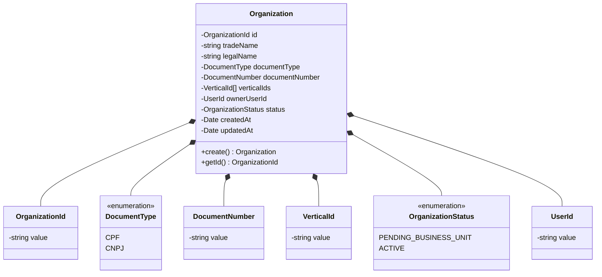

**Propriedades:**

| Propriedade | Tipo | Mutavel? | Regras |
|-------------|------|----------|--------|
| `id` | OrganizationId | Nao | Gerado internamente |
| `tradeName` | string | Nao | Obrigatorio |
| `legalName` | string | Nao | Obrigatorio quando CNPJ |
| `documentType` | DocumentType | Nao | CPF ou CNPJ |
| `documentNumber` | DocumentNumber | Nao | Apenas digitos, 11/14 chars, unico |
| `verticalIds` | VerticalId[] | Nao | Deve conter 1+ ids registrados |
| `ownerUserId` | UserId | Nao | Owner existente e unico |
| `status` | OrganizationStatus | Sim | Inicial PENDING_BUSINESS_UNIT |
| `createdAt` | Date | Nao | Automatico |
| `updatedAt` | Date | Sim | Atualizado em mudancas futuras |

**Comportamentos:**

| Metodo | Regras |
|--------|--------|
| `create` | Valida VO e aplica status inicial |

### UserOrganizationLink

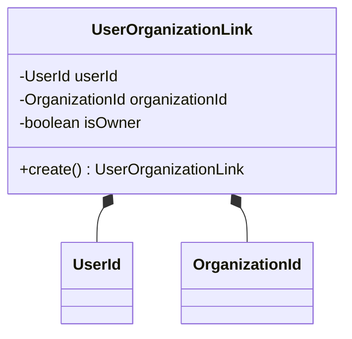

**Propriedades:**

| Propriedade | Tipo | Mutavel? | Regras |
|-------------|------|----------|--------|
| `userId` | UserId | Nao | Obrigatorio |
| `organizationId` | OrganizationId | Nao | Obrigatorio |
| `isOwner` | boolean | Nao | Deve ser true para o owner |

**Comportamentos:**

| Metodo | Regras |
|--------|--------|
| `create` | Impoe isOwner = true no vinculo de owner |

---

### OrganizationVerticalLink

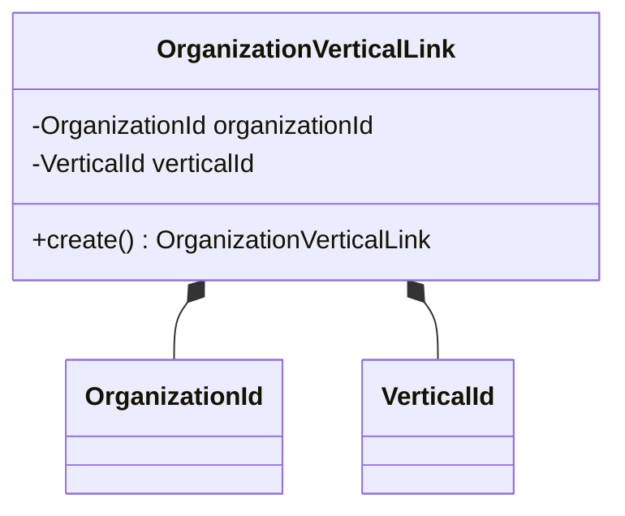

**Propriedades:**

| Propriedade | Tipo | Mutavel? | Regras |
|-------------|------|----------|--------|
| `organizationId` | OrganizationId | Nao | Obrigatorio |
| `verticalId` | VerticalId | Nao | Obrigatorio |

**Comportamentos:**

| Metodo | Regras |
|--------|--------|
| `create` | Gera vinculos para cada vertical informada |

---

## Repository Operations

| Operacao | Descricao | Usada por |
|----------|-----------|-----------|
| `OrganizationRepository.save(organization)` | Persiste organizacao | CreateOrganizationService |
| `OrganizationRepository.existsByDocumentNumber(document)` | Verifica duplicidade em organizacoes | CreateOrganizationService |
| `UserRepository.findById(id)` | Busca owner por id | CreateOrganizationService |
| `UserRepository.existsByDocumentNumber(document)` | Verifica duplicidade em usuarios | CreateOrganizationService |
| `UserRepository.save(user)` | Atualiza status do owner | CreateOrganizationService |
| `UserOrganizationLinkRepository.existsByUserId(userId)` | Verifica vinculo existente do usuario | CreateOrganizationService |
| `UserOrganizationLinkRepository.save(link)` | Persiste vinculo owner | CreateOrganizationService |
| `VerticalRepository.existsByIds(ids)` | Valida existencia das verticais | CreateOrganizationService |
| `OrganizationVerticalRepository.saveMany(links)` | Persiste vinculos organizacao-vertical | CreateOrganizationService |

---

## Database Model

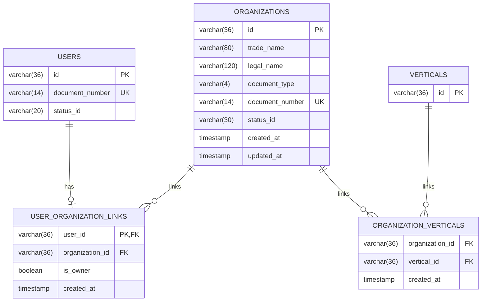

### Tabela: `organizations`

| Coluna | Tipo | Constraints |
|--------|------|-------------|
| `id` | VARCHAR(36) | PK |
| `trade_name` | VARCHAR(80) | NOT NULL |
| `legal_name` | VARCHAR(120) | NULL |
| `document_type` | VARCHAR(4) | NOT NULL |
| `document_number` | VARCHAR(14) | NOT NULL, UNIQUE |
| `status_id` | VARCHAR(30) | NOT NULL |
| `created_at` | TIMESTAMP | NOT NULL, DEFAULT now() |
| `updated_at` | TIMESTAMP | NULL |

### Tabela: `organization_verticals`

| Coluna | Tipo | Constraints |
|--------|------|-------------|
| `organization_id` | VARCHAR(36) | FK(organizations.id), NOT NULL |
| `vertical_id` | VARCHAR(36) | FK(verticals.id), NOT NULL |
| `created_at` | TIMESTAMP | NOT NULL, DEFAULT now() |

### Tabela: `users`

| Coluna | Tipo | Constraints |
|--------|------|-------------|
| `id` | VARCHAR(36) | PK |
| `document_number` | VARCHAR(14) | NOT NULL, UNIQUE |
| `status_id` | VARCHAR(20) | NOT NULL |

### Tabela: `user_organization_links`

| Coluna | Tipo | Constraints |
|--------|------|-------------|
| `user_id` | VARCHAR(36) | PK, FK(users.id), UNIQUE |
| `organization_id` | VARCHAR(36) | FK(organizations.id) |
| `is_owner` | BOOLEAN | NOT NULL, DEFAULT false |
| `created_at` | TIMESTAMP | NOT NULL, DEFAULT now() |

---

## API Endpoints

| Metodo | Path | Operacao | Sucesso | Erros |
|--------|------|----------|---------|-------|
| POST | `/organization/organizations` | Criar organizacao | 201 | 400, 404, 409 |

---

## Error Handling

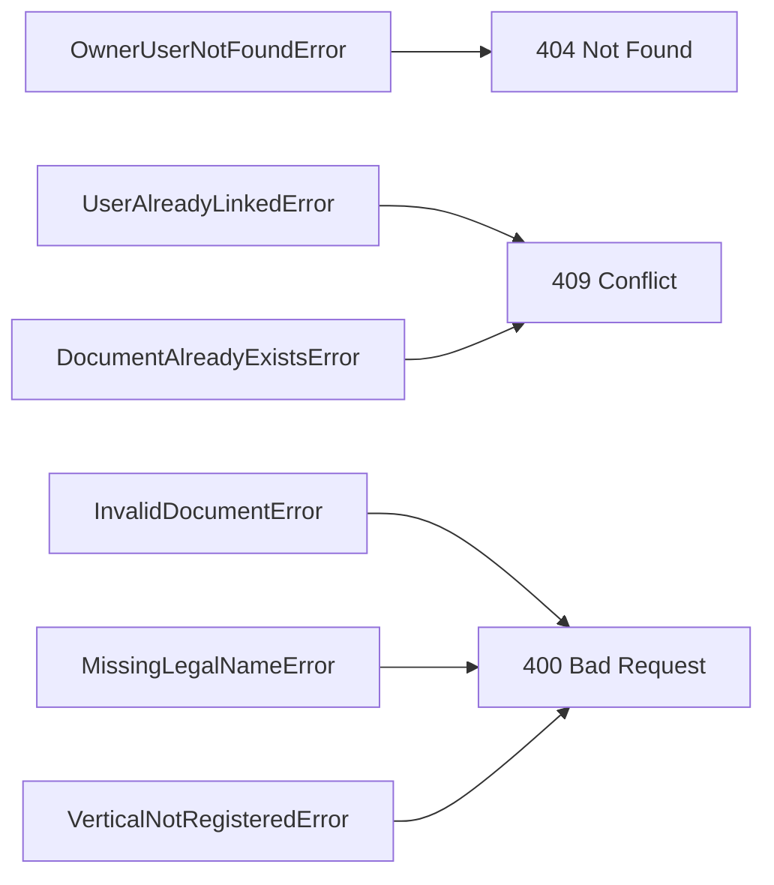

| Erro de Dominio | Quando Ocorre | HTTP Status | Codigo |
|-----------------|---------------|-------------|--------|
| `OwnerUserNotFoundError` | ownerUserId inexistente | 404 | `OWNER_USER_NOT_FOUND` |
| `UserAlreadyLinkedError` | Usuario ja vinculado a organizacao | 409 | `USER_ALREADY_LINKED` |
| `DocumentAlreadyExistsError` | Documento ja cadastrado | 409 | `DOCUMENT_ALREADY_EXISTS` |
| `InvalidDocumentError` | Documento invalido | 400 | `INVALID_DOCUMENT` |
| `MissingLegalNameError` | CNPJ sem razao social | 400 | `LEGAL_NAME_REQUIRED` |
| `VerticalNotRegisteredError` | verticalId nao registrado | 400 | `VERTICAL_NOT_REGISTERED` |

---

## Technical Decisions

### Decisao 1: Unicidade de documento cruzada entre usuarios e organizacoes

**Contexto**: O documento da organizacao deve ser unico considerando usuarios e organizacoes.

**Decisao**: O `CreateOrganizationService` consulta `UserRepository` e `OrganizationRepository` antes da criacao.

**Justificativa**: A regra cruza tabelas diferentes e precisa ser garantida pela aplicacao.

---

### Decisao 2: Vinculo do owner e atualizacao de status em transacao unica

**Contexto**: A organizacao e o vinculo owner nao podem ficar inconsistentes com o status do usuario.

**Decisao**: Persistir organizacao, atualizar status do usuario para ACTIVE e criar `UserOrganizationLink` (isOwner=true) dentro da mesma transacao.

**Justificativa**: Garante atomicidade e evita organizacao criada sem owner ativo.

---

### Decisao 3: Validacao de verticais via catalogo

**Contexto**: As verticais sao cadastradas no modulo de atributos e uma organizacao pode ter mais de uma vertical.

**Decisao**: Validar todos os `verticalIds` no Application Service via `VerticalRepository` e persistir os vinculos em `organization_verticals`.

**Justificativa**: Centraliza a validacao, evita ids inexistentes e suporta associacao multipla.

---

## Implementation Notes

- Normalizar `documentNumber` para apenas digitos antes das validacoes e consultas.
- Nao aceitar `statusId` no input do controller; `verticalIds` devem ser informados.
- Exigir `legalName` quando `documentType` for CNPJ.
- Validar todos os `verticalIds` no catalogo de verticais antes da persistencia.
- Garantir indice unico em `organizations.document_number`, `user_organization_links.user_id` e `organization_verticals(organization_id, vertical_id)`.
- `ownerUserId` deve existir e nao possuir vinculo previo em `user_organization_links`.

---

### design-validation
## Avaliacao do Design: Create Organization

| Criterio | Nota | Observacao |
|----------|------|------------|
| Aderencia a Arquitetura | 5/5 | Camadas e dependencias bem definidas. |
| Completude de Componentes | 5/5 | Componentes essenciais todos mapeados. |
| Consistencia com Spec | 4/5 | Falta explicitar como garantir "exatamente um owner" sem divergencia. |
| Modelagem de Dados | 3/5 | Dupla fonte de owner (organizations.owner_user_id e user_organization_links.is_owner) sem invariant/constraint explicito. |
| Fluxos de Dados | 5/5 | Fluxo cobre validacoes e transacao unica. |
| API Design | 5/5 | Endpoint e erros alinhados com a spec. |
| Diagramas | 5/5 | Diagramas claros e coerentes. |
| Decisoes Tecnicas | 4/5 | Faltou decisao explicita sobre fonte unica de owner. |
| **TOTAL** | 36/40 | |

## Veredicto

- [ ] APROVADO - Pode avancar para plan
- [x] APROVADO COM RESSALVAS - Ajustes menores
- [ ] REPROVADO - Problemas de arquitetura

## Violacoes de Arquitetura

1. Nenhuma identificada.

## Problemas Encontrados

1. Risco de divergencia entre organizations.owner_user_id e user_organization_links.is_owner sem regra de consistencia definida.

## Pontos Fortes

1. Regras de unicidade cruzada e validacao de vertical bem enderecadas.
2. Transacao unica cobre criacao + vinculo + atualizacao do owner.

### spec
# Capability: Create Organization

**Created**: 2026-01-08  
**Project**: `specs/project.md`

---

<!--
  ╔═══════════════════════════════════════════════════════════════════════════╗
  ║  SPEC DE NEGÓCIO - Define O QUÊ a capability faz                          ║
  ║                                                                           ║
  ║  Este documento é agnóstico de tecnologia. Decisões técnicas              ║
  ║  ficam no design.md da capability.                                        ║
  ╚═══════════════════════════════════════════════════════════════════════════╝
-->

## User Stories

### User Story 1 - Register organization for selling (P1)

Como **pessoa que deseja vender pela plataforma**,  
quero **cadastrar minha organização com seus dados legais**,  
para **habilitar o negócio no contexto seller**.

**Por que P1**: Sem a organização não existe negócio para operar ou configurar ponto de venda.

#### Acceptance Criteria

```gherkin
Scenario: Criar organização com usuário owner válido
  Given que o usuário owner existe e não está vinculado a nenhuma organização
  And que não existe usuário ou organização com o mesmo documento
  And que todas as verticais informadas estão registradas
  When a organização é criada informando o ownerUserId e uma lista de verticalIds
  Then a organização deve ser criada com status PENDING_BUSINESS_UNIT
  And o usuário deve ser vinculado como owner da organização
  And o usuário deve ficar com status ACTIVE

Scenario: Rejeitar criação com ownerUserId inexistente
  Given que o usuário owner informado não existe
  When a organização é criada
  Then a criação deve ser rejeitada
  And o sistema deve informar que o usuário owner não existe

Scenario: Rejeitar criação com owner já vinculado a organização
  Given que o usuário owner informado já está vinculado a uma organização
  When a organização é criada
  Then a criação deve ser rejeitada
  And o sistema deve informar que o usuário já está vinculado a uma organização

Scenario: Rejeitar criação com documento já cadastrado
  Given que já existe um usuário ou organização com o mesmo documento
  When a organização é criada
  Then a criação deve ser rejeitada
  And o sistema deve informar que o documento já está cadastrado

Scenario: Rejeitar criação com CNPJ sem razão social
  Given que o tipo de documento é CNPJ
  And que a razão social não foi informada
  When a organização é criada
  Then a criação deve ser rejeitada
  And o sistema deve informar que a razão social é obrigatória para CNPJ

Scenario: Rejeitar criação com vertical inválida
  Given que ao menos uma das verticais informadas não está registrada
  When a organização é criada
  Then a criação deve ser rejeitada
  And o sistema deve informar "Tipo de Negócio Não registrado"
```

---

## Functional Requirements

- **FR-001**: O sistema **DEVE** permitir criar uma organização com: nome fantasia, razão social (quando aplicável), tipo de documento, documento e uma ou mais verticais.
- **FR-002**: A criação da organização **DEVE** exigir `ownerUserId`.
- **FR-003**: O `ownerUserId` **DEVE** existir no contexto Organization.
- **FR-004**: Um usuário **DEVE** estar vinculado a apenas uma organização.
- **FR-005**: Um usuário **DEVE** ser owner de apenas uma organização.
- **FR-006**: Cada organização **DEVE** possuir exatamente um owner.
- **FR-007**: Ao criar a organização, o sistema **DEVE** vincular o usuário como owner.
- **FR-008**: Ao criar a organização, o usuário owner **DEVE** receber status `ACTIVE`.
- **FR-009**: A organização **DEVE** iniciar com status `PENDING_BUSINESS_UNIT`.
- **FR-010**: O documento da organização **DEVE** conter apenas dígitos.
- **FR-011**: O tipo de documento da organização **DEVE** ser um valor válido entre `CPF` e `CNPJ`.
- **FR-012**: O documento da organização **DEVE** ter 11 dígitos para `CPF` e 14 dígitos para `CNPJ`.
- **FR-013**: O documento da organização **DEVE** ser único no contexto de Organization, não podendo existir em usuários ou organizações.
- **FR-014**: `legalName` **DEVE** ser obrigatório quando o `documentType` for `CNPJ`.
- **FR-015**: As verticais **DEVEM** ser referenciadas por `verticalIds`.
- **FR-016**: `verticalIds` **DEVE** conter ao menos um identificador.
- **FR-017**: Cada `verticalId` informado **DEVE** existir no catálogo de verticais.
- **FR-018**: Se algum `verticalId` não estiver registrado, o sistema **DEVE** rejeitar a criação e informar "Tipo de Negócio Não registrado".
- **FR-019**: Uma organização **PODE** possuir mais de uma vertical.
- **FR-020**: O status da organização **NÃO DEVE** ser informado pelo usuário e **DEVE** ser definido pela aplicação.

---

## Entity

### Organization

| Campo | Descrição | Regras |
| --- | --- | --- |
| `id` | Identificador único da organização | Obrigatório, único |
| `tradeName` | Nome fantasia da organização | Obrigatório |
| `legalName` | Razão social/nome formal | Obrigatório quando `documentType` = `CNPJ` |
| `documentType` | Tipo do documento | Obrigatório, valores: `CPF`, `CNPJ` |
| `documentNumber` | Documento da organização | Obrigatório, somente dígitos, 11 (CPF) ou 14 (CNPJ), único entre usuários e organizações |
| `verticalIds` | Verticais da organização | Obrigatório, lista com 1+ ids registrados |
| `ownerUserId` | Usuário owner da organização | Obrigatório |
| `statusId` | Identificador do status | Obrigatório |
| `createdAt` | Data de criação | Obrigatório |
| `updatedAt` | Data da última atualização | Opcional |

**Status permitidos**:

- `PENDING_BUSINESS_UNIT`: Organização sem unidade de negócio configurada
- `ACTIVE`: Organização com pelo menos uma unidade de negócio

---

## Success Criteria

- **SC-001**: 100% das organizações criadas possuem owner válido e status inicial `PENDING_BUSINESS_UNIT`.
- **SC-002**: 100% das tentativas de criação com documento duplicado são rejeitadas.
- **SC-003**: 100% das organizações criadas possuem verticais informadas conforme o catálogo.

---

## Glossary

| Termo | Definição |
| --- | --- |
| Organization | Negócio que será operado na plataforma |
| Owner | Usuário responsável pela organização |
| Vertical | Categoria de atuação do negócio |

---

## Summary

A capability **Create Organization** registra o negócio do seller com dados legais e define um owner único.

Ela estabelece o vínculo do usuário com a organização e prepara o negócio para a criação do primeiro ponto de venda.

---

### spec-validation
## Avaliação da Spec: Create Organization

| Critério | Nota | Observação |
|----------|------|------------|
| Estrutura e Completude | 5/5 | Todas as seções do template estão presentes e bem preenchidas. |
| User Stories | 5/5 | Cenários cobrem fluxo feliz, erros de owner e validação de vertical. |
| Edge Cases | 5/5 | Inclui validação de vertical e formato de documento. |
| Functional Requirements | 5/5 | Regras claras, numeradas e rastreáveis, incluindo status e vertical. |
| Entity | 5/5 | Entidade detalhada com regras de formato e status. |
| Success Criteria | 5/5 | Métricas objetivas e verificáveis. |
| Clareza | 5/5 | Linguagem consistente e sem ambiguidades. |
| Implementabilidade | 5/5 | Pronta para implementação com validações explícitas. |
| **TOTAL** | 40/40 | |

## Veredicto

- [x] ✅ APROVADA - Pode avançar para design
- [ ] 🟡 APROVADA COM RESSALVAS - Ajustes menores necessários
- [ ] 🔴 REPROVADA - Problemas bloqueantes

## Problemas Encontrados

Nenhum.

## Pontos Fortes

1. Regras de vertical e documento explícitas.
2. Fluxo do owner e transições de status bem definidos.
3. Obrigatoriedade de `legalName` para CNPJ definida.

## Template de Referência
Arquivo: `specs/templates/spec-template.md`

PERSISTIR O RESULTADO NO MESMO DIRETÓRIO DA SPEC AVALIADA COM NOME spec-validation.md

## Spec a Validar
Arquivo: `specs/modules/organization/02-create-organization/spec.md`

## 03-create-business-unit

### design
# Design: Create Business Unit

**Created**: 2026-01-08  
**Spec**: [./spec.md](./spec.md)  
**Project**: [../../../project.md](../../../project.md)

---

## Overview

A capability Create Business Unit no contexto Organization cria a unidade de negocio com dados publicos e endereco completo.
A orquestracao ocorre no Application Service, que valida organizacao e owner, normaliza dados, cria BusinessUnit com status inicial PENDING_PRODUCTS e persiste em transacao.
A complexidade e moderada por validacoes de endereco Brasil e pelo update condicional do status da organizacao.

---

## Component Map

### Domain Layer

| Tipo | Nome | Responsabilidade |
|------|------|------------------|
| Entity | `BusinessUnit` | Unidade de negocio com dados publicos e status |
| Entity | `Organization` | Organizacao usada para validar owner e status |
| Value Object | `BusinessUnitId` | Identificador unico da unidade |
| Value Object | `OrganizationId` | Identificador unico da organizacao |
| Value Object | `BusinessUnitAddress` | Endereco completo com validacoes BR |
| Value Object | `BusinessUnitStatus` | Estado da unidade (PENDING_PRODUCTS, ACTIVE) |
| Value Object | `PhoneNumber` | Telefone normalizado (apenas digitos) |
| Value Object | `EmailAddress` | Email validado quando informado |
| Repository Interface | `BusinessUnitRepository` | Persistencia e consultas por organizacao |
| Repository Interface | `OrganizationRepository` | Consulta e atualizacao de organizacao |

### Application Layer

| Tipo | Nome | Responsabilidade |
|------|------|------------------|
| App Service | `CreateBusinessUnitService` | Orquestra a criacao da unidade |
| Input DTO | `CreateBusinessUnitInput` | Dados de entrada para criacao |
| Output DTO | `CreateBusinessUnitOutput` | Dados retornados apos criacao |

### Infrastructure Layer

| Tipo | Nome | Responsabilidade |
|------|------|------------------|
| Repository Impl | `PrismaBusinessUnitRepository` | Implementa `BusinessUnitRepository` |
| Repository Impl | `PrismaOrganizationRepository` | Implementa `OrganizationRepository` |
| Mapper | `BusinessUnitMapper` | Converte Domain ↔ Prisma |

### Presentation Layer

| Tipo | Nome | Responsabilidade |
|------|------|------------------|
| Controller | `BusinessUnitController` | Exposicao HTTP do caso de uso |

---

## Dependency Graph

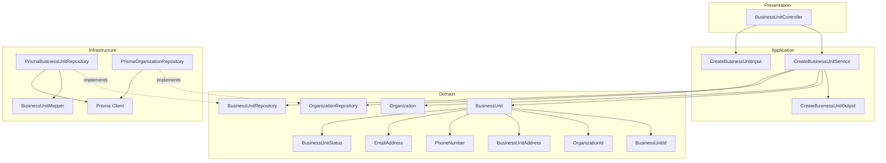

---

## Data Flow

### Fluxo: Criar Business Unit

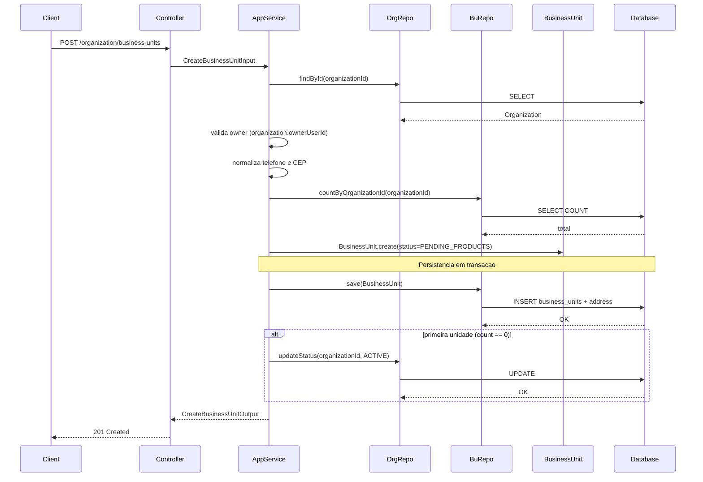

**Transformacoes de dados:**

| Etapa | De | Para |
|-------|----|----- |
| Controller → AppService | JSON body + actorUserId | CreateBusinessUnitInput |
| AppService → Domain | DTO | BusinessUnit |
| Domain → Infra | Entity | Prisma Models |

---

## Entity Structure

### BusinessUnit

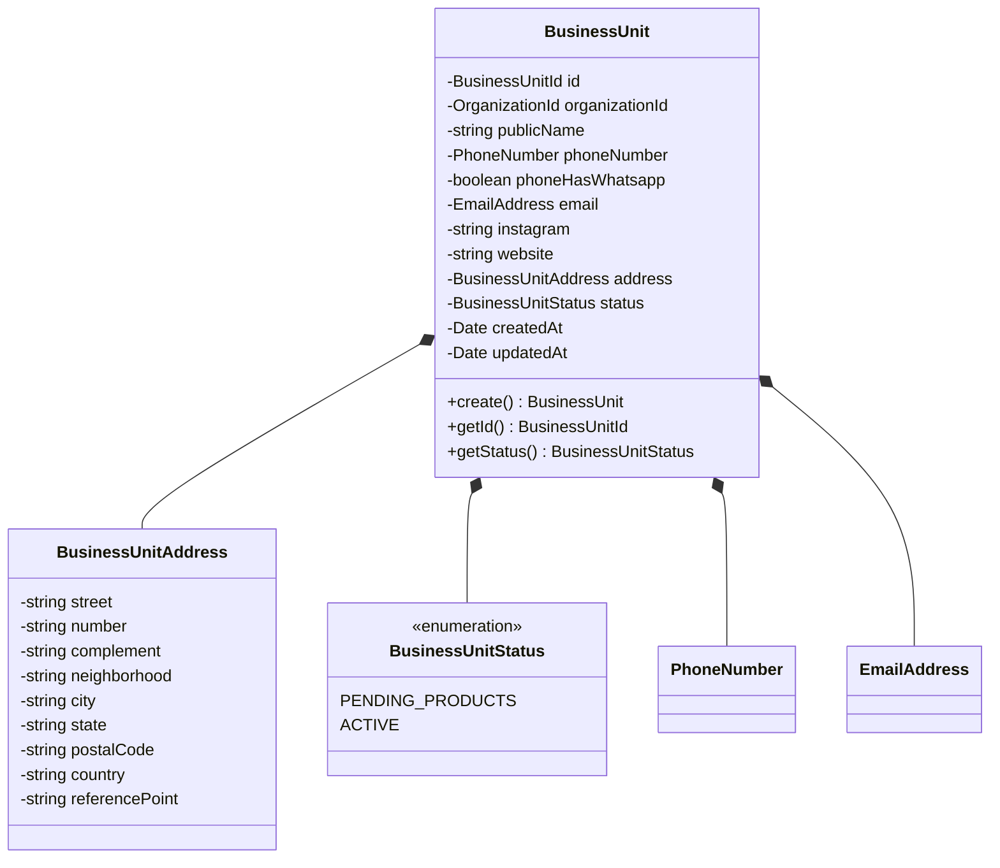

**Propriedades:**

| Propriedade | Tipo | Mutavel? | Regras |
|-------------|------|----------|--------|
| `id` | BusinessUnitId | Nao | Gerado internamente |
| `organizationId` | OrganizationId | Nao | Obrigatorio |
| `publicName` | string | Nao | Obrigatorio |
| `phoneNumber` | PhoneNumber | Nao | Apenas digitos, max 15 |
| `phoneHasWhatsapp` | boolean | Nao | Obrigatorio |
| `email` | EmailAddress | Nao | Opcional, formato valido |
| `instagram` | string | Nao | Opcional |
| `website` | string | Nao | Opcional |
| `address` | BusinessUnitAddress | Nao | Obrigatorio |
| `status` | BusinessUnitStatus | Nao | Definido pela aplicacao |
| `createdAt` | Date | Nao | Automatico |
| `updatedAt` | Date | Sim | Atualizado em mudancas futuras |

### BusinessUnitAddress

**Propriedades:**

| Propriedade | Tipo | Mutavel? | Regras |
|-------------|------|----------|--------|
| `street` | string | Nao | Obrigatorio |
| `number` | string | Nao | Obrigatorio |
| `complement` | string | Nao | Opcional |
| `neighborhood` | string | Nao | Obrigatorio |
| `city` | string | Nao | Obrigatorio |
| `state` | string | Nao | UF valida do Brasil |
| `postalCode` | string | Nao | 8 digitos numericos |
| `country` | string | Nao | Valor fixo `BR` |
| `referencePoint` | string | Nao | Obrigatorio |

**Comportamentos:**

| Metodo | Regras |
|--------|--------|
| `create` | Valida dados obrigatorios, UF e pais BR |

---

## Repository Operations

| Operacao | Descricao | Usada por |
|----------|-----------|-----------|
| `BusinessUnitRepository.save(unit)` | Persiste unidade e endereco | CreateBusinessUnitService |
| `BusinessUnitRepository.countByOrganizationId(orgId)` | Conta unidades da organizacao | CreateBusinessUnitService |
| `OrganizationRepository.findById(id)` | Carrega organizacao e owner | CreateBusinessUnitService |
| `OrganizationRepository.updateStatus(id, status)` | Atualiza status da organizacao | CreateBusinessUnitService |

---

## Database Model

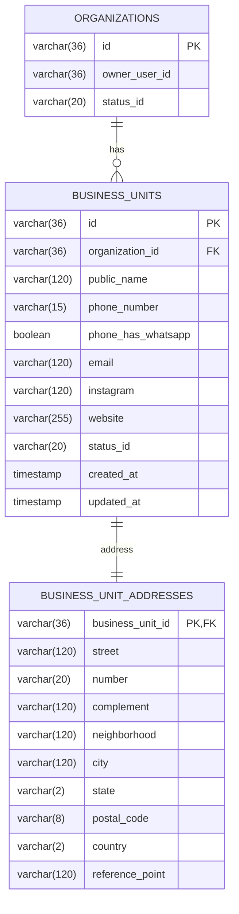

### Tabela: `business_units`

| Coluna | Tipo | Constraints |
|--------|------|-------------|
| `id` | VARCHAR(36) | PK |
| `organization_id` | VARCHAR(36) | FK(organizations.id), NOT NULL |
| `public_name` | VARCHAR(120) | NOT NULL |
| `phone_number` | VARCHAR(15) | NOT NULL |
| `phone_has_whatsapp` | BOOLEAN | NOT NULL |
| `email` | VARCHAR(120) | NULL |
| `instagram` | VARCHAR(120) | NULL |
| `website` | VARCHAR(255) | NULL |
| `status_id` | VARCHAR(20) | NOT NULL |
| `created_at` | TIMESTAMP | NOT NULL, DEFAULT now() |
| `updated_at` | TIMESTAMP | NULL |

### Tabela: `business_unit_addresses`

| Coluna | Tipo | Constraints |
|--------|------|-------------|
| `business_unit_id` | VARCHAR(36) | PK, FK(business_units.id) |
| `street` | VARCHAR(120) | NOT NULL |
| `number` | VARCHAR(20) | NOT NULL |
| `complement` | VARCHAR(120) | NULL |
| `neighborhood` | VARCHAR(120) | NOT NULL |
| `city` | VARCHAR(120) | NOT NULL |
| `state` | VARCHAR(2) | NOT NULL |
| `postal_code` | VARCHAR(8) | NOT NULL |
| `country` | VARCHAR(2) | NOT NULL |
| `reference_point` | VARCHAR(120) | NOT NULL |

### Tabela: `organizations`

| Coluna | Tipo | Constraints |
|--------|------|-------------|
| `id` | VARCHAR(36) | PK |
| `owner_user_id` | VARCHAR(36) | NOT NULL |
| `status_id` | VARCHAR(20) | NOT NULL |

---

## API Endpoints

| Metodo | Path | Operacao | Sucesso | Erros |
|--------|------|----------|---------|-------|
| POST | `/organization/business-units` | Criar unidade de negocio | 201 | 400, 403, 404 |

---

## Error Handling

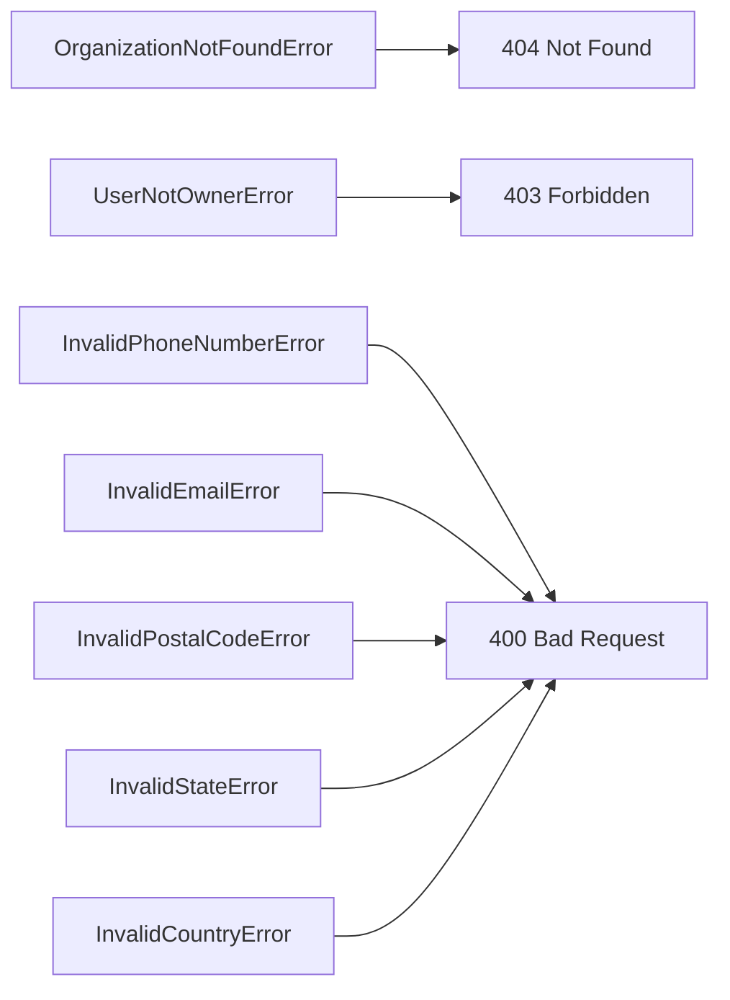

| Erro de Dominio | Quando Ocorre | HTTP Status | Codigo |
|-----------------|---------------|-------------|--------|
| `OrganizationNotFoundError` | organizationId inexistente | 404 | `ORGANIZATION_NOT_FOUND` |
| `UserNotOwnerError` | usuario nao e owner da organizacao | 403 | `USER_NOT_OWNER` |
| `InvalidPhoneNumberError` | telefone invalido | 400 | `INVALID_PHONE_NUMBER` |
| `InvalidEmailError` | email invalido | 400 | `INVALID_EMAIL` |
| `InvalidPostalCodeError` | CEP invalido | 400 | `INVALID_POSTAL_CODE` |
| `InvalidStateError` | UF invalida | 400 | `INVALID_STATE` |
| `InvalidCountryError` | pais diferente de BR | 400 | `INVALID_COUNTRY` |

---

## Technical Decisions

### Decisao 1: Validar ownership via ownerUserId da organizacao

**Contexto**: A criacao exige que o solicitante seja owner da organizacao.

**Decisao**: O `CreateBusinessUnitService` carrega a organizacao e compara `ownerUserId` com o `actorUserId` do request.

**Justificativa**: Evita consultas adicionais ao vinculo usuario-organizacao e usa a fonte unica de ownership da organizacao.

---

### Decisao 2: Transacao unica para unidade, endereco e update de organizacao

**Contexto**: A primeira unidade ativa a organizacao e nao pode existir inconsistencias.

**Decisao**: Persistir `BusinessUnit`, `BusinessUnitAddress` e o update de status da organizacao na mesma transacao do Prisma.

**Justificativa**: Garante atomicidade entre criacao da unidade e status da organizacao.

---

### Decisao 3: Endereco como Value Object e tabela 1:1

**Contexto**: O endereco tem regras de validacao Brasil e eh parte obrigatoria da unidade.

**Decisao**: Modelar `BusinessUnitAddress` como VO dentro de `BusinessUnit` e persistir em `business_unit_addresses`.

**Justificativa**: Mantem regras de endereco encapsuladas e permite evolucao do endereco sem inflar a tabela principal.

---

## Implementation Notes

- Normalizar `phoneNumber` e `postalCode` para apenas digitos antes da validacao.
- Rejeitar `state` fora da lista de UFs e `country` diferente de `BR`.
- Definir `status` como `PENDING_PRODUCTS` sempre na criacao.
- Atualizar `organizations.status_id` para `ACTIVE` apenas quando `countByOrganizationId` for 0.
- Usar transacao unica para `business_units`, `business_unit_addresses` e update de organizacao.

---

### design-validation
## Avaliacao do Design: Create Business Unit

| Criterio | Nota | Observacao |
|----------|------|------------|
| Aderencia a Arquitetura | 5/5 | DDD preservado e dependencias corretas. |
| Completude de Componentes | 5/5 | Componentes mapeados conforme template. |
| Consistencia com Spec | 5/5 | Regras de owner, endereco e status inicial cobertas. |
| Modelagem de Dados | 5/5 | Tabelas e VO de endereco alinhados ao dominio. |
| Fluxos de Dados | 5/5 | Fluxo detalha criacao, contagem e update condicional. |
| API Design | 5/5 | Endpoint e erros coerentes com a spec. |
| Diagramas | 5/5 | Mermaid consistente. |
| Decisoes Tecnicas | 4/5 | Faltou explicitar fonte da lista de UFs/validacao. |
| **TOTAL** | 39/40 | |

## Veredicto

- [ ] APROVADO - Pode avancar para plan
- [x] APROVADO COM RESSALVAS - Ajustes menores
- [ ] REPROVADO - Problemas de arquitetura

## Violacoes de Arquitetura

1. Nenhuma identificada.

## Problemas Encontrados

1. Nao explicita a fonte/regra operacional para validacao de UF/CEP (apenas menciona validacao).

## Pontos Fortes

1. Endereco modelado como VO com tabela 1:1.
2. Transacao unica garante consistencia com status da organizacao.

### spec
# Capability: Create Business Unit

**Created**: 2026-01-08  
**Project**: `specs/project.md`

---

<!--
  ╔═══════════════════════════════════════════════════════════════════════════╗
  ║  SPEC DE NEGÓCIO - Define O QUÊ a capability faz                          ║
  ║                                                                           ║
  ║  Este documento é agnóstico de tecnologia. Decisões técnicas              ║
  ║  ficam no design.md da capability.                                        ║
  ╚═══════════════════════════════════════════════════════════════════════════╝
-->

## User Stories

### User Story 1 - Create business unit (P1)

Como **owner da organização**,  
quero **criar uma unidade de negócio com dados públicos e endereço completo**,  
para **iniciar a operação de venda na plataforma**.

**Por que P1**: Sem unidade de negócio não há ponto de venda disponível para clientes.

#### Acceptance Criteria

```gherkin
Scenario: Criar unidade de negócio com dados válidos
  Given que a organização existe e o usuário é owner da organização
  When a unidade de negócio é criada com os dados obrigatórios
  Then a unidade de negócio deve ser criada com status PENDING_PRODUCTS
  And a unidade de negócio deve ficar vinculada à organização
  And a organização deve ficar com status ACTIVE

Scenario: Rejeitar criação com organização inexistente
  Given que a organização informada não existe
  When a unidade de negócio é criada
  Then a criação deve ser rejeitada
  And o sistema deve informar que a organização não existe

Scenario: Rejeitar criação por usuário não owner
  Given que a organização existe
  And que o usuário não é owner da organização
  When a unidade de negócio é criada
  Then a criação deve ser rejeitada
  And o sistema deve informar que apenas o owner pode criar a unidade de negócio

Scenario: Criar unidade adicional para organização ativa
  Given que a organização existe e já possui unidade de negócio
  And que o usuário é owner da organização
  When a unidade de negócio é criada com os dados obrigatórios
  Then a unidade de negócio deve ser criada
  And a organização deve permanecer com status ACTIVE
```

---

## Functional Requirements

- **FR-001**: O sistema **DEVE** permitir criar uma unidade de negócio vinculada a uma organização existente.
- **FR-002**: A criação **DEVE** ser solicitada por um usuário owner da organização.
- **FR-003**: A unidade de negócio **DEVE** conter nome público, telefone e indicação de WhatsApp.
- **FR-004**: A unidade de negócio **DEVE** possuir endereço completo com estrutura Brasil.
- **FR-005**: O endereço **DEVE** incluir: rua, número, bairro, cidade, estado, CEP, país e ponto de referência.
- **FR-006**: O complemento do endereço **PODE** ser informado.
- **FR-007**: O email do ponto de venda **PODE** ser informado.
- **FR-008**: O Instagram do negócio **PODE** ser informado.
- **FR-009**: O site ou link público do negócio **PODE** ser informado.
- **FR-010**: O telefone da unidade de negócio **DEVE** conter apenas dígitos e ter no máximo 15 caracteres.
- **FR-011**: O CEP **DEVE** seguir o padrão BR com 8 dígitos numéricos.
- **FR-012**: O estado **DEVE** ser uma UF válida do Brasil.
- **FR-013**: O país **DEVE** ser `BR`.
- **FR-014**: A unidade de negócio **DEVE** iniciar com status `PENDING_PRODUCTS`.
- **FR-015**: Ao criar a primeira unidade de negócio, a organização **DEVE** mudar para status `ACTIVE`.
- **FR-016**: Uma organização **PODE** ter múltiplas unidades de negócio, sem limite definido no momento.
- **FR-017**: O status da unidade de negócio **NÃO DEVE** ser informado pelo usuário e **DEVE** ser definido pela aplicação.

---

## Entity

### BusinessUnit

| Campo | Descrição | Regras |
| --- | --- | --- |
| `id` | Identificador único da unidade de negócio | Obrigatório, único |
| `organizationId` | Organização vinculada | Obrigatório |
| `publicName` | Nome público exibido aos compradores | Obrigatório |
| `phoneNumber` | Telefone de contato | Obrigatório, somente dígitos, máximo 15 caracteres |
| `phoneHasWhatsapp` | Indica se o telefone possui WhatsApp | Obrigatório |
| `email` | Email do ponto de venda | Opcional |
| `instagram` | Instagram do negócio | Opcional |
| `website` | Site ou link público do negócio | Opcional |
| `statusId` | Identificador do status | Obrigatório |
| `createdAt` | Data de criação | Obrigatório |
| `updatedAt` | Data da última atualização | Opcional |

**Status permitidos**:

- `PENDING_PRODUCTS`: Unidade sem produtos cadastrados
- `ACTIVE`: Unidade com produtos cadastrados

### BusinessUnitAddress

| Campo | Descrição | Regras |
| --- | --- | --- |
| `street` | Rua/Logradouro | Obrigatório |
| `number` | Número | Obrigatório |
| `complement` | Complemento | Opcional |
| `neighborhood` | Bairro | Obrigatório |
| `city` | Cidade | Obrigatório |
| `state` | Estado | Obrigatório, UF válida do Brasil |
| `postalCode` | CEP | Obrigatório, 8 dígitos numéricos |
| `country` | País | Obrigatório, valor esperado: `BR` |
| `referencePoint` | Ponto de referência | Obrigatório |

---

## Success Criteria

- **SC-001**: 100% das unidades de negócio criadas possuem status inicial `PENDING_PRODUCTS`.
- **SC-002**: 100% das organizações com unidade de negócio passam para status `ACTIVE`.
- **SC-003**: 100% das unidades de negócio criadas possuem endereço completo.

---

## Glossary

| Termo | Definição |
| --- | --- |
| Business Unit | Ponto de venda da organização |
| Owner | Usuário responsável pela organização |

---

## Summary

A capability **Create Business Unit** registra o ponto de venda da organização com dados públicos e endereço completo.

Ela habilita a organização para operar, mantendo a unidade de negócio em estado pendente até o cadastro de produtos.

---

### spec-validation
## Avaliação da Spec: Create Business Unit

| Critério | Nota | Observação |
|----------|------|------------|
| Estrutura e Completude | 5/5 | Todas as seções do template estão presentes e bem preenchidas. |
| User Stories | 5/5 | Cenários cobrem fluxo feliz, erros principais e criação de unidade adicional. |
| Edge Cases | 5/5 | Inclui validações de telefone, CEP, UF e país. |
| Functional Requirements | 5/5 | Regras claras, numeradas e rastreáveis, incluindo múltiplas unidades. |
| Entity | 5/5 | Entidades detalhadas com regras de formato e status. |
| Success Criteria | 5/5 | Métricas objetivas e verificáveis. |
| Clareza | 5/5 | Linguagem consistente e sem ambiguidades. |
| Implementabilidade | 5/5 | Pronta para implementação com validações explícitas. |
| **TOTAL** | 40/40 | |

## Veredicto

- [x] ✅ APROVADA - Pode avançar para design
- [ ] 🟡 APROVADA COM RESSALVAS - Ajustes menores necessários
- [ ] 🔴 REPROVADA - Problemas bloqueantes

## Problemas Encontrados

Nenhum.

## Pontos Fortes

1. Regras de endereço e formatos explícitas.
2. Cenários cobrem erros e criação de unidade adicional.
3. Status definidos pela aplicação e múltiplas unidades permitidas.

## Template de Referência
Arquivo: `specs/templates/spec-template.md`

PERSISTIR O RESULTADO NO MESMO DIRETÓRIO DA SPEC AVALIADA COM NOME spec-validation.md

## Spec a Validar
Arquivo: `specs/modules/organization/03-create-business-unit/spec.md`

## 04-get-user

### design
# Design: Get User

**Created**: 2026-01-08  
**Spec**: [./spec.md](./spec.md)  
**Project**: [../../../project.md](../../../project.md)

---

## Overview

A capability Get User no contexto Organization consulta um usuario por id e retorna seus dados completos com o organizationId quando houver vinculo.
A orquestracao ocorre no Application Service, que valida o UserId, aplica politica de acesso e consulta UserRepository e UserOrganizationLinkRepository.
A complexidade e baixa, com foco em leitura consistente e retorno de vinculo opcional.

---

## Component Map

### Domain Layer

| Tipo | Nome | Responsabilidade |
|------|------|------------------|
| Entity | `User` | Dados do usuario e status atual |
| Entity | `UserOrganizationLink` | Vinculo entre usuario e organizacao |
| Value Object | `UserId` | Identificador unico do usuario |
| Value Object | `OrganizationId` | Identificador unico da organizacao |
| Value Object | `DocumentType` | Tipo do documento (CPF, CNPJ) |
| Value Object | `DocumentNumber` | Documento normalizado |
| Value Object | `EmailAddress` | Email validado e normalizado |
| Value Object | `PhoneNumber` | Celular validado e normalizado |
| Value Object | `UserStatus` | Status atual do usuario |
| Repository Interface | `UserRepository` | Consulta de usuario por id |
| Repository Interface | `UserOrganizationLinkRepository` | Consulta de vinculo usuario-organizacao |

### Application Layer

| Tipo | Nome | Responsabilidade |
|------|------|------------------|
| App Service | `GetUserService` | Orquestra a consulta do usuario |
| Input DTO | `GetUserInput` | Dados de entrada (userId, actorUserId) |
| Output DTO | `GetUserOutput` | Dados completos do usuario |

### Infrastructure Layer

| Tipo | Nome | Responsabilidade |
|------|------|------------------|
| Repository Impl | `PrismaUserRepository` | Implementa `UserRepository` |
| Repository Impl | `PrismaUserOrganizationLinkRepository` | Implementa `UserOrganizationLinkRepository` |
| Mapper | `UserMapper` | Converte Domain <-> Prisma |
| Mapper | `UserOrganizationLinkMapper` | Converte Domain <-> Prisma |

### Presentation Layer

| Tipo | Nome | Responsabilidade |
|------|------|------------------|
| Controller | `UserController` | Endpoint HTTP de consulta |
| Middleware | `AccessControlMiddleware` | Valida permissao e rejeita com FORBIDDEN |

---

## Dependency Graph

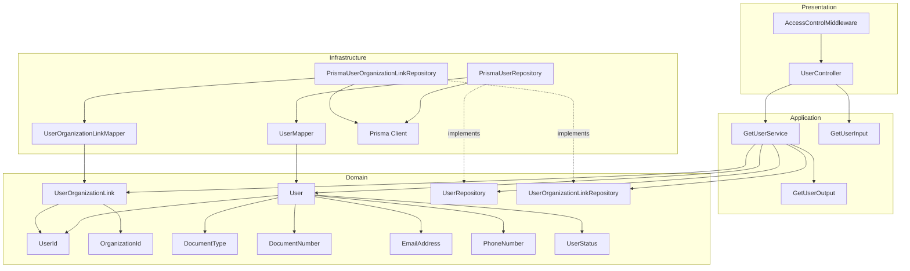

---

## Data Flow

### Fluxo: Consultar Usuario

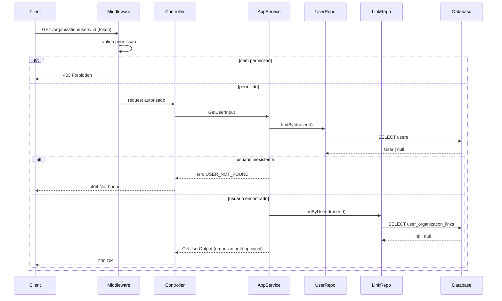

**Transformacoes de dados:**

| Etapa | De | Para |
|-------|----|----- |
| Controller -> AppService | Params + actorUserId | GetUserInput |
| AppService -> Domain | DTO | User, UserOrganizationLink |
| Domain -> Presentation | Entities | GetUserOutput |

---

## Entity Structure

### User

```mermaid
classDiagram
    class User {
        -UserId id
        -string firstName
        -string lastName
        -DocumentType documentType
        -DocumentNumber documentNumber
        -EmailAddress email
        -PhoneNumber phoneNumber
        -boolean emailOptIn
        -boolean phoneOptIn
        -UserStatus status
        -Date createdAt
        -Date updatedAt
        +getId() UserId
    }

    class UserId {
        -string value
    }

    class DocumentType {
        <<enumeration>>
        CPF
        CNPJ
    }

    class DocumentNumber {
        -string value
    }

    class EmailAddress {
        -string value
    }

    class PhoneNumber {
        -string value
    }

    class UserStatus {
        <<enumeration>>
        PENDING_ORG_LINK
        ORG_LINKED
        ACTIVE
        INACTIVE
    }

    User *-- UserId
    User *-- DocumentType
    User *-- DocumentNumber
    User *-- EmailAddress
    User *-- PhoneNumber
    User *-- UserStatus
```

### UserOrganizationLink

```mermaid
classDiagram
    class UserOrganizationLink {
        -UserId userId
        -OrganizationId organizationId
        -boolean isOwner
    }

    class OrganizationId {
        -string value
    }

    UserOrganizationLink *-- UserId
    UserOrganizationLink *-- OrganizationId
```

**Propriedades:**

| Propriedade | Tipo | Mutavel? | Regras |
|-------------|------|----------|--------|
| `id` | UserId | Nao | Obrigatorio |
| `firstName` | string | Nao | Obrigatorio |
| `lastName` | string | Nao | Obrigatorio |
| `documentType` | DocumentType | Nao | CPF ou CNPJ |
| `documentNumber` | DocumentNumber | Nao | Apenas digitos |
| `email` | EmailAddress | Nao | Formato valido |
| `phoneNumber` | PhoneNumber | Nao | Apenas digitos |
| `status` | UserStatus | Nao | Retornar estado atual |

---

## Repository Operations

| Operacao | Descricao | Usada por |
|----------|-----------|-----------|
| `UserRepository.findById(id)` | Busca usuario por id | GetUserService |
| `UserOrganizationLinkRepository.findByUserId(userId)` | Busca vinculo do usuario | GetUserService |

---

## Database Model

```mermaid
erDiagram
    USERS {
        varchar(36) id PK
        varchar(60) first_name
        varchar(60) last_name
        varchar(4) document_type
        varchar(14) document_number
        varchar(120) email
        varchar(15) phone_number
        varchar(20) status_id
        timestamp created_at
        timestamp updated_at
    }

    USER_ORGANIZATION_LINKS {
        varchar(36) user_id PK, FK
        varchar(36) organization_id FK
        boolean is_owner
        timestamp created_at
    }

    ORGANIZATIONS {
        varchar(36) id PK
    }

    USERS ||--o| USER_ORGANIZATION_LINKS : has
    ORGANIZATIONS ||--o{ USER_ORGANIZATION_LINKS : links
```

### Tabela: `users`

| Coluna | Tipo | Constraints |
|--------|------|-------------|
| `id` | VARCHAR(36) | PK |
| `first_name` | VARCHAR(60) | NOT NULL |
| `last_name` | VARCHAR(60) | NOT NULL |
| `document_type` | VARCHAR(4) | NOT NULL |
| `document_number` | VARCHAR(14) | NOT NULL, UNIQUE |
| `email` | VARCHAR(120) | NOT NULL, UNIQUE |
| `phone_number` | VARCHAR(15) | NOT NULL, UNIQUE |
| `status_id` | VARCHAR(20) | NOT NULL |
| `created_at` | TIMESTAMP | NOT NULL, DEFAULT now() |
| `updated_at` | TIMESTAMP | NULL |

### Tabela: `user_organization_links`

| Coluna | Tipo | Constraints |
|--------|------|-------------|
| `user_id` | VARCHAR(36) | PK, FK(users.id) |
| `organization_id` | VARCHAR(36) | FK(organizations.id) |
| `is_owner` | BOOLEAN | NOT NULL |
| `created_at` | TIMESTAMP | NOT NULL, DEFAULT now() |

---

## API Endpoints

| Metodo | Path | Operacao | Sucesso | Erros |
|--------|------|----------|---------|-------|
| GET | `/organization/users/:id` | Consultar usuario | 200 | 400, 403, 404 |

---

## Error Handling

```mermaid
flowchart LR
    ID400[InvalidUserIdError] --> H400[400 Bad Request]
    NF404[UserNotFoundError] --> H404[404 Not Found]
    FORB403[ForbiddenError] --> H403[403 Forbidden]
```

| Erro de Dominio | Quando Ocorre | HTTP Status | Codigo |
|-----------------|---------------|-------------|--------|
| `InvalidUserIdError` | userId invalido | 400 | `INVALID_USER_ID` |
| `UserNotFoundError` | usuario inexistente | 404 | `USER_NOT_FOUND` |
| `ForbiddenError` | sem permissao para consultar | 403 | `FORBIDDEN` |

---

## Technical Decisions

### Decisao 1: Vinculo separado do usuario

**Contexto**: O organizationId e opcional e vive em tabela de vinculo.

**Decisao**: Consultar `UserOrganizationLinkRepository` apos carregar o usuario, retornando `organizationId` quando existir.

**Justificativa**: Mantem `User` independente do vinculo e permite ausencia de organizacao.

---

### Decisao 2: Permissao validada antes da consulta

**Contexto**: A spec exige rejeitar consultas sem permissao.

**Decisao**: `AccessControlMiddleware` valida a permissao do solicitante antes de chamar o `GetUserService`.

**Justificativa**: Bloqueia acesso cedo e padroniza respostas 403 na camada de presentation.

---

## Implementation Notes

- Validar `userId` via `UserId` antes de consultar repositorios.
- Quando nao existir vinculo, retornar `organizationId = null`.
- Evitar consulta ao vinculo quando o usuario nao existir.
- Manter mapeamento de status conforme valor atual do `UserStatus`.

---

### design-validation
## Avaliacao do Design: Get User

| Criterio | Nota | Observacao |
|----------|------|------------|
| Aderencia a Arquitetura | 5/5 | Camadas e responsabilidades claras. |
| Completude de Componentes | 4/5 | Output nao detalha todos os campos exigidos na spec. |
| Consistencia com Spec | 4/5 | emailOptIn, phoneOptIn, createdAt, updatedAt nao aparecem no quadro de propriedades. |
| Modelagem de Dados | 5/5 | Modelo consistente com users e user_organization_links. |
| Fluxos de Dados | 5/5 | Fluxo cobre acesso, consulta e vinculo opcional. |
| API Design | 5/5 | Endpoint e codigos de erro corretos. |
| Diagramas | 5/5 | Diagramas claros e validos. |
| Decisoes Tecnicas | 4/5 | Ok, mas faltou explicitar o contrato do output. |
| **TOTAL** | 37/40 | |

## Veredicto

- [ ] APROVADO - Pode avancar para plan
- [x] APROVADO COM RESSALVAS - Ajustes menores
- [ ] REPROVADO - Problemas de arquitetura

## Violacoes de Arquitetura

1. Nenhuma identificada.

## Problemas Encontrados

1. GetUserOutput nao explicita campos obrigatorios da spec (emailOptIn, phoneOptIn, createdAt, updatedAt).

## Pontos Fortes

1. Vinculo opcional tratado de forma limpa via repositorio dedicado.
2. Controle de acesso bem posicionado no middleware.

### spec
# Capability: Get User

**Created**: 2026-01-08  
**Project**: `specs/project.md`

---

<!--
  ╔═══════════════════════════════════════════════════════════════════════════╗
  ║  SPEC DE NEGÓCIO - Define O QUÊ a capability faz                          ║
  ║                                                                           ║
  ║  Este documento é agnóstico de tecnologia. Decisões técnicas              ║
  ║  ficam no design.md da capability.                                        ║
  ╚═══════════════════════════════════════════════════════════════════════════╝
-->

## User Stories

### User Story 1 - Consultar usuário por id (P1)

Como **responsável pelo módulo de organização**,  
quero **consultar um usuário pelo seu identificador**,  
para **visualizar seus dados e o vínculo organizacional atual**.

**Por que P1**: A consulta individual é necessária para fluxos de atendimento e validação de cadastro.

#### Acceptance Criteria

```gherkin
Scenario: Consultar usuário existente com vínculo organizacional
  Given que o usuário informado existe e possui organização vinculada
  When a consulta é realizada pelo id do usuário
  Then o sistema deve retornar os dados do usuário
  And deve retornar o organizationId associado

Scenario: Consultar usuário existente sem vínculo organizacional
  Given que o usuário informado existe e não possui organização vinculada
  When a consulta é realizada pelo id do usuário
  Then o sistema deve retornar os dados do usuário
  And o organizationId deve ser nulo

Scenario: Consultar usuário inativo
  Given que o usuário informado existe e está com status INACTIVE
  When a consulta é realizada pelo id do usuário
  Then o sistema deve retornar os dados do usuário
  And o statusId deve refletir o estado INACTIVE

Scenario: Rejeitar consulta com userId inválido
  Given que o userId informado é inválido
  When a consulta é realizada pelo id do usuário
  Then a consulta deve ser rejeitada
  And o sistema deve informar `INVALID_USER_ID`

Scenario: Rejeitar consulta de usuário inexistente
  Given que o usuário informado não existe
  When a consulta é realizada pelo id do usuário
  Then a consulta deve ser rejeitada
  And o sistema deve informar `USER_NOT_FOUND`
```

---

## Functional Requirements

- **FR-001**: O sistema **DEVE** permitir consultar um usuário por `userId`.
- **FR-002**: O `userId` **DEVE** ser informado e válido; quando inválido, o sistema **DEVE** rejeitar a consulta com erro `INVALID_USER_ID`.
- **FR-003**: Se o usuário existir, o sistema **DEVE** retornar seus dados completos.
- **FR-004**: O sistema **DEVE** retornar o `organizationId` do usuário quando houver vínculo.
- **FR-005**: Se o usuário não possuir vínculo organizacional, o `organizationId` **DEVE** ser `null`.
- **FR-006**: Se o usuário não existir, a consulta **DEVE** ser rejeitada com erro `USER_NOT_FOUND`.
- **FR-007**: A consulta **DEVE** retornar dados do usuário independentemente do status; o `statusId` **DEVE** refletir o estado atual.
- **FR-008**: A consulta **DEVE** ser rejeitada quando o solicitante não tiver permissão, com erro `FORBIDDEN`.

---

## Error Handling

A resposta de erro **DEVE** seguir o padrão:

- `success = false`
- `error.code` e `error.message` obrigatórios

| Código | Quando ocorre | Status |
| --- | --- | --- |
| `INVALID_USER_ID` | `userId` inválido | 400 |
| `USER_NOT_FOUND` | Usuário não encontrado | 404 |
| `FORBIDDEN` | Solicitante sem permissão para consultar | 403 |

---

## Entity

### UserDetails

| Campo | Descrição | Regras |
| --- | --- | --- |
| `id` | Identificador único do usuário | Obrigatório |
| `firstName` | Nome do usuário | Obrigatório |
| `lastName` | Sobrenome do usuário | Obrigatório |
| `documentType` | Tipo do documento | Obrigatório, valores: `CPF`, `CNPJ` |
| `documentNumber` | Documento do usuário | Obrigatório, somente dígitos, 11 (CPF) ou 14 (CNPJ) |
| `email` | Email do usuário | Obrigatório, formato válido |
| `phoneNumber` | Celular do usuário | Obrigatório, somente dígitos, máximo 15 caracteres |
| `emailOptIn` | Preferência de comunicação por email | Obrigatório |
| `phoneOptIn` | Preferência de comunicação por celular | Obrigatório |
| `statusId` | Identificador do status | Obrigatório |
| `organizationId` | Organização vinculada | Opcional, `null` quando não existir vínculo |
| `createdAt` | Data de criação | Obrigatório |
| `updatedAt` | Data da última atualização | Opcional |

---

## Success Criteria

- **SC-001**: 100% das consultas de usuários existentes retornam `organizationId` coerente com o vínculo.
- **SC-002**: 100% das consultas de usuários inexistentes são rejeitadas.

---

## Glossary

| Termo | Definição |
| --- | --- |
| User | Pessoa física que inicia o onboarding para vender |
| Organization | Negócio registrado pelo usuário |

---

## Summary

A capability **Get User** permite consultar um usuário por id e retornar seus dados com o vínculo organizacional atual.

Ela suporta fluxos de atendimento e validação de cadastro, com retorno explícito de ausência de organização.

---

### spec-validation
## Avaliação da Spec: Get User

| Critério | Nota | Observação |
|----------|------|------------|
| Estrutura e Completude | 5/5 | Template completo e inclui seção de tratamento de erros. |
| User Stories | 5/5 | Cenários de sucesso, ausência de vínculo, usuário inativo e erros principais. |
| Edge Cases | 5/5 | Cobre id inválido, usuário inexistente e status inativo. |
| Functional Requirements | 5/5 | Regras claras, incluindo permissões e retorno de status. |
| Entity | 5/5 | Campos e regras bem definidos. |
| Success Criteria | 4/5 | Métricas objetivas; não inclui critérios não funcionais. |
| Clareza | 5/5 | Linguagem direta e consistente. |
| Implementabilidade | 5/5 | Contrato de erro e status definidos. |
| **TOTAL** | 39/40 | |

## Veredicto

- [x] ✅ APROVADA - Pode avançar para design
- [ ] 🟡 APROVADA COM RESSALVAS - Ajustes menores necessários
- [ ] 🔴 REPROVADA - Problemas bloqueantes

## Problemas Encontrados

1. Success Criteria não contempla métricas não funcionais (ex.: tempo de resposta).

## Pontos Fortes

1. Cobertura completa de cenários, incluindo ausência de vínculo e usuário inativo.
2. Tratamento de erros com códigos e status definidos.

## Template de Referência
Arquivo: `specs/templates/spec-template.md`

## 05-list-users

### design
# Design: List Users

**Created**: 2026-01-08  
**Spec**: [./spec.md](./spec.md)  
**Project**: [../../../project.md](../../../project.md)

---

## Overview

A capability List Users no contexto Organization retorna usuarios cadastrados com metadados de paginacao e o organizationId quando houver vinculo.
A orquestracao ocorre no Application Service, que normaliza paginacao e ordenacao, consulta usuarios e agrega os vinculos em lote.
A complexidade e baixa, com foco em leitura paginada e montagem de resposta consistente.

---

## Component Map

### Domain Layer

| Tipo | Nome | Responsabilidade |
|------|------|------------------|
| Entity | `User` | Dados do usuario para listagem |
| Entity | `UserOrganizationLink` | Vinculo entre usuario e organizacao |
| Value Object | `UserId` | Identificador unico do usuario |
| Value Object | `OrganizationId` | Identificador unico da organizacao |
| Value Object | `EmailAddress` | Email validado e normalizado |
| Value Object | `PhoneNumber` | Celular validado e normalizado |
| Value Object | `UserStatus` | Status atual do usuario |
| Repository Interface | `UserRepository` | Listagem e totalizacao de usuarios |
| Repository Interface | `UserOrganizationLinkRepository` | Consulta de vinculos em lote |

### Application Layer

| Tipo | Nome | Responsabilidade |
|------|------|------------------|
| App Service | `ListUsersService` | Orquestra a listagem paginada |
| Input DTO | `ListUsersInput` | Parametros de paginacao e ordenacao |
| Output DTO | `ListUsersOutput` | Lista de usuarios + metadados |

### Infrastructure Layer

| Tipo | Nome | Responsabilidade |
|------|------|------------------|
| Repository Impl | `PrismaUserRepository` | Implementa `UserRepository` |
| Repository Impl | `PrismaUserOrganizationLinkRepository` | Implementa `UserOrganizationLinkRepository` |
| Mapper | `UserMapper` | Converte Domain <-> Prisma |
| Mapper | `UserOrganizationLinkMapper` | Converte Domain <-> Prisma |

### Presentation Layer

| Tipo | Nome | Responsabilidade |
|------|------|------------------|
| Controller | `UserController` | Endpoint HTTP de listagem |

---

## Dependency Graph

```mermaid
graph TD
    subgraph Presentation
        CTRL[UserController]
    end

    subgraph Application
        SVC[ListUsersService]
        DTO_IN[ListUsersInput]
        DTO_OUT[ListUsersOutput]
    end

    subgraph Domain
        USER[User]
        LINK[UserOrganizationLink]
        VO_ID[UserId]
        VO_ORG[OrganizationId]
        VO_EMAIL[EmailAddress]
        VO_PHONE[PhoneNumber]
        VO_STATUS[UserStatus]
        USER_REPO[UserRepository]
        LINK_REPO[UserOrganizationLinkRepository]
    end

    subgraph Infrastructure
        USER_REPO_IMPL[PrismaUserRepository]
        LINK_REPO_IMPL[PrismaUserOrganizationLinkRepository]
        USER_MAPPER[UserMapper]
        LINK_MAPPER[UserOrganizationLinkMapper]
        PRISMA[Prisma Client]
    end

    CTRL --> SVC
    CTRL --> DTO_IN
    SVC --> DTO_OUT
    SVC --> USER_REPO
    SVC --> LINK_REPO
    SVC --> USER
    SVC --> LINK
    USER --> VO_ID
    USER --> VO_EMAIL
    USER --> VO_PHONE
    USER --> VO_STATUS
    LINK --> VO_ID
    LINK --> VO_ORG
    USER_REPO_IMPL -.->|implements| USER_REPO
    LINK_REPO_IMPL -.->|implements| LINK_REPO
    USER_REPO_IMPL --> USER_MAPPER
    LINK_REPO_IMPL --> LINK_MAPPER
    USER_REPO_IMPL --> PRISMA
    LINK_REPO_IMPL --> PRISMA
    USER_MAPPER --> USER
    LINK_MAPPER --> LINK
```

---

## Data Flow

### Fluxo: Listar Usuarios

```mermaid
sequenceDiagram
    participant Client
    participant Controller
    participant AppService
    participant UserRepo
    participant LinkRepo
    participant Database

    Client->>Controller: GET /organization/users?page=&pageSize=&sortDirection=
    Controller->>AppService: ListUsersInput

    AppService->>AppService: normaliza paginacao e ordenacao

    AppService->>UserRepo: list(page, pageSize, sortDirection)
    UserRepo->>Database: SELECT users (ORDER BY created_at)
    Database-->>UserRepo: User[]

    AppService->>UserRepo: countAll()
    UserRepo->>Database: SELECT COUNT(*)
    Database-->>UserRepo: totalItems

    opt usuarios encontrados
        AppService->>LinkRepo: listByUserIds(userIds)
        LinkRepo->>Database: SELECT user_organization_links
        Database-->>LinkRepo: links
    end

    AppService-->>Controller: ListUsersOutput
    Controller-->>Client: 200 OK
```

**Transformacoes de dados:**

| Etapa | De | Para |
|-------|----|----- |
| Controller -> AppService | Query params | ListUsersInput |
| AppService -> Domain | DTO | User + UserOrganizationLink |
| Domain -> Presentation | Entities | ListUsersOutput |

---

## Entity Structure

### User

```mermaid
classDiagram
    class User {
        -UserId id
        -string firstName
        -string lastName
        -EmailAddress email
        -PhoneNumber phoneNumber
        -UserStatus status
        -Date createdAt
        +getId() UserId
    }

    class UserId {
        -string value
    }

    class EmailAddress {
        -string value
    }

    class PhoneNumber {
        -string value
    }

    class UserStatus {
        <<enumeration>>
        PENDING_ORG_LINK
        ORG_LINKED
        ACTIVE
        INACTIVE
    }

    User *-- UserId
    User *-- EmailAddress
    User *-- PhoneNumber
    User *-- UserStatus
```

### UserOrganizationLink

```mermaid
classDiagram
    class UserOrganizationLink {
        -UserId userId
        -OrganizationId organizationId
    }

    class OrganizationId {
        -string value
    }

    UserOrganizationLink *-- UserId
    UserOrganizationLink *-- OrganizationId
```

---

## Repository Operations

| Operacao | Descricao | Usada por |
|----------|-----------|-----------|
| `UserRepository.list(page, pageSize, sortDirection)` | Lista usuarios paginados | ListUsersService |
| `UserRepository.countAll()` | Total de usuarios | ListUsersService |
| `UserOrganizationLinkRepository.listByUserIds(userIds)` | Vinculos dos usuarios listados | ListUsersService |

---

## Database Model

```mermaid
erDiagram
    USERS {
        varchar(36) id PK
        varchar(60) first_name
        varchar(60) last_name
        varchar(120) email
        varchar(15) phone_number
        varchar(20) status_id
        timestamp created_at
    }

    USER_ORGANIZATION_LINKS {
        varchar(36) user_id PK, FK
        varchar(36) organization_id FK
    }

    ORGANIZATIONS {
        varchar(36) id PK
    }

    USERS ||--o| USER_ORGANIZATION_LINKS : has
    ORGANIZATIONS ||--o{ USER_ORGANIZATION_LINKS : links
```

### Tabela: `users`

| Coluna | Tipo | Constraints |
|--------|------|-------------|
| `id` | VARCHAR(36) | PK |
| `first_name` | VARCHAR(60) | NOT NULL |
| `last_name` | VARCHAR(60) | NOT NULL |
| `email` | VARCHAR(120) | NOT NULL |
| `phone_number` | VARCHAR(15) | NOT NULL |
| `status_id` | VARCHAR(20) | NOT NULL |
| `created_at` | TIMESTAMP | NOT NULL, DEFAULT now() |

---

## API Endpoints

| Metodo | Path | Operacao | Sucesso | Erros |
|--------|------|----------|---------|-------|
| GET | `/organization/users` | Listar usuarios | 200 | 500 |

---

## Error Handling

```mermaid
flowchart LR
    INF500[InfrastructureError] --> H500[500 Internal Server Error]
```

| Erro de Dominio | Quando Ocorre | HTTP Status | Codigo |
|-----------------|---------------|-------------|--------|
| `InfrastructureError` | Falha inesperada de infraestrutura | 500 | `INTERNAL_ERROR` |

---

## Technical Decisions

### Decisao 1: Normalizacao de paginacao e ordenacao na aplicacao

**Contexto**: A spec define ajustes automaticos para `page`, `pageSize` e `sortDirection` invalidos.

**Decisao**: O `ListUsersService` normaliza valores para `page = 1`, `pageSize = 20` e `sortDirection = desc` quando necessario.

**Justificativa**: Mantem comportamento consistente e evita erros desnecessarios.

---

### Decisao 2: Vinculos carregados em lote

**Contexto**: Cada usuario pode ou nao ter organizacao vinculada.

**Decisao**: Buscar vinculos via `listByUserIds` e montar o `organizationId` no AppService.

**Justificativa**: Evita N+1 e mantem o `User` independente do vinculo.

---

## Implementation Notes

- Se `items` estiver vazio, retornar `totalItems = 0` e `totalPages = 0`.
- Ordenar sempre por `createdAt` conforme `sortDirection`.
- `organizationId` deve ser `null` quando nao houver vinculo.
- Nao aplicar filtros adicionais alem de paginacao e ordenacao.

---

### design-validation
## Avaliacao do Design: List Users

| Criterio | Nota | Observacao |
|----------|------|------------|
| Aderencia a Arquitetura | 5/5 | DDD respeitado, controller fino. |
| Completude de Componentes | 5/5 | DTOs, repos e mappers presentes. |
| Consistencia com Spec | 5/5 | Paginacao/ordenacao e organizationId opcional cobertos. |
| Modelagem de Dados | 5/5 | Modelo de listagem consistente. |
| Fluxos de Dados | 5/5 | Fluxo cobre listagem + vinculos em lote. |
| API Design | 4/5 | Falta explicitar formato de erro na resposta. |
| Diagramas | 5/5 | Diagramas claros. |
| Decisoes Tecnicas | 5/5 | Normalizacao e batch de vinculos bem justificadas. |
| **TOTAL** | 39/40 | |

## Veredicto

- [x] APROVADO - Pode avancar para plan
- [ ] APROVADO COM RESSALVAS - Ajustes menores
- [ ] REPROVADO - Problemas de arquitetura

## Violacoes de Arquitetura

1. Nenhuma identificada.

## Problemas Encontrados

1. Nenhum.

## Pontos Fortes

1. Estrategia evita N+1 com listByUserIds.
2. Regras de paginacao alinhadas a spec.

### spec
# Capability: List Users

**Created**: 2026-01-08  
**Project**: `specs/project.md`

---

<!--
  ╔═══════════════════════════════════════════════════════════════════════════╗
  ║  SPEC DE NEGÓCIO - Define O QUÊ a capability faz                          ║
  ║                                                                           ║
  ║  Este documento é agnóstico de tecnologia. Decisões técnicas              ║
  ║  ficam no design.md da capability.                                        ║
  ╚═══════════════════════════════════════════════════════════════════════════╝
-->

## User Stories

### User Story 1 - Listar usuários cadastrados (P1)

Como **responsável pelo módulo de organização**,  
quero **listar os usuários cadastrados**,  
para **localizar rapidamente pessoas e seus vínculos organizacionais**.

**Por que P1**: A listagem permite visão geral e seleção de usuários para consulta detalhada.

#### Acceptance Criteria

```gherkin
Scenario: Listar usuários com vínculo organizacional
  Given que existem usuários cadastrados
  When a listagem é solicitada
  Then o sistema deve retornar os usuários cadastrados
  And deve retornar o organizationId quando houver vínculo

Scenario: Listar usuários sem vínculo organizacional
  Given que existem usuários sem organização vinculada
  When a listagem é solicitada
  Then o sistema deve retornar os usuários
  And o organizationId deve ser nulo quando não houver vínculo

Scenario: Listagem vazia
  Given que não existem usuários cadastrados
  When a listagem é solicitada
  Then o sistema deve retornar uma lista vazia

Scenario: Listar usuários com paginação
  Given que existem mais de 20 usuários cadastrados
  When a listagem é solicitada com `page = 2` e `pageSize = 20`
  Then o sistema deve retornar 20 usuários
  And deve retornar metadados de paginação coerentes

Scenario: Listar página fora do intervalo
  Given que existem 5 usuários cadastrados
  When a listagem é solicitada com `page = 2` e `pageSize = 10`
  Then o sistema deve retornar uma lista vazia
  And deve retornar metadados de paginação coerentes

Scenario: Ajustar paginação inválida
  Given que existem usuários cadastrados
  When a listagem é solicitada com `page = 0` e `pageSize = 120`
  Then o sistema deve considerar `page = 1`
  And deve considerar `pageSize = 20`

Scenario: Ajustar direção de ordenação inválida
  Given que existem usuários cadastrados
  When a listagem é solicitada com `sortDirection = invalid`
  Then o sistema deve usar `sortDirection = desc`
```

---

## Functional Requirements

- **FR-001**: O sistema **DEVE** permitir listar todos os usuários cadastrados.
- **FR-002**: A listagem **DEVE** ser paginada com parâmetros `page` e `pageSize`.
- **FR-003**: `page` **DEVE** iniciar em 1 e `pageSize` **DEVE** estar entre 1 e 100, com valor padrão 20; valores inválidos **DEVEM** ser ajustados para `page = 1` e `pageSize = 20`.
- **FR-004**: O sistema **DEVE** retornar metadados de paginação: `page`, `pageSize`, `totalItems`, `totalPages`.
- **FR-005**: O sistema **DEVE** permitir ordenação por `createdAt` com direção `asc` ou `desc`, com padrão `desc`; valores inválidos **DEVEM** usar o padrão `desc`.
- **FR-006**: A listagem **NÃO DEVE** aplicar filtros além de paginação e ordenação.
- **FR-007**: Cada usuário listado **DEVE** incluir `organizationId` quando houver vínculo.
- **FR-008**: Quando não houver vínculo organizacional, o `organizationId` **DEVE** ser `null`.

---

## Entity

### UserListResult

| Campo | Descrição | Regras |
| --- | --- | --- |
| `items` | Lista de usuários | Obrigatório, itens do tipo `UserListItem` |
| `page` | Número da página atual | Obrigatório, >= 1 |
| `pageSize` | Tamanho da página | Obrigatório, entre 1 e 100 |
| `totalItems` | Total de usuários encontrados | Obrigatório |
| `totalPages` | Total de páginas disponíveis | Obrigatório |

### UserListItem

| Campo | Descrição | Regras |
| --- | --- | --- |
| `id` | Identificador único do usuário | Obrigatório |
| `firstName` | Nome do usuário | Obrigatório |
| `lastName` | Sobrenome do usuário | Obrigatório |
| `email` | Email do usuário | Obrigatório, formato válido |
| `phoneNumber` | Celular do usuário | Obrigatório, somente dígitos, máximo 15 caracteres |
| `statusId` | Identificador do status | Obrigatório |
| `organizationId` | Organização vinculada | Opcional, `null` quando não existir vínculo |
| `createdAt` | Data de criação | Obrigatório |

---

## Success Criteria

- **SC-001**: 100% dos usuários listados possuem `organizationId` consistente com o vínculo.
- **SC-002**: 100% das listagens retornam com sucesso, mesmo quando vazias.
- **SC-003**: 100% das listagens retornam metadados de paginação coerentes.

---

## Glossary

| Termo | Definição |
| --- | --- |
| User | Pessoa física que inicia o onboarding para vender |
| Organization | Negócio registrado pelo usuário |

---

## Summary

A capability **List Users** retorna a lista de usuários cadastrados com indicação de vínculo organizacional.

Ela facilita a navegação e seleção de usuários no módulo de organização.

---

### spec-validation
## Avaliação da Spec: List Users

| Critério | Nota | Observação |
|----------|------|------------|
| Estrutura e Completude | 5/5 | Seções do template presentes e preenchidas. |
| User Stories | 5/5 | Cenários cobrem listagem, paginação, lista vazia e parâmetros inválidos. |
| Edge Cases | 5/5 | Inclui página fora do intervalo e ajustes para paginação/ordenação inválidas. |
| Functional Requirements | 5/5 | FRs claros, definindo ajustes para valores inválidos. |
| Entity | 5/5 | Entidades e metadados de paginação bem definidos. |
| Success Criteria | 4/5 | Critérios mensuráveis; não cobrem ajustes para entradas inválidas. |
| Clareza | 5/5 | Texto claro e consistente. |
| Implementabilidade | 5/5 | Tratamento de parâmetros inválidos está definido. |
| **TOTAL** | 39/40 | |

## Veredicto

- [x] ✅ APROVADA - Pode avançar para design
- [ ] 🟡 APROVADA COM RESSALVAS - Ajustes menores necessários
- [ ] 🔴 REPROVADA - Problemas bloqueantes

## Problemas Encontrados

1. Success Criteria não explicita métricas para o ajuste de parâmetros inválidos.

## Pontos Fortes

1. Cenários de paginação e ordenação cobertos, incluindo valores inválidos.
2. FRs definem defaults e limites de paginação com clareza.

## Template de Referência
Arquivo: `specs/templates/spec-template.md`

## 06-get-organization

### design
# Design: Get Organization

**Created**: 2026-01-08  
**Spec**: [./spec.md](./spec.md)  
**Project**: [../../../project.md](../../../project.md)

---

## Overview

A capability Get Organization no contexto Organization consulta uma organizacao por id e, quando solicitado, inclui unidades de negocio e usuarios vinculados.
A orquestracao ocorre no Application Service, que valida o OrganizationId, interpreta o parametro include e carrega apenas os relacionamentos pedidos.
A complexidade e moderada pelo include condicional e pela composicao do resultado.

---

## Component Map

### Domain Layer

| Tipo | Nome | Responsabilidade |
|------|------|------------------|
| Entity | `Organization` | Dados legais e status da organizacao |
| Entity | `BusinessUnit` | Unidade de negocio vinculada |
| Entity | `User` | Usuario vinculado a organizacao |
| Entity | `OrganizationVerticalLink` | Vinculo entre organizacao e vertical |
| Value Object | `OrganizationId` | Identificador unico da organizacao |
| Value Object | `BusinessUnitId` | Identificador unico da unidade |
| Value Object | `UserId` | Identificador unico do usuario |
| Value Object | `DocumentType` | Tipo do documento (CPF, CNPJ) |
| Value Object | `DocumentNumber` | Documento normalizado |
| Value Object | `VerticalId` | Identificador da vertical |
| Value Object | `OrganizationStatus` | Status da organizacao |
| Value Object | `BusinessUnitStatus` | Status da unidade |
| Value Object | `UserStatus` | Status do usuario |
| Value Object | `PhoneNumber` | Telefone normalizado |
| Value Object | `EmailAddress` | Email validado e normalizado |
| Repository Interface | `OrganizationRepository` | Consulta de organizacao |
| Repository Interface | `BusinessUnitRepository` | Lista unidades da organizacao |
| Repository Interface | `UserRepository` | Lista usuarios da organizacao |
| Repository Interface | `OrganizationVerticalRepository` | Lista verticais da organizacao |

### Application Layer

| Tipo | Nome | Responsabilidade |
|------|------|------------------|
| App Service | `GetOrganizationService` | Orquestra a consulta da organizacao |
| Input DTO | `GetOrganizationInput` | Dados de entrada (organizationId, include) |
| Output DTO | `GetOrganizationOutput` | Dados completos da organizacao + vinculos |

### Infrastructure Layer

| Tipo | Nome | Responsabilidade |
|------|------|------------------|
| Repository Impl | `PrismaOrganizationRepository` | Implementa `OrganizationRepository` |
| Repository Impl | `PrismaBusinessUnitRepository` | Implementa `BusinessUnitRepository` |
| Repository Impl | `PrismaUserRepository` | Implementa `UserRepository` |
| Repository Impl | `PrismaOrganizationVerticalRepository` | Implementa `OrganizationVerticalRepository` |
| Mapper | `OrganizationMapper` | Converte Domain <-> Prisma |
| Mapper | `BusinessUnitMapper` | Converte Domain <-> Prisma |
| Mapper | `UserMapper` | Converte Domain <-> Prisma |
| Mapper | `OrganizationVerticalMapper` | Converte Domain <-> Prisma |

### Presentation Layer

| Tipo | Nome | Responsabilidade |
|------|------|------------------|
| Controller | `OrganizationController` | Endpoint HTTP de consulta |

---

## Dependency Graph

```mermaid
graph TD
    subgraph Presentation
        CTRL[OrganizationController]
    end

    subgraph Application
        SVC[GetOrganizationService]
        DTO_IN[GetOrganizationInput]
        DTO_OUT[GetOrganizationOutput]
    end

    subgraph Domain
        ORG[Organization]
        BU[BusinessUnit]
        USER[User]
        ORG_VERT_LINK[OrganizationVerticalLink]
        VO_ORG[OrganizationId]
        VO_BU[BusinessUnitId]
        VO_USER[UserId]
        VO_DOC_TYPE[DocumentType]
        VO_DOC[DocumentNumber]
        VO_VERT_ID[VerticalId]
        VO_ORG_STATUS[OrganizationStatus]
        VO_BU_STATUS[BusinessUnitStatus]
        VO_USER_STATUS[UserStatus]
        VO_PHONE[PhoneNumber]
        VO_EMAIL[EmailAddress]
        ORG_REPO[OrganizationRepository]
        BU_REPO[BusinessUnitRepository]
        USER_REPO[UserRepository]
        ORG_VERT_REPO[OrganizationVerticalRepository]
    end

    subgraph Infrastructure
        ORG_REPO_IMPL[PrismaOrganizationRepository]
        BU_REPO_IMPL[PrismaBusinessUnitRepository]
        USER_REPO_IMPL[PrismaUserRepository]
        ORG_VERT_REPO_IMPL[PrismaOrganizationVerticalRepository]
        ORG_MAPPER[OrganizationMapper]
        BU_MAPPER[BusinessUnitMapper]
        USER_MAPPER[UserMapper]
        ORG_VERT_MAPPER[OrganizationVerticalMapper]
        PRISMA[Prisma Client]
    end

    CTRL --> SVC
    CTRL --> DTO_IN
    SVC --> DTO_OUT
    SVC --> ORG_REPO
    SVC --> BU_REPO
    SVC --> USER_REPO
    SVC --> ORG_VERT_REPO
    SVC --> ORG
    SVC --> BU
    SVC --> USER
    ORG --> VO_ORG
    ORG --> VO_DOC_TYPE
    ORG --> VO_DOC
    ORG --> VO_VERT_ID
    ORG --> VO_ORG_STATUS
    BU --> VO_BU
    BU --> VO_PHONE
    BU --> VO_BU_STATUS
    USER --> VO_USER
    USER --> VO_EMAIL
    USER --> VO_USER_STATUS
    ORG_VERT_LINK --> VO_ORG
    ORG_VERT_LINK --> VO_VERT_ID
    ORG_REPO_IMPL -.->|implements| ORG_REPO
    BU_REPO_IMPL -.->|implements| BU_REPO
    USER_REPO_IMPL -.->|implements| USER_REPO
    ORG_VERT_REPO_IMPL -.->|implements| ORG_VERT_REPO
    ORG_REPO_IMPL --> ORG_MAPPER
    BU_REPO_IMPL --> BU_MAPPER
    USER_REPO_IMPL --> USER_MAPPER
    ORG_VERT_REPO_IMPL --> ORG_VERT_MAPPER
    ORG_REPO_IMPL --> PRISMA
    BU_REPO_IMPL --> PRISMA
    USER_REPO_IMPL --> PRISMA
    ORG_VERT_REPO_IMPL --> PRISMA
    ORG_MAPPER --> ORG
    BU_MAPPER --> BU
    USER_MAPPER --> USER
    ORG_VERT_MAPPER --> ORG_VERT_LINK
```

---

## Data Flow

### Fluxo: Consultar Organizacao

```mermaid
sequenceDiagram
    participant Client
    participant Controller
    participant AppService
    participant OrgRepo
    participant OrgVertRepo
    participant BuRepo
    participant UserRepo
    participant Database

    Client->>Controller: GET /organization/organizations/:id?include=
    Controller->>AppService: GetOrganizationInput

    AppService->>AppService: valida organizationId
    AppService->>AppService: normaliza include (dedupe/ignora desconhecidos)

    AppService->>OrgRepo: findById(organizationId)
    OrgRepo->>Database: SELECT organizations
    Database-->>OrgRepo: Organization | null

    alt organizacao inexistente
        AppService-->>Controller: erro ORGANIZATION_NOT_FOUND
        Controller-->>Client: 404 Not Found
    else organizacao encontrada
        AppService->>OrgVertRepo: listByOrganizationId(organizationId)
        OrgVertRepo->>Database: SELECT organization_verticals
        Database-->>OrgVertRepo: VerticalId[]

        opt include businessUnits
            AppService->>BuRepo: listByOrganizationId(organizationId)
            BuRepo->>Database: SELECT business_units
            Database-->>BuRepo: BusinessUnit[]
        end

        opt include users
            AppService->>UserRepo: listByOrganizationId(organizationId)
            UserRepo->>Database: SELECT users + links
            Database-->>UserRepo: User[]
        end

        AppService-->>Controller: GetOrganizationOutput
        Controller-->>Client: 200 OK
    end
```

**Transformacoes de dados:**

| Etapa | De | Para |
|-------|----|----- |
| Controller -> AppService | Params + query include | GetOrganizationInput |
| AppService -> Domain | DTO | Organization + summaries |
| Domain -> Presentation | Entities | GetOrganizationOutput |

---

## Entity Structure

### Organization

```mermaid
classDiagram
    class Organization {
        -OrganizationId id
        -string tradeName
        -string legalName
        -DocumentType documentType
        -DocumentNumber documentNumber
        -VerticalId[] verticalIds
        -UserId ownerUserId
        -OrganizationStatus status
        -Date createdAt
        -Date updatedAt
        +getId() OrganizationId
    }

    class OrganizationId {
        -string value
    }

    class DocumentType {
        <<enumeration>>
        CPF
        CNPJ
    }

    class DocumentNumber {
        -string value
    }

    class VerticalId {
        -string value
    }

    class OrganizationStatus {
        <<enumeration>>
        PENDING_BUSINESS_UNIT
        ACTIVE
    }

    class UserId {
        -string value
    }

    Organization *-- OrganizationId
    Organization *-- DocumentType
    Organization *-- DocumentNumber
    Organization *-- VerticalId
    Organization *-- OrganizationStatus
    Organization *-- UserId
```

### OrganizationVerticalLink

```mermaid
classDiagram
    class OrganizationVerticalLink {
        -OrganizationId organizationId
        -VerticalId verticalId
    }

    OrganizationVerticalLink *-- OrganizationId
    OrganizationVerticalLink *-- VerticalId
```

### BusinessUnit

```mermaid
classDiagram
    class BusinessUnit {
        -BusinessUnitId id
        -OrganizationId organizationId
        -string publicName
        -PhoneNumber phoneNumber
        -boolean phoneHasWhatsapp
        -BusinessUnitStatus status
    }

    class BusinessUnitId {
        -string value
    }

    class BusinessUnitStatus {
        <<enumeration>>
        PENDING_PRODUCTS
        ACTIVE
    }

    class PhoneNumber {
        -string value
    }

    BusinessUnit *-- BusinessUnitId
    BusinessUnit *-- OrganizationId
    BusinessUnit *-- PhoneNumber
    BusinessUnit *-- BusinessUnitStatus
```

### User

```mermaid
classDiagram
    class User {
        -UserId id
        -string firstName
        -string lastName
        -EmailAddress email
        -PhoneNumber phoneNumber
        -UserStatus status
    }

    class EmailAddress {
        -string value
    }

    class UserStatus {
        <<enumeration>>
        PENDING_ORG_LINK
        ORG_LINKED
        ACTIVE
        INACTIVE
    }

    User *-- UserId
    User *-- EmailAddress
    User *-- PhoneNumber
    User *-- UserStatus
```

---

## Repository Operations

| Operacao | Descricao | Usada por |
|----------|-----------|-----------|
| `OrganizationRepository.findById(id)` | Busca organizacao por id | GetOrganizationService |
| `OrganizationVerticalRepository.listByOrganizationId(orgId)` | Lista verticais vinculadas | GetOrganizationService |
| `BusinessUnitRepository.listByOrganizationId(orgId)` | Lista unidades vinculadas | GetOrganizationService |
| `UserRepository.listByOrganizationId(orgId)` | Lista usuarios vinculados | GetOrganizationService |

---

## Database Model

```mermaid
erDiagram
    ORGANIZATIONS {
        varchar(36) id PK
        varchar(80) trade_name
        varchar(120) legal_name
        varchar(4) document_type
        varchar(14) document_number
        varchar(30) status_id
        varchar(36) owner_user_id
        timestamp created_at
        timestamp updated_at
    }

    ORGANIZATION_VERTICALS {
        varchar(36) organization_id FK
        varchar(36) vertical_id FK
        timestamp created_at
    }

    VERTICALS {
        varchar(36) id PK
    }

    BUSINESS_UNITS {
        varchar(36) id PK
        varchar(36) organization_id FK
        varchar(120) public_name
        varchar(15) phone_number
        boolean phone_has_whatsapp
        varchar(20) status_id
    }

    USERS {
        varchar(36) id PK
        varchar(60) first_name
        varchar(60) last_name
        varchar(120) email
        varchar(15) phone_number
        varchar(20) status_id
    }

    USER_ORGANIZATION_LINKS {
        varchar(36) user_id PK, FK
        varchar(36) organization_id FK
    }

    ORGANIZATIONS ||--o{ BUSINESS_UNITS : has
    ORGANIZATIONS ||--o{ ORGANIZATION_VERTICALS : links
    VERTICALS ||--o{ ORGANIZATION_VERTICALS : links
    ORGANIZATIONS ||--o{ USER_ORGANIZATION_LINKS : links
    USERS ||--o| USER_ORGANIZATION_LINKS : has
```

### Tabela: `organizations`

| Coluna | Tipo | Constraints |
|--------|------|-------------|
| `id` | VARCHAR(36) | PK |
| `trade_name` | VARCHAR(80) | NOT NULL |
| `legal_name` | VARCHAR(120) | NULL |
| `document_type` | VARCHAR(4) | NOT NULL |
| `document_number` | VARCHAR(14) | NOT NULL, UNIQUE |
| `status_id` | VARCHAR(30) | NOT NULL |
| `owner_user_id` | VARCHAR(36) | NOT NULL |
| `created_at` | TIMESTAMP | NOT NULL, DEFAULT now() |
| `updated_at` | TIMESTAMP | NULL |

### Tabela: `organization_verticals`

| Coluna | Tipo | Constraints |
|--------|------|-------------|
| `organization_id` | VARCHAR(36) | FK(organizations.id), NOT NULL |
| `vertical_id` | VARCHAR(36) | FK(verticals.id), NOT NULL |
| `created_at` | TIMESTAMP | NOT NULL, DEFAULT now() |

---

## API Endpoints

| Metodo | Path | Operacao | Sucesso | Erros |
|--------|------|----------|---------|-------|
| GET | `/organization/organizations/:id` | Consultar organizacao | 200 | 400, 404 |

---

## Error Handling

```mermaid
flowchart LR
    ID400[InvalidOrganizationIdError] --> H400[400 Bad Request]
    NF404[OrganizationNotFoundError] --> H404[404 Not Found]
```

| Erro de Dominio | Quando Ocorre | HTTP Status | Codigo |
|-----------------|---------------|-------------|--------|
| `InvalidOrganizationIdError` | organizationId invalido | 400 | `INVALID_ORGANIZATION_ID` |
| `OrganizationNotFoundError` | organizacao inexistente | 404 | `ORGANIZATION_NOT_FOUND` |

---

## Technical Decisions

### Decisao 1: Include tratado como conjunto

**Contexto**: O parametro `include` pode ter valores desconhecidos ou repetidos.

**Decisao**: Normalizar `include` como set, ignorando valores invalidos e removendo duplicados.

**Justificativa**: Garante resposta deterministica e alinhada a spec.

---

### Decisao 2: Relacionamentos carregados sob demanda

**Contexto**: Business units e usuarios so devem ser retornados quando solicitados.

**Decisao**: Buscar `BusinessUnit` e `User` apenas quando `include` contiver os respectivos valores.

**Justificativa**: Evita custo desnecessario e cumpre FR-008.

---

### Decisao 3: Listas de vinculos ordenadas por createdAt desc

**Contexto**: A spec nao define ordenacao para listas embutidas.

**Decisao**: Ordenar unidades e usuarios por `createdAt desc` no repositorio.

**Justificativa**: Garante ordem consistente sem expor parametro adicional.

---

## Implementation Notes

- `include` ausente deve resultar em resposta sem `businessUnits` e `users`.
- Quando `include` solicitar vinculos inexistentes, retornar listas vazias.
- `organizationId` deve ser validado via `OrganizationId` antes das consultas.
- Sempre carregar e retornar `verticalIds` vinculados via `organization_verticals`.
- Usar projections para `BusinessUnitSummary` e `OrganizationUserSummary`.

---

### design-validation
## Avaliacao do Design: Get Organization

| Criterio | Nota | Observacao |
|----------|------|------------|
| Aderencia a Arquitetura | 5/5 | Camadas claras e sem dependencias indevidas. |
| Completude de Componentes | 4/5 | DTOs de summaries e contrato de include poderiam ser explicitados. |
| Consistencia com Spec | 5/5 | Include, listas vazias e validacoes cobertos. |
| Modelagem de Dados | 5/5 | Modelo consistente com relacionamentos. |
| Fluxos de Dados | 5/5 | Fluxo cobre include condicional. |
| API Design | 4/5 | include nao esta documentado na secao de endpoints. |
| Diagramas | 5/5 | Diagramas coerentes. |
| Decisoes Tecnicas | 4/5 | Decisoes ok, mas sem explicitar contrato de include no API. |
| **TOTAL** | 37/40 | |

## Veredicto

- [ ] APROVADO - Pode avancar para plan
- [x] APROVADO COM RESSALVAS - Ajustes menores
- [ ] REPROVADO - Problemas de arquitetura

## Violacoes de Arquitetura

1. Nenhuma identificada.

## Problemas Encontrados

1. Parametro include nao esta especificado na tabela de API Endpoints.

## Pontos Fortes

1. Include tratado como set evita duplicidade e lixo na resposta.
2. Carregamento sob demanda reduz custo.

### spec
# Capability: Get Organization

**Created**: 2026-01-08  
**Project**: `specs/project.md`

---

<!--
  ╔═══════════════════════════════════════════════════════════════════════════╗
  ║  SPEC DE NEGÓCIO - Define O QUÊ a capability faz                          ║
  ║                                                                           ║
  ║  Este documento é agnóstico de tecnologia. Decisões técnicas              ║
  ║  ficam no design.md da capability.                                        ║
  ╚═══════════════════════════════════════════════════════════════════════════╝
-->

## User Stories

### User Story 1 - Consultar organização por id (P1)

Como **responsável pelo módulo de organização**,  
quero **consultar uma organização pelo seu identificador**,  
para **visualizar seus dados e, quando solicitado, seus vínculos**.

**Por que P1**: A consulta individual é a base para operações de gestão e verificação do negócio.

#### Acceptance Criteria

```gherkin
Scenario: Consultar organização sem vínculos adicionais
  Given que a organização informada existe
  When a consulta é realizada sem parâmetro `include`
  Then o sistema deve retornar apenas os dados da organização

Scenario: Consultar organização com unidades de negócio
  Given que a organização informada existe
  When a consulta é realizada com `include = businessUnits`
  Then o sistema deve retornar a organização e suas unidades de negócio

Scenario: Consultar organização com unidades de negócio e usuários
  Given que a organização informada existe
  When a consulta é realizada com `include = businessUnits,users`
  Then o sistema deve retornar a organização, suas unidades de negócio e seus usuários

Scenario: Consultar organização com usuários apenas
  Given que a organização informada existe
  When a consulta é realizada com `include = users`
  Then o sistema deve retornar a organização e seus usuários

Scenario: Consultar organização com vínculos inexistentes
  Given que a organização informada existe e não possui unidades de negócio nem usuários
  When a consulta é realizada com `include = businessUnits,users`
  Then o sistema deve retornar a organização
  And deve retornar listas vazias para unidades de negócio e usuários

Scenario: Consultar organização com include inválido
  Given que a organização informada existe
  When a consulta é realizada com `include = businessUnits,foo,users,users`
  Then o sistema deve retornar a organização, suas unidades de negócio e seus usuários
  And o valor `foo` deve ser ignorado

Scenario: Rejeitar consulta com organizationId inválido
  Given que o organizationId informado é inválido
  When a consulta é realizada
  Then a consulta deve ser rejeitada
  And o sistema deve informar `INVALID_ORGANIZATION_ID`

Scenario: Rejeitar consulta de organização inexistente
  Given que a organização informada não existe
  When a consulta é realizada
  Then a consulta deve ser rejeitada
  And o sistema deve informar `ORGANIZATION_NOT_FOUND`
```

---

## Functional Requirements

- **FR-001**: O sistema **DEVE** permitir consultar uma organização por `organizationId`.
- **FR-002**: O `organizationId` **DEVE** ser informado e válido; quando inválido, o sistema **DEVE** rejeitar a consulta com erro `INVALID_ORGANIZATION_ID`.
- **FR-003**: Quando não houver parâmetro `include`, o sistema **DEVE** retornar apenas os dados da organização.
- **FR-004**: O sistema **DEVE** permitir solicitar vínculos via parâmetro `include` com valores `businessUnits` e `users`; valores desconhecidos **DEVEM** ser ignorados e valores repetidos **DEVEM** ser considerados apenas uma vez.
- **FR-005**: Quando solicitado, o sistema **DEVE** retornar as unidades de negócio vinculadas à organização.
- **FR-006**: Quando solicitado, o sistema **DEVE** retornar os usuários vinculados à organização.
- **FR-007**: Se vínculos solicitados não existirem, o sistema **DEVE** retornar listas vazias.
- **FR-008**: O retorno de unidades de negócio e usuários **DEVE** ocorrer apenas quando explicitamente solicitado.
- **FR-009**: Se a organização não existir, a consulta **DEVE** ser rejeitada com erro `ORGANIZATION_NOT_FOUND`.
- **FR-010**: Os dados da organização **DEVEM** incluir a lista de `verticalIds` vinculados.

---

## Entity

### OrganizationDetails

| Campo | Descrição | Regras |
| --- | --- | --- |
| `id` | Identificador único da organização | Obrigatório |
| `tradeName` | Nome fantasia da organização | Obrigatório |
| `legalName` | Razão social/nome formal | Obrigatório quando `documentType` = `CNPJ` |
| `documentType` | Tipo do documento | Obrigatório, valores: `CPF`, `CNPJ` |
| `documentNumber` | Documento da organização | Obrigatório, somente dígitos, 11 (CPF) ou 14 (CNPJ) |
| `verticalIds` | Verticais vinculadas | Obrigatório, lista com 1+ ids registrados |
| `ownerUserId` | Usuário owner da organização | Obrigatório |
| `statusId` | Identificador do status | Obrigatório |
| `createdAt` | Data de criação | Obrigatório |
| `updatedAt` | Data da última atualização | Opcional |

### BusinessUnitSummary

| Campo | Descrição | Regras |
| --- | --- | --- |
| `id` | Identificador único da unidade de negócio | Obrigatório |
| `organizationId` | Organização vinculada | Obrigatório |
| `publicName` | Nome público exibido aos compradores | Obrigatório |
| `phoneNumber` | Telefone de contato | Obrigatório, somente dígitos, máximo 15 caracteres |
| `phoneHasWhatsapp` | Indica se o telefone possui WhatsApp | Obrigatório |
| `statusId` | Identificador do status | Obrigatório |

### OrganizationUserSummary

| Campo | Descrição | Regras |
| --- | --- | --- |
| `id` | Identificador único do usuário | Obrigatório |
| `firstName` | Nome do usuário | Obrigatório |
| `lastName` | Sobrenome do usuário | Obrigatório |
| `email` | Email do usuário | Obrigatório, formato válido |
| `phoneNumber` | Celular do usuário | Obrigatório, somente dígitos, máximo 15 caracteres |
| `statusId` | Identificador do status | Obrigatório |

---

## Success Criteria

- **SC-001**: 100% das consultas válidas retornam os dados da organização.
- **SC-002**: 100% das consultas com vínculos solicitados retornam apenas os vínculos explicitamente pedidos.
- **SC-003**: 100% das consultas de organizações inexistentes são rejeitadas.

---

## Glossary

| Termo | Definição |
| --- | --- |
| Organization | Negócio registrado pelo usuário |
| Business Unit | Ponto de venda da organização |
| User | Pessoa física vinculada à organização |

---

## Summary

A capability **Get Organization** permite consultar uma organização por id e, quando solicitado, incluir suas unidades de negócio e usuários vinculados.

Ela dá suporte a operações de gestão e validação do negócio no módulo de organização.

---

### spec-validation
## Avaliação da Spec: Get Organization

| Critério | Nota | Observação |
|----------|------|------------|
| Estrutura e Completude | 5/5 | Template completo e bem preenchido. |
| User Stories | 5/5 | Cenários cobrem vínculos, lista vazia e include inválido. |
| Edge Cases | 5/5 | Trata valores desconhecidos e duplicados no include. |
| Functional Requirements | 5/5 | FRs claros para consulta e retorno condicional de vínculos. |
| Entity | 5/5 | Campos e regras bem definidos para organização, unidades e usuários. |
| Success Criteria | 4/5 | Critérios objetivos; sem métricas não funcionais. |
| Clareza | 5/5 | Linguagem direta e consistente. |
| Implementabilidade | 5/5 | Comportamento para include inválido e repetido definido. |
| **TOTAL** | 39/40 | |

## Veredicto

- [x] ✅ APROVADA - Pode avançar para design
- [ ] 🟡 APROVADA COM RESSALVAS - Ajustes menores necessários
- [ ] 🔴 REPROVADA - Problemas bloqueantes

## Problemas Encontrados

1. Success Criteria não contempla métricas não funcionais (ex.: tempo de resposta).

## Pontos Fortes

1. Controle explícito de vínculos via include, com retorno apenas quando solicitado.
2. Cenários cobrem combinações de vínculos e include inválido.

## Template de Referência
Arquivo: `specs/templates/spec-template.md`

## 07-list-organizations

### design
# Design: List Organizations

**Created**: 2026-01-08  
**Spec**: [./spec.md](./spec.md)  
**Project**: [../../../project.md](../../../project.md)

---

## Overview

A capability List Organizations no contexto Organization retorna organizacoes cadastradas com metadados de paginacao.
A orquestracao ocorre no Application Service, que normaliza paginacao e ordenacao por createdAt e consulta o repositorio.
A complexidade e baixa, com foco em leitura paginada e resposta consistente.

---

## Component Map

### Domain Layer

| Tipo | Nome | Responsabilidade |
|------|------|------------------|
| Entity | `Organization` | Dados basicos da organizacao |
| Entity | `OrganizationVerticalLink` | Vinculo entre organizacao e vertical |
| Value Object | `OrganizationId` | Identificador unico da organizacao |
| Value Object | `DocumentType` | Tipo do documento (CPF, CNPJ) |
| Value Object | `DocumentNumber` | Documento normalizado |
| Value Object | `VerticalId` | Identificador da vertical |
| Value Object | `OrganizationStatus` | Status atual da organizacao |
| Repository Interface | `OrganizationRepository` | Listagem e totalizacao de organizacoes |
| Repository Interface | `OrganizationVerticalRepository` | Lista verticais por organizacao |

### Application Layer

| Tipo | Nome | Responsabilidade |
|------|------|------------------|
| App Service | `ListOrganizationsService` | Orquestra a listagem paginada |
| Input DTO | `ListOrganizationsInput` | Parametros de paginacao e ordenacao |
| Output DTO | `ListOrganizationsOutput` | Lista de organizacoes + metadados |

### Infrastructure Layer

| Tipo | Nome | Responsabilidade |
|------|------|------------------|
| Repository Impl | `PrismaOrganizationRepository` | Implementa `OrganizationRepository` |
| Repository Impl | `PrismaOrganizationVerticalRepository` | Implementa `OrganizationVerticalRepository` |
| Mapper | `OrganizationMapper` | Converte Domain <-> Prisma |
| Mapper | `OrganizationVerticalMapper` | Converte Domain <-> Prisma |

### Presentation Layer

| Tipo | Nome | Responsabilidade |
|------|------|------------------|
| Controller | `OrganizationController` | Endpoint HTTP de listagem |

---

## Dependency Graph

```mermaid
graph TD
    subgraph Presentation
        CTRL[OrganizationController]
    end

    subgraph Application
        SVC[ListOrganizationsService]
        DTO_IN[ListOrganizationsInput]
        DTO_OUT[ListOrganizationsOutput]
    end

    subgraph Domain
        ORG[Organization]
        ORG_VERT_LINK[OrganizationVerticalLink]
        VO_ID[OrganizationId]
        VO_DOC_TYPE[DocumentType]
        VO_DOC[DocumentNumber]
        VO_VERT_ID[VerticalId]
        VO_STATUS[OrganizationStatus]
        ORG_REPO[OrganizationRepository]
        ORG_VERT_REPO[OrganizationVerticalRepository]
    end

    subgraph Infrastructure
        ORG_REPO_IMPL[PrismaOrganizationRepository]
        ORG_VERT_REPO_IMPL[PrismaOrganizationVerticalRepository]
        ORG_MAPPER[OrganizationMapper]
        ORG_VERT_MAPPER[OrganizationVerticalMapper]
        PRISMA[Prisma Client]
    end

    CTRL --> SVC
    CTRL --> DTO_IN
    SVC --> DTO_OUT
    SVC --> ORG_REPO
    SVC --> ORG_VERT_REPO
    SVC --> ORG
    ORG --> VO_ID
    ORG --> VO_DOC_TYPE
    ORG --> VO_DOC
    ORG --> VO_VERT_ID
    ORG --> VO_STATUS
    ORG_VERT_LINK --> VO_ID
    ORG_VERT_LINK --> VO_VERT_ID
    ORG_REPO_IMPL -.->|implements| ORG_REPO
    ORG_VERT_REPO_IMPL -.->|implements| ORG_VERT_REPO
    ORG_REPO_IMPL --> ORG_MAPPER
    ORG_VERT_REPO_IMPL --> ORG_VERT_MAPPER
    ORG_REPO_IMPL --> PRISMA
    ORG_VERT_REPO_IMPL --> PRISMA
    ORG_MAPPER --> ORG
    ORG_VERT_MAPPER --> ORG_VERT_LINK
```

---

## Data Flow

### Fluxo: Listar Organizacoes

```mermaid
sequenceDiagram
    participant Client
    participant Controller
    participant AppService
    participant OrgRepo
    participant OrgVertRepo
    participant Database

    Client->>Controller: GET /organization/organizations?page=&pageSize=&sortDirection=
    Controller->>AppService: ListOrganizationsInput

    AppService->>AppService: normaliza paginacao e ordenacao

    AppService->>OrgRepo: list(page, pageSize, sortDirection)
    OrgRepo->>Database: SELECT organizations (ORDER BY created_at)
    Database-->>OrgRepo: Organization[]

    AppService->>OrgVertRepo: listByOrganizationIds(organizationIds)
    OrgVertRepo->>Database: SELECT organization_verticals
    Database-->>OrgVertRepo: OrganizationVerticalLink[]

    AppService->>OrgRepo: countAll()
    OrgRepo->>Database: SELECT COUNT(*)
    Database-->>OrgRepo: totalItems

    AppService-->>Controller: ListOrganizationsOutput
    Controller-->>Client: 200 OK
```

**Transformacoes de dados:**

| Etapa | De | Para |
|-------|----|----- |
| Controller -> AppService | Query params | ListOrganizationsInput |
| AppService -> Domain | DTO | Organization |
| Domain -> Presentation | Entities | ListOrganizationsOutput |

---

## Entity Structure

### Organization

```mermaid
classDiagram
    class Organization {
        -OrganizationId id
        -string tradeName
        -DocumentType documentType
        -DocumentNumber documentNumber
        -VerticalId[] verticalIds
        -OrganizationStatus status
        -Date createdAt
        +getId() OrganizationId
    }

    class OrganizationId {
        -string value
    }

    class DocumentType {
        <<enumeration>>
        CPF
        CNPJ
    }

    class DocumentNumber {
        -string value
    }

    class VerticalId {
        -string value
    }

    class OrganizationStatus {
        <<enumeration>>
        PENDING_BUSINESS_UNIT
        ACTIVE
    }

    Organization *-- OrganizationId
    Organization *-- DocumentType
    Organization *-- DocumentNumber
    Organization *-- VerticalId
    Organization *-- OrganizationStatus
```

### OrganizationVerticalLink

```mermaid
classDiagram
    class OrganizationVerticalLink {
        -OrganizationId organizationId
        -VerticalId verticalId
    }

    OrganizationVerticalLink *-- OrganizationId
    OrganizationVerticalLink *-- VerticalId
```

---

## Repository Operations

| Operacao | Descricao | Usada por |
|----------|-----------|-----------|
| `OrganizationRepository.list(page, pageSize, sortDirection)` | Lista organizacoes paginadas | ListOrganizationsService |
| `OrganizationRepository.countAll()` | Total de organizacoes | ListOrganizationsService |
| `OrganizationVerticalRepository.listByOrganizationIds(ids)` | Lista verticais por organizacoes | ListOrganizationsService |

---

## Database Model

```mermaid
erDiagram
    ORGANIZATIONS {
        varchar(36) id PK
        varchar(80) trade_name
        varchar(4) document_type
        varchar(14) document_number
        varchar(30) status_id
        timestamp created_at
    }

    ORGANIZATION_VERTICALS {
        varchar(36) organization_id FK
        varchar(36) vertical_id FK
        timestamp created_at
    }

    VERTICALS {
        varchar(36) id PK
    }

    ORGANIZATIONS ||--o{ ORGANIZATION_VERTICALS : links
    VERTICALS ||--o{ ORGANIZATION_VERTICALS : links
```

### Tabela: `organizations`

| Coluna | Tipo | Constraints |
|--------|------|-------------|
| `id` | VARCHAR(36) | PK |
| `trade_name` | VARCHAR(80) | NOT NULL |
| `document_type` | VARCHAR(4) | NOT NULL |
| `document_number` | VARCHAR(14) | NOT NULL, UNIQUE |
| `status_id` | VARCHAR(30) | NOT NULL |
| `created_at` | TIMESTAMP | NOT NULL, DEFAULT now() |

### Tabela: `organization_verticals`

| Coluna | Tipo | Constraints |
|--------|------|-------------|
| `organization_id` | VARCHAR(36) | FK(organizations.id), NOT NULL |
| `vertical_id` | VARCHAR(36) | FK(verticals.id), NOT NULL |
| `created_at` | TIMESTAMP | NOT NULL, DEFAULT now() |

---

## API Endpoints

| Metodo | Path | Operacao | Sucesso | Erros |
|--------|------|----------|---------|-------|
| GET | `/organization/organizations` | Listar organizacoes | 200 | 500 |

---

## Error Handling

```mermaid
flowchart LR
    INF500[InfrastructureError] --> H500[500 Internal Server Error]
```

| Erro de Dominio | Quando Ocorre | HTTP Status | Codigo |
|-----------------|---------------|-------------|--------|
| `InfrastructureError` | Falha inesperada de infraestrutura | 500 | `INTERNAL_ERROR` |

---

## Technical Decisions

### Decisao 1: Normalizacao de paginacao e ordenacao na aplicacao

**Contexto**: A spec define ajustes automaticos para `page`, `pageSize` e `sortDirection` invalidos.

**Decisao**: O `ListOrganizationsService` normaliza valores para `page = 1`, `pageSize = 20` e `sortDirection = desc` quando necessario.

**Justificativa**: Mantem comportamento consistente e evita erros desnecessarios.

---

### Decisao 2: Sem filtros adicionais

**Contexto**: A listagem nao deve aplicar filtros alem de paginacao e ordenacao.

**Decisao**: O repositorio aplica apenas `LIMIT/OFFSET` e `ORDER BY created_at`.

**Justificativa**: Garante aderencia total aos requisitos.

---

## Implementation Notes

- Se `items` estiver vazio, retornar `totalItems = 0` e `totalPages = 0`.
- Ordenar sempre por `createdAt` conforme `sortDirection`.
- Nao aplicar filtros adicionais.
- Carregar `verticalIds` via `organization_verticals` e agrupar por `organizationId`.

---

### design-validation
## Avaliacao do Design: List Organizations

| Criterio | Nota | Observacao |
|----------|------|------------|
| Aderencia a Arquitetura | 5/5 | DDD e dependencias corretas. |
| Completude de Componentes | 5/5 | Componentes essenciais completos. |
| Consistencia com Spec | 5/5 | Regras de paginacao e ordenacao atendidas. |
| Modelagem de Dados | 5/5 | Modelo consistente para listagem. |
| Fluxos de Dados | 5/5 | Fluxo direto e claro. |
| API Design | 4/5 | Nao explicita formato de erro na resposta. |
| Diagramas | 5/5 | Mermaid consistente. |
| Decisoes Tecnicas | 5/5 | Decisoes alinhadas ao requisito de nao filtrar. |
| **TOTAL** | 39/40 | |

## Veredicto

- [x] APROVADO - Pode avancar para plan
- [ ] APROVADO COM RESSALVAS - Ajustes menores
- [ ] REPROVADO - Problemas de arquitetura

## Violacoes de Arquitetura

1. Nenhuma identificada.

## Problemas Encontrados

1. Nenhum.

## Pontos Fortes

1. Normalizacao de paginacao bem definida.
2. Consistencia com os FRs de listagem.

### spec
# Capability: List Organizations

**Created**: 2026-01-08  
**Project**: `specs/project.md`

---

<!--
  ╔═══════════════════════════════════════════════════════════════════════════╗
  ║  SPEC DE NEGÓCIO - Define O QUÊ a capability faz                          ║
  ║                                                                           ║
  ║  Este documento é agnóstico de tecnologia. Decisões técnicas              ║
  ║  ficam no design.md da capability.                                        ║
  ╚═══════════════════════════════════════════════════════════════════════════╝
-->

## User Stories

### User Story 1 - Listar organizações cadastradas (P1)

Como **responsável pelo módulo de organização**,  
quero **listar as organizações cadastradas**,  
para **localizar rapidamente um negócio e acessar seus detalhes**.

**Por que P1**: A listagem facilita a busca de organizações e o acesso à consulta individual.

#### Acceptance Criteria

```gherkin
Scenario: Listar organizações existentes
  Given que existem organizações cadastradas
  When a listagem é solicitada
  Then o sistema deve retornar as organizações cadastradas

Scenario: Listagem vazia
  Given que não existem organizações cadastradas
  When a listagem é solicitada
  Then o sistema deve retornar uma lista vazia

Scenario: Listar organizações com paginação
  Given que existem mais de 20 organizações cadastradas
  When a listagem é solicitada com `page = 2` e `pageSize = 20`
  Then o sistema deve retornar 20 organizações
  And deve retornar metadados de paginação coerentes

Scenario: Listar página fora do intervalo
  Given que existem 5 organizações cadastradas
  When a listagem é solicitada com `page = 2` e `pageSize = 10`
  Then o sistema deve retornar uma lista vazia
  And deve retornar metadados de paginação coerentes

Scenario: Ajustar paginação inválida
  Given que existem organizações cadastradas
  When a listagem é solicitada com `page = 0` e `pageSize = 120`
  Then o sistema deve considerar `page = 1`
  And deve considerar `pageSize = 20`

Scenario: Ajustar direção de ordenação inválida
  Given que existem organizações cadastradas
  When a listagem é solicitada com `sortDirection = invalid`
  Then o sistema deve usar `sortDirection = desc`
```

---

## Functional Requirements

- **FR-001**: O sistema **DEVE** permitir listar todas as organizações cadastradas.
- **FR-002**: A listagem **DEVE** ser paginada com parâmetros `page` e `pageSize`.
- **FR-003**: `page` **DEVE** iniciar em 1 e `pageSize` **DEVE** estar entre 1 e 100, com valor padrão 20; valores inválidos **DEVEM** ser ajustados para `page = 1` e `pageSize = 20`.
- **FR-004**: O sistema **DEVE** retornar metadados de paginação: `page`, `pageSize`, `totalItems`, `totalPages`.
- **FR-005**: O sistema **DEVE** permitir ordenação por `createdAt` com direção `asc` ou `desc`, com padrão `desc`; valores inválidos **DEVEM** usar o padrão `desc`.
- **FR-006**: A listagem **NÃO DEVE** aplicar filtros além de paginação e ordenação.
- **FR-007**: Cada organização listada **DEVE** incluir a lista de `verticalIds` vinculados.

---

## Entity

### OrganizationListResult

| Campo | Descrição | Regras |
| --- | --- | --- |
| `items` | Lista de organizações | Obrigatório, itens do tipo `OrganizationListItem` |
| `page` | Número da página atual | Obrigatório, >= 1 |
| `pageSize` | Tamanho da página | Obrigatório, entre 1 e 100 |
| `totalItems` | Total de organizações encontradas | Obrigatório |
| `totalPages` | Total de páginas disponíveis | Obrigatório |

### OrganizationListItem

| Campo | Descrição | Regras |
| --- | --- | --- |
| `id` | Identificador único da organização | Obrigatório |
| `tradeName` | Nome fantasia da organização | Obrigatório |
| `documentType` | Tipo do documento | Obrigatório, valores: `CPF`, `CNPJ` |
| `documentNumber` | Documento da organização | Obrigatório, somente dígitos, 11 (CPF) ou 14 (CNPJ) |
| `verticalIds` | Verticais vinculadas | Obrigatório, lista com 1+ ids registrados |
| `statusId` | Identificador do status | Obrigatório |
| `createdAt` | Data de criação | Obrigatório |

---

## Success Criteria

- **SC-001**: 100% das listagens retornam as organizações cadastradas ou lista vazia.
- **SC-002**: 100% das listagens retornam metadados de paginação coerentes.

---

## Glossary

| Termo | Definição |
| --- | --- |
| Organization | Negócio registrado pelo usuário |

---

## Summary

A capability **List Organizations** retorna a lista de organizações cadastradas para facilitar a navegação e seleção.

Ela habilita o acesso rápido à consulta individual de cada organização.

---

### spec-validation
## Avaliação da Spec: List Organizations

| Critério | Nota | Observação |
|----------|------|------------|
| Estrutura e Completude | 5/5 | Todas as seções do template estão presentes. |
| User Stories | 5/5 | Cenários cobrem listagem, paginação, lista vazia e parâmetros inválidos. |
| Edge Cases | 5/5 | Inclui página fora do intervalo e ajustes para paginação/ordenação inválidas. |
| Functional Requirements | 5/5 | FRs claros, definindo ajustes para valores inválidos. |
| Entity | 5/5 | Campos principais e metadados de paginação bem definidos. |
| Success Criteria | 4/5 | Critérios objetivos; não cobrem ajustes para entradas inválidas. |
| Clareza | 5/5 | Texto claro e consistente. |
| Implementabilidade | 5/5 | Tratamento de parâmetros inválidos está definido. |
| **TOTAL** | 39/40 | |

## Veredicto

- [x] ✅ APROVADA - Pode avançar para design
- [ ] 🟡 APROVADA COM RESSALVAS - Ajustes menores necessários
- [ ] 🔴 REPROVADA - Problemas bloqueantes

## Problemas Encontrados

1. Success Criteria não explicita métricas para o ajuste de parâmetros inválidos.

## Pontos Fortes

1. Cenários de paginação e ordenação cobertos, incluindo valores inválidos.
2. FRs definem defaults e limites de paginação com clareza.

## Template de Referência
Arquivo: `specs/templates/spec-template.md`

## 08-get-business-unit

### design
# Design: Get Business Unit

**Created**: 2026-01-08  
**Spec**: [./spec.md](./spec.md)  
**Project**: [../../../project.md](../../../project.md)

---

## Overview

A capability Get Business Unit no contexto Organization consulta uma unidade de negocio por id e retorna seus dados completos com endereco.
A orquestracao ocorre no Application Service, que valida o BusinessUnitId, aplica politica de acesso e carrega a unidade com seu endereco.
A complexidade e baixa, com foco em leitura consistente e retorno completo do ponto de venda.

---

## Component Map

### Domain Layer

| Tipo | Nome | Responsabilidade |
|------|------|------------------|
| Entity | `BusinessUnit` | Unidade de negocio e status atual |
| Value Object | `BusinessUnitId` | Identificador unico da unidade |
| Value Object | `OrganizationId` | Identificador unico da organizacao |
| Value Object | `BusinessUnitAddress` | Endereco completo da unidade |
| Value Object | `BusinessUnitStatus` | Status atual da unidade |
| Value Object | `PhoneNumber` | Telefone normalizado |
| Value Object | `EmailAddress` | Email validado e normalizado |
| Repository Interface | `BusinessUnitRepository` | Consulta de unidade por id |

### Application Layer

| Tipo | Nome | Responsabilidade |
|------|------|------------------|
| App Service | `GetBusinessUnitService` | Orquestra a consulta da unidade |
| Input DTO | `GetBusinessUnitInput` | Dados de entrada (businessUnitId, actorUserId) |
| Output DTO | `GetBusinessUnitOutput` | Dados completos da unidade |

### Infrastructure Layer

| Tipo | Nome | Responsabilidade |
|------|------|------------------|
| Repository Impl | `PrismaBusinessUnitRepository` | Implementa `BusinessUnitRepository` |
| Mapper | `BusinessUnitMapper` | Converte Domain <-> Prisma |

### Presentation Layer

| Tipo | Nome | Responsabilidade |
|------|------|------------------|
| Controller | `BusinessUnitController` | Endpoint HTTP de consulta |
| Middleware | `AccessControlMiddleware` | Valida permissao e rejeita com FORBIDDEN |

---

## Dependency Graph

```mermaid
graph TD
    subgraph Presentation
        MW[AccessControlMiddleware]
        CTRL[BusinessUnitController]
    end

    subgraph Application
        SVC[GetBusinessUnitService]
        DTO_IN[GetBusinessUnitInput]
        DTO_OUT[GetBusinessUnitOutput]
    end

    subgraph Domain
        BU[BusinessUnit]
        VO_ID[BusinessUnitId]
        VO_ORG[OrganizationId]
        VO_ADDR[BusinessUnitAddress]
        VO_STATUS[BusinessUnitStatus]
        VO_PHONE[PhoneNumber]
        VO_EMAIL[EmailAddress]
        BU_REPO[BusinessUnitRepository]
    end

    subgraph Infrastructure
        BU_REPO_IMPL[PrismaBusinessUnitRepository]
        BU_MAPPER[BusinessUnitMapper]
        PRISMA[Prisma Client]
    end

    MW --> CTRL
    CTRL --> SVC
    CTRL --> DTO_IN
    SVC --> DTO_OUT
    SVC --> BU_REPO
    SVC --> BU
    BU --> VO_ID
    BU --> VO_ORG
    BU --> VO_ADDR
    BU --> VO_STATUS
    BU --> VO_PHONE
    BU --> VO_EMAIL
    BU_REPO_IMPL -.->|implements| BU_REPO
    BU_REPO_IMPL --> BU_MAPPER
    BU_REPO_IMPL --> PRISMA
    BU_MAPPER --> BU
```

---

## Data Flow

### Fluxo: Consultar Business Unit

```mermaid
sequenceDiagram
    participant Client
    participant Middleware
    participant Controller
    participant AppService
    participant BuRepo
    participant Database

    Client->>Middleware: GET /organization/business-units/:id (token)
    Middleware->>Middleware: valida permissao

    alt sem permissao
        Middleware-->>Client: 403 Forbidden
    else permitido
        Middleware->>Controller: request autorizado
        Controller->>AppService: GetBusinessUnitInput

        AppService->>BuRepo: findById(businessUnitId)
        BuRepo->>Database: SELECT business_units + address
        Database-->>BuRepo: BusinessUnit | null

        alt unidade inexistente
            AppService-->>Controller: erro BUSINESS_UNIT_NOT_FOUND
            Controller-->>Client: 404 Not Found
        else unidade encontrada
            AppService-->>Controller: GetBusinessUnitOutput
            Controller-->>Client: 200 OK
        end
    end
```

**Transformacoes de dados:**

| Etapa | De | Para |
|-------|----|----- |
| Controller -> AppService | Params + actorUserId | GetBusinessUnitInput |
| AppService -> Domain | DTO | BusinessUnit |
| Domain -> Presentation | Entity | GetBusinessUnitOutput |

---

## Entity Structure

### BusinessUnit

```mermaid
classDiagram
    class BusinessUnit {
        -BusinessUnitId id
        -OrganizationId organizationId
        -string publicName
        -PhoneNumber phoneNumber
        -boolean phoneHasWhatsapp
        -EmailAddress email
        -string instagram
        -string website
        -BusinessUnitAddress address
        -BusinessUnitStatus status
        -Date createdAt
        -Date updatedAt
        +getId() BusinessUnitId
    }

    class BusinessUnitAddress {
        -string street
        -string number
        -string complement
        -string neighborhood
        -string city
        -string state
        -string postalCode
        -string country
        -string referencePoint
    }

    class BusinessUnitStatus {
        <<enumeration>>
        PENDING_PRODUCTS
        ACTIVE
    }

    class BusinessUnitId {
        -string value
    }

    BusinessUnit *-- BusinessUnitId
    BusinessUnit *-- OrganizationId
    BusinessUnit *-- BusinessUnitAddress
    BusinessUnit *-- BusinessUnitStatus
    BusinessUnit *-- PhoneNumber
    BusinessUnit *-- EmailAddress
```

**Propriedades:**

| Propriedade | Tipo | Mutavel? | Regras |
|-------------|------|----------|--------|
| `id` | BusinessUnitId | Nao | Obrigatorio |
| `organizationId` | OrganizationId | Nao | Obrigatorio |
| `publicName` | string | Nao | Obrigatorio |
| `phoneNumber` | PhoneNumber | Nao | Apenas digitos |
| `email` | EmailAddress | Nao | Opcional |
| `address` | BusinessUnitAddress | Nao | Obrigatorio |
| `status` | BusinessUnitStatus | Nao | Retornar estado atual |

---

## Repository Operations

| Operacao | Descricao | Usada por |
|----------|-----------|-----------|
| `BusinessUnitRepository.findById(id)` | Busca unidade por id com endereco | GetBusinessUnitService |

---

## Database Model

```mermaid
erDiagram
    BUSINESS_UNITS {
        varchar(36) id PK
        varchar(36) organization_id FK
        varchar(120) public_name
        varchar(15) phone_number
        boolean phone_has_whatsapp
        varchar(120) email
        varchar(120) instagram
        varchar(255) website
        varchar(20) status_id
        timestamp created_at
        timestamp updated_at
    }

    BUSINESS_UNIT_ADDRESSES {
        varchar(36) business_unit_id PK, FK
        varchar(120) street
        varchar(20) number
        varchar(120) complement
        varchar(120) neighborhood
        varchar(120) city
        varchar(2) state
        varchar(8) postal_code
        varchar(2) country
        varchar(120) reference_point
    }

    ORGANIZATIONS {
        varchar(36) id PK
    }

    ORGANIZATIONS ||--o{ BUSINESS_UNITS : has
    BUSINESS_UNITS ||--|| BUSINESS_UNIT_ADDRESSES : address
```

### Tabela: `business_units`

| Coluna | Tipo | Constraints |
|--------|------|-------------|
| `id` | VARCHAR(36) | PK |
| `organization_id` | VARCHAR(36) | FK(organizations.id), NOT NULL |
| `public_name` | VARCHAR(120) | NOT NULL |
| `phone_number` | VARCHAR(15) | NOT NULL |
| `phone_has_whatsapp` | BOOLEAN | NOT NULL |
| `email` | VARCHAR(120) | NULL |
| `instagram` | VARCHAR(120) | NULL |
| `website` | VARCHAR(255) | NULL |
| `status_id` | VARCHAR(20) | NOT NULL |
| `created_at` | TIMESTAMP | NOT NULL, DEFAULT now() |
| `updated_at` | TIMESTAMP | NULL |

### Tabela: `business_unit_addresses`

| Coluna | Tipo | Constraints |
|--------|------|-------------|
| `business_unit_id` | VARCHAR(36) | PK, FK(business_units.id) |
| `street` | VARCHAR(120) | NOT NULL |
| `number` | VARCHAR(20) | NOT NULL |
| `complement` | VARCHAR(120) | NULL |
| `neighborhood` | VARCHAR(120) | NOT NULL |
| `city` | VARCHAR(120) | NOT NULL |
| `state` | VARCHAR(2) | NOT NULL |
| `postal_code` | VARCHAR(8) | NOT NULL |
| `country` | VARCHAR(2) | NOT NULL |
| `reference_point` | VARCHAR(120) | NOT NULL |

---

## API Endpoints

| Metodo | Path | Operacao | Sucesso | Erros |
|--------|------|----------|---------|-------|
| GET | `/organization/business-units/:id` | Consultar unidade de negocio | 200 | 400, 403, 404 |

---

## Error Handling

```mermaid
flowchart LR
    ID400[InvalidBusinessUnitIdError] --> H400[400 Bad Request]
    NF404[BusinessUnitNotFoundError] --> H404[404 Not Found]
    FORB403[ForbiddenError] --> H403[403 Forbidden]
```

| Erro de Dominio | Quando Ocorre | HTTP Status | Codigo |
|-----------------|---------------|-------------|--------|
| `InvalidBusinessUnitIdError` | businessUnitId invalido | 400 | `INVALID_BUSINESS_UNIT_ID` |
| `BusinessUnitNotFoundError` | unidade inexistente | 404 | `BUSINESS_UNIT_NOT_FOUND` |
| `ForbiddenError` | sem permissao para consultar | 403 | `FORBIDDEN` |

---

## Technical Decisions

### Decisao 1: Permissao validada antes da consulta

**Contexto**: A spec exige rejeitar consultas sem permissao.

**Decisao**: `AccessControlMiddleware` valida a permissao do solicitante antes de chamar o `GetBusinessUnitService`.

**Justificativa**: Bloqueia acesso cedo e padroniza respostas 403 na camada de presentation.

---

### Decisao 2: Carregar unidade e endereco em uma consulta

**Contexto**: O retorno exige dados completos da unidade e endereco.

**Decisao**: `BusinessUnitRepository.findById` retorna a unidade com seu `BusinessUnitAddress` em uma unica query.

**Justificativa**: Evita round-trips e garante consistencia do retorno.

---

## Implementation Notes

- Validar `businessUnitId` via `BusinessUnitId` antes de consultar o repositorio.
- Sempre incluir `address` no output, mesmo quando campos opcionais estiverem vazios.
- Retornar `statusId` conforme estado atual do `BusinessUnitStatus`.

---

### design-validation
## Avaliacao do Design: Get Business Unit

| Criterio | Nota | Observacao |
|----------|------|------------|
| Aderencia a Arquitetura | 5/5 | Camadas corretas e middleware isolando acesso. |
| Completude de Componentes | 4/5 | Output nao explicita todos os campos exigidos na spec. |
| Consistencia com Spec | 4/5 | phoneHasWhatsapp, instagram, website, createdAt, updatedAt nao aparecem no quadro de propriedades. |
| Modelagem de Dados | 5/5 | Modelo de unidade + endereco consistente. |
| Fluxos de Dados | 5/5 | Fluxo de consulta completo. |
| API Design | 5/5 | Endpoint e erros corretos. |
| Diagramas | 5/5 | Mermaid coerente. |
| Decisoes Tecnicas | 4/5 | Decisao ok, mas faltou explicitar contrato do output. |
| **TOTAL** | 37/40 | |

## Veredicto

- [ ] APROVADO - Pode avancar para plan
- [x] APROVADO COM RESSALVAS - Ajustes menores
- [ ] REPROVADO - Problemas de arquitetura

## Violacoes de Arquitetura

1. Nenhuma identificada.

## Problemas Encontrados

1. GetBusinessUnitOutput nao documenta todos os campos obrigatorios da spec.

## Pontos Fortes

1. Retorno inclui endereco completo em uma unica consulta.
2. Controle de acesso bem posicionado.

### spec
# Capability: Get Business Unit

**Created**: 2026-01-08  
**Project**: `specs/project.md`

---

<!--
  ╔═══════════════════════════════════════════════════════════════════════════╗
  ║  SPEC DE NEGÓCIO - Define O QUÊ a capability faz                          ║
  ║                                                                           ║
  ║  Este documento é agnóstico de tecnologia. Decisões técnicas              ║
  ║  ficam no design.md da capability.                                        ║
  ╚═══════════════════════════════════════════════════════════════════════════╝
-->

## User Stories

### User Story 1 - Consultar unidade de negócio por id (P1)

Como **responsável pelo módulo de organização**,  
quero **consultar uma unidade de negócio pelo seu identificador**,  
para **visualizar seus dados e vínculo com a organização**.

**Por que P1**: A consulta individual é necessária para manutenção e validação do ponto de venda.

#### Acceptance Criteria

```gherkin
Scenario: Consultar unidade de negócio existente
  Given que a unidade de negócio informada existe
  When a consulta é realizada pelo id da unidade de negócio
  Then o sistema deve retornar os dados da unidade de negócio

Scenario: Consultar unidade de negócio com status pendente
  Given que a unidade de negócio informada existe e está com status PENDING_PRODUCTS
  When a consulta é realizada pelo id da unidade de negócio
  Then o sistema deve retornar os dados da unidade de negócio
  And o statusId deve refletir o estado PENDING_PRODUCTS

Scenario: Rejeitar consulta com businessUnitId inválido
  Given que o businessUnitId informado é inválido
  When a consulta é realizada
  Then a consulta deve ser rejeitada
  And o sistema deve informar `INVALID_BUSINESS_UNIT_ID`

Scenario: Rejeitar consulta de unidade de negócio inexistente
  Given que a unidade de negócio informada não existe
  When a consulta é realizada
  Then a consulta deve ser rejeitada
  And o sistema deve informar `BUSINESS_UNIT_NOT_FOUND`
```

---

## Functional Requirements

- **FR-001**: O sistema **DEVE** permitir consultar uma unidade de negócio por `businessUnitId`.
- **FR-002**: O `businessUnitId` **DEVE** ser informado e válido; quando inválido, o sistema **DEVE** rejeitar a consulta com erro `INVALID_BUSINESS_UNIT_ID`.
- **FR-003**: Se a unidade de negócio existir, o sistema **DEVE** retornar seus dados completos.
- **FR-004**: Se a unidade de negócio não existir, a consulta **DEVE** ser rejeitada com erro `BUSINESS_UNIT_NOT_FOUND`.
- **FR-005**: A consulta **DEVE** retornar dados da unidade de negócio independentemente do status; o `statusId` **DEVE** refletir o estado atual.
- **FR-006**: A consulta **DEVE** ser rejeitada quando o solicitante não tiver permissão, com erro `FORBIDDEN`.

---

## Error Handling

A resposta de erro **DEVE** seguir o padrão:

- `success = false`
- `error.code` e `error.message` obrigatórios

| Código | Quando ocorre | Status |
| --- | --- | --- |
| `INVALID_BUSINESS_UNIT_ID` | `businessUnitId` inválido | 400 |
| `BUSINESS_UNIT_NOT_FOUND` | Unidade de negócio não encontrada | 404 |
| `FORBIDDEN` | Solicitante sem permissão para consultar | 403 |

---

## Entity

### BusinessUnitDetails

| Campo | Descrição | Regras |
| --- | --- | --- |
| `id` | Identificador único da unidade de negócio | Obrigatório |
| `organizationId` | Organização vinculada | Obrigatório |
| `publicName` | Nome público exibido aos compradores | Obrigatório |
| `phoneNumber` | Telefone de contato | Obrigatório, somente dígitos, máximo 15 caracteres |
| `phoneHasWhatsapp` | Indica se o telefone possui WhatsApp | Obrigatório |
| `email` | Email do ponto de venda | Opcional, formato válido |
| `instagram` | Instagram do negócio | Opcional |
| `website` | Site ou link público do negócio | Opcional |
| `statusId` | Identificador do status | Obrigatório |
| `address` | Endereço completo | Obrigatório |
| `createdAt` | Data de criação | Obrigatório |
| `updatedAt` | Data da última atualização | Opcional |

### BusinessUnitAddress

| Campo | Descrição | Regras |
| --- | --- | --- |
| `street` | Rua/Logradouro | Obrigatório |
| `number` | Número | Obrigatório |
| `complement` | Complemento | Opcional |
| `neighborhood` | Bairro | Obrigatório |
| `city` | Cidade | Obrigatório |
| `state` | Estado | Obrigatório, UF válida do Brasil |
| `postalCode` | CEP | Obrigatório, 8 dígitos numéricos |
| `country` | País | Obrigatório, valor esperado: `BR` |
| `referencePoint` | Ponto de referência | Obrigatório |

---

## Success Criteria

- **SC-001**: 100% das consultas de unidades de negócio existentes retornam seus dados completos.
- **SC-002**: 100% das consultas de unidades de negócio inexistentes são rejeitadas.

---

## Glossary

| Termo | Definição |
| --- | --- |
| Business Unit | Ponto de venda da organização |
| Organization | Negócio registrado pelo usuário |

---

## Summary

A capability **Get Business Unit** permite consultar uma unidade de negócio por id e retornar seus dados completos.

Ela dá suporte a operações de manutenção e validação de pontos de venda no módulo de organização.

---

### spec-validation
## Avaliação da Spec: Get Business Unit

| Critério | Nota | Observação |
|----------|------|------------|
| Estrutura e Completude | 5/5 | Estrutura completa e fiel ao template. |
| User Stories | 5/5 | Cenários de sucesso, status pendente e erros principais cobertos. |
| Edge Cases | 5/5 | Cobre id inválido, unidade inexistente e status pendente. |
| Functional Requirements | 5/5 | FRs claros, com erros e permissão definidos. |
| Entity | 5/5 | Entidade detalha dados da unidade e endereço com regras. |
| Success Criteria | 4/5 | Critérios objetivos; não cobre variações de status/acesso. |
| Clareza | 5/5 | Texto direto e consistente. |
| Implementabilidade | 5/5 | Contrato de erro e status definidos. |
| **TOTAL** | 39/40 | |

## Veredicto

- [x] ✅ APROVADA - Pode avançar para design
- [ ] 🟡 APROVADA COM RESSALVAS - Ajustes menores necessários
- [ ] 🔴 REPROVADA - Problemas bloqueantes

## Problemas Encontrados

1. Success Criteria não explicita métricas para consultas de unidades com status pendente ou acesso negado.

## Pontos Fortes

1. Tratamento de erros com códigos e status definidos.
2. Entidade inclui endereço completo com regras de formato.

## Template de Referência
Arquivo: `specs/templates/spec-template.md`

## 09-list-business-units

### design
# Design: List Business Units

**Created**: 2026-01-08  
**Spec**: [./spec.md](./spec.md)  
**Project**: [../../../project.md](../../../project.md)

---

## Overview

A capability List Business Units no contexto Organization retorna unidades de negocio cadastradas com metadados de paginacao.
A orquestracao ocorre no Application Service, que normaliza paginacao e ordenacao por createdAt e consulta o repositorio.
A complexidade e baixa, com foco em leitura paginada e resposta consistente.

---

## Component Map

### Domain Layer

| Tipo | Nome | Responsabilidade |
|------|------|------------------|
| Entity | `BusinessUnit` | Dados basicos da unidade de negocio |
| Value Object | `BusinessUnitId` | Identificador unico da unidade |
| Value Object | `OrganizationId` | Identificador unico da organizacao |
| Value Object | `BusinessUnitStatus` | Status atual da unidade |
| Value Object | `PhoneNumber` | Telefone normalizado |
| Repository Interface | `BusinessUnitRepository` | Listagem e totalizacao de unidades |

### Application Layer

| Tipo | Nome | Responsabilidade |
|------|------|------------------|
| App Service | `ListBusinessUnitsService` | Orquestra a listagem paginada |
| Input DTO | `ListBusinessUnitsInput` | Parametros de paginacao e ordenacao |
| Output DTO | `ListBusinessUnitsOutput` | Lista de unidades + metadados |

### Infrastructure Layer

| Tipo | Nome | Responsabilidade |
|------|------|------------------|
| Repository Impl | `PrismaBusinessUnitRepository` | Implementa `BusinessUnitRepository` |
| Mapper | `BusinessUnitMapper` | Converte Domain <-> Prisma |

### Presentation Layer

| Tipo | Nome | Responsabilidade |
|------|------|------------------|
| Controller | `BusinessUnitController` | Endpoint HTTP de listagem |

---

## Dependency Graph

```mermaid
graph TD
    subgraph Presentation
        CTRL[BusinessUnitController]
    end

    subgraph Application
        SVC[ListBusinessUnitsService]
        DTO_IN[ListBusinessUnitsInput]
        DTO_OUT[ListBusinessUnitsOutput]
    end

    subgraph Domain
        BU[BusinessUnit]
        VO_ID[BusinessUnitId]
        VO_ORG[OrganizationId]
        VO_STATUS[BusinessUnitStatus]
        VO_PHONE[PhoneNumber]
        BU_REPO[BusinessUnitRepository]
    end

    subgraph Infrastructure
        BU_REPO_IMPL[PrismaBusinessUnitRepository]
        BU_MAPPER[BusinessUnitMapper]
        PRISMA[Prisma Client]
    end

    CTRL --> SVC
    CTRL --> DTO_IN
    SVC --> DTO_OUT
    SVC --> BU_REPO
    SVC --> BU
    BU --> VO_ID
    BU --> VO_ORG
    BU --> VO_STATUS
    BU --> VO_PHONE
    BU_REPO_IMPL -.->|implements| BU_REPO
    BU_REPO_IMPL --> BU_MAPPER
    BU_REPO_IMPL --> PRISMA
    BU_MAPPER --> BU
```

---

## Data Flow

### Fluxo: Listar Business Units

```mermaid
sequenceDiagram
    participant Client
    participant Controller
    participant AppService
    participant BuRepo
    participant Database

    Client->>Controller: GET /organization/business-units?page=&pageSize=&sortDirection=
    Controller->>AppService: ListBusinessUnitsInput

    AppService->>AppService: normaliza paginacao e ordenacao

    AppService->>BuRepo: list(page, pageSize, sortDirection)
    BuRepo->>Database: SELECT business_units (ORDER BY created_at)
    Database-->>BuRepo: BusinessUnit[]

    AppService->>BuRepo: countAll()
    BuRepo->>Database: SELECT COUNT(*)
    Database-->>BuRepo: totalItems

    AppService-->>Controller: ListBusinessUnitsOutput
    Controller-->>Client: 200 OK
```

**Transformacoes de dados:**

| Etapa | De | Para |
|-------|----|----- |
| Controller -> AppService | Query params | ListBusinessUnitsInput |
| AppService -> Domain | DTO | BusinessUnit |
| Domain -> Presentation | Entities | ListBusinessUnitsOutput |

---

## Entity Structure

### BusinessUnit

```mermaid
classDiagram
    class BusinessUnit {
        -BusinessUnitId id
        -OrganizationId organizationId
        -string publicName
        -PhoneNumber phoneNumber
        -boolean phoneHasWhatsapp
        -BusinessUnitStatus status
        -Date createdAt
        +getId() BusinessUnitId
    }

    class BusinessUnitId {
        -string value
    }

    class BusinessUnitStatus {
        <<enumeration>>
        PENDING_PRODUCTS
        ACTIVE
    }

    class PhoneNumber {
        -string value
    }

    BusinessUnit *-- BusinessUnitId
    BusinessUnit *-- OrganizationId
    BusinessUnit *-- PhoneNumber
    BusinessUnit *-- BusinessUnitStatus
```

---

## Repository Operations

| Operacao | Descricao | Usada por |
|----------|-----------|-----------|
| `BusinessUnitRepository.list(page, pageSize, sortDirection)` | Lista unidades paginadas | ListBusinessUnitsService |
| `BusinessUnitRepository.countAll()` | Total de unidades | ListBusinessUnitsService |

---

## Database Model

```mermaid
erDiagram
    BUSINESS_UNITS {
        varchar(36) id PK
        varchar(36) organization_id FK
        varchar(120) public_name
        varchar(15) phone_number
        boolean phone_has_whatsapp
        varchar(20) status_id
        timestamp created_at
    }
```

### Tabela: `business_units`

| Coluna | Tipo | Constraints |
|--------|------|-------------|
| `id` | VARCHAR(36) | PK |
| `organization_id` | VARCHAR(36) | FK(organizations.id), NOT NULL |
| `public_name` | VARCHAR(120) | NOT NULL |
| `phone_number` | VARCHAR(15) | NOT NULL |
| `phone_has_whatsapp` | BOOLEAN | NOT NULL |
| `status_id` | VARCHAR(20) | NOT NULL |
| `created_at` | TIMESTAMP | NOT NULL, DEFAULT now() |

---

## API Endpoints

| Metodo | Path | Operacao | Sucesso | Erros |
|--------|------|----------|---------|-------|
| GET | `/organization/business-units` | Listar unidades de negocio | 200 | 500 |

---

## Error Handling

```mermaid
flowchart LR
    INF500[InfrastructureError] --> H500[500 Internal Server Error]
```

| Erro de Dominio | Quando Ocorre | HTTP Status | Codigo |
|-----------------|---------------|-------------|--------|
| `InfrastructureError` | Falha inesperada de infraestrutura | 500 | `INTERNAL_ERROR` |

---

## Technical Decisions

### Decisao 1: Normalizacao de paginacao e ordenacao na aplicacao

**Contexto**: A spec define ajustes automaticos para `page`, `pageSize` e `sortDirection` invalidos.

**Decisao**: O `ListBusinessUnitsService` normaliza valores para `page = 1`, `pageSize = 20` e `sortDirection = desc` quando necessario.

**Justificativa**: Mantem comportamento consistente e evita erros desnecessarios.

---

### Decisao 2: Sem filtros adicionais

**Contexto**: A listagem nao deve aplicar filtros alem de paginacao e ordenacao.

**Decisao**: O repositorio aplica apenas `LIMIT/OFFSET` e `ORDER BY created_at`.

**Justificativa**: Garante aderencia total aos requisitos.

---

## Implementation Notes

- Se `items` estiver vazio, retornar `totalItems = 0` e `totalPages = 0`.
- Ordenar sempre por `createdAt` conforme `sortDirection`.
- Nao aplicar filtros adicionais.

---

### design-validation
## Avaliacao do Design: List Business Units

| Criterio | Nota | Observacao |
|----------|------|------------|
| Aderencia a Arquitetura | 5/5 | DDD preservado. |
| Completude de Componentes | 5/5 | Componentes completos. |
| Consistencia com Spec | 5/5 | Paginacao e ordenacao alinhadas. |
| Modelagem de Dados | 5/5 | Modelo consistente para listagem. |
| Fluxos de Dados | 5/5 | Fluxo simples e claro. |
| API Design | 4/5 | Nao explicita formato de erro na resposta. |
| Diagramas | 5/5 | Diagramas coerentes. |
| Decisoes Tecnicas | 5/5 | Decisoes alinhadas a spec. |
| **TOTAL** | 39/40 | |

## Veredicto

- [x] APROVADO - Pode avancar para plan
- [ ] APROVADO COM RESSALVAS - Ajustes menores
- [ ] REPROVADO - Problemas de arquitetura

## Violacoes de Arquitetura

1. Nenhuma identificada.

## Problemas Encontrados

1. Nenhum.

## Pontos Fortes

1. Normalizacao de paginacao consistente com a spec.
2. Resposta enxuta para listagem.

### spec
# Capability: List Business Units

**Created**: 2026-01-08  
**Project**: `specs/project.md`

---

<!--
  ╔═══════════════════════════════════════════════════════════════════════════╗
  ║  SPEC DE NEGÓCIO - Define O QUÊ a capability faz                          ║
  ║                                                                           ║
  ║  Este documento é agnóstico de tecnologia. Decisões técnicas              ║
  ║  ficam no design.md da capability.                                        ║
  ╚═══════════════════════════════════════════════════════════════════════════╝
-->

## User Stories

### User Story 1 - Listar unidades de negócio cadastradas (P1)

Como **responsável pelo módulo de organização**,  
quero **listar as unidades de negócio cadastradas**,  
para **localizar rapidamente um ponto de venda e acessar seus detalhes**.

**Por que P1**: A listagem facilita a busca de unidades de negócio e o acesso à consulta individual.

#### Acceptance Criteria

```gherkin
Scenario: Listar unidades de negócio existentes
  Given que existem unidades de negócio cadastradas
  When a listagem é solicitada
  Then o sistema deve retornar as unidades de negócio cadastradas

Scenario: Listagem vazia
  Given que não existem unidades de negócio cadastradas
  When a listagem é solicitada
  Then o sistema deve retornar uma lista vazia

Scenario: Listar unidades de negócio com paginação
  Given que existem mais de 20 unidades de negócio cadastradas
  When a listagem é solicitada com `page = 2` e `pageSize = 20`
  Then o sistema deve retornar 20 unidades de negócio
  And deve retornar metadados de paginação coerentes

Scenario: Listar página fora do intervalo
  Given que existem 5 unidades de negócio cadastradas
  When a listagem é solicitada com `page = 2` e `pageSize = 10`
  Then o sistema deve retornar uma lista vazia
  And deve retornar metadados de paginação coerentes

Scenario: Ajustar paginação inválida
  Given que existem unidades de negócio cadastradas
  When a listagem é solicitada com `page = 0` e `pageSize = 120`
  Then o sistema deve considerar `page = 1`
  And deve considerar `pageSize = 20`

Scenario: Ajustar direção de ordenação inválida
  Given que existem unidades de negócio cadastradas
  When a listagem é solicitada com `sortDirection = invalid`
  Then o sistema deve usar `sortDirection = desc`
```

---

## Functional Requirements

- **FR-001**: O sistema **DEVE** permitir listar todas as unidades de negócio cadastradas.
- **FR-002**: A listagem **DEVE** ser paginada com parâmetros `page` e `pageSize`.
- **FR-003**: `page` **DEVE** iniciar em 1 e `pageSize` **DEVE** estar entre 1 e 100, com valor padrão 20; valores inválidos **DEVEM** ser ajustados para `page = 1` e `pageSize = 20`.
- **FR-004**: O sistema **DEVE** retornar metadados de paginação: `page`, `pageSize`, `totalItems`, `totalPages`.
- **FR-005**: O sistema **DEVE** permitir ordenação por `createdAt` com direção `asc` ou `desc`, com padrão `desc`; valores inválidos **DEVEM** usar o padrão `desc`.
- **FR-006**: A listagem **NÃO DEVE** aplicar filtros além de paginação e ordenação.

---

## Entity

### BusinessUnitListResult

| Campo | Descrição | Regras |
| --- | --- | --- |
| `items` | Lista de unidades de negócio | Obrigatório, itens do tipo `BusinessUnitListItem` |
| `page` | Número da página atual | Obrigatório, >= 1 |
| `pageSize` | Tamanho da página | Obrigatório, entre 1 e 100 |
| `totalItems` | Total de unidades de negócio encontradas | Obrigatório |
| `totalPages` | Total de páginas disponíveis | Obrigatório |

### BusinessUnitListItem

| Campo | Descrição | Regras |
| --- | --- | --- |
| `id` | Identificador único da unidade de negócio | Obrigatório |
| `organizationId` | Organização vinculada | Obrigatório |
| `publicName` | Nome público exibido aos compradores | Obrigatório |
| `phoneNumber` | Telefone de contato | Obrigatório, somente dígitos, máximo 15 caracteres |
| `phoneHasWhatsapp` | Indica se o telefone possui WhatsApp | Obrigatório |
| `statusId` | Identificador do status | Obrigatório |
| `createdAt` | Data de criação | Obrigatório |

---

## Success Criteria

- **SC-001**: 100% das listagens retornam as unidades de negócio cadastradas ou lista vazia.
- **SC-002**: 100% das listagens retornam metadados de paginação coerentes.

---

## Glossary

| Termo | Definição |
| --- | --- |
| Business Unit | Ponto de venda da organização |

---

## Summary

A capability **List Business Units** retorna a lista de unidades de negócio cadastradas para facilitar a navegação e seleção.

Ela habilita o acesso rápido à consulta individual de cada unidade de negócio.

---

### spec-validation
## Avaliação da Spec: List Business Units

| Critério | Nota | Observação |
|----------|------|------------|
| Estrutura e Completude | 5/5 | Template completo e preenchido. |
| User Stories | 5/5 | Cenários cobrem listagem, paginação, lista vazia e parâmetros inválidos. |
| Edge Cases | 5/5 | Inclui página fora do intervalo e ajustes para paginação/ordenação inválidas. |
| Functional Requirements | 5/5 | FRs claros, definindo ajustes para valores inválidos. |
| Entity | 5/5 | Campos principais e metadados de paginação bem definidos. |
| Success Criteria | 4/5 | Critérios objetivos; não cobrem ajustes para entradas inválidas. |
| Clareza | 5/5 | Texto claro e consistente. |
| Implementabilidade | 5/5 | Tratamento de parâmetros inválidos está definido. |
| **TOTAL** | 39/40 | |

## Veredicto

- [x] ✅ APROVADA - Pode avançar para design
- [ ] 🟡 APROVADA COM RESSALVAS - Ajustes menores necessários
- [ ] 🔴 REPROVADA - Problemas bloqueantes

## Problemas Encontrados

1. Success Criteria não explicita métricas para o ajuste de parâmetros inválidos.

## Pontos Fortes

1. Cenários de paginação e ordenação cobertos, incluindo valores inválidos.
2. FRs definem defaults e limites de paginação com clareza.

## Template de Referência
Arquivo: `specs/templates/spec-template.md`
