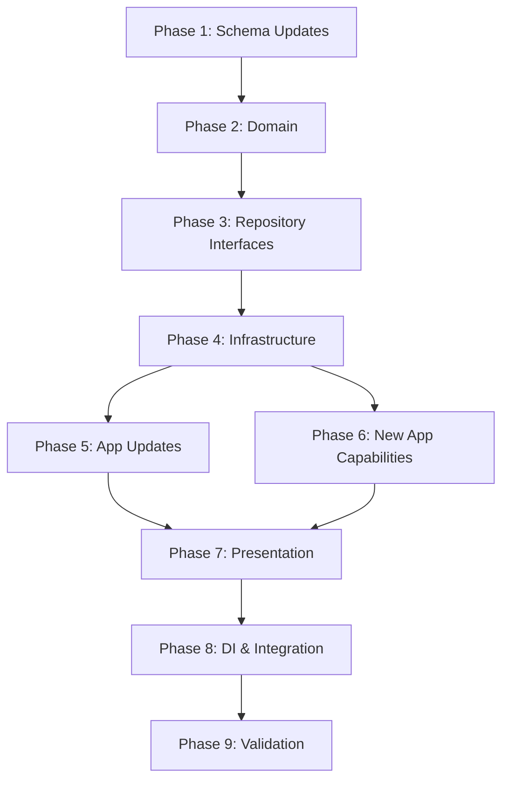

# Plan: Organization Verticals Expansion

**Created**: 2026-01-17  
**Spec**: [./02-create-organization/spec.md](./02-create-organization/spec.md), [./03-create-business-unit/spec.md](./03-create-business-unit/spec.md), [./06-get-organization/spec.md](./06-get-organization/spec.md), [./07-list-organizations/spec.md](./07-list-organizations/spec.md), [./08-get-business-unit/spec.md](./08-get-business-unit/spec.md), [./10-manage-organization-verticals/spec.md](./10-manage-organization-verticals/spec.md), [./11-manage-business-unit-verticals/spec.md](./11-manage-business-unit-verticals/spec.md), [./12-list-related-verticals/spec.md](./12-list-related-verticals/spec.md)  
**Design**: [./02-create-organization/design.md](./02-create-organization/design.md), [./03-create-business-unit/design.md](./03-create-business-unit/design.md), [./06-get-organization/design.md](./06-get-organization/design.md), [./07-list-organizations/design.md](./07-list-organizations/design.md), [./08-get-business-unit/design.md](./08-get-business-unit/design.md), [./10-manage-organization-verticals/design.md](./10-manage-organization-verticals/design.md), [./11-manage-business-unit-verticals/design.md](./11-manage-business-unit-verticals/design.md), [./12-list-related-verticals/design.md](./12-list-related-verticals/design.md)  
**Project**: [../../project.md](../../project.md)

---

<!--
  ╔═══════════════════════════════════════════════════════════════════════════╗
  ║  PLANO DE EXECUCAO - Define QUANDO fazer cada task                        ║
  ║                                                                           ║
  ║  Este documento contem APENAS tasks de execucao.                          ║
  ║  Decisoes de negocio -> spec.md                                           ║
  ║  Decisoes tecnicas -> design.md                                           ║
  ║  Padroes do projeto -> project.md                                         ║
  ║                                                                           ║
  ║  REGRAS PARA TASKS:                                                       ║
  ║  - Atomicas: uma task = uma unidade de trabalho                           ║
  ║  - Verificaveis: deve ser possivel validar se esta completa               ║
  ║  - Independentes: minimizar dependencias entre tasks                      ║
  ╚═══════════════════════════════════════════════════════════════════════════╝
-->

## Phase 1: Schema Updates

**Objetivo**: Preparar banco e Prisma para os novos vinculos de verticais

| ID | Task | Verificacao |
|----|------|-------------|
| T001 | Atualizar schema Prisma com `status_id` em `organization_verticals` | `npx prisma validate --schema src/modules/organization/infrastructure/database/prisma/schema.prisma` passa |
| T002 | Atualizar schema Prisma de `verticals` com `name`, `code`, `description` | `npx prisma validate --schema src/modules/organization/infrastructure/database/prisma/schema.prisma` passa |
| T003 | Adicionar tabela `business_unit_verticals` + indices unicos conforme design | `npx prisma validate --schema src/modules/organization/infrastructure/database/prisma/schema.prisma` passa |
| T004 | Criar migration com backfill de `status_id = ACTIVE` em `organization_verticals` existentes | Query de validacao retorna `status_id = ACTIVE` para registros anteriores |
| T005 | Gerar Prisma Client atualizado | `npx prisma generate --schema src/modules/organization/infrastructure/database/prisma/schema.prisma` executa sem erro |

**Checkpoint**: Schema atualizado e Prisma Client disponivel

---

## Phase 2: Domain Layer

**Objetivo**: Atualizar entidades, VOs e erros de dominio

| ID | Task | Verificacao |
|----|------|-------------|
| T006 | Criar/atualizar VO `VerticalLinkStatus` (ACTIVE/INACTIVE) | Teste unitario passa |
| T007 | Atualizar `OrganizationVerticalLink` para incluir `status` | Teste unitario passa |
| T008 | Criar `BusinessUnitVerticalLink` com status e regras basicas | Teste unitario passa |
| T009 | Criar entidade de leitura `Vertical` (id, name, code, description) | Teste unitario passa |
| T010 | Criar/atualizar erros de dominio para vinculos e limites de verticais | Teste unitario passa |

**Checkpoint**: Domain atualizado com vinculos, VOs e erros

---

## Phase 3: Repository Interfaces

**Objetivo**: Ajustar contratos de persistencia

| ID | Task | Verificacao |
|----|------|-------------|
| T011 | Atualizar `OrganizationVerticalRepository` (find/list/update/count) | TypeScript compila |
| T012 | Criar `BusinessUnitVerticalRepository` (find/list/update/count) | TypeScript compila |
| T013 | Atualizar `VerticalRepository` para `listByIds` | TypeScript compila |

**Checkpoint**: Interfaces de repositorio alinhadas ao design

---

## Phase 4: Infrastructure Layer

**Objetivo**: Implementar persistencia dos novos vinculos

| ID | Task | Verificacao |
|----|------|-------------|
| T014 | Atualizar `OrganizationVerticalMapper` com `status` | TypeScript compila |
| T015 | Criar `VerticalMapper` para leitura de verticais | TypeScript compila |
| T016 | Implementar `PrismaOrganizationVerticalRepository` (find/list/update/count) | Teste de integracao passa |
| T017 | Implementar `PrismaBusinessUnitVerticalRepository` + mapper | Teste de integracao passa |
| T018 | Implementar `PrismaVerticalRepository.listByIds` | Teste de integracao passa |

**Checkpoint**: Repositorios de vinculos funcionais

---

## Phase 5: Application Layer - Capabilities Atualizadas

**Objetivo**: Ajustar casos de uso existentes para verticais

| ID | Task | Verificacao |
|----|------|-------------|
| T019 | Atualizar DTOs de `CreateBusinessUnit` para receber `verticalIds` | TypeScript compila |
| T020 | Atualizar DTOs de `GetOrganization` e `ListOrganizations` para incluir dados de verticais | TypeScript compila |
| T021 | Atualizar DTOs de `GetBusinessUnit` para incluir verticais + status do vinculo | TypeScript compila |
| T022 | Atualizar `CreateOrganizationService` para criar vinculos com status ACTIVE | Teste unitario passa |
| T023 | Atualizar `CreateBusinessUnitService` para validar verticais da organizacao e criar `business_unit_verticals` | Teste unitario passa |
| T024 | Atualizar `GetOrganizationService` para retornar dados basicos de verticais | Teste unitario passa |
| T025 | Atualizar `ListOrganizationsService` para retornar dados basicos de verticais | Teste unitario passa |
| T026 | Atualizar `GetBusinessUnitService` para retornar verticais + status do vinculo | Teste unitario passa |

**Checkpoint**: Casos de uso atualizados e testados

---

## Phase 6: Application Layer - Novas Capabilities

**Objetivo**: Implementar novos casos de uso de vinculo e listagem

| ID | Task | Verificacao |
|----|------|-------------|
| T027 | Implementar `LinkOrganizationVerticalService` + DTOs | Teste unitario passa |
| T028 | Implementar `UnlinkOrganizationVerticalService` + DTOs | Teste unitario passa |
| T029 | Implementar `LinkBusinessUnitVerticalService` + DTOs | Teste unitario passa |
| T030 | Implementar `UnlinkBusinessUnitVerticalService` + DTOs | Teste unitario passa |
| T031 | Implementar `ListOrganizationVerticalsService` + DTOs | Teste unitario passa |
| T032 | Implementar `ListBusinessUnitVerticalsService` + DTOs | Teste unitario passa |

**Checkpoint**: Novas capabilities implementadas na aplicacao

---

## Phase 7: Presentation Layer

**Objetivo**: Expor endpoints e ajustes de contratos

| ID | Task | Verificacao |
|----|------|-------------|
| T033 | Atualizar POST `/organization/business-units` para receber `verticalIds` | Teste de integracao passa |
| T034 | Atualizar GET `/organization/organizations/:id` para incluir verticais | Teste de integracao passa |
| T035 | Atualizar GET `/organization/organizations` para incluir verticais | Teste de integracao passa |
| T036 | Atualizar GET `/organization/business-units/:id` para incluir verticais + status | Teste de integracao passa |
| T037 | Implementar POST `/organization/organizations/:organizationId/verticals` | Teste de integracao passa |
| T038 | Implementar DELETE `/organization/organizations/:organizationId/verticals/:verticalId` | Teste de integracao passa |
| T039 | Implementar POST `/organization/business-units/:businessUnitId/verticals` | Teste de integracao passa |
| T040 | Implementar DELETE `/organization/business-units/:businessUnitId/verticals/:verticalId` | Teste de integracao passa |
| T041 | Implementar GET `/organization/organizations/:organizationId/verticals` | Teste de integracao passa |
| T042 | Implementar GET `/organization/business-units/:businessUnitId/verticals` | Teste de integracao passa |

**Checkpoint**: Endpoints expostos e funcionando

---

## Phase 8: DI & Integration

**Objetivo**: Integrar novos repositorios e services

| ID | Task | Verificacao |
|----|------|-------------|
| T043 | Registrar repositorios de vinculos e `VerticalRepository` no DI | Bootstrap executa sem erro |
| T044 | Registrar novos services e controllers no DI | Bootstrap executa sem erro |
| T045 | Registrar novas rotas no modulo organization | Rotas aparecem na listagem |

**Checkpoint**: Componentes integrados e rotas publicadas

---

## Phase 9: Validation

**Objetivo**: Validar implementacao completa

| ID | Task | Verificacao |
|----|------|-------------|
| T046 | Rodar testes unitarios do contexto organization | `npm test -- tests/unit/organization` passa |
| T047 | Rodar testes de integracao do contexto organization | `npm test -- tests/integration/organization` passa |
| T048 | Validar todos os Acceptance Criteria das specs atualizadas | Todos os cenarios Given/When/Then funcionam |

**Checkpoint**: Modulo validado segundo a estrategia de testes

---

## Dependencies

---

## Execution Notes

- Manter tasks pequenas e com verificacao objetiva.
- Criar testes na mesma task de implementacao.
- Corrigir falhas antes de avancar para o proximo checkpoint.

---
