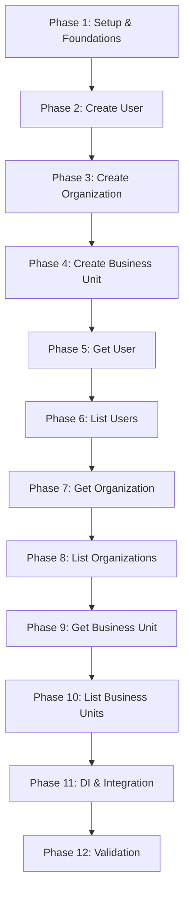

# Plan: Organization Module

**Created**: 2026-01-16  
**Spec**: [./organization.md](./organization.md)  
**Design**: [./01-create-user/design.md](./01-create-user/design.md), [./02-create-organization/design.md](./02-create-organization/design.md), [./03-create-business-unit/design.md](./03-create-business-unit/design.md), [./04-get-user/design.md](./04-get-user/design.md), [./05-list-users/design.md](./05-list-users/design.md), [./06-get-organization/design.md](./06-get-organization/design.md), [./07-list-organizations/design.md](./07-list-organizations/design.md), [./08-get-business-unit/design.md](./08-get-business-unit/design.md), [./09-list-business-units/design.md](./09-list-business-units/design.md)  
**Project**: [../../project.md](../../project.md)

---

<!--
  ╔═══════════════════════════════════════════════════════════════════════════╗
  ║  PLANO DE EXECUCAO - Define QUANDO fazer cada task                        ║
  ║                                                                           ║
  ║  Este documento contem APENAS tasks de execucao.                          ║
  ║  Decisoes de negocio -> spec.md                                           ║
  ║  Decisoes tecnicas -> design.md                                           ║
  ║  Padroes do projeto -> project.md                                         ║
  ║                                                                           ║
  ║  REGRAS PARA TASKS:                                                       ║
  ║  - Atomicas: uma task = uma unidade de trabalho                           ║
  ║  - Verificaveis: deve ser possivel validar se esta completa               ║
  ║  - Independentes: minimizar dependencias entre tasks                      ║
  ╚═══════════════════════════════════════════════════════════════════════════╝
-->

## Phase 1: Setup & Foundations

**Objetivo**: Preparar contexto organization (estrutura, Prisma e testes)

| ID | Task | Verificacao |
|----|------|-------------|
| T001 | Criar estrutura base do modulo `src/modules/organization` (domain/application/presentation/infrastructure/di/database) + exports `index.ts` | `npm run build` executa sem erro |
| T002 | Adicionar setup Prisma do contexto organization (schema, datasource, env `DATABASE_URL_ORGANIZATION`, client factory, env example) | `npx prisma validate --schema src/modules/organization/infrastructure/database/prisma/schema.prisma` passa |
| T003 | Preparar scaffolding de testes do contexto organization (unit/integration + helpers Prisma/factories) | `npm test -- --listTests` lista os novos caminhos |

**Checkpoint**: Estrutura base, Prisma e scaffolding de testes prontos

---

## Phase 2: Capability 01 - Create User

**Objetivo**: Criar usuario e vinculo opcional com organizacao

| ID | Task | Verificacao |
|----|------|-------------|
| T004 | Criar migration e modelos Prisma para `users`, `user_organization_links` e `organizations` (modelo minimo para validacao de documento) | `npx prisma migrate dev --schema src/modules/organization/infrastructure/database/prisma/schema.prisma` executa sem erro |
| T005 | Implementar `User`, `UserOrganizationLink`, VOs (`UserId`, `DocumentType`, `DocumentNumber`, `EmailAddress`, `PhoneNumber`, `UserStatus`) e erros de dominio com testes unitarios | Testes unitarios passam |
| T006 | Definir interfaces `UserRepository`, `UserOrganizationLinkRepository`, `OrganizationRepository` conforme design | TypeScript compila |
| T007 | Implementar `CreateUserService` + DTOs com testes unitarios (unicidade, organizacao opcional, status inicial) | Testes unitarios passam |
| T008 | Implementar repos Prisma + mappers e testes de integracao da capability Create User | Teste de integracao passa |
| T009 | Implementar `UserController` e rota POST `/organization/users` com mapeamento de erros + teste unitario | Teste unitario passa |

**Checkpoint**: Create User funcional e testado

---

## Phase 3: Capability 02 - Create Organization

**Objetivo**: Criar organizacao, vincular owner e verticais

| ID | Task | Verificacao |
|----|------|-------------|
| T010 | Criar migration para completar `organizations` (trade_name, legal_name, document_type, status_id, owner_user_id se necessario) e adicionar `organization_verticals` + `verticals` para validacao | `npx prisma migrate dev --schema src/modules/organization/infrastructure/database/prisma/schema.prisma` executa sem erro |
| T011 | Implementar `Organization`, `OrganizationVerticalLink`, VOs (`OrganizationId`, `VerticalId`, `OrganizationStatus`) e erros de dominio com testes unitarios | Testes unitarios passam |
| T012 | Definir/atualizar interfaces `OrganizationRepository`, `UserRepository`, `UserOrganizationLinkRepository`, `OrganizationVerticalRepository`, `VerticalRepository` | TypeScript compila |
| T013 | Implementar `CreateOrganizationService` + DTOs com testes unitarios (owner, unicidade, verticais, transacao) | Testes unitarios passam |
| T014 | Implementar repos Prisma + mappers e testes de integracao da capability Create Organization | Teste de integracao passa |
| T015 | Implementar `OrganizationController` e rota POST `/organization/organizations` com mapeamento de erros + teste unitario | Teste unitario passa |

**Checkpoint**: Create Organization funcional e testado

---

## Phase 4: Capability 03 - Create Business Unit

**Objetivo**: Criar unidade de negocio com endereco e atualizar status da organizacao

| ID | Task | Verificacao |
|----|------|-------------|
| T016 | Criar migration para `business_units` e `business_unit_addresses` (e ajustes em `organizations` para owner/status se faltarem) | `npx prisma migrate dev --schema src/modules/organization/infrastructure/database/prisma/schema.prisma` executa sem erro |
| T017 | Implementar `BusinessUnit`, `BusinessUnitAddress`, `BusinessUnitStatus` e erros de dominio com testes unitarios | Testes unitarios passam |
| T018 | Definir/atualizar interfaces `BusinessUnitRepository` e `OrganizationRepository` (find/update/count) | TypeScript compila |
| T019 | Implementar `CreateBusinessUnitService` + DTOs com testes unitarios (owner, validacao BR, status) | Testes unitarios passam |
| T020 | Implementar repos Prisma + mappers e testes de integracao da capability Create Business Unit | Teste de integracao passa |
| T021 | Implementar `BusinessUnitController` e rota POST `/organization/business-units` com mapeamento de erros + teste unitario | Teste unitario passa |

**Checkpoint**: Create Business Unit funcional e testado

---

## Phase 5: Capability 04 - Get User

**Objetivo**: Consultar usuario por id com vinculo opcional

| ID | Task | Verificacao |
|----|------|-------------|
| T022 | Implementar `GetUserService` + DTOs com testes unitarios (validacao de id e politica de acesso) | Testes unitarios passam |
| T023 | Implementar metodos Prisma de consulta (`findById`, `findByUserId`) e teste de integracao da capability Get User | Teste de integracao passa |
| T024 | Implementar `AccessControlMiddleware` (ou adaptar existente) e rota GET `/organization/users/:id` no `UserController` com teste unitario | Teste unitario passa |

**Checkpoint**: Get User funcional e testado

---

## Phase 6: Capability 05 - List Users

**Objetivo**: Listar usuarios com paginacao e vinculo em lote

| ID | Task | Verificacao |
|----|------|-------------|
| T025 | Implementar `ListUsersService` + DTOs com testes unitarios (paginacao/ordenacao) | Testes unitarios passam |
| T026 | Implementar metodos Prisma `list`, `countAll`, `listByUserIds` e teste de integracao da capability List Users | Teste de integracao passa |
| T027 | Implementar rota GET `/organization/users` no `UserController` com teste unitario | Teste unitario passa |

**Checkpoint**: List Users funcional e testado

---

## Phase 7: Capability 06 - Get Organization

**Objetivo**: Consultar organizacao com includes condicionais

| ID | Task | Verificacao |
|----|------|-------------|
| T028 | Implementar `GetOrganizationService` + DTOs com testes unitarios (include, validacao de id) | Testes unitarios passam |
| T029 | Implementar metodos Prisma para organizacao, verticais, unidades e usuarios + teste de integracao da capability Get Organization | Teste de integracao passa |
| T030 | Implementar rota GET `/organization/organizations/:id` no `OrganizationController` com teste unitario | Teste unitario passa |

**Checkpoint**: Get Organization funcional e testado

---

## Phase 8: Capability 07 - List Organizations

**Objetivo**: Listar organizacoes com paginacao e verticais

| ID | Task | Verificacao |
|----|------|-------------|
| T031 | Implementar `ListOrganizationsService` + DTOs com testes unitarios (paginacao/ordenacao) | Testes unitarios passam |
| T032 | Implementar metodos Prisma `list`, `countAll`, `listByOrganizationIds` e teste de integracao da capability List Organizations | Teste de integracao passa |
| T033 | Implementar rota GET `/organization/organizations` no `OrganizationController` com teste unitario | Teste unitario passa |

**Checkpoint**: List Organizations funcional e testado

---

## Phase 9: Capability 08 - Get Business Unit

**Objetivo**: Consultar unidade de negocio por id

| ID | Task | Verificacao |
|----|------|-------------|
| T034 | Implementar `GetBusinessUnitService` + DTOs com testes unitarios (validacao de id e politica de acesso) | Testes unitarios passam |
| T035 | Implementar metodo Prisma `findById` com endereco + teste de integracao da capability Get Business Unit | Teste de integracao passa |
| T036 | Implementar rota GET `/organization/business-units/:id` no `BusinessUnitController` (reuso do middleware de acesso) com teste unitario | Teste unitario passa |

**Checkpoint**: Get Business Unit funcional e testado

---

## Phase 10: Capability 09 - List Business Units

**Objetivo**: Listar unidades de negocio com paginacao

| ID | Task | Verificacao |
|----|------|-------------|
| T037 | Implementar `ListBusinessUnitsService` + DTOs com testes unitarios (paginacao/ordenacao) | Testes unitarios passam |
| T038 | Implementar metodos Prisma `list`, `countAll` e teste de integracao da capability List Business Units | Teste de integracao passa |
| T039 | Implementar rota GET `/organization/business-units` no `BusinessUnitController` com teste unitario | Teste unitario passa |

**Checkpoint**: List Business Units funcional e testado

---

## Phase 11: DI & Integration

**Objetivo**: Integrar o modulo organization na aplicacao

| ID | Task | Verificacao |
|----|------|-------------|
| T040 | Consolidar DI do modulo (repos/services/controllers) e registrar rotas no bootstrap | Aplicacao sobe e rotas do modulo aparecem |

**Checkpoint**: Modulo integrado e com rotas expostas

---

## Phase 12: Validation

**Objetivo**: Validar o modulo completo com a estrategia de testes

| ID | Task | Verificacao |
|----|------|-------------|
| T041 | Executar testes unitarios do contexto organization | `npm test -- tests/unit/organization` passa |
| T042 | Executar testes de integracao das capabilities do modulo | `npm test -- tests/integration/organization` passa |

**Checkpoint**: Modulo validado segundo a estrategia de testes

---

## Dependencies

---

## Execution Notes

- Cada task deve ser commitada separadamente (ou em grupos logicos pequenos)
- Se uma task falhar, resolver antes de prosseguir
- Checkpoints sao pontos de validacao - nao avancar se checkpoint nao passou
- Testes devem ser criados junto com a implementacao (mesma task)
