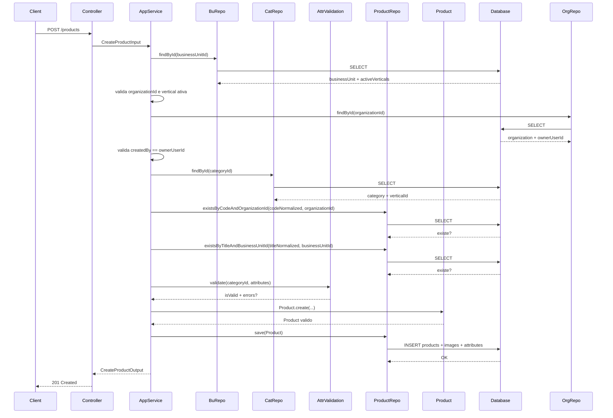
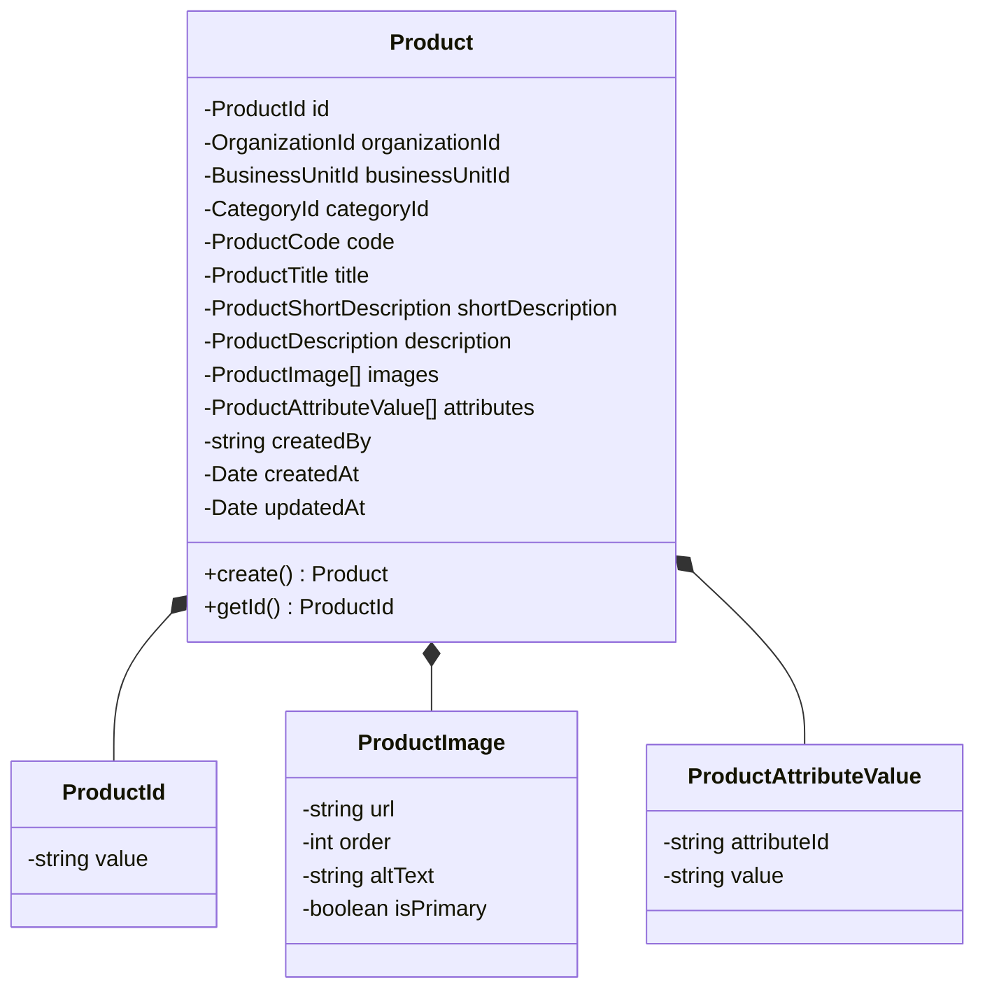
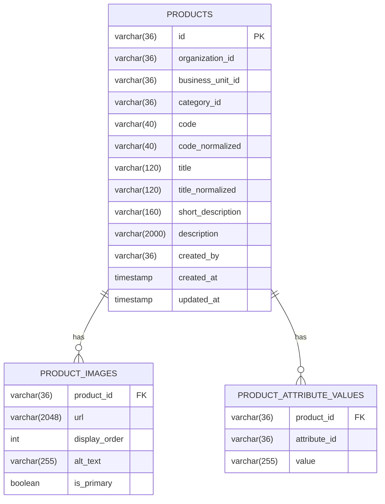
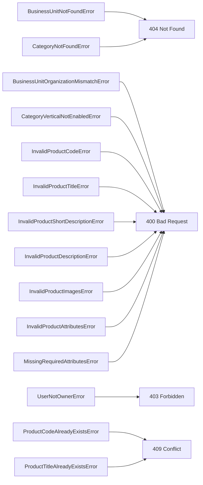

# Design: Create Product

**Created**: 2026-01-11  
**Spec**: [./spec.md](./spec.md)  
**Project**: [../../../project.md](../../../project.md)

---

## Overview

A capability Create Product cria a identidade comercial do produto com imagens e atributos semanticos.
O Application Service valida integridade entre organizacao, unidade, categoria e vertical ativa da unidade, garante unicidade de code/title, valida owner da organizacao, valida imagens e atributos, e persiste o produto em transacao.
A complexidade e moderada pela orquestracao entre modulos e pelas regras de validacao na criacao.

---

## Component Map

### Domain Layer

| Tipo | Nome | Responsabilidade |
|------|------|------------------|
| Entity | `Product` | Representa um produto com identidade comercial |
| Value Object | `ProductId` | Identificador unico do produto |
| Value Object | `OrganizationId` | Identificador da organizacao |
| Value Object | `BusinessUnitId` | Identificador da unidade de negocio |
| Value Object | `CategoryId` | Identificador da categoria |
| Value Object | `ProductCode` | Codigo validado e normalizado |
| Value Object | `ProductTitle` | Titulo validado |
| Value Object | `ProductShortDescription` | Subtitulo validado |
| Value Object | `ProductDescription` | Descricao validada |
| Value Object | `ProductImage` | Imagem do produto (url, order, isPrimary) |
| Value Object | `ProductAttributeValue` | Valor de atributo informado |
| Repository Interface | `ProductRepository` | Persistencia e consultas de produto |
| Repository Interface | `BusinessUnitRepository` | Consulta unidade e verticais ativas (port) |
| Repository Interface | `CategoryRepository` | Consulta categoria e vertical (port) |
| Repository Interface | `AttributeValueValidationPort` | Valida atributos no modulo attributes (port) |
| Repository Interface | `OrganizationRepository` | Consulta organizacao e owner (port) |

### Application Layer

| Tipo | Nome | Responsabilidade |
|------|------|------------------|
| App Service | `CreateProductService` | Orquestra a criacao do produto |
| Input DTO | `CreateProductInput` | Dados de entrada para criacao |
| Output DTO | `CreateProductOutput` | Dados retornados apos criacao |

### Infrastructure Layer

| Tipo | Nome | Responsabilidade |
|------|------|------------------|
| Repository Impl | `PrismaProductRepository` | Implementa `ProductRepository` |
| Port Adapter | `OrganizationBusinessUnitAdapter` | Implementa `BusinessUnitRepository` |
| Port Adapter | `OrganizationOwnerAdapter` | Implementa `OrganizationRepository` |
| Port Adapter | `AttributesCategoryAdapter` | Implementa `CategoryRepository` |
| Port Adapter | `AttributeValueValidationAdapter` | Implementa `AttributeValueValidationPort` |
| Mapper | `ProductMapper` | Converte Domain <-> Prisma |

### Presentation Layer

| Tipo | Nome | Responsabilidade |
|------|------|------------------|
| Controller | `ProductController` | Exposicao HTTP do caso de uso |

---

## Dependency Graph

```mermaid
graph TD
    subgraph Presentation
        CTRL[ProductController]
    end

    subgraph Application
        SVC[CreateProductService]
        DTO_IN[CreateProductInput]
        DTO_OUT[CreateProductOutput]
    end

    subgraph Domain
        PROD[Product]
        VO_ID[ProductId]
        VO_ORG[OrganizationId]
        VO_BU[BusinessUnitId]
        VO_CAT[CategoryId]
        VO_CODE[ProductCode]
        VO_TITLE[ProductTitle]
        VO_SHORT[ProductShortDescription]
        VO_DESC[ProductDescription]
        IMG[ProductImage]
        ATTR[ProductAttributeValue]
        PROD_REPO[ProductRepository]
        BU_REPO[BusinessUnitRepository]
        CAT_REPO[CategoryRepository]
        ATTR_PORT[AttributeValueValidationPort]
        ORG_REPO[OrganizationRepository]
    end

    subgraph Infrastructure
        PROD_REPO_IMPL[PrismaProductRepository]
        BU_ADAPTER[OrganizationBusinessUnitAdapter]
        CAT_ADAPTER[AttributesCategoryAdapter]
        ATTR_ADAPTER[AttributeValueValidationAdapter]
        ORG_ADAPTER[OrganizationOwnerAdapter]
        PROD_MAPPER[ProductMapper]
        PRISMA[Prisma Client]
    end

    CTRL --> SVC
    CTRL --> DTO_IN
    SVC --> DTO_OUT
    SVC --> PROD
    SVC --> PROD_REPO
    SVC --> BU_REPO
    SVC --> CAT_REPO
    SVC --> ATTR_PORT
    SVC --> ORG_REPO
    PROD --> VO_ID
    PROD --> VO_ORG
    PROD --> VO_BU
    PROD --> VO_CAT
    PROD --> VO_CODE
    PROD --> VO_TITLE
    PROD --> VO_SHORT
    PROD --> VO_DESC
    PROD --> IMG
    PROD --> ATTR
    PROD_REPO_IMPL -.->|implements| PROD_REPO
    BU_ADAPTER -.->|implements| BU_REPO
    CAT_ADAPTER -.->|implements| CAT_REPO
    ATTR_ADAPTER -.->|implements| ATTR_PORT
    ORG_ADAPTER -.->|implements| ORG_REPO
    PROD_REPO_IMPL --> PROD_MAPPER
    PROD_REPO_IMPL --> PRISMA
```

---

## Data Flow

### Fluxo: Criar Product

**Transformacoes de dados:**

| Etapa | De | Para |
|-------|----|----- |
| Controller -> AppService | JSON body | CreateProductInput |
| AppService -> Domain | DTO | Product |
| Repository -> DB | Product | Prisma Models |

---

## Entity Structure

### Product

**Propriedades:**

| Propriedade | Tipo | Mutavel? | Regras |
|-------------|------|----------|--------|
| `id` | ProductId | Nao | Gerado internamente |
| `organizationId` | OrganizationId | Nao | Obrigatorio |
| `businessUnitId` | BusinessUnitId | Nao | Obrigatorio, deve pertencer a organizacao |
| `categoryId` | CategoryId | Nao | Obrigatorio, deve existir no modulo attributes |
| `code` | ProductCode | Nao | 3-40, sem espacos, letras/numeros/_/- |
| `title` | ProductTitle | Sim | 3-120, unico por unidade (case-insensitive) |
| `shortDescription` | ProductShortDescription | Sim | 10-160 |
| `description` | ProductDescription | Sim | 10-2000 |
| `images` | ProductImage[] | Sim | 1 principal, max 4, order 1-4 unico |
| `attributes` | ProductAttributeValue[] | Sim | Validados pela categoria, obrigatorios quando exigidos |
| `createdBy` | string | Nao | Obrigatorio |
| `createdAt` | Date | Nao | Automatico |
| `updatedAt` | Date | Sim | Atualizado em mudancas futuras |

**Comportamentos:**

| Metodo | Regras |
|--------|--------|
| `create` | Valida code/title/descriptions, imagens e atributos obrigatorios |

---

## Repository Operations

| Operacao | Descricao | Usada por |
|----------|-----------|-----------|
| `ProductRepository.existsByCodeAndOrganizationId(code, organizationId)` | Verifica duplicidade de code | CreateProductService |
| `ProductRepository.existsByTitleAndBusinessUnitId(title, businessUnitId)` | Verifica duplicidade de title | CreateProductService |
| `ProductRepository.save(product)` | Persiste produto e relacionamentos | CreateProductService |
| `BusinessUnitRepository.findById(id)` | Carrega unidade e verticais ativas | CreateProductService |
| `CategoryRepository.findById(id)` | Carrega categoria e vertical | CreateProductService |
| `AttributeValueValidationPort.validate(categoryId, attributes)` | Valida valores por categoria | CreateProductService |
| `OrganizationRepository.findById(id)` | Carrega organizacao e owner | CreateProductService |

---

## Database Model

### Tabela: `products`

| Coluna | Tipo | Constraints |
|--------|------|-------------|
| `id` | VARCHAR(36) | PK |
| `organization_id` | VARCHAR(36) | NOT NULL |
| `business_unit_id` | VARCHAR(36) | NOT NULL |
| `category_id` | VARCHAR(36) | NOT NULL |
| `code` | VARCHAR(40) | NOT NULL |
| `code_normalized` | VARCHAR(40) | NOT NULL, UNIQUE(org + code_normalized) |
| `title` | VARCHAR(120) | NOT NULL |
| `title_normalized` | VARCHAR(120) | NOT NULL, UNIQUE(bu + title_normalized) |
| `short_description` | VARCHAR(160) | NOT NULL |
| `description` | VARCHAR(2000) | NOT NULL |
| `created_by` | VARCHAR(36) | NOT NULL |
| `created_at` | TIMESTAMP | NOT NULL, DEFAULT now() |
| `updated_at` | TIMESTAMP | NULL |

### Tabela: `product_images`

| Coluna | Tipo | Constraints |
|--------|------|-------------|
| `product_id` | VARCHAR(36) | FK(products.id), NOT NULL |
| `url` | VARCHAR(2048) | NOT NULL |
| `display_order` | INT | NOT NULL, UNIQUE(product_id, display_order), 1-4 |
| `alt_text` | VARCHAR(255) | NULL |
| `is_primary` | BOOLEAN | NOT NULL |

### Tabela: `product_attribute_values`

| Coluna | Tipo | Constraints |
|--------|------|-------------|
| `product_id` | VARCHAR(36) | FK(products.id), NOT NULL |
| `attribute_id` | VARCHAR(36) | NOT NULL |
| `value` | VARCHAR(255) | NOT NULL |

Notas:
- Sem FK para organizacao, unidade e categoria (contextos externos).

---

## API Endpoints

| Metodo | Path | Operacao | Sucesso | Erros |
|--------|------|----------|---------|-------|
| POST | `/products` | Criar produto | 201 | 400, 404, 409 |

---

## Error Handling

| Erro de Dominio | Quando Ocorre | HTTP Status | Codigo |
|-----------------|---------------|-------------|--------|
| `BusinessUnitNotFoundError` | businessUnitId inexistente | 404 | `BUSINESS_UNIT_NOT_FOUND` |
| `CategoryNotFoundError` | categoryId inexistente | 404 | `CATEGORY_NOT_FOUND` |
| `BusinessUnitOrganizationMismatchError` | unidade nao pertence a organizacao | 400 | `BUSINESS_UNIT_ORGANIZATION_MISMATCH` |
| `CategoryVerticalNotEnabledError` | categoria fora da vertical da unidade | 400 | `CATEGORY_VERTICAL_NOT_ENABLED` |
| `UserNotOwnerError` | createdBy nao e owner da organizacao | 403 | `USER_NOT_OWNER` |
| `ProductCodeAlreadyExistsError` | code ja cadastrado na organizacao | 409 | `PRODUCT_CODE_ALREADY_EXISTS` |
| `ProductTitleAlreadyExistsError` | title ja cadastrado na unidade | 409 | `PRODUCT_TITLE_ALREADY_EXISTS` |
| `InvalidProductCodeError` | formato de code invalido | 400 | `INVALID_PRODUCT_CODE` |
| `InvalidProductTitleError` | title fora do limite | 400 | `INVALID_PRODUCT_TITLE` |
| `InvalidProductShortDescriptionError` | shortDescription fora do limite | 400 | `INVALID_PRODUCT_SHORT_DESCRIPTION` |
| `InvalidProductDescriptionError` | description fora do limite | 400 | `INVALID_PRODUCT_DESCRIPTION` |
| `InvalidProductImagesError` | imagens invalidas (primary/order/quantidade) | 400 | `INVALID_PRODUCT_IMAGES` |
| `InvalidProductAttributesError` | atributos com valores invalidos | 400 | `INVALID_PRODUCT_ATTRIBUTES` |
| `MissingRequiredAttributesError` | atributos obrigatorios ausentes | 400 | `MISSING_REQUIRED_ATTRIBUTES` |

---

## Technical Decisions

### Decisao 1: Unicidade case-insensitive com colunas normalizadas

**Contexto**: `code` e `title` devem ser unicos por escopo com comparacao case-insensitive.

**Decisao**: Persistir `code_normalized` e `title_normalized` em lowercase e criar indices unicos por escopo.

**Justificativa**: Evita comparacoes case-insensitive no banco e garante consistencia.

---

### Decisao 2: Validacao de atributos via port do modulo attributes

**Contexto**: Os valores devem ser validados conforme configuracao da categoria.

**Decisao**: O `CreateProductService` chama `AttributeValueValidationPort` antes de criar o produto.

**Justificativa**: Centraliza regras semanticas no modulo de atributos e reduz duplicacao.

---

### Decisao 3: Persistencia atomica de produto, imagens e atributos

**Contexto**: A criacao nao pode resultar em produto sem imagens ou atributos.

**Decisao**: Salvar `products`, `product_images` e `product_attribute_values` na mesma transacao.

**Justificativa**: Garante consistencia e evita estados parciais.

---

### Decisao 4: Validar owner da organizacao

**Contexto**: Apenas o owner pode criar produtos no escopo atual.

**Decisao**: Consultar a organizacao e comparar `createdBy` com `ownerUserId`.

**Justificativa**: Reaproveita a fonte de ownership do modulo organization sem exigir vinculos adicionais.

---

## Implementation Notes

- Normalizar `code` e `title` para lowercase antes das verificacoes de duplicidade.
- Garantir exatamente uma imagem `is_primary = true` e no maximo 4 imagens.
- Validar `display_order` entre 1 e 4 e sem duplicidade por produto.
- Rejeitar criacao quando a unidade nao pertence a organizacao informada.
- Rejeitar criacao quando o createdBy nao for owner da organizacao.
- Usar o retorno de `AttributeValueValidationPort` para mapear erros de atributos obrigatorios e invalidos.
- `createdAt` deve ser gerado no momento da criacao e `updatedAt` inicia como NULL.

---
