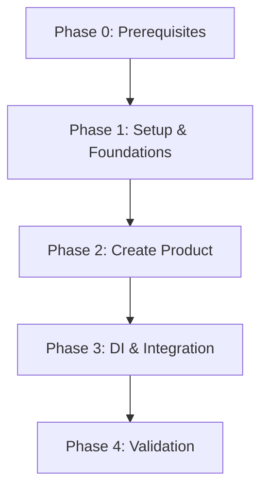

# Plan: Products Module

**Created**: 2026-01-17  
**Spec**: [./products.md](./products.md)  
**Design**: [./01-create-product/design.md](./01-create-product/design.md)  
**Project**: [../../project.md](../../project.md)

---

<!--
  ======================================================================
  PLANO DE EXECUCAO - Define QUANDO fazer cada task

  Este documento contem APENAS tasks de execucao.
  Decisoes de negocio -> spec.md
  Decisoes tecnicas -> design.md
  Padroes do projeto -> project.md

  REGRAS PARA TASKS:
  - Atomicas: uma task = uma unidade de trabalho
  - Verificaveis: deve ser possivel validar se esta completa
  - Independentes: minimizar dependencias entre tasks
  ======================================================================
-->

## Phase 0: Prerequisites

**Objetivo**: Garantir prerequisitos da plataforma (erros e bootstrap)

| ID | Task | Verificacao |
|----|------|-------------|
| T001 | Garantir base de erros (BaseAppError/DomainError/ApplicationError) e catalogo HTTP central; se inexistentes, criar base | Catalogo central existe e `npm run build` executa sem erro |
| T002 | Garantir bootstrap Fastify base para registro de rotas por modulo; se inexistente, criar base | Bootstrap existe e `npm run build` executa sem erro |

**Checkpoint**: Prerequisitos de plataforma prontos

---

## Phase 1: Setup & Foundations

**Objetivo**: Preparar contexto products (estrutura, Prisma e testes)

| ID | Task | Verificacao |
|----|------|-------------|
| T003 | Criar estrutura base do modulo `src/modules/products` (domain/application/presentation/infrastructure/di/database) + exports `index.ts` | `npm run build` executa sem erro |
| T004 | Adicionar setup Prisma do contexto products (schema, datasource, env `DATABASE_URL_PRODUCTS`, Prisma Client, env example) | `npx prisma validate --schema src/modules/products/infrastructure/database/prisma/schema.prisma` passa |
| T005 | Configurar infra local do DB products (docker-compose + variavel `DATABASE_URL_PRODUCTS` na app) | `docker compose config -q` executa sem erro |
| T006 | Preparar scaffolding de testes do contexto products (unit/integration + helpers Prisma/factories) | `npm test -- --listTests` lista os novos caminhos |

**Checkpoint**: Estrutura base, Prisma e scaffolding de testes prontos

---

## Phase 2: Capability 01 - Create Product

**Objetivo**: Criar produto com validacoes, persistencia e ports externos

| ID | Task | Verificacao |
|----|------|-------------|
| T007 | Criar migration e modelos Prisma para `products`, `product_images`, `product_attribute_values` (campos normalizados e indices unicos) | `npx prisma migrate dev --schema src/modules/products/infrastructure/database/prisma/schema.prisma` executa sem erro |
| T008 | Implementar VOs (`ProductId`, `OrganizationId`, `BusinessUnitId`, `CategoryId`, `ProductCode`, `ProductTitle`, `ProductShortDescription`, `ProductDescription`) e erros de dominio com testes unitarios de regras de formato/limites | Testes unitarios passam |
| T009 | Implementar `Product` + VOs (`ProductImage`, `ProductAttributeValue`) com testes unitarios (imagem principal, max 4, order unico, atributos obrigatorios) | Testes unitarios passam |
| T010 | Definir interfaces `ProductService`, `BusinessUnitRepository`, `CategoryRepository`, `AttributeValueValidationPort` e tipos de retorno conforme design | TypeScript compila |
| T011 | Implementar `CreateProductService` + DTOs com testes unitarios (unicidade code/title, validacao BU/categoria/vertical, validacao de atributos) | Testes unitarios passam |
| T012 | Implementar `ProductMapper` e `PrismaProductRepository` (save transacional + existsByCode/Title) e testes de integracao da capability Create Product | Teste de integracao passa |
| T013 | Implementar adapters `OrganizationBusinessUnitAdapter`, `AttributesCategoryAdapter`, `AttributeValueValidationAdapter` com testes unitarios | Testes unitarios passam |
| T014 | Atualizar catalogo HTTP central com mapeamento dos erros do modulo products (400/404/409) | Catalogo central contem os codigos do modulo products |
| T015 | Implementar `ProductController` e rota POST `/products` com mapeamento de erros (400/404/409) | Teste unitario passa |

**Checkpoint**: Create Product funcional e testado

---

## Phase 3: DI & Integration

**Objetivo**: Integrar o modulo products na aplicacao

| ID | Task | Verificacao |
|----|------|-------------|
| T016 | Consolidar DI do modulo (repos/adapters/services/controllers) e registrar rotas no bootstrap (criar base se necessario) | Aplicacao sobe e rotas do modulo aparecem |

**Checkpoint**: Modulo integrado e com rotas expostas

---

## Phase 4: Validation

**Objetivo**: Validar o modulo completo com a estrategia de testes

| ID | Task | Verificacao |
|----|------|-------------|
| T017 | Executar testes unitarios do contexto products | `npm test -- tests/unit/products` passa |
| T018 | Executar testes de integracao das capabilities do modulo | `npm test -- tests/integration/products` passa |

**Checkpoint**: Modulo validado segundo a estrategia de testes

---

## Dependencies

---

## Execution Notes

- Seguir a estrategia de testes em `specs/testing-strategy.md` (integration tests por capability sem HTTP).
- Cada task deve incluir os testes correspondentes na mesma entrega.
- As camadas devem respeitar as regras de import do `specs/project.md`.
