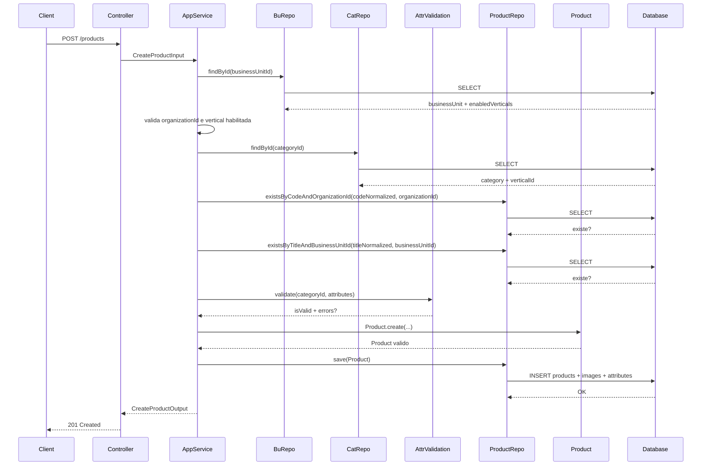
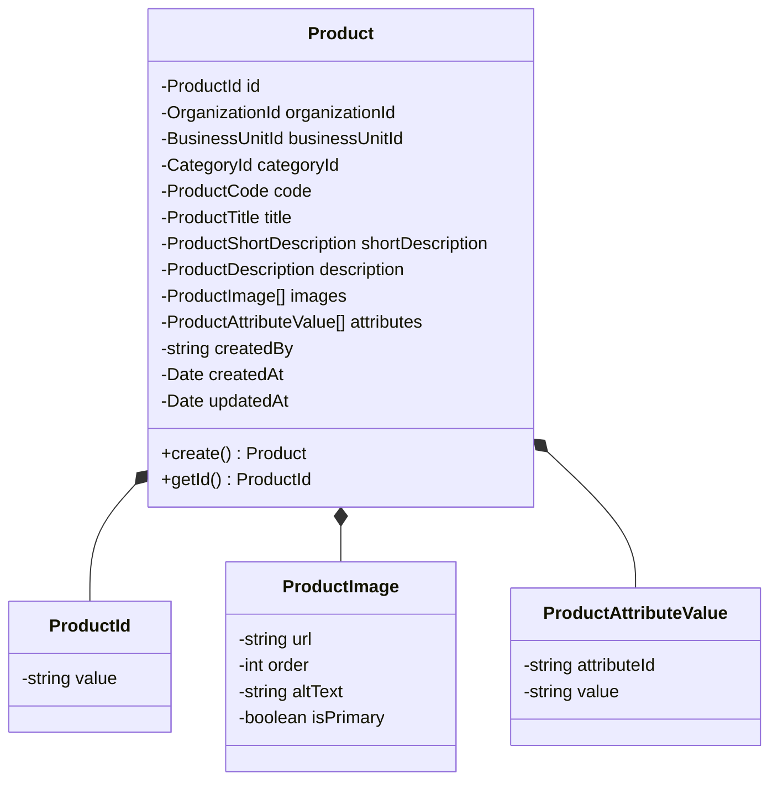
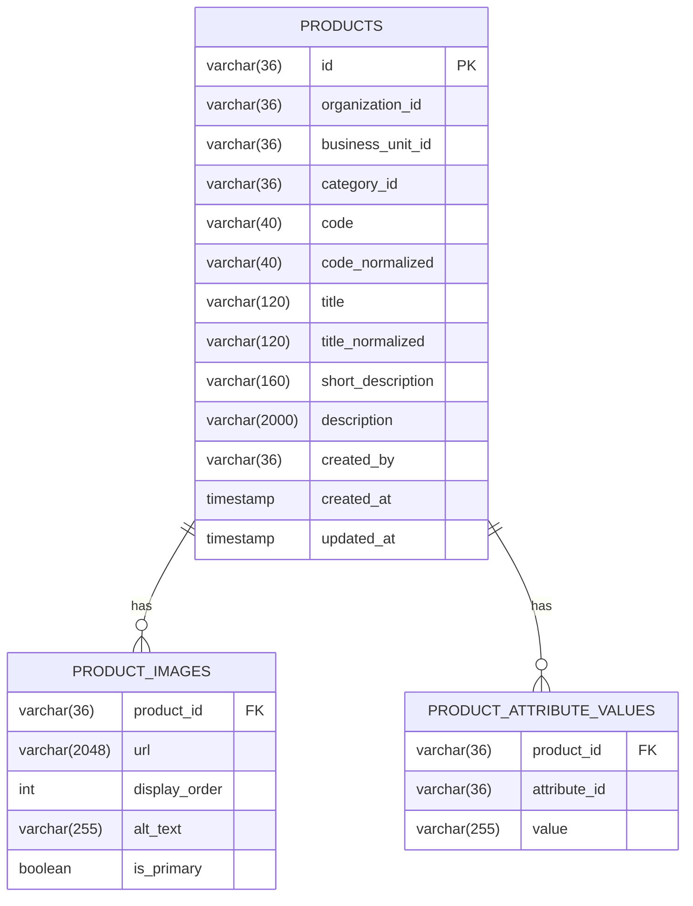
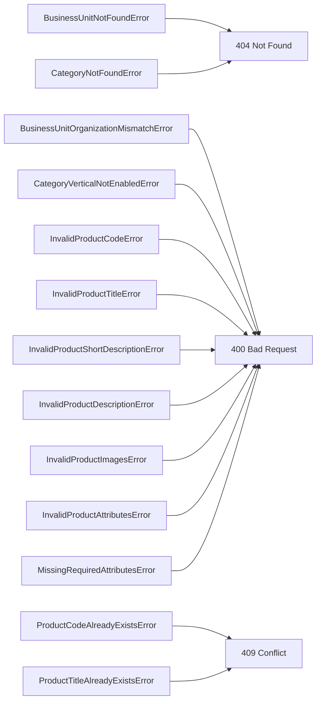

# products

## 01-create-product

### design
# Design: Create Product

**Created**: 2026-01-11  
**Spec**: [./spec.md](./spec.md)  
**Project**: [../../../project.md](../../../project.md)

---

## Overview

A capability Create Product cria a identidade comercial do produto com imagens e atributos semanticos.
O Application Service valida integridade entre organizacao, unidade, categoria e vertical, garante unicidade de code/title, valida imagens e atributos, e persiste o produto em transacao.
A complexidade e moderada pela orquestracao entre modulos e pelas regras de validacao na criacao.

---

## Component Map

### Domain Layer

| Tipo | Nome | Responsabilidade |
|------|------|------------------|
| Entity | `Product` | Representa um produto com identidade comercial |
| Value Object | `ProductId` | Identificador unico do produto |
| Value Object | `OrganizationId` | Identificador da organizacao |
| Value Object | `BusinessUnitId` | Identificador da unidade de negocio |
| Value Object | `CategoryId` | Identificador da categoria |
| Value Object | `ProductCode` | Codigo validado e normalizado |
| Value Object | `ProductTitle` | Titulo validado |
| Value Object | `ProductShortDescription` | Subtitulo validado |
| Value Object | `ProductDescription` | Descricao validada |
| Value Object | `ProductImage` | Imagem do produto (url, order, isPrimary) |
| Value Object | `ProductAttributeValue` | Valor de atributo informado |
| Repository Interface | `ProductService` | Persistencia e consultas de produto |
| Repository Interface | `BusinessUnitRepository` | Consulta unidade e verticais habilitadas (port) |
| Repository Interface | `CategoryRepository` | Consulta categoria e vertical (port) |
| Repository Interface | `AttributeValueValidationPort` | Valida atributos no modulo attributes (port) |

### Application Layer

| Tipo | Nome | Responsabilidade |
|------|------|------------------|
| App Service | `CreateProductService` | Orquestra a criacao do produto |
| Input DTO | `CreateProductInput` | Dados de entrada para criacao |
| Output DTO | `CreateProductOutput` | Dados retornados apos criacao |

### Infrastructure Layer

| Tipo | Nome | Responsabilidade |
|------|------|------------------|
| Repository Impl | `PrismaProductRepository` | Implementa `ProductService` |
| Port Adapter | `OrganizationBusinessUnitAdapter` | Implementa `BusinessUnitRepository` |
| Port Adapter | `AttributesCategoryAdapter` | Implementa `CategoryRepository` |
| Port Adapter | `AttributeValueValidationAdapter` | Implementa `AttributeValueValidationPort` |
| Mapper | `ProductMapper` | Converte Domain <-> Prisma |

### Presentation Layer

| Tipo | Nome | Responsabilidade |
|------|------|------------------|
| Controller | `ProductController` | Exposicao HTTP do caso de uso |

---

## Dependency Graph

```mermaid
graph TD
    subgraph Presentation
        CTRL[ProductController]
    end

    subgraph Application
        SVC[CreateProductService]
        DTO_IN[CreateProductInput]
        DTO_OUT[CreateProductOutput]
    end

    subgraph Domain
        PROD[Product]
        VO_ID[ProductId]
        VO_ORG[OrganizationId]
        VO_BU[BusinessUnitId]
        VO_CAT[CategoryId]
        VO_CODE[ProductCode]
        VO_TITLE[ProductTitle]
        VO_SHORT[ProductShortDescription]
        VO_DESC[ProductDescription]
        IMG[ProductImage]
        ATTR[ProductAttributeValue]
        PROD_REPO[ProductService]
        BU_REPO[BusinessUnitRepository]
        CAT_REPO[CategoryRepository]
        ATTR_PORT[AttributeValueValidationPort]
    end

    subgraph Infrastructure
        PROD_REPO_IMPL[PrismaProductRepository]
        BU_ADAPTER[OrganizationBusinessUnitAdapter]
        CAT_ADAPTER[AttributesCategoryAdapter]
        ATTR_ADAPTER[AttributeValueValidationAdapter]
        PROD_MAPPER[ProductMapper]
        PRISMA[Prisma Client]
    end

    CTRL --> SVC
    CTRL --> DTO_IN
    SVC --> DTO_OUT
    SVC --> PROD
    SVC --> PROD_REPO
    SVC --> BU_REPO
    SVC --> CAT_REPO
    SVC --> ATTR_PORT
    PROD --> VO_ID
    PROD --> VO_ORG
    PROD --> VO_BU
    PROD --> VO_CAT
    PROD --> VO_CODE
    PROD --> VO_TITLE
    PROD --> VO_SHORT
    PROD --> VO_DESC
    PROD --> IMG
    PROD --> ATTR
    PROD_REPO_IMPL -.->|implements| PROD_REPO
    BU_ADAPTER -.->|implements| BU_REPO
    CAT_ADAPTER -.->|implements| CAT_REPO
    ATTR_ADAPTER -.->|implements| ATTR_PORT
    PROD_REPO_IMPL --> PROD_MAPPER
    PROD_REPO_IMPL --> PRISMA
```



---

## Data Flow

### Fluxo: Criar Product



**Transformacoes de dados:**

| Etapa | De | Para |
|-------|----|----- |
| Controller -> AppService | JSON body | CreateProductInput |
| AppService -> Domain | DTO | Product |
| Repository -> DB | Product | Prisma Models |

---

## Entity Structure

### Product



**Propriedades:**

| Propriedade | Tipo | Mutavel? | Regras |
|-------------|------|----------|--------|
| `id` | ProductId | Nao | Gerado internamente |
| `organizationId` | OrganizationId | Nao | Obrigatorio |
| `businessUnitId` | BusinessUnitId | Nao | Obrigatorio, deve pertencer a organizacao |
| `categoryId` | CategoryId | Nao | Obrigatorio, deve existir no modulo attributes |
| `code` | ProductCode | Nao | 3-40, sem espacos, letras/numeros/_/- |
| `title` | ProductTitle | Sim | 3-120, unico por unidade (case-insensitive) |
| `shortDescription` | ProductShortDescription | Sim | 10-160 |
| `description` | ProductDescription | Sim | 10-2000 |
| `images` | ProductImage[] | Sim | 1 principal, max 4, order 1-4 unico |
| `attributes` | ProductAttributeValue[] | Sim | Validados pela categoria, obrigatorios quando exigidos |
| `createdBy` | string | Nao | Obrigatorio |
| `createdAt` | Date | Nao | Automatico |
| `updatedAt` | Date | Sim | Atualizado em mudancas futuras |

**Comportamentos:**

| Metodo | Regras |
|--------|--------|
| `create` | Valida code/title/descriptions, imagens e atributos obrigatorios |

---

## Repository Operations

| Operacao | Descricao | Usada por |
|----------|-----------|-----------|
| `ProductService.existsByCodeAndOrganizationId(code, organizationId)` | Verifica duplicidade de code | CreateProductService |
| `ProductService.existsByTitleAndBusinessUnitId(title, businessUnitId)` | Verifica duplicidade de title | CreateProductService |
| `ProductService.save(product)` | Persiste produto e relacionamentos | CreateProductService |
| `BusinessUnitRepository.findById(id)` | Carrega unidade e verticais habilitadas | CreateProductService |
| `CategoryRepository.findById(id)` | Carrega categoria e vertical | CreateProductService |
| `AttributeValueValidationPort.validate(categoryId, attributes)` | Valida valores por categoria | CreateProductService |

---

## Database Model



### Tabela: `products`

| Coluna | Tipo | Constraints |
|--------|------|-------------|
| `id` | VARCHAR(36) | PK |
| `organization_id` | VARCHAR(36) | NOT NULL |
| `business_unit_id` | VARCHAR(36) | NOT NULL |
| `category_id` | VARCHAR(36) | NOT NULL |
| `code` | VARCHAR(40) | NOT NULL |
| `code_normalized` | VARCHAR(40) | NOT NULL, UNIQUE(org + code_normalized) |
| `title` | VARCHAR(120) | NOT NULL |
| `title_normalized` | VARCHAR(120) | NOT NULL, UNIQUE(bu + title_normalized) |
| `short_description` | VARCHAR(160) | NOT NULL |
| `description` | VARCHAR(2000) | NOT NULL |
| `created_by` | VARCHAR(36) | NOT NULL |
| `created_at` | TIMESTAMP | NOT NULL, DEFAULT now() |
| `updated_at` | TIMESTAMP | NULL |

### Tabela: `product_images`

| Coluna | Tipo | Constraints |
|--------|------|-------------|
| `product_id` | VARCHAR(36) | FK(products.id), NOT NULL |
| `url` | VARCHAR(2048) | NOT NULL |
| `display_order` | INT | NOT NULL, UNIQUE(product_id, display_order), 1-4 |
| `alt_text` | VARCHAR(255) | NULL |
| `is_primary` | BOOLEAN | NOT NULL |

### Tabela: `product_attribute_values`

| Coluna | Tipo | Constraints |
|--------|------|-------------|
| `product_id` | VARCHAR(36) | FK(products.id), NOT NULL |
| `attribute_id` | VARCHAR(36) | NOT NULL |
| `value` | VARCHAR(255) | NOT NULL |

Notas:
- Sem FK para organizacao, unidade e categoria (contextos externos).

---

## API Endpoints

| Metodo | Path | Operacao | Sucesso | Erros |
|--------|------|----------|---------|-------|
| POST | `/products` | Criar produto | 201 | 400, 404, 409 |

---

## Error Handling



| Erro de Dominio | Quando Ocorre | HTTP Status | Codigo |
|-----------------|---------------|-------------|--------|
| `BusinessUnitNotFoundError` | businessUnitId inexistente | 404 | `BUSINESS_UNIT_NOT_FOUND` |
| `CategoryNotFoundError` | categoryId inexistente | 404 | `CATEGORY_NOT_FOUND` |
| `BusinessUnitOrganizationMismatchError` | unidade nao pertence a organizacao | 400 | `BUSINESS_UNIT_ORGANIZATION_MISMATCH` |
| `CategoryVerticalNotEnabledError` | categoria fora da vertical da unidade | 400 | `CATEGORY_VERTICAL_NOT_ENABLED` |
| `ProductCodeAlreadyExistsError` | code ja cadastrado na organizacao | 409 | `PRODUCT_CODE_ALREADY_EXISTS` |
| `ProductTitleAlreadyExistsError` | title ja cadastrado na unidade | 409 | `PRODUCT_TITLE_ALREADY_EXISTS` |
| `InvalidProductCodeError` | formato de code invalido | 400 | `INVALID_PRODUCT_CODE` |
| `InvalidProductTitleError` | title fora do limite | 400 | `INVALID_PRODUCT_TITLE` |
| `InvalidProductShortDescriptionError` | shortDescription fora do limite | 400 | `INVALID_PRODUCT_SHORT_DESCRIPTION` |
| `InvalidProductDescriptionError` | description fora do limite | 400 | `INVALID_PRODUCT_DESCRIPTION` |
| `InvalidProductImagesError` | imagens invalidas (primary/order/quantidade) | 400 | `INVALID_PRODUCT_IMAGES` |
| `InvalidProductAttributesError` | atributos com valores invalidos | 400 | `INVALID_PRODUCT_ATTRIBUTES` |
| `MissingRequiredAttributesError` | atributos obrigatorios ausentes | 400 | `MISSING_REQUIRED_ATTRIBUTES` |

---

## Technical Decisions

### Decisao 1: Unicidade case-insensitive com colunas normalizadas

**Contexto**: `code` e `title` devem ser unicos por escopo com comparacao case-insensitive.

**Decisao**: Persistir `code_normalized` e `title_normalized` em lowercase e criar indices unicos por escopo.

**Justificativa**: Evita comparacoes case-insensitive no banco e garante consistencia.

---

### Decisao 2: Validacao de atributos via port do modulo attributes

**Contexto**: Os valores devem ser validados conforme configuracao da categoria.

**Decisao**: O `CreateProductService` chama `AttributeValueValidationPort` antes de criar o produto.

**Justificativa**: Centraliza regras semanticas no modulo de atributos e reduz duplicacao.

---

### Decisao 3: Persistencia atomica de produto, imagens e atributos

**Contexto**: A criacao nao pode resultar em produto sem imagens ou atributos.

**Decisao**: Salvar `products`, `product_images` e `product_attribute_values` na mesma transacao.

**Justificativa**: Garante consistencia e evita estados parciais.

---

## Implementation Notes

- Normalizar `code` e `title` para lowercase antes das verificacoes de duplicidade.
- Garantir exatamente uma imagem `is_primary = true` e no maximo 4 imagens.
- Validar `display_order` entre 1 e 4 e sem duplicidade por produto.
- Rejeitar criacao quando a unidade nao pertence a organizacao informada.
- Usar o retorno de `AttributeValueValidationPort` para mapear erros de atributos obrigatorios e invalidos.
- `createdAt` deve ser gerado no momento da criacao e `updatedAt` inicia como NULL.

---

### spec
# Capability: Create Product

**Created**: 2026-01-11  
**Project**: `specs/project.md`

---

<!--
  ╔═══════════════════════════════════════════════════════════════════════════╗
  ║  SPEC DE NEGÓCIO - Define O QUÊ a capability faz                          ║
  ║                                                                           ║
  ║  Este documento é agnóstico de tecnologia. Decisões técnicas              ║
  ║  ficam no design.md da capability.                                        ║
  ╚═══════════════════════════════════════════════════════════════════════════╝
-->

## User Stories

### User Story 1 - Criar produto com identidade comercial (P1)

Como **responsável pelo catálogo da unidade de negócio**,  
quero **cadastrar um produto com sua identidade comercial**,  
para **tornar o item vendável reconhecível no ecossistema**.

**Por que P1**: Sem produto criado não é possível associar preços, estoque ou disponibilidade.

#### Acceptance Criteria

```gherkin
Scenario: Criar produto com categoria e dados obrigatórios válidos
  Given que a categoria informada existe no módulo de atributos
  And que a categoria pertence a uma vertical habilitada na unidade de negócio
  And que não existe produto com o mesmo code na organização
  And que não existe produto com o mesmo title na unidade de negócio
  And que as imagens possuem exatamente uma principal e no máximo 4 no total
  When o produto é criado com categoryId, code, title, shortDescription, description e imagens
  Then o produto deve ser criado vinculado à organização e à unidade de negócio
  And o sistema deve registrar o autor da criação

Scenario: Rejeitar criação com categoria inexistente
  Given que a categoria informada não existe no módulo de atributos
  When o produto é criado
  Then a criação deve ser rejeitada
  And o sistema deve informar que a categoria não existe

Scenario: Rejeitar criação com categoria fora da vertical da unidade
  Given que a categoria informada existe
  And que a categoria pertence a uma vertical não habilitada na unidade de negócio
  When o produto é criado
  Then a criação deve ser rejeitada
  And o sistema deve informar que a categoria não pertence à vertical da unidade

Scenario: Rejeitar criação com code duplicado na organização
  Given que já existe um produto com o mesmo code na organização
  When o produto é criado
  Then a criação deve ser rejeitada
  And o sistema deve informar que o code já está cadastrado na organização

Scenario: Rejeitar criação com title duplicado na unidade de negócio
  Given que já existe um produto com o mesmo title na unidade de negócio
  When o produto é criado
  Then a criação deve ser rejeitada
  And o sistema deve informar que o title já está cadastrado na unidade

Scenario: Rejeitar criação com imagens inválidas
  Given que as imagens não possuem exatamente uma principal ou excedem 4 no total
  When o produto é criado
  Then a criação deve ser rejeitada
  And o sistema deve informar que a configuração de imagens é inválida

Scenario: Rejeitar criação com unidade de negócio fora da organização
  Given que a unidade de negócio informada não pertence à organização informada
  When o produto é criado
  Then a criação deve ser rejeitada
  And o sistema deve informar que a unidade de negócio é inválida para a organização
```

---

### User Story 2 - Informar atributos no cadastro (P2)

Como **responsável pelo catálogo**,  
quero **informar atributos do produto no momento da criação**,  
para **garantir que a identidade já nasça semanticamente consistente**.

**Por que P2**: Reduz retrabalho e inconsistência semântica no cadastro inicial.

#### Acceptance Criteria

```gherkin
Scenario: Criar produto com atributos válidos
  Given que a categoria informada possui atributos configurados no módulo de atributos
  And que todos os valores informados são válidos para a categoria
  When o produto é criado com atributos
  Then o produto deve ser criado com os atributos registrados

Scenario: Rejeitar criação com atributos inválidos
  Given que a categoria informada possui atributos configurados
  And que algum valor informado é inválido para a categoria
  When o produto é criado com atributos
  Then a criação deve ser rejeitada
  And o sistema deve informar que existem atributos inválidos

Scenario: Rejeitar criação sem atributos obrigatórios
  Given que a categoria informada possui atributos obrigatórios configurados
  And que nenhum valor é informado para esses atributos obrigatórios
  When o produto é criado
  Then a criação deve ser rejeitada
  And o sistema deve informar que existem atributos obrigatórios pendentes
```

---

## Functional Requirements

- **FR-001**: O sistema **DEVE** permitir criar um produto com `organizationId`, `businessUnitId`, `categoryId`, `code`, `title`, `shortDescription`, `description`, `images` e `createdBy`.
- **FR-002**: A `businessUnitId` **DEVE** pertencer à `organizationId` informada.
- **FR-003**: O `categoryId` **DEVE** existir no módulo de atributos.
- **FR-004**: O `categoryId` **DEVE** pertencer a uma vertical habilitada na `businessUnitId`.
- **FR-005**: O `categoryId` **PODE** representar categoria ou subcategoria; o módulo **NÃO DEVE** depender de hierarquia.
- **FR-006**: A vertical do produto **DEVE** ser inferida pela categoria e **NÃO DEVE** ser informada diretamente na criação.
- **FR-007**: O `code` do produto **DEVE** ser único dentro da organização (case-insensitive).
- **FR-008**: O `title` do produto **DEVE** ser único dentro da unidade de negócio (case-insensitive).
- **FR-009**: O `title` **DEVE** ter entre 3 e 120 caracteres.
- **FR-010**: O `shortDescription` **DEVE** ter entre 10 e 160 caracteres.
- **FR-011**: O `description` **DEVE** ter entre 10 e 2000 caracteres.
- **FR-012**: O `code` **DEVE** ter entre 3 e 40 caracteres, **NÃO DEVE** conter espaços e **DEVE** aceitar apenas letras, números, `_` e `-`.
- **FR-013**: O produto **DEVE** possuir exatamente uma imagem principal e no máximo 4 imagens no total.
- **FR-014**: Cada imagem **DEVE** possuir `url` e `order`; `altText` **PODE** ser informado; `isPrimary` **DEVE** indicar a imagem principal.
- **FR-015**: O `order` das imagens **DEVE** ser único e variar entre 1 e 4.
- **FR-016**: Valores de atributos informados **DEVEM** ser validados contra a configuração da categoria no módulo de atributos.
- **FR-017**: Se a categoria exigir atributos obrigatórios, o produto **DEVE** informá-los na criação; caso contrário, a criação **DEVE** ser rejeitada.

---

## Entity

### Product

| Campo | Descrição | Regras |
| --- | --- | --- |
| `id` | Identificador único do produto | Obrigatório, único |
| `organizationId` | Organização proprietária | Obrigatório |
| `businessUnitId` | Unidade de negócio proprietária | Obrigatório |
| `categoryId` | Categoria selecionada | Obrigatório, deve existir no módulo de atributos |
| `code` | Código do produto | Obrigatório, único por organização, 3-40 chars, sem espaços |
| `title` | Título comercial do produto | Obrigatório, único por unidade, 3-120 chars |
| `shortDescription` | Subtítulo do produto | Obrigatório, 10-160 chars |
| `description` | Descrição detalhada | Obrigatório, 10-2000 chars |
| `images` | Conjunto de imagens do produto | Obrigatório, 1 principal, máximo 4 |
| `attributes` | Valores de atributos da categoria | Obrigatório quando exigido pela categoria, deve ser válido, inclui marca quando aplicável |
| `createdBy` | Identificador do autor | Obrigatório |
| `createdAt` | Data de criação | Obrigatório |
| `updatedAt` | Data da última atualização | Opcional |

**Relacionamentos**: Um produto pertence a uma organização, a uma unidade de negócio e a uma categoria. Um produto possui múltiplas imagens e pode possuir valores de atributos.

### ProductImage

| Campo | Descrição | Regras |
| --- | --- | --- |
| `url` | Endereço da imagem | Obrigatório |
| `order` | Ordem de exibição | Obrigatório, 1-4, único |
| `altText` | Texto alternativo | Opcional |
| `isPrimary` | Indicador de imagem principal | Obrigatório, exatamente uma imagem deve ser principal |

### ProductAttributeValue

| Campo | Descrição | Regras |
| --- | --- | --- |
| `attributeId` | Identificador do atributo | Obrigatório |
| `value` | Valor informado | Obrigatório, validado no módulo de atributos |

---

## Success Criteria

- **SC-001**: 100% dos produtos criados possuem categoria válida na vertical da unidade.
- **SC-002**: 100% das tentativas com `code` duplicado são rejeitadas.
- **SC-003**: 100% das tentativas com `title` duplicado na unidade são rejeitadas.
- **SC-004**: 100% das tentativas com imagens inválidas são rejeitadas.
- **SC-005**: 100% das tentativas com atributos inválidos são rejeitadas.

---

## Glossary

| Termo | Definição |
| --- | --- |
| Produto | Identidade vendável criada para uso no catálogo |
| Categoria | Recorte funcional definido no módulo de atributos |
| Unidade de negócio | Contexto operacional da organização |
| Atributo | Propriedade semântica definida pela categoria |
| Imagem principal | Imagem usada como representação primária do produto |

---

## Summary

A capability **Create Product** cria a identidade comercial de um produto dentro de uma organização e unidade de negócio, vinculando-o a uma categoria válida do módulo de atributos.

Ela garante unicidade de code e title no escopo correto, valida imagens e atributos na criação e estabelece a base para demais capabilities do ciclo de vida do catálogo.

---

### spec-validation
## Avaliação da Spec: Create Product

| Critério | Nota | Observação |
|----------|------|------------|
| Estrutura e Completude | 5/5 | Todas as seções do template estão presentes e bem preenchidas. |
| User Stories | 5/5 | Histórias claras, priorizadas e com cenários de sucesso e erro completos. |
| Edge Cases | 5/5 | Cobertura sólida de duplicidade, categoria inválida, imagens e atributos obrigatórios. |
| Functional Requirements | 5/5 | Regras objetivas e rastreáveis, incluindo unicidade, imagens e atributos. |
| Entity | 5/5 | Campos e regras definidos com clareza, incluindo imagens e atributos. |
| Success Criteria | 5/5 | Métricas objetivas e verificáveis. |
| Clareza | 5/5 | Linguagem consistente e fácil de entender. |
| Implementabilidade | 5/5 | Pronta para implementação com validações explícitas. |
| **TOTAL** | 40/40 | |

## Veredicto

- [x] ✅ APROVADA - Pode avançar para design
- [ ] 🟡 APROVADA COM RESSALVAS - Ajustes menores necessários
- [ ] 🔴 REPROVADA - Problemas bloqueantes

## Problemas Encontrados

Nenhum.

## Pontos Fortes

1. Escopos de unicidade claros por organização e unidade de negócio.
2. Regras de imagens bem definidas, incluindo ordem e imagem principal.
3. Integração com validação semântica do módulo de atributos está explícita.

## Template de Referência
Arquivo: `specs/templates/spec-template.md`

PERSISTIR O RESULTADO NO MESMO DIRETÓRIO DA SPEC AVALIADA COM NOME spec-validation.md

## Spec a Validar
Arquivo: `specs/modules/products/01-create-product/spec.md`
