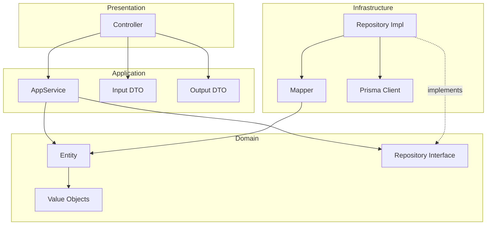
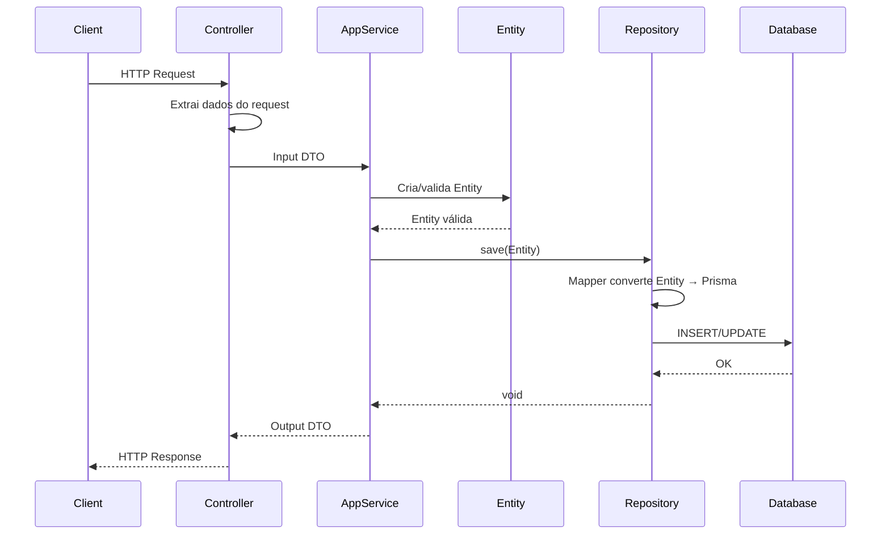
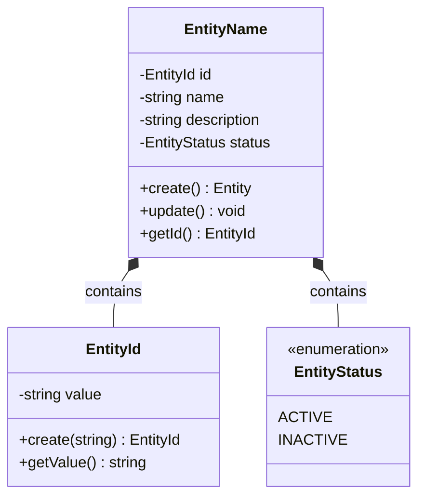
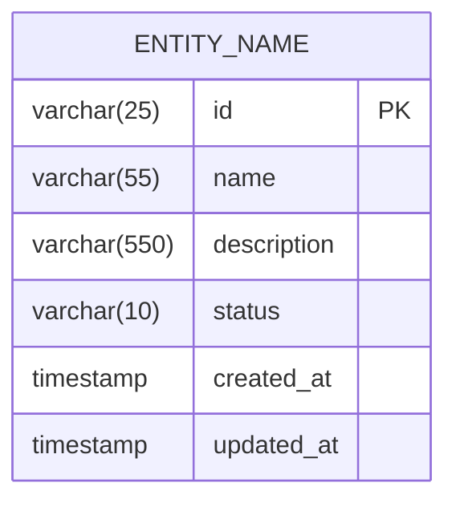
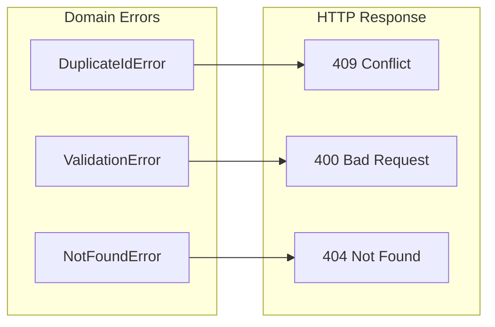

# Design: [NOME DA CAPABILITY]

**Created**: [DATE]  
**Spec**: [./spec.md](./spec.md)  
**Project**: [../project.md](../project.md)

---

<!--
  ╔═══════════════════════════════════════════════════════════════════════════╗
  ║  DESIGN TÉCNICO - Define COMO a capability será implementada              ║
  ║                                                                           ║
  ║  Este documento é a inteligência do arquiteto/senior dev.                 ║
  ║  Foca em DECISÕES, FLUXOS e ORGANIZAÇÃO - não em código.                  ║
  ║                                                                           ║
  ║  Usa diagramas Mermaid para visualização.                                 ║
  ║  Segue a arquitetura definida em: ../project.md                           ║
  ╚═══════════════════════════════════════════════════════════════════════════╝
-->

## Overview

<!--
  Visão geral técnica em 2-3 frases:
  - Qual o fluxo principal?
  - Quais camadas são envolvidas?
  - Qual a complexidade esperada?
-->

[Visão geral técnica]

---

## Component Map

<!--
  FUNÇÃO: Mapear ONDE cada componente fica
  Seguir estrutura de ../project.md
-->

### Domain Layer

| Tipo | Nome | Responsabilidade |
|------|------|------------------|
| Entity | `[EntityName]` | [o que representa] |
| Value Object | `[VOName]` | [o que valida/encapsula] |
| Repository Interface | `I[EntityName]Repository` | [operações disponíveis] |
| Domain Service | `[ServiceName]` | [regra entre aggregates - se necessário] |

### Application Layer

| Tipo | Nome | Responsabilidade |
|------|------|------------------|
| App Service | `[Action][Entity]Service` | [caso de uso] |
| Input DTO | `[Action][Entity]Input` | [dados de entrada] |
| Output DTO | `[Action][Entity]Output` | [dados de saída] |

### Infrastructure Layer

| Tipo | Nome | Responsabilidade |
|------|------|------------------|
| Repository Impl | `Prisma[Entity]Repository` | [implementa interface do domain] |
| Mapper | `[Entity]Mapper` | [converte Prisma ↔ Domain] |

### Presentation Layer

| Tipo | Nome | Responsabilidade |
|------|------|------------------|
| Controller | `[Entity]Controller` | [endpoints HTTP] |

---

## Dependency Graph

<!--
  FUNÇÃO: Visualizar dependências entre componentes
-->

---

## Data Flow

<!--
  FUNÇÃO: Descrever o fluxo de dados para operações principais
-->

### Fluxo: [Nome da Operação - ex: Criar Entity]

**Transformações de dados:**

| Etapa | De | Para |
|-------|----|----- |
| Controller → AppService | JSON body | Input DTO |
| AppService → Entity | Input DTO | Domain Entity |
| Repository → DB | Domain Entity | Prisma Model |

---

## Entity Structure

<!--
  FUNÇÃO: Definir a estrutura conceitual da Entity
-->

### [EntityName]

**Propriedades:**

| Propriedade | Tipo | Mutável? | Regras |
|-------------|------|----------|--------|
| `id` | EntityId | Não | [regras] |
| `name` | string | Sim | [regras] |
| `status` | EntityStatus | Sim | [valores: active, inactive] |

**Comportamentos:**

| Método | Regras |
|--------|--------|
| `create` | [validações na criação] |
| `update` | [o que pode/não pode mudar] |

---

## Repository Operations

| Operação | Descrição | Usada por |
|----------|-----------|-----------|
| `save(entity)` | Persiste entity | AppService |
| `findById(id)` | Busca por ID | AppService |
| `existsById(id)` | Verifica existência | AppService |

---

## Database Model

### Tabela: `[table_name]`

| Coluna | Tipo | Constraints |
|--------|------|-------------|
| `id` | VARCHAR(25) | PK |
| `name` | VARCHAR(55) | NOT NULL |
| `description` | VARCHAR(550) | NOT NULL |
| `status` | VARCHAR(10) | NOT NULL, DEFAULT 'active' |
| `created_at` | TIMESTAMP | NOT NULL, DEFAULT now() |
| `updated_at` | TIMESTAMP | NOT NULL, auto-update |

---

## API Endpoints

| Método | Path | Operação | Sucesso | Erros |
|--------|------|----------|---------|-------|
| POST | `/[resource]` | Criar | 201 | 400, 409 |
| PATCH | `/[resource]/:id` | Atualizar | 200 | 400, 404 |
| GET | `/[resource]/:id` | Buscar | 200 | 404 |

---

## Error Handling

| Erro de Domínio | Quando Ocorre | HTTP Status | Código |
|-----------------|---------------|-------------|--------|
| `DuplicateIdError` | ID já existe | 409 | `DUPLICATE_ID` |
| `ValidationError` | Dados inválidos | 400 | `VALIDATION_ERROR` |
| `NotFoundError` | Entity não existe | 404 | `NOT_FOUND` |

---

## Technical Decisions

<!--
  FUNÇÃO: Documentar decisões técnicas específicas desta capability
-->

### Decisão 1: [Título]

**Contexto**: [Situação que exigiu decisão]

**Decisão**: [O que foi decidido]

**Justificativa**: [Por que]

---

## Implementation Notes

<!--
  Notas importantes para quem for implementar
-->

- [Nota 1 - algo que precisa de atenção]
- [Nota 2 - ordem de implementação recomendada]
- [Nota 3 - dependências com outras capabilities]

---
