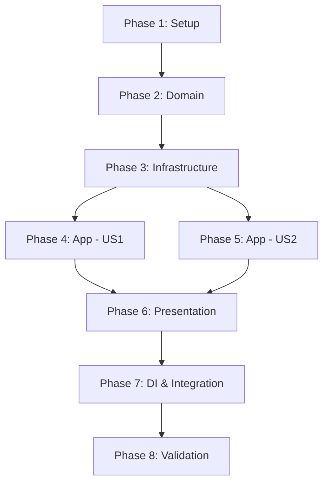

# Plan: [NOME DA CAPABILITY]

**Created**: [DATE]  
**Spec**: [./spec.md](./spec.md)  
**Design**: [./design.md](./design.md)  
**Project**: [../project.md](../project.md)

---

<!--
  ╔═══════════════════════════════════════════════════════════════════════════╗
  ║  PLANO DE EXECUÇÃO - Define QUANDO fazer cada task                        ║
  ║                                                                           ║
  ║  Este documento contém APENAS tasks de execução.                          ║
  ║  Decisões de negócio → spec.md                                            ║
  ║  Decisões técnicas → design.md                                            ║
  ║  Padrões do projeto → project.md                                          ║
  ║                                                                           ║
  ║  REGRAS PARA TASKS:                                                       ║
  ║  - Atômicas: uma task = uma unidade de trabalho                           ║
  ║  - Verificáveis: deve ser possível validar se está completa               ║
  ║  - Independentes: minimizar dependências entre tasks                      ║
  ╚═══════════════════════════════════════════════════════════════════════════╝
-->

## Phase 1: Setup

**Objetivo**: Preparar estrutura base para a capability

| ID | Task | Verificação |
|----|------|-------------|
| T001 | Criar migration Prisma para tabela `[entity]` | `npx prisma migrate dev` executa sem erro |
| T002 | Gerar Prisma Client | `npx prisma generate` executa sem erro |

**Checkpoint**: Schema do banco criado e Prisma Client disponível

---

## Phase 2: Domain Layer

**Objetivo**: Implementar entidades e regras de negócio puras

<!--
  Seguir design.md seção "Entity Structure"
  Seguir project.md seção "Domain Layer"
-->

| ID | Task | Verificação |
|----|------|-------------|
| T003 | Criar Value Object `[EntityId]` com validação de formato | Teste unitário passa |
| T004 | Criar Value Object `[EntityStatus]` com valores permitidos | Teste unitário passa |
| T005 | Criar Entity `[EntityName]` com factory method `create()` | Teste unitário passa |
| T006 | Implementar método `update()` na Entity | Teste unitário passa |
| T007 | Criar interface `I[EntityName]Repository` | Arquivo criado, TypeScript compila |

**Checkpoint**: Domain completo e testado isoladamente

---

## Phase 3: Infrastructure Layer

**Objetivo**: Implementar persistência

<!--
  Seguir design.md seção "Repository Operations" e "Database Model"
  Seguir project.md seção "Infrastructure Layer"
-->

| ID | Task | Verificação |
|----|------|-------------|
| T008 | Criar `[EntityName]Mapper` (Prisma ↔ Domain) | TypeScript compila |
| T009 | Implementar `Prisma[EntityName]Repository.save()` | Teste de integração passa |
| T010 | Implementar `Prisma[EntityName]Repository.findById()` | Teste de integração passa |
| T011 | Implementar `Prisma[EntityName]Repository.existsById()` | Teste de integração passa |

**Checkpoint**: Repository funcional com banco de dados

---

## Phase 4: Application Layer - US1 [Criar]

**Objetivo**: Implementar caso de uso de criação

<!--
  Seguir spec.md User Story 1
  Seguir design.md seção "Application Services"
-->

| ID | Task | Verificação |
|----|------|-------------|
| T012 | Criar `Create[EntityName]Input` DTO | TypeScript compila |
| T013 | Criar `Create[EntityName]Output` DTO | TypeScript compila |
| T014 | Implementar `Create[EntityName]Service` | Teste unitário passa |
| T015 | Tratar erro de ID duplicado no service | Teste unitário do cenário de erro passa |

**Checkpoint**: Caso de uso de criação funcional

---

## Phase 5: Application Layer - US2 [Atualizar]

**Objetivo**: Implementar caso de uso de atualização

<!--
  Seguir spec.md User Story 2
-->

| ID | Task | Verificação |
|----|------|-------------|
| T016 | Criar `Update[EntityName]Input` DTO | TypeScript compila |
| T017 | Criar `Update[EntityName]Output` DTO | TypeScript compila |
| T018 | Implementar `Update[EntityName]Service` | Teste unitário passa |
| T019 | Tratar erro de entidade não encontrada | Teste unitário do cenário de erro passa |
| T020 | Garantir que `id` não pode ser alterado | Teste unitário passa |

**Checkpoint**: Caso de uso de atualização funcional

---

## Phase 6: Presentation Layer

**Objetivo**: Expor endpoints HTTP

<!--
  Seguir design.md seção "API Endpoints"
-->

| ID | Task | Verificação |
|----|------|-------------|
| T021 | Criar `[EntityName]Controller` com injeção de dependências | TypeScript compila |
| T022 | Implementar endpoint POST `/[resource]` | Teste de integração passa |
| T023 | Implementar endpoint PATCH `/[resource]/:id` | Teste de integração passa |
| T024 | Implementar endpoint GET `/[resource]/:id` | Teste de integração passa |
| T025 | Mapear erros de domínio para HTTP status | Teste de integração dos cenários de erro passa |

**Checkpoint**: API funcional e respondendo corretamente

---

## Phase 7: DI & Integration

**Objetivo**: Integrar todos os componentes

<!--
  Seguir project.md seção "Dependency Injection"
-->

| ID | Task | Verificação |
|----|------|-------------|
| T026 | Registrar `[EntityName]Repository` no DI | Bootstrap executa sem erro |
| T027 | Registrar services de `[EntityName]` no DI | Bootstrap executa sem erro |
| T028 | Registrar `[EntityName]Controller` no DI | Bootstrap executa sem erro |
| T029 | Registrar rotas do controller | Rotas aparecem na listagem |

**Checkpoint**: Aplicação sobe e rotas respondem

---

## Phase 8: Validation

**Objetivo**: Validar capability completa

| ID | Task | Verificação |
|----|------|-------------|
| T030 | Rodar todos os testes unitários | `npm test` passa |
| T031 | Rodar todos os testes de integração | Testes de integração passam |
| T032 | Testar fluxo completo via API | Requisições retornam esperado |
| T033 | Validar Acceptance Criteria do spec.md | Todos os cenários Given/When/Then funcionam |

**Checkpoint**: Capability completa e validada

---

## Dependencies

---

## Execution Notes

<!--
  Notas para quem (ou o quê) for executar o plan
-->

- Cada task deve ser commitada separadamente (ou em grupos lógicos pequenos)
- Se uma task falhar, resolver antes de prosseguir
- Checkpoints são pontos de validação - não avançar se checkpoint não passou
- Testes devem ser criados junto com a implementação (mesma task)

---
